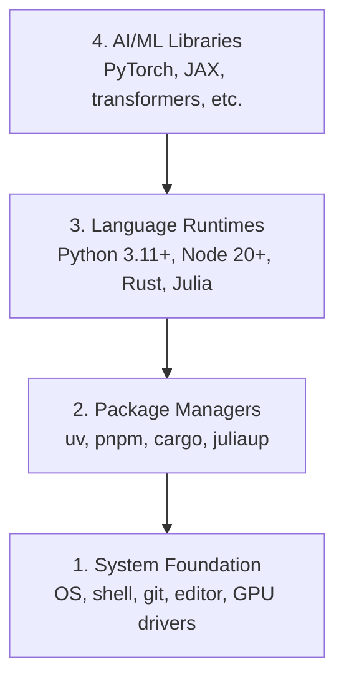

# 开发环境

> 工具塑造思维。一次配好，终身受益。

**Type:** Build
**Languages:** Python, Node.js, Rust
**Prerequisites:** None
**Time:** ~45 minutes

## 学习目标

- 从零搭建 Python 3.11+、Node.js 20+ 和 Rust 工具链
- 配置虚拟环境和包管理器以实现可复现构建
- 验证 GPU 访问（CUDA/MPS）并运行测试张量运算
- 理解四层技术栈：系统层、包管理器层、运行时层、AI 库层

## 问题所在

你即将通过 200 多节课学习 AI 工程，使用 Python、TypeScript、Rust 和 Julia。如果你的环境有问题，每一节课都会变成跟工具较劲，而不是在学习。

大多数人跳过环境配置。然后花好几个小时调试 import 错误、版本冲突和缺少的 CUDA 驱动。我们这次一次性做好。

## 核心概念

AI 工程环境有四层：



我们自底向上安装。每一层依赖于它下面的一层。

## 动手构建

### 步骤 1：系统基础层

检查你的系统并安装基础工具。

```bash
# macOS
xcode-select --install
brew install git curl wget

# Ubuntu/Debian
sudo apt update && sudo apt install -y build-essential git curl wget

# Windows (use WSL2)
wsl --install -d Ubuntu-24.04
```

### 步骤 2：使用 uv 安装 Python

我们使用 `uv` ——它比 pip 快 10-100 倍，并自动管理虚拟环境。

```bash
curl -LsSf https://astral.sh/uv/install.sh | sh

uv python install 3.12

uv venv
source .venv/bin/activate  # or .venv\Scripts\activate on Windows

uv pip install numpy matplotlib jupyter
```

验证：

```python
import sys
print(f"Python {sys.version}")

import numpy as np
print(f"NumPy {np.__version__}")
a = np.array([1, 2, 3])
print(f"Vector: {a}, dot product with itself: {np.dot(a, a)}")
```

### 步骤 3：使用 pnpm 安装 Node.js

用于 TypeScript 课程（agents、MCP servers、web apps）。

```bash
curl -fsSL https://fnm.vercel.app/install | bash
fnm install 22
fnm use 22

npm install -g pnpm

node -e "console.log('Node', process.version)"
```

### 步骤 4：Rust

用于性能关键课程（inference (推理)、系统编程）。

```bash
curl --proto '=https' --tlsv1.2 -sSf https://sh.rustup.rs | sh

rustc --version
cargo --version
```

### 步骤 5：Julia（可选）

用于 Julia 大显身手的数学密集课程。

```bash
curl -fsSL https://install.julialang.org | sh

julia -e 'println("Julia ", VERSION)'
```

### 步骤 6：GPU 配置（如果你有 GPU）

```bash
# NVIDIA
nvidia-smi

# Install PyTorch with CUDA
uv pip install torch torchvision torchaudio --index-url https://download.pytorch.org/whl/cu124
```

```python
import torch
print(f"CUDA available: {torch.cuda.is_available()}")
if torch.cuda.is_available():
    print(f"GPU: {torch.cuda.get_device_name(0)}")
```

没有 GPU？没关系。大多数课程可以在 CPU 上运行。对于训练密集的课程，使用 Google Colab 或云 GPU。

### 步骤 7：验证一切

运行验证脚本：

```bash
python phases/00-setup-and-tooling/01-dev-environment/code/verify.py
```

## 实际使用

你的环境现在已经为本课程的所有课程准备好了。以下是各语言的使用场景：

| 语言 | 使用阶段 | 包管理器 |
|----------|---------|-----------------|
| Python | Phases 1-12 (ML, DL, NLP, Vision, Audio, LLMs) | uv |
| TypeScript | Phases 13-17 (Tools, Agents, Swarms, Infra) | pnpm |
| Rust | Phases 12, 15-17 (Performance-critical systems) | cargo |
| Julia | Phase 1 (Math foundations) | Pkg |

## 交付成果

本课程产出一个验证脚本，任何人都可以运行来检查自己的环境配置。

参见 `outputs/prompt-env-check.md`，其中包含一个帮助 AI 助手诊断环境问题的提示词。

## 练习

1. 运行验证脚本并修复所有失败项
2. 为本课程创建一个 Python 虚拟环境并安装 PyTorch
3. 用这四种语言各写一个 "hello world" 并运行
