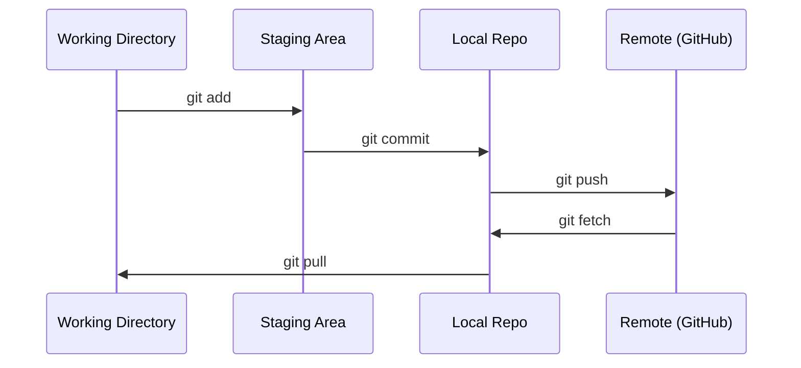

# Git 与协作

> 版本控制不是可选项。你在这里构建的每个实验、每个模型、每节课都会被追踪。

**Type:** Learn
**Languages:** --
**Prerequisites:** Phase 0, Lesson 01
**Time:** ~30 minutes

## 学习目标

- 配置 git 身份并使用 add、commit 和 push 的日常工作流
- 创建和合并分支，进行隔离实验而不破坏 main
- 编写排除模型检查点和大二进制文件的 `.gitignore`
- 使用 `git log` 浏览提交历史以理解项目演进

## 问题所在

你即将在 20 个阶段中编写数百个代码文件。没有版本控制，你将丢失工作成果、做出无法撤销的破坏，也没有办法与他人协作。

Git 是工具。GitHub 是代码存放的地方。本课只覆盖本课程所需的内容，不多不少。

## 核心概念



记住三件事：
1. 经常保存（`git commit`）
2. 推送到远程（`git push`）
3. 用分支做实验（`git checkout -b experiment`）

## 动手构建

### 步骤 1：配置 git

```bash
git config --global user.name "Your Name"
git config --global user.email "you@example.com"
```

### 步骤 2：日常工作流

```bash
git status
git add file.py
git commit -m "Add perceptron implementation"
git push origin main
```

### 步骤 3：用分支做实验

```bash
git checkout -b experiment/new-optimizer

# ... make changes, commit ...

git checkout main
git merge experiment/new-optimizer
```

### 步骤 4：使用本课程仓库

```bash
git clone https://github.com/rohitg00/ai-engineering-from-scratch.git
cd ai-engineering-from-scratch

git checkout -b my-progress
# work through lessons, commit your code
git push origin my-progress
```

## 实际使用

对于本课程，你只需要这些命令：

| 命令 | 使用时机 |
|---------|------|
| `git clone` | 获取课程仓库 |
| `git add` + `git commit` | 保存你的工作 |
| `git push` | 备份到 GitHub |
| `git checkout -b` | 在不破坏 main 的情况下尝试新东西 |
| `git log --oneline` | 查看你做了什么 |

仅此而已。本课程不需要 rebase、cherry-pick 或 submodules。

## 练习

1. 克隆本仓库，创建一个名为 `my-progress` 的分支，创建一个文件，提交并推送
2. 创建一个 `.gitignore`，排除模型检查点文件（`.pt`, `.pth`, `.safetensors`）
3. 用 `git log --oneline` 查看本仓库的提交历史，了解课程是如何添加的

## 关键术语

| 术语 | 人们常说的 | 实际含义 |
|------|----------------|----------------------|
| Commit | "保存" | 你的整个项目在某一时刻的快照 |
| Branch | "副本" | 一个指向提交的指针，随着你的工作向前移动 |
| Merge | "合并代码" | 将一个分支的更改应用到另一个分支 |
| Remote | "云端" | 托管在其他地方的仓库副本（GitHub, GitLab） |
