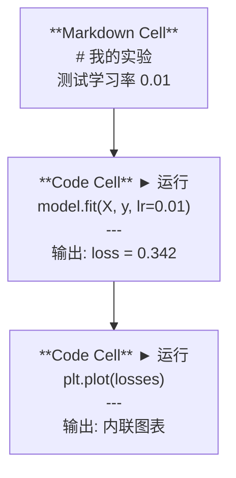
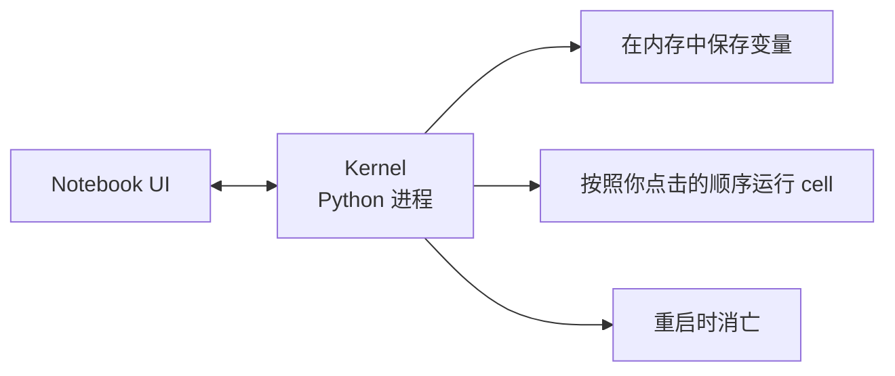

# Jupyter Notebook

> Notebook 是 AI 工程的实验台。你在这里做原型，然后把可行的方案搬进生产环境。

**Type:** Build
**Languages:** Python
**Prerequisites:** Phase 0, Lesson 01
**Time:** ~30 分钟

## 学习目标

- 安装并启动 JupyterLab、Jupyter Notebook 或安装了 Jupyter 扩展的 VS Code
- 使用 magic command (魔法命令)（`%timeit`、`%%time`、`%matplotlib inline`）进行基准测试和内联可视化
- 区分何时使用 notebook 何时使用脚本，并应用"在 notebook 中探索，在脚本中交付"的工作流
- 识别并避免常见 notebook 陷阱：乱序执行、隐藏状态和内存泄漏

## 问题所在

每一篇 AI 论文、教程和 Kaggle 比赛都使用 Jupyter notebook。它们让你分段运行代码、内联查看输出、将代码与说明混合、快速迭代。如果你试图不使用 notebook 来学习 AI，就像没有草稿纸做数学作业。

但 notebook 有真实的陷阱。人们把它们用于所有事情，包括它们不擅长的事情。知道何时使用 notebook、何时使用脚本，将在日后为你省去调试噩梦。

## 核心概念

Notebook 是一个 cell (单元格) 列表。每个 cell 要么是代码，要么是文本。



kernel (内核) 是一个在后台运行的 Python 进程。当你运行一个 cell 时，它将代码发送给 kernel，kernel 执行代码并将结果返回。所有 cell 共享同一个 kernel，因此变量在 cell 之间持久存在。



"按照你点击的顺序"这一特性既是超能力，也是自毁按钮。

## 动手构建

### 步骤 1：选择你的界面

三种界面，同一种格式：

| 界面 | 安装 | 最适合 |
|------|------|--------|
| JupyterLab | `pip install jupyterlab` 然后 `jupyter lab` | 完整 IDE 体验、多标签页、文件浏览器、终端 |
| Jupyter Notebook | `pip install notebook` 然后 `jupyter notebook` | 简单轻量，一次只打开一个 notebook |
| VS Code | 安装 "Jupyter" 扩展 | 在编辑器内使用、git 集成、调试 |

三种界面读写同一种 `.ipynb` 文件。选你喜欢的。JupyterLab 在 AI 工作中最常见。

```bash
pip install jupyterlab
jupyter lab
```

### 步骤 2：关键键盘快捷键

你在两种模式下操作。按 `Escape` 进入命令模式（左侧蓝色条），按 `Enter` 进入编辑模式（绿色条）。

**命令模式（最常用）：**

| 按键 | 操作 |
|------|------|
| `Shift+Enter` | 运行 cell，跳到下一个 |
| `A` | 在上方插入 cell |
| `B` | 在下方插入 cell |
| `DD` | 删除 cell |
| `M` | 转换为 markdown |
| `Y` | 转换为代码 |
| `Z` | 撤销 cell 操作 |
| `Ctrl+Shift+H` | 显示所有快捷键 |

**编辑模式：**

| 按键 | 操作 |
|------|------|
| `Tab` | 自动补全 |
| `Shift+Tab` | 显示函数签名 |
| `Ctrl+/` | 切换注释 |

`Shift+Enter` 是你每天会用上千次的那个。先学会它。

### 步骤 3：Cell 类型

**代码 cell** 运行 Python 并显示输出：

```python
import numpy as np
data = np.random.randn(1000)
data.mean(), data.std()
```

输出：`(0.0032, 0.9987)`

**Markdown cell** 渲染格式化文本。用它们记录你在做什么以及为什么。支持标题、粗体、斜体、LaTeX 数学公式（`$E = mc^2$`）、表格和图片。

### 步骤 4：Magic 命令

这些不是 Python。它们是 Jupyter 特有的命令，以 `%`（行 magic）或 `%%`（cell magic）开头。

**计时你的代码：**

```python
%timeit np.random.randn(10000)
```

输出：`45.2 us +/- 1.3 us per loop`

```python
%%time
model.fit(X_train, y_train, epochs=10)
```

输出：`Wall time: 2.34 s`

`%timeit` 多次运行代码并取平均值。`%%time` 只运行一次。微基准测试用 `%timeit`，训练运行用 `%%time`。

**启用内联绘图：**

```python
%matplotlib inline
```

之后每个 `plt.plot()` 或 `plt.show()` 都会直接在 notebook 中渲染。

**在不离开 notebook 的情况下安装包：**

```python
!pip install scikit-learn
```

`!` 前缀可以运行任何 shell 命令。

**检查环境变量：**

```python
%env CUDA_VISIBLE_DEVICES
```

### 步骤 5：内联显示富输出

Notebook 自动显示 cell 中最后一个表达式。但你可以控制它：

```python
import pandas as pd

df = pd.DataFrame({
    "model": ["Linear", "Random Forest", "Neural Net"],
    "accuracy": [0.72, 0.89, 0.94],
    "training_time": [0.1, 2.3, 45.6]
})
df
```

这会渲染一个格式化的 HTML 表格，而非文本输出。图表也一样：

```python
import matplotlib.pyplot as plt

plt.figure(figsize=(8, 4))
plt.plot([1, 2, 3, 4], [1, 4, 2, 3])
plt.title("Inline Plot")
plt.show()
```

图表直接显示在 cell 下方。这就是 notebook 主导 AI 工作的原因——你可以同时看到数据、图表和代码。

对于图片：

```python
from IPython.display import Image, display
display(Image(filename="architecture.png"))
```

### 步骤 6：Google Colab

Colab 是一个免费的云端 Jupyter notebook。它提供 GPU、预装的库和 Google Drive 集成。无需设置。

1. 访问 [colab.research.google.com](https://colab.research.google.com)
2. 上传本课程的任何 `.ipynb` 文件
3. 运行时 > 更改运行时类型 > T4 GPU（免费）

Colab 与本地 Jupyter 的差异：
- 文件在会话间不会持久保存（保存到 Drive 或下载）
- 预装：numpy、pandas、matplotlib、torch、tensorflow、sklearn
- `from google.colab import files` 来上传/下载文件
- `from google.colab import drive; drive.mount('/content/drive')` 获取持久存储
- 免费版在 90 分钟不活动后会话超时

## 实际应用

### Notebook 与脚本：何时使用哪个

| 使用 Notebook 的场景 | 使用脚本的场景 |
|---------------------|---------------|
| 探索数据集 | 训练流水线 |
| 原型验证模型 | 可复用工具 |
| 可视化结果 | 任何使用 `if __name__` 的代码 |
| 解释你的工作 | 按计划运行的代码 |
| 快速实验 | 生产代码 |
| 课程练习 | 包和库 |

原则：**在 notebook 中探索，在脚本中交付**。

AI 中常见的工作流：
1. 在 notebook 中探索数据
2. 在 notebook 中原型验证模型
3. 一旦可行，将代码移到 `.py` 文件
4. 将 `.py` 文件导入回 notebook 进行进一步实验

### 常见陷阱

**乱序执行。** 你运行 cell 5，然后 cell 2，然后 cell 7。Notebook 在你的机器上可以运行，但别人从头到尾运行时就坏了。修复：分享前执行 Kernel > Restart & Run All。

**隐藏状态。** 你删除了一个 cell，但它创建的变量仍在内存中。Notebook 看起来干净，但依赖于一个幽灵 cell。修复：定期重启 kernel。

**内存泄漏。** 加载一个 4GB 数据集，训练一个模型，再加载另一个数据集。什么都不会被释放。修复：`del variable_name` 然后 `gc.collect()`，或重启 kernel。

## 交付物

本课产出：
- `outputs/prompt-notebook-helper.md` 用于调试 notebook 问题

## 练习

1. 打开 JupyterLab，创建一个 notebook，使用 `%timeit` 比较列表推导式与 numpy 创建 100,000 个随机数的数组
2. 创建一个包含 markdown 和代码 cell 的 notebook，加载一个 CSV，显示 dataframe，并绘制图表。然后运行 Kernel > Restart & Run All 验证从头到尾可以正常运行
3. 将 `code/notebook_tips.py` 中的代码粘贴到 Colab notebook 中，使用免费 GPU 运行

## 关键术语

| 术语 | 人们常说的 | 实际含义 |
|------|----------|---------|
| Kernel | "运行我代码的那个东西" | 一个独立的 Python 进程，执行 cell 并在内存中保存变量 |
| Cell | "一个代码块" | Notebook 中一个可独立运行的单元，要么是代码要么是 markdown |
| Magic command | "Jupyter 技巧" | 以 `%` 或 `%%` 为前缀的特殊命令，用于控制 notebook 环境 |
| `.ipynb` | "Notebook 文件" | 包含 cell、输出和元数据的 JSON 文件。全称 IPython Notebook |

## 延伸阅读

- [JupyterLab 文档](https://jupyterlab.readthedocs.io/) 了解完整功能
- [Google Colab FAQ](https://research.google.com/colaboratory/faq.html) 了解 Colab 特有的限制和功能
- [28 Jupyter Notebook 技巧](https://www.dataquest.io/blog/jupyter-notebook-tips-tricks-shortcuts/) 了解高级用户快捷键
