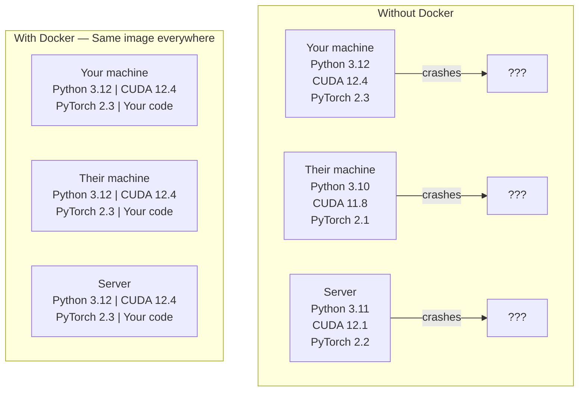

# Docker for AI

> 容器让"在我机器上能跑"成为历史。

**Type:** Build
**Languages:** Docker
**Prerequisites:** Phase 0, Lessons 01 and 03
**Time:** ~60 分钟

## Learning Objectives

- 使用 Dockerfile 构建包含 CUDA、PyTorch 和 AI 库的 GPU Docker 镜像
- 将宿主目录挂载为卷 (volume)，在容器重建后持久化模型、数据集和代码
- 配置 NVIDIA Container Toolkit 以在容器内暴露 GPU
- 使用 Docker Compose 编排多服务 AI 应用（inference (推理) 服务器 + 向量数据库）

## The Problem

你在自己的笔记本上用 PyTorch 2.3、CUDA 12.4 和 Python 3.12 训练了一个模型。你的同事用的是 PyTorch 2.1、CUDA 11.8 和 Python 3.10。你的模型在他的机器上崩溃了。而你的 Dockerfile 在两台机器上都能工作。

AI 项目是依赖噩梦。一个典型的技术栈包括 Python、PyTorch、CUDA 驱动、cuDNN、系统级 C 库，以及 flash-attn 这样需要精确编译器版本的专业包。Docker 把所有这些打包成一个单一镜像，在任何地方都以相同方式运行。

## The Concept

Docker 将你的代码、运行时、库和系统工具封装成一个称为容器 (container) 的隔离单元。可以把它想象成一台轻量级虚拟机，只不过它共享宿主操作系统内核而非运行自己的内核，因此它在几秒内就能启动，而不是几分钟。



### Why AI projects need Docker more than most

1. **GPU 驱动是脆弱的。** CUDA 12.4 的代码无法在 CUDA 11.8 上运行。Docker 将 CUDA 工具包隔离在容器内部，同时通过 NVIDIA Container Toolkit 共享宿主的 GPU 驱动。

2. **模型权重体积庞大。** 一个 7B 参数模型在 fp16 精度下有 14 GB。你不想在每次重建时都重新下载它。Docker 卷让你可以从宿主挂载模型目录。

3. **多服务架构很常见。** 一个真正的 AI 应用不仅仅是一个 Python 脚本。它是一个 inference 服务器、一个用于 RAG 的向量数据库，也许还有一个 Web 前端。Docker Compose 用一条命令编排所有这些服务。

### Key vocabulary

| Term | What it means |
|------|---------------|
| Image | 只读模板。你的配方。从 Dockerfile 构建。 |
| Container | 镜像的运行实例。你的厨房。 |
| Dockerfile | 构建镜像的指令。逐层构建。 |
| Volume | 在容器重启后仍然存活的持久存储。 |
| docker-compose | 用 YAML 定义多容器应用的工具。 |

### Common container patterns in AI

```
Dev Container
  完整工具包。编辑器支持。Jupyter。调试工具。
  在开发和实验期间使用。

Training Container
  最小化。只有训练脚本和依赖。
  在 GPU 集群上运行。无编辑器，无 Jupyter。

Inference Container
  针对服务优化。小镜像。快速冷启动。
  在生产环境中运行于负载均衡器之后。
```

## Build It

### Step 1: Install Docker

```bash
# macOS
brew install --cask docker
open /Applications/Docker.app

# Ubuntu
curl -fsSL https://get.docker.com | sh
sudo usermod -aG docker $USER
# Log out and back in for group change to take effect
```

验证：

```bash
docker --version
docker run hello-world
```

### Step 2: Install NVIDIA Container Toolkit (Linux with NVIDIA GPU)

这让 Docker 容器可以访问你的 GPU。macOS 和 Windows (WSL2) 用户可以跳过此步骤；Docker Desktop 在这些平台上的 GPU 直通方式不同。

```bash
distribution=$(. /etc/os-release;echo $ID$VERSION_ID)
curl -fsSL https://nvidia.github.io/libnvidia-container/gpgkey | sudo gpg --dearmor -o /usr/share/keyrings/nvidia-container-toolkit-keyring.gpg
curl -s -L https://nvidia.github.io/libnvidia-container/$distribution/libnvidia-container.list | \
    sed 's#deb https://#deb [signed-by=/usr/share/keyrings/nvidia-container-toolkit-keyring.gpg] https://#g' | \
    sudo tee /etc/apt/sources.list.d/nvidia-container-toolkit.list

sudo apt-get update
sudo apt-get install -y nvidia-container-toolkit
sudo nvidia-ctk runtime configure --runtime=docker
sudo systemctl restart docker
```

在容器内测试 GPU 访问：

```bash
docker run --rm --gpus all nvidia/cuda:12.4.1-base-ubuntu22.04 nvidia-smi
```

如果你看到了 GPU 信息，说明工具包工作正常。

### Step 3: Understand base images

选择正确的基础镜像可以节省数小时的调试时间。

```
nvidia/cuda:12.4.1-devel-ubuntu22.04
  完整 CUDA 工具包。包含编译器。
  用途：构建需要 nvcc 的包（flash-attn, bitsandbytes）
  大小：~4 GB

nvidia/cuda:12.4.1-runtime-ubuntu22.04
  仅 CUDA 运行时。无编译器。
  用途：运行预构建的代码
  大小：~1.5 GB

pytorch/pytorch:2.3.1-cuda12.4-cudnn9-runtime
  在 CUDA 之上预装了 PyTorch。
  用途：跳过 PyTorch 安装步骤
  大小：~6 GB

python:3.12-slim
  无 CUDA。仅 CPU。
  用途：CPU 上的 inference，轻量工具
  大小：~150 MB
```

### Step 4: Write a Dockerfile for AI development

以下是 `code/Dockerfile` 中的 Dockerfile。逐步了解：

```dockerfile
FROM nvidia/cuda:12.4.1-devel-ubuntu22.04

ENV DEBIAN_FRONTEND=noninteractive
ENV PYTHONUNBUFFERED=1

RUN apt-get update && apt-get install -y --no-install-recommends \
    python3.12 \
    python3.12-venv \
    python3.12-dev \
    python3-pip \
    git \
    curl \
    build-essential \
    && rm -rf /var/lib/apt/lists/*

RUN update-alternatives --install /usr/bin/python python /usr/bin/python3.12 1

RUN python -m pip install --no-cache-dir --upgrade pip setuptools wheel

RUN python -m pip install --no-cache-dir \
    torch==2.3.1 \
    torchvision==0.18.1 \
    torchaudio==2.3.1 \
    --index-url https://download.pytorch.org/whl/cu124

RUN python -m pip install --no-cache-dir \
    numpy \
    pandas \
    scikit-learn \
    matplotlib \
    jupyter \
    transformers \
    datasets \
    accelerate \
    safetensors

WORKDIR /workspace

VOLUME ["/workspace", "/models"]

EXPOSE 8888

CMD ["python"]
```

构建：

```bash
docker build -t ai-dev -f phases/00-setup-and-tooling/07-docker-for-ai/code/Dockerfile .
```

首次构建需要一些时间（下载 CUDA 基础镜像 + PyTorch）。后续构建使用缓存层。

运行：

```bash
docker run --rm -it --gpus all \
    -v $(pwd):/workspace \
    -v ~/models:/models \
    ai-dev python -c "import torch; print(f'PyTorch {torch.__version__}, CUDA: {torch.cuda.is_available()}')"
```

在容器内运行 Jupyter：

```bash
docker run --rm -it --gpus all \
    -v $(pwd):/workspace \
    -v ~/models:/models \
    -p 8888:8888 \
    ai-dev jupyter notebook --ip=0.0.0.0 --port=8888 --no-browser --allow-root
```

### Step 5: Volume mounts for data and models

卷挂载对 AI 工作至关重要。没有它们，你 14 GB 的模型下载会在容器停止时消失。

```bash
# Mount your code
-v $(pwd):/workspace

# Mount a shared models directory
-v ~/models:/models

# Mount datasets
-v ~/datasets:/data
```

在你的训练脚本内部，从挂载路径加载：

```python
from transformers import AutoModel

model = AutoModel.from_pretrained("/models/llama-7b")
```

模型存在于你的宿主文件系统上。你可以随意重建容器，无需重新下载。

### Step 6: Docker Compose for multi-service AI apps

一个真正的 RAG 应用需要一个 inference 服务器和一个向量数据库。Docker Compose 用一条命令同时运行两者。

参见 `code/docker-compose.yml`：

```yaml
services:
  ai-dev:
    build:
      context: .
      dockerfile: Dockerfile
    deploy:
      resources:
        reservations:
          devices:
            - driver: nvidia
              count: all
              capabilities: [gpu]
    volumes:
      - ../../../:/workspace
      - ~/models:/models
      - ~/datasets:/data
    ports:
      - "8888:8888"
    stdin_open: true
    tty: true
    command: jupyter notebook --ip=0.0.0.0 --port=8888 --no-browser --allow-root

  qdrant:
    image: qdrant/qdrant:v1.12.5
    ports:
      - "6333:6333"
      - "6334:6334"
    volumes:
      - qdrant_data:/qdrant/storage

volumes:
  qdrant_data:
```

启动所有服务：

```bash
cd phases/00-setup-and-tooling/07-docker-for-ai/code
docker compose up -d
```

现在你的 AI 开发容器可以通过服务名访问向量数据库 `http://qdrant:6333`。Docker Compose 自动创建共享网络。

从 AI 容器内部测试连接：

```python
from qdrant_client import QdrantClient

client = QdrantClient(host="qdrant", port=6333)
print(client.get_collections())
```

停止所有服务：

```bash
docker compose down
```

加 `-v` 同时删除 qdrant 卷：

```bash
docker compose down -v
```

### Step 7: Useful Docker commands for AI work

```bash
# List running containers
docker ps

# List all images and their sizes
docker images

# Remove unused images (reclaim disk space)
docker system prune -a

# Check GPU usage inside a running container
docker exec -it <container_id> nvidia-smi

# Copy a file from container to host
docker cp <container_id>:/workspace/results.csv ./results.csv

# View container logs
docker logs -f <container_id>
```

## Use It

你现在拥有了一个可复现的 AI 开发环境。在本课程的剩余部分中：

- 使用 `docker compose up` 同时启动开发环境和向量数据库
- 将代码、模型和数据挂载为卷，这样在重建之间不会丢失任何东西
- 当课程需要新的 Python 包时，将其添加到 Dockerfile 并重新构建
- 与队友共享你的 Dockerfile。他们会获得完全相同的环境。

### No GPU?

移除 `--gpus all` 标志和 NVIDIA deploy 配置块。容器仍然可以用于基于 CPU 的课程。PyTorch 会自动检测 CUDA 的缺失并回退到 CPU。

## Exercises

1. 构建 Dockerfile 并在容器内运行 `python -c "import torch; print(torch.__version__)"`
2. 启动 docker-compose 栈并验证从 AI 容器可以访问 Qdrant `http://qdrant:6333/collections`
3. 将 `flask` 添加到 Dockerfile，重新构建，并在端口 5000 上运行一个简单的 API 服务器。用 `-p 5000:5000` 映射端口
4. 用 `docker images` 测量镜像大小。尝试将基础镜像从 `devel` 切换为 `runtime` 并比较大小

## Key Terms

| Term | What people say | What it actually means |
|------|----------------|----------------------|
| Container | "轻量级虚拟机" | 使用宿主内核的隔离进程，拥有自己的文件系统和网络 |
| Image layer | "缓存步骤" | 每个 Dockerfile 指令创建一个层。未更改的层被缓存，因此重建很快。 |
| NVIDIA Container Toolkit | "Docker 里的 GPU" | 一个运行时钩子，通过 `--gpus` 标志将宿主 GPU 暴露给容器 |
| Volume mount | "共享文件夹" | 宿主上的一个目录映射到容器中。更改在容器停止后仍然保留。 |
| Base image | "起点" | 你的 Dockerfile 构建所基于的 `FROM` 镜像。决定了预装了什么。 |
