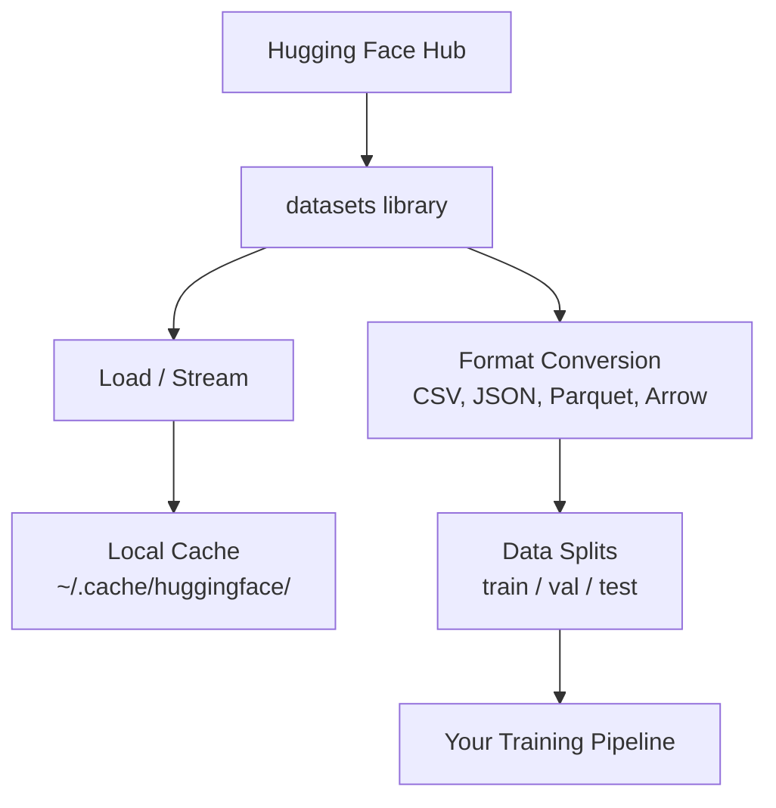

# Data Management

> 数据是燃料。你管理它的方式决定了你的速度。

**Type:** Build
**Language:** Python
**Prerequisites:** Phase 0, Lesson 01
**Time:** ~45 分钟

## Learning Objectives

- 使用 Hugging Face `datasets` 库加载、流式传输和缓存数据集
- 在 CSV、JSON、Parquet 和 Arrow 格式之间转换并解释它们的取舍
- 使用固定随机种子创建可复现的训练/验证/测试数据划分
- 使用 `.gitignore`、Git LFS 或 DVC 管理大型模型和数据集文件

## The Problem

每个 AI 项目都从数据开始。你需要查找数据集、下载它们、在格式之间转换、为训练和评估划分它们，并对它们进行版本控制以便实验可复现。每次手动执行这些操作既慢又容易出错。你需要一个可重复的工作流。

## The Concept



Hugging Face `datasets` 库是 AI 工作中加载数据的标准方式。它开箱即用地处理下载、缓存、格式转换和流式传输。

## Build It

### Step 1: Install the datasets library

```bash
pip install datasets huggingface_hub
```

### Step 2: Load a dataset

```python
from datasets import load_dataset

dataset = load_dataset("imdb")
print(dataset)
print(dataset["train"][0])
```

这会下载 IMDB 电影评论数据集。首次下载后，它会从 `~/.cache/huggingface/datasets/` 的缓存中加载。

### Step 3: Stream large datasets

某些数据集太大无法放入磁盘。流式传输逐行加载它们，无需下载完整数据集。

```python
dataset = load_dataset("wikimedia/wikipedia", "20220301.en", split="train", streaming=True)

for i, example in enumerate(dataset):
    print(example["title"])
    if i >= 4:
        break
```

流式传输给你一个 `IterableDataset`。你逐行处理数据。内存使用量保持恒定，与数据集大小无关。

### Step 4: Dataset formats

`datasets` 库在底层使用 Apache Arrow。你可以根据管道需求转换为其他格式。

```python
dataset = load_dataset("imdb", split="train")

dataset.to_csv("imdb_train.csv")
dataset.to_json("imdb_train.json")
dataset.to_parquet("imdb_train.parquet")
```

格式对比：

| Format | Size | Read Speed | Best For |
|--------|------|-----------|----------|
| CSV | 大 | 慢 | 人类可读性，电子表格 |
| JSON | 大 | 慢 | API，嵌套数据 |
| Parquet | 小 | 快 | 分析，列式查询 |
| Arrow | 小 | 最快 | 内存中处理（`datasets` 内部使用） |

对于 AI 工作，Parquet 是最佳存储格式。Arrow 是你在内存中使用的格式。CSV 和 JSON 用于数据交换。

### Step 5: Data splits

每个 ML 项目需要三个划分：

- **Train**：模型从中学习（通常 80%）
- **Validation**：在训练过程中检查进度（通常 10%）
- **Test**：训练完成后的最终评估（通常 10%）

某些数据集已经预划分。如果没有，自己划分：

```python
dataset = load_dataset("imdb", split="train")

split = dataset.train_test_split(test_size=0.2, seed=42)
train_val = split["train"].train_test_split(test_size=0.125, seed=42)

train_ds = train_val["train"]
val_ds = train_val["test"]
test_ds = split["test"]

print(f"Train: {len(train_ds)}, Val: {len(val_ds)}, Test: {len(test_ds)}")
```

始终设置种子以确保可复现性。相同的种子每次产生相同的划分。

### Step 6: Download and cache models

模型是大文件。`huggingface_hub` 库处理下载和缓存。

```python
from huggingface_hub import hf_hub_download, snapshot_download

model_path = hf_hub_download(
    repo_id="sentence-transformers/all-MiniLM-L6-v2",
    filename="config.json"
)
print(f"Cached at: {model_path}")

model_dir = snapshot_download("sentence-transformers/all-MiniLM-L6-v2")
print(f"Full model at: {model_dir}")
```

模型缓存到 `~/.cache/huggingface/hub/`。一旦下载，后续运行会立即加载。

### Step 7: Handle large files

模型权重和大型数据集不应放入 git。三个选项：

**选项 A: .gitignore（最简单）**

```
*.bin
*.safetensors
*.pt
*.onnx
data/*.parquet
data/*.csv
models/
```

**选项 B: Git LFS（在 git 中跟踪大文件）**

```bash
git lfs install
git lfs track "*.bin"
git lfs track "*.safetensors"
git add .gitattributes
```

Git LFS 在你的仓库中存储指针，实际文件存储在单独的服务器上。GitHub 提供 1 GB 免费额度。

**选项 C: DVC (数据版本控制)**

```bash
pip install dvc
dvc init
dvc add data/training_set.parquet
git add data/training_set.parquet.dvc data/.gitignore
git commit -m "Track training data with DVC"
```

DVC 创建小型 `.dvc` 文件来指向你的数据。数据本身存储在 S3、GCS 或其他远程存储后端。

| Approach | Complexity | Best For |
|----------|-----------|----------|
| .gitignore | 低 | 个人项目，可以重新获取的已下载数据 |
| Git LFS | 中 | 通过 git 共享模型权重的团队 |
| DVC | 高 | 可复现实验，大型数据集，团队 |

对于本课程，`.gitignore` 就够了。当你需要跨机器复现精确实验时使用 DVC。

### Step 8: Storage patterns

**本地存储**适用于 10 GB 以下的数据集。HF 缓存自动处理。

**云存储**用于更大的数据集或需要跨机器共享的情况：

```python
import os

local_path = os.path.expanduser("~/.cache/huggingface/datasets/")

# s3_path = "s3://my-bucket/datasets/"
# gcs_path = "gs://my-bucket/datasets/"
```

DVC 直接与 S3 和 GCS 集成：

```bash
dvc remote add -d myremote s3://my-bucket/dvc-store
dvc push
```

对于本课程，本地存储已足够。当你在远程 GPU 实例上进行 fine-tuning (微调) 时，云存储才变得相关。

## Datasets Used in This Course

| Dataset | Lessons | Size | What It Teaches |
|---------|---------|------|----------------|
| IMDB | 分词，分类 | 84 MB | 文本分类基础 |
| WikiText | 语言建模 | 181 MB | 下一 token 预测 |
| SQuAD | 问答系统 | 35 MB | 问答，片段 |
| Common Crawl (subset) | Embedding (嵌入 / 词嵌入) | 不定 | 大规模文本处理 |
| MNIST | 视觉基础 | 21 MB | 图像分类基础 |
| COCO (subset) | 多模态 | 不定 | 图像-文本对 |

你不需要现在下载所有这些。每节课会指定它需要什么。

## Use It

运行实用脚本验证一切正常：

```bash
python code/data_utils.py
```

这会下载一个小数据集、转换格式、划分并打印摘要。

## Ship It

本课程产出：
- `code/data_utils.py` - 可复用的数据加载和缓存工具
- `outputs/prompt-data-helper.md` - 用于为任务查找合适数据集的提示

## Exercises

1. 加载 `glue` 数据集的 `mrpc` 配置并检查前 5 个样本
2. 流式传输 `c4` 数据集并计算 10 秒内可以处理多少样本
3. 将数据集转换为 Parquet 并比较文件大小与 CSV 的差异
4. 使用固定种子创建 70/15/15 的训练/验证/测试划分并验证大小

## Key Terms

| Term | What people say | What it actually means |
|------|----------------|----------------------|
| Dataset split | "训练数据" | 在 ML 生命周期不同阶段使用的命名子集（train/val/test） |
| Streaming | "懒加载" | 从远程源逐行处理数据，无需下载完整数据集 |
| Parquet | "压缩的 CSV" | 一种为分析查询和存储效率优化的列式文件格式 |
| Arrow | "快速的 dataframe" | datasets 库内部用于零拷贝读取的内存列式格式 |
| Git LFS | "大文件的 Git" | 一种将大文件存储在 git 仓库外部，同时在版本控制中保留指针的扩展 |
| DVC | "数据的 Git" | 一种与云存储集成的数据集和模型版本控制系统 |
| Cache | "已下载" | 之前获取数据的本地副本，默认存储在 ~/.cache/huggingface/ |
