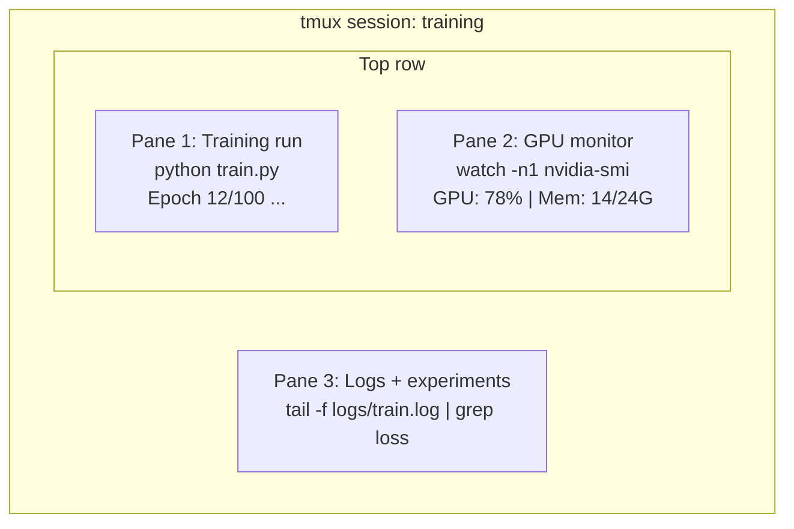

# 终端与 Shell

> 终端是 AI 工程师的家。在这里变得自如。

**Type:** Learn
**Languages:** --
**Prerequisites:** Phase 0, Lesson 01
**Time:** ~35 分钟

## 学习目标

- 使用管道、重定向和 `grep` 从命令行过滤和处理训练日志
- 创建带有多个窗格的持久 tmux 会话，用于同时进行训练和 GPU 监控
- 使用 `htop`、`nvtop` 和 `nvidia-smi` 监控系统和 GPU 资源
- 使用 SSH、`scp` 和 `rsync` 在本地和远程机器之间传输文件

## 问题所在

你在终端中度过的时间比在任何编辑器中都要多。训练运行、GPU 监控、日志追踪、远程 SSH 会话、环境管理。每个 AI 工作流都会触及 shell。如果你在这里很慢，你在任何地方都很慢。

本课涵盖对 AI 工作至关重要的终端技能。不讲 Unix 历史。不讲 Bash 脚本深入。只讲你需要的。

## 核心概念



三个任务同时运行。一个终端。你可以分离、回家、SSH 重新连接、再重新挂载。训练持续运行。

## 动手构建

### 第 1 步：了解你的 shell

检查你正在运行的 shell：

```bash
echo $SHELL
```

大多数系统使用 `bash` 或 `zsh`。两者都可以正常工作。本课程中的命令在两者中都适用。

需要了解的关键内容：

```bash
# 移动位置
cd ~/projects/ai-engineering-from-scratch
pwd
ls -la

# 历史搜索（你将学到的最有用的快捷键）
# Ctrl+R 然后输入之前命令的一部分
# 再按 Ctrl+R 在匹配项之间循环

# 清除终端
clear   # 或 Ctrl+L

# 取消正在运行的命令
# Ctrl+C

# 挂起正在运行的命令（用 fg 恢复）
# Ctrl+Z
```

### 第 2 步：管道和重定向

管道将命令连接在一起。这是你处理日志、过滤输出和串联工具的方式。你会经常用到它。

```bash
# 计算 "loss" 在日志中出现的次数
cat train.log | grep "loss" | wc -l

# 从训练输出中只提取 loss 值
grep "loss:" train.log | awk '{print $NF}' > losses.txt

# 实时监控日志文件更新，过滤错误
tail -f train.log | grep --line-buffered "ERROR"

# 按最终准确率排序实验结果
grep "final_accuracy" results/*.log | sort -t= -k2 -n -r

# 将 stdout 和 stderr 分别重定向到不同文件
python train.py > output.log 2> errors.log

# 将两者重定向到同一文件
python train.py > train_full.log 2>&1
```

你需要掌握的三个重定向操作符：

| 符号 | 作用 |
|--------|-------------|
| `>` | 将 stdout 写入文件（覆盖） |
| `>>` | 将 stdout 追加到文件 |
| `2>` | 将 stderr 写入文件 |
| `2>&1` | 将 stderr 发送到与 stdout 相同的位置 |
| `\|` | 将一个命令的 stdout 作为下一个命令的 stdin |

### 第 3 步：后台进程

训练运行需要数小时。你不想一直保持终端打开。

```bash
# 在后台运行（输出仍然显示在终端）
python train.py &

# 在后台运行，不受挂断信号影响（关闭终端不会杀死它）
nohup python train.py > train.log 2>&1 &

# 检查后台正在运行什么
jobs
ps aux | grep train.py

# 将后台作业调到前台
fg %1

# 终止后台进程
kill %1
# 或者找到它的 PID 然后终止
kill $(pgrep -f "train.py")
```

`&`、`nohup` 和 `screen`/`tmux` 的区别：

| 方法 | 终端关闭后存活？ | 可以重新挂载？ |
|--------|-------------------------|---------------|
| `command &` | 否 | 否 |
| `nohup command &` | 是 | 否（查看日志文件） |
| `screen` / `tmux` | 是 | 是 |

对于超过几分钟的任务，使用 tmux。

### 第 4 步：tmux

tmux 允许你创建带有多个窗格的持久终端会话。这是管理训练运行最实用的工具。

```bash
# 安装
# macOS
brew install tmux
# Ubuntu
sudo apt install tmux

# 启动一个命名会话
tmux new -s training

# 水平分割
# Ctrl+B 然后 "

# 垂直分割
# Ctrl+B 然后 %

# 在窗格之间导航
# Ctrl+B 然后方向键

# 分离（会话继续运行）
# Ctrl+B 然后 d

# 重新挂载
tmux attach -t training

# 列出会话
tmux ls

# 终止会话
tmux kill-session -t training
```

典型的 AI 工作流会话：

```bash
tmux new -s train

# 窗格 1：启动训练
python train.py --epochs 100 --lr 1e-4

# Ctrl+B, " 分割，然后运行 GPU 监控
watch -n1 nvidia-smi

# Ctrl+B, % 垂直分割，追踪日志
tail -f logs/experiment.log

# 现在用 Ctrl+B, d 分离
# SSH 退出，去喝杯咖啡，回来
# tmux attach -t train
```

### 第 5 步：使用 htop 和 nvtop 监控

```bash
# 系统进程（比 top 更好）
htop

# GPU 进程（如果你有 NVIDIA GPU）
# 安装：sudo apt install nvtop（Ubuntu）或 brew install nvtop（macOS）
nvtop

# 不用 nvtop 的快速 GPU 检查
nvidia-smi

# 每秒更新 GPU 使用情况
watch -n1 nvidia-smi

# 查看哪些进程在使用 GPU
nvidia-smi --query-compute-apps=pid,name,used_memory --format=csv
```

你会用到的 `htop` 快捷键：
- `F6` 或 `>` 按列排序（按内存排序以查找内存泄漏）
- `F5` 切换树视图（查看子进程）
- `F9` 终止进程
- `/` 搜索进程名称

### 第 6 步：SSH 连接远程 GPU 机器

当你租用云 GPU（Lambda、RunPod、Vast.ai）时，通过 SSH 连接。

```bash
# 基本连接
ssh user@gpu-box-ip

# 使用特定密钥
ssh -i ~/.ssh/my_gpu_key user@gpu-box-ip

# 将文件复制到远程
scp model.pt user@gpu-box-ip:~/models/

# 从远程复制文件
scp user@gpu-box-ip:~/results/metrics.json ./

# 同步整个目录（多文件传输更快）
rsync -avz ./data/ user@gpu-box-ip:~/data/

# 端口转发（在本地访问远程 Jupyter/TensorBoard）
ssh -L 8888:localhost:8888 user@gpu-box-ip
# 现在在浏览器中打开 localhost:8888

# SSH 配置以便捷使用
# 添加到 ~/.ssh/config：
# Host gpu
#     HostName 192.168.1.100
#     User ubuntu
#     IdentityFile ~/.ssh/gpu_key
#
# 然后只需：
# ssh gpu
```

### 第 7 步：AI 工作实用别名

将这些添加到你的 `~/.bashrc` 或 `~/.zshrc`：

```bash
source phases/00-setup-and-tooling/10-terminal-and-shell/code/shell_aliases.sh
```

或者复制你想要的。关键别名：

```bash
# 一目了然的 GPU 状态
alias gpu='nvidia-smi --query-gpu=index,name,utilization.gpu,memory.used,memory.total,temperature.gpu --format=csv,noheader'

# 终止所有 Python 训练进程
alias killtraining='pkill -f "python.*train"'

# 快速激活虚拟环境
alias ae='source .venv/bin/activate'

# 监控训练 loss
alias watchloss='tail -f logs/*.log | grep --line-buffered "loss"'
```

完整集合见 `code/shell_aliases.sh`。

### 第 8 步：常见 AI 终端模式

这些在实践中反复出现：

```bash
# 运行训练，记录所有内容，完成后通知
python train.py 2>&1 | tee train.log; echo "DONE" | mail -s "Training complete" you@email.com

# 并排比较两个实验日志
diff <(grep "accuracy" exp1.log) <(grep "accuracy" exp2.log)

# 查找最大的模型文件（清理磁盘空间）
find . -name "*.pt" -o -name "*.safetensors" | xargs du -h | sort -rh | head -20

# 从 Hugging Face 下载模型
wget https://huggingface.co/model/resolve/main/model.safetensors

# 解压数据集
tar xzf dataset.tar.gz -C ./data/

# 统计所有 Python 文件的行数（看看你的项目有多大）
find . -name "*.py" | xargs wc -l | tail -1

# 检查磁盘空间（训练数据很快填满磁盘）
df -h
du -sh ./data/*

# 训练前的环境变量检查
env | grep -i cuda
env | grep -i torch
```

## 实际应用

以下是本课程中每个工具的使用时机：

| 工具 | 使用时机 |
|------|----------------|
| tmux | 每次训练运行（Phase 3+） |
| `tail -f` + `grep` | 监控训练日志 |
| `nohup` / `&` | 快速后台任务 |
| `htop` / `nvtop` | 调试慢速训练、OOM (内存不足) 错误 |
| SSH + `rsync` | 在云 GPU 上工作 |
| 管道 + 重定向 | 处理实验结果 |
| 别名 | 节省重复命令的时间 |

## 练习

1. 安装 tmux，创建一个包含三个窗格的会话，在一个窗格中运行 `htop`，在另一个窗格中运行 `watch -n1 date`，在第三个窗格中运行一个 Python 脚本。分离并重新挂载。
2. 将 `code/shell_aliases.sh` 中的别名添加到你的 shell 配置中，然后用 `source ~/.zshrc`（或 `~/.bashrc`）重新加载。
3. 用 `for i in $(seq 1 100); do echo "epoch $i loss: $(echo "scale=4; 1/$i" | bc)"; sleep 0.1; done > fake_train.log` 创建一个模拟训练日志，然后使用 `grep`、`tail` 和 `awk` 只提取 loss 值。
4. 为你有权访问的服务器设置一个 SSH 配置条目（或使用 `localhost` 来练习语法）。

## 关键术语

| 术语 | 人们怎么说 | 实际含义 |
|------|----------------|----------------------|
| Shell | "终端" | 解释你的命令的程序（bash、zsh、fish） |
| tmux | "终端多路复用器" | 允许你在一个窗口中运行多个终端会话，并且可以分离/重新挂载的程序 |
| Pipe（管道） | "那个竖线" | `\|` 操作符，将一个命令的输出作为另一个命令的输入 |
| PID | "进程 ID" | 分配给每个运行进程的唯一数字，用于监控或终止它 |
| nohup | "不挂断" | 运行不受挂断信号影响的命令，因此关闭终端不会终止它 |
| SSH | "连接服务器" | Secure Shell，一种用于在远程机器上运行命令的加密协议 |
