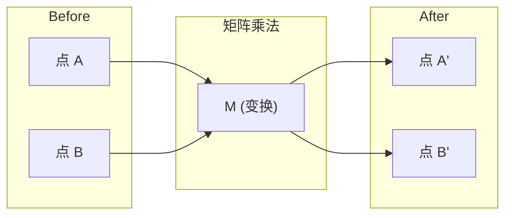
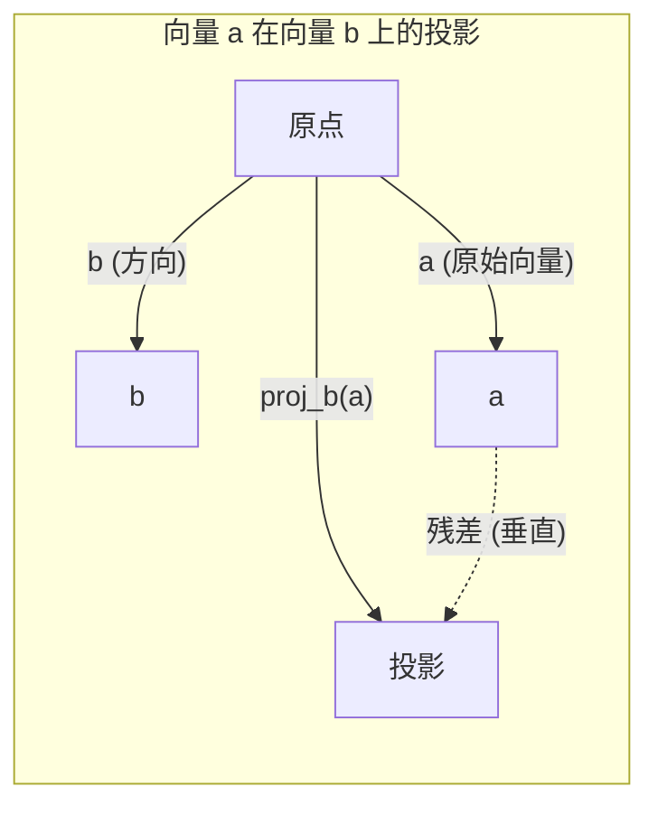

# 线性代数直觉

> 每个 AI 模型本质上都是矩阵运算，只是戴了顶花哨的帽子。

**Type:** Learn
**Languages:** Python, Julia
**Prerequisites:** Phase 0
**Time:** ~60 分钟

## 学习目标

- 从零开始用 Python 实现向量和矩阵运算（加法、点积、矩阵乘法）
- 从几何角度解释点积、投影和 Gram-Schmidt 正交化过程的作用
- 使用行约简判断一组向量的线性独立性、秩和基
- 将线性代数概念与 AI 应用建立联系：embedding (嵌入)、注意力分数和 LoRA

## 问题

翻开任何一篇机器学习论文，第一页就会看到向量、矩阵、点积和变换。没有线性代数直觉，这些只是符号；有了直觉，你就能看到神经网络实际上在做什么——在空间中移动点。

你不需要成为数学家。你需要从几何角度理解这些运算的含义，然后亲自编写代码实现它们。

## 概念

### 向量是点（也是方向）

向量就是一个数字列表。但这些数字是有意义的——它们是空间中的坐标。

**二维向量 [3, 2]：**

| x | y | 含义 |
|---|---|------|
| 3 | 2 | 该向量从原点 (0,0) 指向平面上的点 (3, 2) |

向量的模长为 sqrt(3² + 2²) = sqrt(13)，方向为右上。

在 AI 中，向量代表一切事物：
- 一个词 → 一个 768 维的数字向量（其在 embedding 空间中的"语义"）
- 一张图片 → 一个包含数百万像素值的向量
- 一个用户 → 一个偏好向量

### 矩阵是变换

矩阵将一个向量变换成另一个向量。它可以旋转、缩放、拉伸或投影。



在 AI 中，矩阵就是模型本身：
- 神经网络权重 → 将输入变换为输出的矩阵
- 注意力分数 → 决定关注什么的矩阵
- Embedding → 将词映射为向量的矩阵

### 点积衡量相似度

两个向量的点积告诉你它们有多相似。

```
a · b = a₁×b₁ + a₂×b₂ + ... + aₙ×bₙ

同方向:      a · b > 0  (相似)
垂直:        a · b = 0  (无关)
反方向:      a · b < 0  (不相似)
```

这就是搜索引擎、推荐系统和 RAG 的底层原理——寻找具有高 dot product (点积) 的向量。

### 线性独立性

如果一组向量中没有任何一个向量可以表示为其他向量的组合，则它们是线性独立的。如果 v1、v2、v3 线性独立，它们张成一个三维空间。如果其中一个是其他向量的组合，它们只张成一个平面。

这对 AI 的意义：你的特征矩阵应该具有线性独立的列。如果两个特征完全相关（线性相关），模型无法区分它们各自的影响。这会导致回归中的多重共线性——权重矩阵变得不稳定，输入的微小变化会引起输出的剧烈波动。

**具体例子：**

```
v1 = [1, 0, 0]
v2 = [0, 1, 0]
v3 = [2, 1, 0]   # v3 = 2*v1 + v2
```

v1 和 v2 是独立的——彼此都不是标量倍数或组合。但 v3 = 2*v1 + v2，所以 {v1, v2, v3} 是一个相关集合。这三个向量都位于 xy 平面内。无论怎么组合，都无法到达 [0, 0, 1]。你有三个向量，但只有两维的自由度。

在数据集中：如果 feature_3 = 2*feature_1 + feature_2，添加 feature_3 不会给模型带来任何新信息。更糟糕的是，它会使正规方程 singular (奇异)——权重不存在唯一解。

### 基和秩

基（basis）是一组张成整个空间的最小线性独立向量集合。基向量的数量就是空间的维度。

三维空间的标准基是 {[1,0,0], [0,1,0], [0,0,1]}。但三维空间中任何三个独立向量都构成一个有效的基。选择基就是选择坐标系。

矩阵的秩（rank）= 线性独立列的数量 = 线性独立行的数量。如果 rank < min(行数, 列数)，矩阵是 rank deficient (秩亏)。这意味着：
- 系统有无穷多解（或无解）
- 变换中信息丢失了
- 矩阵无法求逆

| 情况 | 秩 | 对机器学习的意义 |
|-----------|------|---------------------|
| 满秩 (rank = min(m, n)) | 最大可能 | 存在唯一最小二乘解。模型条件良好。 |
| 秩亏 (rank < min(m, n)) | 低于最大 | 特征冗余。无穷多权重解。需要 regularization (正则化)。 |
| 秩 1 | 1 | 每一列都是某个向量的缩放副本。所有数据位于一条直线上。 |
| 近秩亏（奇异值很小） | 数值上很低 | 矩阵病态。微小输入噪声导致巨大输出变化。使用 SVD 截断或 ridge regression (岭回归)。 |

### 投影

将向量 **a** 投影到向量 **b** 上，得到 **a** 在 **b** 方向上的分量：

```
proj_b(a) = (a · b / b · b) * b
```

残差（residual）(a - proj_b(a)) 与 b 垂直。这种正交分解是 least-squares fitting (最小二乘拟合) 的基础。

投影在机器学习中的应用无处不在：
- 线性回归最小化观测值到列空间的距离——其解就是一个投影
- PCA 将数据投影到方差最大的方向上
- Transformer 中的 attention (注意力) 计算 query (查询) 到 key (键) 的投影



**示例：** a = [3, 4], b = [1, 0]

proj_b(a) = (3*1 + 4*0) / (1*1 + 0*0) * [1, 0] = 3 * [1, 0] = [3, 0]

投影丢弃了 y 分量。这就是最简单的 dimensionality reduction (降维)——丢弃你不关心的方向。

### Gram-Schmidt 正交化

将任意一组独立向量转换为 orthonormal basis (标准正交基)。Orthonormal (标准正交) 意味着每个向量长度为 1，且每对向量互相垂直。

算法步骤：
1. 取第一个向量，归一化
2. 取第二个向量，减去它在第一个向量上的投影，归一化
3. 取第三个向量，减去它在所有前面向量上的投影，归一化
4. 对剩余向量重复

```
输入:  v1, v2, v3, ... (线性独立)

u1 = v1 / |v1|

w2 = v2 - (v2 · u1) * u1
u2 = w2 / |w2|

w3 = v3 - (v3 · u1) * u1 - (v3 · u2) * u2
u3 = w3 / |w3|

输出: u1, u2, u3, ... (标准正交基)
```

这是 QR 分解的内部工作原理。Q 是标准正交基，R 捕获投影系数。QR 分解用于：
- 求解线性方程组（比高斯消元更稳定）
- 计算特征值（QR 算法）
- 最小二乘回归（标准的数值方法）

## 从零构建

### 第一步：从零实现向量（Python）

```python
class Vector:
    def __init__(self, components):
        self.components = list(components)
        self.dim = len(self.components)

    def __add__(self, other):
        return Vector([a + b for a, b in zip(self.components, other.components)])

    def __sub__(self, other):
        return Vector([a - b for a, b in zip(self.components, other.components)])

    def dot(self, other):
        return sum(a * b for a, b in zip(self.components, other.components))

    def magnitude(self):
        return sum(x**2 for x in self.components) ** 0.5

    def normalize(self):
        mag = self.magnitude()
        return Vector([x / mag for x in self.components])

    def cosine_similarity(self, other):
        return self.dot(other) / (self.magnitude() * other.magnitude())

    def __repr__(self):
        return f"Vector({self.components})"


a = Vector([1, 2, 3])
b = Vector([4, 5, 6])

print(f"a + b = {a + b}")
print(f"a · b = {a.dot(b)}")
print(f"|a| = {a.magnitude():.4f}")
print(f"cosine similarity = {a.cosine_similarity(b):.4f}")
```

### 第二步：从零实现矩阵（Python）

```python
class Matrix:
    def __init__(self, rows):
        self.rows = [list(row) for row in rows]
        self.shape = (len(self.rows), len(self.rows[0]))

    def __matmul__(self, other):
        if isinstance(other, Vector):
            return Vector([
                sum(self.rows[i][j] * other.components[j] for j in range(self.shape[1]))
                for i in range(self.shape[0])
            ])
        rows = []
        for i in range(self.shape[0]):
            row = []
            for j in range(other.shape[1]):
                row.append(sum(
                    self.rows[i][k] * other.rows[k][j]
                    for k in range(self.shape[1])
                ))
            rows.append(row)
        return Matrix(rows)

    def transpose(self):
        return Matrix([
            [self.rows[j][i] for j in range(self.shape[0])]
            for i in range(self.shape[1])
        ])

    def __repr__(self):
        return f"Matrix({self.rows})"


rotation_90 = Matrix([[0, -1], [1, 0]])
point = Vector([3, 1])

rotated = rotation_90 @ point
print(f"Original: {point}")
print(f"Rotated 90°: {rotated}")
```

### 第三步：这与 AI 的关系

```python
import random

random.seed(42)
weights = Matrix([[random.gauss(0, 0.1) for _ in range(3)] for _ in range(2)])
input_vector = Vector([1.0, 0.5, -0.3])

output = weights @ input_vector
print(f"Input (3D): {input_vector}")
print(f"Output (2D): {output}")
print("This is what a neural network layer does -- matrix multiplication.")
```

### 第四步：Julia 版本

```julia
a = [1.0, 2.0, 3.0]
b = [4.0, 5.0, 6.0]

println("a + b = ", a + b)
println("a · b = ", a ⋅ b)       # Julia 支持 Unicode 运算符
println("|a| = ", √(a ⋅ a))
println("cosine = ", (a ⋅ b) / (√(a ⋅ a) * √(b ⋅ b)))

# 矩阵-向量乘法
W = [0.1 -0.2 0.3; 0.4 0.5 -0.1]
x = [1.0, 0.5, -0.3]
println("Wx = ", W * x)
println("This is a neural network layer.")
```

### 第五步：从零实现线性独立性和投影（Python）

```python
def is_linearly_independent(vectors):
    n = len(vectors)
    dim = len(vectors[0].components)
    mat = Matrix([v.components[:] for v in vectors])
    rows = [row[:] for row in mat.rows]
    rank = 0
    for col in range(dim):
        pivot = None
        for row in range(rank, len(rows)):
            if abs(rows[row][col]) > 1e-10:
                pivot = row
                break
        if pivot is None:
            continue
        rows[rank], rows[pivot] = rows[pivot], rows[rank]
        scale = rows[rank][col]
        rows[rank] = [x / scale for x in rows[rank]]
        for row in range(len(rows)):
            if row != rank and abs(rows[row][col]) > 1e-10:
                factor = rows[row][col]
                rows[row] = [rows[row][j] - factor * rows[rank][j] for j in range(dim)]
        rank += 1
    return rank == n


def project(a, b):
    scalar = a.dot(b) / b.dot(b)
    return Vector([scalar * x for x in b.components])


def gram_schmidt(vectors):
    orthonormal = []
    for v in vectors:
        w = v
        for u in orthonormal:
            proj = project(w, u)
            w = w - proj
        if w.magnitude() < 1e-10:
            continue
        orthonormal.append(w.normalize())
    return orthonormal


v1 = Vector([1, 0, 0])
v2 = Vector([1, 1, 0])
v3 = Vector([1, 1, 1])
basis = gram_schmidt([v1, v2, v3])
for i, u in enumerate(basis):
    print(f"u{i+1} = {u}")
    print(f"  |u{i+1}| = {u.magnitude():.6f}")

print(f"u1 · u2 = {basis[0].dot(basis[1]):.6f}")
print(f"u1 · u3 = {basis[0].dot(basis[2]):.6f}")
print(f"u2 · u3 = {basis[1].dot(basis[2]):.6f}")
```

## 使用它

现在用 NumPy 做同样的事情——你在实践中实际会用的工具：

```python
import numpy as np

a = np.array([1, 2, 3], dtype=float)
b = np.array([4, 5, 6], dtype=float)

print(f"a + b = {a + b}")
print(f"a · b = {np.dot(a, b)}")
print(f"|a| = {np.linalg.norm(a):.4f}")
print(f"cosine = {np.dot(a, b) / (np.linalg.norm(a) * np.linalg.norm(b)):.4f}")

W = np.random.randn(2, 3) * 0.1
x = np.array([1.0, 0.5, -0.3])
print(f"Wx = {W @ x}")
```

### 用 NumPy 计算秩、投影和 QR 分解

```python
import numpy as np

A = np.array([[1, 2], [2, 4]])
print(f"Rank: {np.linalg.matrix_rank(A)}")

a = np.array([3, 4])
b = np.array([1, 0])
proj = (np.dot(a, b) / np.dot(b, b)) * b
print(f"Projection of {a} onto {b}: {proj}")

Q, R = np.linalg.qr(np.random.randn(3, 3))
print(f"Q is orthogonal: {np.allclose(Q @ Q.T, np.eye(3))}")
print(f"R is upper triangular: {np.allclose(R, np.triu(R))}")
```

### PyTorch —— 带 Autodiff 的向量

```python
import torch

x = torch.randn(3, requires_grad=True)
y = torch.tensor([1.0, 0.0, 0.0])

similarity = torch.dot(x, y)
similarity.backward()

print(f"x = {x.data}")
print(f"y = {y.data}")
print(f"dot product = {similarity.item():.4f}")
print(f"d(dot)/dx = {x.grad}")
```

dot product (点积) 对 x 的梯度就是 y。PyTorch 自动计算了这个结果。神经网络中的每个运算都由这样的操作构建——矩阵乘法、点积、投影——而 autodiff (自动微分) 会跟踪所有这些操作的梯度。

你刚刚从零构建了 NumPy 一行代码就能完成的功能。现在你理解了底层发生了什么。

## 交付物

本课程产出：
- `outputs/prompt-linear-algebra-tutor.md` —— 一个用于 AI 助手通过几何直觉教授线性代数的 prompt (提示词)

## 关联

本课程的所有内容都与现代 AI 的具体部分相关联：

| 概念 | 在 AI 中的应用 |
|---------|------------------|
| Dot product (点积) | Transformer 中的 attention scores (注意力分数)、RAG 中的 cosine similarity (余弦相似度) |
| Matrix multiply (矩阵乘法) | 每个神经网络层、每个线性变换 |
| Linear independence (线性独立性) | 特征选择、避免多重共线性 |
| Rank (秩) | 判断系统是否可解、LoRA (低秩适应) |
| Projection (投影) | 线性回归（投影到列空间）、PCA |
| Gram-Schmidt / QR | 数值求解器、特征值计算 |
| Orthonormal basis (标准正交基) | 稳定的数值计算、白化变换 |

LoRA 特别值得一提。它通过将权重更新分解为 low-rank (低秩) 矩阵来 fine-tune (微调) 大语言模型。与其更新一个 4096×4096 的权重矩阵（1600 万参数），LoRA 更新两个大小为 4096×16 和 16×4096 的矩阵（13.1 万参数）。rank-16 (秩16) 约束意味着 LoRA 假设权重更新存在于完整 4096 维空间的一个 16 维子空间中。这就是线性代数在真正发挥作用。

## 练习

1. 实现 `Vector.angle_between(other)`，返回两个向量之间的角度（度数）
2. 创建一个二维缩放矩阵，将 x 坐标翻倍、y 坐标翻三倍，然后作用于向量 [1, 1]
3. 给定 5 个随机"类词"向量（50 维），使用 cosine similarity (余弦相似度) 找出最相似的两个
4. 验证 Gram-Schmidt 输出确实是标准正交的：检查每对向量的 dot product (点积) 为 0，每个向量的模长为 1
5. 创建一个 rank 2 (秩2) 的 3×3 矩阵。使用 `rank()` 方法验证。然后解释这些列在几何上张成什么物体。
6. 将向量 [1, 2, 3] 投影到 [1, 1, 1] 上。结果在几何上代表什么？

## 关键术语

| 术语 | 人们怎么说 | 实际含义 |
|------|----------------|----------------------|
| Vector (向量) | "一个箭头" | 一个数字列表，代表 n 维空间中的一个点或方向 |
| Matrix (矩阵) | "一张数字表格" | 一个变换，将向量从一个空间映射到另一个空间 |
| Dot product (点积) | "相乘再相加" | 衡量两个向量对齐程度的指标——similarity search (相似性搜索) 的核心 |
| Embedding (嵌入) | "某种 AI 魔法" | 代表某物（词、图像、用户）语义的向量 |
| Linear independence (线性独立性) | "它们不重叠" | 集合中没有任何向量可以写成其他向量的组合 |
| Rank (秩) | "多少维" | 矩阵中线性独立列（或行）的数量 |
| Projection (投影) | "影子" | 一个向量在另一个向量方向上的分量 |
| Basis (基) | "坐标轴" | 张成空间的最小独立向量集合 |
| Orthonormal (标准正交) | "垂直的单位向量" | 相互垂直且每个长度为 1 的向量 |
