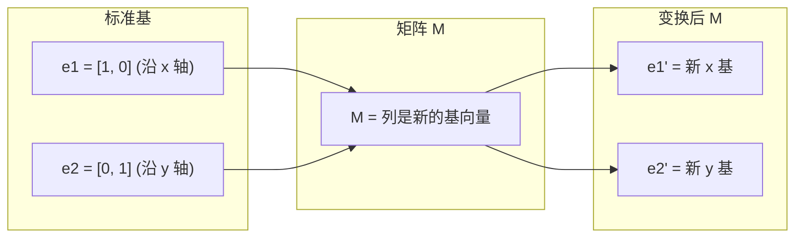
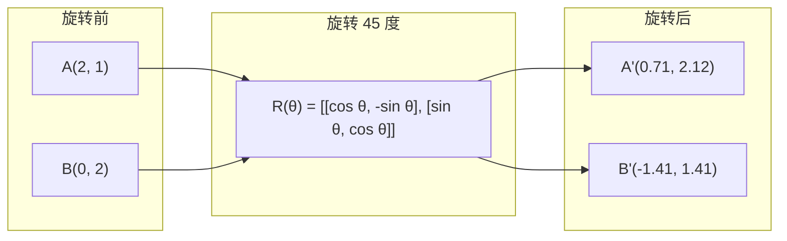
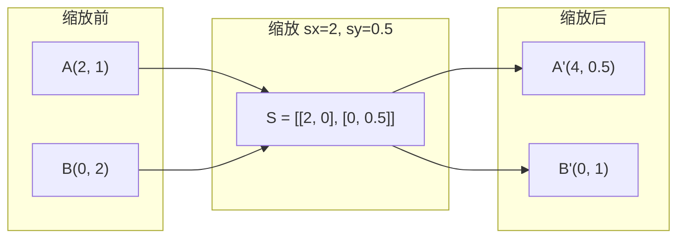
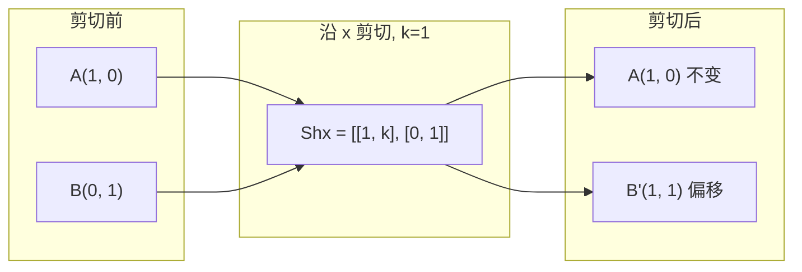
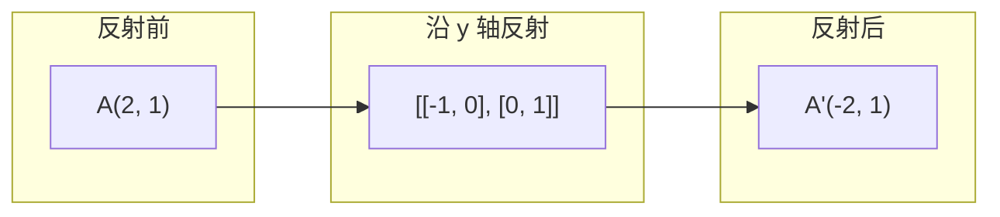
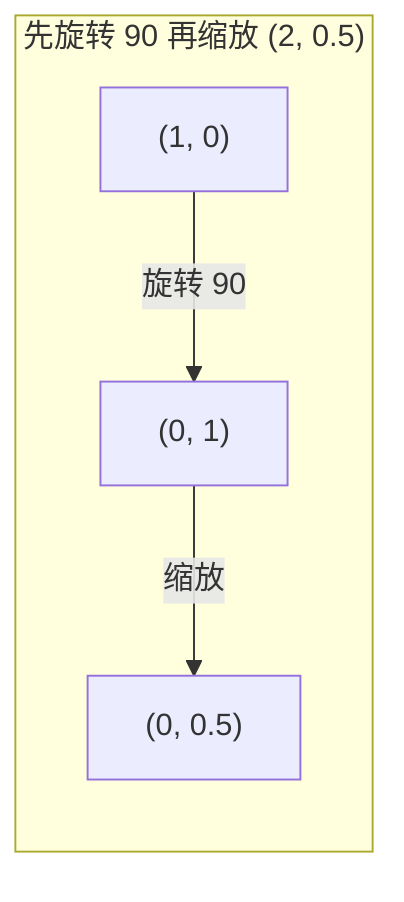
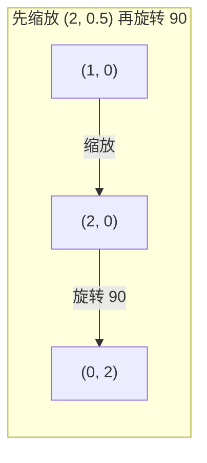

# 矩阵变换

> 矩阵是一台重塑空间的机器。理解它对每个点做了什么，你就理解了整个变换。

**Type:** Build
**Languages:** Python, Julia
**Prerequisites:** Phase 1, Lessons 01-02 (线性代数直觉, 向量与矩阵运算)
**Time:** ~75 分钟

## 学习目标

- 构建 rotation (旋转)、scaling (缩放)、shearing (剪切) 和 reflection (反射) 矩阵，并将其应用于 2D 和 3D 点
- 通过 matrix multiplication (矩阵乘法) 组合多个变换，并验证顺序的重要性
- 从 characteristic equation (特征方程) 计算 2x2 矩阵的 eigenvalues (特征值) 和 eigenvectors (特征向量)
- 解释为什么 eigenvalues (特征值) 决定 PCA 方向、RNN 稳定性和 spectral clustering (谱聚类) 行为

## 问题

你读到关于 PCA 的文献时看到"找到 covariance matrix (协方差矩阵) 的 eigenvectors (特征向量)"。你读到关于模型稳定性时看到"检查所有 eigenvalues (特征值) 的模长是否小于 1"。你读到关于数据增强时看到"应用随机 rotation (旋转)"。在几何上理解矩阵对空间的作用之前，这些都没有意义。

矩阵不仅仅是数字网格。它们是空间机器。Rotation matrix (旋转矩阵) 旋转点。Scaling matrix (缩放矩阵) 拉伸点。Shearing matrix (剪切矩阵) 倾斜点。神经网络对数据应用的每个变换都是这些操作之一或它们的组合。本课程将这些操作具体化。

## 概念

### 变换即矩阵

每个 2D 线性变换都可以写成 2x2 矩阵。矩阵告诉你 basis vectors (基向量) [1, 0] 和 [0, 1] 最终去了哪里。其余一切由此推导。



### Rotation (旋转)

2D 中旋转角度 theta 保持距离和角度不变。它将每个点沿圆弧移动。



在 3D 中，你围绕一个轴旋转。每个轴都有自己的 rotation matrix (旋转矩阵)：

```
Rz(theta) = | cos  -sin  0 |     围绕 z 轴旋转
            | sin   cos  0 |     (x-y 平面旋转, z 不变)
            |  0     0   1 |

Rx(theta) = | 1   0     0    |   围绕 x 轴旋转
            | 0  cos  -sin   |   (y-z 平面旋转, x 不变)
            | 0  sin   cos   |

Ry(theta) = |  cos  0  sin |     围绕 y 轴旋转
            |   0   1   0  |     (x-z 平面旋转, y 不变)
            | -sin  0  cos |
```

### Scaling (缩放)

Scaling (缩放) 独立地拉伸或压缩每个轴。



### Shearing (剪切)

Shearing (剪切) 倾斜一个轴同时保持另一个轴固定。它将矩形变成平行四边形。



Shear matrices (剪切矩阵):
- `Shx = [[1, k], [0, 1]]` 将 x 按 k * y 偏移
- `Shy = [[1, 0], [k, 1]]` 将 y 按 k * x 偏移

### Reflection (反射)

Reflection (反射) 将点沿轴或直线镜像。



反射矩阵：
- 沿 y 轴反射: `[[-1, 0], [0, 1]]`
- 沿 x 轴反射: `[[1, 0], [0, -1]]`

### Composition (组合): 链式变换

先应用变换 A 再应用 B 等价于将它们的矩阵相乘：`result = B @ A @ point`。顺序很重要。Rotate (旋转) 然后 Scale (缩放) 与 Scale (缩放) 然后 Rotate (旋转) 结果不同。



组合: `S @ R = [[0, -2], [0.5, 0]]`



组合: `R @ S = [[0, -0.5], [2, 0]]`

结果不同。Matrix multiplication (矩阵乘法) 不满足交换律。

### Eigenvalues (特征值) 和 Eigenvectors (特征向量)

大多数向量在被矩阵作用时方向会改变。Eigenvectors (特征向量) 是特殊的：矩阵只缩放它们，从不旋转它们。缩放因子就是 eigenvalue (特征值)。

```
A @ v = lambda * v

v 是 eigenvector (特征向量) (方向保持不变的方向)
lambda 是 eigenvalue (特征值) (缩放了多少)

示例: A = | 2  1 |
          | 1  2 |

Eigenvector [1, 1] 对应 eigenvalue 3:
  A @ [1,1] = [3, 3] = 3 * [1, 1]     (同方向, 缩放 3 倍)

Eigenvector [1, -1] 对应 eigenvalue 1:
  A @ [1,-1] = [1, -1] = 1 * [1, -1]  (同方向, 不变)
```

矩阵将空间沿 [1, 1] 方向拉伸 3 倍，保持 [1, -1] 方向不变。所有其他方向都是这两个方向的混合。

### Eigendecomposition (特征分解)

如果一个矩阵有 n 个 linearly independent (线性独立) 的 eigenvectors (特征向量)，它可以被分解：

```
A = V @ D @ V^(-1)

V = 以 eigenvectors (特征向量) 为列的矩阵
D = 以 eigenvalues (特征值) 为对角线的对角矩阵
V^(-1) = V 的逆矩阵

这表示：旋转到 eigenvector (特征向量) 坐标系，沿每个轴缩放，再旋转回来。
```

### 为什么 eigenvalues (特征值) 很重要

**PCA (主成分分析).** Covariance matrix (协方差矩阵) 的 eigenvectors (特征向量) 就是 principal components (主成分)。Eigenvalues (特征值) 告诉你每个 component (成分) 捕获了多少 variance (方差)。按 eigenvalue (特征值) 排序，保留前 k 个，就得到了 dimensionality reduction (降维)。

**稳定性 (Stability).** 在 recurrent networks (循环网络) 和 dynamical systems (动态系统) 中，模长大于 1 的 eigenvalues (特征值) 会导致输出爆炸。模长小于 1 会导致输出消失。这就是 vanishing/exploding gradient problem (梯度消失/爆炸问题) 的一句话描述。

**Spectral methods (谱方法).** Graph neural networks (图神经网络) 使用 adjacency matrix (邻接矩阵) 的 eigenvalues (特征值)。Spectral clustering (谱聚类) 使用 Laplacian (拉普拉斯矩阵) 的 eigenvalues (特征值)。Eigenvectors (特征向量) 揭示了图的结构。

### Determinant (行列式) 作为体积缩放因子

变换矩阵的 determinant (行列式) 告诉你它缩放 2D 面积或 3D 体积的程度。

```
det = 1:   面积不变 (rotation (旋转))
det = 2:   面积翻倍
det = 0:   空间被压扁到低维度 (singular (奇异))
det = -1:  面积不变但方向翻转 (reflection (反射))

| det(Rotation (旋转)) | = 1        (总是)
| det(Scale (缩放) sx, sy) | = sx * sy
| det(Shear (剪切)) | = 1           (面积不变)
| det(Reflection (反射)) | = -1     (方向翻转)
```

## 从零构建

### 第一步：从零构建变换矩阵 (Python)

```python
import math

def rotation_2d(theta):
    c, s = math.cos(theta), math.sin(theta)
    return [[c, -s], [s, c]]

def scaling_2d(sx, sy):
    return [[sx, 0], [0, sy]]

def shearing_2d(kx, ky):
    return [[1, kx], [ky, 1]]

def reflection_x():
    return [[1, 0], [0, -1]]

def reflection_y():
    return [[-1, 0], [0, 1]]

def mat_vec_mul(matrix, vector):
    return [
        sum(matrix[i][j] * vector[j] for j in range(len(vector)))
        for i in range(len(matrix))
    ]

def mat_mul(a, b):
    rows_a, cols_b = len(a), len(b[0])
    cols_a = len(a[0])
    return [
        [sum(a[i][k] * b[k][j] for k in range(cols_a)) for j in range(cols_b)]
        for i in range(rows_a)
    ]

point = [1.0, 0.0]
angle = math.pi / 4

rotated = mat_vec_mul(rotation_2d(angle), point)
print(f"Rotate (1,0) by 45 deg: ({rotated[0]:.4f}, {rotated[1]:.4f})")

scaled = mat_vec_mul(scaling_2d(2, 3), [1.0, 1.0])
print(f"Scale (1,1) by (2,3): ({scaled[0]:.1f}, {scaled[1]:.1f})")

sheared = mat_vec_mul(shearing_2d(1, 0), [1.0, 1.0])
print(f"Shear (1,1) kx=1: ({sheared[0]:.1f}, {sheared[1]:.1f})")

reflected = mat_vec_mul(reflection_y(), [2.0, 1.0])
print(f"Reflect (2,1) across y: ({reflected[0]:.1f}, {reflected[1]:.1f})")
```

### 第二步：变换的组合

```python
R = rotation_2d(math.pi / 2)
S = scaling_2d(2, 0.5)

rotate_then_scale = mat_mul(S, R)
scale_then_rotate = mat_mul(R, S)

point = [1.0, 0.0]
result1 = mat_vec_mul(rotate_then_scale, point)
result2 = mat_vec_mul(scale_then_rotate, point)

print(f"Rotate 90 then scale: ({result1[0]:.2f}, {result1[1]:.2f})")
print(f"Scale then rotate 90: ({result2[0]:.2f}, {result2[1]:.2f})")
print(f"Same? {result1 == result2}")
```

### 第三步：从零计算 eigenvalues (2x2)

对于 2x2 矩阵 `[[a, b], [c, d]]`，eigenvalues (特征值) 满足 characteristic equation (特征方程)：`lambda^2 - (a+d)*lambda + (ad - bc) = 0`。

```python
def eigenvalues_2x2(matrix):
    a, b = matrix[0]
    c, d = matrix[1]
    trace = a + d
    det = a * d - b * c
    discriminant = trace ** 2 - 4 * det
    if discriminant < 0:
        real = trace / 2
        imag = (-discriminant) ** 0.5 / 2
        return (complex(real, imag), complex(real, -imag))
    sqrt_disc = discriminant ** 0.5
    return ((trace + sqrt_disc) / 2, (trace - sqrt_disc) / 2)

def eigenvector_2x2(matrix, eigenvalue):
    a, b = matrix[0]
    c, d = matrix[1]
    if abs(b) > 1e-10:
        v = [b, eigenvalue - a]
    elif abs(c) > 1e-10:
        v = [eigenvalue - d, c]
    else:
        if abs(a - eigenvalue) < 1e-10:
            v = [1, 0]
        else:
            v = [0, 1]
    mag = (v[0] ** 2 + v[1] ** 2) ** 0.5
    return [v[0] / mag, v[1] / mag]

A = [[2, 1], [1, 2]]
vals = eigenvalues_2x2(A)
print(f"Matrix: {A}")
print(f"Eigenvalues: {vals[0]:.4f}, {vals[1]:.4f}")

for val in vals:
    vec = eigenvector_2x2(A, val)
    result = mat_vec_mul(A, vec)
    scaled = [val * vec[0], val * vec[1]]
    print(f"  lambda={val:.1f}, v={[round(x,4) for x in vec]}")
    print(f"    A@v = {[round(x,4) for x in result]}")
    print(f"    l*v = {[round(x,4) for x in scaled]}")
```

### 第四步：Determinant (行列式) 作为体积缩放因子

```python
def det_2x2(matrix):
    return matrix[0][0] * matrix[1][1] - matrix[0][1] * matrix[1][0]

print(f"det(rotation 45) = {det_2x2(rotation_2d(math.pi/4)):.4f}")
print(f"det(scale 2,3)   = {det_2x2(scaling_2d(2, 3)):.1f}")
print(f"det(shear kx=1)  = {det_2x2(shearing_2d(1, 0)):.1f}")
print(f"det(reflect y)   = {det_2x2(reflection_y()):.1f}")

singular = [[1, 2], [2, 4]]
print(f"det(singular)     = {det_2x2(singular):.1f}")
print("Singular: columns are proportional, space collapses to a line.")
```

## 使用它

NumPy 使用优化的例程处理所有这些。

```python
import numpy as np

theta = np.pi / 4
R = np.array([[np.cos(theta), -np.sin(theta)],
              [np.sin(theta),  np.cos(theta)]])

point = np.array([1.0, 0.0])
print(f"Rotate (1,0) by 45 deg: {R @ point}")

S = np.diag([2.0, 3.0])
composed = S @ R
print(f"Scale(2,3) after Rotate(45): {composed @ point}")

A = np.array([[2, 1], [1, 2]], dtype=float)
eigenvalues, eigenvectors = np.linalg.eig(A)
print(f"\nEigenvalues: {eigenvalues}")
print(f"Eigenvectors (columns):\n{eigenvectors}")

for i in range(len(eigenvalues)):
    v = eigenvectors[:, i]
    lam = eigenvalues[i]
    print(f"  A @ v{i} = {A @ v}, lambda * v{i} = {lam * v}")

print(f"\ndet(R) = {np.linalg.det(R):.4f}")
print(f"det(S) = {np.linalg.det(S):.1f}")

B = np.array([[3, 1], [0, 2]], dtype=float)
vals, vecs = np.linalg.eig(B)
D = np.diag(vals)
V = vecs
reconstructed = V @ D @ np.linalg.inv(V)
print(f"\nEigendecomposition A = V @ D @ V^-1:")
print(f"Original:\n{B}")
print(f"Reconstructed:\n{reconstructed}")
```

### 3D rotations (旋转) with NumPy

```python
def rotation_3d_z(theta):
    c, s = np.cos(theta), np.sin(theta)
    return np.array([[c, -s, 0], [s, c, 0], [0, 0, 1]])

def rotation_3d_x(theta):
    c, s = np.cos(theta), np.sin(theta)
    return np.array([[1, 0, 0], [0, c, -s], [0, s, c]])

point_3d = np.array([1.0, 0.0, 0.0])
rotated_z = rotation_3d_z(np.pi / 2) @ point_3d
rotated_x = rotation_3d_x(np.pi / 2) @ point_3d

print(f"\n3D point: {point_3d}")
print(f"Rotate 90 around z: {np.round(rotated_z, 4)}")
print(f"Rotate 90 around x: {np.round(rotated_x, 4)}")
```

## 交付物

本课程为 PCA (Phase 2) 和神经网络权重分析构建了几何基础。这里构建的 eigenvalue/eigenvector (特征值/特征向量) 代码与生产 ML 系统中驱动 dimensionality reduction (降维)、spectral clustering (谱聚类) 和 stability analysis (稳定性分析) 的算法相同。

## 练习

1. 对 unit square (单位正方形)（角点在 [0,0], [1,0], [1,1], [0,1]）应用 rotation (旋转)、scaling (缩放) 和 shearing (剪切)。打印每个变换后的角点。验证 rotation (旋转) 保持角点间距离。

2. 手动使用 characteristic equation (特征方程) 找到矩阵 [[4, 2], [1, 3]] 的 eigenvalues (特征值)。然后使用你的从零构建函数和 NumPy 验证。

3. 创建一个由三个变换组合（旋转 30 度，按 [1.5, 0.8] 缩放，kx=0.3 剪切）组成的变换，并将其应用于排列在圆周上的 8 个点。打印变换前后的坐标。计算组合矩阵的 determinant (行列式) 并验证它等于各个 determinant (行列式) 的乘积。

## 关键术语

| 术语 | 人们怎么说 | 实际含义 |
|------|----------------|----------------------|
| Rotation matrix (旋转矩阵) | "旋转东西" | 一个正交矩阵，将点沿圆弧移动，同时保持距离和角度不变。Determinant (行列式) 总是 1。 |
| Scaling matrix (缩放矩阵) | "让东西变大" | 一个对角矩阵，独立地沿每个轴拉伸或压缩。Determinant (行列式) 是缩放因子的乘积。 |
| Shearing matrix (剪切矩阵) | "让东西倾斜" | 一个矩阵，将一个坐标按另一个坐标的比例偏移，将矩形变成平行四边形。Determinant (行列式) 为 1。 |
| Reflection (反射) | "镜像东西" | 一个矩阵，沿轴或平面翻转空间。Determinant (行列式) 为 -1。 |
| Composition (组合) | "做两件事" | 将变换矩阵相乘以链式操作。顺序很重要：B @ A 表示先应用 A，再应用 B。 |
| Eigenvector (特征向量) | "特殊方向" | 一个矩阵只缩放它、从不旋转它的方向。变换的指纹。 |
| Eigenvalue (特征值) | "拉伸了多少" | 矩阵缩放其 eigenvector (特征向量) 的标量因子。可以是负数（翻转）或复数（旋转）。 |
| Eigendecomposition (特征分解) | "将矩阵拆开" | 将矩阵写成 V @ D @ V^(-1)，将其分解为基本的缩放方向和大小。 |
| Determinant (行列式) | "从矩阵算出来的某个数" | 变换缩放 2D 面积或 3D 体积的因子。为零意味着变换不可逆。 |
| Characteristic equation (特征方程) | "eigenvalues (特征值) 从哪来的" | det(A - lambda * I) = 0。其根就是 eigenvalues (特征值)。 |

## 延伸阅读

- [3Blue1Brown: 线性变换](https://www.3blue1brown.com/lessons/linear-transformations) -- 矩阵如何重塑空间的视觉直觉
- [3Blue1Brown: Eigenvectors and Eigenvalues (特征向量与特征值)](https://www.3blue1brown.com/lessons/eigenvalues) -- eigenvectors (特征向量) 几何意义的最佳视觉解释
- [MIT 18.06 第21讲: Eigenvalues and Eigenvalues](https://ocw.mit.edu/courses/18-06-linear-algebra-spring-2010/) -- Gilbert Strang 的经典讲解
