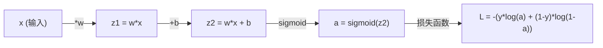
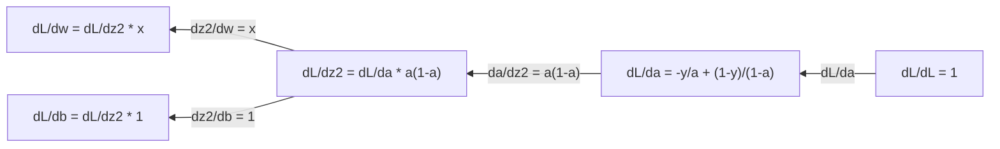
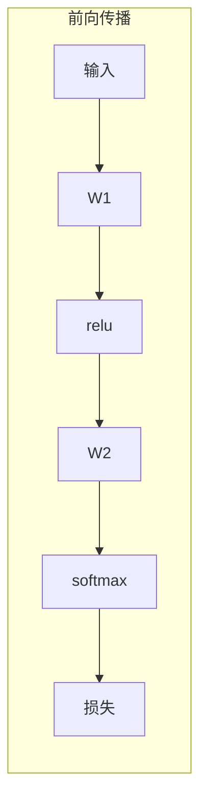
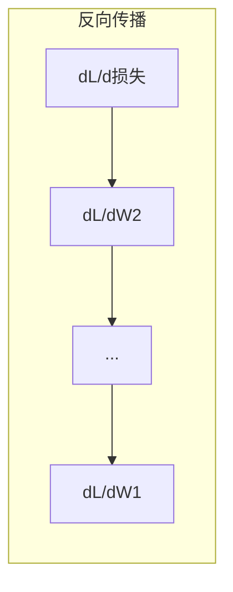

# 机器学习微积分

> 导数告诉你哪个方向是下坡。这就是神经网络学习所需的全部。

**Type:** Learn
**Language:** Python
**Prerequisites:** Phase 1, Lessons 01-03
**Time:** ~60 分钟

## 学习目标

- 计算常见 ML 函数（x²、sigmoid、交叉熵）的数值导数和解析导数
- 从零实现梯度下降，在 1D 和 2D 中最小化损失函数
- 推导线性回归模型的梯度，并通过手动权重更新进行训练
- 解释 Hessian 矩阵、Taylor 级数近似及其与优化方法的联系

## 问题

你有一个拥有数百万权重的神经网络。每个权重都是一个旋钮。你需要确定如何转动每个旋钮，使模型稍微少一点错误。微积分给你那个方向。

没有微积分，训练神经网络意味着尝试随机变化并希望最好。有了导数，你就知道每个权重如何影响误差。每次你都能正确转动每个旋钮。

## 概念

### 什么是导数？

导数衡量变化率。对于函数 y = f(x)，导数 f'(x) 告诉你：如果你稍微推动 x，y 变化多少？

几何上，导数是某点处切线的斜率。

**f(x) = x²：**

| x | f(x) | f'(x) (斜率) |
|---|------|---------------|
| 0 | 0    | 0 (平坦，在底部) |
| 1 | 1    | 2 |
| 2 | 4    | 4 (该点切线斜率) |
| 3 | 9    | 6 |

在 x=2 处，斜率是 4。如果你将 x 稍微向右移动，y 增加约 4 倍该量。在 x=0 处，斜率是 0。你在碗底。

正式定义：

```
f'(x) = lim   f(x + h) - f(x)
        h->0  -----------------
                     h
```

在代码中，你跳过极限，只使用非常小的 h。这就是数值导数。

### 偏导数：一次一个变量

真实函数有很多输入。神经网络损失取决于数千个权重。偏导数保持所有变量不变，只对一个变量求导。

```
f(x, y) = x² + 3xy + y²

∂f/∂x = 2x + 3y     (将 y 视为常数)
∂f/∂y = 3x + 2y     (将 x 视为常数)
```

每个偏导数回答：如果我只推动这个权重，损失如何变化？

### 梯度：所有偏导数的向量

梯度将所有偏导数收集到一个向量中。对于函数 f(x, y, z)，梯度是：

```
grad f = [ ∂f/∂x, ∂f/∂y, ∂f/∂z ]
```

梯度指向最陡上升方向。要最小化函数，朝相反方向走。

**f(x,y) = x² + y² 的等高线图：**

函数形成碗状，同心圆为等高线。最小值在 (0, 0)。

| 点 | grad f | -grad f (下降方向) |
|-------|--------|----------------------------|
| (1, 1) | [2, 2] (指向上坡，远离最小值) | [-2, -2] (指向下坡，朝向最小值) |
| (0, 0) | [0, 0] (平坦，在最小值) | [0, 0] |

这就是梯度下降的图片。计算梯度，取反，走一步。

### 与优化的联系

训练神经网络就是优化。你有一个损失函数 L(w1, w2, ..., wn) 衡量模型有多错。你想最小化它。

```
梯度下降更新规则：

  w_new = w_old - learning_rate * dL/dw

对于每个权重：
  1. 计算损失对该权重的偏导数
  2. 从权重中减去它的一小部分
  3. 重复
```

学习率控制步长。太大则超调。太小则爬行。

**损失景观（1D 切片）：**

损失函数 L(w) 随权重 w 变化形成有峰有谷的曲线。

| 特征 | 描述 |
|---------|-------------|
| 全局最小值 | 整个曲线上最低点——最佳解 |
| 局部最小值 | 比邻居低的谷，但不是整体最低 |
| 斜率 | 梯度下降从任何起点沿斜率下坡 |

梯度下降沿斜率下坡。它可能卡在局部最小值，但在高维空间（数百万权重）中，这很少是实际问题。

### 数值 vs 解析导数

计算导数有两种方式。

解析：手工应用微积分规则。对于 f(x) = x²，导数是 f'(x) = 2x。精确。快速。

数值：使用定义近似。对极小的 h 计算 f(x+h) 和 f(x-h)，然后使用差值。

```
数值（中心差分）：

f'(x) ~= f(x + h) - f(x - h)
          -----------------------
                  2h

h = 0.0001 在实践中效果很好
```

数值导数更慢，但对任何函数都有效。解析导数很快，但需要你推导公式。神经网络框架使用第三种方法：自动微分，它机械地计算精确导数。你将在第三阶段看到。

### 简单函数的导数推导

这些是你将在 ML 中反复看到的导数。

```
函数        导数       用于
--------        ----------       -------
f(x) = x²     f'(x) = 2x      损失函数（MSE）
f(x) = wx + b  f'(w) = x        线性层（对权重的梯度）
                f'(b) = 1        线性层（对偏置的梯度）
                f'(x) = w        线性层（对输入的梯度）
f(x) = e^x     f'(x) = e^x     Softmax，注意力
f(x) = ln(x)   f'(x) = 1/x     交叉熵损失
f(x) = 1/(1+e^-x)  f'(x) = f(x)(1-f(x))   Sigmoid 激活
```

对于 f(x) = x²：

```
f(x) = x²    f'(x) = 2x

  x    f(x)   f'(x)   含义
  -2    4      -4      斜率向左倾斜（递减）
  -1    1      -2      斜率向左倾斜（递减）
   0    0       0      平坦（最小值！）
   1    1       2      斜率向右倾斜（递增）
   2    4       4      斜率向右倾斜（递增）
```

对于 f(w) = wx + b，x=3，b=1：

```
f(w) = 3w + 1    f'(w) = 3

对 w 的导数就是 x。
如果 x 很大，w 的微小变化会导致输出大幅变化。
```

### 链式法则

当函数组合时，链式法则告诉你如何求导。

```
如果 y = f(g(x))，那么 dy/dx = f'(g(x)) * g'(x)

示例：y = (3x + 1)²
  外层：f(u) = u²       f'(u) = 2u
  内层：g(x) = 3x + 1    g'(x) = 3
  dy/dx = 2(3x + 1) * 3 = 6(3x + 1)
```

神经网络是函数链：输入 -> 线性 -> 激活 -> 线性 -> 激活 -> 损失。反向传播是链式法则从输出到输入的重复应用。这就是整个算法。

### Hessian 矩阵

梯度告诉你斜率。Hessian 告诉你曲率。

Hessian 是二阶偏导数矩阵。对于函数 f(x1, x2, ..., xn)，Hessian 的 (i, j) 项是：

```
H[i][j] = ∂²f / (∂x_i * ∂x_j)
```

对于二元函数 f(x, y)：

```
H = | ∂²f/∂x²    ∂²f/∂x∂y |
    | ∂²f/∂y∂x    ∂²f/∂y² |
```

**Hessian 在临界点（梯度 = 0）告诉你的信息：**

| Hessian 性质 | 含义 | 示例曲面 |
|-----------------|---------|-----------------|
| 正定（所有特征值 > 0） | 局部最小值 | 碗朝上 |
| 负定（所有特征值 < 0） | 局部最大值 | 碗朝下 |
| 不定（混合特征值） | 鞍点 | 马鞍形 |

**示例：** f(x, y) = x² - y²（鞍函数）

```
∂f/∂x = 2x       ∂f/∂y = -2y
∂²f/∂x² = 2    ∂²f/∂y² = -2    ∂²f/∂x∂y = 0

H = | 2   0 |
    | 0  -2 |

特征值：2 和 -2（一正一负）
--> (0, 0) 是鞍点
```

与 f(x, y) = x² + y²（碗）比较：

```
H = | 2  0 |
    | 0  2 |

特征值：2 和 2（均为正）
--> (0, 0) 是局部最小值
```

**Hessian 在 ML 中的重要性：**

Newton 方法使用 Hessian 比梯度下降采取更好的优化步骤。它不仅跟随斜率，还考虑曲率：

```
Newton 更新：    w_new = w_old - H^(-1) * gradient
梯度下降：   w_new = w_old - lr * gradient
```

Newton 方法收敛更快，因为 Hessian "重新缩放" 梯度——陡峭方向获得较小步长，平坦方向获得较大步长。

代价：对于 N 个参数的神经网络，Hessian 是 N x N。100 万参数的模型需要 1 万亿项矩阵。这就是为什么我们使用近似。

| 方法 | 使用什么 | 代价 | 收敛 |
|--------|-------------|------|-------------|
| 梯度下降 | 仅一阶导数 | 每步 O(N) | 慢（线性） |
| Newton 方法 | 完整 Hessian | 每步 O(N³) | 快（二次） |
| L-BFGS | 从梯度历史近似 Hessian | 每步 O(N) | 中等（超线性） |
| Adam | 每参数自适应率（对角 Hessian 近似） | 每步 O(N) | 中等 |
| 自然梯度 | Fisher 信息矩阵（统计 Hessian） | 每步 O(N²) | 快 |

在实践中，Adam 是深度学习的默认优化器。它通过跟踪每个参数的梯度运行均值和方差，廉价地近似二阶信息。

### Taylor 级数近似

任何光滑函数都可以局部用多项式近似：

```
f(x + h) = f(x) + f'(x)*h + (1/2)*f''(x)*h² + (1/6)*f'''(x)*h³ + ...
```

包含的项越多，近似越好——但仅在 x 附近。

**Taylor 级数对 ML 的重要性：**

- **一阶 Taylor = 梯度下降。** 当你使用 f(x + h) ~ f(x) + f'(x)*h，你在做线性近似。梯度下降最小化这个线性模型来选择 h = -lr * f'(x)。

- **二阶 Taylor = Newton 方法。** 使用 f(x + h) ~ f(x) + f'(x)*h + (1/2)*f''(x)*h²，你得到二次模型。最小化它得到 h = -f'(x)/f''(x)——Newton 步。

- **损失函数设计。** MSE 和交叉熵是光滑的，意味着它们的 Taylor 展开表现良好。这不是偶然。光滑损失使优化可预测。

```
近似阶数    它捕捉什么    优化方法
-------------------    -----------------   -------------------
0 阶（常数）   只是值      随机搜索
1 阶（线性）     斜率               梯度下降
2 阶（二次）    曲率           Newton 方法
更高阶数          更精细结构     在 ML 中很少使用
```

关键洞察：所有基于梯度的优化实际上都是关于局部近似损失函数，并走向该近似的最低点。

### ML 中的积分

导数告诉你变化率。积分计算累积——曲线下的面积。

在 ML 中，你很少手工计算积分，但概念无处不在：

**概率。** 对于连续随机变量，密度 p(x)：
```
P(a < X < b) = 从 a 到 b 的 p(x) dx 积分
```
概率密度曲线在 a 和 b 之间的面积是落在此范围内的概率。

**期望值。** 按概率加权的平均结果：
```
E[f(X)] = f(x) * p(x) dx 的积分
```
数据分布上的期望损失是一个积分。训练最小化它的经验近似。

**KL 散度。** 衡量两个分布的差异：
```
KL(p || q) = p(x) * log(p(x) / q(x)) dx 的积分
```
用于 VAE、知识蒸馏和贝叶斯推断。

**归一化常数。** 在贝叶斯推断中：
```
p(w | 数据) = p(数据 | w) * p(w) / 所有 p(数据 | w) * p(w) dw 的积分
```
分母是所有可能参数值的积分。它通常难以处理，这就是为什么我们使用 MCMC 和变分推断等近似。

| 积分概念 | 在 ML 中出现的地方 |
|-----------------|----------------------|
| 曲线下面积 | 来自密度函数的概率 |
| 期望值 | 损失函数、风险最小化 |
| KL 散度 | VAE、策略优化、蒸馏 |
| 归一化 | 贝叶斯后验、softmax 分母 |
| 边际似然 | 模型比较、证据下界（ELBO） |

### 计算图中的多变量链式法则

链式法则不仅适用于直线中的标量函数。在神经网络中，变量分叉和合并。以下是在简单前向传播中导数如何流动：



反向传播从右到左计算梯度：



每个箭头乘以局部导数。任何参数的梯度是沿从损失到该参数路径的所有局部导数的乘积。当路径分叉和合并时，你将贡献相加（多变量链式法则）。

这就是反向传播的全部：通过计算图系统地应用链式法则，从输出到输入。

### Jacobian 矩阵

当函数将向量映射到向量（如神经网络层），其导数是一个矩阵。Jacobian 包含每个输出对每个输入的所有偏导数。

对于 f: R^n -> R^m，Jacobian J 是 m x n 矩阵：

| | x1 | x2 | ... | xn |
|---|---|---|---|---|
| f1 | ∂f1/∂x1 | ∂f1/∂x2 | ... | ∂f1/∂xn |
| f2 | ∂f2/∂x1 | ∂f2/∂x2 | ... | ∂f2/∂xn |
| ... | ... | ... | ... | ... |
| fm | ∂fm/∂x1 | ∂fm/∂x2 | ... | ∂fm/∂xn |

你不会为神经网络手工计算 Jacobian。PyTorch 处理它。但知道它存在有助于你理解反向传播中的形状：如果一层映射 R^n 到 R^m，其 Jacobian 是 m x n。梯度通过该矩阵的转置反向流动。

### 为什么这对神经网络重要

神经网络中的每个权重都获得梯度。梯度告诉你如何调整该权重以减少损失。





每个权重更新：
- `W1 = W1 - lr * dL/dW1`
- `W2 = W2 - lr * dL/dW2`

前向传播计算预测和损失。反向传播计算损失对每个权重的梯度。然后每个权重走一小步下坡。重复数百万步。这就是深度学习。

## 从零构建

### 第一步：数值导数

```python
def numerical_derivative(f, x, h=1e-7):
    return (f(x + h) - f(x - h)) / (2 * h)

def f(x):
    return x ** 2

for x in [-2, -1, 0, 1, 2]:
    numerical = numerical_derivative(f, x)
    analytical = 2 * x
    print(f"x={x:2d}  f'(x) 数值={numerical:.6f}  解析={analytical:.1f}")
```

数值导数与解析导数在多位小数上匹配。

### 第二步：偏导数和梯度

```python
def numerical_gradient(f, point, h=1e-7):
    gradient = []
    for i in range(len(point)):
        point_plus = list(point)
        point_minus = list(point)
        point_plus[i] += h
        point_minus[i] -= h
        partial = (f(point_plus) - f(point_minus)) / (2 * h)
        gradient.append(partial)
    return gradient

def f_multi(point):
    x, y = point
    return x**2 + 3*x*y + y**2

grad = numerical_gradient(f_multi, [1.0, 2.0])
print(f"在 (1,2) 处的数值梯度: {[f'{g:.4f}' for g in grad]}")
print(f"在 (1,2) 处的解析梯度: [2*1+3*2, 3*1+2*2] = [{2*1+3*2}, {3*1+2*2}]")
```

### 第三步：梯度下降找到 f(x) = x² 的最小值

```python
x = 5.0
lr = 0.1
for step in range(20):
    grad = 2 * x
    x = x - lr * grad
    print(f"step {step:2d}  x={x:8.4f}  f(x)={x**2:10.6f}")
```

从 x=5 开始，每步更接近 x=0（最小值）。

### 第四步：二元函数上的梯度下降

```python
def f_2d(point):
    x, y = point
    return x**2 + y**2

point = [4.0, 3.0]
lr = 0.1
for step in range(30):
    grad = numerical_gradient(f_2d, point)
    point = [p - lr * g for p, g in zip(point, grad)]
    loss = f_2d(point)
    if step % 5 == 0 or step == 29:
        print(f"step {step:2d}  point=({point[0]:7.4f}, {point[1]:7.4f})  f={loss:.6f}")
```

### 第五步：比较数值和解析导数

```python
import math

test_functions = [
    ("x^2",      lambda x: x**2,          lambda x: 2*x),
    ("x^3",      lambda x: x**3,          lambda x: 3*x**2),
    ("sin(x)",   lambda x: math.sin(x),   lambda x: math.cos(x)),
    ("e^x",      lambda x: math.exp(x),   lambda x: math.exp(x)),
    ("1/x",      lambda x: 1/x,           lambda x: -1/x**2),
]

x = 2.0
print(f"{'函数':<12} {'数值':>12} {'解析':>12} {'误差':>12}")
print("-" * 50)
for name, f, df in test_functions:
    num = numerical_derivative(f, x)
    ana = df(x)
    err = abs(num - ana)
    print(f"{name:<12} {num:12.6f} {ana:12.6f} {err:12.2e}")
```

### 第六步：数值计算 Hessian

```python
def hessian_2d(f, x, y, h=1e-5):
    fxx = (f(x + h, y) - 2 * f(x, y) + f(x - h, y)) / (h ** 2)
    fyy = (f(x, y + h) - 2 * f(x, y) + f(x, y - h)) / (h ** 2)
    fxy = (f(x + h, y + h) - f(x + h, y - h) - f(x - h, y + h) + f(x - h, y - h)) / (4 * h ** 2)
    return [[fxx, fxy], [fxy, fyy]]

def saddle(x, y):
    return x ** 2 - y ** 2

def bowl(x, y):
    return x ** 2 + y ** 2

H_saddle = hessian_2d(saddle, 0.0, 0.0)
H_bowl = hessian_2d(bowl, 0.0, 0.0)
print(f"鞍函数 Hessian: {H_saddle}")  # [[2, 0], [0, -2]] -- 混合符号
print(f"碗函数 Hessian:   {H_bowl}")    # [[2, 0], [0, 2]]  -- 均为正
```

鞍函数的 Hessian 特征值为 2 和 -2（混合符号，确认鞍点）。碗函数特征值为 2 和 2（均为正，确认最小值）。

### 第七步：Taylor 近似实战

```python
import math

def taylor_approx(f, f_prime, f_double_prime, x0, h, order=2):
    result = f(x0)
    if order >= 1:
        result += f_prime(x0) * h
    if order >= 2:
        result += 0.5 * f_double_prime(x0) * h ** 2
    return result

x0 = 0.0
for h in [0.1, 0.5, 1.0, 2.0]:
    true_val = math.sin(h)
    t1 = taylor_approx(math.sin, math.cos, lambda x: -math.sin(x), x0, h, order=1)
    t2 = taylor_approx(math.sin, math.cos, lambda x: -math.sin(x), x0, h, order=2)
    print(f"h={h:.1f}  sin(h)={true_val:.4f}  1阶={t1:.4f}  2阶={t2:.4f}")
```

在 x0=0 附近，sin(x) ~ x（一阶 Taylor）。对于小 h，近似极好，但对于大 h 会失效。这就是为什么梯度下降在学习率小的情况下效果最好——每步假设线性近似是精确的。

### 第八步：为什么这对神经网络重要

```python
import random

random.seed(42)

w = random.gauss(0, 1)
b = random.gauss(0, 1)
lr = 0.01

xs = [1.0, 2.0, 3.0, 4.0, 5.0]
ys = [3.0, 5.0, 7.0, 9.0, 11.0]

for epoch in range(200):
    total_loss = 0
    dw = 0
    db = 0
    for x, y in zip(xs, ys):
        pred = w * x + b
        error = pred - y
        total_loss += error ** 2
        dw += 2 * error * x
        db += 2 * error
    dw /= len(xs)
    db /= len(xs)
    total_loss /= len(xs)
    w -= lr * dw
    b -= lr * db
    if epoch % 40 == 0 or epoch == 199:
        print(f"epoch {epoch:3d}  w={w:.4f}  b={b:.4f}  loss={total_loss:.6f}")

print(f"\n学到: y = {w:.2f}x + {b:.2f}")
print(f"实际:  y = 2x + 1")
```

每个基于梯度的训练循环都遵循这个模式：预测、计算损失、计算梯度、更新权重。

## 使用它

使用 NumPy，相同操作更快更简洁：

```python
import numpy as np

x = np.array([1, 2, 3, 4, 5], dtype=float)
y = np.array([3, 5, 7, 9, 11], dtype=float)

w, b = np.random.randn(), np.random.randn()
lr = 0.01

for epoch in range(200):
    pred = w * x + b
    error = pred - y
    loss = np.mean(error ** 2)
    dw = np.mean(2 * error * x)
    db = np.mean(2 * error)
    w -= lr * dw
    b -= lr * db

print(f"学到: y = {w:.2f}x + {b:.2f}")
```

你刚刚从零构建了梯度下降。PyTorch 自动化梯度计算，但更新循环完全相同。

## 练习

1. 实现 `numerical_second_derivative(f, x)`，使用 `numerical_derivative` 调用两次。验证 x³ 在 x=2 的二阶导数是 12。
2. 使用梯度下降找到 f(x, y) = (x - 3)² + (y + 1)² 的最小值。从 (0, 0) 开始。答案应收敛到 (3, -1)。
3. 在梯度下降循环中添加动量：维护一个累积过去梯度的速度向量。在 f(x) = x⁴ - 3x² 上比较有和没有动量的收敛速度。

## 关键术语

| 术语 | 人们怎么说 | 实际含义 |
|------|----------------|----------------------|
| 导数 | "斜率" | 函数在某点的变化率。告诉你每单位输入变化，输出变化多少。 |
| 偏导数 | "一个变量的导数" | 保持其他变量不变，对某个变量的导数。 |
| 梯度 | "最陡上升方向" | 所有偏导数的向量。指向函数增长最快的方向。 |
| 梯度下降 | "下坡" | 从参数中减去梯度（乘以学习率）以减少损失。神经网络训练的核心。 |
| 学习率 | "步长" | 控制梯度下降步幅的标量。太大：发散。太小：收敛慢。 |
| 链式法则 | "导数相乘" | 组合函数求导规则：df/dx = df/dg * dg/dx。反向传播的数学基础。 |
| Jacobian | "导数矩阵" | 当函数将向量映射到向量时，Jacobian 是所有输出对所有输入的偏导数矩阵。 |
| 数值导数 | "有限差分" | 通过在两个邻近点求值函数并计算它们之间的斜率来近似导数。 |
| 反向传播 | "反向模式自动微分" | 使用链式法则逐层从输出到输入计算梯度。神经网络如何学习。 |
| Hessian | "二阶导数矩阵" | 所有二阶偏导数的矩阵。描述函数的曲率。临界点处正定 Hessian 意味着局部最小值。 |
| Taylor 级数 | "多项式近似" | 使用导数在点附近近似函数：f(x+h) ~ f(x) + f'(x)h + (1/2)f''(x)h² + ... 理解梯度下降和 Newton 方法为何有效的基础。 |
| 积分 | "曲线下面积" | 某范围内数量的累积。在 ML 中，积分定义概率、期望值和 KL 散度。 |

## 延伸阅读

- [3Blue1Brown: 微积分本质](https://www.3blue1brown.com/topics/calculus) - 导数、积分和链式法则的视觉直觉
- [Stanford CS231n: 反向传播](https://cs231n.github.io/optimization-2/) - 梯度如何通过神经网络层流动
