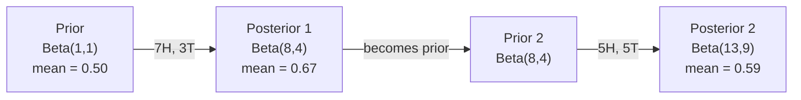

# 贝叶斯定理

> 概率关乎你的预期。贝叶斯定理关乎你学到的东西。

**Type:** Build
**Language:** Python
**Prerequisites:** Phase 1, Lesson 06 (Probability Fundamentals)
**Time:** ~75 分钟

## 学习目标

- 应用 Bayes' theorem（贝叶斯定理）根据先验（prior (先验)）、似然（likelihood (似然)）和证据（evidence (证据)）计算后验概率（posterior (后验)）
- 从零构建一个带 Laplace smoothing（拉普拉斯平滑）和对数空间计算的 Naive Bayes（朴素贝叶斯）文本分类器
- 比较 MLE（Maximum Likelihood Estimation (最大似然估计)）和 MAP（Maximum A Posteriori (最大后验估计)）估计，并解释 MAP 如何对应于 L2 regularization（L2 正则化）
- 使用 Beta-Binomial 共轭先验（conjugate prior (共轭先验)）实现序列贝叶斯更新，用于 A/B 测试

## 问题背景

一项医学测试的准确率为 99%。你测试呈阳性。你实际患病的概率是多少？

大多数人会说 99%。真实答案取决于这种疾病有多罕见。如果每 10,000 人中有 1 人患病，阳性结果仅代表你约有 1% 的患病几率。其余 99% 的阳性结果来自健康人群的误报。

这不是脑筋急转弯。这就是 Bayes' theorem（贝叶斯定理）。每个垃圾邮件过滤器、每个医学诊断、每个量化不确定性的机器学习模型都使用这种精确的推理。你先有一个信念。你观察到证据。你更新信念。

如果你不理解这一点就构建 ML 系统，你会误读模型输出、设置糟糕的阈值、并发布过度自信的预测。

## 核心概念

### 从联合概率到贝叶斯

你在第 06 课已经知道条件概率是：

```
P(A|B) = P(A 且 B) / P(B)
```

对称地：

```
P(B|A) = P(A 且 B) / P(A)
```

两个表达式共享同一个分子：P(A 且 B)。令它们相等并整理：

```
P(A 且 B) = P(A|B) * P(B) = P(B|A) * P(A)

因此：

P(A|B) = P(B|A) * P(A) / P(B)
```

这就是 Bayes' theorem（贝叶斯定理）。四个量，一个方程。

### 四个组成部分

| 部分 | 名称 | 含义 |
|------|------|------|
| P(A\|B) | Posterior（后验 (后验)） | 看到证据 B 后对 A 的更新信念 |
| P(B\|A) | Likelihood（似然 (似然)） | 如果 A 为真，证据 B 有多可能 |
| P(A) | Prior（先验 (先验)） | 在看到任何证据之前对 A 的信念 |
| P(B) | Evidence（证据 (证据)） | 在所有可能性下看到 B 的总概率 |

证据项 P(B) 充当归一化器。你可以用全概率公式展开它：

```
P(B) = P(B|A) * P(A) + P(B|非 A) * P(非 A)
```

### 医学测试示例

一种疾病影响每 10,000 人中的 1 人。测试准确率为 99%（检出 99% 的患者，健康人群假阳性率 1%）。

```
P(患病)          = 0.0001     (先验：疾病罕见)
P(阳性|患病)      = 0.99       (似然：测试能检出)
P(阳性|健康)      = 0.01       (假阳性率)

P(阳性) = P(阳性|患病) * P(患病) + P(阳性|健康) * P(健康)
        = 0.99 * 0.0001 + 0.01 * 0.9999
        = 0.000099 + 0.009999
        = 0.010098

P(患病|阳性) = P(阳性|患病) * P(患病) / P(阳性)
             = 0.99 * 0.0001 / 0.010098
             = 0.0098
             = 0.98%
```

不到 1%。先验占主导地位。当一种疾病罕见时，即使准确的测试也会产生mostly假阳性。这就是为什么医生会要求确认测试。

### 垃圾邮件过滤器示例

你收到一封包含单词 "lottery" 的邮件。它是垃圾邮件吗？

```
P(垃圾邮件)                = 0.3      (30% 的邮件是垃圾邮件)
P("lottery"|垃圾邮件)      = 0.05     (5% 的垃圾邮件包含 "lottery")
P("lottery"|非垃圾邮件)    = 0.001    (0.1% 的合法邮件包含 "lottery")

P("lottery") = 0.05 * 0.3 + 0.001 * 0.7
             = 0.015 + 0.0007
             = 0.0157

P(垃圾邮件|"lottery") = 0.05 * 0.3 / 0.0157
                      = 0.955
                      = 95.5%
```

一个词将概率从 30% 推到了 95.5%。真正的垃圾邮件过滤器会同时对数百个词应用 Bayes。

### 朴素贝叶斯：独立性假设

Naive Bayes（朴素贝叶斯）通过假设给定类别后所有特征条件独立，将这一思想扩展到多特征：

```
P(类别 | 特征_1, 特征_2, ..., 特征_n)
  = P(类别) * P(特征_1|类别) * P(特征_2|类别) * ... * P(特征_n|类别)
    / P(特征_1, 特征_2, ..., 特征_n)
```

"朴素"的部分就是独立性假设。在文本中，词的出现并不独立（"New" 和 "York" 是相关的）。但这个假设在实践中效果出奇地好，因为分类器只需要对类别排序，不需要产生校准的概率。

由于分母对所有类别都相同，你可以跳过它，只比较分子：

```
score(类别) = P(类别) * 所有 P(特征_i | 类别) 的乘积
```

选择得分最高的类别。

### 最大似然估计（MLE）

如何从训练数据中得到 P(特征|类别)？计数。

```
P("free"|垃圾邮件) = (包含 "free" 的垃圾邮件数) / (垃圾邮件总数)
```

这就是 MLE（Maximum Likelihood Estimation (最大似然估计)）：选择使观测数据最可能的参数值。你在最大化似然函数，对于离散计数而言，这简化为相对频率。

问题：如果一个词在训练期间的垃圾邮件中从未出现，MLE 给它概率零。一个未见过的词就使整个乘积归零。用 Laplace smoothing（拉普拉斯平滑）修复：

```
P(词|类别) = (count(词, 类别) + 1) / (类别中的总词数 + 词汇量大小)
```

给每个计数加 1 确保没有任何概率为零。

### 最大后验估计（MAP）

MLE 问：什么参数能最大化 P(数据|参数)？

MAP 问：什么参数能最大化 P(参数|数据)？

根据 Bayes' theorem（贝叶斯定理）：

```
P(参数|数据) 正比于 P(数据|参数) * P(参数)
```

MAP 对参数本身添加了一个先验。如果你相信参数应该很小，你就把它编码为惩罚大值的先验。这与 ML 中的 L2 regularization（L2 正则化）完全相同。岭回归中的 "ridge" 惩罚 literally 就是对权重的 Gaussian 先验。

| 估计方法 | 优化目标 | ML 等价 |
|----------|----------|---------|
| MLE | P(数据\|参数) | 无正则化训练 |
| MAP | P(数据\|参数) * P(参数) | L2 / L1 正则化 |

### 贝叶斯 vs 频率学派：实际差异

频率学派将参数视为固定的未知量。他们问："如果我重复这个实验很多次，会发生什么？"

贝叶斯学派将参数视为分布。他们问："根据我已观察到的东西，我对参数相信什么？"

对于构建 ML 系统，实际差异：

| 方面 | 频率学派 | 贝叶斯学派 |
|------|----------|------------|
| 输出 | 点估计 | 值的分布 |
| 不确定性 | 置信区间（关于程序） | 可信区间（credible interval (可信区间)）（关于参数） |
| 小数据 | 可能过拟合 | 先验充当正则化 |
| 计算 | 通常更快 | 通常需要采样（MCMC） |

大多数生产 ML 是频率学派的（SGD、点估计）。贝叶斯方法在需要校准不确定性（医学决策、安全关键系统）或数据稀缺（少样本学习、冷启动）时大放异彩。

### 为什么贝叶斯思维对 ML 很重要

联系比类比更深：

**先验就是正则化（regularization (正则化)）。** 权重的 Gaussian 先验是 L2 regularization（L2 正则化）。Laplace 先验是 L1。每次你添加正则化项时，你都在对参数值做出贝叶斯陈述。

**后验就是不确定性。** 单一预测概率无法告诉你模型对这个估计有多自信。贝叶斯方法给你一个分布："我认为 P(垃圾邮件) 在 0.8 到 0.95 之间。"

**贝叶斯更新就是在线学习。** 今天的后验成为明天的先验。当模型看到新数据时，它增量更新信念，而不是从头重新训练。

**模型比较是贝叶斯的。** 贝叶斯信息准则（BIC）、边际似然和贝叶斯因子都使用贝叶斯推理来选择模型而不过拟合。

## 动手实现

### 第一步：贝叶斯定理函数

```python
def bayes(prior, likelihood, false_positive_rate):
    evidence = likelihood * prior + false_positive_rate * (1 - prior)
    posterior = likelihood * prior / evidence
    return posterior

result = bayes(prior=0.0001, likelihood=0.99, false_positive_rate=0.01)
print(f"P(sick|positive) = {result:.4f}")
```

### 第二步：朴素贝叶斯分类器

```python
import math
from collections import defaultdict

class NaiveBayes:
    def __init__(self, smoothing=1.0):
        self.smoothing = smoothing
        self.class_counts = defaultdict(int)
        self.word_counts = defaultdict(lambda: defaultdict(int))
        self.class_word_totals = defaultdict(int)
        self.vocab = set()

    def train(self, documents, labels):
        for doc, label in zip(documents, labels):
            self.class_counts[label] += 1
            words = doc.lower().split()
            for word in words:
                self.word_counts[label][word] += 1
                self.class_word_totals[label] += 1
                self.vocab.add(word)

    def predict(self, document):
        words = document.lower().split()
        total_docs = sum(self.class_counts.values())
        vocab_size = len(self.vocab)
        best_class = None
        best_score = float("-inf")
        for cls in self.class_counts:
            score = math.log(self.class_counts[cls] / total_docs)
            for word in words:
                count = self.word_counts[cls].get(word, 0)
                total = self.class_word_totals[cls]
                score += math.log((count + self.smoothing) / (total + self.smoothing * vocab_size))
            if score > best_score:
                best_score = score
                best_class = cls
        return best_class
```

对数概率防止下溢。将许多小概率相乘会产生浮点数无法表示的极小数字。对数概率求和在数值上稳定，且在数学上等价。

### 第三步：在垃圾邮件数据上训练

```python
train_docs = [
    "win free money now",
    "free lottery ticket winner",
    "claim your prize today free",
    "urgent offer free cash",
    "congratulations you won free",
    "meeting tomorrow at noon",
    "project update attached",
    "can we schedule a call",
    "quarterly report review",
    "lunch on thursday sounds good",
    "team standup notes attached",
    "please review the pull request",
]

train_labels = [
    "spam", "spam", "spam", "spam", "spam",
    "ham", "ham", "ham", "ham", "ham", "ham", "ham",
]

classifier = NaiveBayes()
classifier.train(train_docs, train_labels)

test_messages = [
    "free money waiting for you",
    "meeting rescheduled to friday",
    "you won a free prize",
    "please review the attached report",
]

for msg in test_messages:
    print(f"  '{msg}' -> {classifier.predict(msg)}")
```

### 第四步：检查学习到的概率

```python
def show_top_words(classifier, cls, n=5):
    vocab_size = len(classifier.vocab)
    total = classifier.class_word_totals[cls]
    probs = {}
    for word in classifier.vocab:
        count = classifier.word_counts[cls].get(word, 0)
        probs[word] = (count + classifier.smoothing) / (total + classifier.smoothing * vocab_size)
    sorted_words = sorted(probs.items(), key=lambda x: x[1], reverse=True)
    for word, prob in sorted_words[:n]:
        print(f"    {word}: {prob:.4f}")

print("\nTop spam words:")
show_top_words(classifier, "spam")
print("\nTop ham words:")
show_top_words(classifier, "ham")
```

## 调用库函数

Scikit-learn 提供了生产级的 naive Bayes 实现：

```python
from sklearn.feature_extraction.text import CountVectorizer
from sklearn.naive_bayes import MultinomialNB
from sklearn.metrics import classification_report

vectorizer = CountVectorizer()
X_train = vectorizer.fit_transform(train_docs)
clf = MultinomialNB()
clf.fit(X_train, train_labels)

X_test = vectorizer.transform(test_messages)
predictions = clf.predict(X_test)
for msg, pred in zip(test_messages, predictions):
    print(f"  '{msg}' -> {pred}")
```

同样的算法。CountVectorizer 处理分词和词表构建。MultinomialNB 内部处理平滑和对数概率。你的从零实现版本用 40 行代码做了同样的事。

## Ship It

这里构建的 NaiveBayes 类展示了完整流程：分词、带 Laplace smoothing（拉普拉斯平滑）的概率估计、对数空间预测。`code/bayes.py` 中的代码仅使用 Python 标准库即可端到端运行。

### 共轭先验

当先验（prior (先验)）和后验（posterior (后验)）属于同一分布族时，该先验被称为 "共轭"。这使得贝叶斯更新在代数上非常简洁——你得到一个闭式后验，无需数值积分。

| 似然 | 共轭先验 | 后验 | 示例 |
|-----------|----------------|-----------|---------|
| Bernoulli | Beta(a, b) | Beta(a + 成功次数, b + 失败次数) | 硬币偏差估计 |
| Normal（已知方差） | Normal(mu_0, sigma_0) | Normal（加权均值，更小方差） | 传感器校准 |
| Poisson | Gamma(a, b) | Gamma(a + 计数之和, b + n) | 到达率建模 |
| Multinomial | Dirichlet(alpha) | Dirichlet(alpha + 计数) | 主题建模、语言模型 |

为什么这很重要：没有共轭先验，你需要蒙特卡罗采样或变分推断来近似后验。有了共轭先验，你只需更新两个数字。

Beta 分布是实践中最常见的共轭先验。Beta(a, b) 代表你对一个概率参数的信念。均值是 a/(a+b)。a+b 越大，分布越集中（越自信）。

Beta 先验的特殊情况：
- Beta(1, 1) = 均匀分布。你对参数没有先入之见。
- Beta(10, 10) = 在 0.5 处尖峰。你强烈相信参数接近 0.5。
- Beta(1, 10) = 偏向 0。你相信参数很小。

更新规则极其简单：

```
先验：     Beta(a, b)
数据：      s 次成功，f 次失败
后验：      Beta(a + s, b + f)
```

没有积分。没有采样。只有加法。

### 序列贝叶斯更新

贝叶斯推断天然是序列式的。今天的后验成为明天的先验。这就是真实系统如何增量学习而无需重新处理所有历史数据。

具体示例：估计一枚硬币是否公平。

**第 1 天：尚无数据。**
从 Beta(1, 1) 开始——均匀先验。你没有先入之见。
- 先验均值：0.5
- 先验在 [0, 1] 上平坦

**第 2 天：观察到 7 次正面，3 次反面。**
后验 = Beta(1 + 7, 1 + 3) = Beta(8, 4)
- 后验均值：8/12 = 0.667
- 证据表明硬币偏向正面

**第 3 天：再观察到 5 次正面，5 次反面。**
用昨天的后验作为今天的先验。
后验 = Beta(8 + 5, 4 + 5) = Beta(13, 9)
- 后验均值：13/22 = 0.591
- 均衡的新数据将估计拉回了 0.5



观察顺序无关紧要。Beta(1,1) 一次性用全部 12 次正面和 8 次反面更新得到 Beta(13, 9)——同样的结果。序列更新和批量更新在数学上等价。但序列更新让你在每一步都能做决策，无需存储原始数据。

这是生产 ML 系统中在线学习的基础。用于 bandit 的 Thompson sampling、增量推荐系统和流式异常检测器都使用这种模式。

### 与 A/B 测试的联系

A/B 测试其实是伪装起来的贝叶斯推断。

设定：你在测试两种按钮颜色。变体 A（蓝色）和变体 B（绿色）。你想知道哪个点击率更高。

贝叶斯 A/B 测试：

1. **先验。** 两个变体都从 Beta(1, 1) 开始。没有先验偏好。
2. **数据。** 变体 A：1000 次展示中 50 次点击。变体 B：1000 次展示中 65 次点击。
3. **后验。**
   - A：Beta(1 + 50, 1 + 950) = Beta(51, 951)。均值 = 0.051
   - B：Beta(1 + 65, 1 + 935) = Beta(66, 936)。均值 = 0.066
4. **决策。** 计算 P(B > A)——B 的真实转化率高于 A 的概率。

解析计算 P(B > A) 很难。但蒙特卡罗让它变得 trivial：

```
1. 从 Beta(51, 951) 抽取 100,000 个样本 -> samples_A
2. 从 Beta(66, 936) 抽取 100,000 个样本 -> samples_B
3. P(B > A) = B > A 的样本比例
```

如果 P(B > A) > 0.95，你发布变体 B。如果在 0.05 到 0.95 之间，你继续收集数据。如果 P(B > A) < 0.05，你发布变体 A。

相比频率学派 A/B 测试的优势：
- 你得到一个直接的概率陈述："B 更好的概率是 97%"
- 没有 p 值混淆。没有 "无法拒绝原假设" 的含糊其辞。
- 你可以随时查看结果而不会抬高假阳性率（没有 "偷看问题"）
- 你可以纳入先验知识（例如，之前的测试表明转化率通常在 3-8%）

| 方面 | 频率学派 A/B | 贝叶斯 A/B |
|------|--------------|------------|
| 输出 | p 值 | P(B > A) |
| 解释 | "如果 A=B，这数据有多惊人？" | "B 比 A 好的可能性有多大？" |
| 提前停止 | 抬高假阳性 | 任何时刻都安全（给定良好选择的先验和正确指定的模型） |
| 先验知识 | 不使用 | 编码为 Beta 先验 |
| 决策规则 | p < 0.05 | P(B > A) > threshold |

## 练习

1. **多次测试。** 一名患者在两次独立测试中都呈阳性（两者准确率均为 99%，疾病患病率 1/10,000）。两次测试后 P(患病) 是多少？用第一次测试的后验作为第二次测试的先验。

2. **平滑的影响。** 用 smoothing 值 0.01、0.1、1.0 和 10.0 运行垃圾邮件分类器。top 词概率如何变化？当 smoothing=0 且某个词只在 ham 中出现时会发生什么？

3. **添加特征。** 扩展 NaiveBayes 类，也将消息长度（短/长）作为与词计数并行的特征。从训练数据中估计 P(短|垃圾邮件) 和 P(短|ham)，并将其纳入预测得分。

4. **手算 MAP。** 给定观测数据（10 次抛硬币中有 7 次正面），使用 Beta(2,2) 先验计算偏差的 MAP 估计。与 MLE 估计（7/10）比较。

## 关键术语

| 术语 | 人们怎么说 | 实际含义 |
|------|-----------|---------|
| Prior（先验 (先验)） | "我的初始猜测" | 观察证据前 P(假设)。在 ML 中：正则化项。 |
| Likelihood（似然 (似然)） | "数据拟合得怎么样" | P(证据\|假设)。在特定假设下观测数据有多可能。 |
| Posterior（后验 (后验)） | "我的更新信念" | P(假设\|证据)。先验乘以似然，然后归一化。 |
| Evidence（证据 (证据)） | "归一化常数" | 所有假设下的 P(数据)。确保后验求和为 1。 |
| Naive Bayes（朴素贝叶斯） | "那个简单的文本分类器" | 假设特征在给定类别下条件独立的分类器。尽管假设错误，但效果良好。 |
| Laplace smoothing（拉普拉斯平滑） | "加一平滑" | 给每个特征添加一个小计数，防止未见数据产生零概率。 |
| MLE（最大似然估计） | "就用频率" | 选择最大化 P(数据\|参数) 的参数。没有先验。小数据可能过拟合。 |
| MAP（最大后验估计） | "带先验的 MLE" | 选择最大化 P(数据\|参数) * P(参数) 的参数。等价于正则化 MLE。 |
| Log-probability（对数概率） | "在对数空间工作" | 使用 log(P) 代替 P，避免将许多小数相乘时的浮点下溢。 |
| False positive（假阳性） | "误报" | 测试说阳性，但真实状态是阴性。驱动基率谬误。 |

## 延伸阅读

- [3Blue1Brown: 贝叶斯定理](https://www.youtube.com/watch?v=HZGCoVF3YvM) - 医学测试示例的可视化解释
- [Stanford CS229: 生成学习算法](https://cs229.stanford.edu/notes2022fall/cs229-notes2.pdf) - 朴素贝叶斯及其与判别模型的联系
- [Think Bayes](https://greenteapress.com/wp/think-bayes/) - 免费书籍，用 Python 代码讲解贝叶斯统计
- [scikit-learn 朴素贝叶斯](https://scikit-learn.org/stable/modules/naive_bayes.html) - 生产实现及每种变体的适用场景
