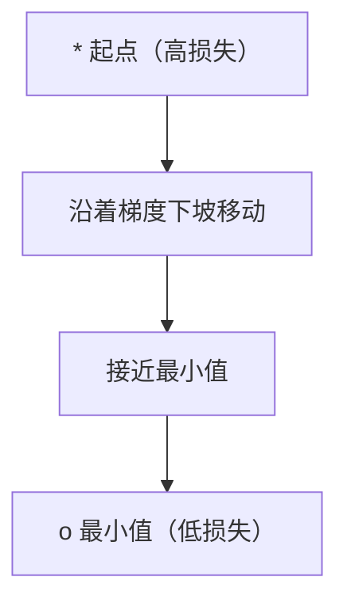
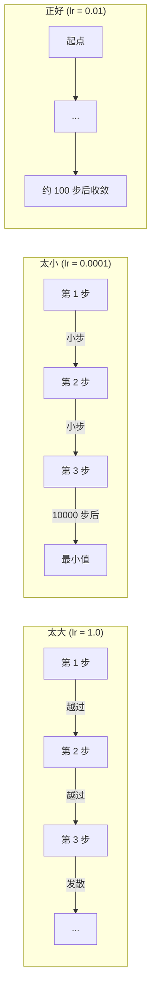
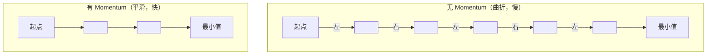
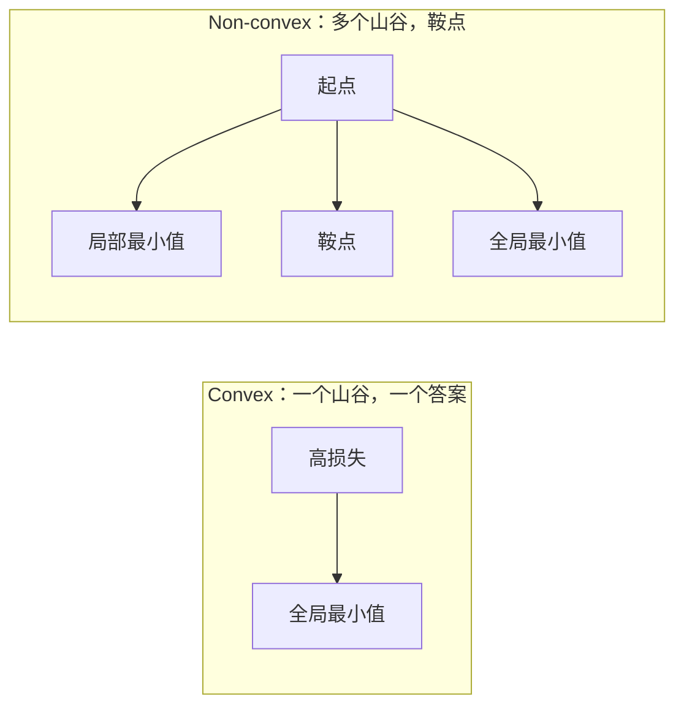
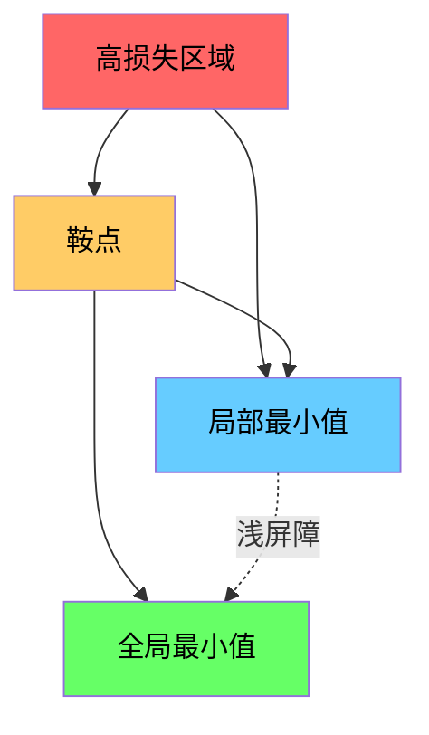

# 优化

> 训练神经网络不过是找到山谷的底部。

**Type:** Build
**Language:** Python
**Prerequisites:** Phase 1, Lessons 04-05 (Derivatives, Gradients)
**Time:** ~75 分钟

## 学习目标

- 从零实现 vanilla gradient descent（梯度下降）、SGD with momentum（带动量的随机梯度下降）和 Adam（自适应矩估计）
- 在 Rosenbrock 函数上比较优化器的收敛性，并解释为什么 Adam 能自适应每个权重的 learning rate（学习率）
- 区分 convex（凸）与 non-convex（非凸）损失 landscape（损失 landscape），并解释 saddle point（鞍点）在高维空间中的作用
- 为训练稳定性配置 learning rate schedule（学习率调度）（step decay、cosine annealing、warmup）

## 问题背景

你有一个 loss function（损失函数）。它告诉你模型有多错。你有 gradients（梯度）。它们告诉你哪个方向会让损失变大。现在你需要一个沿着山坡往下走的策略。

朴素方法很简单：沿着梯度的反方向移动。将步长缩放为一个称为 learning rate（学习率）的数字。重复。这就是 gradient descent（梯度下降），它有效。但 "有效" 有前提。learning rate（学习率）太大，你会越过整个山谷，在两侧墙壁之间弹跳。learning rate（学习率）太小，你会在数千个不必要的步骤中爬向答案。碰到 saddle point（鞍点），你会停止移动，尽管你还没有找到最小值。

深度学习中的每个优化器都是同一个问题的答案：如何更快、更可靠地到达山谷底部？

## 核心概念

### 优化的含义

优化是找到使函数最小化（或最大化）的输入值。在机器学习中，函数是 loss function（损失函数）。输入是模型的权重。训练就是优化。

```
最小化 L(w)，其中：
  L = loss function（损失函数）
  w = 模型权重（可能是数百万个参数）
```

### Gradient descent（梯度下降）（vanilla）

最简单的优化器。计算 loss function（损失函数）对每个权重的梯度。让每个权重沿着其梯度的反方向移动。用 learning rate（学习率）缩放步长。

```
w = w - lr * gradient
```

这就是整个算法。一行代码。



### Learning rate（学习率）：最重要的超参数

learning rate（学习率）控制步长。它决定一切关于收敛的事。



没有公式能给出正确的 learning rate（学习率）。你通过实验找到它。常见起点：Adam 用 0.001，带动量的 SGD 用 0.01。

### SGD vs batch vs mini-batch

Vanilla gradient descent 在整个数据集上计算梯度后才走一步。这称为 batch gradient descent（批量梯度下降）。它稳定但慢。

Stochastic gradient descent（SGD, 随机梯度下降）在一个随机样本上计算梯度并立即走一步。它噪声大但快。

Mini-batch gradient descent（小批量梯度下降）折中。在一个小批量（32、64、128、256 个样本）上计算梯度，然后走一步。这就是大家实际使用的。

| 变体 | Batch size（批量大小 (批量大小)） | 梯度质量 | 每步速度 | 噪声 |
|------|--------|---------|---------|------|
| Batch GD | 整个数据集 | 精确 | 慢 | 无 |
| SGD | 1 个样本 | 非常噪声 | 快 | 高 |
| Mini-batch | 32-256 | 良好估计 | 均衡 | 中等 |

SGD 和 mini-batch 中的噪声不是 bug。它帮助逃离浅的局部最小值和 saddle point（鞍点）。

### Momentum（动量）：滚下山的球

Vanilla gradient descent 只看当前梯度。如果梯度曲折（在狭窄山谷中很常见），进展缓慢。Momentum（动量）通过将过去梯度累积到 velocity（速度）项来修复这一点。

```
v = beta * v + gradient
w = w - lr * v
```

类比：一个滚下山的球。它不会在每次颠簸处停下来重新启动。它会在一致方向上加速，并抑制振荡。



`beta`（通常 0.9）控制保留多少历史。更高的 beta 意味着更多 momentum（动量），更平滑的路径，但对方向变化的响应更慢。

### Adam：自适应学习率

不同权重需要不同的 learning rate（学习率）。一个很少获得大梯度的权重应该在它终于获得时迈大步。一个不断获得巨大梯度的权重应该迈小步。

Adam（Adaptive Moment Estimation (自适应矩估计)）为每个权重跟踪两件事：

1. 一阶矩（m）：梯度的移动平均（类似 momentum（动量））
2. 二阶矩（v）：梯度平方的移动平均（梯度幅度）

```
m = beta1 * m + (1 - beta1) * gradient
v = beta2 * v + (1 - beta2) * gradient^2

m_hat = m / (1 - beta1^t)    bias correction（偏差修正）
v_hat = v / (1 - beta2^t)    bias correction（偏差修正）

w = w - lr * m_hat / (sqrt(v_hat) + epsilon)
```

除以 `sqrt(v_hat)` 是关键洞察。获得大梯度的权重被除以一个大数（有效步长小）。获得小梯度的权重被除以一个小数（有效步长大）。每个权重获得自己的自适应 learning rate（学习率）。

默认超参数（hyperparameter (超参数)）：`lr=0.001, beta1=0.9, beta2=0.999, epsilon=1e-8`。这些默认值对大多数问题都有效。

### Learning rate schedule（学习率调度）

固定的 learning rate（学习率）是一种妥协。训练早期，你想要大步以快速进展。训练后期，你想要小步以在最小值附近精细调整。

常见 schedule：

| Schedule | 公式 | 用例 |
|----------|------|------|
| Step decay | lr = lr * factor 每 N 个 epoch | 简单，手动控制 |
| Exponential decay | lr = lr_0 * decay^t | 平滑下降 |
| Cosine annealing | lr = lr_min + 0.5 * (lr_max - lr_min) * (1 + cos(pi * t / T)) | Transformer、现代训练 |
| Warmup + decay | 线性 ramp up，然后 decay | 大模型，防止早期不稳定 |

### Convex（凸）vs non-convex（非凸）

Convex（凸）函数只有一个最小值。Gradient descent（梯度下降）总能找到它。像 `f(x) = x^2` 这样的二次函数是 convex（凸）的。

神经网络 loss function（损失函数）是 non-convex（非凸）的。它们有许多局部最小值、鞍点（saddle point (鞍点)）和平坦区域。



在实践中，高维神经网络中的局部最小值很少是问题。大多数局部最小值的损失值接近全局最小值。Saddle point（鞍点）（某些方向平坦，其他方向弯曲）才是真正的障碍。Momentum（动量）和 mini-batch 的噪声帮助逃离它们。

### Loss landscape（损失 landscape）可视化

损失是所有权重的函数。对于一个有 100 万个权重的模型，loss landscape（损失 landscape）存在于 1,000,001 维空间中。我们通过在权重空间中选择两个随机方向并沿这些方向绘制损失来可视化它，产生一个 2D 表面。



Sharp minima（尖锐最小值）泛化差。Flat minima（平坦最小值）泛化好。这就是为什么带动量的 SGD 在最终测试准确率上经常击败 Adam 的原因之一：它的噪声防止 settled 到 sharp minima（尖锐最小值）中。

## 动手实现

### 第一步：定义测试函数

Rosenbrock 函数是一个经典的优化基准。它的最小值在 (1, 1)，位于一个狭窄弯曲的山谷中，容易找到但难以跟随。

```
f(x, y) = (1 - x)^2 + 100 * (y - x^2)^2
```

```python
def rosenbrock(params):
    x, y = params
    return (1 - x) ** 2 + 100 * (y - x ** 2) ** 2

def rosenbrock_gradient(params):
    x, y = params
    df_dx = -2 * (1 - x) + 200 * (y - x ** 2) * (-2 * x)
    df_dy = 200 * (y - x ** 2)
    return [df_dx, df_dy]
```

### 第二步：Vanilla gradient descent（梯度下降）

```python
class GradientDescent:
    def __init__(self, lr=0.001):
        self.lr = lr

    def step(self, params, grads):
        return [p - self.lr * g for p, g in zip(params, grads)]
```

### 第三步：SGD with momentum（带动量的随机梯度下降）

```python
class SGDMomentum:
    def __init__(self, lr=0.001, momentum=0.9):
        self.lr = lr
        self.momentum = momentum
        self.velocity = None

    def step(self, params, grads):
        if self.velocity is None:
            self.velocity = [0.0] * len(params)
        self.velocity = [
            self.momentum * v + g
            for v, g in zip(self.velocity, grads)
        ]
        return [p - self.lr * v for p, v in zip(params, self.velocity)]
```

### 第四步：Adam（自适应矩估计）

```python
class Adam:
    def __init__(self, lr=0.001, beta1=0.9, beta2=0.999, epsilon=1e-8):
        self.lr = lr
        self.beta1 = beta1
        self.beta2 = beta2
        self.epsilon = epsilon
        self.m = None
        self.v = None
        self.t = 0

    def step(self, params, grads):
        if self.m is None:
            self.m = [0.0] * len(params)
            self.v = [0.0] * len(params)

        self.t += 1

        self.m = [
            self.beta1 * m + (1 - self.beta1) * g
            for m, g in zip(self.m, grads)
        ]
        self.v = [
            self.beta2 * v + (1 - self.beta2) * g ** 2
            for v, g in zip(self.v, grads)
        ]

        m_hat = [m / (1 - self.beta1 ** self.t) for m in self.m]
        v_hat = [v / (1 - self.beta2 ** self.t) for v in self.v]

        return [
            p - self.lr * mh / (vh ** 0.5 + self.epsilon)
            for p, mh, vh in zip(params, m_hat, v_hat)
        ]
```

### 第五步：运行并比较

```python
def optimize(optimizer, func, grad_func, start, steps=5000):
    params = list(start)
    history = [params[:]]
    for _ in range(steps):
        grads = grad_func(params)
        params = optimizer.step(params, grads)
        history.append(params[:])
    return history

start = [-1.0, 1.0]

gd_history = optimize(GradientDescent(lr=0.0005), rosenbrock, rosenbrock_gradient, start)
sgd_history = optimize(SGDMomentum(lr=0.0001, momentum=0.9), rosenbrock, rosenbrock_gradient, start)
adam_history = optimize(Adam(lr=0.01), rosenbrock, rosenbrock_gradient, start)

for name, history in [("GD", gd_history), ("SGD+M", sgd_history), ("Adam", adam_history)]:
    final = history[-1]
    loss = rosenbrock(final)
    print(f"{name:6s} -> x={final[0]:.6f}, y={final[1]:.6f}, loss={loss:.8f}")
```

预期输出：Adam 收敛最快。带动量的 SGD 沿着更平滑的路径。Vanilla GD 在狭窄山谷中进展缓慢。

## 调用库函数

在实践中，使用 PyTorch 或 JAX 的优化器。它们处理参数分组、weight decay（权重衰减）、gradient clipping（梯度裁剪）和 GPU 加速。

```python
import torch

model = torch.nn.Linear(784, 10)

sgd = torch.optim.SGD(model.parameters(), lr=0.01, momentum=0.9)
adam = torch.optim.Adam(model.parameters(), lr=0.001)
adamw = torch.optim.AdamW(model.parameters(), lr=0.001, weight_decay=0.01)

scheduler = torch.optim.lr_scheduler.CosineAnnealingLR(adam, T_max=100)
```

经验法则：

- 从 Adam（lr=0.001）开始。它在大多数问题上无需调参就能工作。
- 当你需要最佳最终准确率且能承受更多调参时，切换到带动量的 SGD（lr=0.01, momentum=0.9）。
- 对于 transformer，使用 AdamW（解耦 weight decay（权重衰减）的 Adam）。
- 对于超过几个 epoch 的训练运行，始终使用 learning rate schedule（学习率调度）。
- 如果训练不稳定，降低 learning rate（学习率）。如果训练太慢，提高它。

## Ship It

本课产出一个用于选择正确优化器的 prompt。见 `outputs/prompt-optimizer-guide.md`。

这里构建的优化器类在 Phase 3 中我们从头训练神经网络时会再次出现。

## 练习

1. **Learning rate（学习率）扫描。** 用 learning rate（学习率）[0.0001, 0.0005, 0.001, 0.005, 0.01] 在 Rosenbrock 函数上运行 vanilla gradient descent（梯度下降）。打印或绘制每种情况下 5000 步后的最终损失。找到仍能收敛的最大 learning rate（学习率）。

2. **Momentum（动量）比较。** 用 momentum（动量）值 [0.0, 0.5, 0.9, 0.99] 在 Rosenbrock 函数上运行 SGD。跟踪每步的损失。哪个 momentum（动量）值收敛最快？哪个越过了？

3. **Saddle point（鞍点）逃离。** 定义函数 `f(x, y) = x^2 - y^2`（原点处的一个鞍点）。从 (0.01, 0.01) 开始。比较 vanilla GD、带动量的 SGD 和 Adam 的行为。哪个逃离了鞍点？

4. **实现 learning rate decay（学习率衰减）。** 给 GradientDescent 类添加指数衰减 schedule：`lr = lr_0 * 0.999^step`。在 Rosenbrock 函数上比较有无 decay 的收敛性。

## 关键术语

| 术语 | 人们怎么说 | 实际含义 |
|------|-----------|---------|
| Gradient descent（梯度下降） | "下山" | 用 learning rate（学习率）缩放后减去梯度来更新权重。最基本的优化器。 |
| Learning rate（学习率） | "步长" | 一个标量，控制每次更新移动权重的距离。太大会导致发散。太小会浪费计算。 |
| Momentum（动量） | "继续滚" | 将过去梯度累积到 velocity（速度）向量中。抑制振荡并加速沿一致方向的移动。 |
| SGD | "随机采样" | Stochastic gradient descent（随机梯度下降）。在随机子集而非完整数据集上计算梯度。实践中几乎总是指 mini-batch SGD。 |
| Mini-batch（小批量） | "一块数据" | 一小部分训练数据（32-256 个样本），用于估计梯度。平衡速度和梯度精度。 |
| Adam | "默认优化器" | Adaptive Moment Estimation（自适应矩估计）。跟踪梯度和梯度平方的每权重移动平均，给每个权重自己的 learning rate（学习率）。 |
| Bias correction（偏差修正） | "修复冷启动" | Adam 的一阶和二阶矩初始化为零。偏差修正除以 (1 - beta^t) 以补偿早期步骤。 |
| Learning rate schedule（学习率调度） | "随时间改变 lr" | 在训练期间调整 learning rate（学习率）的函数。早期大步，后期小步。 |
| Convex function（凸函数） | "一个山谷" | 任何局部最小值都是全局最小值的函数。Gradient descent（梯度下降）总能找到它。神经网络损失不是凸的。 |
| Saddle point（鞍点） | "平坦但不是最小值" | 梯度为零的点，但在某些方向是最小值，在其他方向是最大值。在高维空间中很常见。 |
| Loss landscape（损失 landscape） | "地形" | 在权重空间上绘制的 loss function（损失函数）。通过沿两个随机方向切片来可视化。 |
| Convergence（收敛） | "到达了" | 优化器到达了一个点，进一步的步骤不再有意义地降低损失。 |

## 延伸阅读

- [Sebastian Ruder: 梯度下降优化算法概览](https://ruder.io/optimizing-gradient-descent/) - 所有主要优化器的综合综述
- [Why Momentum Really Works (Distill)](https://distill.pub/2017/momentum/) - momentum（动量）动力学的交互式可视化
- [Adam: A Method for Stochastic Optimization (Kingma & Ba, 2014)](https://arxiv.org/abs/1412.6980) - 原始 Adam 论文，可读且简短
- [Visualizing the Loss Landscape of Neural Nets (Li et al., 2018)](https://arxiv.org/abs/1712.09913) - 展示尖锐 vs 平坦最小值的论文
