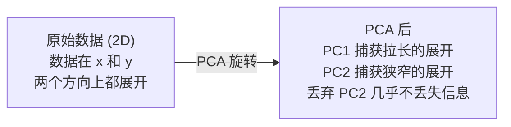

# 降维

> 高维数据具有结构。你需要从正确的角度去发现它。

**Type:** Build
**Language:** Python
**Prerequisites:** Phase 1, Lessons 01 (Linear Algebra Intuition), 02 (Vectors, Matrices & Operations), 03 (Eigenvalues & Eigenvectors), 06 (Probability & Distributions)
**Time:** ~90 分钟

## 学习目标

- 从零实现 PCA（Principal Component Analysis (主成分分析)）：中心化数据、计算 covariance matrix（协方差矩阵）、特征分解、投影
- 使用 explained variance ratio（解释方差比）和肘部法选择主成分数量
- 比较 PCA、t-SNE（t-Distributed Stochastic Neighbor Embedding (t-分布随机邻域嵌入)）和 UMAP（Uniform Manifold Approximation and Projection (统一流形近似与投影)）在 2D 可视化 MNIST 数字上的效果，并解释它们的权衡
- 应用 kernel PCA（核主成分分析）配合 RBF 核来分离标准 PCA 无法处理的非线性数据结构

## 问题背景

你有一个数据集，每个样本有 784 个特征。也许是手写数字的像素值。也许是基因表达水平。也许是用户行为信号。你无法可视化 784 维。你无法绘制它们。你甚至无法思考它们。

但那 784 个特征中的大多数是冗余的。实际信息生活在一个小得多的表面上。一个手写的 "7" 不需要 784 个独立数字来描述它。它只需要几个：笔画的角度、横杠的长度、倾斜程度。其余都是噪声。

降维（dimensionality reduction (降维)）找到那个更小的表面。它将你的 784 维数据压缩到 2、10 或 50 维，同时保留重要的结构。

## 核心概念

### 维度灾难

高维空间是反直觉的。随着维度增长，三件事会崩坏。

**距离变得没有意义。** 在高维空间中，任意两个随机点之间的距离收敛到同一个值。如果每个点到其他每个点的距离都差不多，最近邻搜索就停止工作。

```
维度    随机点之间的平均距离比（最大/最小）
2            ~5.0
10           ~1.8
100          ~1.2
1000         ~1.02
```

**体积集中在角落。** d 维的单位超立方体有 2^d 个角落。在 100 维中，几乎所有体积都在角落里，远离中心。数据点扩散到边缘，你的模型在内部缺乏数据。

**你需要指数级更多的数据。** 为了在空间中维持相同的样本密度，从 2D 到 20D 意味着你需要 10^18 倍的数据。你永远不够。降维将数据密度带回可工作的水平。

### PCA：找到重要的方向

PCA（Principal Component Analysis (主成分分析)）找到你的数据变化最大的轴。它旋转你的坐标系，使得第一个轴捕获最多方差，第二个捕获次多方差，以此类推。

算法：

```
1. 中心化数据        （从每个特征减去均值）
2. 计算协方差        （特征如何一起变动）
3. 特征分解           （找到主方向）
4. 按 eigenvalue（特征值）排序   （最大方差在前）
5. 投影              （保留前 k 个 eigenvector（特征向量），丢弃其余）
```

为什么特征分解？Covariance matrix（协方差矩阵）是对称且半正定的。它的 eigenvector（特征向量）是特征空间中的正交方向。Eigenvalue（特征值）告诉你每个方向捕获多少方差。最大 eigenvalue（特征值）对应的 eigenvector（特征向量）指向最大方差的方向。



- **PCA 前：** 数据云在两个 x 和 y 轴上对角展开
- **PCA 后：** 坐标系被旋转，PC1 与最大方差方向（拉长的展开）对齐，PC2 与最小方差方向（狭窄的展开）对齐
- **降维：** 丢弃 PC2 将数据投影到 PC1 上，几乎不丢失信息

### Explained variance ratio（解释方差比）

每个 principal component（主成分）捕获总方差的一部分。Explained variance ratio（解释方差比）告诉你这部分是多少。

```
成分    Eigenvalue（特征值）    解释比例    累积
PC1          4.73          0.473              0.473
PC2          2.51          0.251              0.724
PC3          1.12          0.112              0.836
PC4          0.89          0.089              0.925
...
```

当累积 explained variance ratio（解释方差比）达到 0.95 时，你就知道这么多成分捕获了 95% 的信息。之后的大多是噪声。

### 选择成分数量

三种策略：

1. **阈值。** 保留足够解释 90-95% 方差的成分。
2. **肘部法。** 绘制每个成分的 explained variance（解释方差）。寻找急剧下降点。
3. **下游性能。** 将 PCA 用作预处理。扫描 k 并测量模型准确率。准确率平台期处的最佳 k 就是你要的。

### t-SNE：保留邻域

t-SNE（t-Distributed Stochastic Neighbor Embedding (t-分布随机邻域嵌入)）专为可视化设计。它将高维数据映射到 2D（或 3D），同时保留哪些点彼此邻近。

直觉：在原始空间中，基于距离计算点对之间的概率分布。邻近点获得高概率。远离点获得低概率。然后找到一个 2D 排布，使得同样的概率分布成立。在 784 维中是邻居的点在 2D 中保持为邻居。

t-SNE 的关键性质：
- 非线性。它能展开 PCA 无法处理的复杂流形（manifold (流形)）。
- 随机性。不同运行产生不同布局。
- Perplexity（困惑度）参数控制考虑多少邻居（典型范围：5-50）。
- 输出中簇之间的距离没有意义。只有簇本身有意义。
- 大数据集上慢。默认 O(n^2)。

### UMAP：更快，更好的全局结构

UMAP（Uniform Manifold Approximation and Projection (统一流形近似与投影)）工作方式类似于 t-SNE，但有两个优势：
- 更快。它使用近似最近邻图而不是计算所有成对距离。
- 更好的全局结构。输出中簇的相对位置往往比 t-SNE 更有意义。

UMAP 在高维空间中构建加权图（"模糊拓扑表示"），然后找到一个尽可能保留这个图的低维布局。

关键参数：
- `n_neighbors`：多少邻居定义局部结构（类似于 perplexity（困惑度））。更高的值保留更多全局结构。
- `min_dist`：输出中点聚集的紧密程度。较低的值创建更密集的簇。

### 何时使用哪个

| 方法 | 用例 | 保留 | 速度 |
|--------|----------|-----------|-------|
| PCA | 训练前的预处理 | 全局方差 | 快（精确），可处理数百万样本 |
| PCA | 快速探索性可视化 | 线性结构 | 快 |
| t-SNE | 出版物质量的 2D 图 | 局部邻域 | 慢（< 10k 样本理想） |
| UMAP | 大规模 2D 可视化 | 局部 + 部分全局结构 | 中等（可处理数百万） |
| PCA | 模型的特征降维 | 按方差排序的特征 | 快 |
| t-SNE / UMAP | 理解簇结构 | 簇分离 | 中到慢 |

经验法则：用 PCA 做预处理和数据压缩。用 t-SNE 或 UMAP 做 2D 结构可视化。

### Kernel PCA（核主成分分析）

标准 PCA 找到线性子空间。它旋转你的坐标系并丢弃轴。但如果数据生活在一个非线性流形（manifold (流形)）上呢？2D 中的一个圆无法被任何直线分离。标准 PCA 帮不上忙。

Kernel PCA（核主成分分析）在一个由核函数诱导的高维特征空间中应用 PCA，而无需显式计算该空间中的坐标。这就是核技巧——SVM 背后的相同思想。

算法：
1. 计算核矩阵 K，其中 K_ij = k(x_i, x_j)
2. 在特征空间中中心化核矩阵
3. 对中心化核矩阵进行特征分解
4. 顶部 eigenvector（特征向量）（按 1/sqrt(eigenvalue（特征值）) 缩放）就是投影

常见核函数：

| 核 | 公式 | 适用于 |
|--------|---------|----------|
| RBF (Gaussian) | exp(-gamma * ||x - y||^2) | 大多数非线性数据、平滑流形 |
| Polynomial | (x . y + c)^d | 多项式关系 |
| Sigmoid | tanh(alpha * x . y + c) | 类神经网络映射 |

何时使用 kernel PCA（核主成分分析）vs 标准 PCA：

| 标准 | 标准 PCA | Kernel PCA（核主成分分析） |
|-----------|-------------|------------|
| 数据结构 | 线性子空间 | 非线性流形（manifold (流形)） |
| 速度 | O(min(n^2 d, d^2 n)) | O(n^2 d + n^3) |
| 可解释性 | 成分是原始特征的线性组合 | 成分缺乏直接的特征解释 |
| 可扩展性 | 可处理数百万样本 | 核矩阵是 n x n，受内存限制 |
| 重构 | 直接逆变换 | 需要 pre-image 近似 |

经典示例：2D 中的同心圆。两圈点，一个在内一个在外。标准 PCA 将两者投影到同一条线上——对分类无用。Kernel PCA（核主成分分析）配合 RBF 核将内圈和外圈映射到不同区域，使它们线性可分。

### Reconstruction Error（重构误差）

你的降维有多好？你将 784 维压缩到 50。你丢失了什么？

衡量 reconstruction error（重构误差）：
1. 将数据投影到 k 维：X_reduced = X @ W_k
2. 重构：X_hat = X_reduced @ W_k^T
3. 计算 MSE：mean((X - X_hat)^2)

对于 PCA，reconstruction error（重构误差）与 explained variance（解释方差）有清晰的关系：

```
Reconstruction error（重构误差） = 未包含的 eigenvalue（特征值）之和
总方差 = 所有 eigenvalue（特征值）之和
丢失比例 = （丢弃的 eigenvalue（特征值）之和）/（所有 eigenvalue（特征值）之和）
```

每个成分的 explained variance ratio（解释方差比）为：

```
explained_ratio_k = eigenvalue_k / sum(所有 eigenvalue)
```

绘制累积 explained variance（解释方差）对成分数量的曲线，得到"肘部"曲线。正确的成分数量在：
- 曲线变平坦处（收益递减）
- 累积方差跨过你的阈值处（通常 0.90 或 0.95）
- 下游任务性能平台期处

Reconstruction error（重构误差）在选 k 之外还有用。你可以用它做异常检测：reconstruction error（重构误差）高的样本是不符合学习子空间的离群点。这是生产系统中基于 PCA 的异常检测的基础。

## 动手实现

### 第一步：从零实现 PCA

```python
import numpy as np

class PCA:
    def __init__(self, n_components):
        self.n_components = n_components
        self.components = None
        self.mean = None
        self.eigenvalues = None
        self.explained_variance_ratio_ = None

    def fit(self, X):
        self.mean = np.mean(X, axis=0)
        X_centered = X - self.mean

        cov_matrix = np.cov(X_centered, rowvar=False)

        eigenvalues, eigenvectors = np.linalg.eigh(cov_matrix)

        sorted_idx = np.argsort(eigenvalues)[::-1]
        eigenvalues = eigenvalues[sorted_idx]
        eigenvectors = eigenvectors[:, sorted_idx]

        self.components = eigenvectors[:, :self.n_components].T
        self.eigenvalues = eigenvalues[:self.n_components]
        total_var = np.sum(eigenvalues)
        self.explained_variance_ratio_ = self.eigenvalues / total_var

        return self

    def transform(self, X):
        X_centered = X - self.mean
        return X_centered @ self.components.T

    def fit_transform(self, X):
        self.fit(X)
        return self.transform(X)
```

### 第二步：在合成数据上测试

```python
np.random.seed(42)
n_samples = 500

t = np.random.uniform(0, 2 * np.pi, n_samples)
x1 = 3 * np.cos(t) + np.random.normal(0, 0.2, n_samples)
x2 = 3 * np.sin(t) + np.random.normal(0, 0.2, n_samples)
x3 = 0.5 * x1 + 0.3 * x2 + np.random.normal(0, 0.1, n_samples)

X_synthetic = np.column_stack([x1, x2, x3])

pca = PCA(n_components=2)
X_reduced = pca.fit_transform(X_synthetic)

print(f"Original shape: {X_synthetic.shape}")
print(f"Reduced shape:  {X_reduced.shape}")
print(f"Explained variance ratios: {pca.explained_variance_ratio_}")
print(f"Total variance captured: {sum(pca.explained_variance_ratio_):.4f}")
```

### 第三步：MNIST 数字的 2D 可视化

```python
from sklearn.datasets import fetch_openml

mnist = fetch_openml("mnist_784", version=1, as_frame=False, parser="auto")
X_mnist = mnist.data[:5000].astype(float)
y_mnist = mnist.target[:5000].astype(int)

pca_mnist = PCA(n_components=50)
X_pca50 = pca_mnist.fit_transform(X_mnist)
print(f"50 components capture {sum(pca_mnist.explained_variance_ratio_):.2%} of variance")

pca_2d = PCA(n_components=2)
X_pca2d = pca_2d.fit_transform(X_mnist)
print(f"2 components capture {sum(pca_2d.explained_variance_ratio_):.2%} of variance")
```

### 第四步：与 sklearn 比较

```python
from sklearn.decomposition import PCA as SklearnPCA
from sklearn.manifold import TSNE

sklearn_pca = SklearnPCA(n_components=2)
X_sklearn_pca = sklearn_pca.fit_transform(X_mnist)

print(f"\nOur PCA explained variance:     {pca_2d.explained_variance_ratio_}")
print(f"Sklearn PCA explained variance: {sklearn_pca.explained_variance_ratio_}")

diff = np.abs(np.abs(X_pca2d) - np.abs(X_sklearn_pca))
print(f"Max absolute difference: {diff.max():.10f}")

tsne = TSNE(n_components=2, perplexity=30, random_state=42)
X_tsne = tsne.fit_transform(X_mnist)
print(f"\nt-SNE output shape: {X_tsne.shape}")
```

### 第五步：UMAP 比较

```python
try:
    from umap import UMAP

    reducer = UMAP(n_components=2, n_neighbors=15, min_dist=0.1, random_state=42)
    X_umap = reducer.fit_transform(X_mnist)
    print(f"UMAP output shape: {X_umap.shape}")
except ImportError:
    print("Install umap-learn: pip install umap-learn")
```

## 调用库函数

PCA 作为分类器前的预处理：

```python
from sklearn.decomposition import PCA as SklearnPCA
from sklearn.linear_model import LogisticRegression
from sklearn.model_selection import train_test_split
from sklearn.metrics import accuracy_score

X_train, X_test, y_train, y_test = train_test_split(
    X_mnist, y_mnist, test_size=0.2, random_state=42
)

results = {}
for k in [10, 30, 50, 100, 200]:
    pca_k = SklearnPCA(n_components=k)
    X_tr = pca_k.fit_transform(X_train)
    X_te = pca_k.transform(X_test)

    clf = LogisticRegression(max_iter=1000, random_state=42)
    clf.fit(X_tr, y_train)
    acc = accuracy_score(y_test, clf.predict(X_te))
    var_captured = sum(pca_k.explained_variance_ratio_)
    results[k] = (acc, var_captured)
    print(f"k={k:>3d}  accuracy={acc:.4f}  variance={var_captured:.4f}")
```

性能远在 784 维之前就平台期了。那个平台期就是你的工作点。

## Ship It

本课产出：
- `outputs/skill-dimensionality-reduction.md` - 一个为给定任务选择正确降维技术的 skill

## 练习

1. 修改 PCA 类以支持 `inverse_transform`。从 10、50 和 200 个成分重构 MNIST 数字。打印每种情况下的 reconstruction error（重构误差）（与原始数据的均方差）。

2. 用 perplexity（困惑度）值 5、30 和 100 在同一 MNIST 子集上运行 t-SNE。描述输出如何变化。为什么 perplexity（困惑度）影响簇的紧密程度？

3. 取一个 50 个特征的数据集，其中只有 5 个是信息性的（用 `sklearn.datasets.make_classification` 生成一个）。应用 PCA 并检查 explained variance（解释方差）曲线是否正确识别出数据实际上是 5 维的。

## 关键术语

| 术语 | 人们怎么说 | 实际含义 |
|------|-----------|---------|
| Curse of dimensionality（维度灾难） | "特征太多" | 随着维度增长，距离、体积和数据密度都变得反直觉。模型需要指数级更多的数据来补偿。 |
| PCA（主成分分析） | "降维" | 旋转坐标系使轴与最大方差方向对齐，然后丢弃低方差轴。 |
| Principal component（主成分） | "一个重要方向" | Covariance matrix（协方差矩阵）的 eigenvector（特征向量）。数据在特征空间中变化最大的方向。 |
| Explained variance ratio（解释方差比） | "这个成分有多少信息" | 一个 principal component（主成分）捕获的总方差比例。将前 k 个比例求和，看 k 个成分保留了多少。 |
| Covariance matrix（协方差矩阵） | "特征如何相关" | 对称矩阵，其中 (i,j) 项衡量特征 i 和特征 j 如何一起变动。对角项是单个方差。 |
| t-SNE | "那个簇图" | 一种非线性方法，将高维数据映射到 2D，保留成对邻域概率。适用于可视化，不适用于预处理。 |
| UMAP | "更快的 t-SNE" | 基于拓扑数据分析的非线性方法。保留局部和部分全局结构。比 t-SNE 扩展性更好。 |
| Perplexity（困惑度） | "一个 t-SNE 旋钮" | 控制每个点考虑的有效邻居数量。低 perplexity（困惑度）聚焦非常局部的结构。高 perplexity（困惑度）捕获更广泛的模式。 |
| Manifold（流形） | "数据生活的表面" | 嵌入在高维空间中的低维表面。3D 中揉皱的纸是一张 2D 流形。 |

## 延伸阅读

- [A Tutorial on Principal Component Analysis](https://arxiv.org/abs/1404.1100) (Shlens) - 从头推导 PCA
- [How to Use t-SNE Effectively](https://distill.pub/2016/misread-tsne/) (Wattenberg et al.) - t-SNE 陷阱和参数选择的交互式指南
- [UMAP 文档](https://umap-learn.readthedocs.io/) - UMAP 作者提供的理论和实践指导
