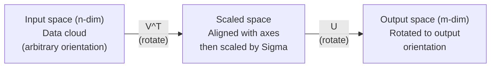
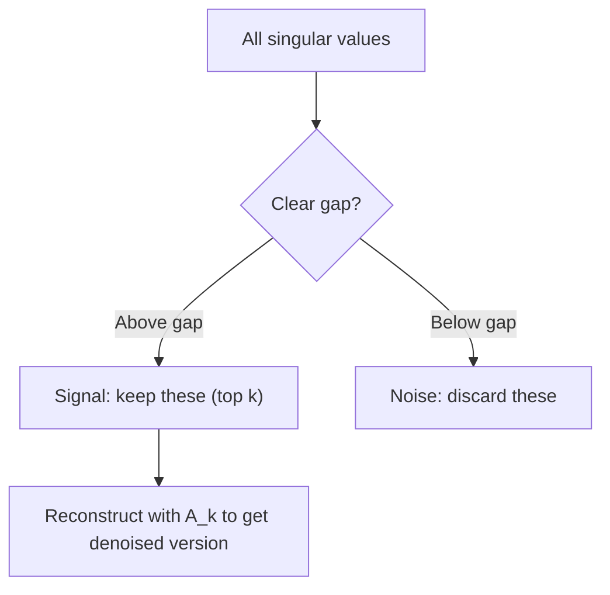

# Singular Value Decomposition (奇异值分解)

> SVD 是线性代数中的瑞士军刀。每个矩阵都有 SVD。每个数据科学家都需要它。

**Type:** Build
**Languages:** Python, Julia
**Prerequisites:** Phase 1, Lessons 01 (Linear Algebra Intuition), 02 (Vectors & Matrices Operations), 03 (Matrix Transformations)
**Time:** ~120 minutes

## Learning Objectives

- 通过 power iteration (幂迭代) 实现 SVD，并解释 U、Sigma 和 V^T 的几何含义
- 应用 truncated SVD (截断 SVD) 进行图像压缩，并衡量压缩比与重建误差
- 通过 SVD 计算 Moore-Penrose pseudoinverse (伪逆)，求解超定最小二乘系统
- 将 SVD 与 PCA、推荐系统（latent factors / 隐因子）以及 NLP 中的 Latent Semantic Analysis (潜在语义分析) 联系起来

## The Problem

你有一个 1000×2000 的矩阵。它可能是用户-电影评分。可能是文档-词频表。可能是图像的像素值。你需要压缩它、去噪、发现隐藏结构，或者用它求解最小二乘系统。Eigendecomposition (特征分解) 只对方阵有效。即使如此，它还需要矩阵有一组完整的线性无关特征向量。

SVD 适用于任何矩阵。任何形状。任何秩。无条件。它将矩阵分解为三个因子，揭示矩阵对空间的几何作用。它是线性代数中最通用、最有用的分解。

## The Concept

### SVD 的几何作用

每个矩阵，无论形状如何，都依次执行三个操作：旋转、缩放、旋转。SVD 使这种分解显式化。

```
A = U * Sigma * V^T

      m x n     m x m    m x n    n x n
     (any)    (rotate)  (scale)  (rotate)
```

给定任意矩阵 A，SVD 将其分解为：
- V^T 旋转向量于输入空间（n 维）
- Sigma 沿各轴缩放（拉伸或压缩）
- U 将结果旋转到输出空间（m 维）



这样想：你把一个矩阵交给 SVD，它告诉你：“这个矩阵先通过 V^T 旋转输入球体，然后通过 Sigma 将其拉伸成椭球体，最后通过 U 旋转这个椭球体。” 奇异值就是椭球体各轴的长度。

### 完整分解

对于形状为 m × n 的矩阵 A：

```
A = U * Sigma * V^T

where:
  U     is m x m, orthogonal (U^T U = I)
  Sigma is m x n, diagonal (singular values on the diagonal)
  V     is n x n, orthogonal (V^T V = I)

The singular values sigma_1 >= sigma_2 >= ... >= sigma_r > 0
where r = rank(A)
```

U 的列称为 left singular vectors (左奇异向量)。V 的列称为 right singular vectors (右奇异向量)。Sigma 的对角元素称为 singular values (奇异值)。它们始终非负，并按递减顺序排列。

### 左奇异向量、奇异值、右奇异向量

SVD 的每个分量都有独特的几何含义。

**Right singular vectors (V 的列):** 它们构成输入空间 (R^n) 的一组正交基。是矩阵映射到输出空间正交方向的输入空间方向。可将其视为域的自然坐标系。

**Singular values (Sigma 的对角线):** 这些是缩放因子。第 i 个奇异值告诉你矩阵沿第 i 个右奇异向量方向拉伸了多少。奇异值为零意味着矩阵将该方向完全压扁。

**Left singular vectors (U 的列):** 它们构成输出空间 (R^m) 的一组正交基。第 i 个左奇异向量是第 i 个右奇异向量（经缩放后）落到的输出空间方向。

它们之间的关系：

```
A * v_i = sigma_i * u_i

The matrix A takes the i-th right singular vector v_i,
scales it by sigma_i, and maps it to the i-th left singular vector u_i.
```

这为你提供了任何矩阵作用的逐坐标图像。

### 外积形式

SVD 可写为秩-1 矩阵之和：

```
A = sigma_1 * u_1 * v_1^T + sigma_2 * u_2 * v_2^T + ... + sigma_r * u_r * v_r^T

Each term sigma_i * u_i * v_i^T is a rank-1 matrix (an outer product).
The full matrix is the sum of r such matrices, where r is the rank.
```

这种形式是 low-rank approximation (低秩近似) 的基础。每一项增加一层结构。第一项捕获最重要的单一模式。第二项捕获次重要的。依此类推。截断此和可得到给定秩下的最佳近似。

```
Rank-1 approx:    A_1 = sigma_1 * u_1 * v_1^T
                  (captures the dominant pattern)

Rank-2 approx:    A_2 = sigma_1 * u_1 * v_1^T + sigma_2 * u_2 * v_2^T
                  (captures the two most important patterns)

Rank-k approx:    A_k = sum of top k terms
                  (optimal by the Eckart-Young theorem)
```

### 与 eigendecomposition (特征分解) 的关系

SVD 和 eigendecomposition 紧密相连。A 的奇异值和向量直接来自 A^T A 和 A A^T 的特征值和特征向量。

```
A^T A = V * Sigma^T * U^T * U * Sigma * V^T
      = V * Sigma^T * Sigma * V^T
      = V * D * V^T

where D = Sigma^T * Sigma is a diagonal matrix with sigma_i^2 on the diagonal.

So:
- The right singular vectors (V) are eigenvectors of A^T A
- The singular values squared (sigma_i^2) are eigenvalues of A^T A

Similarly:
A A^T = U * Sigma * V^T * V * Sigma^T * U^T
      = U * Sigma * Sigma^T * U^T

So:
- The left singular vectors (U) are eigenvectors of A A^T
- The eigenvalues of A A^T are also sigma_i^2
```

这种联系告诉你三件事：
1. 奇异值始终为实数且非负（它们是半正定矩阵特征值的平方根）。
2. 你可以通过 A^T A 的 eigendecomposition 计算 SVD，但这会平方 condition number (条件数) 并损失数值精度。专用 SVD 算法避免了这一点。
3. 当 A 是方阵且对称半正定时，SVD 和 eigendecomposition 相同。

### Truncated SVD: low-rank approximation (低秩近似)

Eckart-Young-Mirsky 定理指出，A 的最佳 rank-k 近似（在 Frobenius norm 和 spectral norm 下）通过仅保留前 k 个奇异值及其对应向量获得：

```
A_k = U_k * Sigma_k * V_k^T

where:
  U_k     is m x k  (first k columns of U)
  Sigma_k is k x k  (top-left k x k block of Sigma)
  V_k     is n x k  (first k columns of V)

Approximation error = sigma_{k+1}  (in spectral norm)
                    = sqrt(sigma_{k+1}^2 + ... + sigma_r^2)  (in Frobenius norm)
```

这不仅是“一个好的”近似。它是可证明的给定秩下的最佳近似。没有其他 rank-k 矩阵比它更接近 A。

| Component | Relative magnitude | Kept in rank-3 approx? |
|-----------|-------------------|------------------------|
| sigma_1 | Largest | Yes |
| sigma_2 | Large | Yes |
| sigma_3 | Medium-large | Yes |
| sigma_4 | Medium | No (error) |
| sigma_5 | Medium-small | No (error) |
| sigma_6 | Small | No (error) |
| sigma_7 | Very small | No (error) |
| sigma_8 | Tiny | No (error) |

保留前 3 个：A_3 捕获三个最大的奇异值。误差 = 剩余值（sigma_4 到 sigma_8）。

如果奇异值快速衰减，小的 k 就能捕获矩阵的大部分。如果缓慢衰减，则矩阵没有低秩结构。

### 图像压缩

灰度图像是一个像素强度矩阵。一张 800×600 的图像有 480,000 个值。SVD 让你用远更少的值近似它。

```
Original image: 800 x 600 = 480,000 values

SVD with rank k:
  U_k:      800 x k values
  Sigma_k:  k values
  V_k:      600 x k values
  Total:    k * (800 + 600 + 1) = k * 1401 values

  k=10:   14,010 values   (2.9% of original)
  k=50:   70,050 values  (14.6% of original)
  k=100: 140,100 values  (29.2% of original)

  The compression ratio improves as k gets smaller,
  but visual quality degrades.
```

关键洞察：自然图像的奇异值快速衰减。前几个奇异值捕获了广泛结构（形状、渐变）。后面的捕获精细细节和噪声。在秩 50 处截断通常产生一张看起来与原始几乎相同的图像，同时节省了 85% 的存储。

### SVD 用于推荐系统

Netflix Prize 使这种方法出名。你有一个用户-电影评分矩阵，其中大部分条目缺失。

```
             Movie1  Movie2  Movie3  Movie4  Movie5
  User1      [  5      ?       3       ?       1  ]
  User2      [  ?      4       ?       2       ?  ]
  User3      [  3      ?       5       ?       ?  ]
  User4      [  ?      ?       ?       4       3  ]

  ? = unknown rating
```

思路：这个评分矩阵具有低秩。用户的品味并非完全独立。有少数 latent factors (隐因子)（动作 vs. 剧情、旧片 vs. 新片、思辨 vs. 感官）解释了大部分偏好。

对（填充后的）评分矩阵进行 SVD 分解为：
- U：latent factor space (隐因子空间) 中的用户画像
- Sigma：每个 latent factor 的重要性
- V^T：latent factor space 中的电影画像

用户对某部电影的预测评分是其用户画像与电影画像的点积（按奇异值加权）。低秩近似填充了缺失条目。

实践中，你使用 Simon Funk 的增量 SVD 或 ALS (alternating least squares / 交替最小二乘) 等变体，它们直接处理缺失数据。但核心思想相同：通过 SVD 进行 latent factor decomposition (隐因子分解)。

### SVD 在 NLP 中：Latent Semantic Analysis (潜在语义分析)

Latent Semantic Analysis (LSA)，也称为 Latent Semantic Indexing (LSI / 潜在语义索引)，将 SVD 应用于 term-document matrix (词-文档矩阵)。

```
             Doc1   Doc2   Doc3   Doc4
  "cat"      [  3      0      1      0  ]
  "dog"      [  2      0      0      1  ]
  "fish"     [  0      4      1      0  ]
  "pet"      [  1      1      1      1  ]
  "ocean"    [  0      3      0      0  ]

After SVD with rank k=2:

  Each document becomes a point in 2D "concept space."
  Each term becomes a point in the same 2D space.
  Documents about similar topics cluster together.
  Terms with similar meanings cluster together.

  "cat" and "dog" end up near each other (land pets).
  "fish" and "ocean" end up near each other (water concepts).
  Doc1 and Doc3 cluster if they share similar topics.
```

LSA 是最早从原始文本捕获语义相似度的成功方法之一。它有效是因为同义词倾向于出现在相似的文档中，所以 SVD 将它们归入相同的潜在维度。现代的 word embeddings (词嵌入)（Word2Vec、GloVe）可以视为这一思想的后裔。

### SVD 用于降噪

噪声数据的信号集中在顶部奇异值中，而噪声散布在所有奇异值中。截断去除了噪声基底。

**Clean signal singular values:**

| Component | Magnitude | Type |
|-----------|-----------|------|
| sigma_1 | Very large | Signal |
| sigma_2 | Large | Signal |
| sigma_3 | Medium | Signal |
| sigma_4 | Near zero | Negligible |
| sigma_5 | Near zero | Negligible |

**Noisy signal singular values (noise adds to all):**

| Component | Magnitude | Type |
|-----------|-----------|------|
| sigma_1 | Very large | Signal |
| sigma_2 | Large | Signal |
| sigma_3 | Medium | Signal |
| sigma_4 | Small | Noise |
| sigma_5 | Small | Noise |
| sigma_6 | Small | Noise |
| sigma_7 | Small | Noise |



这用于信号处理、科学测量和数据清洗。每当你有一个被加性噪声污染的矩阵时，truncated SVD 就是一种将信号与噪声分离的原则性方法。

### 通过 SVD 计算 Pseudoinverse (伪逆)

Moore-Penrose pseudoinverse (A+) 将矩阵求逆推广到非方阵和奇异矩阵。SVD 使计算它变得轻而易举。

```
If A = U * Sigma * V^T, then:

A+ = V * Sigma+ * U^T

where Sigma+ is formed by:
  1. Transpose Sigma (swap rows and columns)
  2. Replace each non-zero diagonal entry sigma_i with 1/sigma_i
  3. Leave zeros as zeros

For A (m x n):      A+ is (n x m)
For Sigma (m x n):  Sigma+ is (n x m)
```

Pseudoinverse 求解最小二乘问题。如果 Ax = b 没有精确解（超定系统），那么 x = A+ b 就是最小二乘解（最小化 ||Ax - b||）。

```
Overdetermined system (more equations than unknowns):

  [1  1]         [3]
  [2  1] x   =   [5]       No exact solution exists.
  [3  1]         [6]

  x_ls = A+ b = V * Sigma+ * U^T * b

  This gives the x that minimizes the sum of squared residuals.
  Same result as the normal equations (A^T A)^(-1) A^T b,
  but numerically more stable.
```

### 数值稳定性优势

计算 A^T A 的 eigendecomposition 会平方奇异值（A^T A 的特征值是 sigma_i^2）。这会平方 condition number (条件数)，放大数值误差。

```
Example:
  A has singular values [1000, 1, 0.001]
  Condition number of A: 1000 / 0.001 = 10^6

  A^T A has eigenvalues [10^6, 1, 10^{-6}]
  Condition number of A^T A: 10^6 / 10^{-6} = 10^{12}

  Computing SVD directly: works with condition number 10^6
  Computing via A^T A:     works with condition number 10^{12}
                           (6 extra digits of precision lost)
```

现代 SVD 算法（Golub-Kahan bidiagonalization / 双对角化）直接在 A 上工作，从不形成 A^T A。这就是为什么你应该始终优先使用 `np.linalg.svd(A)` 而不是 `np.linalg.eig(A.T @ A)`。

### 与 PCA 的联系

PCA 就是对中心化数据做 SVD。这不是类比。它实际上就是同一个计算。

```
Given data matrix X (n_samples x n_features), centered (mean subtracted):

Covariance matrix: C = (1/(n-1)) * X^T X

PCA finds eigenvectors of C. But:

  X = U * Sigma * V^T    (SVD of X)

  X^T X = V * Sigma^2 * V^T

  C = (1/(n-1)) * V * Sigma^2 * V^T

So the principal components are exactly the right singular vectors V.
The explained variance for each component is sigma_i^2 / (n-1).

In sklearn, PCA is implemented using SVD, not eigendecomposition.
It is faster and more numerically stable.
```

这意味着你在 Lesson 10 中学到的关于 dimensionality reduction (降维) 的一切在底层都是 SVD。PCA 是机器学习中最常见的 SVD 应用。

## Build It

### Step 1: 使用 power iteration (幂迭代) 从头实现 SVD

思路：要找到最大的奇异值及其向量，对 A^T A（或 A A^T）使用 power iteration。然后对矩阵进行 deflation (降阶) 并重复下一个奇异值。

```python
import numpy as np

def power_iteration(M, num_iters=100):
    n = M.shape[1]
    v = np.random.randn(n)
    v = v / np.linalg.norm(v)

    for _ in range(num_iters):
        Mv = M @ v
        v = Mv / np.linalg.norm(Mv)

    eigenvalue = v @ M @ v
    return eigenvalue, v

def svd_from_scratch(A, k=None):
    m, n = A.shape
    if k is None:
        k = min(m, n)

    sigmas = []
    us = []
    vs = []

    A_residual = A.copy().astype(float)

    for _ in range(k):
        AtA = A_residual.T @ A_residual
        eigenvalue, v = power_iteration(AtA, num_iters=200)

        if eigenvalue < 1e-10:
            break

        sigma = np.sqrt(eigenvalue)
        u = A_residual @ v / sigma

        sigmas.append(sigma)
        us.append(u)
        vs.append(v)

        A_residual = A_residual - sigma * np.outer(u, v)

    U = np.column_stack(us) if us else np.empty((m, 0))
    S = np.array(sigmas)
    V = np.column_stack(vs) if vs else np.empty((n, 0))

    return U, S, V
```

### Step 2: 与 NumPy 对比测试

```python
np.random.seed(42)
A = np.random.randn(5, 4)

U_ours, S_ours, V_ours = svd_from_scratch(A)
U_np, S_np, Vt_np = np.linalg.svd(A, full_matrices=False)

print("Our singular values:", np.round(S_ours, 4))
print("NumPy singular values:", np.round(S_np, 4))

A_reconstructed = U_ours @ np.diag(S_ours) @ V_ours.T
print(f"Reconstruction error: {np.linalg.norm(A - A_reconstructed):.8f}")
```

### Step 3: 图像压缩演示

```python
def compress_image_svd(image_matrix, k):
    U, S, Vt = np.linalg.svd(image_matrix, full_matrices=False)
    compressed = U[:, :k] @ np.diag(S[:k]) @ Vt[:k, :]
    return compressed

image = np.random.seed(42)
rows, cols = 200, 300
image = np.random.randn(rows, cols)

for k in [1, 5, 10, 20, 50]:
    compressed = compress_image_svd(image, k)
    error = np.linalg.norm(image - compressed) / np.linalg.norm(image)
    original_size = rows * cols
    compressed_size = k * (rows + cols + 1)
    ratio = compressed_size / original_size
    print(f"k={k:>3d}  error={error:.4f}  storage={ratio:.1%}")
```

### Step 4: 降噪

```python
np.random.seed(42)
clean = np.outer(np.sin(np.linspace(0, 4*np.pi, 100)),
                 np.cos(np.linspace(0, 2*np.pi, 80)))
noise = 0.3 * np.random.randn(100, 80)
noisy = clean + noise

U, S, Vt = np.linalg.svd(noisy, full_matrices=False)
denoised = U[:, :5] @ np.diag(S[:5]) @ Vt[:5, :]

print(f"Noisy error:    {np.linalg.norm(noisy - clean):.4f}")
print(f"Denoised error: {np.linalg.norm(denoised - clean):.4f}")
print(f"Improvement:    {(1 - np.linalg.norm(denoised - clean) / np.linalg.norm(noisy - clean)):.1%}")
```

### Step 5: Pseudoinverse (伪逆)

```python
A = np.array([[1, 1], [2, 1], [3, 1]], dtype=float)
b = np.array([3, 5, 6], dtype=float)

U, S, Vt = np.linalg.svd(A, full_matrices=False)
S_inv = np.diag(1.0 / S)
A_pinv = Vt.T @ S_inv @ U.T

x_svd = A_pinv @ b
x_lstsq = np.linalg.lstsq(A, b, rcond=None)[0]
x_pinv = np.linalg.pinv(A) @ b

print(f"SVD pseudoinverse solution:  {x_svd}")
print(f"np.linalg.lstsq solution:   {x_lstsq}")
print(f"np.linalg.pinv solution:    {x_pinv}")
```

## Use It

完整的工作演示在 `code/svd.py` 中。运行它以查看 SVD 应用于图像压缩、推荐系统、潜在语义分析和降噪。

```bash
python svd.py
```

Julia 版本在 `code/svd.jl` 中，使用 Julia 的原生 `svd()` 函数和 `LinearAlgebra` 包演示相同的概念。

```bash
julia svd.jl
```

## Ship It

本节课产出：
- `outputs/skill-svd.md` — 一个用于知道何时以及如何在实际项目中应用 SVD 的 skill

## Exercises

1. 不使用 power iteration 从头实现完整 SVD。改为计算 A^T A 的 eigendecomposition 以获得 V 和奇异值，然后计算 U = A V Sigma^{-1}。与你的 power iteration 版本以及 NumPy 对比数值精度。

2. 加载一张真实的灰度图像（或将一张转为灰度）。在秩 1、5、10、25、50、100 下进行压缩。对每个秩，计算压缩比和相对误差。找到图像在视觉上可接受的秩。

3. 构建一个微型推荐系统。创建一个 10×8 的用户-电影评分矩阵，包含一些已知条目。用行均值填充缺失条目。计算 SVD 并重建 rank-3 近似。使用重建矩阵预测缺失评分。验证预测是否合理。

4. 创建一个 100×50 的文档-词矩阵，包含 3 个合成主题。每个主题有 5 个关联词。添加噪声。应用 SVD 并验证前 3 个奇异值远大于其余。将文档投影到 3D 潜在空间，并检查相同主题的文档是否聚类在一起。

5. 生成一个干净的低秩矩阵（秩 3，大小 50×40），并添加不同水平的高斯噪声（sigma = 0.1, 0.5, 1.0, 2.0）。对每个噪声水平，通过将 k 从 1 扫到 40 并测量对干净矩阵的重建误差来找到最优截断秩。绘制最优 k 如何随噪声水平变化。

## Key Terms

| Term | What people say | What it actually means |
|------|----------------|----------------------|
| SVD | "Factor any matrix" | Decompose A into U Sigma V^T where U and V are orthogonal and Sigma is diagonal with non-negative entries. Works for any matrix of any shape. |
| Singular value | "How important this component is" | The i-th diagonal entry of Sigma. Measures how much the matrix stretches along the i-th principal direction. Always non-negative, sorted in decreasing order. |
| Left singular vector | "Output direction" | A column of U. The direction in output space that the i-th right singular vector maps to (after scaling by sigma_i). |
| Right singular vector | "Input direction" | A column of V. The direction in input space that the matrix maps to the i-th left singular vector (after scaling by sigma_i). |
| Truncated SVD | "Low-rank approximation" | Keep only the top k singular values and their vectors. Produces the provably best rank-k approximation to the original matrix (Eckart-Young theorem). |
| Rank | "True dimensionality" | The number of non-zero singular values. Tells you how many independent directions the matrix actually uses. |
| Pseudoinverse | "Generalized inverse" | V Sigma+ U^T. Inverts non-zero singular values, leaves zeros as zeros. Solves least-squares problems for non-square or singular matrices. |
| Condition number | "How sensitive to errors" | sigma_max / sigma_min. A large condition number means small input changes cause large output changes. SVD reveals this directly. |
| Latent factor | "Hidden variable" | A dimension in the low-rank space discovered by SVD. In recommendations, a latent factor might correspond to genre preference. In NLP, it might correspond to a topic. |
| Frobenius norm | "Total matrix size" | Square root of the sum of squared entries. Equals the square root of the sum of squared singular values. Used to measure approximation error. |
| Eckart-Young theorem | "SVD gives the best compression" | For any target rank k, the truncated SVD minimizes the approximation error over all possible rank-k matrices. |
| Power iteration | "Find the biggest eigenvector" | Repeatedly multiply a random vector by the matrix and normalize. Converges to the eigenvector with the largest eigenvalue. The building block of many SVD algorithms. |

## Further Reading

- [Gilbert Strang: Linear Algebra and Its Applications, Chapter 7](https://math.mit.edu/~gs/linearalgebra/) - thorough treatment of SVD with applications
- [3Blue1Brown: But what is the SVD?](https://www.youtube.com/watch?v=vSczTbgc8Rc) - geometric intuition for SVD
- [We Recommend a Singular Value Decomposition](https://www.ams.org/publicoutreach/feature-column/fcarc-svd) - accessible overview from the American Mathematical Society
- [Netflix Prize and Matrix Factorization](https://sifter.org/~simon/journal/20061211.html) - Simon Funk's original blog post on SVD for recommendations
- [Latent Semantic Analysis](https://en.wikipedia.org/wiki/Latent_semantic_analysis) - the original NLP application of SVD
- [Numerical Linear Algebra by Trefethen and Bau](https://people.maths.ox.ac.uk/trefethen/text.html) - the gold standard for understanding SVD algorithms and their numerical properties
