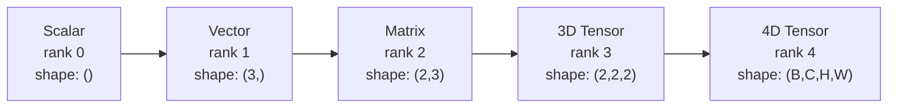
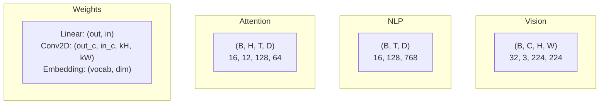
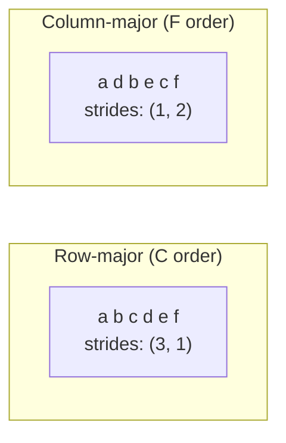
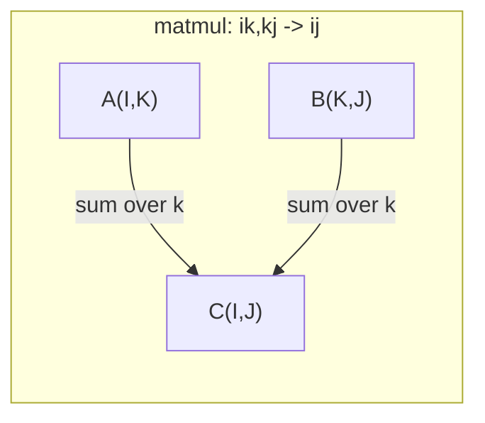

# Tensor Operations (张量运算)

> Tensor (张量) 是数据与深度学习之间的通用语言。每张图像、每个句子、每个 gradient (梯度) 都流经它们。

**Type:** Build
**Language:** Python
**Prerequisites:** Phase 1, Lessons 01 (Linear Algebra Intuition), 02 (Vectors, Matrices & Operations)
**Time:** ~90 minutes

## Learning Objectives

- 从头实现一个 tensor class (张量类)，支持 shape (形状)、stride (步幅)、reshape、transpose 和逐元素运算
- 应用 broadcasting rules (广播规则) 对不同 shape 的 tensor 进行运算而无需复制数据
- 使用 einsum (爱因斯坦求和) 表达式表示 dot product (点积)、matrix multiplication (矩阵乘法)、outer product (外积) 和 batch (批量) 运算
- 逐步追踪 multi-head attention (多头注意力) 中每一步的精确 tensor shape

## The Problem

你构建了一个 transformer。Forward pass (前向传播) 看起来很清晰。你运行它，得到：`RuntimeError: mat1 and mat2 shapes cannot be multiplied (32x768 and 512x768)`。你盯着 shape。你尝试 transpose (转置)。现在它说 `Expected 4D input (got 3D input)`。你添加 unsqueeze。别的又报错了。

Shape error (形状错误) 是深度学习代码中最常见的 bug。它们在概念上不难——每个运算都有 shape contract (形状契约)——但它们会快速倍增。一个 transformer 有数十个 reshape、transpose 和 broadcast 链式连接。一个错误的 axis (轴) 就会导致错误级联。更糟的是，某些 shape mistake (形状错误) 根本不会报错。它们通过沿错误 dimension (维度) broadcasting 或在错误 axis 上 summing (求和) 来静默产生垃圾。

Matrices 处理两组事物之间的成对关系。真实数据无法装入两个维度。一批 32 张 RGB 图像，尺寸 224x224，是一个 4D tensor：`(32, 3, 224, 224)`。具有 12 个 head 的 self-attention (自注意力) 也是 4D：`(batch, heads, seq_len, head_dim)`。你需要一种数据结构，能推广到任意数量的维度，并且运算能在所有维度上干净地组合。这种结构就是 tensor。掌握其运算和 shape，shape error 就会变得微不足道地可调试。

## The Concept

### 什么是 tensor

Tensor 是具有统一数据类型的多维数字数组。维度的数量是 **rank (阶)**（或 **order**）。每个维度是一个 **axis (轴)**。**shape (形状)** 是一个列出每个 axis 上大小的元组。



总元素数 = 所有大小的乘积。Shape `(2, 3, 4)` 包含 `2 * 3 * 4 = 24` 个元素。

### 深度学习中的 tensor shape

不同数据类型按约定映射到特定的 tensor shape。



PyTorch 使用 NCHW (channels-first)。TensorFlow 默认使用 NHWC (channels-last)。不匹配的 layout 会导致静默的性能下降或错误。

### 内存布局的工作原理

内存中的 2D 数组是 1D 字节序列。**stride (步幅)** 告诉你沿每个 axis 移动一步需要跳过多少元素。



Transpose 不移动数据。它交换 stride，使 tensor 变为 **non-contiguous (非连续)**——一行的元素在内存中不再相邻。

### Broadcasting rules (广播规则)

Broadcasting 让你对不同 shape 的 tensor 进行运算而无需复制数据。从右侧对齐 shape。当两个维度相等或其中一个为 1 时，它们是兼容的。较少的维度在左侧补 1。

```
Tensor A:     (8, 1, 6, 1)
Tensor B:        (7, 1, 5)
Padded B:     (1, 7, 1, 5)
Result:       (8, 7, 6, 5)
```

### Einsum: 通用 tensor 运算

Einstein summation (爱因斯坦求和) 用字母标记每个 axis。输入中出现但输出中不出现的 axis 会被求和。两者都出现的 axis 被保留。



关键模式：`i,i->` (dot product / 点积), `i,j->ij` (outer product / 外积), `ii->` (trace / 迹), `ij->ji` (transpose / 转置), `bij,bjk->bik` (batch matmul / 批量矩阵乘法), `bhtd,bhsd->bhts` (attention scores / 注意力分数)。

## Build It

代码位于 `code/tensors.py`。每一步都引用了那里的实现。

### Step 1: Tensor 存储与 stride

Tensor 存储一个扁平的数字列表加上 shape 元数据。stride 告诉索引逻辑如何将多维索引映射到扁平位置。

```python
class Tensor:
    def __init__(self, data, shape=None):
        if isinstance(data, (list, tuple)):
            self._data, self._shape = self._flatten_nested(data)
        elif isinstance(data, np.ndarray):
            self._data = data.flatten().tolist()
            self._shape = tuple(data.shape)
        else:
            self._data = [data]
            self._shape = ()

        if shape is not None:
            total = reduce(lambda a, b: a * b, shape, 1)
            if total != len(self._data):
                raise ValueError(
                    f"Cannot reshape {len(self._data)} elements into shape {shape}"
                )
            self._shape = tuple(shape)

        self._strides = self._compute_strides(self._shape)

    @staticmethod
    def _compute_strides(shape):
        if len(shape) == 0:
            return ()
        strides = [1] * len(shape)
        for i in range(len(shape) - 2, -1, -1):
            strides[i] = strides[i + 1] * shape[i + 1]
        return tuple(strides)
```

对 shape `(3, 4)`，stride 为 `(4, 1)`——前进一行跳过 4 个元素，前进一列跳过 1 个元素。

### Step 2: Reshape, squeeze, unsqueeze

Reshape 改变 shape 但不改变元素顺序。总元素数必须保持不变。对一个维度使用 `-1` 来推断其大小。

```python
t = Tensor(list(range(12)), shape=(2, 6))
r = t.reshape((3, 4))
r = t.reshape((-1, 3))
```

Squeeze 移除大小为 1 的 axis。Unsqueeze 插入一个。Unsqueeze 对 broadcasting 至关重要——一个 bias vector `(D,)` 要加到 batch `(B, T, D)` 上需要 unsqueeze 到 `(1, 1, D)`。

```python
t = Tensor(list(range(6)), shape=(1, 3, 1, 2))
s = t.squeeze()
v = Tensor([1, 2, 3])
u = v.unsqueeze(0)
```

### Step 3: Transpose 与 permute

Transpose 交换两个 axis。Permute 重新排序所有 axis。这就是你在 NCHW 和 NHWC 之间转换的方式。

```python
mat = Tensor(list(range(6)), shape=(2, 3))
tr = mat.transpose(0, 1)

t4d = Tensor(list(range(24)), shape=(1, 2, 3, 4))
perm = t4d.permute((0, 2, 3, 1))
```

Transpose 或 permute 之后，tensor 在内存中变为 non-contiguous。在 PyTorch 中，`view` 在 non-contiguous tensor 上会失败——先调用 `.contiguous()` 或使用 `reshape`。

### Step 4: 逐元素运算与 reduction

逐元素运算（add、multiply、subtract）独立应用于每个元素并保留 shape。Reduction（sum、mean、max）折叠一个或多个 axis。

```python
a = Tensor([[1, 2], [3, 4]])
b = Tensor([[10, 20], [30, 40]])
c = a + b
d = a * 2
s = a.sum(axis=0)
```

CNN 中的 global average pooling (全局平均池化)：`(B, C, H, W).mean(axis=[2, 3])` 产生 `(B, C)`。NLP 中的 sequence mean pooling (序列平均池化)：`(B, T, D).mean(axis=1)` 产生 `(B, D)`。

### Step 5: 使用 NumPy 进行 broadcasting

`tensors.py` 中的 `demo_broadcasting_numpy()` 函数展示了核心模式。

```python
activations = np.random.randn(4, 3)
bias = np.array([0.1, 0.2, 0.3])
result = activations + bias

images = np.random.randn(2, 3, 4, 4)
scale = np.array([0.5, 1.0, 1.5]).reshape(1, 3, 1, 1)
result = images * scale

a = np.array([1, 2, 3]).reshape(-1, 1)
b = np.array([10, 20, 30, 40]).reshape(1, -1)
outer = a * b
```

通过 broadcasting 的 pairwise distance (成对距离)：将 `(M, 2)` reshape 为 `(M, 1, 2)`，`(N, 2)` reshape 为 `(1, N, 2)`，相减，沿最后一个 axis 平方求和，取平方根。结果：`(M, N)`。

### Step 6: Einsum 运算

`demo_einsum()` 和 `demo_einsum_gallery()` 函数遍历每种常见模式。

```python
a = np.array([1.0, 2.0, 3.0])
b = np.array([4.0, 5.0, 6.0])
dot = np.einsum("i,i->", a, b)

A = np.array([[1, 2], [3, 4], [5, 6]], dtype=float)
B = np.array([[7, 8, 9], [10, 11, 12]], dtype=float)
matmul = np.einsum("ik,kj->ij", A, B)

batch_A = np.random.randn(4, 3, 5)
batch_B = np.random.randn(4, 5, 2)
batch_mm = np.einsum("bij,bjk->bik", batch_A, batch_B)
```

Contraction (缩并) 的计算成本是所有 index size 的乘积（保留和求和的）。对 `bij,bjk->bik`，B=32, I=128, J=64, K=128：`32 * 128 * 64 * 128 = 33,554,432` 次乘加运算。

### Step 7: 通过 einsum 实现 attention mechanism (注意力机制)

`demo_attention_einsum()` 函数端到端实现了 multi-head attention (多头注意力)。

```python
B, H, T, D = 2, 4, 8, 16
E = H * D

X = np.random.randn(B, T, E)
W_q = np.random.randn(E, E) * 0.02

Q = np.einsum("bte,ek->btk", X, W_q)
Q = Q.reshape(B, T, H, D).transpose(0, 2, 1, 3)

scores = np.einsum("bhtd,bhsd->bhts", Q, K) / np.sqrt(D)
weights = softmax(scores, axis=-1)
attn_output = np.einsum("bhts,bhsd->bhtd", weights, V)

concat = attn_output.transpose(0, 2, 1, 3).reshape(B, T, E)
output = np.einsum("bte,ek->btk", concat, W_o)
```

每一步都是 tensor 运算：projection (通过 einsum 的 matmul)、head splitting (reshape + transpose)、attention scores (通过 einsum 的 batch matmul)、weighted sum (通过 einsum 的 batch matmul)、head merging (transpose + reshape)、output projection (通过 einsum 的 matmul)。

## Use It

### 从零实现 vs NumPy

| Operation | 从零实现 (Tensor class) | NumPy |
|---|---|---|
| Create | `Tensor([[1,2],[3,4]])` | `np.array([[1,2],[3,4]])` |
| Reshape | `t.reshape((3,4))` | `a.reshape(3,4)` |
| Transpose | `t.transpose(0,1)` | `a.T` or `a.transpose(0,1)` |
| Squeeze | `t.squeeze(0)` | `np.squeeze(a, 0)` |
| Sum | `t.sum(axis=0)` | `a.sum(axis=0)` |
| Einsum | N/A | `np.einsum("ij,jk->ik", a, b)` |

### 从零实现 vs PyTorch

```python
import torch

t = torch.tensor([[1, 2, 3], [4, 5, 6]], dtype=torch.float32)
t.shape
t.stride()
t.is_contiguous()

t.reshape(3, 2)
t.unsqueeze(0)
t.transpose(0, 1)
t.transpose(0, 1).contiguous()

torch.einsum("ik,kj->ij", A, B)
```

PyTorch 增加了 autograd、GPU 支持和优化的 BLAS kernels。Shape 语义完全相同。如果你理解从零实现的版本，PyTorch 的 shape error 就会变得可读。

### 每个神经网络层作为 tensor 运算

| Operation | Tensor Form | Einsum |
|---|---|---|
| Linear layer | `Y = X @ W.T + b` | `"bd,od->bo"` + bias |
| Attention QKV | `Q = X @ W_q` | `"btd,dh->bth"` |
| Attention scores | `Q @ K.T / sqrt(d)` | `"bhtd,bhsd->bhts"` |
| Attention output | `softmax(scores) @ V` | `"bhts,bhsd->bhtd"` |
| Batch norm | `(X - mu) / sigma * gamma` | element-wise + broadcast |
| Softmax | `exp(x) / sum(exp(x))` | element-wise + reduction |

## Ship It

本节课产出两个可复用的 prompt：

1. **`outputs/prompt-tensor-shapes.md`** — 一个用于调试 tensor shape mismatch (形状不匹配) 的系统性 prompt。包含每种常见运算（matmul、broadcast、cat、Linear、Conv2d、BatchNorm、softmax）的决策表和修复查找表。

2. **`outputs/prompt-tensor-debugger.md`** — 一个分步调试 prompt，你可以把它粘贴到任何 AI 助手，当 shape error 阻碍你时。输入 error message 和你的 tensor shapes，获取精确的修复方案。

## Exercises

1. **简单 — Reshape 往返。** 取一个 shape `(2, 3, 4)` 的 tensor。Reshape 为 `(6, 4)`，然后 `(24,)`，再回到 `(2, 3, 4)`。每一步通过打印扁平数据验证元素顺序是否保留。

2. **中等 — 实现 broadcasting。** 扩展 `Tensor` 类，添加 `broadcast_to(shape)` 方法，将大小为 1 的维度扩展以匹配目标 shape。然后修改 `_elementwise_op` 以在运算前自动 broadcast。用 shape `(3, 1)` 和 `(1, 4)` 产生 `(3, 4)` 进行测试。

3. **困难 — 从头实现 einsum。** 实现一个基本的 `einsum(subscripts, *tensors)` 函数，至少处理：dot product (`i,i->`)、matrix multiply (`ij,jk->ik`)、outer product (`i,j->ij`) 和 transpose (`ij->ji`)。解析下标字符串，识别 contracted indices (缩并指标)，遍历所有索引组合。将你的结果与 `np.einsum` 对比。

4. **困难 — Attention shape tracker。** 编写一个函数，接受 `batch_size`、`seq_len`、`embed_dim` 和 `num_heads` 作为输入，并打印 multi-head attention 每一步的精确 shape：输入、Q/K/V projection、head split、attention scores、softmax weights、weighted sum、head merge、output projection。与 `demo_attention_einsum()` 的输出验证。

## Key Terms

| Term | What people say | What it actually means |
|---|---|---|
| Tensor | "A matrix but more dimensions" | A multi-dimensional array with uniform type and defined shape, strides, and operations |
| Rank | "The number of dimensions" | The number of axes. A matrix has rank 2, not rank equal to its matrix rank |
| Shape | "The size of the tensor" | A tuple listing the size along each axis. `(2, 3)` means 2 rows, 3 columns |
| Stride | "How memory is laid out" | The number of elements to skip to advance one position along each axis |
| Broadcasting | "It just works when shapes differ" | A strict set of rules: align from right, dimensions must be equal or one must be 1 |
| Contiguous | "The tensor is normal" | Elements stored sequentially in memory with no gaps or reordering from the logical layout |
| Einsum | "A fancy way to write matmul" | A general notation that expresses any tensor contraction, outer product, trace, or transpose in one line |
| View | "Same as reshape" | A tensor sharing the same memory buffer but with different shape/stride metadata. Fails on non-contiguous data |
| Contraction | "Summing over an index" | The general operation where a shared index between tensors is multiplied and summed, producing a lower-rank result |
| NCHW / NHWC | "PyTorch vs TensorFlow format" | Memory layout conventions for image tensors. NCHW puts channels before spatial dims, NHWC puts them after |

## Further Reading

- [NumPy Broadcasting](https://numpy.org/doc/stable/user/basics.broadcasting.html) -- The canonical rules with visual examples
- [PyTorch Tensor Views](https://pytorch.org/docs/stable/tensor_view.html) -- When views work and when they copy
- [einops](https://github.com/arogozhnikov/einops) -- A library that makes tensor reshaping readable and safe
- [The Illustrated Transformer](https://jalammar.github.io/illustrated-transformer/) -- Visualizes the tensor shapes flowing through attention
- [Einstein Summation in NumPy](https://numpy.org/doc/stable/reference/generated/numpy.einsum.html) -- Full einsum documentation with examples
