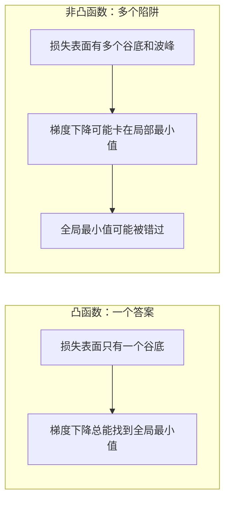
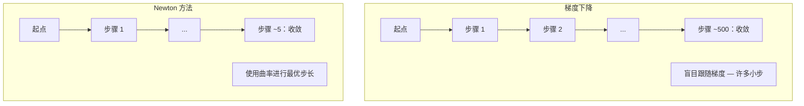
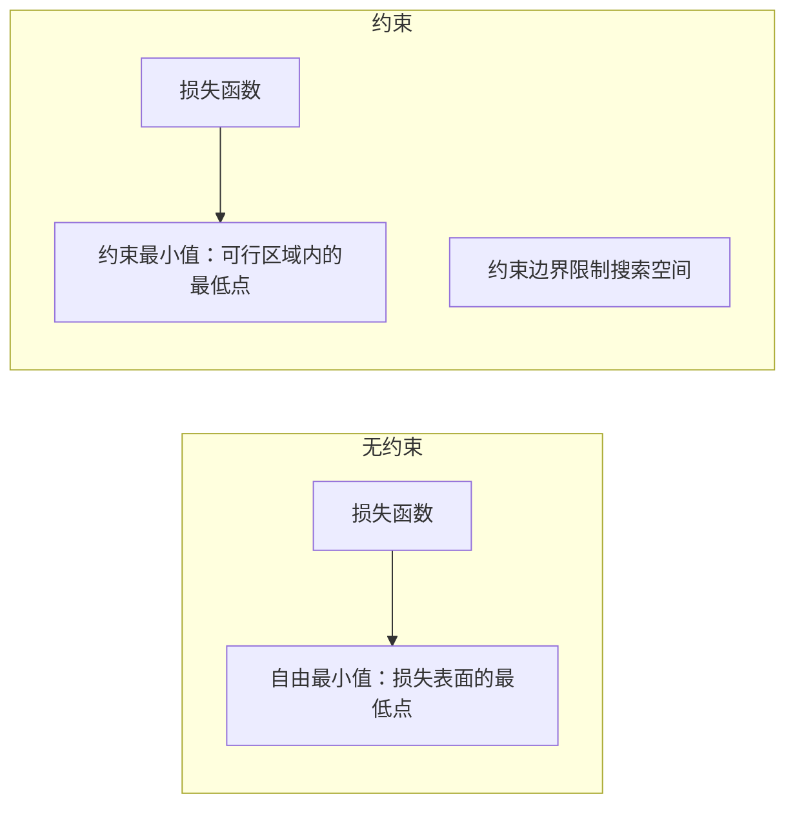
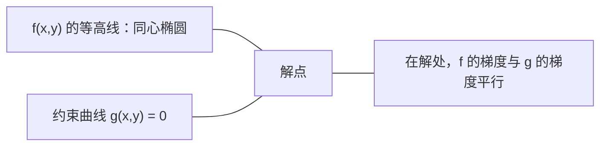

# 凸优化 (Convex Optimization)

> 凸问题只有一个谷底。神经网络有数百万个。了解两者的区别很重要。

**类型:** Build
**语言:** Python
**先修课程:** Phase 1, 第 04 课（Calculus for ML，机器学习中的微积分）、第 08 课（Optimization，优化）
**时间:** ~90 分钟

## 学习目标

- 使用定义、二阶导数和 Hessian 矩阵正半定性准则来测试函数是否为 convex（凸函数）
- 实现 Newton 方法（Newton's method），并将其二次收敛与 gradient descent（梯度下降）进行比较
- 使用 Lagrange multiplier（拉格朗日乘子）求解约束优化问题，并解释 KKT 条件
- 解释为什么神经网络损失 landscape（损失景观）是 non-convex（非凸）的，但 SGD 仍然能找到好的解

## 问题

第 08 课教你 gradient descent（梯度下降）、momentum（动量）和 Adam。这些优化器在任何表面上都能向下走。但它们没有任何保证。在 non-convex landscape（非凸景观）上的 gradient descent 可能会落入糟糕的 local minimum（局部最小值），卡在 saddle point（鞍点），或者永远振荡。你仍然使用它，因为神经网络是非凸的，而且没有其他选择。

但机器学习中的许多问题都是凸的。线性回归、逻辑回归、SVM、LASSO、ridge regression（岭回归）。对于这些问题，存在更强有力的工具：带有数学保证的优化。凸问题恰好只有一个谷底。任何向下走的算法都会到达 global minimum（全局最小值）。不需要重新初始化。不需要学习率调度。不需要祈祷。

理解凸性有三重作用。首先，它告诉你问题何时容易（凸）何时困难（非凸）。其次，它为凸问题提供了更快的工具，如 Newton 方法。第三，它解释了贯穿机器学习的概念：regularization（正则化）作为约束、SVM 中的 duality（对偶性），以及为什么深度学习尽管违反了凸性给出的所有优良性质，仍然有效。

## 概念

### 凸集 (Convex set)

集合 S 是凸的，如果对于 S 中的任意两点，连接它们的线段也完全位于 S 内。

| 凸集 | 非凸 |
|---|---|
| **矩形**：任何两个内部点可以通过一条完全保持在内部的线段连接 | **星形/月牙形**：两个内部点之间的连线可能穿过集合外部 |
| **三角形**：所有内部点都满足这一性质 | **甜甜圈/环形**：孔意味着某些线段会离开集合 |
| 任意两点之间的线段都保持在集合内 | 某些点对之间的线段会穿出集合 |

形式化检验：对于 S 中的任意点 x, y 和 [0, 1] 中的任意 t，点 tx + (1-t)y 也在 S 中。

凸集示例：
- 一条线、一个平面、整个 R^n
- 一个球（圆、球、超球）
- 半空间：{x : a^T x <= b}
- 任意数量凸集的交集

非凸集示例：
- 甜甜圈（环形，annulus）
- 两个不相交圆的并集
- 任何带有"凹陷"或"孔洞"的集合

### 凸函数 (Convex function)

函数 f 是凸的，如果其定义域是凸集，并且对于定义域中任意两点 x, y 和 [0, 1] 中的任意 t：

```
f(tx + (1-t)y) <= t*f(x) + (1-t)*f(y)
```

几何解释：图形上任意两点之间的线段位于或高于图形本身。

| 性质 | 凸函数 | 非凸函数 |
|---|---|---|
| **线段测试** | 图形上任意两点之间的连线位于或**高于**曲线 | 图形上某些点之间的连线会**低于**曲线 |
| **形状** | 单个碗状/谷底，向上弯曲 | 多个波峰和波谷，曲率混合 |
| **局部最小值** | 每个 local minimum（局部最小值）都是 global minimum（全局最小值） | 可能存在多个不同高度的 local minimum |

常见凸函数：
- f(x) = x^2（抛物线）
- f(x) = |x|（绝对值）
- f(x) = e^x（指数函数）
- f(x) = max(0, x)（ReLU，虽然分段线性）
- f(x) = -log(x) 对于 x > 0（负对数）
- 任何线性函数 f(x) = a^T x + b（既是凸的也是凹的）

### 凸性检验

三种实用检验，从易到难。

**检验 1：二阶导数检验（一维）。** 如果 f''(x) >= 0 对所有 x 成立，则 f 是凸的。

- f(x) = x^2：f''(x) = 2 >= 0。凸。
- f(x) = x^3：f''(x) = 6x。对于 x < 0 为负。非凸。
- f(x) = e^x：f''(x) = e^x > 0。凸。

**检验 2：Hessian 矩阵检验（多维）。** 如果 Hessian 矩阵 H(x) 对所有 x 都是 positive semidefinite（正半定，PSD），则 f 是凸的。Hessian 是二阶偏导数的矩阵。

**检验 3：定义检验。** 直接检验不等式 f(tx + (1-t)y) <= t*f(x) + (1-t)*f(y)。对于导数难以计算的函数很有用。

### 为什么凸性很重要

凸优化的核心定理：

**对于凸函数，每个局部最小值都是全局最小值。**

这意味着 gradient descent 不会被卡住。任何下坡路径都会通向同一个答案。算法保证收敛到最优解。



结果：
- 不需要随机重新初始化
- 不需要复杂的学习率调度
- 可以证明收敛性（速率取决于函数性质）
- 解是唯一的（除了平坦区域）

### 机器学习中的凸与非凸

| 问题 | 凸？ | 原因 |
|---------|---------|-----|
| 线性回归（MSE） | 是 | 损失在权重上是二次的 |
| 逻辑回归 | 是 | 对数损失在权重上是凸的 |
| SVM（hinge loss） | 是 | 线性函数的最大值 |
| LASSO（L1 回归） | 是 | 凸函数之和是凸的 |
| Ridge regression（L2） | 是 | 二次 + 二次 = 凸 |
| 神经网络（任何损失） | 否 | 非线性激活函数创建非凸景观 |
| k-means 聚类 | 否 | 离散分配步骤 |
| 矩阵分解 | 否 | 未知量的乘积 |

具有凸损失的线性模型是凸的。一旦添加具有非线性激活的隐藏层，凸性就破灭了。

### Hessian 矩阵 (Hessian matrix)

函数 f: R^n -> R 的 Hessian H 是二阶偏导数的 n x n 矩阵。

```
H[i][j] = d^2 f / (dx_i dx_j)
```

对于 f(x, y) = x^2 + 3xy + y^2：

```
df/dx = 2x + 3y       d^2f/dx^2 = 2      d^2f/dxdy = 3
df/dy = 3x + 2y       d^2f/dydx = 3      d^2f/dy^2 = 2

H = [ 2  3 ]
    [ 3  2 ]
```

Hessian 告诉你关于曲率的信息：
- 所有特征值都为正：函数在每个方向都向上弯曲（在该点凸）
- 所有特征值都为负：在每个方向都向下弯曲（凹的，局部最大值）
- 混合符号：saddle point（鞍点）（某些方向向上弯曲，某些方向向下弯曲）
- 零特征值：在该方向平坦（退化）

对于凸性，Hessian 必须在所有地方都是 positive semidefinite（正半定）（所有特征值 >= 0），而不仅仅是在一个点。

### Newton 方法 (Newton's method)

Gradient descent 使用一阶信息（gradient）。Newton 方法使用二阶信息（Hessian）。它在当前点拟合一个二次近似，然后直接跳到该二次函数的最小值。

```
更新规则：
  x_new = x - H^(-1) * gradient

与梯度下降对比：
  x_new = x - lr * gradient
```

Newton 方法用 inverse Hessian 替换了标量学习率。这基于局部曲率自动调整步长和方向。



优点：
- 在最小值附近二次收敛（误差每步平方）
- 不需要调整学习率
- 尺度不变（无论参数化方式如何都有效）

缺点：
- 计算 Hessian 需要 O(n^2) 内存，求逆需要 O(n^3)
- 对于具有 100 万个权重的神经网络，那是 10^12 个条目和 10^18 次操作
- 对深度学习不实用

### 约束优化 (Constrained optimization)

无约束优化：在所有 x 上最小化 f(x)。
约束优化：在满足约束的条件下最小化 f(x)。

实际问题有约束。你想最小化成本但预算有限。你想最小化误差但模型复杂度有界。



### Lagrange 乘子 (Lagrange multipliers)

Lagrange multiplier 方法将约束问题转换为无约束问题。

问题：在满足 g(x) = 0 的条件下最小化 f(x)。

解：引入一个新变量（Lagrange multiplier lambda）并求解无约束问题：

```
L(x, lambda) = f(x) + lambda * g(x)
```

在解处，L 的梯度为零：

```
dL/dx = df/dx + lambda * dg/dx = 0
dL/dlambda = g(x) = 0
```

几何直觉：在约束最小值处，f 的梯度必须与约束 g 的梯度平行。如果它们不平行，你可以沿着约束表面移动并进一步减小 f。



示例：在满足 x + y = 1 的条件下最小化 f(x,y) = x^2 + y^2。

```
L = x^2 + y^2 + lambda(x + y - 1)

dL/dx = 2x + lambda = 0  =>  x = -lambda/2
dL/dy = 2y + lambda = 0  =>  y = -lambda/2
dL/dlambda = x + y - 1 = 0

由前两个方程：x = y
代入：2x = 1，所以 x = y = 0.5, lambda = -1
```

直线 x + y = 1 上离原点最近的点是 (0.5, 0.5)。

### KKT 条件 (KKT conditions)

Karush-Kuhn-Tucker (KKT) 条件将 Lagrange multiplier 扩展到不等式约束。

问题：在满足 g_i(x) <= 0 对于 i = 1, ..., m 的条件下最小化 f(x)。

KKT 条件（最优性必要条件）：

```
1. 平稳性 (Stationarity)：    df/dx + sum(lambda_i * dg_i/dx) = 0
2. 原始可行性 (Primal feasibility)：  g_i(x) <= 0  对所有 i
3. 对偶可行性 (Dual feasibility)：    lambda_i >= 0  对所有 i
4. 互补松弛性 (Complementary slackness)：  lambda_i * g_i(x) = 0  对所有 i
```

互补松弛性是关键洞察：要么约束是活跃的（g_i = 0，解位于边界上），要么 multiplier 为零（约束无关紧要）。不影响解的约束有 lambda = 0。

KKT 条件是 SVM 的核心。支持向量是那些约束活跃的数据点（lambda > 0）。所有其他数据点都有 lambda = 0，不影响决策边界。

### 正则化作为约束优化

L1 和 L2 正则化不是任意的技巧。它们是伪装的约束优化问题。

**L2 正则化（Ridge）：**

```
最小化  Loss(w)  满足  ||w||^2 <= t

等效无约束形式：
最小化  Loss(w) + lambda * ||w||^2
```

约束 ||w||^2 <= t 定义了一个球（2D 中的圆，3D 中的球）。解是损失等高线首先接触这个球的位置。

**L1 正则化（LASSO）：**

```
最小化  Loss(w)  满足  ||w||_1 <= t

等效无约束形式：
最小化  Loss(w) + lambda * ||w||_1
```

约束 ||w||_1 <= t 定义了一个菱形（2D 中的旋转正方形）。

| 性质 | L2 约束（圆形） | L1 约束（菱形） |
|---|---|---|
| **约束形状** | 圆形（高维中的球） | 菱形（2D 中的旋转正方形） |
| **损失等高线接触点** | 平滑边界 — 圆上的任意点 | 角落 — 与轴对齐 |
| **解的行为** | 权重很小但非零 | 某些权重恰好为零（稀疏） |
| **结果** | 权重收缩 | 特征选择 |

这解释了为什么 L1 产生稀疏模型（特征选择），而 L2 只收缩权重。菱形有与轴对齐的角落。损失等高线更可能接触一个角落，将一个或多个权重恰好设为零。

### 对偶性 (Duality)

每个约束优化问题（primal，原始问题）都有一个伴随问题（dual，对偶问题）。对于凸问题，原始问题和对偶问题具有相同的最优值。这就是强对偶性（strong duality）。

Lagrange 对偶函数：

```
Primal: 最小化 f(x) 满足 g(x) <= 0
Lagrangian: L(x, lambda) = f(x) + lambda * g(x)
Dual 函数: d(lambda) = min_x L(x, lambda)
Dual 问题: 在 lambda >= 0 的条件下最大化 d(lambda)
```

对偶性为什么重要：
- 对偶问题有时比原始问题更容易求解
- SVM 以 dual 形式求解，问题依赖于数据点之间的内积（从而可以使用核技巧）
- 对偶提供了原始问题最优值的下界，用于检查解的质量

对于 SVM 具体：

```
Primal: 找到 w, b 使得 margin 2/||w|| 最大化，满足
        y_i(w^T x_i + b) >= 1 对所有 i

Dual:   最大化 sum(alpha_i) - 0.5 * sum_ij(alpha_i * alpha_j * y_i * y_j * x_i^T x_j)
        满足 alpha_i >= 0 且 sum(alpha_i * y_i) = 0

对偶问题只涉及内积 x_i^T x_j。
用 K(x_i, x_j) 替换 x_i^T x_j 就得到核技巧。
```

### 为什么深度学习在非凸性下仍然有效

神经网络损失函数是极度非凸的。按照每一个经典标准，优化它们都应该失败。然而随机梯度下降（SGD）可靠地找到好的解。几个因素解释了这一点。

**大多数局部最小值足够好。** 在高维空间中，随机临界点（gradient 为零的地方）绝大多数是 saddle point（鞍点），而不是局部最小值。存在的少数局部最小值倾向于具有接近全局最小值的损失值。在具有数百万维的参数空间中，陷入糟糕的局部最小值是极不可能的。

**Saddle point 才是真正的障碍，而非局部最小值。** 在具有 n 个参数的函数中，saddle point 在某些方向具有正曲率，在某些方向具有负曲率。对于高维中的随机临界点，所有 n 个特征值都为正（局部最小值）的概率大约是 2^(-n)。几乎所有临界点都是 saddle point。SGD 的噪声有助于逃离它们。

**Overparameterization（过参数化）平滑了景观。** 具有比训练样本更多参数的网络具有更平滑、更连通的损失表面。更宽的网络具有更少的糟糕局部最小值。这违反直觉但经验上是一致的。

**损失景观结构：**

| 性质 | 低维空间 | 高维空间 |
|---|---|---|
| **景观** | 许多孤立波峰和波谷 | 平滑连通的谷底 |
| **最小值** | 许多孤立局部最小值 | 少数糟糕局部最小值；大多数接近最优 |
| **导航** | 难以找到全局最小值 | 许多路径通向好的解 |
| **临界点** | 局部最小值和 saddle point 的混合 | 绝大多数是 saddle point，不是局部最小值 |

**随机噪声作为隐式正则化。** Mini-batch SGD 添加的噪声阻止其落入 sharp minimum（尖锐最小值）。Sharp minimum 过拟合；flat minimum（平坦最小值）泛化。噪声使优化偏向损失景观的平坦区域。

### 二阶方法实践

纯 Newton 方法对于大型模型不实用。几种近似使二阶信息可用。

**L-BFGS（Limited-memory BFGS）：** 使用前 m 次梯度差来近似 inverse Hessian。需要 O(mn) 内存而不是 O(n^2)。对于最多约 10,000 个参数的问题有效。用于经典机器学习（逻辑回归、CRF），但不用于深度学习。

**Natural gradient（自然梯度）：** 使用 Fisher information matrix（对数似然的期望 Hessian）代替标准 Hessian。这考虑了概率分布的几何。K-FAC（Kronecker-Factored Approximate Curvature）将 Fisher 矩阵近似为 Kronecker 积，使其对神经网络实用。

**Hessian-free optimization：** 使用 conjugate gradient（共轭梯度）求解 Hx = g，而不形成 H。只需要 Hessian-vector 乘积，可以通过自动微分在 O(n) 时间内计算。

**对角近似：** Adam 的二阶矩是 Hessian 对角线的对角近似。AdaHessian 通过 Hutchinson 估计器使用实际的 Hessian 对角元素来扩展这一点。

| 方法 | 内存 | 每步成本 | 何时使用 |
|--------|--------|--------------|-------------|
| Gradient descent | O(n) | O(n) | 基线，大型模型 |
| Newton 方法 | O(n^2) | O(n^3) | 小型凸问题 |
| L-BFGS | O(mn) | O(mn) | 中型凸问题 |
| Adam | O(n) | O(n) | 深度学习默认 |
| K-FAC | O(n) | 每层 O(n) | 研究，大批量训练 |

## 动手构建 (Build It)

### 步骤 1：凸性检查器

构建一个通过采样点并检验定义来经验性测试凸性的函数。

```python
import random
import math

def check_convexity(f, dim, bounds=(-5, 5), samples=1000):
    violations = 0
    for _ in range(samples):
        x = [random.uniform(*bounds) for _ in range(dim)]
        y = [random.uniform(*bounds) for _ in range(dim)]
        t = random.uniform(0, 1)
        mid = [t * xi + (1 - t) * yi for xi, yi in zip(x, y)]
        lhs = f(mid)
        rhs = t * f(x) + (1 - t) * f(y)
        if lhs > rhs + 1e-10:
            violations += 1
    return violations == 0, violations
```

### 步骤 2：2D Newton 方法

使用显式 Hessian 实现 Newton 方法。将其收敛速度与 gradient descent 比较。

```python
def newtons_method(f, grad_f, hessian_f, x0, steps=50, tol=1e-12):
    x = list(x0)
    history = [x[:]]
    for _ in range(steps):
        g = grad_f(x)
        H = hessian_f(x)
        det = H[0][0] * H[1][1] - H[0][1] * H[1][0]
        if abs(det) < 1e-15:
            break
        H_inv = [
            [H[1][1] / det, -H[0][1] / det],
            [-H[1][0] / det, H[0][0] / det],
        ]
        dx = [
            H_inv[0][0] * g[0] + H_inv[0][1] * g[1],
            H_inv[1][0] * g[0] + H_inv[1][1] * g[1],
        ]
        x = [x[0] - dx[0], x[1] - dx[1]]
        history.append(x[:])
        if sum(gi ** 2 for gi in g) < tol:
            break
    return history
```

### 步骤 3：Lagrange 乘子求解器

在 Lagrangian 上使用 gradient descent 求解约束优化。

```python
def lagrange_solve(f_grad, g_val, g_grad, x0, lr=0.01,
                   lr_lambda=0.01, steps=5000):
    x = list(x0)
    lam = 0.0
    history = []
    for _ in range(steps):
        fg = f_grad(x)
        gv = g_val(x)
        gg = g_grad(x)
        x = [
            xi - lr * (fgi + lam * ggi)
            for xi, fgi, ggi in zip(x, fg, gg)
        ]
        lam = lam + lr_lambda * gv
        history.append((x[:], lam, gv))
    return history
```

### 步骤 4：一阶与二阶方法对比

在同一个二次函数上运行 gradient descent 和 Newton 方法。统计收敛所需的步数。

```python
def quadratic(x):
    return 5 * x[0] ** 2 + x[1] ** 2

def quadratic_grad(x):
    return [10 * x[0], 2 * x[1]]

def quadratic_hessian(x):
    return [[10, 0], [0, 2]]
```

Newton 方法将一步收敛（对于二次函数是精确的）。Gradient descent 将需要数百步，因为 Hessian 的特征值相差 5 倍，形成了一个拉长的山谷。

## 实践应用 (Use It)

凸性分析直接适用于选择 ML 模型和求解器。

对于凸问题（逻辑回归、SVM、LASSO）：
- 使用专用求解器（liblinear、CVXPY、scipy.optimize.minimize 方法='L-BFGS-B'）
- 期望唯一的全局解
- 二阶方法实用且快速

对于非凸问题（神经网络）：
- 使用一阶方法（SGD、Adam）
- 接受解依赖于初始化和随机性
- 使用 overparameterization（过参数化）、噪声和学习率调度作为隐式正则化
- 不要浪费时间寻找全局最小值。一个好的局部最小值就足够了。

```python
from scipy.optimize import minimize

result = minimize(
    fun=lambda w: sum((y - X @ w) ** 2) + 0.1 * sum(w ** 2),
    x0=np.zeros(d),
    method='L-BFGS-B',
    jac=lambda w: -2 * X.T @ (y - X @ w) + 0.2 * w,
)
```

对于 SVM，对偶形式允许你使用核技巧：

```python
from sklearn.svm import SVC

svm = SVC(kernel='rbf', C=1.0)
svm.fit(X_train, y_train)
print(f"支持向量: {svm.n_support_}")
```

## 练习

1. **凸性画廊。** 使用检查器测试这些函数的凸性：f(x) = x^4, f(x) = sin(x), f(x,y) = x^2 + y^2, f(x,y) = x*y, f(x) = max(x, 0)。解释为什么每个结果都合理。

2. **Newton 与梯度下降竞速。** 从起始点 (10, 10) 在 f(x,y) = 50*x^2 + y^2 上运行两种方法。各自需要多少步才能达到损失 < 1e-10？当 condition number（Hessian 最大与最小特征值之比）增加时，gradient descent 会发生什么？

3. **Lagrange 乘子几何。** 在满足 x + 2y = 4 的条件下最小化 f(x,y) = (x-3)^2 + (y-3)^2。在解处验证 f 的 gradient 与 g 的 gradient 平行。

4. **正则化约束。** 实现 L1 约束优化：在满足 |x| + |y| <= 1 的条件下最小化 (x-3)^2 + (y-2)^2。展示解有一个坐标为零（来自菱形约束的稀疏性）。

5. **Hessian 特征值分析。** 在 (1,1) 和 (-1,1) 处计算 Rosenbrock 函数的 Hessian。在两点处计算特征值。特征值告诉你关于最小值附近和远离最小值处的曲率什么信息？

## 关键术语

| 术语 | 含义 |
|------|---------------|
| Convex set（凸集） | 集合中任意两点之间的线段都保持在集合内的集合 |
| Convex function（凸函数） | 图形上任意两点之间的连线位于或高于图形的函数。等价地说，Hessian 在所有地方都是正半定的 |
| Local minimum（局部最小值） | 比所有邻近点都低的点。对于凸函数，每个局部最小值都是全局最小值 |
| Global minimum（全局最小值） | 函数在其整个定义域上的最低点 |
| Hessian matrix（Hessian 矩阵） | 所有二阶偏导数的矩阵。编码曲率信息 |
| Positive semidefinite（正半定） | 所有特征值都是非负的矩阵。多维类比于"二阶导数 >= 0" |
| Condition number（条件数） | Hessian 最大与最小特征值的比率。高条件数意味着拉长的山谷和缓慢的梯度下降 |
| Newton's method（Newton 方法） | 使用 inverse Hessian 确定步长和方向的二阶优化器。在最小值附近二次收敛 |
| Lagrange multiplier（拉格朗日乘子） | 引入以将约束优化问题转换为无约束问题的变量 |
| KKT 条件 | 带不等式约束的最优性必要条件。推广了 Lagrange 乘子 |
| Complementary slackness（互补松弛性） | 在解处，要么约束是活跃的，要么其乘子为零。永远不会两者都非零 |
| Duality（对偶性） | 每个约束问题都有一个伴随对偶问题。对于凸问题，两者具有相同的最优值 |
| Strong duality（强对偶性） | 原始和对偶最优值相等。对于满足 Slater 条件的凸问题成立 |
| L-BFGS | 使用前 m 次梯度差替代完整 Hessian 的近似二阶方法 |
| Saddle point（鞍点） | gradient 为零，但在某些方向是最小值、某些方向是最大值的点 |
| Overparameterization（过参数化） | 使用比训练样本更多的参数。平滑损失景观并减少糟糕的局部最小值 |

## 延伸阅读

- [Boyd & Vandenberghe: Convex Optimization](https://web.stanford.edu/~boyd/cvxbook/) - 标准教科书，免费在线获取
- [Bottou, Curtis, Nocedal: Optimization Methods for Large-Scale Machine Learning (2018)](https://arxiv.org/abs/1606.04838) - 连接凸优化理论与深度学习实践
- [Choromanska et al.: The Loss Surfaces of Multilayer Networks (2015)](https://arxiv.org/abs/1412.0233) - 为什么非凸神经网络景观不如看起来那么糟糕
- [Nocedal & Wright: Numerical Optimization](https://link.springer.com/book/10.1007/978-0-387-40065-5) - Newton 方法、L-BFGS 和约束优化的综合参考
