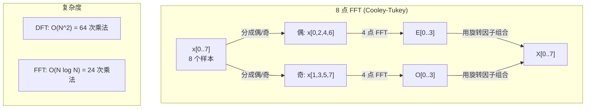
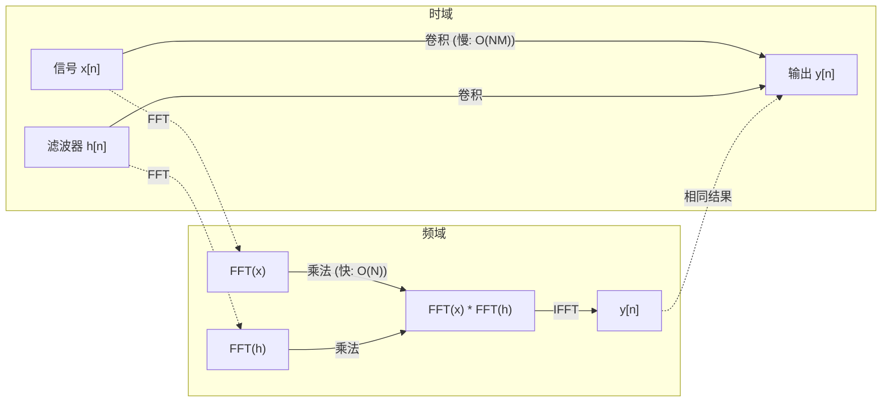

# 傅里叶变换 (The Fourier Transform)

> 每个信号都是正弦波的和。傅里叶变换告诉你有哪些正弦波。

**类型:** Build
**语言:** Python
**先修课程:** Phase 1, 第 01–04 课、第 19 课（复数）
**时间:** ~90 分钟

## 学习目标

- 从零实现 DFT (Discrete Fourier Transform，离散傅里叶变换)，并与 O(N log N) 的 Cooley-Tukey FFT (Fast Fourier Transform，快速傅里叶变换) 进行验证
- 解读频率系数：从信号中提取幅度 (amplitude)、相位 (phase) 和功率谱 (power spectrum)
- 应用卷积定理 (convolution theorem)，通过 FFT 域乘法实现卷积
- 将傅里叶频率分解与 Transformer 位置编码和 CNN 卷积层联系起来

## 问题

一段音频录音是随时间变化的压力测量序列。股票价格是一系列随日期变化的数值。图像是一组像素强度在空间上的分布。这些都属于时域 (time domain)（或空间域 (space domain)）。你看到的是数值随某个索引变化。

但许多模式在时域中是不可见的。这段音频是纯音还是和弦？这只股票有没有周循环？这张图像是否有重复纹理？这些问题关乎频率成分，而时域隐藏了它。

Fourier transform (傅里叶变换) 将数据从时域转换到频域 (frequency domain)。它取一个信号并将其分解为不同频率的正弦波。每个正弦波都有一个幅度 (amplitude)（多强）和一个相位 (phase)（从哪开始）。Fourier transform 同时告诉你两者。

这对机器学习很重要，因为频域思维无处不在。CNN 执行卷积 (convolution)，在频域中就是乘法。Transformer 位置编码使用频率分解来表示位置。音频模型（语音识别、音乐生成）在 spectrogram (频谱图) 上操作——声音的频率表示。时间序列模型寻找周期性模式。理解 Fourier transform 让你具备处理所有这些的词汇。

## 概念

### DFT 定义

给定 N 个样本 x[0], x[1], ..., x[N-1]，DFT (离散傅里叶变换) 产生 N 个频率系数 X[0], X[1], ..., X[N-1]：

```
X[k] = sum_{n=0}^{N-1} x[n] * e^(-2*pi*i*k*n/N)

for k = 0, 1, ..., N-1
```

每个 X[k] 是一个复数。它的模 |X[k]| 告诉你频率 k 的幅度。它的相位角 angle(X[k]) 告诉你该频率的相位偏移。

关键洞察：`e^(-2*pi*i*k*n/N)` 是频率为 k 的旋转相量 (phasor)。DFT 计算信号与 N 个等间距频率之间的相关性。如果信号在频率 k 上有能量，相关性就大。如果没有，就接近零。

### 每个系数的含义

**X[0]: 直流分量 (DC component)。** 这是所有样本的和——与均值成正比。它代表信号的常数（零频率）偏移。

```
X[0] = sum_{n=0}^{N-1} x[n] * e^0 = 所有样本之和
```

**1 <= k <= N/2 的 X[k]: 正频率 (positive frequencies)。** X[k] 代表每 N 个样本 k 个周期的频率。k 越高，频率越高（振荡越快）。

**X[N/2]: Nyquist 频率 (Nyquist frequency)。** 用 N 个样本可表示的最高频率。超过这个频率，就会出现 aliasing (混叠)——高频伪装成低频。

**N/2 < k < N 的 X[k]: 负频率 (negative frequencies)。** 对于实值信号，X[N-k] = conj(X[k])。负频率是正频率的镜像。这就是有用信息只在前 N/2 + 1 个系数中的原因。

### 逆 DFT (Inverse DFT)

逆 DFT 从频率系数重建原始信号：

```
x[n] = (1/N) * sum_{k=0}^{N-1} X[k] * e^(2*pi*i*k*n/N)

for n = 0, 1, ..., N-1
```

与正向 DFT 的唯一区别：指数中的符号为正（而非负），并且有一个 1/N 的归一化因子。

逆 DFT 是完美重建。没有信息丢失。你可以从时域到频域再回来，没有任何误差。DFT 是基变换——它在不同的坐标系中重新表达相同的信息。

### FFT: 让它变快

如上定义的 DFT 是 O(N^2)：对于每个 N 个输出系数，都要对 N 个输入样本求和。N = 100 万时，这是 10^12 次操作。

FFT (Fast Fourier Transform，快速傅里叶变换) 在 O(N log N) 时间内计算相同的结果。N = 100 万时，大约只需 2000 万次操作，而不是一万亿。这让频率分析变得实用。

Cooley-Tukey 算法（最常见的 FFT）通过分治法工作：

1. 将信号分为偶数索引和奇数索引样本。
2. 递归地计算每一半的 DFT。
3. 使用"旋转因子 (twiddle factors)" e^(-2*pi*i*k/N) 组合两个半大小的 DFT。

```
X[k] = E[k] + e^(-2*pi*i*k/N) * O[k]          for k = 0, ..., N/2 - 1
X[k + N/2] = E[k] - e^(-2*pi*i*k/N) * O[k]    for k = 0, ..., N/2 - 1

其中 E = 偶数索引样本的 DFT
      O = 奇数索引样本的 DFT
```

对称性意味着递归的每一层做 O(N) 工作，共有 log2(N) 层。总计：O(N log N)。



FFT 要求信号长度是 2 的幂。实践中，信号被零填充 (zero-padded) 到下一个 2 的幂。

### 频谱分析 (Spectral analysis)

**功率谱 (power spectrum)** 是 |X[k]|^2——每个频率系数的模的平方。它显示每个频率上有多少能量。

**相位谱 (phase spectrum)** 是 angle(X[k])——每个频率的相位偏移。对于大部分分析任务，你关注功率谱并忽略相位。

```
频率 k 的功率:  P[k] = |X[k]|^2 = X[k].real^2 + X[k].imag^2
频率 k 的相位:  phi[k] = atan2(X[k].imag, X[k].real)
```

### 频率分辨率 (Frequency resolution)

DFT 的频率分辨率取决于样本数 N 和采样率 fs (sampling rate)。

```
第 k 个频率箱 (bin) 的频率:  f_k = k * fs / N
频率分辨率:    delta_f = fs / N
最大频率:       f_max = fs / 2  (Nyquist)
```

要分辨两个靠得很近的频率，你需要更多样本。要捕获高频，你需要更高的采样率。

### 卷积定理 (Convolution theorem)

这是信号处理中最重要且直接相关的 CNN 基础结果之一。

**时域中的卷积等于频域中的逐点乘法。**

```
x * h = IFFT(FFT(x) . FFT(h))

其中 * 是卷积，. 是逐元素乘法
```

为什么重要：

- 直接卷积两个长度为 N 和 M 的信号需要 O(N*M) 操作。
- 基于 FFT 的卷积只需 O(N log N)：分别变换、相乘、逆变换。
- 对于大卷积核，基于 FFT 的卷积显著更快。
- 这正是感受野大的卷积层所发生的事。

注意：DFT 计算的是循环卷积 (circular convolution)（信号会环绕）。对于线性卷积 (linear convolution)（不环绕），零填充两个信号到长度 N + M - 1 再计算。



### 加窗 (Windowing)

DFT 假设信号是周期性的——它把 N 个样本当作一个无限重复信号的周期。如果信号在首尾值不同，这会在边界产生不连续性，表现为虚假的高频内容。这称为频谱泄漏 (spectral leakage)。

加窗 (Windowing) 通过在计算 DFT 前将信号两端逐渐衰减到零来减少泄漏。

常见窗函数：

| 窗函数 | 形状 | 主瓣宽度 | 旁瓣电平 | 使用场景 |
|--------|-------|----------------|-----------------|----------|
| 矩形 (Rectangular) | 平坦（无窗） | 最窄 | 最高 (-13 dB) | 信号恰好是 N 个样本的周期时 |
| Hann | 升余弦 | 中等 | 低 (-31 dB) | 通用频谱分析 |
| Hamming | 修正余弦 | 中等 | 更低 (-42 dB) | 音频处理、语音分析 |
| Blackman | 三重余弦 | 宽 | 极低 (-58 dB) | 旁瓣抑制至关重要时 |

```
Hann 窗:    w[n] = 0.5 * (1 - cos(2*pi*n / (N-1)))
Hamming 窗: w[n] = 0.54 - 0.46 * cos(2*pi*n / (N-1))
```

将窗函数通过逐元素相乘应用到信号上：`X = DFT(x * w)`。

### DFT 性质

| 性质 | 时域 | 频域 |
|----------|-------------|-----------------|
| 线性性 | a*x + b*y | a*X + b*Y |
| 时移 | x[n - k] | X[f] * e^(-2*pi*i*f*k/N) |
| 频移 | x[n] * e^(2*pi*i*f0*n/N) | X[f - f0] |
| 卷积 | x * h | X * H（逐点） |
| 乘法 | x * h（逐点） | X * H（循环卷积，按 1/N 缩放） |
| Parseval 定理 | sum |x[n]|^2 | (1/N) * sum |X[k]|^2 |
| 共轭对称性（实输入） | x[n] 实数 | X[k] = conj(X[N-k]) |

Parseval 定理说总能量在两个域中相等。能量通过变换被守恒。

### 与位置编码的联系

原始 Transformer 使用正弦位置编码：

```
PE(pos, 2i)   = sin(pos / 10000^(2i/d_model))
PE(pos, 2i+1) = cos(pos / 10000^(2i/d_model))
```

每个维度对 (2i, 2i+1) 在不同频率上振荡。频率从高频（维度 0,1）到低频（最后维度）几何级分布。这给了每个位置在所有频带上的独特模式——类似于 Fourier 系数如何唯一识别一个信号。

关键属性：

- **唯一性：** 没有两个位置有相同的编码。
- **有界值：** sin 和 cos 始终在 [-1, 1] 中。
- **相对位置：** 位置 p+k 的编码可以表示为位置 p 的编码的线性函数。模型可以学习关注相对位置。

### 与 CNN 的联系

卷积层通过在信号或图像上滑动一个学习到的滤波器（卷积核）来应用它。数学上，这就是卷积运算。

根据卷积定理，这等价于：
1. 对输入做 FFT
2. 对卷积核做 FFT
3. 在频域中逐点相乘
4. 做 IFFT 得到结果

标准 CNN 实现使用直接卷积（对于小的 3x3 卷积核更快）。但对于大卷积核或全局卷积，基于 FFT 的方法明显更快。有些架构（如 FNet）完全用 FFT 替代注意力，以 O(N log N) 代替 O(N^2) 的复杂度，达到有竞争力的准确率。

### 频谱图与短时傅里叶变换 (STFT)

单个 FFT 给你整个信号的频率内容，但无法告诉你这些频率何时出现。一个 chirp（频率随时间增加的信号）和一个 chord（所有频率同时出现）可以有相同的幅度谱。

STFT (Short-Time Fourier Transform，短时傅里叶变换) 通过在信号的重叠窗口上计算 FFT 来解决这个问题。结果是 spectrogram (频谱图)：一个二维表示，一轴是时间，一轴是频率。每个点的强度显示该时刻该频率的能量。

```
STFT 过程：
1. 选择窗大小（例如 1024 个样本）
2. 选择 hop 大小（例如 256 个样本——75% 重叠）
3. 对于每个窗口位置：
   a. 提取加窗片段
   b. 应用 Hann/Hamming 窗
   c. 计算 FFT
   d. 将幅度谱存储为频谱图的一列
```

频谱图是音频机器学习模型的标准输入。语音识别模型（Whisper、DeepSpeech）在 mel-spectrogram (mel 频谱图) 上操作——将频率映射到 mel 尺度的频谱图，更符合人耳的音高感知。

### 混叠 (Aliasing)

如果信号包含高于 fs/2（Nyquist 频率）的频率，以 fs 采样率采样会产生混叠副本。90 Hz 信号以 100 Hz 采样，看起来与 10 Hz 信号相同。无法仅从样本中区分它们。

```
示例：
  真实信号: 90 Hz 正弦波
  采样率: 100 Hz
  表观频率: 100 - 90 = 10 Hz

  90 Hz 信号在 100 Hz 采样率下的样本
  与 10 Hz 信号的样本完全相同。
  无论多少数学都无法恢复原始的 90 Hz。
```

这就是为什么模数转换器包含 anti-aliasing filter (抗混叠滤波器)，在采样前去除高于 Nyquist 的频率。在机器学习中，下采样特征图时，如果不进行适当的低通滤波，会出现混叠——某些架构通过 anti-aliased pooling 层来解决。

### 零填充不增加分辨率

一个常见误解：对信号零填充后做 FFT 可以提高频率分辨率。它不能。零填充在现有频率箱之间插值，给你一个更平滑的频谱外观。但它无法揭示原始样本中不存在的频率细节。

真实的频率分辨率只取决于观测时间 T = N / fs。要分辨两个相距 delta_f 的频率，你至少需要 T = 1 / delta_f 秒的数据。再多的零填充也不改变这个基本限制。

## 动手构建 (Build It)

### 步骤 1：从零实现 DFT

O(N^2) 的 DFT 直接遵循定义。

```python
import math

class Complex:
    ...

def dft(x):
    N = len(x)
    result = []
    for k in range(N):
        total = Complex(0, 0)
        for n in range(N):
            angle = -2 * math.pi * k * n / N
            w = Complex(math.cos(angle), math.sin(angle))
            xn = x[n] if isinstance(x[n], Complex) else Complex(x[n])
            total = total + xn * w
        result.append(total)
    return result
```

### 步骤 2：逆 DFT

相同结构，正指数，除以 N。

```python
def idft(X):
    N = len(X)
    result = []
    for n in range(N):
        total = Complex(0, 0)
        for k in range(N):
            angle = 2 * math.pi * k * n / N
            w = Complex(math.cos(angle), math.sin(angle))
            total = total + X[k] * w
        result.append(Complex(total.real / N, total.imag / N))
    return result
```

### 步骤 3：FFT (Cooley-Tukey)

递归 FFT 需要长度为 2 的幂。分成偶和奇，递归，用旋转因子组合。

```python
def fft(x):
    N = len(x)
    if N <= 1:
        return [x[0] if isinstance(x[0], Complex) else Complex(x[0])]
    if N % 2 != 0:
        return dft(x)

    even = fft([x[i] for i in range(0, N, 2)])
    odd = fft([x[i] for i in range(1, N, 2)])

    result = [Complex(0)] * N
    for k in range(N // 2):
        angle = -2 * math.pi * k / N
        twiddle = Complex(math.cos(angle), math.sin(angle))
        t = twiddle * odd[k]
        result[k] = even[k] + t
        result[k + N // 2] = even[k] - t
    return result
```

### 步骤 4：频谱分析辅助函数

```python
def power_spectrum(X):
    return [xk.real ** 2 + xk.imag ** 2 for xk in X]

def convolve_fft(x, h):
    N = len(x) + len(h) - 1
    padded_N = 1
    while padded_N < N:
        padded_N *= 2

    x_padded = x + [0.0] * (padded_N - len(x))
    h_padded = h + [0.0] * (padded_N - len(h))

    X = fft(x_padded)
    H = fft(h_padded)

    Y = [xk * hk for xk, hk in zip(X, H)]

    y = idft(Y)
    return [y[n].real for n in range(N)]
```

## 实践应用 (Use It)

对于实际工作，使用 numpy 的 FFT，它由高度优化的 C 库支持。

```python
import numpy as np

signal = np.sin(2 * np.pi * 5 * np.arange(256) / 256)
spectrum = np.fft.fft(signal)
freqs = np.fft.fftfreq(256, d=1/256)

power = np.abs(spectrum) ** 2

positive_freqs = freqs[:len(freqs)//2]
positive_power = power[:len(power)//2]
```

对于加窗和更高级的频谱分析：

```python
from scipy.signal import windows, stft

window = windows.hann(256)
windowed = signal * window
spectrum = np.fft.fft(windowed)
```

对于卷积：

```python
from scipy.signal import fftconvolve

result = fftconvolve(signal, kernel, mode='full')
```

对于频谱图：

```python
from scipy.signal import stft

frequencies, times, Zxx = stft(signal, fs=sample_rate, nperseg=256)
spectrogram = np.abs(Zxx) ** 2
```

频谱图矩阵的形状是 (n_frequencies, n_time_frames)。每列是一个时间窗口的功率谱。这就是音频机器学习模型所消费的输入。

## 交付产物 (Ship It)

运行 `code/fourier.py` 生成 `outputs/prompt-spectral-analyzer.md`。

## 练习

1. **纯音识别。** 创建一个频率在 1 到 50 Hz 之间的未知单正弦波信号，以 128 Hz 采样 1 秒。用你的 DFT 识别频率。验证答案匹配。然后添加标准差为 0.5 的高斯噪声并重复。噪声如何影响频谱？

2. **FFT vs DFT 验证。** 生成一个长度为 64 的随机信号。同时计算 DFT (O(N^2)) 和 FFT。验证所有系数匹配到 1e-10 以内。对长度为 256、512、1024 和 2048 的信号计时两者。绘制 DFT 时间与 FFT 时间的比率。

3. **卷积定理的示例证明。** 创建信号 x = [1, 2, 3, 4, 0, 0, 0, 0] 和滤波器 h = [1, 1, 1, 0, 0, 0, 0, 0]。直接计算循环卷积（嵌套循环）。然后通过 FFT 计算（变换、相乘、逆变换）。验证结果匹配。再通过适当的零填充做线性卷积。

4. **加窗效应。** 创建一个由 10 Hz 和 12 Hz 两个正弦波组成的信号（非常接近）。以 128 Hz 采样 1 秒。计算无窗、Hann 窗和 Hamming 窗下的功率谱。哪种窗最容易区分两个峰？为什么？

5. **位置编码分析。** 为 d_model = 128 和 max_pos = 512 生成正弦位置编码。对于每对位置 (p1, p2)，计算它们编码的点积。展示点积只取决于 |p1 - p2|，而不取决于绝对位置。随着距离增加，点积会发生什么？

## 关键术语

| 术语 | 含义 |
|------|---------------|
| DFT (Discrete Fourier Transform，离散傅里叶变换) | 将 N 个时域样本转换为 N 个频域系数。每个系数是与该频率的复数正弦波的相关性 |
| FFT (Fast Fourier Transform，快速傅里叶变换) | 计算 DFT 的 O(N log N) 算法。Cooley-Tukey 算法递归地分成偶/奇索引 |
| 逆 DFT (Inverse DFT) | 从频率系数重建时域信号。与 DFT 公式相同，但指数符号翻转并按 1/N 缩放 |
| 频率箱 (Frequency bin) | DFT 输出中的每个索引 k 代表频率 k*fs/N Hz。"箱"是离散频率槽 |
| 直流分量 (DC component) | X[0]，零频率系数。与信号均值成正比 |
| Nyquist 频率 | fs/2，采样率 fs 下可表示的最高频率。高于此的频率会混叠 |
| 功率谱 (Power spectrum) | |X[k]|^2，每个频率系数的模平方。显示频率间的能量分布 |
| 相位谱 (Phase spectrum) | angle(X[k])，每个频率分量的相位偏移。分析中常被忽略 |
| 频谱泄漏 (Spectral leakage) | 由于将非周期信号当作周期信号处理而产生的虚假频率内容。通过加窗减少 |
| 窗函数 (Window function) | 在 DFT 前应用的锥形函数（Hann、Hamming、Blackman），用于减少频谱泄漏 |
| 旋转因子 (Twiddle factor) | 复指数 e^(-2*pi*i*k/N)，用于在 FFT 蝴蝶计算中组合子 DFT |
| 卷积定理 (Convolution theorem) | 时域卷积等于频域逐点乘法。信号处理和 CNN 的基础 |
| 循环卷积 (Circular convolution) | 信号环绕的卷积。DFT 自然计算的是这个 |
| 线性卷积 (Linear convolution) | 标准的不环绕的卷积。通过零填充到 N + M - 1 实现 |
| Parseval 定理 (Parseval's theorem) | 总能量通过 Fourier 变换被守恒。sum |x[n]|^2 = (1/N) sum |X[k]|^2 |
| 混叠 (Aliasing) | 当高于 Nyquist 的频率由于采样率不足而表现为低频时 |

## 延伸阅读

- [Cooley & Tukey: An Algorithm for the Machine Calculation of Complex Fourier Series (1965)](https://www.ams.org/journals/mcom/1965-19-090/S0025-5718-1965-0178586-1/) - 改变计算领域的原始 FFT 论文
- [3Blue1Brown: But what is the Fourier Transform?](https://www.youtube.com/watch?v=spUNpyF58BY) - Fourier 变换的最佳视觉入门
- [Lee-Thorp et al.: FNet: Mixing Tokens with Fourier Transforms (2021)](https://arxiv.org/abs/2105.03824) - 在 Transformer 中用 FFT 替代自注意力
- [Smith: The Scientist and Engineer's Guide to Digital Signal Processing](http://www.dspguide.com/) - 涵盖 FFT、加窗和频谱分析的免费在线教科书
- [Vaswani et al.: Attention Is All You Need (2017)](https://arxiv.org/abs/1706.03762) - 从 Fourier 频率分解推导的正弦位置编码
- [Radford et al.: Whisper (2022)](https://arxiv.org/abs/2212.04356) - 使用 mel 频谱图作为输入表示的语音识别
