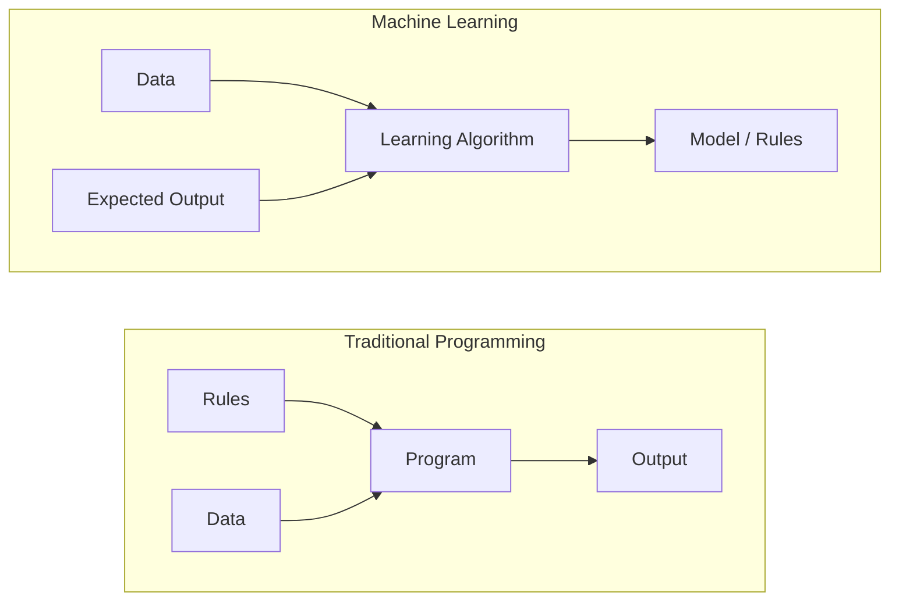
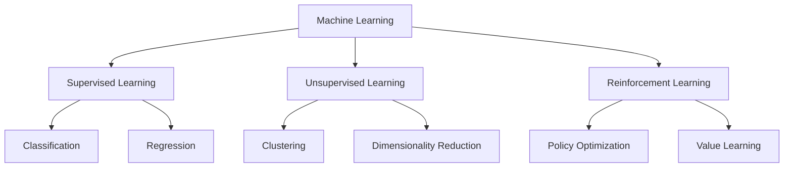
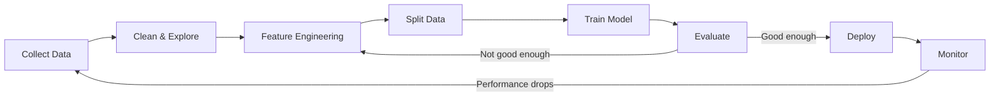
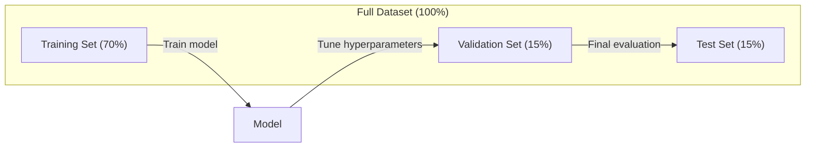
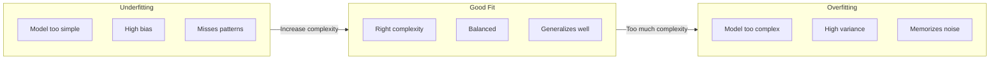
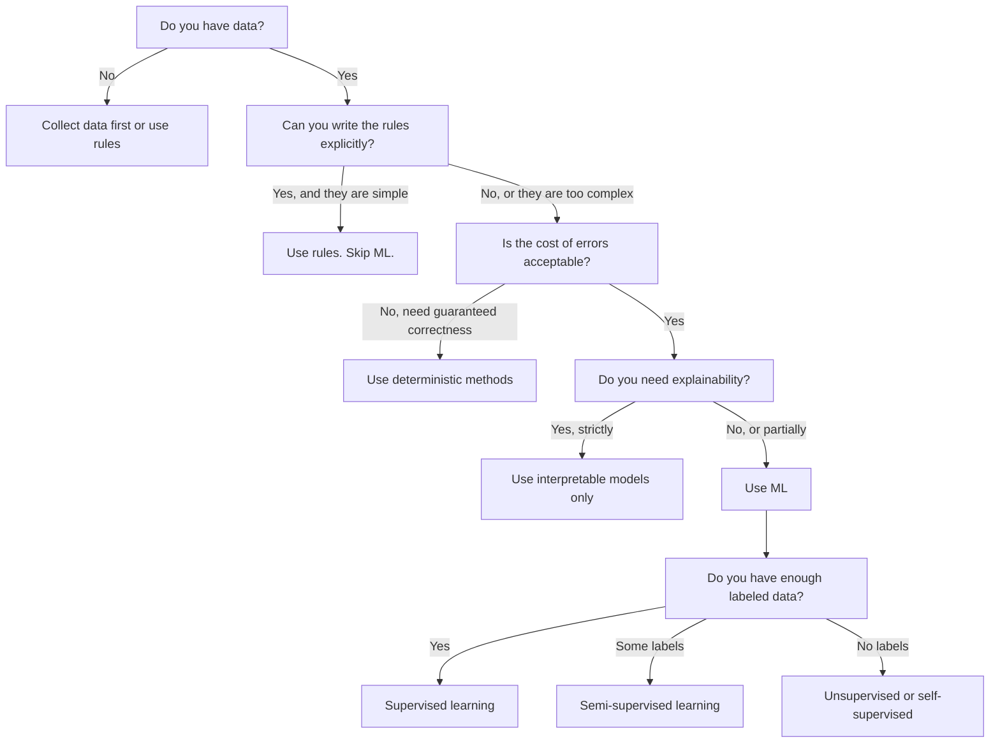

# 什么是机器学习

> 机器学习是教计算机从数据中发现模式，而不是手写规则。

**Type:** Learn
**Languages:** Python
**Prerequisites:** Phase 1 (Math Foundations)
**Time:** ~45 分钟

## 学习目标

- 解释监督学习 (supervised learning)、无监督学习 (unsupervised learning) 和强化学习 (reinforcement learning) 的区别，并能识别给定问题属于哪种类型
- 从零实现最近质心分类器 (nearest centroid classifier)，并将其与随机基线 (random baseline) 进行评估
- 区分分类 (classification) 和回归 (regression) 任务，并为每种任务选择合适的损失函数 (loss function)
- 评估一个业务问题是否适合用机器学习解决，还是更适合用确定性规则解决

## 问题

你想构建一个垃圾邮件过滤器。传统方法：坐下来写数百条规则。"如果邮件包含 'FREE MONEY'，标记为垃圾邮件。如果超过 3 个感叹号，标记为垃圾邮件。" 你花了数周写规则。然后垃圾邮件发送者换了措辞。你的规则失效了。你写更多规则。这个循环永远不会结束。

机器学习颠覆了这个过程。与其写规则，你给计算机数千封标注好的邮件（"垃圾邮件"或"非垃圾邮件"），让它自己找出规则。计算机发现了你从未想到过的模式。当垃圾邮件发送者改变策略时，你用新数据重新训练，而不是重写代码。

这种从"编写规则"到"从数据中学习"的转变是机器学习的核心。每一个推荐引擎、语音助手、自动驾驶汽车和语言模型都是这样工作的。

## 概念

### 从数据中学习，而非规则

传统编程和机器学习以相反的方向解决问题。



传统编程：你编写规则。程序将规则应用于数据以产生输出。

机器学习：你提供数据和预期输出。算法发现规则。

训练产生的"模型"就是规则，以数字（权重、参数）的形式编码。它从见过的示例中泛化，对从未见过的数据进行预测。

### 机器学习的三种类型



**Supervised Learning (监督学习)**：你有输入-输出对。模型学习将输入映射到输出。
- "这里有 10,000 张标注为猫或狗的照片。学会区分它们。"
- "这里有房屋特征和价格。学会预测价格。"

**Unsupervised Learning (无监督学习)**：你只有输入。没有标签。模型自己发现结构。
- "这里有 10,000 条客户购买记录。找出自然分组。"
- "这里有 1,000 维的数据点。降到 2 维同时保持结构。"

**Reinforcement Learning (强化学习)**：智能体 (agent) 在环境中采取行动，获得奖励或惩罚。它学习一种策略 (policy) 以最大化总奖励。
- "玩这个游戏。赢了 +1，输了 -1。找出策略。"
- "控制这个机械臂。拿起物体 +1，每秒浪费 -0.01。"

你在实践中构建的大部分内容使用 supervised learning。Unsupervised learning 常用于预处理和探索。Reinforcement learning 驱动游戏 AI、机器人以及语言模型的 RLHF。

### 超越三大类型

上述三个类别很清晰，但现实世界中的机器学习常常模糊界限。

**Semi-supervised learning (半监督学习)** 使用少量标注数据和大量未标注数据。你可能有 100 张标注的医学图像和 100,000 张未标注的图像。技术包括：

- **Label propagation (标签传播)**：构建连接相似数据点的图。标签通过图从标注节点传播到未标注邻居。
- **Pseudo-labeling (伪标签)**：在标注数据上训练模型，用它预测未标注数据的标签，然后在所有数据上重新训练。模型自举 (bootstrap) 自己的训练集。
- **Consistency regularization (一致性正则化)**：模型对输入和该输入的轻微扰动版本应给出相同预测。即使没有标签也有效。

**Self-supervised learning (自监督学习)** 从数据本身创建监督。完全不需要人工标签。模型从数据结构创建自己的预测任务。

- **Masked language modeling (BERT)**：隐藏句子中 15% 的词，训练模型预测缺失的词。"标签"来自原始文本。
- **Contrastive learning (SimCLR)**：取一张图像，创建两个增强版本。训练模型识别它们来自同一张图像，同时区分其他图像的增强版本。
- **Next-token prediction (GPT)**：给定所有前面的词，预测下一个词。每篇文本文档都成为一个训练示例。

这些不是与三大类型分开的类别。它们是结合监督和无监督思想的策略。Self-supervised learning 技术上属于监督学习（模型预测某物），但标签是自动生成的，不是由人工标注的。

### Classification vs Regression

这是两种主要的监督学习任务。

| 方面 | Classification (分类) | Regression (回归) |
|------|----------------------|-------------------|
| 输出 | 离散类别 | 连续数值 |
| 示例 | "这封邮件是垃圾邮件吗？" | "这所房子的价格会是多少？" |
| 输出空间 | {cat, dog, bird} | 任意实数 |
| Loss function | Cross-entropy, accuracy | Mean squared error, MAE |
| 决策 | 类别之间的边界 | 拟合数据的曲线 |

Classification 回答"哪个类别？" Regression 回答"多少？"

有些问题可以两种方式构建。预测股票涨跌是 classification。预测确切价格是 regression。

### 机器学习工作流

每个机器学习项目都遵循相同的流程，无论算法如何。



**Collect Data (收集数据)**：收集原始数据。更多数据几乎总是更好，但质量比数量更重要。

**Clean & Explore (清洗与探索)**：处理缺失值、删除重复项、可视化分布、发现异常值。这一步通常占项目总时间的 60-80%。

**Feature Engineering (特征工程)**：将原始数据转换为模型可以使用的特征。将日期转换为星期几。归一化数值列。编码分类变量。好的特征比花哨的算法更重要。

**Split Data (数据划分)**：划分为训练集、验证集和测试集。模型在训练数据上训练，你在验证数据上调整超参数 (hyperparameter)，在测试数据上报告最终性能。

**Train Model (训练模型)**：将训练数据输入算法。算法调整内部参数以最小化 loss function。

**Evaluate (评估)**：在验证/测试数据上测量性能。如果性能不可接受，返回尝试不同的特征、算法或 hyperparameter。

**Deploy (部署)**：将模型投入生产，对新数据进行预测。

**Monitor (监控)**：跟踪随时间的性能。数据分布会变化（数据漂移 data drift），模型会退化。当性能下降时，重新训练。

### 训练、验证和测试集划分

这是初学者最容易搞错的最重要概念。你必须在模型训练期间从未见过的数据上评估模型。否则你测量的是记忆，而不是学习。



| 划分 | 目的 | 何时使用 | 典型大小 |
|------|------|---------|---------|
| Training | 模型从这些数据学习 | 训练期间 | 60-80% |
| Validation | 调整 hyperparameter，比较模型 | 每次训练运行后 | 10-20% |
| Test | 最终无偏性能估计 | 一次，在最后 | 10-20% |

测试集是神圣的。你只看它一次。如果你根据测试性能不断调整模型，你实际上是在测试集上训练，报告的数字毫无意义。

对于小数据集，使用 k-fold cross-validation (交叉验证)：将数据分成 k 份，在 k-1 份上训练，在剩余一份上验证，轮换，并平均结果。

### Overfitting vs Underfitting



**Underfitting (欠拟合)**：模型太简单，无法捕捉数据中的模式。一条直线试图拟合曲线关系。训练误差高。测试误差高。

**Overfitting (过拟合)**：模型太复杂，记住了训练数据，包括其噪声。一条波浪曲线穿过每个训练点，但在新数据上失败。训练误差低。测试误差高。

**Good fit (良好拟合)**：模型捕捉真实模式而不记忆噪声。训练误差和测试误差都相当低。

Overfitting 的迹象：
- 训练准确率远高于验证准确率
- 模型在训练数据上表现良好，但在新数据上表现差
- 增加更多训练数据能改善性能（模型在记忆，而不是学习）

Overfitting 的修复方法：
- 获取更多训练数据
- 降低模型复杂度（更少的参数，更简单的架构）
- Regularization (正则化)（对大权重添加惩罚）
- Dropout (随机失活)（训练期间随机将神经元置零）
- Early stopping（当验证误差开始增加时停止训练）

Underfitting 的修复方法：
- 使用更复杂的模型
- 添加更多特征
- 减少 regularization
- 训练更长时间

### Bias-Variance Tradeoff (偏差-方差权衡)

这是 overfitting 和 underfitting 背后的数学框架。

**Bias (偏差)**：来自模型中错误假设的误差。当真实关系是非线性时，线性模型具有高 bias。高 bias 导致 underfitting。

**Variance (方差)**：来自对训练数据中小波动的敏感性的误差。高 variance 的模型在不同数据子集上训练时给出非常不同的预测。高 variance 导致 overfitting。

| 模型复杂度 | Bias | Variance | 结果 |
|-----------|------|----------|------|
| 太低（线性模型拟合曲线数据） | 高 | 低 | Underfitting |
| 刚好 | 中 | 中 | 良好泛化 |
| 太高（10 个点的 20 次多项式） | 低 | 高 | Overfitting |

总误差 = Bias² + Variance + 不可约噪声

你无法减少不可约噪声（它是数据本身的随机性）。你想找到 bias² + variance 最小化的最佳点。

### No Free Lunch Theorem (没有免费午餐定理)

没有一个算法在每个问题上都是最好的。在一个问题类别上表现良好的算法在另一个问题上会表现不佳。这就是数据科学家尝试多种算法并比较结果的原因。

在实践中，选择取决于：
- 你有多少数据
- 有多少特征
- 关系是线性还是非线性
- 你是否需要可解释性
- 你能负担多少计算资源

### 何时不使用机器学习

机器学习很强大，但不总是正确的工具。在拿起模型之前，先问自己是否真的需要它。

**不要使用 ML 的情况：**

- **规则简单且定义明确。** 税务计算、排序算法、单位换算。如果你能用几个 if 语句写出逻辑，模型只会增加复杂度而没有好处。
- **你没有数据或数据很少。** ML 需要示例来学习。只有 10 个数据点，你无法训练任何有意义的东西。先收集数据。
- **错误的代价是灾难性的，你需要保证正确性。** 医疗剂量计算、核反应堆控制、加密验证。ML 模型是概率性的。它们有时会出错。如果"有时出错"是不可接受的，使用确定性方法。
- **查找表或启发式方法就能解决问题。** 如果简单的阈值或表格覆盖了 99% 的情况，添加 ML 会增加维护成本而没有有意义的改进。
- **你无法解释决策，而可解释性是必需的。** 受监管的行业（贷款、保险、刑事司法）有时要求每个决策都能完全解释。有些 ML 模型是可解释的（线性回归、小决策树）。大多数不是。
- **问题变化比你重新训练还快。** 如果规则每天变化，重新训练需要一周，模型总是过时的。

使用这个决策流程图：



## Build It

`code/ml_intro.py` 中的代码从零实现了最近质心分类器 (nearest centroid classifier)，这是最简单的 ML 算法。它展示了核心思想：从数据中学习，然后对新数据进行预测。

### 步骤 1：从零实现最近质心分类器

最近质心分类器计算训练数据中每个类别的中心（均值）。预测时，它将每个新点分配到中心最近的类别。

```python
class NearestCentroid:
    def fit(self, X, y):
        self.classes = np.unique(y)
        self.centroids = np.array([
            X[y == c].mean(axis=0) for c in self.classes
        ])

    def predict(self, X):
        distances = np.array([
            np.sqrt(((X - c) ** 2).sum(axis=1))
            for c in self.centroids
        ])
        return self.classes[distances.argmin(axis=0)]
```

这就是整个算法。Fit 计算两个均值。Predict 计算距离。没有 gradient descent，没有迭代，没有 hyperparameter。

### 步骤 2：在合成数据上训练

我们生成一个二维分类数据集，有两个稍微重叠的类别。质心分类器在类别中心之间绘制线性决策边界。

```python
rng = np.random.RandomState(42)
X_class0 = rng.randn(100, 2) + np.array([1.0, 1.0])
X_class1 = rng.randn(100, 2) + np.array([-1.0, -1.0])
X = np.vstack([X_class0, X_class1])
y = np.array([0] * 100 + [1] * 100)
```

### 步骤 3：与基线比较

每个 ML 模型都应该与平凡的基线进行比较。这里，基线预测随机类别。如果你的 ML 模型不能击败随机猜测，那就有问题了。

```python
baseline_preds = rng.choice([0, 1], size=len(y_test))
baseline_acc = np.mean(baseline_preds == y_test)
```

在这个干净的数据集上，质心分类器应该达到约 90%+ 的准确率。随机基线约为 50%。

### 为什么这很重要

最近质心分类器非常简单。它没有 hyperparameter，没有迭代，没有 gradient descent。但它捕捉了基本的 ML 模式：

1. **Learn** 从训练数据中学习一种表示（质心）
2. **Predict** 使用这种表示对新数据进行预测（最近距离）
3. **Evaluate** 与基线进行比较（随机猜测）

每个 ML 算法，从逻辑回归到 transformer，都遵循这个相同的三步模式。表示变得更复杂，但工作流保持不变。

### 步骤 4：质心分类器不能做什么

最近质心分类器假设每个类别形成一个单一 blob。它绘制线性决策边界。它在以下情况会失败：

- 类别有多个簇（例如，数字"1"可以用几种不同的方式书写）
- 决策边界是非线性的（例如，一个类别围绕另一个类别）
- 特征具有非常不同的尺度（距离由最大尺度的特征主导）

这些局限性推动了你将学习的每一个其他算法。K-nearest neighbors 处理多个簇。决策树处理非线性边界。特征缩放解决尺度问题。每一课都建立在前一课局限性的基础上。

## Use It

sklearn 提供了 `NearestCentroid` 和合成数据生成器：

```python
from sklearn.neighbors import NearestCentroid
from sklearn.datasets import make_classification
from sklearn.model_selection import train_test_split

X, y = make_classification(
    n_samples=500, n_features=2, n_redundant=0,
    n_clusters_per_class=1, random_state=42
)
X_train, X_test, y_train, y_test = train_test_split(X, y, test_size=0.3)

clf = NearestCentroid()
clf.fit(X_train, y_train)
print(f"Accuracy: {clf.score(X_test, y_test):.3f}")
```

## Ship It

本课产出 `outputs/prompt-ml-problem-framer.md` —— 一个将模糊的业务问题转化为具体 ML 任务的 prompt。给它一个问题描述（"我们想减少流失"或"预测下季度需求"），它会识别学习类型、定义预测目标、列出候选特征、选择成功指标、建立基线，并标记数据泄漏 (data leakage) 或类别不平衡 (class imbalance) 等陷阱。在任何 ML 项目开始时使用它，以避免构建错误的东西。

## 关键术语

| 术语 | 人们怎么说 | 实际含义 |
|------|-----------|---------|
| Model | "The AI" | 一个具有可学习参数的数学函数，将输入映射到输出 |
| Training | "Teaching the AI" | 运行优化算法调整模型参数，使预测与已知输出匹配 |
| Feature | "An input column" | 数据的可测量属性，模型用它来做出预测 |
| Label | "The answer" | 训练示例的已知输出，用于计算误差信号 |
| Hyperparameter | "A setting you tweak" | 训练前设置的参数，控制学习过程（学习率、层数） |
| Loss function | "How wrong the model is" | 测量预测输出与实际输出之间差距的函数，训练试图最小化它 |
| Overfitting | "It memorized the test" | 模型学习了训练特有的噪声而非通用模式，因此在新数据上失败 |
| Underfitting | "It didn't learn anything" | 模型太简单，无法捕捉数据中的真实模式 |
| Generalization | "It works on new data" | 模型在未训练过的数据上做出准确预测的能力 |
| Cross-validation | "Testing on different chunks" | 反复将数据划分为训练/测试折并平均结果，给出更稳健的性能估计 |
| Regularization | "Keeping weights small" | 向 loss function 添加惩罚项，阻止过于复杂的模型 |
| Data drift | "The world changed" | 传入数据的统计分布随时间变化，导致模型性能下降 |

## 练习

1. 取任意数据集（例如 Iris、Titanic）。按 70/15/15 划分为训练/验证/测试集。解释为什么不应该在测试集上调整 hyperparameter。
2. 列出三个现实世界的问题。对每个问题，识别它是 classification、regression 还是 clustering，以及是 supervised 还是 unsupervised。
3. 一个模型在训练数据上达到 99% 准确率，但在测试数据上只有 60%。诊断问题并列出你会尝试的三种修复方法。

## 延伸阅读

- [An Introduction to Statistical Learning](https://www.statlearning.com/) - 涵盖所有经典 ML 方法及实际示例的免费教材
- [Google's Machine Learning Crash Course](https://developers.google.com/machine-learning/crash-course) - ML 概念的简洁可视化介绍
- [Scikit-learn User Guide](https://scikit-learn.org/stable/user_guide.html) - 在 Python 中实现 ML 的实用参考
