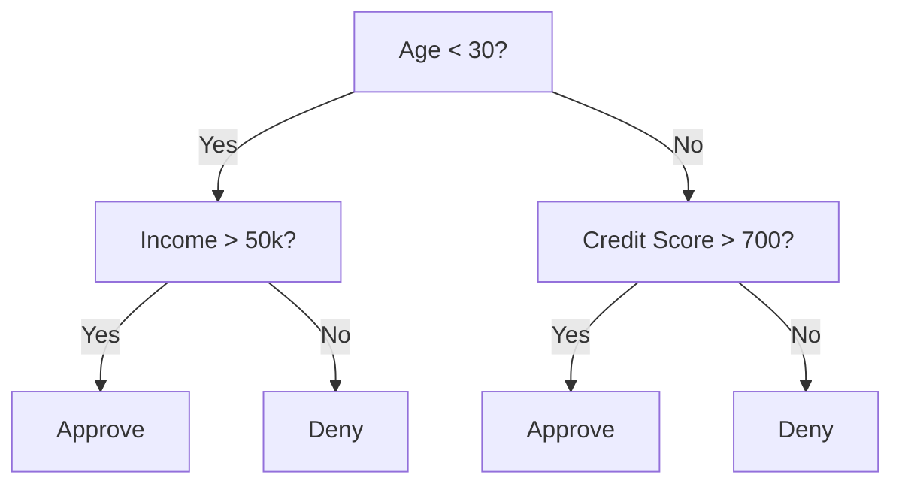
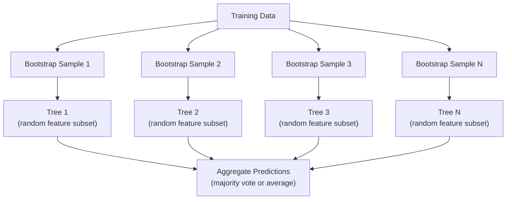

# 决策树与随机森林

> 决策树 (decision tree) 不过是一张流程图。但一片森林却是机器学习中最强大的工具之一。

**类型:** 构建
**语言:** Python
**前置知识:** Phase 1（第 09 课 信息论、第 06 课 概率）
**时间:** ~90 分钟

## 学习目标

- 实现 Gini impurity (基尼不纯度)、entropy (熵) 和 information gain (信息增益) 的计算，以找到最优的决策树分裂点
- 从零构建一个带有 pre-pruning (预剪枝) 控制（最大深度、最小样本数）的决策树分类器
- 构建 random forest (随机森林)，使用 bootstrap sample (自助样本) 和特征随机化，并解释它为何能降低 variance (方差)
- 比较 MDI feature importance (特征重要性) 与 permutation importance (置换重要性)，并识别 MDI 何时存在偏差

## 问题背景

你手头有一份表格数据。每一行是一个样本，每一列是一个特征，还有一列是你想要预测的目标。你可以直接扔一个神经网络上去。但对于表格数据，基于树的模型（决策树、随机森林、梯度提升树）始终优于深度学习。Kaggle 上结构化数据的比赛几乎被 XGBoost 和 LightGBM 统治，而不是 transformers。

为什么？树模型可以原生处理混合特征类型（数值型和类别型），无需预处理。它们无需特征工程就能处理非线性关系。它们具有可解释性：你可以直接观察树结构，清楚地看到某个预测是如何做出的。而 random forest (随机森林) 通过对多棵树的预测取平均，在中等规模数据集上具有很强的抗 overfitting (过拟合) 能力。

本节课将从递归分裂开始，从零构建决策树，再在其之上构建 random forest。你将实现分裂准则（Gini impurity、entropy、information gain）背后的数学原理，并理解为什么一群弱学习器组合起来会变成强学习器。

## 核心概念

### 决策树在做什么

决策树通过提出一系列是/否问题，将特征空间划分为矩形区域。



每个内部节点测试一个特征是否超过某个阈值。每个叶子节点给出一个预测。要对新数据点进行分类，从根节点出发，沿着分支走，直到到达叶子。

树的构建采用自顶向下的方式：在每个节点处，选择最能分离数据的特征和阈值。“最优”由分裂准则定义。

### 分裂准则：衡量不纯度

在每个节点，我们有一组样本。我们希望将它们分裂，使得子节点尽可能“纯”，即每个子节点主要包含某一类。

**Gini impurity (基尼不纯度)** 衡量的是：如果根据该节点处的类别分布来随机标记样本，一个随机选中的样本被误分类的概率。

```
Gini(S) = 1 - sum(p_k^2)

其中 p_k 是集合 S 中类别 k 的比例。
```

对于纯节点（全为同一类），Gini = 0。对于二分类中 50/50 的情况，Gini = 0.5。越低越好。

```
Example: 6 cats, 4 dogs

Gini = 1 - (0.6^2 + 0.4^2) = 1 - (0.36 + 0.16) = 0.48
```

**Entropy (熵)** 衡量节点中的信息含量（混乱程度）。在 Phase 1 第 09 课中已涵盖。

```
Entropy(S) = -sum(p_k * log2(p_k))
```

对于纯节点，entropy = 0。对于二分类中 50/50 的情况，entropy = 1.0。越低越好。

```
Example: 6 cats, 4 dogs

Entropy = -(0.6 * log2(0.6) + 0.4 * log2(0.4))
        = -(0.6 * -0.737 + 0.4 * -1.322)
        = 0.442 + 0.529
        = 0.971 bits
```

**Information gain (信息增益)** 是分裂后 impurity（entropy 或 Gini）的减少量。

```
IG(S, feature, threshold) = Impurity(S) - weighted_avg(Impurity(S_left), Impurity(S_right))

其中权重是各子节点中样本所占的比例。
```

每个节点上的贪心算法：尝试每一个特征和每一个可能的阈值，选择使 information gain 最大的（特征，阈值）组合。

### 分裂过程

对于当前节点上有 n 个特征、m 个样本的数据集：

1. 对于每个特征 j（j = 1 到 n）：
   - 按特征 j 对样本排序
   - 尝试每对相邻不同值的中点作为阈值
   - 计算每个阈值下的 information gain
2. 选择 information gain 最高的特征和阈值
3. 将数据分为左子集（特征 <= 阈值）和右子集（特征 > 阈值）
4. 对每个子节点递归重复

这种贪心方法不能保证得到全局最优树。寻找最优树是 NP-hard 问题。但在实践中，贪心分裂效果很好。

### 停止条件

如果没有停止条件，树会一直生长，直到每个叶子都是纯的（每个叶子只有一个样本）。这会完美记住训练数据，但泛化能力极差。

**Pre-pruning (预剪枝)** 在树完全生长前停止：
- 最大深度：当树达到设定深度时停止分裂
- 叶子最小样本数：如果节点样本数少于 k，则停止
- 最小 information gain：如果最佳分裂带来的 impurity 改进小于阈值，则停止
- 最大叶子节点数：限制叶子总数

**Post-pruning (后剪枝)** 先让树完全生长，再回剪：
- 代价复杂度剪枝（scikit-learn 使用）：对叶子数量施加惩罚。增大惩罚以获得更小的树
- 降低误差剪枝：如果移除子树后验证误差不增加，则移除

Pre-pruning 更简单、更快。Post-pruning 通常能产生更好的树，因为它不会过早地阻止那些可能带来有用后续分裂的分裂。

### 用于回归的决策树

对于回归任务，叶子的预测值是该叶子中目标值的均值。分裂准则也相应改变：

**Variance reduction (方差缩减)** 取代 information gain：

```
VR(S, feature, threshold) = Var(S) - weighted_avg(Var(S_left), Var(S_right))
```

选择使 variance 减少最多的分裂。树将输入空间划分为若干区域，每个区域预测一个常数（均值）。

### Random forest (随机森林)：集成学习的力量

单棵决策树的 variance 很高。数据的微小变化就可能产生完全不同的树。Random forest 通过平均多棵树的预测来解决这个问题。



两种随机性来源使树变得多样化：

**Bagging (自助聚合)：** 每棵树在一个 bootstrap sample 上训练，即从训练数据中有放回地随机抽样。每次 bootstrap 中大约包含 63% 的原始样本（其余为 out-of-bag 样本，可用于验证）。

**Feature randomization (特征随机化)：** 在每个分裂点，只考虑特征的随机子集。对于分类任务，默认是 sqrt(n_features)。对于回归任务，是 n_features/3。这防止所有树都在同一个主导特征上分裂。

关键洞察：平均多棵低相关性的树可以在不增加 bias 的情况下降低 variance。每棵树单独看可能平庸，但集成起来就很强。

### Feature importance (特征重要性)

Random forest 天然提供 feature importance 分数。最常见的方法：

**Mean Decrease in Impurity (MDI, 平均不纯度下降)：** 对每个特征，累加它在所有树、所有节点上带来的总 impurity 减少量。在较早分裂中产生更大 impurity 减少的特征更重要。

```
importance(feature_j) = 对所有使用 feature_j 的节点求和：
    (n_samples_at_node / n_total_samples) * impurity_decrease
```

这种方法很快（训练时即可计算），但会偏向高基数特征（有很多可能分裂点的特征）。

**Permutation importance (置换重要性)** 是替代方案：打乱一个特征的值，测量模型准确率下降多少。更可靠，但更慢。

### 树何时胜过神经网络

树和森林在表格数据上碾压神经网络。原因如下：

| 因素 | 树 | 神经网络 |
|--------|-------|----------------|
| 混合类型（数值 + 类别） | 原生支持 | 需要编码 |
| 小数据集（< 10k 行） | 表现好 | 容易 overfit |
| 特征交互 | 分裂自动发现 | 需要架构设计 |
| 可解释性 | 完全透明 | 黑盒 |
| 训练时间 | 分钟级 | 小时级 |
| 超参数敏感度 | 低 | 高 |

神经网络在空间或序列结构数据（图像、文本、音频）上胜出。对于扁平的特征表格，树是默认选择。

## 动手构建

### 第一步：Gini impurity 和 entropy

从零构建两种分裂准则，并验证它们在判断哪些分裂是好的这一点上是一致的。

```python
import math

def gini_impurity(labels):
    n = len(labels)
    if n == 0:
        return 0.0
    counts = {}
    for label in labels:
        counts[label] = counts.get(label, 0) + 1
    return 1.0 - sum((c / n) ** 2 for c in counts.values())

def entropy(labels):
    n = len(labels)
    if n == 0:
        return 0.0
    counts = {}
    for label in labels:
        counts[label] = counts.get(label, 0) + 1
    return -sum(
        (c / n) * math.log2(c / n) for c in counts.values() if c > 0
    )
```

### 第二步：寻找最佳分裂点

尝试每个特征和每个阈值，返回 information gain 最高的那个。

```python
def information_gain(parent_labels, left_labels, right_labels, criterion="gini"):
    measure = gini_impurity if criterion == "gini" else entropy
    n = len(parent_labels)
    n_left = len(left_labels)
    n_right = len(right_labels)
    if n_left == 0 or n_right == 0:
        return 0.0
    parent_impurity = measure(parent_labels)
    child_impurity = (
        (n_left / n) * measure(left_labels) +
        (n_right / n) * measure(right_labels)
    )
    return parent_impurity - child_impurity
```

### 第三步：构建 DecisionTree 类

递归分裂、预测和特征重要性追踪。

```python
class DecisionTree:
    def __init__(self, max_depth=None, min_samples_split=2,
                 min_samples_leaf=1, criterion="gini",
                 max_features=None):
        self.max_depth = max_depth
        self.min_samples_split = min_samples_split
        self.min_samples_leaf = min_samples_leaf
        self.criterion = criterion
        self.max_features = max_features
        self.tree = None
        self.feature_importances_ = None

    def fit(self, X, y):
        self.n_features = len(X[0])
        self.feature_importances_ = [0.0] * self.n_features
        self.n_samples = len(X)
        self.tree = self._build(X, y, depth=0)
        total = sum(self.feature_importances_)
        if total > 0:
            self.feature_importances_ = [
                fi / total for fi in self.feature_importances_
            ]

    def predict(self, X):
        return [self._predict_one(x, self.tree) for x in X]
```

### 第四步：构建 RandomForest 类

Bootstrap sampling、feature randomization 和多数投票。

```python
class RandomForest:
    def __init__(self, n_trees=100, max_depth=None,
                 min_samples_split=2, max_features="sqrt",
                 criterion="gini"):
        self.n_trees = n_trees
        self.max_depth = max_depth
        self.min_samples_split = min_samples_split
        self.max_features = max_features
        self.criterion = criterion
        self.trees = []

    def fit(self, X, y):
        n = len(X)
        for _ in range(self.n_trees):
            indices = [random.randint(0, n - 1) for _ in range(n)]
            X_boot = [X[i] for i in indices]
            y_boot = [y[i] for i in indices]
            tree = DecisionTree(
                max_depth=self.max_depth,
                min_samples_split=self.min_samples_split,
                max_features=self.max_features,
                criterion=self.criterion,
            )
            tree.fit(X_boot, y_boot)
            self.trees.append(tree)

    def predict(self, X):
        all_preds = [tree.predict(X) for tree in self.trees]
        predictions = []
        for i in range(len(X)):
            votes = {}
            for preds in all_preds:
                v = preds[i]
                votes[v] = votes.get(v, 0) + 1
            predictions.append(max(votes, key=votes.get))
        return predictions
```

完整实现（包含所有辅助方法）请参见 `code/trees.py`。

## 实际使用

使用 scikit-learn，训练一个 random forest 只需三行代码：

```python
from sklearn.ensemble import RandomForestClassifier
from sklearn.datasets import load_iris
from sklearn.model_selection import train_test_split

X, y = load_iris(return_X_y=True)
X_train, X_test, y_train, y_test = train_test_split(X, y, random_state=42)

rf = RandomForestClassifier(n_estimators=100, random_state=42)
rf.fit(X_train, y_train)
print(f"Accuracy: {rf.score(X_test, y_test):.4f}")
print(f"Feature importances: {rf.feature_importances_}")
```

在实践中，梯度提升树（XGBoost、LightGBM、CatBoost）通常比 random forest 更强，因为它们按顺序构建树，每棵树纠正前一棵树的错误。但 random forest 更难配置错误，几乎不需要超参数调优。

## 交付物

本节课产出 `outputs/prompt-tree-interpreter.md` —— 一个用于向业务利益相关者解释决策树分裂结果的 prompt。将训练好的树结构（深度、特征、分裂阈值、准确率）输入给它，它会将模型翻译成 plain-language 规则，对 feature importance 排序，标记 overfitting 或 leakage，并推荐下一步行动。每当你需要向非技术人员解释基于树的模型时，都可以使用它。

## 练习

1. 在具有 3 个类别的 2D 数据集上训练单棵决策树。手动追踪分裂过程并画出矩形决策边界。比较 max_depth=2 和 max_depth=10 时的边界。

2. 为回归树实现 variance reduction 分裂。为 200 个点生成 y = sin(x) + noise，拟合你的回归树。将树的分段常数预测与真实曲线对比绘图。

3. 构建包含 1、5、10、50、200 棵树的 random forest。绘制训练准确率和测试准确率随树数量变化的曲线。观察测试准确率趋于平稳但不会下降（森林抵抗 overfitting）。

4. 在 5 个不同数据集上比较 Gini impurity 和 entropy 作为分裂准则。测量准确率和树深度。在大多数情况下，它们产生几乎相同的结果。解释原因。

5. 实现 permutation importance。在一个特征为随机噪声但具有高基数的数据集上，将它与 MDI importance 比较。MDI 会将噪声特征排得很高。Permutation importance 不会。

## 关键术语

| 术语 | 人们怎么说 | 实际含义 |
|------|----------------|----------------------|
| Decision tree (决策树) | "一个预测用的流程图" | 通过一系列 if/else 分裂将特征空间划分为矩形区域的模型 |
| Gini impurity (基尼不纯度) | "节点有多混杂" | 在节点处随机样本被误分类的概率。0 = 纯，0.5 = 二分类最大不纯度 |
| Entropy (熵) | "节点的混乱程度" | 节点处的信息含量。0 = 纯，1.0 = 二分类最大不确定性。来自信息论 |
| Information gain (信息增益) | "分裂有多好" | 分裂后 impurity 的减少量。贪心选择分裂的准则 |
| Pre-pruning (预剪枝) | "提前停止树的生长" | 通过设置最大深度、最小样本数或最小增益阈值来提前停止树的生长 |
| Post-pruning (后剪枝) | "事后修剪树" | 先让树完全生长，再移除不能提升验证性能的子树 |
| Bagging (自助聚合) | "在随机子集上训练" | Bootstrap aggregating。每棵树在不同的有放回随机样本上训练 |
| Random forest (随机森林) | "一堆树" | 决策树的集成，每棵树在 bootstrap sample 上训练，且每个分裂点使用随机特征子集 |
| Feature importance (MDI) (特征重要性) | "哪些特征重要" | 每个特征在所有树和节点上带来的总 impurity 减少量 |
| Permutation importance (置换重要性) | "打乱后检查" | 随机打乱一个特征的值后模型准确率的下降幅度。对于噪声特征比 MDI 更可靠 |
| Variance reduction (方差缩减) | "回归版的信息增益" | Information gain 在回归树中的对应物。选择使目标 variance 减少最多的分裂 |
| Bootstrap sample (自助样本) | "有重复的随机样本" | 从原始数据集中有放回地抽取的随机样本。大小相同，但包含重复项 |

## 延伸阅读

- [Breiman: Random Forests (2001)](https://link.springer.com/article/10.1023/A:1010933404324) —— random forest 的原始论文
- [Grinsztajn et al.: Why do tree-based models still outperform deep learning on tabular data? (2022)](https://arxiv.org/abs/2207.08815) —— 树与神经网络在表格任务上的严格对比
- [scikit-learn Decision Trees documentation](https://scikit-learn.org/stable/modules/tree.html) —— 带可视化工具的实用指南
- [XGBoost: A Scalable Tree Boosting System (Chen & Guestrin, 2016)](https://arxiv.org/abs/1603.02754) —— 统治 Kaggle 的梯度提升论文
