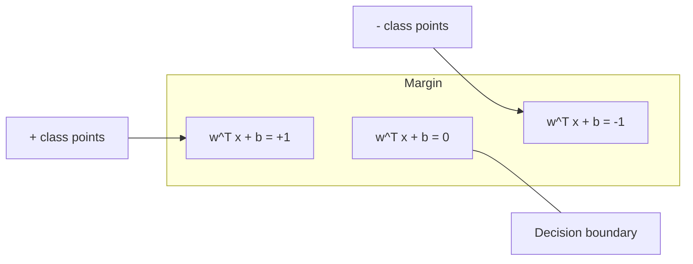
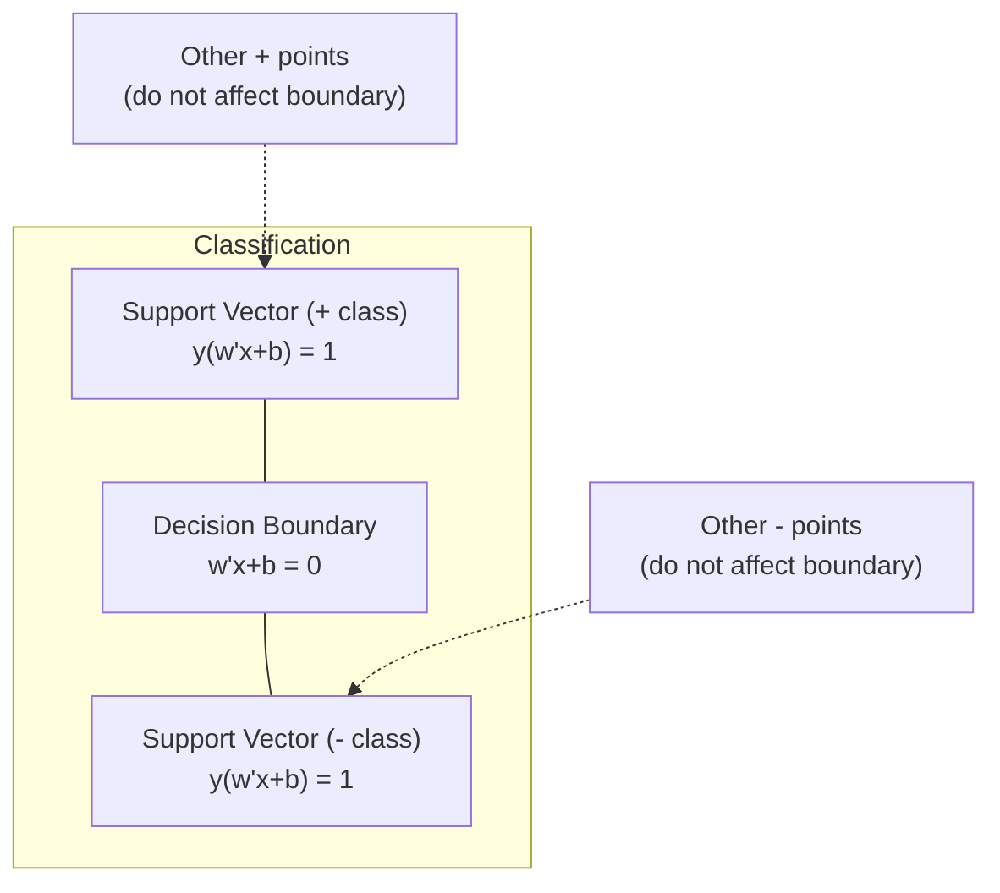
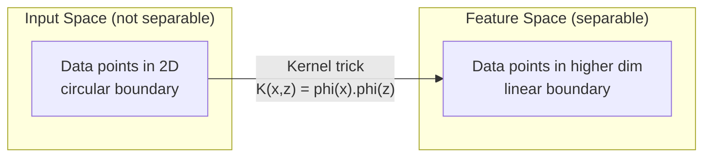

# Support Vector Machines (支持向量机)

> 找到两类之间最宽的街道。这就是全部思想。

**Type:** Build
**Language:** Python
**Prerequisites:** Phase 1 (Lessons 08 Optimization, 14 Norms and Distances, 18 Convex Optimization)
**Time:** ~90 分钟

## 学习目标

- 使用 hinge loss (铰链损失) 和梯度下降在 primal formulation (原始形式) 上从头实现线性 SVM (支持向量机)
- 解释 maximum margin (最大间隔) 原理，并从训练好的模型中识别 support vectors (支持向量)
- 比较 linear kernel (线性核)、polynomial kernel (多项式核) 和 RBF kernel (RBF 核)，并解释 kernel trick (核技巧) 如何避免显式的高维映射
- 评估 C 参数在 margin width (间隔宽度) 和分类错误之间的权衡

## 问题背景

你有两类数据点，需要画一条线（或超平面）将它们分开。有无数条线可以做到。你应该选哪一条？

选 margin 最大的那条。margin 是决策边界与两侧最近数据点之间的距离。更宽的 margin 意味着分类器更自信，对未见数据的 generalization (泛化) 更好。

这个直觉引出了 Support Vector Machine (支持向量机)，这是 ML 中最具数学优雅性的算法之一。在深度学习之前，SVM 是主导的分类方法，至今仍是小数据集、高维数据以及需要原理清晰、理论保证的模型的最佳选择。

SVM 与 Phase 1 直接相关：优化是 convex (凸的)（Lesson 18），margin 用 norm (范数) 度量（Lesson 14），kernel trick 利用 dot product (点积) 处理非线性边界而无需在高维空间中计算。

## 核心概念

### 最大间隔分类器

给定标签 y_i 属于 {-1, +1} 的线性可分数据和特征向量 x_i，我们希望找到一个超平面 w^T x + b = 0 将两类分开。

点 x_i 到超平面的距离为：

```
distance = |w^T x_i + b| / ||w||
```

对于正确分类的点：y_i * (w^T x_i + b) > 0。margin 是超平面到两侧最近点距离的两倍。



优化问题：

```
maximize    2 / ||w||     (margin width)
subject to  y_i * (w^T x_i + b) >= 1  for all i
```

等价地（最小化 ||w||^2 更容易优化）：

```
minimize    (1/2) ||w||^2
subject to  y_i * (w^T x_i + b) >= 1  for all i
```

这是一个 convex quadratic program (凸二次规划)。它有唯一的全局最优解。恰好位于 margin 边界上的数据点（即 y_i * (w^T x_i + b) = 1）就是 support vectors (支持向量)。它们是唯一决定决策边界的点。移动或删除任何非 support vector 的点，边界都不会改变。

### Support vectors: the critical few



大多数训练点都是无关的。只有 support vectors 才重要。这就是 SVM 在预测时内存高效的原因：你只需要存储 support vectors，而不需要整个训练集。

Support vectors 的数量也提供了 generalization error (泛化误差) 的上界。相对于数据集大小，support vectors 越少意味着 generalization 越好。

### Soft margin: handling noise with the C parameter

真实数据很少是完全可分的。有些点可能在边界的错误一侧，或者在 margin 内部。soft margin (软间隔) 形式通过引入 slack variables (松弛变量) 允许违反约束。

```
minimize    (1/2) ||w||^2 + C * sum(xi_i)
subject to  y_i * (w^T x_i + b) >= 1 - xi_i
            xi_i >= 0  for all i
```

Slack variable xi_i 度量点 i 违反 margin 的程度。C 控制权衡：

| C value | Behavior |
|---------|----------|
| Large C | 严重惩罚违反。Narrow margin (窄间隔)，更少的误分类。Overfits (过拟合) |
| Small C | 允许更多违反。Wide margin (宽间隔)，更多误分类。Underfits (欠拟合) |

C 是 regularization strength (正则化强度) 的倒数。Large C = less regularization (更弱的正则化)。Small C = more regularization (更强的正则化)。

### Hinge loss: the SVM loss function

Soft margin SVM 可以重写为无约束优化：

```
minimize    (1/2) ||w||^2 + C * sum(max(0, 1 - y_i * (w^T x_i + b)))
```

项 max(0, 1 - y_i * f(x_i)) 就是 hinge loss (铰链损失)。当点被正确分类且在 margin 之外时为零。当点在 margin 内部或被误分类时为线性惩罚。

```
Hinge loss for a single point:

loss
  |
  | \
  |  \
  |   \
  |    \
  |     \_______________
  |
  +-----|-----|-------->  y * f(x)
       0     1

Zero loss when y*f(x) >= 1 (correctly classified, outside margin).
Linear penalty when y*f(x) < 1.
```

与 logistic loss (logistic regression) 比较：

```
Hinge:     max(0, 1 - y*f(x))          Hard cutoff at margin
Logistic:  log(1 + exp(-y*f(x)))        Smooth, never exactly zero
```

Hinge loss 产生 sparse solutions (稀疏解)（只有 support vectors 有非零贡献）。Logistic loss 使用所有数据点。这使得 SVM 在预测时更内存高效。

### Training a linear SVM with gradient descent

你可以使用梯度下降在 hinge loss 加 L2 regularization (正则化) 上训练线性 SVM，无需求解约束 QP：

```
L(w, b) = (lambda/2) * ||w||^2 + (1/n) * sum(max(0, 1 - y_i * (w^T x_i + b)))

Gradient with respect to w:
  If y_i * (w^T x_i + b) >= 1:  dL/dw = lambda * w
  If y_i * (w^T x_i + b) < 1:   dL/dw = lambda * w - y_i * x_i

Gradient with respect to b:
  If y_i * (w^T x_i + b) >= 1:  dL/db = 0
  If y_i * (w^T x_i + b) < 1:   dL/db = -y_i
```

这称为 primal formulation (原始形式)。每轮 epoch 的运行时间为 O(n * d)，其中 n 是样本数，d 是特征数。对于大型稀疏高维数据（文本分类），这很快。

### The dual formulation and the kernel trick

SVM 问题的 Lagrangian dual (拉格朗日对偶)（来自 Phase 1 Lesson 18, KKT conditions）为：

```
maximize    sum(alpha_i) - (1/2) * sum_ij(alpha_i * alpha_j * y_i * y_j * (x_i . x_j))
subject to  0 <= alpha_i <= C
            sum(alpha_i * y_i) = 0
```

Dual formulation 只涉及数据点之间的 dot products (点积) x_i . x_j。这是关键洞察。将每个 dot product 替换为 kernel function K(x_i, x_j)，SVM 就可以学习非线性边界而无需显式计算变换。

```
Linear kernel:      K(x, z) = x . z
Polynomial kernel:  K(x, z) = (x . z + c)^d
RBF (Gaussian):     K(x, z) = exp(-gamma * ||x - z||^2)
```

RBF kernel 将数据映射到无限维空间。输入空间中相近的点 kernel 值接近 1。相距很远的点 kernel 值接近 0。它可以学习任何平滑的决策边界。



Kernel trick 在高维空间中计算 dot product 而无需真正到达那里。对于 D 维中 degree d 的 polynomial kernel，显式特征空间有 O(D^d) 维。但 K(x, z) 只需 O(D) 时间计算。

### SVM for regression (SVR)

Support Vector Regression (支持向量回归) 在数据周围拟合一个宽度为 epsilon 的 tube (管道)。Tube 内的点 loss 为零。Tube 外的点被线性惩罚。

```
minimize    (1/2) ||w||^2 + C * sum(xi_i + xi_i*)
subject to  y_i - (w^T x_i + b) <= epsilon + xi_i
            (w^T x_i + b) - y_i <= epsilon + xi_i*
            xi_i, xi_i* >= 0
```

Epsilon 参数控制 tube 宽度。更宽的 tube = 更少的 support vectors = 更平滑的拟合。更窄的 tube = 更多的 support vectors = 更紧的拟合。

### Why SVMs lost to deep learning (and when they still win)

SVM 从 1990 年代末到 2010 年代初主导了 ML。深度学习在几个方面超越了它们：

| Factor | SVMs | Deep learning |
|--------|------|---------------|
| Feature engineering | 需要它 | 学习特征 |
| Scalability | Kernel SVM 为 O(n^2) 到 O(n^3) | SGD 每轮 epoch 为 O(n) |
| Image/text/audio | 需要手工特征 | 从原始数据学习 |
| Large datasets (>100k) | 慢 | 扩展性好 |
| GPU acceleration | 收益有限 | 大幅加速 |

SVM 在以下情况仍然胜出：
- 小数据集（数百到数千样本）
- 高维稀疏数据（TF-IDF 特征的文本）
- 当你需要数学保证（margin bounds）
- 当训练时间必须最小化时（线性 SVM 非常快）
- 具有清晰 margin 结构的二分类
- 异常检测（one-class SVM）

## 动手实现

### Step 1: Hinge loss and gradient

基础。计算一批数据的 hinge loss 及其梯度。

```python
def hinge_loss(X, y, w, b):
    n = len(X)
    total_loss = 0.0
    for i in range(n):
        margin = y[i] * (dot(w, X[i]) + b)
        total_loss += max(0.0, 1.0 - margin)
    return total_loss / n
```

### Step 2: Linear SVM via gradient descent

通过最小化 regularized hinge loss 来训练。不需要 QP 求解器。

```python
class LinearSVM:
    def __init__(self, lr=0.001, lambda_param=0.01, n_epochs=1000):
        self.lr = lr
        self.lambda_param = lambda_param
        self.n_epochs = n_epochs
        self.w = None
        self.b = 0.0

    def fit(self, X, y):
        n_features = len(X[0])
        self.w = [0.0] * n_features
        self.b = 0.0

        for epoch in range(self.n_epochs):
            for i in range(len(X)):
                margin = y[i] * (dot(self.w, X[i]) + self.b)
                if margin >= 1:
                    self.w = [wj - self.lr * self.lambda_param * wj
                              for wj in self.w]
                else:
                    self.w = [wj - self.lr * (self.lambda_param * wj - y[i] * X[i][j])
                              for j, wj in enumerate(self.w)]
                    self.b -= self.lr * (-y[i])

    def predict(self, X):
        return [1 if dot(self.w, x) + self.b >= 0 else -1 for x in X]
```

### Step 3: Kernel functions

实现 linear、polynomial 和 RBF kernel。

```python
def linear_kernel(x, z):
    return dot(x, z)

def polynomial_kernel(x, z, degree=3, c=1.0):
    return (dot(x, z) + c) ** degree

def rbf_kernel(x, z, gamma=0.5):
    diff = [xi - zi for xi, zi in zip(x, z)]
    return math.exp(-gamma * dot(diff, diff))
```

### Step 4: Margin and support vector identification

训练后，识别哪些点是 support vectors 并计算 margin width。

```python
def find_support_vectors(X, y, w, b, tol=1e-3):
    support_vectors = []
    for i in range(len(X)):
        margin = y[i] * (dot(w, X[i]) + b)
        if abs(margin - 1.0) < tol:
            support_vectors.append(i)
    return support_vectors
```

完整实现及所有 demo 请参见 `code/svm.py`。

## 使用它

使用 scikit-learn：

```python
from sklearn.svm import SVC, LinearSVC, SVR
from sklearn.preprocessing import StandardScaler
from sklearn.pipeline import Pipeline

clf = Pipeline([
    ("scaler", StandardScaler()),
    ("svm", SVC(kernel="rbf", C=1.0, gamma="scale")),
])
clf.fit(X_train, y_train)
print(f"Accuracy: {clf.score(X_test, y_test):.4f}")
print(f"Support vectors: {clf['svm'].n_support_}")
```

重要：训练 SVM 前务必缩放特征。SVM 对特征幅度敏感，因为 margin 取决于 ||w||，未缩放的特征会扭曲几何结构。

对于大数据集，使用 `LinearSVC`（primal formulation，每轮 epoch O(n)）而非 `SVC`（dual formulation，O(n^2) 到 O(n^3)）：

```python
from sklearn.svm import LinearSVC

clf = Pipeline([
    ("scaler", StandardScaler()),
    ("svm", LinearSVC(C=1.0, max_iter=10000)),
])
```

## 练习

1. 生成一个 2D 线性可分数据集。训练你的 LinearSVM 并识别 support vectors。验证 support vectors 是离决策边界最近的点。

2. 在噪声数据集上将 C 从 0.001 变化到 1000。为每个 C 值绘制决策边界。观察从 wide margin (underfitting) 到 narrow margin (overfitting) 的过渡。

3. 创建一个类边界为圆形（非线性）的数据集。证明线性 SVM 失败。计算 RBF kernel matrix 并证明在 kernel 诱导的特征空间中类变得可分。

4. 在同一数据集上比较 hinge loss 与 logistic loss。训练线性 SVM 和 logistic regression。统计每个模型的决策边界由多少训练点贡献（support vectors vs 所有点）。

5. 实现 SVR（epsilon-insensitive loss）。将其拟合到 y = sin(x) + noise。在预测周围绘制 epsilon tube 并高亮 support vectors（tube 外的点）。

## 关键术语

| Term | 实际含义 |
|------|----------|
| Support vectors | 离决策边界最近的训练点。唯一决定超平面的点 |
| Margin | 决策边界与最近 support vectors 之间的距离。SVM 最大化它 |
| Hinge loss | max(0, 1 - y*f(x))。正确分类且在 margin 外时为零。否则线性惩罚 |
| C parameter | Margin width 与分类错误之间的权衡。Large C = narrow margin，small C = wide margin |
| Soft margin | 通过 slack variables 允许 margin 违反的 SVM 形式。处理非可分数据 |
| Kernel trick | 在不显式映射到高维特征空间的情况下计算 dot products |
| Linear kernel | K(x, z) = x . z。等价于标准 dot product。用于线性可分数据 |
| RBF kernel | K(x, z) = exp(-gamma * \|\|x-z\|\|^2)。映射到无限维。学习任何平滑边界 |
| Polynomial kernel | K(x, z) = (x . z + c)^d。映射到多项式组合的特征空间 |
| Dual formulation | 仅依赖于数据点之间 dot products 的 SVM 问题重构形式。启用 kernels |
| SVR | Support Vector Regression。在数据周围拟合 epsilon-tube。Tube 内的点 loss 为零 |
| Slack variables | xi_i：度量点违反 margin 的程度。正确分类且在 margin 外的点为零 |
| Maximum margin | 选择最大化到每类最近点距离的超平面的原理 |

## 延伸阅读

- [Vapnik: The Nature of Statistical Learning Theory (1995)](https://link.springer.com/book/10.1007/978-1-4757-3264-1) - SVM 和统计学习的奠基性著作
- [Cortes & Vapnik: Support-vector networks (1995)](https://link.springer.com/article/10.1007/BF00994018) - 原始 SVM 论文
- [Platt: Sequential Minimal Optimization (1998)](https://www.microsoft.com/en-us/research/publication/sequential-minimal-optimization-a-fast-algorithm-for-training-support-vector-machines/) - 使 SVM 训练实用的 SMO 算法
- [scikit-learn SVM documentation](https://scikit-learn.org/stable/modules/svm.html) - 包含实现细节的实用指南
- [LIBSVM: A Library for Support Vector Machines](https://www.csie.ntu.edu.tw/~cjlin/libsvm/) - 大多数 SVM 实现背后的 C++ 库
