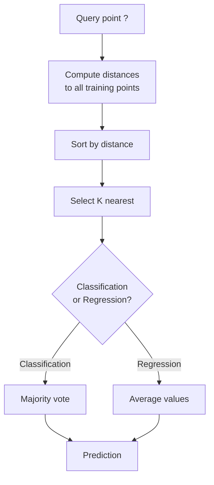
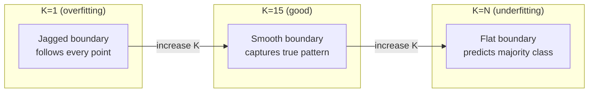
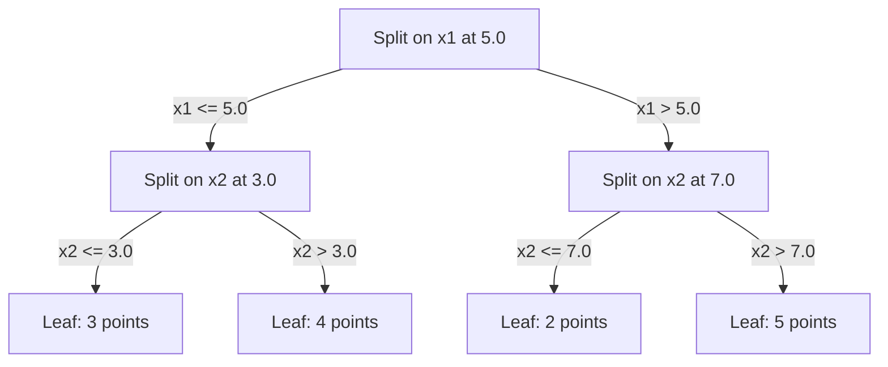

# K-Nearest Neighbors (K近邻) 与距离度量

> 存储所有数据。预测时看看你的邻居。这是最简单却真正有效的算法。

**Type:** Build
**Language:** Python
**Prerequisites:** Phase 1 (Lesson 14 Norms and Distances)
**Time:** ~90 minutes

## 学习目标

- 从零实现 KNN (K-Nearest Neighbors, K近邻) 分类与回归，支持可配置的 K 值和距离加权投票
- 比较 L1、L2、cosine distance (余弦距离) 和 Minkowski distance (闵可夫斯基距离)，并为给定数据类型选择合适度量
- 解释 curse of dimensionality (维度灾难) 并演示 KNN 为何在高维空间中退化
- 构建 KD-tree (KD树) 实现高效最近邻搜索，并分析其何时优于暴力搜索

## 问题背景

你有一个数据集。一个新的数据点到来，你需要对其进行分类或预测其值。与从数据中学习参数不同（如线性回归或 SVM），你只需找到训练集中离新点最近的 K 个点，然后让它们投票。

这就是 K-nearest neighbors (K近邻)。没有训练阶段，没有参数需要学习，没有 loss function (损失函数) 需要最小化。你存储整个训练集，在预测时计算距离。

它听起来简单到不可能有效。但 KNN 在许多问题上 surprisingly competitive，尤其是中小规模数据集。深入理解它能揭示核心概念：distance metric (距离度量) 的选择（关联 Phase 1 Lesson 14）、curse of dimensionality (维度灾难)，以及 lazy learning (惰性学习) 与 eager learning (急切学习) 的区别。

KNN 在现代 AI 中无处不在，只是换了名字。向量数据库在 embedding (嵌入) 上做 KNN 搜索；retrieval-augmented generation (RAG, 检索增强生成) 寻找 K 个最近的文档块；推荐系统寻找相似用户或物品。算法相同，规模和数据结构不同。

## 核心概念

### KNN 如何工作

给定一个带标签的点集和一个新的 query point (查询点)：

1. 计算 query 到数据集中每个点的距离
2. 按距离排序
3. 取 K 个最近的点
4. 分类任务：在 K 个邻居中做 majority vote (多数投票)
5. 回归任务：取 K 个邻居目标值的平均（或加权平均）



这就是整个算法。没有拟合，没有 gradient descent (梯度下降)，没有 epoch (轮次)。

### 选择 K

K 是唯一的 hyperparameter (超参数)。它控制 bias-variance trade-off (偏差-方差权衡)：

| K | 行为 |
|---|------|
| K = 1 | 决策边界跟随每个点。训练误差为零。高方差。Overfitting (过拟合) |
| 小 K (3-5) | 对局部结构敏感。能捕捉复杂边界 |
| 大 K | 边界更平滑。对噪声更鲁棒。可能 underfit (欠拟合) |
| K = N | 对所有点预测多数类。最大偏差 |

常见起点是 K = sqrt(N)，N 为数据集大小。二分类时使用奇数 K 以避免平局。



### 距离度量

Distance function (距离函数) 定义了"近"的含义。不同度量产生不同邻居、不同预测。

**L2 (Euclidean distance, 欧氏距离)** 是默认选择。直线距离。

```
d(a, b) = sqrt(sum((a_i - b_i)^2))
```

对 feature scale (特征缩放) 敏感。使用 L2 前务必标准化特征。

**L1 (Manhattan distance, 曼哈顿距离)** 累加绝对差值。比 L2 更鲁棒，因为它不平方差值。

```
d(a, b) = sum(|a_i - b_i|)
```

**Cosine distance (余弦距离)** 测量向量夹角，忽略模长。对文本和 embedding 数据至关重要。

```
d(a, b) = 1 - (a . b) / (||a|| * ||b||)
```

**Minkowski distance (闵可夫斯基距离)** 用参数 p 泛化 L1 和 L2。

```
d(a, b) = (sum(|a_i - b_i|^p))^(1/p)

p=1: Manhattan
p=2: Euclidean
p->inf: Chebyshev (max absolute difference)
```

选择哪种度量取决于数据：

| 数据类型 | 最佳度量 | 原因 |
|---------|---------|------|
| 数值特征，尺度相近 | L2 (Euclidean) | 默认，适用于空间数据 |
| 数值特征，有异常值 | L1 (Manhattan) | 鲁棒，不放大大的差值 |
| 文本 embedding | Cosine | 模长是噪声，方向才是语义 |
| 高维稀疏数据 | Cosine 或 L1 | L2 受 curse of dimensionality 影响 |
| 混合类型 | 自定义距离 | 按特征类型组合度量 |

### Weighted KNN (加权K近邻)

标准 KNN 给所有 K 个邻居相同权重。但距离 0.1 的邻居应该比距离 5.0 的更重要。

**Distance-weighted KNN (距离加权K近邻)** 按距离倒数加权：

```
weight_i = 1 / (distance_i + epsilon)

分类：加权投票
回归：加权平均 = sum(w_i * y_i) / sum(w_i)
```

Epsilon 防止 query 点与训练点完全匹配时除零。

Weighted KNN 对 K 的选择不那么敏感，因为远距离邻居的贡献本来就很小。

### Curse of dimensionality (维度灾难)

KNN 在高维下性能退化。这不是模糊担忧，而是数学事实。

**问题 1：距离收敛。** 随着维度增加，最大距离与最小距离的比值趋近于 1。所有点与 query 的"远近"变得相同。

```
在 d 维空间中，随机均匀点：

d=2:    max_dist / min_dist = varies widely
d=100:  max_dist / min_dist ~ 1.01
d=1000: max_dist / min_dist ~ 1.001

当所有距离几乎相等时，"最近"失去意义。
```

**问题 2：体积爆炸。** 要在固定数据比例内捕获 K 个邻居，搜索半径必须覆盖特征空间的绝大部分。高维下的"邻域"几乎覆盖整个空间。

**问题 3：角落主导。** 在 d 维单位超立方体中，大部分体积集中在角落而非中心。内切球体包含的体积比例随 d 增长趋近于零。

实际后果：KNN 在约 20-50 个特征以内表现良好。超出此范围，需要先进行 dimensionality reduction (降维，如 PCA、UMAP、t-SNE)，或使用能利用数据内在低维结构的树形搜索结构。

### KD-tree (KD树)：快速最近邻搜索

暴力 KNN 计算 query 到每个训练点的距离，每次查询 O(n * d)。大数据集下太慢。

KD-tree 沿特征轴递归划分空间。每层沿一个维度的中位数分割。



查找最近邻时，先遍历到包含 query 的叶子节点，然后回溯检查相邻分区，仅当它们可能包含更近的点时才检查。

平均查询时间：低维下 O(log n)。但 KD-tree 在高维（d > 20）退化为 O(n)，因为回溯时剪枝的分支越来越少。

### Ball tree (球树)：更适合中等维度

Ball tree 将数据划分为嵌套超球体而非轴对齐盒子。每个节点定义一个球（中心 + 半径），包含子树中所有点。

相比 KD-tree 的优势：
- 在中等维度（~50 维以内）表现更好
- 处理非轴对齐结构
- 更紧的包围体积意味着搜索时能剪枝更多分支

KD-tree 和 ball tree 都是精确算法。对于真正大规模搜索（数百万点、数百维），使用近似最近邻方法（HNSW、IVF、product quantization）。这些在 Phase 1 Lesson 14 中已涵盖。

### Lazy learning (惰性学习) vs eager learning (急切学习)

KNN 是 lazy learner (惰性学习器)：训练时不做任何工作，预测时做所有工作。大多数其他算法（线性回归、SVM、神经网络）是 eager learner (急切学习器)：训练时做大量计算构建紧凑模型，预测时很快。

| 方面 | Lazy (KNN) | Eager (SVM, 神经网络) |
|------|-----------|----------------------|
| 训练时间 | O(1)，仅存储数据 | O(n * epochs) |
| 预测时间 | 每次查询 O(n * d) | O(d) 或 O(参数数) |
| 预测时内存 | 存储整个训练集 | 仅存储模型参数 |
| 适应新数据 | 即时添加点 | 需要重新训练 |
| 决策边界 | 隐式，实时计算 | 显式，训练后固定 |

Lazy learning 适用于：
- 数据集频繁变化（无需重新训练即可增删点）
- 预测查询极少
- 零训练时间
- 数据集小到暴力搜索足够快

### KNN 回归

KNN 回归不做 majority vote (多数投票)，而是对 K 个邻居的目标值取平均。

```
prediction = (1/K) * sum(y_i for i in K nearest neighbors)

或带距离加权：
prediction = sum(w_i * y_i) / sum(w_i)
where w_i = 1 / distance_i
```

KNN 回归产生分段常数（或加权时分段平滑）预测。它无法外推到训练数据范围之外。如果训练目标都在 0-100 之间，KNN 永远不会预测 200。

## 动手实现

### Step 1：距离函数

实现 L1、L2、cosine 和 Minkowski 距离。这些直接关联 Phase 1 Lesson 14。

```python
import math

def l2_distance(a, b):
    return math.sqrt(sum((ai - bi) ** 2 for ai, bi in zip(a, b)))

def l1_distance(a, b):
    return sum(abs(ai - bi) for ai, bi in zip(a, b))

def cosine_distance(a, b):
    dot_val = sum(ai * bi for ai, bi in zip(a, b))
    norm_a = math.sqrt(sum(ai ** 2 for ai in a))
    norm_b = math.sqrt(sum(bi ** 2 for bi in b))
    if norm_a == 0 or norm_b == 0:
        return 1.0
    return 1.0 - dot_val / (norm_a * norm_b)

def minkowski_distance(a, b, p=2):
    if p == float('inf'):
        return max(abs(ai - bi) for ai, bi in zip(a, b))
    return sum(abs(ai - bi) ** p for ai, bi in zip(a, b)) ** (1 / p)
```

### Step 2：KNN 分类器与回归器

构建完整的 KNN，支持可配置 K、距离度量，以及可选的距离加权。

```python
class KNN:
    def __init__(self, k=5, distance_fn=l2_distance, weighted=False,
                 task="classification"):
        self.k = k
        self.distance_fn = distance_fn
        self.weighted = weighted
        self.task = task
        self.X_train = None
        self.y_train = None

    def fit(self, X, y):
        self.X_train = X
        self.y_train = y

    def predict(self, X):
        return [self._predict_one(x) for x in X]
```

### Step 3：KD-tree 高效搜索

从零构建 KD-tree，沿每维中位数递归分割。

```python
class KDTree:
    def __init__(self, X, indices=None, depth=0):
        # Recursively partition the data
        self.axis = depth % len(X[0])
        # Split on median of the current axis
        ...

    def query(self, point, k=1):
        # Traverse to leaf, then backtrack
        ...
```

完整实现及所有辅助方法和演示见 `code/knn.py`。

### Step 4：Feature scaling (特征缩放)

KNN 需要 feature scaling，因为距离对特征量级敏感。一个 0-1000 范围的特征会主导 0-1 范围的特征。

```python
def standardize(X):
    n = len(X)
    d = len(X[0])
    means = [sum(X[i][j] for i in range(n)) / n for j in range(d)]
    stds = [
        max(1e-10, (sum((X[i][j] - means[j]) ** 2 for i in range(n)) / n) ** 0.5)
        for j in range(d)
    ]
    return [[((X[i][j] - means[j]) / stds[j]) for j in range(d)] for i in range(n)], means, stds
```

## 使用现成工具

使用 scikit-learn：

```python
from sklearn.neighbors import KNeighborsClassifier
from sklearn.preprocessing import StandardScaler
from sklearn.pipeline import Pipeline

clf = Pipeline([
    ("scaler", StandardScaler()),
    ("knn", KNeighborsClassifier(n_neighbors=5, metric="euclidean")),
])
clf.fit(X_train, y_train)
print(f"Accuracy: {clf.score(X_test, y_test):.4f}")
```

Scikit-learn 在数据集足够大且维度足够低时自动使用 KD-tree 或 ball tree。高维数据回退到暴力搜索。可通过 `algorithm` 参数控制。

大规模最近邻搜索（百万级向量）使用 FAISS、Annoy 或向量数据库：

```python
import faiss

index = faiss.IndexFlatL2(dimension)
index.add(embeddings)
distances, indices = index.search(query_vectors, k=5)
```

## 练习

1. 在 3 类 2D 数据集上实现 KNN 分类。绘制 K=1、K=5、K=15 和 K=N 的决策边界。观察从 overfitting 到 underfitting 的过渡。

2. 在 2、5、10、50、100、500 维生成 1000 个随机点。对每个维度计算最大成对距离与最小成对距离的比值。绘制比值随维度变化图，可视化 curse of dimensionality。

3. 在文本分类问题（使用 TF-IDF 向量）上比较 L1、L2 和 cosine distance 的 KNN 效果。哪种度量准确率最高？为什么 cosine 通常在文本上胜出？

4. 实现 KD-tree 并测量查询时间 vs 暴力搜索，数据集为 1k、10k、100k 个点，维度 2D、10D、50D。KD-tree 在多少维时不再比暴力搜索快？

5. 为 y = sin(x) + noise 构建 weighted KNN 回归器。与 unweighted KNN 比较 K=3、10、30。证明加权在大 K 时产生更平滑预测。

## 关键术语

| 术语 | 实际含义 |
|------|---------|
| K-nearest neighbors (K近邻) | 非参数算法，通过寻找 query 最近的 K 个训练点来预测 |
| Lazy learning (惰性学习) | 训练时不计算，预测时做所有工作。KNN 是典型例子 |
| Eager learning (急切学习) | 训练时做大量计算构建紧凑模型。大多数 ML 算法属于此类 |
| Curse of dimensionality (维度灾难) | 高维下距离收敛，邻域扩展到覆盖大部分空间，使 KNN 失效 |
| KD-tree (KD树) | 沿特征轴递归划分空间的二叉树。低维下查询 O(log n) |
| Ball tree (球树) | 嵌套超球体树。在中等维度（~50 维）比 KD-tree 更好 |
| Weighted KNN (加权K近邻) | 邻居按距离倒数加权。更近邻居对预测影响更大 |
| Feature scaling (特征缩放) | 将特征归一化到可比范围。对 KNN 等基于距离的方法必需 |
| Majority vote (多数投票) | 统计 K 个邻居中最常见的类别进行分类 |
| Brute force search (暴力搜索) | 计算到每个训练点的距离。每次查询 O(n*d)。精确但大数据集慢 |
| Approximate nearest neighbor (近似最近邻) | HNSW、LSH、IVF 等算法，比精确搜索快得多 |
| Voronoi diagram (维诺图) | 空间划分，每个区域包含离某一训练点最近的所有点。K=1 KNN 产生 Voronoi 边界 |

## 延伸阅读

- [Cover & Hart: Nearest Neighbor Pattern Classification (1967)](https://ieeexplore.ieee.org/document/1053964) - 奠基性 KNN 论文，证明其错误率最多为贝叶斯最优的两倍
- [Friedman, Bentley, Finkel: An Algorithm for Finding Best Matches in Logarithmic Expected Time (1977)](https://dl.acm.org/doi/10.1145/355744.355745) - 原始 KD-tree 论文
- [Beyer et al.: When Is "Nearest Neighbor" Meaningful? (1999)](https://link.springer.com/chapter/10.1007/3-540-49257-7_15) - curse of dimensionality 对最近邻的形式化分析
- [scikit-learn Nearest Neighbors documentation](https://scikit-learn.org/stable/modules/neighbors.html) - 算法选择的实用指南
- [FAISS: A Library for Efficient Similarity Search](https://github.com/facebookresearch/faiss) - Meta 的十亿级近似最近邻搜索库
