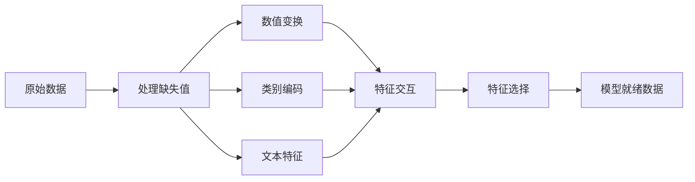

# 特征工程与特征选择 (Feature Engineering & Selection)

> 一个好的特征胜过一千个数据点。

**类型：** 构建 (Build)
**语言：** Python
**前置知识：** 阶段 1（机器学习统计学、线性代数），阶段 2 第 1-7 课
**时间：** 约 90 分钟

## 学习目标

- 实现数值变换（standardization (标准化)、min-max scaling (最小最大缩放)、log transform (对数变换)、binning (分箱)），并解释每种方法的适用场景
- 为类别特征构建 one-hot encoding (独热编码)、label encoding (标签编码) 和 target encoding (目标编码)，并识别 target encoding 中的 data leakage (数据泄漏) 风险
- 从零构建 TF-IDF 向量化器，并解释其在文本分类中优于原始词频计数的原因
- 应用基于过滤器的特征选择方法（variance threshold (方差阈值)、correlation (相关性)、mutual information (互信息)）来降低维度

## 问题所在

你有一个数据集，你选择了一个算法，训练后结果平平。你换了一个更复杂的算法，仍然平平。你花了一周时间调参，提升微乎其微。

然后有人将原始数据转换成了更好的特征，一个简单的逻辑回归就击败了你精心调优的梯度提升集成模型。

这种情况屡见不鲜。在传统机器学习中，数据的表示方式比算法的选择更重要。一个包含 "建筑面积" 和 "卧室数量" 的房价模型，无论学习者多么复杂，总会优于使用 "原始字符串形式的地址" 的模型。算法只能基于你给它的信息工作。

特征工程 (feature engineering) 是将原始数据转换为更易于模型发现模式的表示形式的过程。特征选择 (feature selection) 是丢弃那些增加噪声而非信号的冗余特征的过程。两者结合，是传统机器学习中最具杠杆效应的活动。

## 核心概念

### 特征管道 (Feature Pipeline)



### 数值特征 (Numerical Features)

原始数值很少能直接用于建模。常见的变换包括：

**缩放 (Scaling):** 将特征缩放到相同范围，使基于距离的算法（K-Means、KNN、SVM）平等对待所有特征。Min-max scaling (最小最大缩放) 映射到 [0, 1]。Standardization (标准化，z-score) 映射到均值=0，标准差=1。

**Log transform (对数变换):** 压缩右偏分布（如收入、人口、词频计数）。将乘法关系转换为加法关系。

**Binning (分箱):** 将连续值转换为类别。当特征与目标之间的关系是非线性但呈阶梯状时非常有用（例如年龄分组）。

**Polynomial features (多项式特征):** 创建 x^2、x^3、x1*x2 等项。让线性模型能够捕捉非线性关系，代价是特征数量增加。

### 类别特征 (Categorical Features)

模型需要数字，类别需要编码。

**One-hot encoding (独热编码):** 为每个类别创建一个二进制列。"color = red/blue/green" 变成三列：is_red、is_blue、is_green。适用于低基数特征，但类别过多时会爆炸式增长。

**Label encoding (标签编码):** 将每个类别映射为一个整数：red=0、blue=1、green=2。引入了虚假的顺序关系（模型可能认为 green > blue > red）。仅适用于基于树的模型，因为它们按单个值进行分裂。

**Target encoding (目标编码):** 用该类别的目标变量均值替换每个类别。强大但危险：data leakage (数据泄漏) 风险高。必须仅在训练数据上计算，然后应用于测试数据。

### 文本特征 (Text Features)

**Count vectorizer (计数向量化器):** 统计每个词在文档中出现的次数。"the cat sat on the mat" 变为 {the: 2, cat: 1, sat: 1, on: 1, mat: 1}。

**TF-IDF:** Term Frequency-Inverse Document Frequency（词频-逆文档频率）。根据词在文档间的独特性进行加权。像 "the" 这样的常见词权重低，罕见、有区分度的词权重高。

```
TF(word, doc) = count(word in doc) / total words in doc
IDF(word) = log(total docs / docs containing word)
TF-IDF = TF * IDF
```

### 缺失值 (Missing Values)

真实数据总有缺失。处理策略：

- **删除行：** 仅在缺失数据很少且随机缺失时适用
- **均值/中位数插补 (Mean/median imputation):** 简单，保持分布形状（中位数对异常值更稳健）
- **众数插补 (Mode imputation):** 用于类别特征
- **指示列 (Indicator column):** 在插补前添加一个二进制列 "was_this_missing"。数据缺失这个事实本身可能包含有用信息
- **前向/后向填充：** 用于时间序列数据

### 特征交互 (Feature Interaction)

有时关系存在于组合之中。单独看 "身高" 和 "体重" 的预测力，不如 "BMI = weight / height^2"。特征交互会成倍增加特征空间，因此需要利用领域知识来选择合适的交互项。

### 特征选择 (Feature Selection)

更多特征并不总是更好。无关特征会增加噪声、延长训练时间，并可能导致过拟合。

**过滤法 (Filter methods，建模前):**
- Correlation (相关性): 移除彼此之间高度相关的特征（冗余）
- Mutual information (互信息): 衡量知道某个特征后，对目标变量不确定性的减少程度
- Variance threshold (方差阈值): 移除几乎不变的特征

**包装法 (Wrapper methods，基于模型):**
- L1 正则化 (Lasso): 将无关特征的权重精确压缩到零
- 递归特征消除 (Recursive feature elimination): 训练模型，移除最不重要的特征，重复此过程

**为什么特征选择很重要：** 一个拥有 10 个好特征的模型通常优于一个拥有 10 个好特征加 90 个噪声特征的模型。噪声特征给模型提供了在训练数据上过拟合那些无法泛化的模式的机会。

## 动手构建

### 步骤 1：从零实现数值变换

```python
import math


def min_max_scale(values):
    min_val = min(values)
    max_val = max(values)
    if max_val == min_val:
        return [0.0] * len(values)
    return [(v - min_val) / (max_val - min_val) for v in values]


def standardize(values):
    n = len(values)
    mean = sum(values) / n
    variance = sum((v - mean) ** 2 for v in values) / n
    std = math.sqrt(variance) if variance > 0 else 1.0
    return [(v - mean) / std for v in values]


def log_transform(values):
    return [math.log(v + 1) for v in values]


def bin_values(values, n_bins=5):
    min_val = min(values)
    max_val = max(values)
    bin_width = (max_val - min_val) / n_bins
    if bin_width == 0:
        return [0] * len(values)
    result = []
    for v in values:
        bin_idx = int((v - min_val) / bin_width)
        bin_idx = min(bin_idx, n_bins - 1)
        result.append(bin_idx)
    return result


def polynomial_features(row, degree=2):
    n = len(row)
    result = list(row)
    if degree >= 2:
        for i in range(n):
            result.append(row[i] ** 2)
        for i in range(n):
            for j in range(i + 1, n):
                result.append(row[i] * row[j])
    return result
```

### 步骤 2：从零实现类别编码

```python
def one_hot_encode(values):
    categories = sorted(set(values))
    cat_to_idx = {cat: i for i, cat in enumerate(categories)}
    n_cats = len(categories)

    encoded = []
    for v in values:
        row = [0] * n_cats
        row[cat_to_idx[v]] = 1
        encoded.append(row)

    return encoded, categories


def label_encode(values):
    categories = sorted(set(values))
    cat_to_int = {cat: i for i, cat in enumerate(categories)}
    return [cat_to_int[v] for v in values], cat_to_int


def target_encode(feature_values, target_values, smoothing=10):
    global_mean = sum(target_values) / len(target_values)

    category_stats = {}
    for feat, target in zip(feature_values, target_values):
        if feat not in category_stats:
            category_stats[feat] = {"sum": 0.0, "count": 0}
        category_stats[feat]["sum"] += target
        category_stats[feat]["count"] += 1

    encoding = {}
    for cat, stats in category_stats.items():
        cat_mean = stats["sum"] / stats["count"]
        weight = stats["count"] / (stats["count"] + smoothing)
        encoding[cat] = weight * cat_mean + (1 - weight) * global_mean

    return [encoding[v] for v in feature_values], encoding
```

### 步骤 3：从零实现文本特征

```python
def count_vectorize(documents):
    vocab = {}
    idx = 0
    for doc in documents:
        for word in doc.lower().split():
            if word not in vocab:
                vocab[word] = idx
                idx += 1

    vectors = []
    for doc in documents:
        vec = [0] * len(vocab)
        for word in doc.lower().split():
            vec[vocab[word]] += 1
        vectors.append(vec)

    return vectors, vocab


def tfidf(documents):
    n_docs = len(documents)

    vocab = {}
    idx = 0
    for doc in documents:
        for word in doc.lower().split():
            if word not in vocab:
                vocab[word] = idx
                idx += 1

    doc_freq = {}
    for doc in documents:
        seen = set()
        for word in doc.lower().split():
            if word not in seen:
                doc_freq[word] = doc_freq.get(word, 0) + 1
                seen.add(word)

    vectors = []
    for doc in documents:
        words = doc.lower().split()
        word_count = len(words)
        tf_map = {}
        for word in words:
            tf_map[word] = tf_map.get(word, 0) + 1

        vec = [0.0] * len(vocab)
        for word, count in tf_map.items():
            tf = count / word_count
            idf = math.log(n_docs / doc_freq[word])
            vec[vocab[word]] = tf * idf
        vectors.append(vec)

    return vectors, vocab
```

### 步骤 4：从零实现缺失值插补 (Imputation)

```python
def impute_mean(values):
    present = [v for v in values if v is not None]
    if not present:
        return [0.0] * len(values), 0.0
    mean = sum(present) / len(present)
    return [v if v is not None else mean for v in values], mean


def impute_median(values):
    present = sorted(v for v in values if v is not None)
    if not present:
        return [0.0] * len(values), 0.0
    n = len(present)
    if n % 2 == 0:
        median = (present[n // 2 - 1] + present[n // 2]) / 2
    else:
        median = present[n // 2]
    return [v if v is not None else median for v in values], median


def impute_mode(values):
    present = [v for v in values if v is not None]
    if not present:
        return values, None
    counts = {}
    for v in present:
        counts[v] = counts.get(v, 0) + 1
    mode = max(counts, key=counts.get)
    return [v if v is not None else mode for v in values], mode


def add_missing_indicator(values):
    return [0 if v is not None else 1 for v in values]
```

### 步骤 5：从零实现特征选择 (Feature Selection)

```python
def correlation(x, y):
    n = len(x)
    mean_x = sum(x) / n
    mean_y = sum(y) / n
    cov = sum((xi - mean_x) * (yi - mean_y) for xi, yi in zip(x, y)) / n
    std_x = math.sqrt(sum((xi - mean_x) ** 2 for xi in x) / n)
    std_y = math.sqrt(sum((yi - mean_y) ** 2 for yi in y) / n)
    if std_x == 0 or std_y == 0:
        return 0.0
    return cov / (std_x * std_y)


def mutual_information(feature, target, n_bins=10):
    feat_min = min(feature)
    feat_max = max(feature)
    bin_width = (feat_max - feat_min) / n_bins if feat_max != feat_min else 1.0
    feat_binned = [
        min(int((f - feat_min) / bin_width), n_bins - 1) for f in feature
    ]

    n = len(feature)
    target_classes = sorted(set(target))

    feat_bins = sorted(set(feat_binned))
    p_feat = {}
    for b in feat_bins:
        p_feat[b] = feat_binned.count(b) / n

    p_target = {}
    for t in target_classes:
        p_target[t] = target.count(t) / n

    mi = 0.0
    for b in feat_bins:
        for t in target_classes:
            joint_count = sum(
                1 for fb, tv in zip(feat_binned, target) if fb == b and tv == t
            )
            p_joint = joint_count / n
            if p_joint > 0:
                mi += p_joint * math.log(p_joint / (p_feat[b] * p_target[t]))

    return mi


def variance_threshold(features, threshold=0.01):
    n_features = len(features[0])
    n_samples = len(features)
    selected = []

    for j in range(n_features):
        col = [features[i][j] for i in range(n_samples)]
        mean = sum(col) / n_samples
        var = sum((v - mean) ** 2 for v in col) / n_samples
        if var >= threshold:
            selected.append(j)

    return selected


def remove_correlated(features, threshold=0.9):
    n_features = len(features[0])
    n_samples = len(features)

    to_remove = set()
    for i in range(n_features):
        if i in to_remove:
            continue
        col_i = [features[r][i] for r in range(n_samples)]
        for j in range(i + 1, n_features):
            if j in to_remove:
                continue
            col_j = [features[r][j] for r in range(n_samples)]
            corr = abs(correlation(col_i, col_j))
            if corr >= threshold:
                to_remove.add(j)

    return [i for i in range(n_features) if i not in to_remove]
```

### 步骤 6：完整管道与演示

```python
import random


def make_housing_data(n=200, seed=42):
    random.seed(seed)
    data = []
    for _ in range(n):
        sqft = random.uniform(500, 5000)
        bedrooms = random.choice([1, 2, 3, 4, 5])
        age = random.uniform(0, 50)
        neighborhood = random.choice(["downtown", "suburbs", "rural"])
        has_pool = random.choice([True, False])

        sqft_with_missing = sqft if random.random() > 0.05 else None
        age_with_missing = age if random.random() > 0.08 else None

        price = (
            50 * sqft
            + 20000 * bedrooms
            - 1000 * age
            + (50000 if neighborhood == "downtown" else 10000 if neighborhood == "suburbs" else 0)
            + (15000 if has_pool else 0)
            + random.gauss(0, 20000)
        )

        data.append({
            "sqft": sqft_with_missing,
            "bedrooms": bedrooms,
            "age": age_with_missing,
            "neighborhood": neighborhood,
            "has_pool": has_pool,
            "price": price,
        })
    return data


if __name__ == "__main__":
    data = make_housing_data(200)

    print("=== 原始数据样本 ===")
    for row in data[:3]:
        print(f"  {row}")

    sqft_raw = [d["sqft"] for d in data]
    age_raw = [d["age"] for d in data]
    prices = [d["price"] for d in data]

    print("\n=== 缺失值处理 ===")
    sqft_missing = sum(1 for v in sqft_raw if v is None)
    age_missing = sum(1 for v in age_raw if v is None)
    print(f"  sqft 缺失: {sqft_missing}/{len(sqft_raw)}")
    print(f"  age 缺失: {age_missing}/{len(age_raw)}")

    sqft_indicator = add_missing_indicator(sqft_raw)
    age_indicator = add_missing_indicator(age_raw)
    sqft_imputed, sqft_fill = impute_median(sqft_raw)
    age_imputed, age_fill = impute_mean(age_raw)
    print(f"  sqft 用中位数填充: {sqft_fill:.0f}")
    print(f"  age 用均值填充: {age_fill:.1f}")

    print("\n=== 数值变换 ===")
    sqft_scaled = standardize(sqft_imputed)
    age_scaled = min_max_scale(age_imputed)
    sqft_log = log_transform(sqft_imputed)
    age_binned = bin_values(age_imputed, n_bins=5)
    print(f"  sqft 标准化: mean={sum(sqft_scaled)/len(sqft_scaled):.4f}, std={math.sqrt(sum(v**2 for v in sqft_scaled)/len(sqft_scaled)):.4f}")
    print(f"  age 最小最大缩放: [{min(age_scaled):.2f}, {max(age_scaled):.2f}]")
    print(f"  age 分箱: {sorted(set(age_binned))}")

    print("\n=== 类别编码 ===")
    neighborhoods = [d["neighborhood"] for d in data]

    ohe, ohe_cats = one_hot_encode(neighborhoods)
    print(f"  独热编码类别: {ohe_cats}")
    print(f"  样本编码: {neighborhoods[0]} -> {ohe[0]}")

    le, le_map = label_encode(neighborhoods)
    print(f"  标签编码映射: {le_map}")

    te, te_map = target_encode(neighborhoods, prices, smoothing=10)
    print(f"  目标编码: {({k: round(v) for k, v in te_map.items()})}")

    print("\n=== 文本特征 ===")
    descriptions = [
        "large modern house with pool",
        "small cozy cottage near downtown",
        "spacious family home with large yard",
        "modern apartment downtown with view",
        "rustic cabin in rural area",
    ]
    cv, cv_vocab = count_vectorize(descriptions)
    print(f"  词汇表大小: {len(cv_vocab)}")
    print(f"  文档 0 非零特征数: {sum(1 for v in cv[0] if v > 0)}")

    tf, tf_vocab = tfidf(descriptions)
    print(f"  TF-IDF 词汇表大小: {len(tf_vocab)}")
    top_words = sorted(tf_vocab.keys(), key=lambda w: tf[0][tf_vocab[w]], reverse=True)[:3]
    print(f"  文档 0  top TF-IDF 词: {top_words}")

    print("\n=== 多项式特征 ===")
    sample_row = [sqft_scaled[0], age_scaled[0]]
    poly = polynomial_features(sample_row, degree=2)
    print(f"  输入: {[round(v, 4) for v in sample_row]}")
    print(f"  多项式: {[round(v, 4) for v in poly]}")
    print(f"  特征: [x1, x2, x1^2, x2^2, x1*x2]")

    print("\n=== 特征选择 ===")
    feature_matrix = [
        [sqft_scaled[i], age_scaled[i], float(sqft_indicator[i]), float(age_indicator[i])]
        + ohe[i]
        for i in range(len(data))
    ]

    print(f"  总特征数: {len(feature_matrix[0])}")

    surviving_var = variance_threshold(feature_matrix, threshold=0.01)
    print(f"  方差阈值 (0.01) 后: 保留 {len(surviving_var)} 个特征")

    surviving_corr = remove_correlated(feature_matrix, threshold=0.9)
    print(f"  相关性过滤 (0.9) 后: 保留 {len(surviving_corr)} 个特征")

    binary_prices = [1 if p > sum(prices) / len(prices) else 0 for p in prices]
    print("\n  与目标的互信息 (mutual information):")
    feature_names = ["sqft", "age", "sqft_missing", "age_missing"] + [f"neigh_{c}" for c in ohe_cats]
    for j in range(len(feature_matrix[0])):
        col = [feature_matrix[i][j] for i in range(len(feature_matrix))]
        mi = mutual_information(col, binary_prices, n_bins=10)
        print(f"    {feature_names[j]}: MI={mi:.4f}")

    print("\n  与 price 的相关性 (correlation):")
    for j in range(len(feature_matrix[0])):
        col = [feature_matrix[i][j] for i in range(len(feature_matrix))]
        corr = correlation(col, prices)
        print(f"    {feature_names[j]}: r={corr:.4f}")
```

## 实际应用

使用 scikit-learn 时，这些变换可以通过管道 (Pipeline) 进行组合：

```python
from sklearn.preprocessing import StandardScaler, OneHotEncoder, PolynomialFeatures
from sklearn.impute import SimpleImputer
from sklearn.feature_extraction.text import TfidfVectorizer
from sklearn.feature_selection import mutual_info_classif, VarianceThreshold
from sklearn.compose import ColumnTransformer
from sklearn.pipeline import Pipeline

numeric_pipe = Pipeline([
    ("imputer", SimpleImputer(strategy="median")),
    ("scaler", StandardScaler()),
])

categorical_pipe = Pipeline([
    ("encoder", OneHotEncoder(sparse_output=False)),
])

preprocessor = ColumnTransformer([
    ("num", numeric_pipe, ["sqft", "age"]),
    ("cat", categorical_pipe, ["neighborhood"]),
])
```

从零实现的版本展示了每个变换内部的具体计算过程。库版本增加了边界情况处理、稀疏矩阵支持和管道组合能力，但数学原理是相同的。

## 交付成果

本课产出：
- `outputs/prompt-feature-engineer.md` — 一个用于系统化地从原始数据中提取特征的指导提示词

## 练习

1. 在数值变换中添加 robust scaling（使用中位数和四分位距而非均值和标准差）。将其与 standard scaling (标准缩放) 在含有极端异常值的数据上进行比较。
2. 实现 leave-one-out target encoding（留一法目标编码）：对每一行，计算排除该行自身目标值后的目标均值。展示这如何比朴素的目标编码减少过拟合。
3. 构建一个自动化特征选择管道，结合 variance threshold (方差阈值)、correlation filtering (相关性过滤) 和 mutual information (互信息) 排序。将其应用于房价数据集，并比较使用全部特征与使用选中特征时简单线性回归的模型性能。

## 关键术语

| 术语 | 人们通常的说法 | 实际含义 |
|------|--------------|---------|
| Feature engineering (特征工程) | "创建新列" | 将原始数据转换为能让模型更容易发现模式的表示形式 |
| Standardization (标准化) | "让它正态化" | 减去均值并除以标准差，使特征均值为 0、标准差为 1 |
| One-hot encoding (独热编码) | "创建虚拟变量" | 为每个类别创建一个二进制列，每行恰好有一个列为 1 |
| Target encoding (目标编码) | "用答案来编码" | 用该类别的平均目标值替换每个类别，并通过平滑防止过拟合 |
| TF-IDF | "高级词频计数" | Term Frequency（词频）乘以 Inverse Document Frequency（逆文档频率）：根据词在语料库中的独特性进行加权 |
| Imputation (插补) | "填补空白" | 用估计值（均值、中位数、众数或模型预测值）替换缺失值 |
| Feature selection (特征选择) | "扔掉坏列" | 移除增加噪声或冗余的特征，仅保留对目标有信号的特征 |
| Mutual information (互信息) | "一件事能告诉你多少关于另一件事的信息" | 衡量观察变量 X 后，对变量 Y 的不确定性减少程度 |
| Data leakage (数据泄漏) | "不小心作弊了" | 在训练时使用了预测时无法获得的信息，导致结果虚高 |

## 延伸阅读

- [Feature Engineering and Selection (Max Kuhn & Kjell Johnson)](http://www.feat.engineering/) — 涵盖特征工程全貌的免费在线书籍
- [scikit-learn Preprocessing Guide](https://scikit-learn.org/stable/modules/preprocessing.html) — 所有标准变换的实用参考
- [Target Encoding Done Right (Micci-Barreca, 2001)](https://dl.acm.org/doi/10.1145/507533.507538) — 关于带平滑的目标编码的原始论文
