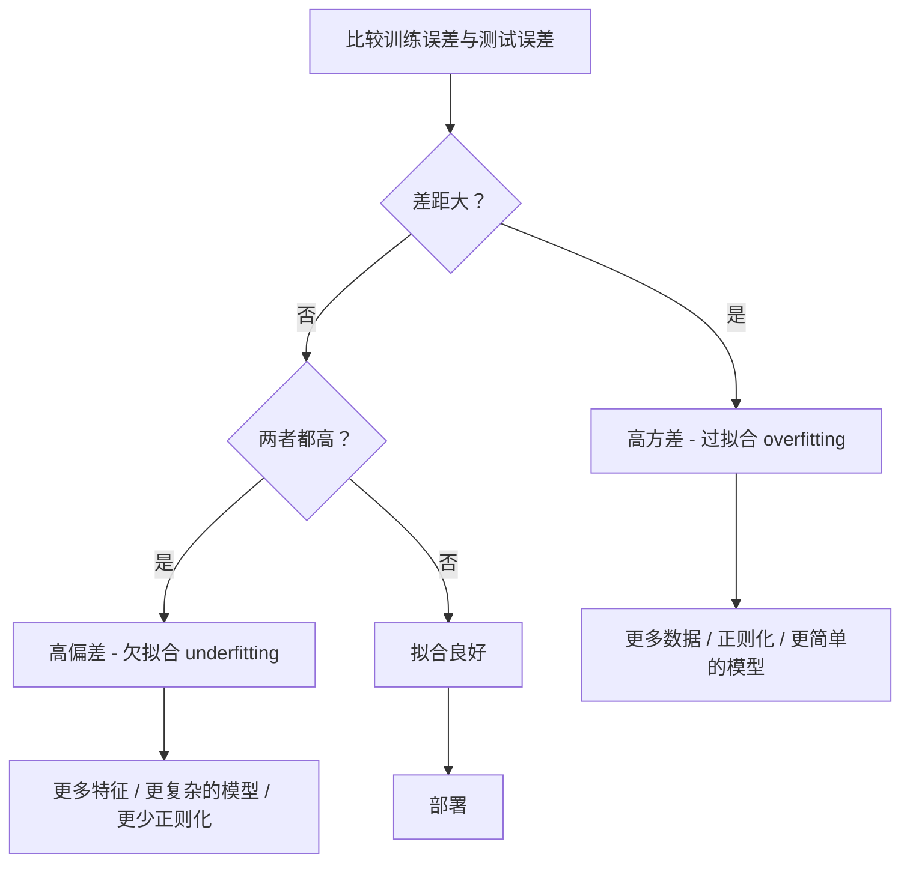

# 偏差-方差权衡 (Bias-Variance Tradeoff)

> 每个模型的误差都来自三个来源之一：偏差 (bias)、方差 (variance) 或噪声 (noise)。你只能控制前两个。

**类型：** 学习
**语言：** Python
**前置知识：** 第 2 阶段，第 01-09 课（机器学习基础、回归、分类、评估）
**时间：** 约 75 分钟

## 学习目标

- 推导期望预测误差的偏差-方差分解 (bias-variance decomposition)，并解释不可约误差 (irreducible error) 的作用
- 利用训练误差和测试误差的模式，诊断模型是存在高偏差 (high bias) 还是高方差 (high variance)
- 解释正则化 (regularization) 技术（L1、L2、随机失活 dropout、早停 early stopping）如何通过增加偏差来降低方差
- 实现实验，可视化不同复杂度模型的偏差-方差权衡 (bias-variance tradeoff)

## 问题所在

你训练了一个模型，它在测试数据上有一定的误差。这些误差来自哪里？

如果你的模型太简单（用线性回归拟合曲线数据集），它会持续错过真实模式。这就是**偏差 (bias)**。如果你的模型太复杂（用 20 次多项式拟合 15 个数据点），它会完美拟合训练数据，但在新数据上给出 wildly different 的预测。这就是**方差 (variance)**。

你无法同时最小化这两者（在固定模型容量下）。压低偏差，方差就会上升。压低方差，偏差就会上升。理解这种权衡是机器学习中最有用的诊断技能。它告诉你应该让模型更复杂还是更简单，应该获取更多数据还是设计更好的特征，应该增加还是减少正则化。

## 核心概念

### 偏差 (Bias)：系统性误差

偏差衡量模型平均预测值与真实值之间的差距。如果你在相同分布的许多不同训练集上训练同一模型并平均其预测，偏差就是该平均值与真实值之间的 gap。

高偏差意味着模型过于僵硬，无法捕捉真实模式。用直线拟合抛物线，无论你给多少数据，它都会错过曲线。这就是**欠拟合 (underfitting)**。

```
高偏差（欠拟合 underfitting）：
  模型总是预测大致相同的错误结果。
  训练误差：高
  测试误差：高
  两者差距：小
```

### 方差 (Variance)：对训练数据的敏感性

方差衡量当你在不同数据子集上训练时，预测结果的变化程度。如果训练集的微小变化导致模型大幅改变，方差就高。

高方差意味着模型在拟合训练数据中的噪声，而非底层信号。20 次多项式会穿过每个训练点，但在点之间剧烈震荡。这就是**过拟合 (overfitting)**。

```
高方差（过拟合 overfitting）：
  模型完美拟合训练数据，但在新数据上失败。
  训练误差：低
  测试误差：高
  两者差距：大
```

### 分解 (The Decomposition)

对于任意点 x，在平方损失下的期望预测误差可以精确分解为：

```
期望误差 = 偏差² + 方差 + 不可约噪声

其中：
  偏差²   = (E[f_hat(x)] - f(x))²
  方差    = E[(f_hat(x) - E[f_hat(x)])²]
  噪声    = E[(y - f(x))²]             (sigma²)
```

- `f(x)` 是真实函数
- `f_hat(x)` 是模型预测
- `E[...]` 是对不同训练集的期望
- `y` 是观测标签（真实函数加噪声）

噪声项是不可约的 (irreducible)。在有噪声的数据上，任何模型都无法优于 sigma²。你的任务是找到偏差²和方差之间的正确平衡。

### 模型复杂度 vs 误差


经典的 U 型曲线：

| 复杂度 | 偏差 | 方差 | 总误差 |
|-----------|------|----------|-------------|
| 过低 | 高 | 低 | 高（欠拟合 underfitting） |
| 刚好 | 中等 | 中等 | 最低 |
| 过高 | 低 | 高 | 高（过拟合 overfitting） |

### 正则化作为偏差-方差控制 (Regularization as Bias-Variance Control)

正则化 (regularization) 故意增加偏差以降低方差。它约束模型，使其无法追逐噪声。

- **L2（岭回归 Ridge regression）：** 将所有权重向零收缩。保留所有特征但降低其影响。
- **L1（Lasso）：** 将某些权重精确推至零。执行特征选择。
- **随机失活 (Dropout)：** 训练期间随机禁用神经元。强制冗余表示。
- **早停 (Early stopping)：** 在模型完全拟合训练数据之前停止训练。

正则化强度（lambda、随机失活率、训练轮数）直接控制你在偏差-方差曲线上的位置。更多正则化意味着更多偏差、更少方差。

### 双下降 (Double Descent)：现代视角

经典理论认为：过了最佳点后，更多复杂度总是有害的。但 2019 年以来的研究揭示了一个意外现象。如果你持续增加模型容量，远超插值阈值（模型有足够参数完美拟合训练数据），测试误差可能再次下降。


这种**双下降 (double descent)** 现象解释了为什么 massively overparameterized 的神经网络（参数远多于训练样本）仍然泛化良好。经典的偏差-方差权衡并没有错，但在现代 regime 下是不完整的。

关于双下降的关键观察：
- 它发生在线性模型、决策树和神经网络中
- 在插值区域，更多数据实际上可能有害（样本-wise 双下降）
- 更多训练轮数也可能导致（轮数-wise 双下降）
- 正则化会平滑峰值，但不会消除它

为什么会发生？在插值阈值处，模型刚好有足够容量拟合所有训练点。它被迫进入一个穿过每个点的非常特定的解，数据的微小扰动会导致拟合的巨大变化。这就是方差峰值的地方。超过阈值后，模型有许多可能完美拟合数据的解。学习算法（例如带隐式正则化的梯度下降）倾向于选择其中最简单的。这种对简单解的隐式偏差 (implicit bias) 就是过参数化模型泛化的原因。

| 区域 | 参数 vs 样本 | 行为 |
|--------|----------------------|----------|
| 欠参数化 | p << n | 经典权衡适用 |
| 插值阈值 | p ~ n | 方差峰值，测试误差飙升 |
| 过参数化 | p >> n | 隐式正则化生效，测试误差下降 |

实际建议：如果你使用神经网络或大型树集成，不要在插值阈值处停止。要么远低于它（使用显式正则化），要么远超它。最糟糕的位置就是阈值本身。

### 诊断你的模型



| 症状 | 诊断 | 修复 |
|---------|-----------|-----|
| 训练误差高，测试误差高 | 偏差 (bias) | 更多特征，更复杂的模型，更少正则化 |
| 训练误差低，测试误差高 | 方差 (variance) | 更多数据，正则化，更简单的模型，随机失活 (dropout) |
| 训练误差低，测试误差低 | 拟合良好 | 发布 |
| 训练误差下降，测试误差上升 | 过拟合进行中 | 早停 (early stopping) |

### 实用策略

**当偏差是问题时：**
- 添加多项式或交互特征
- 使用更灵活的模型（树集成代替线性模型）
- 降低正则化强度
- 训练更长时间（如果尚未收敛）

**当方差是问题时：**
- 获取更多训练数据
- 使用自助聚合 (bagging)（随机森林）
- 增加正则化（更高的 lambda，更多随机失活 dropout）
- 特征选择（移除噪声特征）
- 使用交叉验证及早发现

### 集成方法与方差降低

集成方法是降低方差最实用的工具。

**自助聚合 (Bagging / Bootstrap Aggregating)** 在不同自助样本 (bootstrap samples) 上训练多个模型，然后平均它们的预测。每个单独模型方差高，但平均后方差低得多。随机森林 (random forests) 就是应用于决策树的自助聚合 (bagging)。

数学原理：如果你平均 N 个独立预测，每个方差为 sigma²，平均的方差为 sigma² / N。模型并非真正独立（它们看到相似数据），所以降低幅度小于 1/N，但仍然显著。

**提升 (Boosting)** 通过顺序构建模型来降低偏差，每个新模型聚焦于集成到目前为止的误差。梯度提升 (gradient boosting) 和 AdaBoost 是主要例子。如果添加太多模型，提升可能过拟合，所以需要早停 (early stopping) 或正则化。

| 方法 | 主要效果 | 偏差变化 | 方差变化 |
|--------|---------------|-------------|-----------------|
| 自助聚合 (Bagging) | 降低方差 | 不变 | 降低 |
| 提升 (Boosting) | 降低偏差 | 降低 | 可能增加 |
| 堆叠 (Stacking) | 两者都降 | 取决于元学习器 | 取决于基模型 |
| 随机失活 (Dropout) | 隐式自助聚合 | 轻微增加 | 降低 |

**实用规则：** 如果你的基模型方差高（深树、高次多项式），使用自助聚合 (bagging)。如果你的基模型偏差高（浅桩、简单线性模型），使用提升 (boosting)。

### 学习曲线 (Learning Curves)

学习曲线 (learning curves) 绘制训练误差和验证误差随训练集大小变化的曲线。它们是你最实用的诊断工具。与单次训练/测试比较不同，学习曲线展示模型的轨迹，并告诉你更多数据是否有帮助。


如何阅读：

| 场景 | 训练误差 | 验证误差 | 差距 | 含义 | 该怎么做 |
|----------|---------------|-----------------|-----|---------------|------------|
| 高偏差 (high bias) | 高 | 高 | 小 | 模型无法捕捉模式 | 更多特征，更复杂的模型，更少正则化 |
| 高方差 (high variance) | 低 | 高 | 大 | 模型记忆训练数据 | 更多数据，正则化，更简单的模型 |
| 拟合良好 | 中等 | 中等 | 小 | 模型泛化良好 | 发布 |
| 高方差，正在改善 | 低 | 随数据增加而降低 | 缩小 | 数据可以修复的方差问题 | 收集更多数据 |
| 高偏差，平坦 | 高 | 高且平坦 | 小且平坦 | 更多数据无用 | 改变模型架构 |

关键洞察：如果两条曲线都已平稳，差距小但误差都高，更多数据无用。你需要更好的模型。如果差距大且仍在缩小，更多数据会有帮助。

### 如何生成学习曲线 (Learning Curves)

有两种方法：

**方法 1：改变训练集大小，固定模型。** 保持模型和超参数不变。在越来越大的训练数据子集上训练。在每个大小处测量训练误差和验证误差。这是标准的学习曲线 (learning curve)。

**方法 2：改变模型复杂度，固定数据。** 保持数据不变。扫描复杂度参数（多项式次数、树深度、层数）。在每个复杂度处测量训练误差和验证误差。这是验证曲线 (validation curve)，直接展示偏差-方差权衡。

两种方法互补。第一种告诉你更多数据是否有帮助。第二种告诉你不同模型是否有帮助。在决定下一步之前，两者都运行。

```mermaid
flowchart TD
    A[模型表现不佳] --> B[生成学习曲线 (learning curve)]
    B --> C{训练与验证差距？}
    C -->|大差距，验证仍在下降| D[更多数据会有帮助]
    C -->|小差距，两者都高| E[更多数据无用]
    C -->|大差距，验证平坦| F[正则化或简化]
    E --> G[生成验证曲线 (validation curve)]
    G --> H[尝试更复杂的模型]
```

## 动手实现

`code/bias_variance.py` 中的代码运行完整的偏差-方差分解实验。以下是分步方法。

### 步骤 1：从已知函数生成合成数据

我们使用 `f(x) = sin(1.5x) + 0.5x` 加高斯噪声。知道真实函数让我们能计算精确的偏差和方差。

```python
def true_function(x):
    return np.sin(1.5 * x) + 0.5 * x

def generate_data(n_samples=30, noise_std=0.5, x_range=(-3, 3), seed=None):
    rng = np.random.RandomState(seed)
    x = rng.uniform(x_range[0], x_range[1], n_samples)
    y = true_function(x) + rng.normal(0, noise_std, n_samples)
    return x, y
```

### 步骤 2：自助采样与多项式拟合

对于每个多项式次数，我们抽取许多自助训练集，拟合多项式，并在固定测试网格上记录预测。这给出了每个测试点处的预测分布。

```python
def fit_polynomial(x_train, y_train, degree, lam=0.0):
    X = np.column_stack([x_train ** d for d in range(degree + 1)])
    if lam > 0:
        penalty = lam * np.eye(X.shape[1])
        penalty[0, 0] = 0
        w = np.linalg.solve(X.T @ X + penalty, X.T @ y_train)
    else:
        w = np.linalg.lstsq(X, y_train, rcond=None)[0]
    return w
```

我们在 200 个不同的自助样本上拟合。每个自助样本从相同底层分布抽取，但包含不同的点。

### 步骤 3：计算偏差²、方差分解

有了每个测试点处 200 组预测，我们可以直接从定义计算分解：

```python
mean_pred = predictions.mean(axis=0)
bias_sq = np.mean((mean_pred - y_true) ** 2)
variance = np.mean(predictions.var(axis=0))
total_error = np.mean(np.mean((predictions - y_true) ** 2, axis=1))
```

- `mean_pred` 是从自助样本估计的 E[f_hat(x)]
- `bias_sq` 是平均预测与真实值之间的平方差距
- `variance` 是自助样本间预测的平均散布
- `total_error` 应近似等于 bias² + variance + noise

### 步骤 4：学习曲线 (Learning Curves)

学习曲线 (learning curves) 扫描训练集大小，同时固定模型复杂度。它们展示你的模型是数据受限还是容量受限。

```python
def demo_learning_curves():
    sizes = [10, 15, 20, 30, 50, 75, 100, 150, 200, 300]
    degree = 5

    for n in sizes:
        train_errors = []
        test_errors = []
        for seed in range(50):
            x_train, y_train = generate_data(n_samples=n, seed=seed * 100)
            w = fit_polynomial(x_train, y_train, degree)
            train_pred = predict_polynomial(x_train, w)
            train_mse = np.mean((train_pred - y_train) ** 2)
            test_pred = predict_polynomial(x_test, w)
            test_mse = np.mean((test_pred - y_test) ** 2)
            train_errors.append(train_mse)
            test_errors.append(test_mse)
        # 多次运行的平均给出学习曲线点
```

对于高方差模型（小数据下的 5 次多项式），你会看到：
- 训练误差起始低，随更多数据使记忆变难而增加
- 测试误差起始高，随模型获得更多信号而降低
- 差距随更多数据而缩小

对于高偏差模型（1 次），两条曲线快速收敛到相同的高值，更多数据无帮助。

### 步骤 5：正则化扫描

代码还包含 `demo_regularization_sweep()`，它固定高次多项式（15 次）并扫描岭回归 (Ridge) 正则化强度从 0.001 到 100。这从另一个角度展示偏差-方差权衡：不是改变模型复杂度，而是改变约束强度。

```python
def demo_regularization_sweep():
    alphas = [0.001, 0.005, 0.01, 0.05, 0.1, 0.5, 1.0, 5.0, 10.0, 50.0, 100.0]
    for alpha in alphas:
        results = bias_variance_decomposition([15], lam=alpha)
        r = results[15]
        print(f"alpha={alpha:.3f}  bias={r['bias_sq']:.4f}  var={r['variance']:.4f}")
```

在低 alpha 处，15 次多项式几乎无约束。方差占主导，因为模型追逐每个自助样本中的噪声。在高 alpha 处，惩罚如此强，模型实际上变成近常数函数。偏差占主导。最优 alpha 位于这两个极端之间。

这与改变多项式次数的 U 型曲线相同，但由连续旋钮而非离散旋钮控制。实践中，正则化是控制权衡的首选方式，因为它允许细粒度控制而无需改变特征集。

## 使用 sklearn

sklearn 提供 `learning_curve` 和 `validation_curve` 来自动化这些诊断，无需编写自助循环。

### 验证曲线：扫描模型复杂度

```python
from sklearn.model_selection import validation_curve
from sklearn.pipeline import make_pipeline
from sklearn.preprocessing import PolynomialFeatures
from sklearn.linear_model import Ridge

degrees = list(range(1, 16))
train_scores_all = []
val_scores_all = []

for d in degrees:
    pipe = make_pipeline(PolynomialFeatures(d), Ridge(alpha=0.01))
    train_scores, val_scores = validation_curve(
        pipe, X, y, param_name="polynomialfeatures__degree",
        param_range=[d], cv=5, scoring="neg_mean_squared_error"
    )
    train_scores_all.append(-train_scores.mean())
    val_scores_all.append(-val_scores.mean())
```

这直接给出偏差-方差权衡曲线。验证分数相对于训练分数最差的地方，方差占主导。两者都差的地方，偏差占主导。

### 学习曲线：扫描训练集大小

```python
from sklearn.model_selection import learning_curve

pipe = make_pipeline(PolynomialFeatures(5), Ridge(alpha=0.01))
train_sizes, train_scores, val_scores = learning_curve(
    pipe, X, y, train_sizes=np.linspace(0.1, 1.0, 10),
    cv=5, scoring="neg_mean_squared_error"
)
train_mse = -train_scores.mean(axis=1)
val_mse = -val_scores.mean(axis=1)
```

绘制 `train_mse` 和 `val_mse` 对 `train_sizes`。形状告诉你关于模型的一切。

### 带正则化扫描的交叉验证

```python
from sklearn.model_selection import cross_val_score

alphas = [0.001, 0.01, 0.1, 1.0, 10.0, 100.0]
for alpha in alphas:
    pipe = make_pipeline(PolynomialFeatures(10), Ridge(alpha=alpha))
    scores = cross_val_score(pipe, X, y, cv=5, scoring="neg_mean_squared_error")
    print(f"alpha={alpha:>7.3f}  MSE={-scores.mean():.4f} +/- {scores.std():.4f}")
```

这扫描固定模型复杂度下的正则化强度。你会看到相同的偏差-方差权衡：低 alpha 意味着高方差，高 alpha 意味着高偏差。

### 整合：完整诊断工作流

实践中，你按顺序运行这些诊断：

1. 训练模型。计算训练误差和测试误差。
2. 如果两者都高：你有偏差问题。跳到步骤 4。
3. 如果训练低但测试高：你有方差问题。生成学习曲线 (learning curve) 看更多数据是否有帮助。如果没有，正则化。
4. 生成验证曲线 (validation curve) 扫描主要复杂度参数。找到最佳点。
5. 在最佳点，生成学习曲线。如果差距仍然大，你需要更多数据或正则化。
6. 尝试不同 alpha 值的岭回归 (Ridge)/Lasso，使用 `cross_val_score`。选择交叉验证误差最低的 alpha。

这对大多数表格数据集只需 10-15 分钟计算，节省数小时的猜测。

## 交付物

本课产出：`outputs/prompt-model-diagnostics.md`

## 练习

1. 用 `noise_std=0`（无噪声）运行分解。不可约误差 (irreducible error) 项会发生什么？最优复杂度改变吗？

2. 将训练集大小从 30 增加到 300。这如何影响方差 (variance) 分量？最优多项式次数会移动吗？

3. 在实验中添加 L2 正则化（岭回归 Ridge regression）。对于固定高次多项式（15 次），扫描 lambda 从 0 到 100。绘制 bias² 和 variance 作为 lambda 的函数。

4. 将真实函数从多项式改为 `sin(x)`。偏差-方差分解如何变化？是否仍有明确的最优次数？

5. 实现一个简单的自助聚合 (bootstrap aggregating / bagging) 包装器：在自助样本上训练 10 个模型并平均预测。展示这能在不大幅增加偏差的情况下降低方差。

## 关键术语

| 术语 | 人们常说 | 实际含义 |
|------|----------------|----------------------|
| 偏差 (Bias) | "模型太简单" | 错误假设导致的系统性误差。平均模型预测与真实值之间的差距。 |
| 方差 (Variance) | "模型过拟合了" | 对训练数据敏感导致的误差。不同训练集间预测的变化程度。 |
| 不可约误差 (Irreducible error) | "数据有噪声" | 真实数据生成过程中随机性导致的误差。任何模型都无法消除。 |
| 欠拟合 (Underfitting) | "学得不够" | 模型偏差高。即使在训练数据上也错过真实模式。 |
| 过拟合 (Overfitting) | "在记忆数据" | 模型方差高。拟合训练数据中的噪声，无法泛化。 |
| 正则化 (Regularization) | "约束模型" | 添加惩罚以降低模型复杂度，用偏差换取更低方差。 |
| 双下降 (Double descent) | "更多参数可能有帮助" | 当模型容量远超插值阈值时，测试误差再次下降。 |
| 模型复杂度 (Model complexity) | "模型有多灵活" | 模型拟合任意模式的能力。由架构、特征或正则化控制。 |

## 延伸阅读

- [Hastie, Tibshirani, Friedman: Elements of Statistical Learning, Ch. 7](https://hastie.su.domains/ElemStatLearn/) -- 偏差-方差分解的权威论述
- [Belkin et al., Reconciling modern machine learning practice and the bias-variance trade-off (2019)](https://arxiv.org/abs/1812.11118) -- 双下降 (double descent) 论文
- [Nakkiran et al., Deep Double Descent (2019)](https://arxiv.org/abs/1912.02292) -- 轮数-wise 和样本-wise 双下降
- [Scott Fortmann-Roe: Understanding the Bias-Variance Tradeoff](http://scott.fortmann-roe.com/docs/BiasVariance.html) -- 清晰的视觉解释
