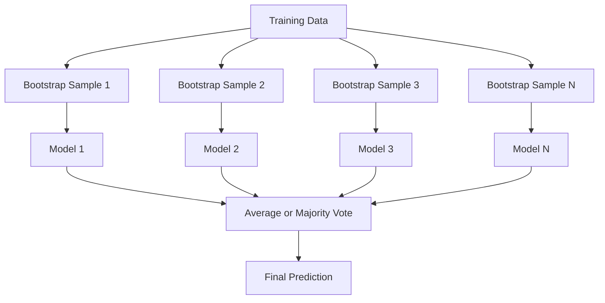
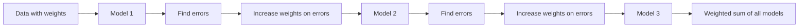
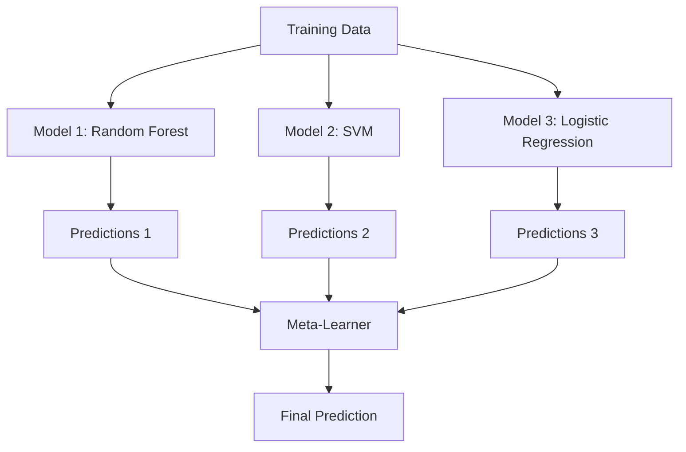

# Ensemble Methods (集成方法)

> 一群弱学习器，只要组合得当，就能成为强学习器。这不是比喻，而是定理。

**Type:** Build
**Language:** Python
**Prerequisites:** Phase 2, Lesson 10 (Bias-Variance Tradeoff, 偏差-方差权衡)
**Time:** ~120 minutes

## Learning Objectives (学习目标)

- 从零实现 AdaBoost 和 gradient boosting (梯度提升)，并解释 boosting 如何逐步降低 bias (偏差)
- 构建 bagging (自助聚合) 集成，并展示平均多个去相关模型如何在不增加 bias 的情况下降低 variance (方差)
- 比较 bagging、boosting 和 stacking (堆叠) 在各自针对哪种误差成分方面的差异
- 评估 ensemble diversity (集成多样性)，并解释为什么 majority voting (多数投票) 的准确率会随着更多独立弱学习器的加入而提高

## The Problem (问题)

单棵决策树训练快、易于解释，但容易 overfitting (过拟合)。单个线性模型在复杂边界上 underfitting (欠拟合)。你可以花数天时间去设计一个完美的模型架构，或者你可以把一堆不完美的模型组合起来，得到一个比任何一个单独模型都更好的结果。

Ensemble methods (集成方法) 正是这样做的。它们是赢得 Kaggle 表格数据竞赛最可靠的技术，驱动着大多数生产级 ML 系统，并且生动地展示了 bias-variance tradeoff (偏差-方差权衡) 的实际效果。Bagging 降低 variance。Boosting 降低 bias。Stacking 学习在哪些输入上信任哪些模型。

## The Concept (概念)

### Why Ensembles Work (为什么集成有效)

假设你有 N 个独立的分类器，每个准确率 p > 0.5。Majority vote (多数投票) 的准确率为：

```
P(majority correct) = sum over k > N/2 of C(N,k) * p^k * (1-p)^(N-k)
```

对于 21 个分类器，每个准确率 60%，majority vote 的准确率约为 74%。当分类器数量增加到 101 个时，准确率上升到 84%。当模型犯不同的错误时，错误会相互抵消。

关键要求是 **diversity (多样性)**。如果所有模型都犯同样的错误，组合它们没有任何帮助。集成之所以有效，是因为它们通过以下方式产生多样化的模型：

- 不同的训练子集 (bagging)
- 不同的特征子集 (random forests, 随机森林)
- 顺序错误修正 (boosting)
- 不同的模型家族 (stacking)

### Bagging (Bootstrap Aggregating, 自助聚合)

Bagging 通过在训练数据的不同 bootstrap sample (自助样本) 上训练每个模型来创造多样性。



Bootstrap sample 是从原始数据中有放回地抽取的，大小与原始数据相同。每个 bootstrap 中约有 63.2% 的唯一样本出现。剩余的 36.8% (out-of-bag samples, 袋外样本) 提供了一个免费的验证集。

Bagging 在不显著增加 bias 的情况下降低 variance。每棵树都对其 bootstrap sample 过拟合，但每棵树的过拟合方式不同，因此平均可以抵消噪声。

**Random forests (随机森林)** 是 bagging 的升级版：在每个分裂点，只考虑特征的随机子集。这迫使树之间更加多样化。分类问题中候选特征数通常为 `sqrt(n_features)`，回归问题中为 `n_features / 3`。

### Boosting (Sequential Error Correction, 顺序误差修正)

Boosting 按顺序训练模型。每个新模型都关注之前模型预测错误的样本。



Boosting 降低 bias。每个新模型修正当前集成中的系统性错误。最终预测是所有模型的加权和，表现更好的模型获得更高的权重。

权衡：如果运行太多轮，boosting 可能会 overfit，因为它不断拟合更难的样本，其中一些可能是噪声。

### AdaBoost

AdaBoost (Adaptive Boosting, 自适应提升) 是第一个实用的 boosting 算法。它可以与任何 base learner (基学习器) 配合使用，通常是 decision stumps (决策桩，深度为 1 的树)。

算法步骤：

```
1. 初始化样本权重: w_i = 1/N for all i

2. For t = 1 to T:
   a. 在加权数据上训练弱学习器 h_t
   b. 计算加权错误率:
      err_t = sum(w_i * I(h_t(x_i) != y_i)) / sum(w_i)
   c. 计算模型权重:
      alpha_t = 0.5 * ln((1 - err_t) / err_t)
   d. 更新样本权重:
      w_i = w_i * exp(-alpha_t * y_i * h_t(x_i))
   e. 归一化权重使其和为 1

3. 最终预测: H(x) = sign(sum(alpha_t * h_t(x)))
```

错误率较低的模型获得更高的 alpha。被错误分类的样本获得更高的权重，以便下一个模型关注它们。

### Gradient Boosting (梯度提升)

Gradient boosting 将 boosting 推广到任意 loss function (损失函数)。它不再重新加权样本，而是将每个新模型拟合到当前集成的 residuals (残差，即损失的负梯度)。

```
1. 初始化: F_0(x) = argmin_c sum(L(y_i, c))

2. For t = 1 to T:
   a. 计算伪残差:
      r_i = -dL(y_i, F_{t-1}(x_i)) / dF_{t-1}(x_i)
   b. 将树 h_t 拟合到残差 r_i
   c. 寻找最优步长:
      gamma_t = argmin_gamma sum(L(y_i, F_{t-1}(x_i) + gamma * h_t(x_i)))
   d. 更新:
      F_t(x) = F_{t-1}(x) + learning_rate * gamma_t * h_t(x)

3. 最终预测: F_T(x)
```

对于 squared error loss (平方误差损失)，伪残差就是实际的残差：`r_i = y_i - F_{t-1}(x_i)`。每棵树实际上拟合的是之前集成的误差。

Learning rate (学习率，也叫 shrinkage 收缩) 控制每棵树的贡献。较小的 learning rate 需要更多的树，但泛化效果更好。典型值：0.01 到 0.3。

### XGBoost: Why It Dominates Tabular Data (XGBoost：为什么它在表格数据上占主导地位)

XGBoost (eXtreme Gradient Boosting, 极端梯度提升) 是 gradient boosting 的工程优化版本，使其快速、准确且抗 overfitting：

- **Regularized objective (正则化目标):** 对叶节点权重施加 L1 和 L2 惩罚，防止单棵树过于自信
- **Second-order approximation (二阶近似):** 同时使用损失函数的一阶和二阶导数，给出更好的分裂决策
- **Sparsity-aware splits (稀疏感知分裂):** 通过在每个分裂点学习缺失数据的最佳方向，原生处理缺失值
- **Column subsampling (列子采样):** 像 random forests 一样，在每个分裂点采样特征以增加多样性
- **Weighted quantile sketch (加权分位数草图):** 在分布式数据上高效地寻找连续特征的分裂点
- **Cache-aware block structure (缓存感知块结构):** 针对 CPU 缓存行优化的内存布局

对于表格数据，XGBoost (及其继任者 LightGBM) 始终优于神经网络。这在短期内不会改变。如果你的数据是行列形式的表格，请从 gradient boosting 开始。

### Stacking (Meta-Learning, 元学习 / 堆叠)

Stacking 使用多个 base model (基模型) 的预测作为 meta-learner (元学习器) 的特征。



Meta-learner 学习在哪些输入上信任哪个 base model。如果 random forest 在某些区域表现更好，而 SVM 在其他区域表现更好，meta-learner 将学会相应地路由。

为避免数据泄漏，base model 的预测必须通过训练集上的 cross-validation (交叉验证) 生成。绝不能在相同数据上训练 base model 并生成 meta-features。

### Voting (投票)

最简单的集成。直接组合预测。

- **Hard voting (硬投票):** 对类别标签进行多数投票。
- **Soft voting (软投票):** 平均预测概率，选择平均概率最高的类别。通常更好，因为它利用了置信度信息。

## Build It (动手实现)

### Step 1: Decision Stump (Base Learner, 决策桩 / 基学习器)

`code/ensembles.py` 中的代码从零实现了所有内容。我们从 decision stump 开始：只有单个分裂的树。

```python
class DecisionStump:
    def __init__(self):
        self.feature_idx = None
        self.threshold = None
        self.polarity = 1
        self.alpha = None

    def fit(self, X, y, weights):
        n_samples, n_features = X.shape
        best_error = float("inf")

        for f in range(n_features):
            thresholds = np.unique(X[:, f])
            for thresh in thresholds:
                for polarity in [1, -1]:
                    pred = np.ones(n_samples)
                    pred[polarity * X[:, f] < polarity * thresh] = -1
                    error = np.sum(weights[pred != y])
                    if error < best_error:
                        best_error = error
                        self.feature_idx = f
                        self.threshold = thresh
                        self.polarity = polarity

    def predict(self, X):
        n = X.shape[0]
        pred = np.ones(n)
        idx = self.polarity * X[:, self.feature_idx] < self.polarity * self.threshold
        pred[idx] = -1
        return pred
```

### Step 2: AdaBoost from Scratch (从零实现 AdaBoost)

```python
class AdaBoostScratch:
    def __init__(self, n_estimators=50):
        self.n_estimators = n_estimators
        self.stumps = []
        self.alphas = []

    def fit(self, X, y):
        n = X.shape[0]
        weights = np.full(n, 1 / n)

        for _ in range(self.n_estimators):
            stump = DecisionStump()
            stump.fit(X, y, weights)
            pred = stump.predict(X)

            err = np.sum(weights[pred != y])
            err = np.clip(err, 1e-10, 1 - 1e-10)

            alpha = 0.5 * np.log((1 - err) / err)
            weights *= np.exp(-alpha * y * pred)
            weights /= weights.sum()

            stump.alpha = alpha
            self.stumps.append(stump)
            self.alphas.append(alpha)

    def predict(self, X):
        total = sum(a * s.predict(X) for a, s in zip(self.alphas, self.stumps))
        return np.sign(total)
```

### Step 3: Gradient Boosting from Scratch (从零实现梯度提升)

```python
class GradientBoostingScratch:
    def __init__(self, n_estimators=100, learning_rate=0.1, max_depth=3):
        self.n_estimators = n_estimators
        self.lr = learning_rate
        self.max_depth = max_depth
        self.trees = []
        self.initial_pred = None

    def fit(self, X, y):
        self.initial_pred = np.mean(y)
        current_pred = np.full(len(y), self.initial_pred)

        for _ in range(self.n_estimators):
            residuals = y - current_pred
            tree = SimpleRegressionTree(max_depth=self.max_depth)
            tree.fit(X, residuals)
            update = tree.predict(X)
            current_pred += self.lr * update
            self.trees.append(tree)

    def predict(self, X):
        pred = np.full(X.shape[0], self.initial_pred)
        for tree in self.trees:
            pred += self.lr * tree.predict(X)
        return pred
```

### Step 4: Compare against sklearn (与 sklearn 对比)

代码验证了我们从零实现的版本与 sklearn 的 `AdaBoostClassifier` 和 `GradientBoostingClassifier` 具有相似的准确率，并并排比较了所有方法。

## Use It (如何使用)

### When to Use Each Method (何时使用哪种方法)

| Method | Reduces | Best for | Watch out for |
|--------|---------|----------|---------------|
| Bagging / Random Forest | Variance | 噪声数据、特征很多 | 对 bias 没有帮助 |
| AdaBoost | Bias | 干净数据、简单基学习器 | 对异常值和噪声敏感 |
| Gradient Boosting | Bias | 表格数据、竞赛 | 训练慢，不调参容易 overfit |
| XGBoost / LightGBM | Both | 生产级表格 ML | 超参数很多 |
| Stacking | Both | 追求最后 1-2% 的准确率 | 复杂，meta-learner 有 overfit 风险 |
| Voting | Variance | 快速组合多样化模型 | 只有模型多样化时才有效 |

### The Production Stack for Tabular Data (表格数据的生产级技术栈)

对于大多数表格预测问题，建议按以下顺序尝试：

1. **LightGBM 或 XGBoost** 使用默认参数
2. 调优 n_estimators、learning_rate、max_depth、min_child_weight
3. 如果需要最后 0.5% 的提升，构建一个包含 3-5 个多样化模型的 stacking ensemble
4. 全程使用 cross-validation

神经网络在表格数据上几乎总是比 gradient boosting 差，尽管持续有相关研究尝试。TabNet、NODE 等架构偶尔能匹敌，但很少能击败调优良好的 XGBoost。

## Ship It (交付)

本课产出 `outputs/prompt-ensemble-selector.md` —— 一个帮助你为给定数据集选择合适集成方法的 prompt。描述你的数据（大小、特征类型、噪声水平、类别平衡）和要解决的问题。该 prompt 会引导你完成决策清单，推荐方法，建议初始超参数，并警告该方法常见的陷阱。同时产出 `outputs/skill-ensemble-builder.md`，包含完整的选型指南。

## Exercises (练习)

1. 修改 AdaBoost 实现，在每轮后跟踪训练准确率。绘制准确率 vs. 估计器数量的曲线。它何时收敛？

2. 从零实现 random forest：在回归树中添加随机特征子采样。用 `max_features=sqrt(n_features)` 训练 100 棵树并平均预测。与单棵树比较 variance reduction。

3. 在 gradient boosting 实现中添加 early stopping：每轮后跟踪验证损失，如果连续 10 轮没有改善则停止。实际上需要多少棵树？

4. 构建一个 stacking ensemble，包含三个基模型（logistic regression、decision tree、k-nearest neighbors）和一个 logistic regression meta-learner。使用 5-fold cross-validation 生成 meta-features。与每个基模型单独比较。

5. 在相同数据集上用默认参数运行 XGBoost。比较其准确率与你从零实现的 gradient boosting。计时两者。速度差距有多大？

## Key Terms (关键术语)

| Term | What people say | What it actually means |
|------|----------------|----------------------|
| Bagging | "Train on random subsets" | Bootstrap aggregating (自助聚合): 在 bootstrap samples 上训练模型，平均预测以降低 variance |
| Boosting | "Focus on hard examples" | 顺序训练模型，每个修正当前集成的错误，以降低 bias |
| AdaBoost | "Reweight the data" | 通过样本权重更新进行 boosting；被错误分类的样本在下个学习器中获得更高权重 |
| Gradient boosting | "Fit the residuals" | 通过将每个新模型拟合到损失函数的负梯度来进行 boosting |
| XGBoost | "The Kaggle weapon" | 带有 regularization (正则化)、二阶优化和系统级速度技巧的 gradient boosting |
| Stacking | "Models on top of models" | 使用基模型的预测作为 meta-learner 的输入特征 |
| Random forest | "Many randomized trees" | 用决策树做 bagging，在每个分裂点添加随机特征子采样以增加多样性 |
| Ensemble diversity | "Make different mistakes" | 模型在错误上必须不相关，集成才能优于单个模型 |
| Out-of-bag error | "Free validation" | 不在 bootstrap 抽取中的样本 (~36.8%) 可作为验证集，无需额外留出 |

## Further Reading (延伸阅读)

- [Schapire & Freund: Boosting: Foundations and Algorithms](https://mitpress.mit.edu/9780262526036/) —— AdaBoost 创造者撰写的著作
- [Friedman: Greedy Function Approximation: A Gradient Boosting Machine (2001)](https://statweb.stanford.edu/~jhf/ftp/trebst.pdf) —— gradient boosting 的原始论文
- [Chen & Guestrin: XGBoost (2016)](https://arxiv.org/abs/1603.02754) —— XGBoost 论文
- [Wolpert: Stacked Generalization (1992)](https://www.sciencedirect.com/science/article/abs/pii/S0893608005800231) —— stacking 的原始论文
- [scikit-learn Ensemble Methods](https://scikit-learn.org/stable/modules/ensemble.html) —— 实用参考
