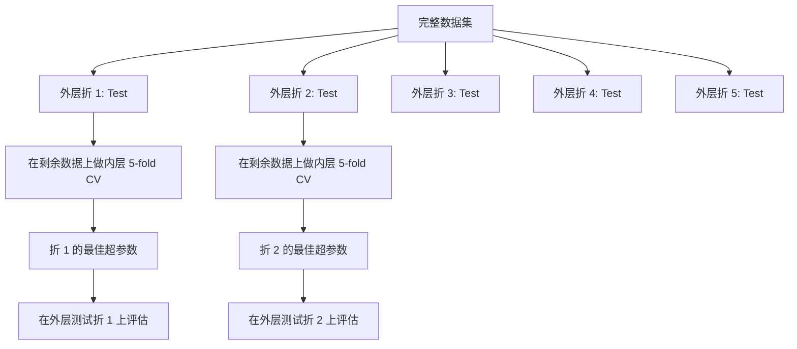

# 超参数调优 (Hyperparameter Tuning)

> 超参数 (hyperparameter) 是在训练开始前设置的旋钮。把它们调好，是模型平庸与出色的分水岭。

**类型：** 构建
**语言：** Python
**前置知识：** 第 2 阶段，第 11 课（集成方法）
**时间：** 约 90 分钟

## 学习目标

- 从零实现 grid search (网格搜索)、random search (随机搜索) 和 Bayesian optimization (贝叶斯优化)，并比较它们的样本效率
- 解释为什么当大多数超参数具有低有效维度时，random search (随机搜索) 优于 grid search (网格搜索)
- 使用 surrogate model (代理模型) 和 acquisition function (采集函数) 构建 Bayesian optimization (贝叶斯优化) 循环来引导搜索
- 设计超参数调优策略，通过正确的 cross-validation (交叉验证) 避免对验证集过拟合

## 问题

你的梯度提升模型有 learning rate (学习率)、树的数量、max depth (最大深度)、每叶最小样本数、subsample ratio (子采样比例) 和列采样比例，共六个超参数。如果每个超参数有 5 个合理取值，网格就有 5^6 = 15,625 种组合。每次训练耗时 10 秒，全部尝试一遍需要 43 小时。

Grid search (网格搜索) 是最直观的方法，但在大规模下是最差的方法。Random search (随机搜索) 用更少的计算就能取得更好效果。Bayesian optimization (贝叶斯优化) 通过从过去的评估中学习，表现更进一步。知道该用哪种策略、哪些超参数才是真正重要的，能帮你省下数天浪费的 GPU 时间。

## 概念

### 参数 vs 超参数

参数 (parameter) 是在训练过程中学习的（权重、偏置、分裂阈值）。超参数 (hyperparameter) 是在训练开始前设置的，控制学习如何进行。

| 超参数 (Hyperparameter) | 控制什么 | 典型范围 |
|------------------------|---------|---------|
| Learning rate (学习率) | 每次更新的步长 | 0.001 到 1.0 |
| 树的数量 / epochs | 训练多久 | 10 到 10,000 |
| Max depth (最大深度) | 模型复杂度 | 1 到 30 |
| Regularization (正则化) (lambda) | 防止 overfitting (过拟合) | 0.0001 到 100 |
| Batch size (批量大小) | 梯度估计的噪声 | 16 到 512 |
| Dropout rate (随机失活率) | 神经元被丢弃的比例 | 0.0 到 0.5 |

### Grid Search (网格搜索)

Grid search (网格搜索) 评估所有指定取值的组合。它穷举且易于理解，但随超参数数量呈指数增长。

```
2 个超参数的网格：

  learning_rate: [0.01, 0.1, 1.0]
  max_depth:     [3, 5, 7]

  评估次数: 3 x 3 = 9 种组合

  (0.01, 3)  (0.01, 5)  (0.01, 7)
  (0.1,  3)  (0.1,  5)  (0.1,  7)
  (1.0,  3)  (1.0,  5)  (1.0,  7)
```

Grid search (网格搜索) 有一个根本缺陷：如果一个超参数重要而另一个不重要，大多数评估都被浪费了。9 次评估中，重要参数只得到 3 个不同取值。

### Random Search (随机搜索)

Random search (随机搜索) 从分布中采样超参数，而不是在网格上取值。在同样的 9 次评估预算下，每个超参数都能得到 9 个不同取值。

```mermaid
flowchart LR
    subgraph Grid Search (网格搜索)
        G1[3 个不同 learning rates]
        G2[3 个不同 max depths]
        G3[共 9 次评估]
    end

    subgraph Random Search (随机搜索)
        R1[9 个不同 learning rates]
        R2[9 个不同 max depths]
        R3[共 9 次评估]
    end
```

为什么 random (随机) 优于 grid (网格)（Bergstra & Bengio, 2012）：

- 大多数超参数具有低有效维度。在 6 个超参数中，通常只有 1-2 个对给定问题真正重要。
- Grid search (网格搜索) 在不重要的维度上浪费评估。
- Random search (随机搜索) 在相同预算下更密集地覆盖重要维度。
- 进行 60 次随机试验时，你有 95% 的概率找到搜索空间中距离最优值 5% 以内的点（如果该点存在于搜索空间中）。

### Bayesian Optimization (贝叶斯优化)

Random search (随机搜索) 忽略结果。它不会学到高 learning rate (学习率) 会导致发散，或者 depth 3 始终优于 depth 10。Bayesian optimization (贝叶斯优化) 利用过去的评估来决定下一次搜索哪里。

```mermaid
flowchart TD
    A[定义搜索空间] --> B[评估初始随机点]
    B --> C[将 surrogate model (代理模型) 拟合到结果]
    C --> D[使用 acquisition function (采集函数) 选择下一个点]
    D --> E[在该点评估模型]
    E --> F{预算耗尽？}
    F -->|否| C
    F -->|是| G[返回找到的最佳超参数]
```

两个关键组件：

**Surrogate model (代理模型)：** 一种评估成本低廉的模型（通常是 Gaussian process，高斯过程），用来近似昂贵的目标函数。它在搜索空间中的任意一点都能给出预测值和不确定性估计。

**Acquisition function (采集函数)：** 通过平衡 exploitation（在已知好的点附近搜索）和 exploration（在不确定性高的地方搜索）来决定下一个评估点。常见选择：

- **Expected Improvement (EI，期望改进)：** 在该点预期比当前最优值好多少？
- **Upper Confidence Bound (UCB，上置信界)：** 预测值加上不确定性的倍数。UCB 越高意味着要么有潜力，要么尚未探索。
- **Probability of Improvement (PI，改进概率)：** 该点超过当前最优值的概率是多少？

Bayesian optimization (贝叶斯优化) 通常比 random search (随机搜索) 少用 2-5 倍评估就能找到更好的超参数。拟合 surrogate model (代理模型) 的开销与训练实际模型相比可以忽略不计。

### Early Stopping (早停)

不是每次训练都需要跑完。如果一个配置在 10 个 epochs 后明显很差，就停止它并继续下一个。这就是超参数搜索中的 early stopping (早停)。

策略：
- **Patience-based (耐心法)：** 如果验证损失连续 N 个 epochs 没有改善，就停止
- **Median pruning (中位数剪枝)：** 如果该试验的中间结果比同一步已完成试验的中位数还差，就停止
- **Hyperband：** 给很多配置分配小预算，然后逐步增加最优配置的预算

Hyperband 特别有效。它让 81 个配置各训练 1 个 epoch，保留前 1/3，给它们 3 个 epochs，再保留前 1/3，依此类推。这比让所有配置都跑满预算快 10-50 倍找到好的配置。

### Learning Rate Schedulers (学习率调度器)

Learning rate (学习率) 几乎总是最重要的超参数。与其固定不变，不如让调度器在训练过程中调整它。

| 调度器 (Scheduler) | 公式 | 何时使用 |
|-------------------|------|---------|
| Step decay (阶梯衰减) | 每 N 个 epochs 乘以 0.1 | 经典 CNN 训练 |
| Cosine annealing (余弦退火) | lr * 0.5 * (1 + cos(pi * t / T)) | 现代默认方案 |
| Warmup + decay (预热+衰减) | 线性上升然后余弦衰减 | Transformers |
| One-cycle (单周期) | 在一个周期内先升后降 | 快速收敛 |
| Reduce on plateau (平台衰减) | 指标停滞时按因子减小 | 安全默认方案 |

### Hyperparameter Importance (超参数重要性)

并非所有超参数都同等重要。关于 random forests（Probst et al., 2019）和梯度提升的研究显示了稳定模式：

**高重要性：**
- Learning rate (学习率)（始终优先调优）
- 估计器数量 / epochs（用 early stopping (早停) 代替调优）
- Regularization strength (正则化强度)

**中等重要性：**
- Max depth (最大深度) / 层数
- 每叶最小样本数 / weight decay (权重衰减)
- Subsample ratio (子采样比例)

**低重要性：**
- Max features（随机森林）
- 具体的 activation function (激活函数) 选择
- Batch size（在合理范围内）

先调优重要的，其余保持默认值。

### Practical Strategy (实用策略)

```mermaid
flowchart TD
    A[从默认值开始] --> B[粗粒度 random search (随机搜索): 20-50 次试验]
    B --> C[识别重要超参数]
    C --> D[细粒度 random (随机) 或 Bayesian search (贝叶斯搜索): 在缩小空间中 50-100 次试验]
    D --> E[使用最佳超参数的最终模型]
    E --> F[在完整训练数据上重新训练]
```

具体工作流程：

1. **从库默认值开始。** 它们由经验丰富的从业者选择，通常已经达到 80% 的效果。
2. **粗粒度 random search (随机搜索)。** 宽范围，20-50 次试验。使用 early stopping (早停) 快速终止差的运行。
3. **分析结果。** 哪些超参数与性能相关？缩小搜索空间。
4. **细粒度搜索。** 在缩小空间中使用 Bayesian optimization (贝叶斯优化) 或聚焦的 random search (随机搜索)。50-100 次试验。
5. **使用找到的最佳超参数在所有训练数据上重新训练。**

### Cross-Validation Integration (交叉验证整合)

在单一验证划分上调优超参数是有风险的。最佳超参数可能过拟合到特定的验证折。Nested cross-validation (嵌套交叉验证) 通过两个循环解决这个问题：

- **外层循环**（评估）：将数据分为 train+val 和 test。报告无偏性能。
- **内层循环**（调优）：将 train+val 分为 train 和 val。找到最佳超参数。



每个外层折独立地找到自己的最佳超参数。外层分数是对泛化性能的无偏估计。

使用 sklearn：

```python
from sklearn.model_selection import cross_val_score, GridSearchCV
from sklearn.ensemble import GradientBoostingRegressor

inner_cv = GridSearchCV(
    GradientBoostingRegressor(),
    param_grid={
        "learning_rate": [0.01, 0.05, 0.1],
        "max_depth": [2, 3, 5],
        "n_estimators": [50, 100, 200],
    },
    cv=5,
    scoring="neg_mean_squared_error",
)

outer_scores = cross_val_score(
    inner_cv, X, y, cv=5, scoring="neg_mean_squared_error"
)

print(f"Nested CV MSE: {-outer_scores.mean():.4f} +/- {outer_scores.std():.4f}")
```

这很昂贵（5 外层折 x 5 内层折 x 27 个网格点 = 675 次模型拟合），但能给你可信的性能估计。在论文中报告最终结果或决策 stakes 很高时使用它。

### Practical Tips (实用技巧)

**从 learning rate (学习率) 开始。** 它几乎总是基于梯度的方法中最重要的超参数。一个糟糕的 learning rate (学习率) 会让其他一切都不重要。先将其他超参数固定为默认值，优先扫 learning rate (学习率)。

**对 learning rate (学习率) 和 regularization (正则化) 使用 log-uniform 分布。** 0.001 和 0.01 之间的差距与 0.1 和 1.0 之间的差距同样重要。线性搜索会在大值端浪费预算。

**用 early stopping (早停) 代替调优 n_estimators。** 对于 boosting 和神经网络，将 n_estimators 或 epochs 设高，让 early stopping (早停) 决定何时停止。这从搜索中移除了一个超参数。

**预算分配。** 将 60% 的调优预算花在最重要的 2 个超参数上。剩余 40% 用于其他一切。前 2 个超参数占了大部分性能变化。

**尺度很重要。** 永远不要在 log 尺度上搜索 batch size（16、32、64 即可）。始终要在 log 尺度上搜索 learning rate (学习率)。让搜索分布匹配超参数影响模型的方式。

| 模型类型 | 顶级超参数 | 推荐搜索方式 | 预算 |
|---------|-----------|-------------|------|
| Random Forest | n_estimators, max_depth, min_samples_leaf | Random search (随机搜索), 50 次试验 | 低（训练快） |
| Gradient Boosting | learning_rate, n_estimators, max_depth | Bayesian (贝叶斯), 100 次试验 + early stopping (早停) | 中等 |
| Neural Network | learning_rate, weight_decay, batch_size | Bayesian (贝叶斯) 或 random (随机), 100+ 次试验 | 高（训练慢） |
| SVM | C, gamma (RBF kernel) | 在 log 尺度上的 grid (网格), 25-50 次试验 | 低（2 个参数） |
| Lasso/Ridge | alpha | 在 log 尺度上的 1D 搜索, 20 次试验 | 很低 |
| XGBoost | learning_rate, max_depth, subsample, colsample | Bayesian (贝叶斯), 100-200 次试验 + early stopping (早停) | 中等 |

**不确定时：** random search (随机搜索)，试验次数为超参数数量的 2 倍（例如 6 个超参数 = 最少 12 次试验）。你会惊讶地发现，50 次试验的 random search (随机搜索) 经常击败精心设计的 grid search (网格搜索)。

## 构建

### 步骤 1：从零实现 Grid Search (网格搜索)

`code/tuning.py` 中的代码从零实现了 grid search (网格搜索)、random search (随机搜索) 和一个简单的 Bayesian optimizer (贝叶斯优化器)。

```python
def grid_search(model_fn, param_grid, X_train, y_train, X_val, y_val):
    keys = list(param_grid.keys())
    values = list(param_grid.values())
    best_score = -float("inf")
    best_params = None
    n_evals = 0

    for combo in itertools.product(*values):
        params = dict(zip(keys, combo))
        model = model_fn(**params)
        model.fit(X_train, y_train)
        score = evaluate(model, X_val, y_val)
        n_evals += 1

        if score > best_score:
            best_score = score
            best_params = params

    return best_params, best_score, n_evals
```

### 步骤 2：从零实现 Random Search (随机搜索)

```python
def random_search(model_fn, param_distributions, X_train, y_train,
                  X_val, y_val, n_iter=50, seed=42):
    rng = np.random.RandomState(seed)
    best_score = -float("inf")
    best_params = None

    for _ in range(n_iter):
        params = {k: sample(v, rng) for k, v in param_distributions.items()}
        model = model_fn(**params)
        model.fit(X_train, y_train)
        score = evaluate(model, X_val, y_val)

        if score > best_score:
            best_score = score
            best_params = params

    return best_params, best_score, n_iter
```

### 步骤 3：Bayesian Optimization (贝叶斯优化)（简化版）

核心思想：将 Gaussian process (高斯过程) 拟合到观察到的（超参数，分数）对，然后用 acquisition function (采集函数) 决定下一步看哪里。

```python
class SimpleBayesianOptimizer:
    def __init__(self, search_space, n_initial=5):
        self.search_space = search_space
        self.n_initial = n_initial
        self.X_observed = []
        self.y_observed = []

    def _kernel(self, x1, x2, length_scale=1.0):
        dists = np.sum((x1[:, None, :] - x2[None, :, :]) ** 2, axis=2)
        return np.exp(-0.5 * dists / length_scale ** 2)

    def _fit_gp(self, X_new):
        X_obs = np.array(self.X_observed)
        y_obs = np.array(self.y_observed)
        y_mean = y_obs.mean()
        y_centered = y_obs - y_mean

        K = self._kernel(X_obs, X_obs) + 1e-4 * np.eye(len(X_obs))
        K_star = self._kernel(X_new, X_obs)

        L = np.linalg.cholesky(K)
        alpha = np.linalg.solve(L.T, np.linalg.solve(L, y_centered))
        mu = K_star @ alpha + y_mean

        v = np.linalg.solve(L, K_star.T)
        var = 1.0 - np.sum(v ** 2, axis=0)
        var = np.maximum(var, 1e-6)

        return mu, var

    def _expected_improvement(self, mu, var, best_y):
        sigma = np.sqrt(var)
        z = (mu - best_y) / (sigma + 1e-10)
        ei = sigma * (z * norm_cdf(z) + norm_pdf(z))
        return ei

    def suggest(self):
        if len(self.X_observed) < self.n_initial:
            return sample_random(self.search_space)

        candidates = [sample_random(self.search_space) for _ in range(500)]
        X_cand = np.array([to_vector(c) for c in candidates])
        mu, var = self._fit_gp(X_cand)
        ei = self._expected_improvement(mu, var, max(self.y_observed))
        return candidates[np.argmax(ei)]

    def observe(self, params, score):
        self.X_observed.append(to_vector(params))
        self.y_observed.append(score)
```

GP surrogate (代理模型) 在每个候选点给出两样东西：预测分数（mu）和不确定性（var）。Expected Improvement (期望改进) 平衡了这两者：它倾向于模型预测高分的地方，或者不确定性高的地方。早期，大多数点的不确定性都很高，所以优化器会探索。后期，它会聚焦于最有前景的区域。

### 步骤 4：比较所有方法

在相同的人工目标上运行三种方法并比较。这个比较使用一个简化的包装器，用直接目标函数调用每个优化器（不涉及模型训练），所以 API 与上面基于模型的实现不同：

```python
def synthetic_objective(params):
    lr = params["learning_rate"]
    depth = params["max_depth"]
    return -(np.log10(lr) + 2) ** 2 - (depth - 4) ** 2 + 10

param_grid = {
    "learning_rate": [0.001, 0.01, 0.1, 1.0],
    "max_depth": [2, 3, 4, 5, 6, 7, 8],
}

grid_best = None
grid_score = -float("inf")
grid_history = []
for combo in itertools.product(*param_grid.values()):
    params = dict(zip(param_grid.keys(), combo))
    score = synthetic_objective(params)
    grid_history.append((params, score))
    if score > grid_score:
        grid_score = score
        grid_best = params

param_dist = {
    "learning_rate": ("log_float", 0.001, 1.0),
    "max_depth": ("int", 2, 8),
}

rand_best = None
rand_score = -float("inf")
rand_history = []
rng = np.random.RandomState(42)
for _ in range(28):
    params = {k: sample(v, rng) for k, v in param_dist.items()}
    score = synthetic_objective(params)
    rand_history.append((params, score))
    if score > rand_score:
        rand_score = score
        rand_best = params

optimizer = SimpleBayesianOptimizer(param_dist, n_initial=5)
bayes_history = []
for _ in range(28):
    params = optimizer.suggest()
    score = synthetic_objective(params)
    optimizer.observe(params, score)
    bayes_history.append((params, score))
bayes_score = max(s for _, s in bayes_history)

print(f"{'Method':<20} {'Best Score':>12} {'Evaluations':>12}")
print("-" * 50)
print(f"{'Grid Search':<20} {grid_score:>12.4f} {len(grid_history):>12}")
print(f"{'Random Search':<20} {rand_score:>12.4f} {len(rand_history):>12}")
print(f"{'Bayesian Opt':<20} {bayes_score:>12.4f} {len(bayes_history):>12}")
```

在相同预算下，Bayesian optimization (贝叶斯优化) 通常最快找到最佳分数，因为它不会在明显差的区域浪费评估。Random search (随机搜索) 比 grid search (网格搜索) 覆盖更多区域。Grid search (网格搜索) 只有在超参数很少且能负担穷举时才占优。

## 使用

### Optuna 实践

Optuna 是严肃超参数调优的推荐库。它原生支持剪枝、分布式搜索和可视化。

```python
import optuna

def objective(trial):
    lr = trial.suggest_float("learning_rate", 1e-4, 1e-1, log=True)
    n_est = trial.suggest_int("n_estimators", 50, 500)
    max_depth = trial.suggest_int("max_depth", 2, 10)

    model = GradientBoostingRegressor(
        learning_rate=lr,
        n_estimators=n_est,
        max_depth=max_depth,
    )
    model.fit(X_train, y_train)
    return mean_squared_error(y_val, model.predict(X_val))

study = optuna.create_study(direction="minimize")
study.optimize(objective, n_trials=100)

print(f"Best params: {study.best_params}")
print(f"Best MSE: {study.best_value:.4f}")
```

Optuna 的关键特性：
- `suggest_float(..., log=True)` 用于最好在 log 尺度上搜索的参数（learning rate, regularization）
- `suggest_int` 用于整数参数
- `suggest_categorical` 用于离散选择
- 内置 MedianPruner 用于 early stopping (早停) 差的试验
- `study.trials_dataframe()` 用于分析

### 带剪枝的 Optuna

剪枝提前停止没有前景的试验，节省大量计算。这是使用模式：

```python
import optuna
from sklearn.model_selection import cross_val_score

def objective(trial):
    params = {
        "learning_rate": trial.suggest_float("lr", 1e-4, 0.5, log=True),
        "max_depth": trial.suggest_int("max_depth", 2, 10),
        "n_estimators": trial.suggest_int("n_estimators", 50, 500),
        "subsample": trial.suggest_float("subsample", 0.5, 1.0),
    }

    model = GradientBoostingRegressor(**params)
    scores = cross_val_score(model, X_train, y_train, cv=3,
                             scoring="neg_mean_squared_error")
    mean_score = -scores.mean()

    trial.report(mean_score, step=0)
    if trial.should_prune():
        raise optuna.TrialPruned()

    return mean_score

pruner = optuna.pruners.MedianPruner(n_startup_trials=10, n_warmup_steps=5)
study = optuna.create_study(direction="minimize", pruner=pruner)
study.optimize(objective, n_trials=200)
```

`MedianPruner` 如果一个试验的中间值比同一步所有已完成试验的中位数还差，就停止该试验。剪枝需要调用 `trial.report()` 报告中间指标，以及 `trial.should_prune()` 检查是否应停止。`n_startup_trials=10` 确保至少 10 个试验完全完成后才启动剪枝。这通常节省 40-60% 的总计算量。

### sklearn 内置调优器

对于快速实验，sklearn 提供了 `GridSearchCV`、`RandomizedSearchCV` 和 `HalvingRandomSearchCV`：

```python
from sklearn.model_selection import RandomizedSearchCV
from scipy.stats import loguniform, randint

param_dist = {
    "learning_rate": loguniform(1e-4, 0.5),
    "max_depth": randint(2, 10),
    "n_estimators": randint(50, 500),
}

search = RandomizedSearchCV(
    GradientBoostingRegressor(),
    param_dist,
    n_iter=100,
    cv=5,
    scoring="neg_mean_squared_error",
    random_state=42,
    n_jobs=-1,
)
search.fit(X_train, y_train)
print(f"Best params: {search.best_params_}")
print(f"Best CV MSE: {-search.best_score_:.4f}")
```

对 learning rate (学习率) 和 regularization (正则化) 使用 scipy 的 `loguniform`。对整数超参数使用 `randint`。`n_jobs=-1` 标志在所有 CPU 核心上并行。

### 超参数调优中的常见错误

**预处理导致的数据泄漏。** 如果你在 cross-validation (交叉验证) 之前就在完整数据集上拟合了 scaler，验证折的信息会泄漏到训练中。始终将预处理放在 `Pipeline` 内，使其只在训练折上拟合。

**对验证集过拟合。** 运行数千次试验实际上就是在验证集上训练。使用 nested cross-validation (嵌套交叉验证) 来估计最终性能，或者保留一个单独的 test set (测试集) 在调优期间绝不触碰。

**搜索范围太窄。** 如果最佳值在搜索空间的边界上，说明搜索不够广。最优值可能在范围之外。始终检查最佳参数是否在边缘。

**忽略交互效应。** Learning rate (学习率) 和估计器数量在 boosting 中强烈交互。低 learning rate (学习率) 需要更多估计器。独立调优它们比一起调优效果更差。

**对迭代模型不使用 early stopping (早停)。** 对于梯度提升和神经网络，将 n_estimators 或 epochs 设高并使用 early stopping (早停)。这严格优于将迭代次数作为超参数来调优。

## 练习

1. 用相同的总预算（例如 50 次评估）运行 grid search (网格搜索) 和 random search (随机搜索)。比较找到的最佳分数。用不同种子运行实验 10 次。random search (随机搜索) 赢了多少次？

2. 从零实现 Hyperband。从 81 个配置开始，每个训练 1 个 epoch。每轮保留前 1/3，将它们的预算增加三倍。比较总计算量（所有配置的所有 epochs 之和）与让 81 个配置都跑满预算。

3. 在第 11 课的梯度提升实现中加入 learning rate scheduler (学习率调度器)（cosine annealing）。与固定 learning rate (学习率) 相比有帮助吗？

4. 使用 Optuna 在真实数据集（如 sklearn 的乳腺癌数据集）上调优 RandomForestClassifier。使用 `optuna.visualization.plot_param_importances(study)` 查看哪些超参数最重要。是否与本课的重要性排序一致？

5. 实现一个简单的 acquisition function (采集函数)（Expected Improvement）并演示 exploration (探索) vs exploitation (利用)。绘制 surrogate model (代理模型) 的均值和不确定性，并展示 EI 选择在哪里评估下一个点。

## 关键术语

| 术语 | 人们怎么说 | 实际含义 |
|------|-----------|---------|
| Hyperparameter (超参数) | "你选择的设置" | 训练前设置的值，控制学习过程，不从数据中学习 |
| Grid search (网格搜索) | "尝试每种组合" | 在指定参数网格上进行穷举搜索。指数级成本。 |
| Random search (随机搜索) | "随机采样就行" | 从分布中采样超参数。比 grid search (网格搜索) 更好地覆盖重要维度。 |
| Bayesian optimization (贝叶斯优化) | "智能搜索" | 使用目标函数的 surrogate model (代理模型) 来决定下一个评估点，平衡 exploration (探索) 和 exploitation (利用) |
| Surrogate model (代理模型) | "便宜的近似" | 一个模型（通常是 Gaussian process (高斯过程)），从观察到的评估中近似昂贵的目标函数 |
| Acquisition function (采集函数) | "下一步看哪里" | 通过平衡 expected improvement (期望改进) 与不确定性来为候选点评分。EI 和 UCB 是常见选择。 |
| Early stopping (早停) | "别浪费时间" | 当验证性能停止改善时提前终止训练 |
| Hyperband | "配置的锦标赛" | 自适应资源分配：让很多配置以小预算开始，保留最优的并增加它们的预算 |
| Learning rate scheduler (学习率调度器) | "训练时改变 lr" | 在训练过程中调整 learning rate (学习率) 以获得更好收敛的函数 |

## 延伸阅读

- [Bergstra & Bengio: Random Search for Hyper-Parameter Optimization (2012)](https://jmlr.org/papers/v13/bergstra12a.html) — 证明随机优于网格的论文
- [Snoek et al., Practical Bayesian Optimization of Machine Learning Algorithms (2012)](https://arxiv.org/abs/1206.2944) — 用于机器学习的贝叶斯优化
- [Li et al., Hyperband: A Novel Bandit-Based Approach (2018)](https://jmlr.org/papers/v18/16-558.html) — Hyperband 论文
- [Optuna: A Next-generation Hyperparameter Optimization Framework](https://arxiv.org/abs/1907.10902) — Optuna 论文
- [Probst et al., Tunability: Importance of Hyperparameters (2019)](https://jmlr.org/papers/v20/18-444.html) — 哪些超参数重要
