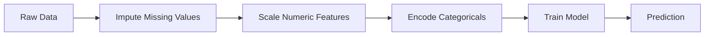
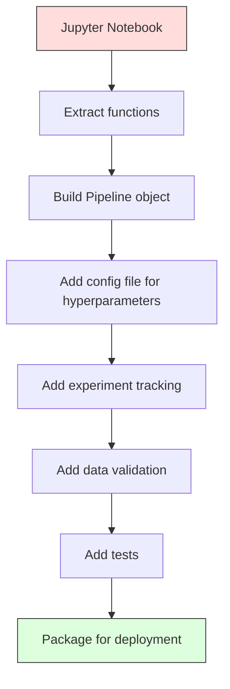

# ML Pipelines (机器学习流水线)

> A model is not a product. A pipeline is. The pipeline is everything from raw data to deployed prediction, and every step must be reproducible.

**类型:** 构建
**语言:** Python
**前置知识:** Phase 2, Lesson 12 (Hyperparameter Tuning / 超参数调优)
**时间:** ~120 分钟

## 学习目标

- 从零构建一个 ML pipeline (机器学习流水线)，将缺失值填充 (imputation)、特征缩放 (scaling)、编码 (encoding) 和模型训练串联成一个可复现的单一对象
- 识别 data leakage (数据泄漏) 场景，并解释 pipeline 如何通过在训练数据上单独拟合 (fit) 转换器来防止泄漏
- 构建一个 ColumnTransformer (列转换器)，对数值型和分类型特征应用不同的预处理
- 实现 pipeline 序列化，并证明同一个拟合后的 pipeline 在训练环境和生产环境中产生完全一致的结果

## 问题背景

你有一个 notebook：加载数据，用中位数填充缺失值，缩放特征，训练模型，打印准确率。一切正常，你把它交付了。

一个月后，有人重新训练模型，得到了不同的结果。中位数是在包含测试数据的完整数据集上计算的（data leakage / 数据泄漏）。缩放参数没有被保存，导致推理时使用了不同的统计量。特征工程代码在训练脚本和 serving 脚本之间被复制粘贴，结果两份代码逐渐偏离。一个分类型列在生产环境中出现了一个模型从未见过的新值。

这些不是假设场景，而是 ML 系统在生产环境中最常见的失败原因。Pipelines (流水线) 通过把每一步转换打包成一个有序的、可复现的对象，一次性解决所有这些问题。

## 核心概念

### 什么是 Pipeline (流水线)

Pipeline (流水线) 是一个有序的数据转换序列，最后接一个模型。每一步将前一步的输出作为输入。整个 pipeline 在训练数据上只拟合 (fit) 一次。在推理时，同一个已经拟合的 pipeline 对新数据进行转换并生成预测。



Pipeline 保证：
- 转换器只在训练数据上拟合（无泄漏）
- 推理时应用完全相同的转换
- 整个对象可以序列化并作为一个 artifact 部署
- Cross-validation (交叉验证) 在每个 fold 内应用 pipeline，防止隐蔽的泄漏

### Data Leakage (数据泄漏): 无声的杀手

Data leakage (数据泄漏) 是指测试集或未来数据的信息污染了训练过程。Pipeline 能防止最常见的泄漏形式。

**泄漏（错误做法）：**
```python
X = df.drop("target", axis=1)
y = df["target"]

scaler = StandardScaler()
X_scaled = scaler.fit_transform(X)

X_train, X_test = X_scaled[:800], X_scaled[800:]
y_train, y_test = y[:800], y[800:]
```

Scaler 看到了测试数据。均值和标准差包含了测试样本的信息。这会虚高准确率估计。

**正确做法：**
```python
X_train, X_test = X[:800], X[800:]

scaler = StandardScaler()
X_train_scaled = scaler.fit_transform(X_train)
X_test_scaled = scaler.transform(X_test)
```

使用 pipeline 时，你无需手动考虑这些。Pipeline 会自动处理。

### sklearn Pipeline (scikit-learn 流水线)

sklearn 的 `Pipeline` 将转换器 (transformers) 和估计器 (estimator) 串联起来。它暴露 `.fit()`、`.predict()` 和 `.score()` 方法，按顺序应用所有步骤。

```python
from sklearn.pipeline import Pipeline
from sklearn.preprocessing import StandardScaler
from sklearn.linear_model import LogisticRegression

pipe = Pipeline([
    ("scaler", StandardScaler()),
    ("model", LogisticRegression()),
])

pipe.fit(X_train, y_train)
predictions = pipe.predict(X_test)
```

当你调用 `pipe.fit(X_train, y_train)` 时：
1. Scaler 对 X_train 调用 `fit_transform`
2. 模型对缩放后的 X_train 调用 `fit`

当你调用 `pipe.predict(X_test)` 时：
1. Scaler 对 X_test 调用 `transform`（不是 `fit_transform`）
2. 模型对缩放后的 X_test 调用 `predict`

Scaler 在拟合阶段永远看不到测试数据。这就是 pipeline 的核心价值。

### ColumnTransformer (列转换器): 不同列用不同流水线

真实数据集同时包含数值型和分类型列，它们需要不同的预处理。`ColumnTransformer` 负责处理这种情况。

```python
from sklearn.compose import ColumnTransformer
from sklearn.preprocessing import StandardScaler, OneHotEncoder
from sklearn.impute import SimpleImputer

numeric_pipe = Pipeline([
    ("impute", SimpleImputer(strategy="median")),
    ("scale", StandardScaler()),
])

categorical_pipe = Pipeline([
    ("impute", SimpleImputer(strategy="most_frequent")),
    ("encode", OneHotEncoder(handle_unknown="ignore")),
])

preprocessor = ColumnTransformer([
    ("num", numeric_pipe, ["age", "income", "score"]),
    ("cat", categorical_pipe, ["city", "gender", "plan"]),
])

full_pipeline = Pipeline([
    ("preprocess", preprocessor),
    ("model", GradientBoostingClassifier()),
])
```

`OneHotEncoder` 中的 `handle_unknown="ignore"` 对生产环境至关重要。当出现新类别（模型从未见过的城市）时，它会生成零向量而不是崩溃报错。

### Experiment Tracking (实验追踪)

Pipeline 让训练可复现，但你还需要追踪每次实验发生了什么：用了哪些超参数、哪个数据集版本、指标是多少、运行的是哪份代码。

**MLflow** 是最常见的开源解决方案：

```python
import mlflow

with mlflow.start_run():
    mlflow.log_param("max_depth", 5)
    mlflow.log_param("n_estimators", 100)
    mlflow.log_param("learning_rate", 0.1)

    pipe.fit(X_train, y_train)
    accuracy = pipe.score(X_test, y_test)

    mlflow.log_metric("accuracy", accuracy)
    mlflow.sklearn.log_model(pipe, "model")
```

每次运行都会记录参数、指标、artifact 和完整模型。你可以比较不同运行、复现任何实验、部署任意模型版本。

**Weights & Biases (wandb)** 提供相同功能，并附带托管的仪表盘：

```python
import wandb

wandb.init(project="my-pipeline")
wandb.config.update({"max_depth": 5, "n_estimators": 100})

pipe.fit(X_train, y_train)
accuracy = pipe.score(X_test, y_test)

wandb.log({"accuracy": accuracy})
```

### Model Versioning (模型版本管理)

实验追踪之后，你需要管理模型版本。哪个模型在生产环境？哪个在 staging？上周用的是哪个？

MLflow 的 Model Registry 提供：
- **版本追踪:** 每个保存的模型都获得一个版本号
- **阶段转换:** "Staging"、"Production"、"Archived"
- **审批工作流:** 模型必须被显式提升到生产环境
- **回滚:** 瞬间切换回之前的版本

### Data Versioning with DVC (用 DVC 进行数据版本控制)

代码用 git 做版本控制。数据也应该做版本控制，但 git 无法处理大文件。DVC (Data Version Control / 数据版本控制) 解决了这个问题。

```
dvc init
dvc add data/training.csv
git add data/training.csv.dvc data/.gitignore
git commit -m "Track training data"
dvc push
```

DVC 将实际数据存储在远程存储（S3、GCS、Azure）中，只在 git 里保留一个小的 `.dvc` 文件记录哈希值。当你 checkout 一个 git commit 时，`dvc checkout` 会恢复当时使用的精确数据。

这意味着每个 git commit 同时锁定了代码和数据。完全可复现。

### Reproducible Experiments (可复现实验)

一个可复现的实验需要四个要素：

1. **固定随机种子:** 为 numpy、random 和框架（torch、sklearn）设置种子
2. **锁定依赖:** requirements.txt 或 poetry.lock 使用精确版本
3. **版本化数据:** DVC 或类似工具
4. **配置文件:** 所有超参数放在配置文件中，不要硬编码

```python
import numpy as np
import random

def set_seed(seed=42):
    random.seed(seed)
    np.random.seed(seed)
    try:
        import torch
        torch.manual_seed(seed)
        torch.cuda.manual_seed_all(seed)
        torch.backends.cudnn.deterministic = True
    except ImportError:
        pass
```

### 从 Notebook 到生产 Pipeline (流水线)



典型的演进路径：

1. **Notebook 探索:** 快速实验、可视化、特征想法
2. **提取函数:** 将预处理、特征工程、评估逻辑移入模块
3. **构建 Pipeline (流水线):** 将转换串联成 sklearn Pipeline 或自定义类
4. **配置管理:** 将所有超参数移入 YAML/JSON 配置
5. **实验追踪:** 添加 MLflow 或 wandb 日志
6. **数据验证:** 训练前检查 schema、分布和缺失值模式
7. **测试:** 转换器的单元测试、完整 pipeline 的集成测试
8. **部署:** 序列化 pipeline、包装成 API（FastAPI、Flask）、容器化

### 常见的 Pipeline (流水线) 错误

| 错误 | 为什么有害 | 修复方法 |
|---------|-------------|-----|
| 在拆分前对整个数据拟合 | Data leakage (数据泄漏) | 使用 Pipeline 配合 cross_val_score |
| 在 pipeline 外做特征工程 | 训练和服务时的转换不一致 | 把所有转换放进 Pipeline |
| 不处理未知类别 | 生产环境遇到新值时崩溃 | OneHotEncoder(handle_unknown="ignore") |
| 硬编码列名 | schema 变化时崩溃 | 从配置中读取列名列表 |
| 没有数据验证 | 坏数据导致静默错误预测 | 在预测前添加 schema 检查 |
| Training/serving skew (训练/服务偏差) | 生产环境模型看到不同特征 | 训练和推理使用同一个 Pipeline 对象 |

## 动手实现

`code/pipeline.py` 中的代码从零构建了一个完整的 ML pipeline (机器学习流水线)：

### 步骤 1: 自定义转换器

```python
class CustomTransformer:
    def __init__(self):
        self.means = None
        self.stds = None

    def fit(self, X):
        self.means = np.mean(X, axis=0)
        self.stds = np.std(X, axis=0)
        self.stds[self.stds == 0] = 1.0
        return self

    def transform(self, X):
        return (X - self.means) / self.stds

    def fit_transform(self, X):
        return self.fit(X).transform(X)
```

### 步骤 2: 从零实现 Pipeline (流水线)

```python
class PipelineFromScratch:
    def __init__(self, steps):
        self.steps = steps

    def fit(self, X, y=None):
        X_current = X.copy()
        for name, step in self.steps[:-1]:
            X_current = step.fit_transform(X_current)
        name, model = self.steps[-1]
        model.fit(X_current, y)
        return self

    def predict(self, X):
        X_current = X.copy()
        for name, step in self.steps[:-1]:
            X_current = step.transform(X_current)
        name, model = self.steps[-1]
        return model.predict(X_current)
```

### 步骤 3: 带 Pipeline (流水线) 的 Cross-Validation (交叉验证)

代码演示了如何用 pipeline 做 cross-validation (交叉验证) 来防止 data leakage (数据泄漏)：scaler 在每个 fold 的训练数据上单独拟合。

### 步骤 4: 使用 sklearn 的完整生产 Pipeline (流水线)

一个完整的 pipeline，包含 `ColumnTransformer` (列转换器)、多条预处理路径、以及模型，使用正确的 cross-validation (交叉验证) 和实验日志进行训练。

## 交付物

本节课产出：
- `outputs/prompt-ml-pipeline.md` -- 一个用于构建和调试 ML pipelines (机器学习流水线) 的 skill
- `code/pipeline.py` -- 从零实现到 sklearn 的完整 pipeline

## 练习

1. 构建一个处理 3 个数值列和 2 个分类型列的 pipeline。使用 `ColumnTransformer` 对数值列应用中位数填充 + 缩放，对分类列应用众数填充 + one-hot 编码。用 5-fold cross-validation (交叉验证) 训练。

2. 故意引入 data leakage (数据泄漏)：在拆分前对整个数据集拟合 scaler。比较泄漏情况下的 cross-validation (交叉验证) 分数与 pipeline 方式（干净）的分数。差距有多大？

3. 用 `joblib.dump` 序列化你的 pipeline。在另一个脚本中加载它并运行预测。验证预测结果完全一致。

4. 在 pipeline 中添加一个自定义转换器，为两个最重要的数值列创建二阶多项式特征。它应该放在 pipeline 的哪个位置？

5. 为 pipeline 设置 MLflow 追踪。运行 5 组不同超参数的实验。使用 MLflow UI (`mlflow ui`) 比较运行结果并选出最佳模型。

## 关键术语

| 术语 | 人们常说的 | 实际含义 |
|------|----------------|----------------------|
| Pipeline (流水线) | "转换链 + 模型" | 有序的拟合转换器和模型序列，作为一个整体应用以防止泄漏 |
| Data leakage (数据泄漏) | "测试信息泄漏到训练" | 使用训练集之外的信息来构建模型，虚高性能估计 |
| ColumnTransformer (列转换器) | "每列不同预处理" | 对不同列子集应用不同的 pipeline，然后合并结果 |
| Experiment tracking (实验追踪) | "记录你的运行" | 为每次训练运行记录参数、指标、artifact 和代码版本 |
| MLflow | "追踪和部署模型" | 用于实验追踪、模型注册和部署的开源平台 |
| DVC | "数据的 Git" | 大文件版本控制系统，在 git 中存储哈希，在远程存储中存储数据 |
| Model registry (模型注册表) | "模型版本目录" | 用阶段标签（staging、production、archived）追踪模型版本的系统 |
| Training/serving skew (训练/服务偏差) | "在 notebook 里能跑" | 训练期间和推理期间数据处理方式的差异，导致静默错误 |
| Reproducibility (可复现性) | "同样代码，同样结果" | 在相同代码、数据和配置下获得完全一致结果的能力 |

## 延伸阅读

- [scikit-learn Pipeline docs](https://scikit-learn.org/stable/modules/compose.html) -- 官方 pipeline 参考
- [MLflow documentation](https://mlflow.org/docs/latest/index.html) -- 实验追踪和模型注册表
- [DVC documentation](https://dvc.org/doc) -- 数据版本控制
- [Sculley et al., Hidden Technical Debt in Machine Learning Systems (2015)](https://papers.nips.cc/paper/2015/hash/86df7dcfd896fcaf2674f757a2463eba-Abstract.html) -- 关于 ML 系统复杂性的经典论文
- [Google ML Best Practices: Rules of ML](https://developers.google.com/machine-learning/guides/rules-of-ml) -- 实用的生产环境 ML 建议
