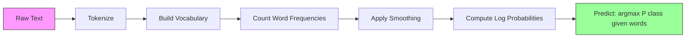

# Naive Bayes (朴素贝叶斯)

> "朴素"假设是错的，但它依然有效。这就是它的美妙之处。

**Type:** Build
**Language:** Python
**Prerequisites:** Phase 2, Lessons 01-07 (classification, Bayes' theorem)
**Time:** ~75 分钟

## 学习目标

- 从零实现带 Laplace smoothing (拉普拉斯平滑) 的 Multinomial Naive Bayes (多项式朴素贝叶斯)，用于文本分类
- 解释为什么朴素独立性假设在数学上是错误的，但在实践中却能产生正确的类别排序
- 比较 Multinomial (多项式)、Bernoulli (伯努利) 和 Gaussian Naive Bayes (高斯朴素贝叶斯) 三种变体，并根据特征类型选择合适的模型
- 在高维稀疏数据上评估 Naive Bayes (朴素贝叶斯) 与 logistic regression (逻辑回归) 的表现，并解释其中 bias-variance tradeoff (偏差-方差权衡) 的作用

## 问题背景

你需要对文本进行分类。将邮件分为垃圾邮件或非垃圾邮件。将客户评论分为正面或负面。将支持工单分类。你有成千上万个特征（每个词一个），但训练数据有限。

大多数分类器在这里会失效。Logistic regression (逻辑回归) 需要足够的样本来可靠地估计数千个权重。Decision trees (决策树) 每次只在一个词上分裂，并且会严重 overfitting (过拟合)。KNN 在 10,000 维中毫无意义，因为每个点与其他每个点的距离都差不多。

Naive Bayes (朴素贝叶斯) 能处理这种情况。它做了一个数学上错误的假设（即每个特征在给定类别下与其他所有特征相互独立），但它仍然在文本分类上 outperform (胜过) "更聪明" 的模型，尤其是在训练集较小的情况下。它只需对数据进行一次遍历即可完成训练。它可以扩展到数百万个特征。它能产生概率估计（尽管由于独立性假设，这些估计通常校准不佳）。

理解为什么一个错误的假设能带来好的预测，能让你学到机器学习的一个基本原理：最好的模型不是最正确的那个，而是对你的数据具有最佳 bias-variance tradeoff (偏差-方差权衡) 的那个。

## 核心概念

### Bayes' Theorem (贝叶斯定理) 快速回顾

Bayes' theorem (贝叶斯定理) 翻转了 conditional probability (条件概率)：

```
P(class | features) = P(features | class) * P(class) / P(features)
```

我们想要 `P(class | features)` —— 给定文档中的词，该文档属于某个类别的概率。我们可以通过以下方式计算：
- `P(features | class)` —— 在该类别文档中看到这些词的 likelihood (似然)
- `P(class)` —— 类别的 prior probability (先验概率)（垃圾邮件总体上有多常见？）
- `P(features)` —— 证据，对所有类别都相同，所以在比较时可以忽略

`P(class | features)` 最高的类别获胜。

### 朴素独立性假设

精确计算 `P(features | class)` 需要估计所有特征联合分布。如果有 10,000 个词的词汇表，你需要估计 2^10,000 种可能组合的分布。不可能。

朴素假设：每个特征在给定类别下条件独立。

```
P(w1, w2, ..., wn | class) = P(w1 | class) * P(w2 | class) * ... * P(wn | class)
```

与其估计一个不可能的联合分布，不如估计 n 个简单的单特征分布。每个只需要一个计数。

这个假设显然是错误的。在任何文档中，"machine" 和 "learning" 都不是独立的。但分类器不需要正确的概率估计。它只需要正确的排序 —— 哪个类别的概率最高。独立性假设会引入系统性误差，但这些误差对所有类别的影响相似，所以排序保持正确。

### 为什么它仍然有效

三个原因：

1. **排序优于校准。** 分类只需要 top-ranked (排名最高) 的类别是正确的。即使 P(spam) = 0.99999 而真实概率是 0.7，分类器仍然正确地选择了 spam。我们不需要正确的概率，只需要正确的赢家。

2. **高偏差，低方差。** 独立性假设是一个很强的先验。它极大地约束了模型，从而防止 overfitting (过拟合)。在训练数据有限的情况下，一个稍微错误但稳定的模型，胜过一个理论上正确但极不稳定的模型。这就是 bias-variance tradeoff (偏差-方差权衡) 的实际体现。

3. **特征冗余相互抵消。** 相关特征提供了冗余的证据。分类器会重复计算这些证据，但它对正确类别也会重复计算。如果 "machine" 和 "learning" 总是一起出现，两者都为 "tech" 类别提供证据。NB 把它们算了两次，但它对正确的类别算了两次。

第四个实际原因：Naive Bayes (朴素贝叶斯) 极快。训练只需一次遍历数据计数频率。预测只是一个矩阵乘法。你可以在几秒钟内训练一百万篇文档。这种速度意味着你可以更快迭代、尝试更多特征集、运行更多实验，比使用更慢的模型更高效。

### 逐步数学推导

让我们通过一个具体例子来追踪。假设我们有两个类别：spam 和 not-spam。词汇表有三个词："free"、"money"、"meeting"。

训练数据：
- Spam 邮件提到 "free" 80 次，"money" 60 次，"meeting" 10 次（共 150 个词）
- Not-spam 邮件提到 "free" 5 次，"money" 10 次，"meeting" 100 次（共 115 个词）
- 40% 的邮件是 spam，60% 是 not-spam

使用 Laplace smoothing (拉普拉斯平滑)（alpha=1）：

```
P(free | spam)    = (80 + 1) / (150 + 3) = 81/153 = 0.529
P(money | spam)   = (60 + 1) / (150 + 3) = 61/153 = 0.399
P(meeting | spam) = (10 + 1) / (150 + 3) = 11/153 = 0.072

P(free | not-spam)    = (5 + 1) / (115 + 3) = 6/118 = 0.051
P(money | not-spam)   = (10 + 1) / (115 + 3) = 11/118 = 0.093
P(meeting | not-spam) = (100 + 1) / (115 + 3) = 101/118 = 0.856
```

新邮件包含："free"（2 次）、"money"（1 次）、"meeting"（0 次）。

```
log P(spam | email) = log(0.4) + 2*log(0.529) + 1*log(0.399) + 0*log(0.072)
                    = -0.916 + 2*(-0.637) + (-0.919) + 0
                    = -3.109

log P(not-spam | email) = log(0.6) + 2*log(0.051) + 1*log(0.093) + 0*log(0.856)
                        = -0.511 + 2*(-2.976) + (-2.375) + 0
                        = -8.838
```

Spam 以很大优势获胜。"free" 出现两次是 spam 的有力证据。注意 "meeting" 没有出现对两个 log 和的贡献都是零（0 * log(P)）—— 在 Multinomial NB (多项式朴素贝叶斯) 中，缺失的词没有影响。是 Bernoulli NB (伯努利朴素贝叶斯) 显式建模了词的缺失。

### 三种变体

Naive Bayes (朴素贝叶斯) 有三种形式。每种对 `P(feature | class)` 的建模方式不同。

#### Multinomial Naive Bayes (多项式朴素贝叶斯)

将每个特征建模为计数。最适合特征为词频或 TF-IDF 值的文本数据。

```
P(word_i | class) = (count of word_i in class + alpha) / (total words in class + alpha * vocab_size)
```

`alpha` 就是 Laplace smoothing (拉普拉斯平滑)（见下文）。这种变体是文本分类的主力。

#### Gaussian Naive Bayes (高斯朴素贝叶斯)

将每个特征建模为正态分布。最适合连续特征。

```
P(x_i | class) = (1 / sqrt(2 * pi * var)) * exp(-(x_i - mean)^2 / (2 * var))
```

每个类别每个特征都有自己的均值和方差。当特征在每个类别内真正呈钟形分布时，效果很好。

#### Bernoulli Naive Bayes (伯努利朴素贝叶斯)

将每个特征建模为二元（出现或未出现）。最适合短文本或二元特征向量。

```
P(word_i | class) = (docs in class containing word_i + alpha) / (total docs in class + 2 * alpha)
```

与 Multinomial (多项式) 不同，Bernoulli (伯努利) 显式惩罚词的缺失。如果 "free" 通常出现在 spam 中但在这封邮件中缺失，Bernoulli 会将其视为反对 spam 的证据。

### 何时使用每种变体

| 变体 | 特征类型 | 最佳适用 | 示例 |
|---------|-------------|----------|---------|
| Multinomial (多项式) | 计数或频率 | 文本分类，词袋模型 | 邮件垃圾检测，主题分类 |
| Gaussian (高斯) | 连续值 | 具有近似正态特征的结构化数据 | Iris 分类，传感器数据 |
| Bernoulli (伯努利) | 二元 (0/1) | 短文本，二元特征向量 | 短信垃圾检测，出现/缺失特征 |

### Laplace Smoothing (拉普拉斯平滑)

如果一个词在测试数据中出现，但在某个类别的训练数据中从未出现，会发生什么？

没有平滑时：`P(word | class) = 0/N = 0`。一个零乘以整个乘积会使 `P(class | features) = 0`，无论其他证据有多强。一个未见过的词就能摧毁整个预测。

Laplace smoothing (拉普拉斯平滑) 给每个特征计数加上一个小的 `alpha`（通常为 1）：

```
P(word_i | class) = (count(word_i, class) + alpha) / (total_words_in_class + alpha * vocab_size)
```

当 alpha=1 时，每个词都至少有一个微小的概率。"discombobulate" 出现在测试邮件中不再会杀死 spam 概率。平滑有一个贝叶斯解释：它等价于在词分布上放置一个均匀的 Dirichlet 先验。

更高的 alpha 意味着更强的平滑（分布更均匀）。更低的 alpha 意味着模型更信任数据。Alpha 是一个需要调优的 hyperparameter (超参数)。

Alpha 的效果：

| Alpha | 效果 | 何时使用 |
|-------|--------|-------------|
| 0.001 | 几乎不平滑，信任数据 | 非常大的训练集，预计没有未见特征 |
| 0.1 | 轻微平滑 | 大训练集 |
| 1.0 | 标准 Laplace smoothing (拉普拉斯平滑) | 默认起点 |
| 10.0 | 强平滑，拉平分布 | 非常小的训练集，预计有很多未见特征 |

### Log-Space (对数空间) 计算

将数百个概率（每个都小于 1）相乘会导致浮点数下溢。乘积在浮点数中变为零，即使真实值是一个非常小的正数。

解决方案：在对数空间中工作。不乘概率，而是加它们的对数：

```
log P(class | x1, x2, ..., xn) = log P(class) + sum_i log P(xi | class)
```

这会将预测转化为一个点积：

```
log_scores = X @ log_feature_probs.T + log_class_priors
prediction = argmax(log_scores)
```

矩阵乘法。这就是 Naive Bayes (朴素贝叶斯) 预测如此快的原因 —— 它与单层线性模型的运算相同。

### Naive Bayes (朴素贝叶斯) vs Logistic Regression (逻辑回归)

两者都是用于文本的线性分类器。区别在于它们建模的内容。

| 方面 | Naive Bayes (朴素贝叶斯) | Logistic Regression (逻辑回归) |
|--------|------------|-------------------|
| 类型 | 生成式（建模 P(X\|Y)） | 判别式（建模 P(Y\|X)） |
| 训练 | 计数频率 | 优化 loss function (损失函数) |
| 小数据 | 更好（强先验有帮助） | 更差（不足以估计权重） |
| 大数据 | 更差（错误假设有害） | 更好（灵活的决策边界） |
| 特征 | 假设独立 | 处理相关性 |
| 速度 | 单次遍历，非常快 | 迭代优化 |
| 校准 | 概率较差 | 概率更好 |

经验法则：从 Naive Bayes (朴素贝叶斯) 开始。如果你有足够的数据且 NB 遇到瓶颈，切换到 logistic regression (逻辑回归)。

### 分类流程



在实践中，我们在对数空间中工作以避免浮点数下溢。不将许多小概率相乘，而是加它们的对数：

```
log P(class | features) = log P(class) + sum_i log P(feature_i | class)
```

## 动手实现

`code/naive_bayes.py` 中的代码从零实现了 MultinomialNB 和 GaussianNB。

### MultinomialNB

从零实现：

1. **fit(X, y)**：对每个类别，统计每个特征的频率。加上 Laplace smoothing (拉普拉斯平滑)。计算对数概率。存储类别先验（类别频率的对数）。

2. **predict_log_proba(X)**：对每个样本，计算所有类别的 log P(class) + sum of log P(feature_i | class)。这是一个矩阵乘法：X @ log_probs.T + log_priors。

3. **predict(X)**：返回对数概率最高的类别。

```python
class MultinomialNB:
    def __init__(self, alpha=1.0):
        self.alpha = alpha

    def fit(self, X, y):
        classes = np.unique(y)
        n_classes = len(classes)
        n_features = X.shape[1]

        self.classes_ = classes
        self.class_log_prior_ = np.zeros(n_classes)
        self.feature_log_prob_ = np.zeros((n_classes, n_features))

        for i, c in enumerate(classes):
            X_c = X[y == c]
            self.class_log_prior_[i] = np.log(X_c.shape[0] / X.shape[0])
            counts = X_c.sum(axis=0) + self.alpha
            self.feature_log_prob_[i] = np.log(counts / counts.sum())

        return self
```

关键洞察：拟合后，预测只是矩阵乘法加一个偏置。这就是 Naive Bayes (朴素贝叶斯) 如此快的原因。

### GaussianNB

对于连续特征，我们估计每个类别每个特征的均值和方差：

```python
class GaussianNB:
    def __init__(self):
        pass

    def fit(self, X, y):
        classes = np.unique(y)
        self.classes_ = classes
        self.means_ = np.zeros((len(classes), X.shape[1]))
        self.vars_ = np.zeros((len(classes), X.shape[1]))
        self.priors_ = np.zeros(len(classes))

        for i, c in enumerate(classes):
            X_c = X[y == c]
            self.means_[i] = X_c.mean(axis=0)
            self.vars_[i] = X_c.var(axis=0) + 1e-9
            self.priors_[i] = X_c.shape[0] / X.shape[0]

        return self
```

预测使用每个特征的 Gaussian (高斯) PDF，跨特征相乘（在对数空间中相加）。

### 演示：文本分类

代码生成模拟两个类别（科技文章 vs 体育文章）的合成词袋数据。每个类别有不同的词频分布。MultinomialNB 使用词计数进行分类。

合成数据的工作原理：我们创建 200 个"词"（特征列）。词 0-39 在科技文章中频率高，在体育中频率低。词 80-119 在体育中频率高，在科技中频率低。词 40-79 在两个类别中频率中等。这创造了一个现实场景，其中一些词是强类别指示器，另一些是噪声。

### 演示：连续特征

代码生成类似 Iris 的数据（3 个类别，4 个特征，高斯聚类）。GaussianNB 使用每类均值和方差进行分类。每个类别有不同的中心（均值向量）和不同的 spread（方差），模仿真实世界中不同类别间测量值系统性地不同的数据。

代码还演示了：
- **平滑比较：** 用不同的 alpha 值训练 MultinomialNB，展示平滑强度对准确率的影响。
- **训练规模实验：** 随着训练数据从 20 增长到 1600 个样本，NB 准确率如何提升。NB 即使在极少样本时也能达到不错的准确率 —— 这是它的主要优势。
- **混淆矩阵：** 每类的 precision (精确率)、recall (召回率) 和 F1 score，展示 NB 在何处犯错。

### 预测速度

Naive Bayes (朴素贝叶斯) 预测是矩阵乘法。对于 n 个样本、d 个特征、k 个类别：
- MultinomialNB：一次矩阵乘法 (n x d) @ (d x k) = O(n * d * k)
- GaussianNB：n * k 次 Gaussian (高斯) PDF 评估，每次覆盖 d 个特征 = O(n * d * k)

两者在每个维度上都是线性的。相比之下，KNN（需要计算到所有训练点的距离）或带 RBF 核的 SVM（需要对所有支持向量进行核评估）。NB 在预测时间上快了几个数量级。

## 使用它

使用 sklearn，两种变体都是一行代码：

```python
from sklearn.naive_bayes import GaussianNB, MultinomialNB

gnb = GaussianNB()
gnb.fit(X_train, y_train)
print(f"GaussianNB accuracy: {gnb.score(X_test, y_test):.3f}")

mnb = MultinomialNB(alpha=1.0)
mnb.fit(X_train_counts, y_train)
print(f"MultinomialNB accuracy: {mnb.score(X_test_counts, y_test):.3f}")
```

使用 sklearn 进行文本分类：

```python
from sklearn.feature_extraction.text import CountVectorizer
from sklearn.naive_bayes import MultinomialNB
from sklearn.pipeline import Pipeline

text_clf = Pipeline([
    ("vectorizer", CountVectorizer()),
    ("classifier", MultinomialNB(alpha=1.0)),
])

text_clf.fit(train_texts, train_labels)
accuracy = text_clf.score(test_texts, test_labels)
```

`naive_bayes.py` 中的代码将从头实现与 sklearn 在同一数据上进行比较，以验证正确性。

### 将 TF-IDF 与 Naive Bayes (朴素贝叶斯) 结合

原始词计数让每个词每次出现都有相同的权重。但像 "the" 和 "is" 这样的常见词在每个类别中都频繁出现 —— 它们不携带信息。TF-IDF（Term Frequency - Inverse Document Frequency，词频-逆文档频率）降低常见词的权重，提高稀有、有区分性的词的权重。

```python
from sklearn.feature_extraction.text import TfidfVectorizer
from sklearn.naive_bayes import MultinomialNB
from sklearn.pipeline import Pipeline

text_clf = Pipeline([
    ("tfidf", TfidfVectorizer()),
    ("classifier", MultinomialNB(alpha=0.1)),
])
```

TF-IDF 值是非负的，所以它们可以与 MultinomialNB 一起工作。TF-IDF + MultinomialNB 的组合是文本分类最强的基线之一。它经常在少于 10,000 个训练样本的数据集上击败更复杂的模型。

### 短文本使用 BernoulliNB (伯努利朴素贝叶斯)

对于短文本（推文、短信、聊天消息），BernoulliNB (伯努利朴素贝叶斯) 可以 outperform (胜过) MultinomialNB (多项式朴素贝叶斯)。短文本词计数低，所以 MultinomialNB 依赖的频率信息是噪声。BernoulliNB 只关心出现或缺失，这在短文本中更可靠。

```python
from sklearn.naive_bayes import BernoulliNB
from sklearn.feature_extraction.text import CountVectorizer

text_clf = Pipeline([
    ("vectorizer", CountVectorizer(binary=True)),
    ("classifier", BernoulliNB(alpha=1.0)),
])
```

CountVectorizer 中的 `binary=True` 标志将所有计数转换为 0/1。没有它，BernoulliNB 仍然可以工作，但它看到的是它未设计的计数。

### 校准 NB 概率

NB 概率校准不佳。当 NB 说 P(spam) = 0.95 时，真实概率可能是 0.7。如果你需要可靠的概率估计（例如，设置阈值或与其他模型组合），使用 sklearn 的 CalibratedClassifierCV：

```python
from sklearn.calibration import CalibratedClassifierCV

calibrated_nb = CalibratedClassifierCV(MultinomialNB(), cv=5, method="sigmoid")
calibrated_nb.fit(X_train, y_train)
proba = calibrated_nb.predict_proba(X_test)
```

这会在 NB 的原始分数上拟合一个 logistic regression (逻辑回归)，使用交叉验证。结果概率更接近真实的类别频率。

### 常见陷阱

1. **负特征值。** MultinomialNB 需要非负特征。如果你有负值（如某些设置下的 TF-IDF 或标准化特征），改用 GaussianNB，或将特征平移为正数。

2. **零方差特征。** GaussianNB 除以方差。如果一个特征在某个类别中的方差为零（所有值相同），概率计算会崩溃。代码给所有方差加了一个小的平滑项（1e-9）来防止这种情况。

3. **类别不平衡。** 如果 99% 的邮件是非垃圾邮件，先验 P(not-spam) = 0.99 如此强以至于压倒了 likelihood (似然) 证据。你可以手动设置类别先验或在 sklearn 中使用 class_prior 参数。

4. **特征缩放。** MultinomialNB 不需要缩放（它处理计数）。GaussianNB 也不需要缩放（它估计每特征统计量）。这是相对于 logistic regression (逻辑回归) 和 SVM 的优势，后者对特征尺度敏感。

## 交付成果

本节课产出：
- `outputs/skill-naive-bayes-chooser.md` —— 选择正确 NB 变体的决策技能
- `code/naive_bayes.py` —— 从零实现的 MultinomialNB 和 GaussianNB，带 sklearn 对比

### Naive Bayes (朴素贝叶斯) 何时失效

NB 在独立性假设导致错误排序（而不仅仅是错误概率）时失效。这种情况发生在：

1. **强特征交互。** 如果类别依赖于两个特征的组合而不是单独任何一个（类似 XOR 模式），NB 会完全错过。每个特征单独不提供证据，而 NB 无法非线性地组合它们。

2. **高度相关特征带有相反证据。** 如果特征 A 说 "spam" 而特征 B 说 "not-spam"，但 A 和 B 完全相关（它们在现实中总是一致的），NB 会看到实际上不存在的冲突证据。

3. **非常大的训练集。** 有足够数据时，像 logistic regression (逻辑回归) 这样的判别式模型会学到真正的决策边界并 outperform (胜过) NB。在小数据时有帮助的独立性假设现在会阻碍模型。

在实践中，这些失效模式在文本分类中很少见。文本特征众多、单独微弱，独立性假设的误差倾向于相互抵消。对于具有少量强相关特征的结构化数据，优先考虑 logistic regression (逻辑回归) 或基于树的方法。

## 练习

1. **平滑实验。** 在文本数据上用 alpha 值 0.01、0.1、1.0、10.0 和 100.0 训练 MultinomialNB。绘制准确率 vs alpha 图。性能在哪里达到峰值？为什么非常高的 alpha 有害？

2. **特征独立性测试。** 取一个真实文本数据集。挑选两个明显相关的词（"machine" 和 "learning"）。计算 P(word1 | class) * P(word2 | class) 并与 P(word1 AND word2 | class) 比较。独立性假设有多错误？它影响分类准确率吗？

3. **Bernoulli 实现。** 用 BernoulliNB 类扩展代码。将词袋转换为二元（出现/缺失）并在文本数据上与 MultinomialNB 比较准确率。Bernoulli 何时获胜？

4. **NB vs Logistic Regression (逻辑回归)。** 在文本数据上训练两者。从 100 个训练样本开始增加到 10,000。为两者绘制准确率 vs 训练集大小图。Logistic Regression (逻辑回归) 何时超过 Naive Bayes (朴素贝叶斯)？

5. **垃圾邮件过滤器。** 构建一个完整的垃圾邮件分类器：对原始邮件文本分词，构建词汇表，创建词袋特征，训练 MultinomialNB，用 precision (精确率) 和 recall (召回率) 评估（不只是准确率 —— 为什么？）。

## 关键术语

| 术语 | 人们怎么说 | 实际含义 |
|------|----------------|----------------------|
| Naive Bayes (朴素贝叶斯) | "简单的概率分类器" | 一种应用 Bayes' theorem (贝叶斯定理) 并假设特征在给定类别下条件独立的分类器 |
| Conditional independence (条件独立) | "特征互不影响" | P(A, B \| C) = P(A \| C) * P(B \| C) —— 一旦你知道 C，了解 B 不会给你关于 A 的新信息 |
| Laplace smoothing (拉普拉斯平滑) | "加一平滑" | 给每个特征加一个小计数，防止零概率主导预测 |
| Prior (先验) | "看到数据之前的信念" | P(class) —— 在观察任何特征之前每个类别的概率 |
| Likelihood (似然) | "数据拟合程度" | P(features \| class) —— 如果类别已知，观察到这些特征的概率 |
| Posterior (后验) | "看到数据之后的信念" | P(class \| features) —— 观察特征后类别的更新概率 |
| Generative model (生成模型) | "建模数据如何生成" | 一种学习 P(X \| Y) 和 P(Y) 的模型，然后使用 Bayes' theorem (贝叶斯定理) 得到 P(Y \| X) |
| Discriminative model (判别模型) | "建模决策边界" | 一种直接学习 P(Y \| X) 而不建模 X 如何生成的模型 |
| Log probability (对数概率) | "避免下溢" | 使用 log P 而不是 P，防止许多小数的乘积在浮点数中变为零 |

## 延伸阅读

- [scikit-learn Naive Bayes docs](https://scikit-learn.org/stable/modules/naive_bayes.html) —— 三种变体及其数学细节
- [McCallum and Nigam, A Comparison of Event Models for Naive Bayes Text Classification (1998)](https://www.cs.cmu.edu/~knigam/papers/multinomial-aaaiws98.pdf) —— Multinomial 与 Bernoulli 用于文本的经典比较
- [Rennie et al., Tackling the Poor Assumptions of Naive Bayes Text Classifiers (2003)](https://people.csail.mit.edu/jrennie/papers/icml03-nb.pdf) —— 针对文本的 NB 改进
- [Ng and Jordan, On Discriminative vs. Generative Classifiers (2001)](https://ai.stanford.edu/~ang/papers/nips01-discriminativegenerative.pdf) —— 证明 NB 比 LR 在更少数据下收敛更快
