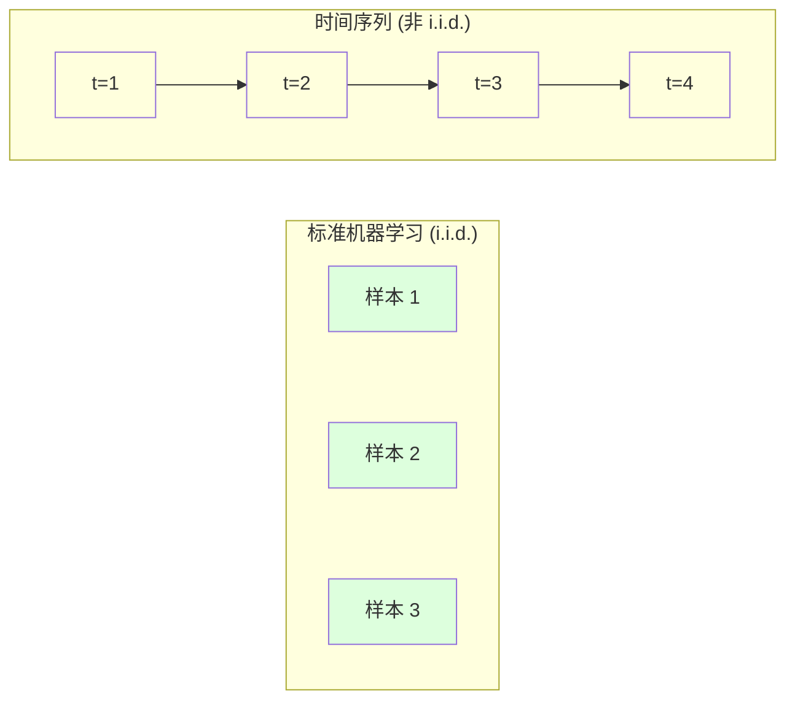
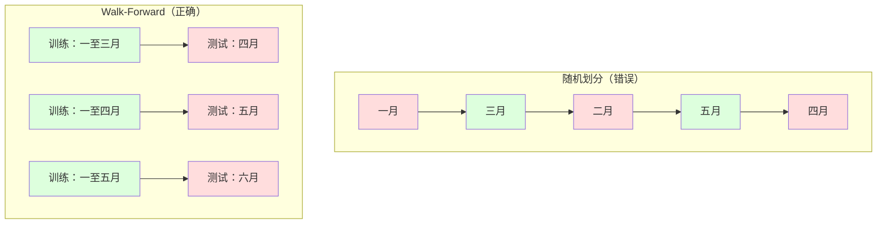

# 时间序列基础

> 历史表现确实能预测未来结果——前提是你先检查平稳性。

**类型：** Build
**语言：** Python
**前置知识：** Phase 2, Lessons 01-09
**时间：** ~90 分钟

## 学习目标

- 将时间序列分解为趋势 (trend)、季节性 (seasonality) 和残差 (residual) 成分，并检验平稳性 (stationarity)
- 实现滞后特征 (lag features) 和滚动统计量 (rolling statistics)，将时间序列转化为监督学习问题
- 构建 walk-forward validation (前向验证) 框架，防止未来数据泄露到训练集中
- 解释为什么随机训练/测试划分对时间序列无效，并展示与正确时间划分之间的性能差距

## 问题

你拥有按时间排序的数据：每日销售额、每小时温度、每分钟 CPU 使用率、每周股价。你想预测下一个值、下一周、下一季度。

你拿出标准的机器学习工具箱：随机训练/测试划分、交叉验证、特征矩阵输入、预测输出。每一步都是错的。

时间序列打破了标准机器学习所依赖的假设。样本不是独立的——今天的温度取决于昨天。随机划分会将未来信息泄露到过去。那些在回测中看起来很棒的特征，在生产环境中会失败，因为它们依赖随时间变化的模式。

一个模型在随机交叉验证中获得 95% 准确率，在正确的时间评估中可能只有 55%。这个差异不是技术细节。它是纸上模型和生产环境可用模型之间的区别。

本课涵盖基础概念：时间数据为何不同、如何诚实地评估模型、以及如何将时间序列转化为标准机器学习模型可以消费的特征。

## 概念

### 时间序列有何不同

标准机器学习假设 i.i.d. —— 独立同分布。每个样本从同一分布中独立抽取。时间序列违反了这两点：

- **不独立。** 今天的股价取决于昨天。本周销售额与上周相关。
- **非同分布。** 分布随时间漂移。十二月的销售额与三月不同。

这些违反不是小问题。它们改变了你构建特征的方式、评估模型的方式，以及哪些算法有效。



在标准机器学习中，样本是可互换的。打乱它们不会改变任何东西。在时间序列中，顺序就是一切。打乱会破坏信号。

### 时间序列的成分

每个时间序列都是以下成分的组合：

```mermaid
flowchart TD
    A[观测到的时间序列] --> B[趋势 (Trend)]
    A --> C[季节性 (Seasonality)]
    A --> D[残差/噪声 (Residual/Noise)]

    B --> E[长期方向：上升、下降、平稳]
    C --> F[重复模式：日、周、年]
    D --> G[去除趋势和季节性后的随机变化]
```

- **趋势 (Trend)**：长期方向。收入每年增长 10%。全球气温上升。
- **季节性 (Seasonality)**：固定间隔的重复模式。十二月零售销售激增。七月空调使用达到高峰。
- **残差 (Residual)**：去除趋势和季节性后剩下的部分。如果残差看起来像白噪声，说明分解已经捕捉到了信号。

### 平稳性 (Stationarity)

如果时间序列的统计特性（均值、方差、自相关 autocorrelation）不随时间变化，则称其为平稳的。大多数预测方法都假设平稳性。

**为什么重要：** 非平稳序列的均值会漂移。一个在 1 月数据上训练的模型学到的均值与 2 月将呈现的均值不同。它会出现系统性偏差。

**如何检查：** 计算滑动窗口上的滑动均值 (rolling mean) 和滑动标准差 (rolling standard deviation)。如果它们漂移，则序列是非平稳的。

**如何修复：** 差分 (Differencing)。不建模原始值，而是建模连续值之间的变化：

```
diff[t] = value[t] - value[t-1]
```

如果一轮差分不能使序列平稳，再次应用（二阶差分）。大多数真实世界序列最多需要两轮。

**示例：**

原始序列: [100, 102, 106, 112, 120]
一阶差分:  [2, 4, 6, 8] （仍在上升）
二阶差分:  [2, 2, 2] （恒定——平稳）

原始序列有二次趋势。一阶差分将其变为线性趋势。二阶差分使其平坦。实践中，很少需要超过两轮。

**正式检验：** Augmented Dickey-Fuller (ADF) 检验是平稳性的标准统计检验。零假设是"序列非平稳"。p 值低于 0.05 意味着可以拒绝零假设，得出平稳的结论。我们不从头实现 ADF（它需要渐近分布表），但代码中的滚动统计方法提供了一个实用的可视化检查。

### 自相关 (Autocorrelation)

自相关 (autocorrelation) 衡量时间 t 的值与时间 t-k（过去 k 步）的值之间的相关性。自相关函数 (ACF, Autocorrelation Function) 为每个滞后 (lag) k 绘制这种相关性。

**ACF 告诉你：**
- 序列的记忆有多长。如果 ACF 在滞后 5 之后降为零，则超过 5 步以前的值是无关的。
- 季节性是否存在。如果 ACF 在滞后 12 处出现尖峰（月度数据），则存在年度季节性。
- 需要创建多少个滞后特征 (lag features)。使用 ACF 变得可忽略之前的滞后。

**PACF (Partial Autocorrelation Function, 偏自相关函数)** 去除了间接相关性。如果今天与 3 天前的相关性仅仅是因为两者都与昨天相关，那么滞后 3 的 PACF 将为零，而滞后 3 的 ACF 则不会。

### 滞后特征 (Lag Features)：将时间序列转化为监督学习

标准机器学习模型需要特征矩阵 X 和目标 y。时间序列只给你一列值。桥梁就是滞后特征。

取序列 [10, 12, 14, 13, 15] 并创建滞后 1 和滞后 2 特征：

| lag_2 | lag_1 | target |
|-------|-------|--------|
| 10    | 12    | 14     |
| 12    | 14    | 13     |
| 14    | 13    | 15     |

现在你有了一个标准的回归问题。任何机器学习模型（线性回归、随机森林、梯度提升）都可以从滞后值预测目标值。

你可以设计的额外特征：
- **滚动统计量 (Rolling statistics)**：最近 k 个值的均值、标准差、最小值、最大值
- **日历特征 (Calendar features)**：星期几、月份、是否假日、是否周末
- **差分值 (Differenced values)**：与前一步的变化
- **扩展统计量 (Expanding statistics)**：累积均值、累积和
- **比率特征 (Ratio features)**：当前值 / 滚动均值（偏离近期平均值多远）
- **交互特征 (Interaction features)**：lag_1 * day_of_week（工作日对动量的影响）

**需要多少个滞后？** 使用自相关函数 (autocorrelation function)。如果 ACF 在滞后 10 之前都显著，至少使用 10 个滞后。如果存在周季节性，包含滞后 7（可能还有 14）。更多滞后给模型更多历史信息，但也增加需要拟合的特征数，增加过拟合 (overfitting) 风险。

**目标对齐陷阱。** 创建滞后特征时，目标必须是时间 t 的值，所有特征必须使用 t-1 或更早的值。如果你不小心将时间 t 的值作为特征包含进来，你就有了一个完美的预测器——以及一个完全无用的模型。这是时间序列特征工程中最常见的 bug。

### Walk-Forward Validation (前向验证)

这是本课最重要的概念。标准 k 折交叉验证随机分配样本到训练集和测试集。对于时间序列，这会泄露未来信息。



Walk-forward validation (前向验证)：
1. 用时间 t 之前的数据训练
2. 预测时间 t+1（或 t+1 到 t+k 的多步预测）
3. 滑动窗口向前移动
4. 重复

每个测试折只包含所有训练数据之后的数据。没有未来泄露。这给你一个诚实的估计，模型部署后的表现如何。

**扩展窗口 (Expanding window)** 使用所有历史数据训练（窗口增长）。**滑动窗口 (Sliding window)** 使用固定大小的训练窗口（窗口滑动）。当你相信旧数据仍然相关时使用扩展窗口。当世界变化、旧数据有害时使用滑动窗口。

### ARIMA 直观理解

ARIMA 是经典的时间序列模型。它有三个组成部分：

- **AR (Autoregressive, 自回归)**：从过去值预测。AR(p) 使用过去 p 个值。
- **I (Integrated, 差分)**：通过差分实现平稳性。I(d) 应用 d 轮差分。
- **MA (Moving Average, 移动平均)**：从过去预测误差预测。MA(q) 使用过去 q 个误差。

ARIMA(p, d, q) 结合了这三者。你基于 ACF/PACF 分析或自动搜索（auto-ARIMA）选择 p, d, q。

我们不会从头实现 ARIMA——它需要超出本课范围的数值优化。关键洞察是理解每个组成部分的作用，这样你就能解释 ARIMA 结果并知道何时使用它。

### 何时使用什么方法

| 方法 | 最适合 | 处理季节性 | 处理外部特征 |
|------|--------|-----------|------------|
| 滞后特征 + ML | 具有大量外部特征的表格数据 | 通过日历特征 | 是 |
| ARIMA | 单变量序列，短期预测 | SARIMA 变体 | 否（ARIMAX 有限支持） |
| 指数平滑 (Exponential smoothing) | 简单趋势 + 季节性 | 是（Holt-Winters） | 否 |
| Prophet | 商业预测，节假日 | 是（傅里叶项） | 有限 |
| 神经网络 (LSTM, Transformer) | 长序列，多序列 | 学习得到 | 是 |

对于大多数实际问题，滞后特征 + 梯度提升 (gradient boosting) 是最强的起点。它自然地处理外部特征，不需要平稳性，且易于调试。

### 预测范围 (Forecasting Horizons) 和策略

单步预测 (Single-step forecasting) 预测下一个时间步。多步预测 (Multi-step forecasting) 预测多个时间步。有三种策略：

**递归 (Recursive/iterated)**：预测一步，将预测作为下一步的输入。简单但误差累积——每个预测使用上一个预测，所以错误会复合。

**直接 (Direct)**：为每个范围训练单独的模型。模型-1 预测 t+1，模型-5 预测 t+5。没有误差累积，但每个模型训练样本更少，且它们不共享信息。

**多输出 (Multi-output)**：训练一个同时输出所有范围的模型。在范围之间共享信息，但需要一个支持多输出的模型（或自定义损失函数）。

对于大多数实际问题，短范围（1-5 步）使用递归，长范围使用直接。

### 时间序列中的常见错误

| 错误 | 原因 | 修复方法 |
|------|------|---------|
| 随机训练/测试划分 | 标准机器学习的习惯 | 使用 walk-forward 或时间划分 |
| 使用未来特征 | 不小心包含了时间 t 的特征 | 审计每个特征的时间对齐 |
| 对季节性过拟合 | 模型记住了日历模式 | 在测试集中保留一个完整的季节性周期 |
| 忽略尺度变化 | 收入翻倍但模式不变 | 建模百分比变化而非绝对值 |
| 滞后特征太多 | "更多历史更好" | 使用 ACF 确定相关滞后 |
| 不做差分 | "模型会自己搞定的" | 树模型处理趋势；线性模型需要平稳性 |

## 构建

`code/time_series.py` 中的代码从头实现了核心构建模块。

### 滞后特征生成器

```python
def make_lag_features(series, n_lags):
    n = len(series)
    X = np.full((n, n_lags), np.nan)
    for lag in range(1, n_lags + 1):
        X[lag:, lag - 1] = series[:-lag]
    valid = ~np.isnan(X).any(axis=1)
    return X[valid], series[valid]
```

这将一维序列转换为特征矩阵，每行有最近 `n_lags` 个值作为特征，当前值作为目标。

### Walk-Forward 交叉验证

```python
def walk_forward_split(n_samples, n_splits=5, min_train=50):
    assert min_train < n_samples, "min_train must be less than n_samples"
    step = max(1, (n_samples - min_train) // n_splits)
    for i in range(n_splits):
        train_end = min_train + i * step
        test_end = min(train_end + step, n_samples)
        if train_end >= n_samples:
            break
        yield slice(0, train_end), slice(train_end, test_end)
```

每次划分确保训练数据严格在测试数据之前。训练窗口随每个折扩展。

### 简单自回归模型

纯 AR 模型就是滞后特征上的线性回归：

```python
class SimpleAR:
    def __init__(self, n_lags=5):
        self.n_lags = n_lags
        self.weights = None
        self.bias = None

    def fit(self, series):
        X, y = make_lag_features(series, self.n_lags)
        # 通过正规方程求解
        X_b = np.column_stack([np.ones(len(X)), X])
        theta = np.linalg.lstsq(X_b, y, rcond=None)[0]
        self.bias = theta[0]
        self.weights = theta[1:]
        return self
```

这在概念上与 Lesson 02 的线性回归相同，但应用于同一变量的时间滞后版本。

### 平稳性检查

代码计算滚动统计量来视觉和数值评估平稳性：

```python
def check_stationarity(series, window=50):
    rolling_mean = np.array([
        series[max(0, i - window):i].mean()
        for i in range(1, len(series) + 1)
    ])
    rolling_std = np.array([
        series[max(0, i - window):i].std()
        for i in range(1, len(series) + 1)
    ])
    return rolling_mean, rolling_std
```

如果滚动均值漂移或滚动标准差变化，序列是非平稳的。应用差分并再次检查。

代码还通过比较序列的前半部分和后半部分来检查平稳性。如果均值差异超过半个标准差或方差比超过 2 倍，序列被标记为非平稳。

### 自相关

```python
def autocorrelation(series, max_lag=20):
    n = len(series)
    mean = series.mean()
    var = series.var()
    acf = np.zeros(max_lag + 1)
    for k in range(max_lag + 1):
        cov = np.mean((series[:n-k] - mean) * (series[k:] - mean))
        acf[k] = cov / var if var > 0 else 0
    return acf
```

## 使用

使用 sklearn，你可以直接将滞后特征与任何回归器一起使用：

```python
from sklearn.linear_model import Ridge
from sklearn.ensemble import GradientBoostingRegressor

X, y = make_lag_features(series, n_lags=10)

for train_idx, test_idx in walk_forward_split(len(X)):
    model = Ridge(alpha=1.0)
    model.fit(X[train_idx], y[train_idx])
    predictions = model.predict(X[test_idx])
```

对于 ARIMA，使用 statsmodels：

```python
from statsmodels.tsa.arima.model import ARIMA

model = ARIMA(train_series, order=(5, 1, 2))
fitted = model.fit()
forecast = fitted.forecast(steps=30)
```

`time_series.py` 中的代码演示了两种方法，并使用 walk-forward validation 进行比较。

### sklearn TimeSeriesSplit

sklearn 提供了 `TimeSeriesSplit`，它实现了 walk-forward validation：

```python
from sklearn.model_selection import TimeSeriesSplit

tscv = TimeSeriesSplit(n_splits=5)
for train_index, test_index in tscv.split(X):
    X_train, X_test = X[train_index], X[test_index]
    y_train, y_test = y[train_index], y[test_index]
    model.fit(X_train, y_train)
    score = model.score(X_test, y_test)
```

这等价于我们从头实现的 `walk_forward_split`，但集成到了 sklearn 的交叉验证框架中。你可以将它与 `cross_val_score` 一起使用：

```python
from sklearn.model_selection import cross_val_score

scores = cross_val_score(model, X, y, cv=TimeSeriesSplit(n_splits=5))
print(f"Mean score: {scores.mean():.4f} +/- {scores.std():.4f}")
```

### 评估指标

时间序列预测使用回归指标，但带有时间感知上下文：

- **MAE (Mean Absolute Error, 平均绝对误差)**：\|y_true - y_pred\| 的平均值。易于用原始单位解释。"平均而言，预测偏差 3.2 度。"
- **RMSE (Root Mean Squared Error, 均方根误差)**：均方误差的平方根。比 MAE 更惩罚大误差。当大误差比许多小误差更糟时使用。
- **MAPE (Mean Absolute Percentage Error, 平均绝对百分比误差)**：\|error / true_value\| * 100 的平均值。与尺度无关，可用于比较不同序列。但真实值为零时无定义。
- **朴素基线比较 (Naive baseline comparison)**：始终与简单基线比较。季节性朴素基线 (seasonal naive baseline) 预测一个周期前的值（昨天、上周）。如果你的模型无法击败朴素基线，说明有问题。

### 滚动特征

代码演示了将滚动统计量（7 天和 14 天窗口的均值、标准差、最小值、最大值）添加到滞后特征中。这些给模型提供了滞后特征本身无法捕捉的近期趋势和波动率信息。

例如，如果滚动均值上升，表明上升趋势。如果滚动标准差增加，表明波动率增大。这些是树模型可以学习但线性模型无法学习的模式。

## 交付

本课产出：
- `outputs/prompt-time-series-advisor.md` —— 用于构建时间序列问题的提示词
- `code/time_series.py` —— 滞后特征、walk-forward validation、AR 模型、平稳性检查

### 你必须击败的基线

在构建任何模型之前，建立基线：

1. **上一个值（持续性）。** 预测明天与今天相同。对于许多序列，这出奇地难以击败。
2. **季节性朴素 (Seasonal naive)。** 预测今天与上周同一天（或去年同一天）相同。如果你的模型无法击败这个，说明它没有学到季节性之外的有用模式。
3. **移动平均 (Moving average)。** 预测最近 k 个值的平均值。平滑噪声但无法捕捉突变。

如果你的复杂机器学习模型输给了季节性朴素基线，说明你有 bug。最常见的是：特征中的未来泄露、错误的评估方法，或者序列确实是随机的、不可预测的。

### 实用技巧

1. **先画图。** 在建模之前，绘制原始序列。寻找趋势、季节性、异常值、结构性断裂（行为的突然变化）。30 秒的视觉检查往往比一小时的自动分析告诉你更多。

2. **先差分，后建模。** 如果序列有明显趋势，在创建滞后特征之前先差分。树模型可以处理趋势，但线性模型不能，而差分永远不会有害。

3. **至少保留一个完整的季节性周期。** 如果你有周季节性，测试集需要至少一整周。如果是月度，至少一整月。否则你无法评估模型是否捕捉到了季节性模式。

4. **生产环境监控。** 时间序列模型随时间退化，因为世界在变化。在滚动基础上跟踪预测误差。当误差开始增加时，用近期数据重新训练模型。

5. **警惕制度变化 (Regime changes)。** 一个在疫情前数据上训练的模型无法预测疫情后的行为。将已知制度变化的指示器作为特征包含进来，或使用一个会遗忘旧数据的滑动窗口。

6. **对偏斜序列取对数。** 收入、价格和计数通常是右偏的。取对数可以稳定方差，使乘法模式变为加法模式，线性模型可以处理。在对数空间预测，然后取指数回到原始单位。

## 练习

1. **平稳性实验。** 生成一个具有线性趋势的序列。用滚动统计量检查平稳性。应用一阶差分。再次检查。对于二次趋势需要多少轮差分？

2. **滞后选择。** 在季节性序列（period=7）上计算 ACF。哪些滞后具有最高的自相关？仅使用这些滞后（而非连续滞后）创建滞后特征。与使用滞后 1 到 7 相比，准确率是否提高？

3. **Walk-forward vs 随机划分。** 在滞后特征上训练 Ridge 回归。用随机 80/20 划分和 walk-forward validation 评估。随机划分高估了多少性能？

4. **特征工程。** 将滚动均值（window=7）、滚动标准差（window=7）和星期几特征添加到滞后特征中。使用 walk-forward validation 比较有和没有这些额外特征的准确率。

5. **多步预测。** 修改 AR 模型以预测 5 步而非 1 步。比较两种策略：(a) 预测一步，将预测作为下一步的输入（递归），(b) 为每个范围训练单独的模型（直接）。哪种更准确？

## 关键术语

| 术语 | 人们怎么说 | 实际含义 |
|------|----------|---------|
| Stationarity (平稳性) | "统计量不随时间变化" | 均值、方差和自相关结构随时间恒定的序列 |
| Differencing (差分) | "减去连续值" | 计算 y[t] - y[t-1] 以去除趋势并实现平稳性 |
| Autocorrelation / ACF (自相关) | "序列如何与自身相关" | 时间序列与其滞后副本之间的相关性，作为滞后 (lag) 的函数 |
| Partial autocorrelation / PACF (偏自相关) | "仅直接相关" | 去除所有更短滞后的影响后，滞后 k 处的自相关 |
| Lag features (滞后特征) | "过去值作为输入" | 使用 y[t-1], y[t-2], ..., y[t-k] 作为特征预测 y[t] |
| Walk-forward validation (前向验证) | "尊重时间的交叉验证" | 训练数据始终在时间上先于测试数据的评估方式 |
| ARIMA | "经典时间序列模型" | AutoRegressive Integrated Moving Average：结合过去值 (AR)、差分 (I) 和过去误差 (MA) |
| Seasonality (季节性) | "重复的日历模式" | 时间序列中与日历周期（日、周、年）绑定的规则、可预测周期 |
| Trend (趋势) | "长期方向" | 序列水平随时间的持续增加或减少 |
| Expanding window (扩展窗口) | "使用所有历史" | 训练集随每个折增长的 walk-forward validation |
| Sliding window (滑动窗口) | "固定大小历史" | 训练集是固定长度窗口向前滑动的 walk-forward validation |

## 延伸阅读

- [Hyndman and Athanasopoulos, Forecasting: Principles and Practice (3rd ed.)](https://otexts.com/fpp3/) —— 最好的免费时间序列预测教材
- [scikit-learn Time Series Split](https://scikit-learn.org/stable/modules/generated/sklearn.model_selection.TimeSeriesSplit.html) —— sklearn 的 walk-forward 划分器
- [statsmodels ARIMA docs](https://www.statsmodels.org/stable/generated/statsmodels.tsa.arima.model.ARIMA.html) —— 带诊断的 ARIMA 实现
- [Makridakis et al., The M5 Competition (2022)](https://www.sciencedirect.com/science/article/pii/S0169207021001874) —— 大规模预测竞赛，展示机器学习方法 vs 统计方法
