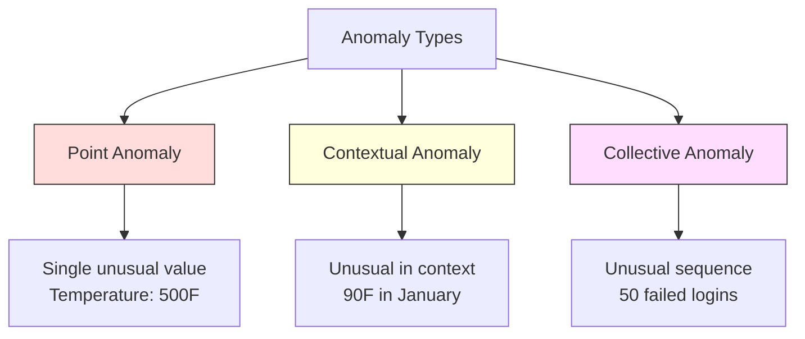
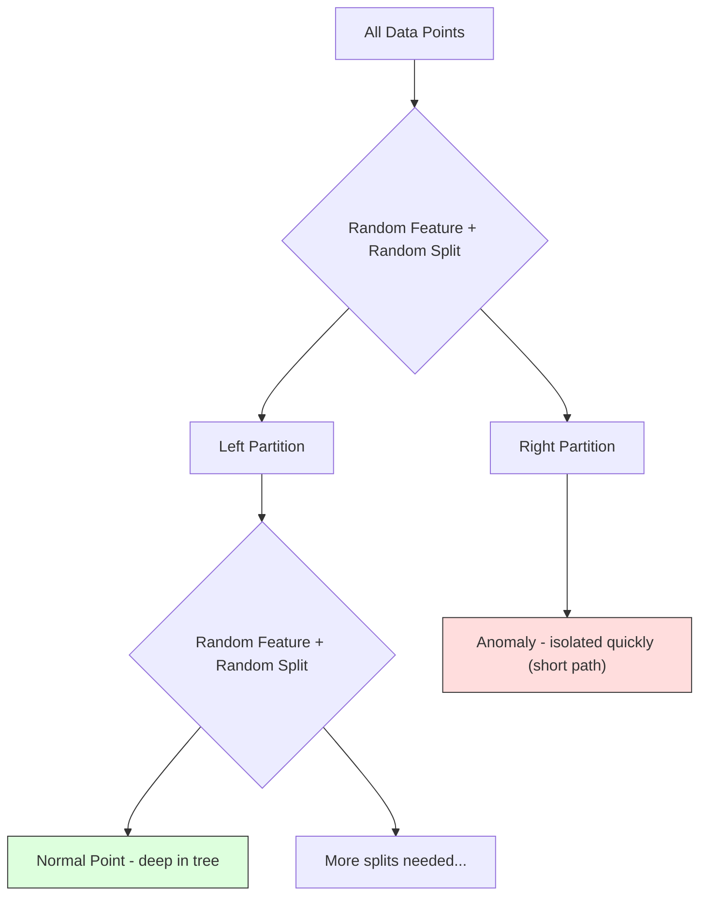
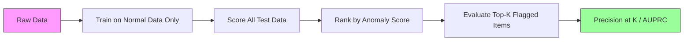

# 异常检测 (Anomaly Detection)

> 正常很容易定义。不正常就是任何不符合定义的。

**类型:** 构建
**语言:** Python
**前置条件:** Phase 2, Lessons 01-09
**时间:** ~75 分钟

## 学习目标

- 从零实现 Z-score (Z分数)、IQR (四分位距) 和 Isolation Forest (孤立森林) 异常检测方法
- 区分 point anomaly (点异常)、contextual anomaly (上下文异常) 和 collective anomaly (集体异常)，并为每种选择合适的检测方法
- 解释为什么异常检测被框架为对正常数据建模，而非对异常进行分类
- 比较 unsupervised anomaly detection (无监督异常检测) 与 supervised classification (监督分类)，并评估 novel anomaly coverage (新类型异常覆盖) 与 precision (精确率) 之间的 tradeoff (权衡)

## 问题

一张信用卡下午2点在纽约使用，然后下午2:05在东京使用。一个工厂传感器读数为150度，而正常范围是80-120度。一台服务器每秒发送50,000个请求，而日均值是200。

这些都是 anomaly (异常)。发现它们很重要。欺诈造成数十亿损失。设备故障造成停机。网络入侵造成数据泄露。

挑战在于：你很少拥有标注的异常样本。欺诈只占交易的0.1%。设备故障每年只发生几次。你无法训练一个标准分类器，因为 "异常" 类几乎没有可学习的样本。即使你有一些标签，你见过的异常也不是你将遇到的唯一类型。明天的欺诈方案看起来与今天的不同。

Anomaly detection (异常检测) 翻转了问题。与其学习什么是异常的，不如学习什么是正常的。任何偏离正常的东西都是可疑的。这无需标签即可工作，能适应新类型的异常，并能扩展到海量数据集。

## 概念

### 异常类型

并非所有异常都一样：

- **Point anomaly (点异常)。** 单个数据点，无论上下文如何都是不寻常的。温度读数500度。一笔交易50,000美元，而账户通常只花50美元。
- **Contextual anomaly (上下文异常)。** 在给定上下文下不寻常的数据点。90度的温度在夏天是正常的，在冬天是异常的。同一个值，不同的上下文。
- **Collective anomaly (集体异常)。** 作为一组不寻常的数据点序列，即使每个单独的点可能是正常的。五次登录失败是正常的。连续五十次就是暴力攻击。

大多数方法检测 point anomaly (点异常)。Contextual anomaly (上下文异常) 需要时间或位置特征。Collective anomaly (集体异常) 需要序列感知方法。



### 无监督框架

在标准分类中，你有两个类别的标签。在 anomaly detection (异常检测) 中，你通常处于以下三种情况之一：

1. **Fully unsupervised (完全无监督)。** 完全没有标签。你在所有数据上拟合检测器，希望异常足够稀少，不会腐蚀 "正常" 模型。
2. **Semi-supervised (半监督)。** 你只有干净的正常数据。你在干净集上拟合，然后对所有其他数据打分。这是可能的最强设置。
3. **Weakly supervised (弱监督)。** 你有少量标注的异常。用它们来评估，而不是训练。无监督训练，然后在标注子集上测量 precision/recall (精确率/召回率)。

关键洞察：anomaly detection (异常检测)  fundamentally different (根本不同) 于 classification (分类)。你是在对正常数据的分布建模，而不是对两个类别之间的 decision boundary (决策边界) 建模。

### 监督 vs 无监督：权衡

如果你确实有标注的异常，应该将它们用于训练 (supervised classification, 监督分类) 还是仅用于评估 (unsupervised detection, 无监督检测)？

**Supervised (监督)：**
- 捕获你之前见过的确切异常类型
- 对已知异常类型的 precision (精确率) 更高
- 完全错过 novel anomaly types (新类型异常)
- 新异常类型出现时需要重新训练
- 需要足够的异常样本（通常太少）

**Unsupervised (无监督)：**
- 捕获任何偏离正常的异常，包括新类型
- 不需要标注的异常
- False positive rate (假阳性率) 更高（并非所有不寻常的都是坏的）
- 对 distribution shift (分布漂移) 更 robust (稳健)

在实践中，最好的系统结合两者：unsupervised detection (无监督检测) 用于 broad coverage (广泛覆盖)，supervised models (监督模型) 用于已知的高优先级异常类型，human review (人工审核) 用于模糊案例。

### Z-Score 方法

最简单的方法。计算每个特征的 mean (均值) 和 standard deviation (标准差)。标记任何距离 mean (均值) 超过 k 个 standard deviation (标准差) 的点。

```text
z_score = (x - mean) / std
anomaly if |z_score| > threshold
```

默认 threshold (阈值) 是 3.0（对于 Gaussian distribution (高斯分布)，99.7% 的正常数据落在 3 个 standard deviation (标准差) 之内）。

**优点：** 简单。快速。可解释（"这个值距离正常值 4.5 个 standard deviation (标准差)"）。

**缺点：** 假设数据是 normally distributed (正态分布)。对训练数据中的 outlier (异常值) 敏感（outlier 会偏移 mean 并 inflate std，使它们更难被检测）。在 multimodal distribution (多模态分布) 上失效。

**适用场景：** 单特征监控，数据大致呈 bell-shaped (钟形)。服务器响应时间、制造公差、基线稳定的传感器读数。

**失效场景：** 多簇数据（两个办公地点有不同的基线温度）、skewed data (偏斜数据)（交易金额中1000美元很少见但并非异常）、训练集中含有 outlier (异常值) 的数据。

### IQR 方法

比 Z-score 更 robust (稳健)。使用 interquartile range (四分位距) 代替 mean 和 standard deviation。

```
Q1 = 25th percentile
Q3 = 75th percentile
IQR = Q3 - Q1
lower_bound = Q1 - factor * IQR
upper_bound = Q3 + factor * IQR
anomaly if x < lower_bound or x > upper_bound
```

默认 factor (因子) 是 1.5。

**优点：** 对 outlier (异常值) robust (稳健)（percentile (百分位数) 不受极端值影响）。适用于 skewed distribution (偏斜分布)。无需正态性假设。

**缺点：** 仅 univariate (单变量)（逐特征独立应用）。无法检测仅在多个特征联合考虑时才异常的异常值（一个点在每个特征单独看可能是正常的，但在 joint space (联合空间) 中是异常的）。

**实用说明：** IQR 中的 1.5 factor 对应于 box plot (箱线图) 中的 whisker (须线)。须线之外的点是潜在的 outlier (异常值)。使用 3.0 代替 1.5 会使检测器更保守（标记更少，false positive (假阳性) 更少）。正确的 factor 取决于你对 false alarm (误报) 的容忍度。

### Isolation Forest (孤立森林)

关键洞察：anomaly (异常) 稀少且不同。在数据的随机划分中，anomaly (异常) 更容易被隔离——它们需要更少的随机分割就能与其他数据分开。



**工作原理：**
1. 构建许多随机树（一个 isolation forest (孤立森林)）
2. 在每个节点，随机选择一个特征和该特征 min 与 max 之间的随机分割值
3. 持续分割直到每个点都被隔离（在自己的叶子中）
4. Anomaly (异常) 在所有树中的 average path length (平均路径长度) 更短

**为什么有效：** 正常点位于 dense region (密集区域)。需要许多随机分割才能将一个正常点与其邻居隔离。Anomaly (异常) 位于 sparse region (稀疏区域)。一两个随机分割就足以隔离它们。

Anomaly score (异常分数) 基于所有树中的 average path length (平均路径长度)，由随机 binary search tree (二叉搜索树) 的 expected path length (期望路径长度) 归一化：

```
score(x) = 2^(-average_path_length(x) / c(n))
```

其中 `c(n)` 是 n 个样本的 expected path length (期望路径长度)。Score (分数) 接近 1 表示 anomaly (异常)。Score 接近 0.5 表示 normal (正常)。Score 接近 0 表示非常 normal (正常)（深藏在 dense cluster (密集簇) 中）。

**优点：** 无分布假设。适用于 high dimension (高维)。扩展性好（由于每棵树使用 subsample (子样本)，在样本大小上呈 sublinear (次线性)）。可处理混合特征类型。

**缺点：** 在 dense region (密集区域) 中的 anomaly (异常) 上表现不佳（masking effect (掩蔽效应)）。当许多特征 irrelevant (不相关) 时，随机分割效果较差。

**关键 hyperparameter (超参数)：**
- `n_estimators`: 树的数量。100 通常足够。更多的树给出更稳定的 score (分数)，但计算更慢。
- `max_samples`: 每棵树的样本数。原始论文中的默认值是 256。较小的值使单棵树 less accurate (不太准确)，但增加 diversity (多样性)。subsample (子采样) 正是 Isolation Forest 快速的原因——每棵树只看到数据的一小部分。
- `contamination`: 预期的 anomaly fraction (异常比例)。仅用于设置 threshold (阈值)。不影响 score (分数) 本身。

### Local Outlier Factor (LOF, 局部异常因子)

LOF 比较一个点周围的 local density (局部密度) 与其邻居周围的密度。一个位于稀疏区域但被密集区域包围的点是异常的。

**工作原理：**
1. 对于每个点，找到其 k nearest neighbors (k 近邻)
2. 计算 local reachability density (局部可达密度)（邻域有多密集）
3. 将每个点的密度与其邻居的密度比较
4. 如果一个点的密度远低于其邻居，它就是 outlier (异常值)

**LOF score (LOF 分数)：**
- LOF 接近 1.0 表示与邻居密度相似（normal (正常)）
- LOF 大于 1.0 表示密度低于邻居（potentially anomalous (潜在异常)）
- LOF 远大于 1.0（例如 2.0+）表示密度显著更低（likely anomaly (可能是异常)）

"local (局部)" 部分至关重要。考虑一个有两个簇的数据集：一个 dense cluster (密集簇) 有1000个点，一个 sparse cluster (稀疏簇) 有50个点。Sparse cluster (稀疏簇) 边缘的一个点在全局上并不异常——它有50个邻居。但如果它的 immediate neighbors (直接邻居) 比它更密集，它在局部就是不寻常的。LOF 捕获了这种 global method (全局方法) 会错过的细微差别。

**优点：** 检测 local anomaly (局部异常)（在邻域中不寻常的点，即使全局上并不异常）。适用于不同密度的簇。

**缺点：** 在大型数据集上较慢（naive implementation (朴素实现) 为 O(n^2)）。对 k 的选择敏感。在 very high dimension (非常高维) 下效果不佳（curse of dimensionality (维度灾难) 影响距离计算）。

### 方法比较

| Method (方法) | Assumptions (假设) | Speed (速度) | Handles High Dims (处理高维) | Detects Local Anomalies (检测局部异常) |
|--------|------------|-------|-------------------|------------------------|
| Z-score | Normal distribution (正态分布) | Very fast (非常快) | Yes (per feature) (是，逐特征) | No (否) |
| IQR | None (per feature) (无，逐特征) | Very fast (非常快) | Yes (per feature) (是，逐特征) | No (否) |
| Isolation Forest | None (无) | Fast (快) | Yes (是) | Partially (部分) |
| LOF | Distance is meaningful (距离有意义) | Slow (慢) | Poorly (差) | Yes (是) |

### 评估挑战

评估 anomaly detector (异常检测器) 比评估 classifier (分类器) 更难：

- **Extreme class imbalance (极端类别不平衡)。** 当 anomaly (异常) 占0.1%时，全部预测为 "normal (正常)" 就能获得99.9%的 accuracy (准确率)。Accuracy (准确率) 毫无用处。
- **AUROC 具有误导性。** 在严重不平衡的情况下，AUROC 可能看起来不错，即使模型在 practical threshold (实用阈值) 下错过了大多数 anomaly (异常)。
- **更好的指标：** Precision@k（前 k 个标记项中有多少是真正的 anomaly (异常)），AUPRC (precision-recall curve (精确率-召回率曲线) 下的面积)，以及 fixed false positive rate (固定假阳性率) 下的 recall (召回率)。



### 异常检测流程

在实践中，anomaly detection (异常检测) 遵循以下 workflow (工作流)：

1. **收集 baseline data (基线数据)。** 理想情况下，是一个你知道没有（或很少）anomaly (异常) 的时期。
2. **特征工程。** 原始特征加上衍生特征（rolling statistics (滚动统计)、时间特征、比率）。
3. **训练检测器。** 在 baseline data (基线数据) 上拟合。模型学习 "normal (正常)" 的样子。
4. **对新数据打分。** 每个新观测值获得一个 anomaly score (异常分数)。
5. **阈值选择。** 选择 score cutoff (分数截止值)。这是一个业务决策：更高的 threshold (阈值) 意味着更少的 false alarm (误报) 但更多的 missed anomaly (漏检异常)。
6. **告警和调查。** 标记的点进入人工审核或自动响应。
7. **反馈收集。** 记录标记项是真正的 anomaly (异常) 还是 false alarm (误报)。用这些数据来评估检测器并随时间调整 threshold (阈值)。

这个流程永远不会 "完成"。数据分布会 shift (偏移)，新类型的 anomaly (异常) 会出现，threshold (阈值) 需要调整。将 anomaly detection (异常检测) 视为一个 living system (活的系统)，而不是一次性的模型。

## 构建

`code/anomaly_detection.py` 中的代码从零实现了 Z-score、IQR 和 Isolation Forest。

### Z-Score 检测器

```python
def zscore_detect(X, threshold=3.0):
    mean = X.mean(axis=0)
    std = X.std(axis=0)
    std[std == 0] = 1.0
    z = np.abs((X - mean) / std)
    return z.max(axis=1) > threshold
```

简单且 vectorized (向量化)。如果任何特征超过 threshold (阈值)，就标记该点。

### IQR 检测器

```python
def iqr_detect(X, factor=1.5):
    q1 = np.percentile(X, 25, axis=0)
    q3 = np.percentile(X, 75, axis=0)
    iqr = q3 - q1
    iqr[iqr == 0] = 1.0
    lower = q1 - factor * iqr
    upper = q3 + factor * iqr
    outside = (X < lower) | (X > upper)
    return outside.any(axis=1)
```

### 从零实现 Isolation Forest

从零实现构建随机划分特征空间的 isolation tree (孤立树)：

```python
class IsolationTree:
    def __init__(self, max_depth):
        self.max_depth = max_depth

    def fit(self, X, depth=0):
        n, p = X.shape
        if depth >= self.max_depth or n <= 1:
            self.is_leaf = True
            self.size = n
            return self
        self.is_leaf = False
        self.feature = np.random.randint(p)
        x_min = X[:, self.feature].min()
        x_max = X[:, self.feature].max()
        if x_min == x_max:
            self.is_leaf = True
            self.size = n
            return self
        self.threshold = np.random.uniform(x_min, x_max)
        left_mask = X[:, self.feature] < self.threshold
        self.left = IsolationTree(self.max_depth).fit(X[left_mask], depth + 1)
        self.right = IsolationTree(self.max_depth).fit(X[~left_mask], depth + 1)
        return self
```

隔离一个点的 path length (路径长度) 决定了它的 anomaly score (异常分数)。更短的路径意味着更异常。

`IsolationForest` 类包装了多棵树：

```python
class IsolationForest:
    def __init__(self, n_estimators=100, max_samples=256, seed=42):
        self.n_estimators = n_estimators
        self.max_samples = max_samples

    def fit(self, X):
        sample_size = min(self.max_samples, X.shape[0])
        max_depth = int(np.ceil(np.log2(sample_size)))
        for _ in range(self.n_estimators):
            idx = rng.choice(X.shape[0], size=sample_size, replace=False)
            tree = IsolationTree(max_depth=max_depth)
            tree.fit(X[idx])
            self.trees.append(tree)

    def anomaly_score(self, X):
        avg_path = average path length across all trees
        scores = 2.0 ** (-avg_path / c(max_samples))
        return scores
```

Normalization factor (归一化因子) `c(n)` 是 n 个元素的 binary search tree (二叉搜索树) 中 unsuccessful search (不成功搜索) 的 expected path length (期望路径长度)。它等于 `2 * H(n-1) - 2*(n-1)/n`，其中 `H` 是 harmonic number (调和数)。这种 normalization (归一化) 确保了 score (分数) 在不同大小的数据集之间可比较。

### 演示场景

代码生成多个测试场景：

1. **单簇带 outlier (异常值)。** 一个 2D Gaussian (高斯) 簇，异常注入在远离中心的位置。所有方法在这里都应该有效。
2. **Multimodal data (多模态数据)。** 三个不同大小和密度的簇。簇之间的点是异常的。Z-score 表现不佳，因为逐特征的范围很宽。
3. **High-dimensional data (高维数据)。** 50 个特征，但异常只在其中 5 个特征上不同。测试方法是否能在特征子集中找到异常。

每个演示使用 precision (精确率)、recall (召回率)、F1 和 Precision@k 比较所有方法。

## 使用

使用 sklearn（使用库实现，而非从零实现）：

```python
from sklearn.ensemble import IsolationForest
from sklearn.neighbors import LocalOutlierFactor

iso = IsolationForest(n_estimators=100, contamination=0.05, random_state=42)
iso.fit(X_train)
predictions = iso.predict(X_test)

lof = LocalOutlierFactor(n_neighbors=20, contamination=0.05, novelty=True)
lof.fit(X_train)
predictions = lof.predict(X_test)
```

注意 `contamination` 设置预期的 anomaly fraction (异常比例)。正确设置很重要——太低会错过 anomaly (异常)，太高会产生 false alarm (误报)。

`anomaly_detection.py` 中的代码将从零实现与 sklearn 在相同数据上的结果进行比较。

### sklearn 的 Contamination 参数

sklearn 中的 `contamination` 参数决定了将连续 anomaly score (异常分数) 转换为 binary prediction (二元预测) 的 threshold (阈值)。它不改变底层的 score (分数)。

```python
iso_5 = IsolationForest(contamination=0.05)
iso_10 = IsolationForest(contamination=0.10)
```

两者产生相同的 anomaly score (异常分数)。但 `iso_5` 标记前 5%，而 `iso_10` 标记前 10%。如果你不知道真正的 anomaly rate (异常率)（通常不知道），将 contamination 设为 "auto" 并直接使用 raw score (原始分数)。根据 false positive (假阳性) 和 false negative (假阴性) 之间的 cost tradeoff (成本权衡) 设置自己的 threshold (阈值)。

### One-Class SVM (单类SVM)

另一个值得了解的 unsupervised anomaly detector (无监督异常检测器)。One-Class SVM 使用 kernel trick (核技巧) 在高维特征空间中围绕正常数据拟合一个 boundary (边界)。

```python
from sklearn.svm import OneClassSVM

oc_svm = OneClassSVM(kernel="rbf", gamma="auto", nu=0.05)
oc_svm.fit(X_train)
predictions = oc_svm.predict(X_test)
```

`nu` 参数近似 anomaly fraction (异常比例)。One-Class SVM 在中小型数据集上表现良好，但无法扩展到非常大的数据（kernel matrix (核矩阵) 呈二次增长）。

### Autoencoder 方法（预览）

Autoencoder (自编码器) 是神经网络，学习压缩和重构数据。在正常数据上训练。在测试时，anomaly (异常) 具有 high reconstruction error (高重构误差)，因为网络只学习了重构正常模式。

这在 Phase 3 (Deep Learning, 深度学习) 中涵盖，但 principle (原理) 相同：对正常建模，标记偏离的。

### 集成异常检测

正如 ensemble method (集成方法) 改善 classification (分类)（Lesson 11），结合多个 anomaly detector (异常检测器) 能改善检测。最简单的方法：

1. 运行多个检测器（Z-score、IQR、Isolation Forest、LOF）
2. 将每个检测器的 score (分数) 归一化到 [0, 1]
3. 平均归一化后的 score (分数)
4. 标记 average score (平均分数) 上超过 threshold (阈值) 的点

这减少了 false positive (假阳性)，因为不同方法有不同的 failure mode (失效模式)。被所有四种方法标记的点几乎肯定是异常的。只被一种方法标记的点可能是该方法的 quirk (怪癖)。

更复杂的 ensemble (集成) 根据每个检测器的 estimated reliability (估计可靠性) 加权（如果有带已知异常的 validation set (验证集) 可用）。

### 生产考虑

1. **Threshold drift (阈值漂移)。** 随着数据分布 shift (偏移)，固定的 threshold (阈值) 会过时。监控 anomaly score (异常分数) 的分布并定期调整。
2. **Alert fatigue (告警疲劳)。** 太多 false alarm (误报) 会让操作员不再关注。从 high threshold (高阈值) 开始（更少、更可靠的告警），随着信任建立再降低。
3. **Ensemble approach (集成方法)。** 在生产中，结合多个检测器。只有多个方法一致认为异常时才标记点。这显著减少 false positive (假阳性)。
4. **Feature engineering (特征工程)。** 原始特征通常不够。添加 rolling statistics (滚动统计)、比率、time-since-last-event (距上次事件的时间) 和 domain-specific feature (领域特定特征)。好的 feature set (特征集) 比检测器的选择更重要。
5. **Feedback loop (反馈循环)。** 当操作员调查标记项并确认或驳回时，将此反馈回系统。随时间积累 labeled data (标注数据) 以评估和改进检测器。

## 交付

本节课产出：
- `outputs/skill-anomaly-detector.md` — 选择正确检测器的决策 skill (技能)
- `code/anomaly_detection.py` — 从零实现的 Z-score、IQR 和 Isolation Forest，含 sklearn 比较

### 选择阈值

Anomaly score (异常分数) 是连续的。你需要一个 threshold (阈值) 来做二元决策。这是一个业务决策，不是技术决策。

考虑两个场景：
- **Fraud detection (欺诈检测)。** 错过欺诈很昂贵（chargeback (退款)、客户信任）。False alarm (误报) 只需人工分析师花 5 分钟调查。将 threshold (阈值) 设低以捕获更多欺诈，接受更多 false alarm (误报)。
- **Equipment maintenance (设备维护)。** False alarm (误报) 意味着不必要的停机，花费 50,000 美元。Missed failure (漏检故障) 意味着 500,000 美元的维修。将 threshold (阈值) 设为平衡这些成本。

在两种情况下，最优 threshold (阈值) 取决于 false positive (假阳性) 和 false negative (假阴性) 之间的 cost ratio (成本比)。在不同 threshold (阈值) 下绘制 precision (精确率) 和 recall (召回率)，叠加 cost function (成本函数)，选择最小成本点。

### 扩展到生产

对于生产中的 real-time anomaly detection (实时异常检测)：

1. **Batch training (批量训练), online scoring (在线打分)。** 定期（每天、每周）在最近的正常数据上训练模型。每个新观测到达时打分。
2. **特征计算必须匹配。** 如果你用 30 天的 rolling statistics (滚动统计) 训练，你需要 30 天的历史来计算新观测的特征。缓冲所需的历史数据。
3. **Score distribution monitoring (分数分布监控)。** 随时间跟踪 anomaly score (异常分数) 的分布。如果 median score (中位数分数) 向上漂移，要么数据在变化，要么模型已过时。
4. **Explainability (可解释性)。** 当你标记一个 anomaly (异常) 时，说明原因。Z-score："特征 X 比正常值高 4.2 个 standard deviation (标准差)。" Isolation Forest："这个点平均在 3.1 次分割中被隔离（正常点需要 8.5 次）。"

## 练习

1. **Threshold tuning (阈值调优)。** 以 0.5 为步长，运行 threshold (阈值) 从 1.0 到 5.0 的 Z-score 检测器。在每个 threshold (阈值) 下绘制 precision (精确率) 和 recall (召回率)。你的数据的 sweet spot (最佳点) 在哪里？

2. **Multivariate anomaly (多变量异常)。** 创建 2D 数据，其中每个特征单独看是正常的，但组合起来是异常的（例如，远离主簇对角线的点）。展示 Z-score 逐特征会错过这些，但 Isolation Forest 能捕获它们。

3. **LOF 从零实现。** 使用 k-nearest neighbors (k 近邻) 实现 Local Outlier Factor (局部异常因子)。在相同数据上与 sklearn 的 LocalOutlierFactor 比较。使用 k=10 和 k=50——k 的选择如何影响结果？

4. **Streaming anomaly detection (流式异常检测)。** 修改 Z-score 检测器以在 streaming setting (流式设置) 中工作：新点到达时更新 running mean (运行均值) 和 variance (方差)（Welford's online algorithm (Welford 在线算法)）。与相同数据上的 batch Z-score (批量 Z-score) 比较。

5. **Real-world evaluation (真实世界评估)。** 取一个带已知异常的数据集（例如 Kaggle 的信用卡欺诈）。使用 precision@100、precision@500 和 AUPRC 评估所有四种方法。哪种方法最好？为什么？

## 关键术语

| Term (术语) | What people say (人们怎么说) | What it actually means (实际含义) |
|------|----------------|----------------------|
| Anomaly (异常) | "Outlier (异常值), unusual point (不寻常的点)" | 显著偏离正常数据预期模式的数据点 |
| Point anomaly (点异常) | "A single weird value (一个奇怪的值)" | 无论上下文如何都不寻常的单个观测 |
| Contextual anomaly (上下文异常) | "Normal value, wrong context (正常值，错误上下文)" | 在给定上下文（时间、位置等）下不寻常的观测，但在另一个上下文中可能是正常的 |
| Isolation Forest (孤立森林) | "Random splits to find outliers (随机分割找异常值)" | 随机树集成，用比正常点更少的分割来隔离 anomaly (异常) |
| Local Outlier Factor (局部异常因子) | "Compare density to neighbors (与邻居比较密度)" | 标记 local density (局部密度) 远低于邻居密度的点的方法 |
| Z-score (Z分数) | "Standard deviations from mean (距均值的标准差)" | (x - mean) / std，测量一个点距离中心有多少个 standard deviation (标准差) |
| IQR (四分位距) | "Interquartile range (四分位距)" | Q3 - Q1，测量数据中间 50% 的 spread (分散度)，用于 robust outlier detection (稳健异常值检测) |
| Contamination (污染度) | "Expected fraction of anomalies (预期异常比例)" | 一个 hyperparameter (超参数)，告诉检测器应该将多大比例的数据标记为异常 |
| Precision@k | "Of the top k flags, how many are real (前 k 个标记中有多少是真的)" | 仅在最可疑的 k 个点上计算的 precision (精确率)，对不平衡的 anomaly detection (异常检测) 很有用 |
| AUPRC | "Area under precision-recall curve (精确率-召回率曲线下面积)" | 汇总所有 threshold (阈值) 下 precision-recall (精确率-召回率) 表现的指标，对不平衡数据优于 AUROC |

## 延伸阅读

- [Liu et al., Isolation Forest (2008)](https://cs.nju.edu.cn/zhouzh/zhouzh.files/publication/icdm08b.pdf) — Isolation Forest 原始论文
- [Breunig et al., LOF: Identifying Density-Based Local Outliers (2000)](https://dl.acm.org/doi/10.1145/342009.335388) — LOF 原始论文
- [scikit-learn Outlier Detection docs](https://scikit-learn.org/stable/modules/outlier_detection.html) — sklearn 所有异常检测器的概述
- [Chandola et al., Anomaly Detection: A Survey (2009)](https://dl.acm.org/doi/10.1145/1541880.1541882) — 异常检测方法的全面综述
- [Goldstein and Uchida, A Comparative Evaluation of Unsupervised Anomaly Detection Algorithms (2016)](https://journals.plos.org/plosone/article?id=10.1371/journal.pone.0152173) — 10 种方法在真实数据集上的实证比较
