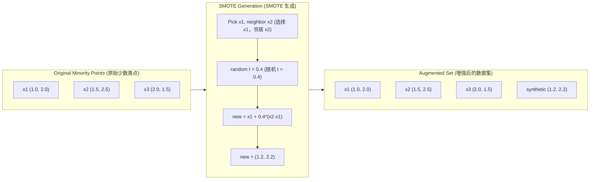

# 处理不平衡数据 (Imbalanced Data)

> 当 99% 的数据都是"正常"时，accuracy (准确率) 就是一个谎言。

**类型:** Build
**语言:** Python
**前置知识:** Phase 2, Lessons 01-09 (尤其是 evaluation metrics)
**时间:** ~90 分钟

## 学习目标

- 从零实现 SMOTE (Synthetic Minority Oversampling Technique，合成少数类过采样技术)，并解释 synthetic oversampling (合成过采样) 与 random duplication (随机复制) 的区别
- 使用 F1 score (F1 分数)、AUPRC (Precision-Recall 曲线下面积) 和 Matthews Correlation Coefficient (MCC，马修斯相关系数) 替代 accuracy (准确率) 来评估不平衡分类器
- 比较 class weighting (类别权重)、threshold tuning (阈值调优) 和 resampling (重采样) 策略，并根据 imbalance ratio (不平衡比例) 选择合适的方法
- 构建一个完整的不平衡数据处理流程，结合 SMOTE、class weights (类别权重) 和 threshold optimization (阈值优化)

## 问题背景

你构建了一个欺诈检测模型。它达到了 99.9% 的 accuracy。你正在庆祝。然后你意识到它对每一笔交易都预测"非欺诈"。

这不是 bug。当只有 0.1% 的交易是欺诈时，这是完全理性的做法。模型学习到总是猜测 majority class (多数类) 可以最小化整体误差。它在技术上是正确的，但完全无用。

这在所有真实分类场景中都会发生。疾病诊断：1% 阳性率。网络入侵：0.01% 攻击。制造缺陷：0.5% 次品。垃圾邮件过滤：20% 垃圾邮件。流失预测：5% 流失用户。minority class (少数类) 越重要，它往往就越罕见。

Accuracy (准确率) 失败的原因是它把所有正确预测同等对待。正确标记一笔合法交易和正确抓住欺诈都算作一个 accuracy 分数。但抓住欺诈才是模型存在的全部意义。我们需要 metrics (指标)、techniques (技术) 和 training strategies (训练策略) 来迫使模型关注罕见但重要的类别。

## 核心概念

### 为什么 Accuracy (准确率) 会失效

考虑一个包含 1000 个样本的数据集：990 个 negative (负类)，10 个 positive (正类)。一个总是预测 negative 的模型：

|  | Predicted Positive (预测正类) | Predicted Negative (预测负类) |
|--|---|---|
| Actually Positive (实际正类) | 0 (TP) | 10 (FN) |
| Actually Negative (实际负类) | 0 (FP) | 990 (TN) |

Accuracy = (0 + 990) / 1000 = 99.0%

这个模型抓住了零个欺诈。零个疾病。零个缺陷。但 accuracy 显示 99%。这就是为什么 accuracy 对于不平衡问题是危险的。

### 更好的指标

**Precision (精确率)** = TP / (TP + FP)。在所有被标记为 positive 的样本中，有多少确实是 positive？高 precision 意味着误报少。

**Recall (召回率)** = TP / (TP + FN)。在所有实际为 positive 的样本中，我们抓住了多少？高 recall 意味着漏检少。

**F1 Score (F1 分数)** = 2 * precision * recall / (precision + recall)。调和平均数。相比算术平均数，它对 precision 和 recall 之间的极端不平衡惩罚更重。

**F-beta Score (F-beta 分数)** = (1 + beta^2) * precision * recall / (beta^2 * precision + recall)。当 beta > 1 时，recall 更重要。当 beta < 1 时，precision 更重要。F2 在欺诈检测中很常见（漏掉欺诈比误报更糟糕）。

**AUPRC** (Area Under Precision-Recall Curve，Precision-Recall 曲线下面积)。类似 AUC-ROC，但对不平衡数据更有信息量。一个随机分类器的 AUPRC 等于 positive class rate (正类比例)（不像 ROC 那样是 0.5）。这使得改进更容易被观察到。

**Matthews Correlation Coefficient (MCC，马修斯相关系数)** = (TP * TN - FP * FN) / sqrt((TP+FP)(TP+FN)(TN+FP)(TN+FN))。范围从 -1 到 +1。只有当模型在两个类别上都表现良好时才会给出高分。即使类别大小差异很大也能保持平衡。

对于上面的"总是预测 negative"模型：precision = 0/0（未定义，通常设为 0），recall = 0/10 = 0，F1 = 0，MCC = 0。这些指标正确地识别出该模型毫无价值。

### 不平衡数据处理流程

```mermaid
flowchart TD
    A[Imbalanced Dataset (不平衡数据集)] --> B{Imbalance Ratio (不平衡比例)?}
    B -->|Mild (轻度): 80/20| C[Class Weights (类别权重)]
    B -->|Moderate (中度): 95/5| D[SMOTE + Threshold Tuning (阈值调优)]
    B -->|Severe (重度): 99/1| E[SMOTE + Class Weights (类别权重) + Threshold (阈值)]
    C --> F[Train Model (训练模型)]
    D --> F
    E --> F
    F --> G[Evaluate with F1 / AUPRC / MCC (使用 F1/AUPRC/MCC 评估)]
    G --> H{Good Enough (足够好)?}
    H -->|No| I[Try Different Strategy (尝试不同策略)]
    H -->|Yes| J[Deploy with Monitoring (部署并监控)]
    I --> B
```

### SMOTE: Synthetic Minority Oversampling Technique (合成少数类过采样技术)

Random oversampling (随机过采样) 复制现有的 minority samples (少数类样本)。这有效，但存在 overfitting (过拟合) 风险，因为模型反复看到完全相同的点。

SMOTE 创建新的 synthetic minority samples (合成少数类样本)，这些样本是合理的但不是复制品。算法如下：

1. 对于每个 minority sample (少数类样本) x，在其 k 个最近的 minority neighbors (少数类邻居) 中找到它的 k nearest neighbors (k 近邻)
2. 随机选择一个邻居
3. 在 x 和该邻居之间的线段上创建一个新样本

公式：`new_sample = x + random(0, 1) * (neighbor - x)`

这在真实的 minority points (少数类点) 之间进行插值，在特征空间的同一区域创建样本，而不仅仅是复制现有数据。



### 采样策略对比

**Random Oversampling (随机过采样)**：复制 minority samples (少数类样本) 以匹配 majority count (多数类数量)。
- 优点：简单，无信息损失
- 缺点：完全相同的副本导致 overfitting (过拟合)，增加训练时间

**Random Undersampling (随机欠采样)**：移除 majority samples (多数类样本) 以匹配 minority count (少数类数量)。
- 优点：训练速度快，简单
- 缺点：丢弃可能有用的 majority data (多数类数据)，方差更高

**SMOTE**：通过插值创建 synthetic minority samples (合成少数类样本)。
- 优点：生成新数据点，相比 random oversampling (随机过采样) 减少 overfitting (过拟合)
- 缺点：可能在 decision boundary (决策边界) 附近创建 noisy samples (噪声样本)，不考虑 majority class distribution (多数类分布)

| Strategy (策略) | Data Changed (数据变化) | Risk (风险) | When to Use (何时使用) |
|----------|-------------|------|-------------|
| Oversample (过采样) | Minority duplicated (少数类复制) | Overfitting (过拟合) | 小数据集，中度不平衡 |
| Undersample (欠采样) | Majority removed (多数类移除) | Information loss (信息损失) | 大数据集，希望快速训练 |
| SMOTE | Synthetic minority added (添加合成少数类) | Boundary noise (边界噪声) | 中度不平衡，有足够的 minority samples (少数类样本) 用于 k-NN |

### Class Weights (类别权重)

不改变数据，而是改变模型对待误差的方式。为 minority class (少数类) 的误分类分配更高的权重。

对于一个包含 950 个 negative (负类) 和 50 个 positive (正类) 样本的二分类问题：
- Weight for negative class (负类权重) = n_samples / (2 * n_negative) = 1000 / (2 * 950) = 0.526
- Weight for positive class (正类权重) = n_samples / (2 * n_positive) = 1000 / (2 * 50) = 10.0

Positive class (正类) 获得了 19 倍的权重。误分类一个 positive sample (正类样本) 的代价相当于误分类 19 个 negative samples (负类样本)。模型被迫关注 minority class (少数类)。

在 logistic regression (逻辑回归) 中，这会修改 loss function (损失函数)：

```
weighted_loss = -sum(w_i * [y_i * log(p_i) + (1-y_i) * log(1-p_i)])
```

其中 w_i 取决于样本 i 的类别。

Class weights (类别权重) 在数学期望上等价于 oversampling (过采样)，但不创建新的数据点。这使它们更快，并避免了复制样本带来的 overfitting (过拟合) 风险。

### Threshold Tuning (阈值调优)

大多数分类器输出概率。默认 threshold (阈值) 是 0.5：如果 P(positive) >= 0.5，则预测 positive。但 0.5 是任意的。当类别不平衡时，最优 threshold (阈值) 通常要低得多。

流程：
1. 训练模型
2. 在 validation set (验证集) 上获取预测概率
3. 从 0.0 到 1.0 扫描 thresholds (阈值)
4. 在每个 threshold (阈值) 处计算 F1（或你选择的指标）
5. 选择能最大化你指标的那个 threshold (阈值)

```mermaid
flowchart LR
    A[Model (模型)] --> B[Predict Probabilities (预测概率)]
    B --> C[Sweep Thresholds 0.0 to 1.0 (扫描阈值 0.0 到 1.0)]
    C --> D[Compute F1 at Each (在每个阈值计算 F1)]
    D --> E[Pick Best Threshold (选择最佳阈值)]
    E --> F[Use in Production (用于生产)]
```

一个模型可能对欺诈交易输出 P(fraud) = 0.15。在 threshold (阈值) 0.5 时，这被分类为非欺诈。在 threshold (阈值) 0.10 时，它被正确捕获。概率校准的重要性不如 ranking (排序)——只要欺诈比非欺诈获得更高的概率，就存在一个能分离它们的 threshold (阈值)。

### Cost-Sensitive Learning (代价敏感学习)

Class weights (类别权重) 的泛化。不使用统一的代价，而是分配特定的 misclassification costs (误分类代价)：

| | Predict Positive (预测正类) | Predict Negative (预测负类) |
|--|---|---|
| Actually Positive (实际正类) | 0 (correct，正确) | C_FN = 100 |
| Actually Negative (实际负类) | C_FP = 1 | 0 (correct，正确) |

漏掉一个欺诈交易 (FN) 的代价是误报 (FP) 的 100 倍。模型优化的是 total cost (总代价)，而不是 total error count (总错误数)。

当你能估计真实世界代价时，这是最原则性的方法。漏诊癌症的代价与导致额外活检的误报代价截然不同。明确这些代价会迫使模型做出正确的权衡。

### Decision Flowchart (决策流程图)

```mermaid
flowchart TD
    A[Start: Imbalanced Dataset (开始：不平衡数据集)] --> B{How imbalanced (有多不平衡)?}
    B -->|"< 70/30"| C["Mild (轻度): try class weights first (先尝试类别权重)"]
    B -->|"70/30 to 95/5"| D["Moderate (中度): SMOTE + class weights (类别权重)"]
    B -->|"> 95/5"| E["Severe (重度): combine multiple strategies (组合多种策略)"]
    C --> F{Enough data (数据足够)?}
    D --> F
    E --> F
    F -->|"< 1000 samples"| G["Oversample (过采样) or SMOTE, avoid undersampling (避免欠采样)"]
    F -->|"1000-10000"| H["SMOTE + threshold tuning (阈值调优)"]
    F -->|"> 10000"| I["Undersampling (欠采样) OK, or class weights (类别权重)"]
    G --> J[Train + Evaluate with F1/AUPRC (用 F1/AUPRC 训练+评估)]
    H --> J
    I --> J
    J --> K{Recall high enough (召回率足够高)?}
    K -->|No| L[Lower threshold (降低阈值)]
    K -->|Yes| M{Precision acceptable (精确率可接受)?}
    M -->|No| N[Raise threshold or add features (提高阈值或增加特征)]
    M -->|Yes| O[Ship it (部署)]
```

## 动手实现

### Step 1: 生成不平衡数据集

```python
import numpy as np


def make_imbalanced_data(n_majority=950, n_minority=50, seed=42):
    rng = np.random.RandomState(seed)

    X_maj = rng.randn(n_majority, 2) * 1.0 + np.array([0.0, 0.0])
    X_min = rng.randn(n_minority, 2) * 0.8 + np.array([2.5, 2.5])

    X = np.vstack([X_maj, X_min])
    y = np.concatenate([np.zeros(n_majority), np.ones(n_minority)])

    shuffle_idx = rng.permutation(len(y))
    return X[shuffle_idx], y[shuffle_idx]
```

### Step 2: 从零实现 SMOTE

```python
def euclidean_distance(a, b):
    return np.sqrt(np.sum((a - b) ** 2))


def find_k_neighbors(X, idx, k):
    distances = []
    for i in range(len(X)):
        if i == idx:
            continue
        d = euclidean_distance(X[idx], X[i])
        distances.append((i, d))
    distances.sort(key=lambda x: x[1])
    return [d[0] for d in distances[:k]]


def smote(X_minority, k=5, n_synthetic=100, seed=42):
    rng = np.random.RandomState(seed)
    n_samples = len(X_minority)
    k = min(k, n_samples - 1)
    synthetic = []

    for _ in range(n_synthetic):
        idx = rng.randint(0, n_samples)
        neighbors = find_k_neighbors(X_minority, idx, k)
        neighbor_idx = neighbors[rng.randint(0, len(neighbors))]
        t = rng.random()
        new_point = X_minority[idx] + t * (X_minority[neighbor_idx] - X_minority[idx])
        synthetic.append(new_point)

    return np.array(synthetic)
```

### Step 3: 随机过采样和欠采样

```python
def random_oversample(X, y, seed=42):
    rng = np.random.RandomState(seed)
    classes, counts = np.unique(y, return_counts=True)
    max_count = counts.max()

    X_resampled = list(X)
    y_resampled = list(y)

    for cls, count in zip(classes, counts):
        if count < max_count:
            cls_indices = np.where(y == cls)[0]
            n_needed = max_count - count
            chosen = rng.choice(cls_indices, size=n_needed, replace=True)
            X_resampled.extend(X[chosen])
            y_resampled.extend(y[chosen])

    X_out = np.array(X_resampled)
    y_out = np.array(y_resampled)
    shuffle = rng.permutation(len(y_out))
    return X_out[shuffle], y_out[shuffle]


def random_undersample(X, y, seed=42):
    rng = np.random.RandomState(seed)
    classes, counts = np.unique(y, return_counts=True)
    min_count = counts.min()

    X_resampled = []
    y_resampled = []

    for cls in classes:
        cls_indices = np.where(y == cls)[0]
        chosen = rng.choice(cls_indices, size=min_count, replace=False)
        X_resampled.extend(X[chosen])
        y_resampled.extend(y[chosen])

    X_out = np.array(X_resampled)
    y_out = np.array(y_resampled)
    shuffle = rng.permutation(len(y_out))
    return X_out[shuffle], y_out[shuffle]
```

### Step 4: 带类别权重的逻辑回归

```python
def sigmoid(z):
    return 1.0 / (1.0 + np.exp(-np.clip(z, -500, 500)))


def logistic_regression_weighted(X, y, weights, lr=0.01, epochs=200):
    n_samples, n_features = X.shape
    w = np.zeros(n_features)
    b = 0.0

    for _ in range(epochs):
        z = X @ w + b
        pred = sigmoid(z)
        error = pred - y
        weighted_error = error * weights

        gradient_w = (X.T @ weighted_error) / n_samples
        gradient_b = np.mean(weighted_error)

        w -= lr * gradient_w
        b -= lr * gradient_b

    return w, b


def compute_class_weights(y):
    classes, counts = np.unique(y, return_counts=True)
    n_samples = len(y)
    n_classes = len(classes)
    weight_map = {}
    for cls, count in zip(classes, counts):
        weight_map[cls] = n_samples / (n_classes * count)
    return np.array([weight_map[yi] for yi in y])
```

### Step 5: 阈值调优

```python
def find_optimal_threshold(y_true, y_probs, metric="f1"):
    best_threshold = 0.5
    best_score = -1.0

    for threshold in np.arange(0.05, 0.96, 0.01):
        y_pred = (y_probs >= threshold).astype(int)
        tp = np.sum((y_pred == 1) & (y_true == 1))
        fp = np.sum((y_pred == 1) & (y_true == 0))
        fn = np.sum((y_pred == 0) & (y_true == 1))

        if metric == "f1":
            precision = tp / (tp + fp) if (tp + fp) > 0 else 0.0
            recall = tp / (tp + fn) if (tp + fn) > 0 else 0.0
            score = 2 * precision * recall / (precision + recall) if (precision + recall) > 0 else 0.0
        elif metric == "recall":
            score = tp / (tp + fn) if (tp + fn) > 0 else 0.0
        elif metric == "precision":
            score = tp / (tp + fp) if (tp + fp) > 0 else 0.0

        if score > best_score:
            best_score = score
            best_threshold = threshold

    return best_threshold, best_score
```

### Step 6: 评估函数

```python
def confusion_matrix_values(y_true, y_pred):
    tp = np.sum((y_pred == 1) & (y_true == 1))
    tn = np.sum((y_pred == 0) & (y_true == 0))
    fp = np.sum((y_pred == 1) & (y_true == 0))
    fn = np.sum((y_pred == 0) & (y_true == 1))
    return tp, tn, fp, fn


def compute_metrics(y_true, y_pred):
    tp, tn, fp, fn = confusion_matrix_values(y_true, y_pred)
    accuracy = (tp + tn) / (tp + tn + fp + fn)
    precision = tp / (tp + fp) if (tp + fp) > 0 else 0.0
    recall = tp / (tp + fn) if (tp + fn) > 0 else 0.0
    f1 = 2 * precision * recall / (precision + recall) if (precision + recall) > 0 else 0.0

    denom = np.sqrt(float((tp + fp) * (tp + fn) * (tn + fp) * (tn + fn)))
    mcc = (tp * tn - fp * fn) / denom if denom > 0 else 0.0

    return {
        "accuracy": accuracy,
        "precision": precision,
        "recall": recall,
        "f1": f1,
        "mcc": mcc,
    }
```

### Step 7: 对比所有方法

```python
X, y = make_imbalanced_data(950, 50, seed=42)
split = int(0.8 * len(y))
X_train, X_test = X[:split], X[split:]
y_train, y_test = y[:split], y[split:]

# Baseline: no treatment (基线：无处理)
w_base, b_base = logistic_regression_weighted(
    X_train, y_train, np.ones(len(y_train)), lr=0.1, epochs=300
)
probs_base = sigmoid(X_test @ w_base + b_base)
preds_base = (probs_base >= 0.5).astype(int)

# Oversampled (过采样)
X_over, y_over = random_oversample(X_train, y_train)
w_over, b_over = logistic_regression_weighted(
    X_over, y_over, np.ones(len(y_over)), lr=0.1, epochs=300
)
preds_over = (sigmoid(X_test @ w_over + b_over) >= 0.5).astype(int)

# SMOTE
minority_mask = y_train == 1
X_minority = X_train[minority_mask]
synthetic = smote(X_minority, k=5, n_synthetic=len(y_train) - 2 * int(minority_mask.sum()))
X_smote = np.vstack([X_train, synthetic])
y_smote = np.concatenate([y_train, np.ones(len(synthetic))])
w_sm, b_sm = logistic_regression_weighted(
    X_smote, y_smote, np.ones(len(y_smote)), lr=0.1, epochs=300
)
preds_smote = (sigmoid(X_test @ w_sm + b_sm) >= 0.5).astype(int)

# Class weights (类别权重)
sample_weights = compute_class_weights(y_train)
w_cw, b_cw = logistic_regression_weighted(
    X_train, y_train, sample_weights, lr=0.1, epochs=300
)
probs_cw = sigmoid(X_test @ w_cw + b_cw)
preds_cw = (probs_cw >= 0.5).astype(int)

# Threshold tuning (阈值调优) (tune on held-out validation set, not test set)
probs_val = sigmoid(X_val @ w_cw + b_cw)
best_thresh, best_f1 = find_optimal_threshold(y_val, probs_val, metric="f1")
preds_thresh = (probs_cw >= best_thresh).astype(int)
```

代码文件在一个脚本中运行所有这些内容并打印结果。

## 实际应用

使用 scikit-learn 和 imbalanced-learn，这些技术只需一行代码：

```python
from sklearn.linear_model import LogisticRegression
from sklearn.metrics import classification_report, f1_score
from sklearn.model_selection import train_test_split
from imblearn.over_sampling import SMOTE
from imblearn.under_sampling import RandomUnderSampler
from imblearn.pipeline import Pipeline

X_train, X_test, y_train, y_test = train_test_split(X, y, stratify=y)

model_weighted = LogisticRegression(class_weight="balanced")
model_weighted.fit(X_train, y_train)
print(classification_report(y_test, model_weighted.predict(X_test)))

smote = SMOTE(random_state=42)
X_resampled, y_resampled = smote.fit_resample(X_train, y_train)
model_smote = LogisticRegression()
model_smote.fit(X_resampled, y_resampled)
print(classification_report(y_test, model_smote.predict(X_test)))

pipeline = Pipeline([
    ("smote", SMOTE()),
    ("model", LogisticRegression(class_weight="balanced")),
])
pipeline.fit(X_train, y_train)
print(classification_report(y_test, pipeline.predict(X_test)))
```

从零开始的实现展示了每种技术的具体作用。SMOTE 只是对 minority class (少数类) 进行 k-NN 插值。Class weights (类别权重) 乘以 loss (损失)。Threshold tuning (阈值调优) 是对 cutoff (截断点) 的 for-loop (循环)。没有魔法。

## 交付物

本课产出：
- `outputs/skill-imbalanced-data.md` -- 处理不平衡分类问题的决策清单

## 练习

1. **Borderline-SMOTE**: 修改 SMOTE 实现，只为靠近 decision boundary (决策边界) 的 minority points (少数类点)（那些 k-nearest neighbors (k 近邻) 中包含 majority class samples (多数类样本) 的点）生成合成样本。在类别重叠的数据集上对比标准 SMOTE 的结果。

2. **Cost matrix optimization (代价矩阵优化)**: 实现 cost-sensitive learning (代价敏感学习)，其中代价矩阵是一个参数。创建一个函数，接收代价矩阵并返回最小化期望代价的最优预测。用不同的代价比例（1:10、1:100、1:1000）测试，并绘制 precision-recall tradeoff (精确率-召回率权衡) 如何变化。

3. **Threshold calibration (阈值校准)**: 实现 Platt scaling（在模型原始输出上拟合一个 logistic regression 以产生校准后的概率）。对比校准前后的 precision-recall curve (精确率-召回率曲线)。证明校准不改变 ranking (排序)（AUC 保持不变），但使概率更有意义。

4. **Ensemble with balanced bagging (平衡 bagging 集成)**: 训练多个模型，每个模型在一个 balanced bootstrap sample (平衡自助样本)（所有 minority + majority 的随机子集）上训练。平均它们的预测。对比这种方法与单个 SMOTE 模型。测量性能和跨运行的 variance (方差)。

5. **Imbalance ratio experiment (不平衡比例实验)**: 取一个平衡数据集，逐步增加 imbalance ratio (不平衡比例)（50/50、70/30、90/10、95/5、99/1）。对每个比例，分别用和不用 SMOTE 训练。绘制两种方法的 F1 与 imbalance ratio 的关系图。SMOTE 在什么比例开始产生有意义的差异？

## 关键术语

| Term (术语) | What people say (人们的说法) | What it actually means (实际含义) |
|------|----------------|----------------------|
| Class imbalance (类别不平衡) | "One class has way more samples" ("一个类别的样本多得多") | 数据集中类别的分布严重偏斜，导致模型偏向 majority class (多数类) |
| SMOTE | "Synthetic oversampling" ("合成过采样") | 通过在现有 minority samples (少数类样本) 和它们的 k-nearest minority neighbors (k 近邻少数类邻居) 之间插值来创建新的 minority samples (少数类样本) |
| Class weights (类别权重) | "Making errors on rare classes more expensive" ("让罕见类别的错误更昂贵") | 将 loss function (损失函数) 乘以类别特定权重，使模型对 minority misclassification (少数类误分类) 的惩罚更重 |
| Threshold tuning (阈值调优) | "Moving the decision boundary" ("移动决策边界") | 将分类的 probability cutoff (概率截断点) 从默认的 0.5 改为优化目标指标的值 |
| Precision-recall tradeoff (精确率-召回率权衡) | "You cannot have both" ("两者不可兼得") | 降低 threshold (阈值) 会抓住更多 positive (召回率提高)，但也会标记更多 false positives (精确率降低)，反之亦然 |
| AUPRC | "Area under the PR curve" ("PR 曲线下面积") | 将 precision-recall curve (精确率-召回率曲线) 汇总为单个数字；当类别严重不平衡时比 AUC-ROC 更有信息量 |
| Matthews Correlation Coefficient (MCC，马修斯相关系数) | "The balanced metric" ("平衡指标") | 预测标签和实际标签之间的相关性，只有当模型在两个类别上都表现良好时才会产生高分 |
| Cost-sensitive learning (代价敏感学习) | "Different mistakes cost different amounts" ("不同的错误代价不同") | 将真实世界的 misclassification costs (误分类代价) 纳入训练目标，使模型优化总代价而非错误数量 |
| Random oversampling (随机过采样) | "Duplicate the minority" ("复制少数类") | 重复 minority class samples (少数类样本) 以平衡类别数量；简单但存在 overfitting (过拟合) 到重复点的风险 |

## 延伸阅读

- [SMOTE: Synthetic Minority Over-sampling Technique (Chawla et al., 2002)](https://arxiv.org/abs/1106.1813) -- 原始 SMOTE 论文，仍然是不平衡学习领域被引用最多的工作
- [Learning from Imbalanced Data (He & Garcia, 2009)](https://ieeexplore.ieee.org/document/5128907) -- 涵盖采样、代价敏感和算法方法的全面综述
- [imbalanced-learn documentation](https://imbalanced-learn.org/stable/) -- Python 库，包含 SMOTE 变体、undersampling (欠采样) 策略和 pipeline 集成
- [The Precision-Recall Plot Is More Informative than the ROC Plot (Saito & Rehmsmeier, 2015)](https://journals.plos.org/plosone/article?id=10.1371/journal.pone.0118432) -- 何时以及为什么在不平衡问题上优先选择 PR 曲线而非 ROC 曲线
