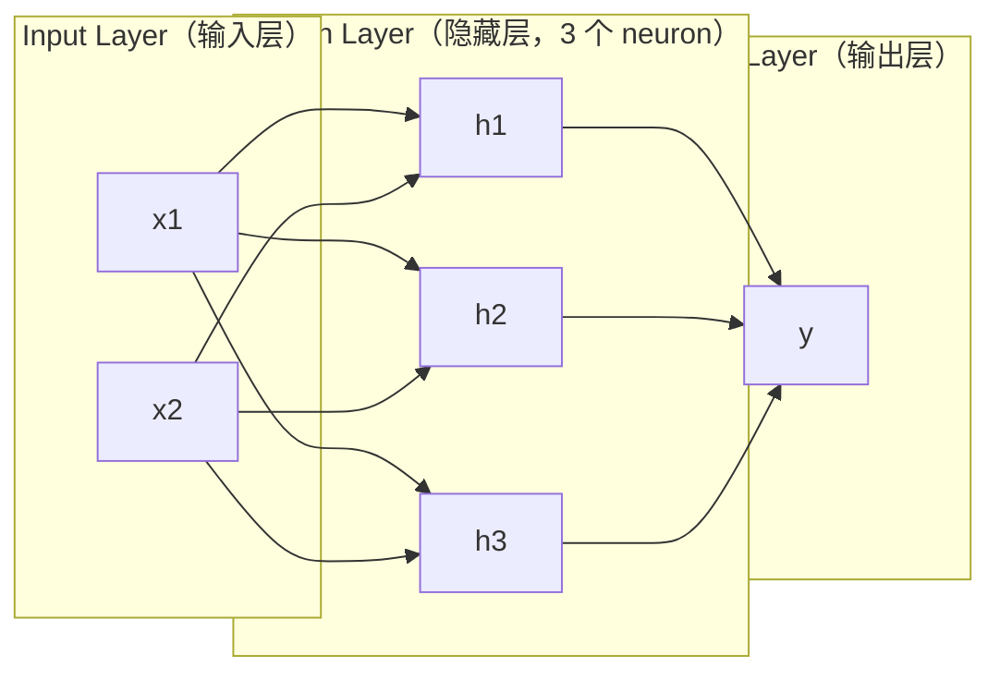
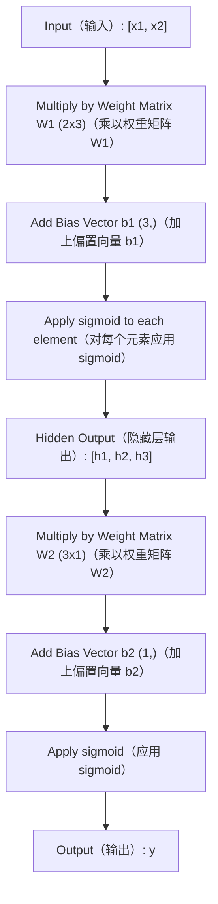
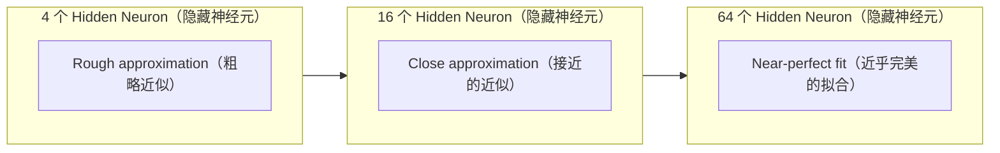

# Multi-Layer Networks and Forward Pass（多层网络与前向传播）

> 一个 neuron（神经元）画一条线。把它们堆叠起来，你就能画出任何东西。

**Type:** Build
**Languages:** Python
**Prerequisites:** Phase 01 (Math Foundations), Lesson 03.01 (The Perceptron)
**Time:** ~90 分钟

## Learning Objectives（学习目标）

- 使用 Layer 和 Network 类从零构建一个 multi-layer network（多层网络），并完成完整的 forward pass（前向传播）
- 追踪网络每一层的矩阵维度，并识别 shape mismatch（维度不匹配）
- 解释如何通过堆叠 nonlinear activation（非线性激活）使网络学习弯曲的 decision boundary（决策边界）
- 使用 2-2-1 架构和 hand-tuned sigmoid（S型函数）weight（权重）解决 XOR 问题

## The Problem（问题）

单个 neuron（神经元）是一条线。仅此而已。一条穿过数据的直线。AI 中的每个实际问题——图像识别、语言理解、下围棋——都需要曲线。将 neuron（神经元）堆叠成层，就是获得曲线的方式。

1969 年，Minsky 和 Papert 证明了这一限制是致命的：single-layer network（单层网络）无法学习 XOR。不是"学习困难"——而是数学上不可能。XOR 真值表将 [0,1] 和 [1,0] 放在一侧，[0,0] 和 [1,1] 放在另一侧。没有一条直线能将它们分开。

这让神经网络的研究资金中断了十多年。事后看来，解决办法显而易见：不要只使用一层。将 neuron（神经元）堆叠成层。让第一层将输入空间切割成新的 feature（特征），让第二层将这些 feature（特征）组合成任何单条线都无法做出的决策。

这个堆叠就是 multi-layer network（多层网络）。它是当今生产中每个 deep learning（深度学习）模型的基础。forward pass（前向传播）——数据从输入流经 hidden layer（隐藏层）到达 output layer（输出层）——是你在其他任何事情生效之前需要构建的第一件事。

## The Concept（概念）

### Layers: Input, Hidden, Output（层：输入层、隐藏层、输出层）

一个 multi-layer network（多层网络）有三种类型的层：

**Input layer（输入层）**——不完全是真正的层。它保存你的原始数据。两个 feature（特征）意味着两个输入节点。这里不发生任何计算。

**Hidden layers（隐藏层）**——工作发生的地方。每个 neuron（神经元）接收上一层的所有输出，应用 weight（权重）和 bias（偏置），然后将结果传递给 activation function（激活函数）。"隐藏"是因为你在训练数据中永远看不到这些值。

**Output layer（输出层）**——最终答案。对于 binary classification（二分类），一个带 sigmoid（S型函数）的 neuron（神经元）。对于 multi-class classification（多分类），每个类别一个 neuron（神经元）。



这是一个 2-3-1 网络。两个输入，三个 hidden neuron（隐藏神经元），一个输出。每条连接携带一个 weight（权重）。每个 neuron（神经元）（除了输入层）携带一个 bias（偏置）。

每一层产生一个称为 hidden state（隐藏状态）的数字向量。对于文本，hidden state（隐藏状态）增加维度——将一个词编码为 768 个数字以捕获语义含义。对于图像，它们降低维度——将数百万像素压缩为可管理的表示。hidden state（隐藏状态）是学习发生的地方。

### Neurons and Activations（神经元与激活）

每个 neuron（神经元）做三件事：

1. 将每个输入乘以其对应的 weight（权重）
2. 将所有乘积相加并加上一个 bias（偏置）
3. 将总和传递给 activation function（激活函数）

目前，activation function（激活函数）是 sigmoid（S型函数）：

```
sigmoid(z) = 1 / (1 + e^(-z))
```

sigmoid（S型函数）将任何数字压缩到 (0, 1) 范围内。大的正输入推向 1。大的负输入推向 0。零映射到 0.5。这条平滑的曲线使学习成为可能——与 perceptron（感知器）的硬 step function（阶跃函数）不同，sigmoid（S型函数）在每个点都有 gradient（梯度）。

### Forward Pass: How Data Flows（前向传播：数据如何流动）

forward pass（前向传播）将输入数据通过网络逐层推送，直到到达 output layer（输出层）。forward pass（前向传播）期间不发生学习。它是纯粹的计算：乘、加、激活、重复。



在每一层，三个操作按顺序发生：

```
z = W * input + b       (linear transformation（线性变换）)
a = sigmoid(z)           (activation（激活）)
```

一层的输出成为下一层的输入。这就是整个 forward pass（前向传播）。

### Matrix Dimensions（矩阵维度）

追踪维度是 deep learning（深度学习）中最重要的调试技能。以下是 2-3-1 网络：

| Step（步骤） | Operation（操作） | Dimensions（维度） | Result Shape（结果形状） |
|------|-----------|------------|-------------|
| Input（输入） | x | -- | (2,) |
| Hidden linear（隐藏层线性变换） | W1 * x + b1 | W1: (3, 2), b1: (3,) | (3,) |
| Hidden activation（隐藏层激活） | sigmoid(z1) | -- | (3,) |
| Output linear（输出层线性变换） | W2 * h + b2 | W2: (1, 3), b2: (1,) | (1,) |
| Output activation（输出层激活） | sigmoid(z2) | -- | (1,) |

规则：第 k 层的 weight matrix（权重矩阵）W 的形状为 (neurons_in_layer_k, neurons_in_layer_k_minus_1)。行匹配当前层。列匹配前一层。如果形状对不上，你就有 bug。

### Universal Approximation Theorem（通用近似定理）

1989 年，George Cybenko 证明了一个 remarkable（非凡的）结论：一个具有单个 hidden layer（隐藏层）和足够多 neuron（神经元）的 neural network（神经网络）可以以任意期望的精度近似任何 continuous function（连续函数）。

这并不意味着一个 hidden layer（隐藏层）总是最好的。它意味着该架构在理论上是 capable（有能力的）。在实践中，deeper networks（更深的网络）（更多层，每层更少 neuron（神经元））用比 shallow-wide network（浅而宽的网络）少得多的总 parameter（参数）学习相同的函数。这就是 deep learning（深度学习）有效的原因。

直觉：hidden layer（隐藏层）中的每个 neuron（神经元）学习一个"bump（凸起）"或 feature（特征）。在正确位置放置足够的 bump（凸起）可以近似任何平滑曲线。更多 neuron（神经元），更多 bump（凸起），更好的近似。



### Composability（可组合性）

Neural networks（神经网络）是可组合的。你可以堆叠它们、链式连接它们、并行运行它们。Whisper 模型使用 encoder network（编码器网络）处理音频，使用单独的 decoder network（解码器网络）生成文本。现代 LLM 是 decoder-only（仅解码器）。BERT 是 encoder-only（仅编码器）。T5 是 encoder-decoder（编码器-解码器）。架构选择决定了模型能做什么。

## Build It（动手构建）

纯 Python。没有 numpy。每个矩阵操作都从零手写。

### Step 1: Sigmoid Activation（步骤 1：Sigmoid 激活）

```python
import math

def sigmoid(x):
    x = max(-500.0, min(500.0, x))
    return 1.0 / (1.0 + math.exp(-x))
```

限制到 [-500, 500] 可防止溢出。`math.exp(500)` 很大但是有限的。`math.exp(1000)` 是无穷大。

### Step 2: Layer Class（步骤 2：Layer 类）

deep learning（深度学习）中最重要的操作是 matrix multiplication（矩阵乘法）。每一层、每一个 attention head（注意力头）、每一次 forward pass（前向传播）——全都是 matmul。一个 linear layer（线性层）接收输入向量，将其乘以 weight matrix（权重矩阵），并加上 bias vector（偏置向量）：y = Wx + b。这个单一等式占 neural network（神经网络）中 90% 的计算量。

一个 layer（层）保存一个 weight matrix（权重矩阵）和一个 bias vector（偏置向量）。它的 forward 方法接收输入向量并返回激活后的输出。

```python
class Layer:
    def __init__(self, n_inputs, n_neurons, weights=None, biases=None):
        if weights is not None:
            self.weights = weights
        else:
            import random
            self.weights = [
                [random.uniform(-1, 1) for _ in range(n_inputs)]
                for _ in range(n_neurons)
            ]
        if biases is not None:
            self.biases = biases
        else:
            self.biases = [0.0] * n_neurons

    def forward(self, inputs):
        self.last_input = inputs
        self.last_output = []
        for neuron_idx in range(len(self.weights)):
            z = sum(
                w * x for w, x in zip(self.weights[neuron_idx], inputs)
            )
            z += self.biases[neuron_idx]
            self.last_output.append(sigmoid(z))
        return self.last_output
```

weight matrix（权重矩阵）的形状为 (n_neurons, n_inputs)。每一行是一个 neuron（神经元）跨所有输入的 weight（权重）。forward 方法遍历 neuron（神经元），计算加权和加上 bias（偏置），应用 sigmoid（S型函数），并收集结果。

### Step 3: Network Class（步骤 3：Network 类）

一个 network（网络）是一个 layer（层）的列表。forward pass（前向传播）将它们链式连接：第 k 层的输出送入第 k+1 层。

```python
class Network:
    def __init__(self, layers):
        self.layers = layers

    def forward(self, inputs):
        current = inputs
        for layer in self.layers:
            current = layer.forward(current)
        return current
```

这就是整个 forward pass（前向传播）。四行逻辑。数据进入，流经每一层，从另一端出来。

### Step 4: XOR with Hand-Tuned Weights（步骤 4：使用手工调优权重的 XOR）

在 Lesson 01 中，我们通过组合 OR、NAND 和 AND perceptron（感知器）解决了 XOR。现在用我们的 Layer 和 Network 类做同样的事情。2-2-1 架构：两个输入，两个 hidden neuron（隐藏神经元），一个输出。

```python
hidden = Layer(
    n_inputs=2,
    n_neurons=2,
    weights=[[20.0, 20.0], [-20.0, -20.0]],
    biases=[-10.0, 30.0],
)

output = Layer(
    n_inputs=2,
    n_neurons=1,
    weights=[[20.0, 20.0]],
    biases=[-30.0],
)

xor_net = Network([hidden, output])

xor_data = [
    ([0, 0], 0),
    ([0, 1], 1),
    ([1, 0], 1),
    ([1, 1], 0),
]

for inputs, expected in xor_data:
    result = xor_net.forward(inputs)
    predicted = 1 if result[0] >= 0.5 else 0
    print(f"  {inputs} -> {result[0]:.6f} (rounded: {predicted}, expected: {expected})")
```

大的 weight（权重）(20, -20) 使 sigmoid（S型函数）像 step function（阶跃函数）一样工作。第一个 hidden neuron（隐藏神经元）近似 OR。第二个近似 NAND。output neuron（输出神经元）将它们组合成 AND，这就是 XOR。

### Step 5: Circle Classification（步骤 5：圆形分类）

一个更难的问题：将 2D 点分类为在以原点为中心、半径为 0.5 的圆内或圆外。这需要一个弯曲的 decision boundary（决策边界）——单个 perceptron（感知器）不可能做到。

```python
import random
import math

random.seed(42)

data = []
for _ in range(200):
    x = random.uniform(-1, 1)
    y = random.uniform(-1, 1)
    label = 1 if (x * x + y * y) < 0.25 else 0
    data.append(([x, y], label))

circle_net = Network([
    Layer(n_inputs=2, n_neurons=8),
    Layer(n_inputs=8, n_neurons=1),
])
```

使用随机 weight（权重），网络分类效果不会好。但 forward pass（前向传播）仍然运行。这就是重点——forward pass（前向传播）只是计算。学习正确的 weight（权重）是 backpropagation（反向传播），将在 Lesson 03 中介绍。

```python
correct = 0
for inputs, expected in data:
    result = circle_net.forward(inputs)
    predicted = 1 if result[0] >= 0.5 else 0
    if predicted == expected:
        correct += 1

print(f"Accuracy with random weights: {correct}/{len(data)} ({100*correct/len(data):.1f}%)")
```

随机 weight（权重）给出很差的准确率——往往比猜测多数类别更差。经过训练（Lesson 03）后，这个具有 8 个 hidden neuron（隐藏神经元）的相同架构将画出一条弯曲的边界，将内部与外部分开。

## Use It（使用它）

PyTorch 用四行代码完成上述所有内容：

```python
import torch
import torch.nn as nn

model = nn.Sequential(
    nn.Linear(2, 8),
    nn.Sigmoid(),
    nn.Linear(8, 1),
    nn.Sigmoid(),
)

x = torch.tensor([[0.0, 0.0], [0.0, 1.0], [1.0, 0.0], [1.0, 1.0]])
output = model(x)
print(output)
```

`nn.Linear(2, 8)` 是你的 Layer 类：weight matrix（权重矩阵）形状为 (8, 2)，bias vector（偏置向量）形状为 (8,)。`nn.Sigmoid()` 是你的 sigmoid function（S型函数），逐元素应用。`nn.Sequential` 是你的 Network 类：按顺序链式连接 layer（层）。

区别在于速度和规模。PyTorch 在 GPU 上运行，处理数百万样本的 batch（批量），并自动计算 backpropagation（反向传播）的 gradient（梯度）。但 forward pass（前向传播）逻辑与你刚才从零构建的完全相同。

## Ship It（交付）

本课程产出一个可复用的 prompt，用于设计网络架构：

- `outputs/prompt-network-architect.md`

当你需要决定一个给定问题使用多少层、每层多少 neuron（神经元）以及使用哪种 activation function（激活函数）时，使用它。

## Exercises（练习）

1. 构建一个 2-4-2-1 网络（两个 hidden layer（隐藏层）），并在 XOR 数据上运行 forward pass（前向传播），使用随机 weight（权重）。打印中间 hidden layer（隐藏层）的输出，以查看表示如何在每一层变换。

2. 将 circle classifier（圆形分类器）中的 hidden layer（隐藏层）大小从 8 改为 2，然后改为 32。每次使用随机 weight（权重）运行 forward pass（前向传播）。hidden neuron（隐藏神经元）的数量会改变输出范围或分布吗？为什么？

3. 在 Network 类上实现一个 `count_parameters` 方法，返回可训练的 weight（权重）和 bias（偏置）的总数。在 784-256-128-10 网络（经典的 MNIST 架构）上测试它。它有多少 parameter（参数）？

4. 为一个 3-4-4-2 网络构建 forward pass（前向传播）。输入 RGB 颜色值（归一化到 0-1）并观察两个输出。这是一个简单颜色分类器（两类）的架构。

5. 将 sigmoid（S型函数）替换为"leaky step"函数：如果 z < 0 返回 0.01 * z，否则返回 1.0。在 XOR 上运行 forward pass（前向传播），使用与步骤 4 相同的手工调优 weight（权重）。它还能工作吗？为什么平滑的 sigmoid（S型函数）比硬截断更受青睐？

## Key Terms（关键术语）

| Term（术语） | What people say（人们的说法） | What it actually means（实际含义） |
|------|----------------|----------------------|
| Forward pass（前向传播） | "Running the model（运行模型）" | 将输入推过每一层——乘以 weight（权重），加上 bias（偏置），激活——以产生输出 |
| Hidden layer（隐藏层） | "The middle part（中间部分）" | 输入和输出之间的任何层，其值在数据中不直接观察 |
| Multi-layer network（多层网络） | "A deep neural network（深度神经网络）" | 顺序堆叠的 neuron（神经元）层，其中每层的输出送入下一层的输入 |
| Activation function（激活函数） | "The nonlinearity（非线性）" | 在线性变换后应用的函数，将曲线引入 decision boundary（决策边界） |
| Sigmoid（S型函数） | "The S-curve（S曲线）" | sigma(z) = 1/(1+e^(-z))，将任何实数压缩到 (0,1)，处处平滑且可微 |
| Weight matrix（权重矩阵） | "The parameters（参数）" | 形状为 (current_layer_neurons, previous_layer_neurons) 的矩阵 W，包含可学习的连接强度 |
| Bias vector（偏置向量） | "The offset（偏移）" | 在矩阵乘法后加上的向量，允许 neuron（神经元）在所有输入为零时也能激活 |
| Universal approximation（通用近似） | "Neural nets can learn anything（神经网络可以学习任何东西）" | 一个具有足够多 neuron（神经元）的 hidden layer（隐藏层）可以近似任何 continuous function（连续函数）——但"足够"可能意味着数十亿 |
| Linear transformation（线性变换） | "The matrix multiply step（矩阵乘法步骤）" | z = W * x + b，激活前的计算，将输入映射到新空间 |
| Decision boundary（决策边界） | "Where the classifier switches（分类器切换的地方）" | 输入空间中 network output（网络输出）越过分类阈值的面 |

## Further Reading（延伸阅读）

- Michael Nielsen, "Neural Networks and Deep Learning", Chapter 1-2 (http://neuralnetworksanddeeplearning.com/) —— 对 forward pass（前向传播）和网络结构最清晰的免费解释，带有交互式可视化
- Cybenko, "Approximation by Superpositions of a Sigmoidal Function" (1989) —— 原始 universal approximation theorem（通用近似定理）论文，出奇地易读
- 3Blue1Brown, "But what is a neural network?" (https://www.youtube.com/watch?v=aircAruvnKk) —— 20 分钟的 layer（层）、weight（权重）和 forward pass（前向传播）可视化讲解，建立正确的心智模型
- Goodfellow, Bengio, Courville, "Deep Learning", Chapter 6 (https://www.deeplearningbook.org/) —— multi-layer network（多层网络）的标准参考书，免费在线阅读
