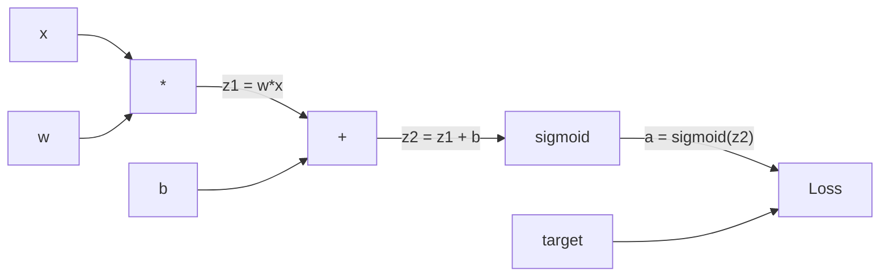
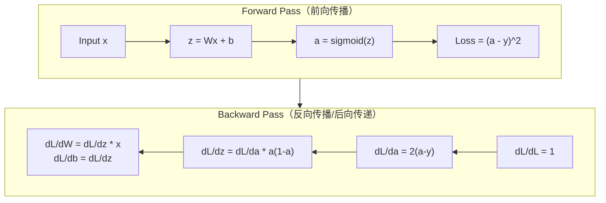
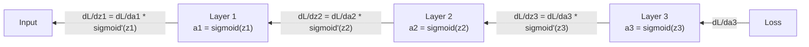

# 从零实现反向传播

> backpropagation（反向传播）是让学习成为可能的算法。没有它，神经网络只是昂贵的随机数生成器。

**类型:** Build
**语言:** Python
**前置条件:** 课程 03.02（多层网络）
**时间:** ~120 分钟

## 学习目标

- 实现基于 Value 的 autograd（自动微分）引擎，构建计算图并通过 topological sort（拓扑排序）计算 gradient（梯度）
- 使用 chain rule（链式法则）推导加法、乘法和 sigmoid（S型函数）的 backward pass（反向传播/后向传递）
- 仅使用从零实现的 backpropagation（反向传播）引擎，在 XOR 和圆形分类任务上训练多层网络
- 识别 deep sigmoid network（深层 sigmoid 网络）中的 vanishing gradient（梯度消失）问题，并解释 gradient（梯度）为何呈指数级缩小

## 问题背景

你的网络有一个 hidden layer（隐藏层），768 个输入和 3072 个输出。那就是 2,359,296 个 weight（权重）。它做出了错误预测。哪些 weight（权重）导致了错误？逐个测试每个 weight（权重）意味着 230 万次 forward pass（前向传播）。backpropagation（反向传播）在单次 backward pass（反向传播/后向传递）中计算全部 230 万个 gradient（梯度）。这不是优化，而是"可训练"与"不可能"之间的根本区别。

朴素方法：取一个 weight（权重），微调一小点，再次运行 forward pass（前向传播），测量 loss function（损失函数）是上升还是下降。这给出了该 weight（权重）的 gradient（梯度）。现在对网络中的每个 weight（权重）都这样做。乘以数千个训练步骤和数百万个数据点。你需要地质年代才能训练出任何有用的东西。

backpropagation（反向传播）解决了这个问题。一次 forward pass（前向传播），一次 backward pass（反向传播/后向传递），所有 gradient（梯度）计算完成。诀窍来自微积分中的 chain rule（链式法则），系统地应用于计算图。这是让 deep learning（深度学习）实用的算法。没有它，我们仍将困在玩具问题上。

## 核心概念

### 将 Chain Rule（链式法则）应用于网络

你在 Phase 01, Lesson 05 中学过 chain rule（链式法则）。快速回顾：如果 y = f(g(x))，那么 dy/dx = f'(g(x)) * g'(x)。你沿着链条相乘导数。

在神经网络中，"链条"是从输入到 loss function（损失函数）的操作序列。每层应用 weight（权重）、加上 bias（偏置）、通过 activation function（激活函数）传递。loss function（损失函数）将最终输出与目标值比较。backpropagation（反向传播）沿着这条链反向追踪，计算每个操作对误差的贡献。

### 计算图

每次 forward pass（前向传播）都会构建一个图。每个节点是一个操作（乘法、加法、sigmoid）。每条边向前传递数值，向后传递 gradient（梯度）。



forward pass（前向传播）：数值从左向右流动。x 和 w 产生 z1 = w*x。加上 b 得到 z2。sigmoid 给出 activation a。将 a 与目标 y 用 loss function（损失函数）比较。

backward pass（反向传播/后向传递）：gradient（梯度）从右向左流动。从 dL/da（loss 随 activation 的变化）开始。乘以 da/dz2（sigmoid 导数）。得到 dL/dz2。拆分为 dL/db（等于 dL/dz2，因为 z2 = z1 + b）和 dL/dz1。然后 dL/dw = dL/dz1 * x 且 dL/dx = dL/dz1 * w。

图中的每个节点在 backward pass（反向传播/后向传递）中只有一个任务：接收从上方传来的 gradient（梯度），乘以它的 local derivative（局部导数），然后向下传递。

### Forward vs Backward



forward pass（前向传播）存储每个中间值：z、a、每层的输入。backward pass（反向传播/后向传递）需要这些存储的值来计算 gradient（梯度）。这是 backprop（反向传播）核心的内存-计算权衡。你用内存（存储 activation）换取速度（一次传递代替数百万次）。

### 网络中的 Gradient（梯度）流动

对于 3 层网络，gradient（梯度）会穿过每一层形成链条：



在每一层，gradient（梯度）乘以 sigmoid derivative（导数）。sigmoid derivative（导数）是 a * (1 - a)，在 a = 0.5 时达到最大值 0.25。三层深度时，gradient（梯度）最多被乘以 0.25^3 = 0.0156。十层深度：0.25^10 = 0.000001。

### Vanishing Gradient（梯度消失）

这就是 vanishing gradient（梯度消失）问题。sigmoid 将其输出压缩到 0 和 1 之间。它的 derivative（导数）始终小于 0.25。堆叠足够多的 sigmoid 层，gradient（梯度）就会缩小到零。早期层几乎学不到东西，因为它们接收到的 gradient（梯度）接近零。

```
sigmoid(z):     输出范围 [0, 1]
sigmoid'(z):    最大值 0.25（在 z = 0 时）

5 层后:   gradient * 0.25^5 = 原始值的 0.001 倍
10 层后:  gradient * 0.25^10 = 原始值的 0.000001 倍
```

这就是为什么深层 sigmoid 网络几乎不可能训练。解决方案——ReLU 及其变体——是 Lesson 04 的主题。现在，要理解 backprop（反向传播）本身工作得很好。问题是它正在穿过的那些层。

### 推导 2 层网络的 Gradient（梯度）

一个网络的具体数学推导：输入 x，hidden layer（隐藏层）使用 sigmoid，output layer（输出层）使用 sigmoid，MSE loss function（损失函数）。

forward pass（前向传播）：
```
z1 = W1 * x + b1
a1 = sigmoid(z1)
z2 = W2 * a1 + b2
a2 = sigmoid(z2)
L = (a2 - y)^2
```

backward pass（反向传播/后向传递）（逐步应用 chain rule（链式法则））：
```
dL/da2 = 2(a2 - y)
da2/dz2 = a2 * (1 - a2)
dL/dz2 = dL/da2 * da2/dz2 = 2(a2 - y) * a2 * (1 - a2)

dL/dW2 = dL/dz2 * a1
dL/db2 = dL/dz2

dL/da1 = dL/dz2 * W2
da1/dz1 = a1 * (1 - a1)
dL/dz1 = dL/da1 * da1/dz1

dL/dW1 = dL/dz1 * x
dL/db1 = dL/dz1
```

每个 gradient（梯度）都是从 loss 回溯的 local derivative（局部导数）的乘积。这就是 backpropagation（反向传播）的全部。

## 动手实现

### 步骤 1：Value 节点

我们计算中的每个数字都变成一个 Value。它存储数据、gradient（梯度），以及它的创建方式（以便知道如何反向计算 gradient）。

```python
class Value:
    def __init__(self, data, children=(), op=''):
        self.data = data
        self.grad = 0.0
        self._backward = lambda: None
        self._children = set(children)
        self._op = op

    def __repr__(self):
        return f"Value(data={self.data:.4f}, grad={self.grad:.4f})"
```

还没有 gradient（0.0）。还没有 backward 函数（无操作）。`_children` 记录哪些 Value 产生了这个 Value，以便稍后对图进行 topological sort（拓扑排序）。

### 步骤 2：带 Backward 函数的操作

每个操作创建一个新 Value，并定义 gradient 如何反向流经它。

```python
def __add__(self, other):
    other = other if isinstance(other, Value) else Value(other)
    out = Value(self.data + other.data, (self, other), '+')

    def _backward():
        self.grad += out.grad
        other.grad += out.grad

    out._backward = _backward
    return out

def __mul__(self, other):
    other = other if isinstance(other, Value) else Value(other)
    out = Value(self.data * other.data, (self, other), '*')

    def _backward():
        self.grad += other.data * out.grad
        other.grad += self.data * out.grad

    out._backward = _backward
    return out
```

对于加法：d(a+b)/da = 1, d(a+b)/db = 1。所以两个输入都直接获得输出的 gradient。

对于乘法：d(a*b)/da = b, d(a*b)/db = a。每个输入获得另一个输入的值乘以输出 gradient。

`+=` 至关重要。一个 Value 可能被用于多个操作。它的 gradient（梯度）是所有路径的 gradient（梯度）之和。

### 步骤 3：Sigmoid 和 Loss

```python
import math

def sigmoid(self):
    x = self.data
    x = max(-500, min(500, x))
    s = 1.0 / (1.0 + math.exp(-x))
    out = Value(s, (self,), 'sigmoid')

    def _backward():
        self.grad += (s * (1 - s)) * out.grad

    out._backward = _backward
    return out
```

Sigmoid derivative（导数）：sigmoid(x) * (1 - sigmoid(x))。我们在 forward pass（前向传播）期间计算了 sigmoid(x) = s。复用它。没有额外工作。

```python
def mse_loss(predicted, target):
    diff = predicted + Value(-target)
    return diff * diff
```

单输出的 MSE：(predicted - target)^2。我们将减法表示为加上一个取反的 Value。

### 步骤 4：Backward Pass（反向传播/后向传递）

Topological sort（拓扑排序）确保我们按正确顺序处理节点——一个节点的 gradient（梯度）在通过它传播之前已经完全累积。

```python
def backward(self):
    topo = []
    visited = set()

    def build_topo(v):
        if v not in visited:
            visited.add(v)
            for child in v._children:
                build_topo(child)
            topo.append(v)

    build_topo(self)
    self.grad = 1.0
    for v in reversed(topo):
        v._backward()
```

从 loss 开始（gradient = 1.0，因为 dL/dL = 1）。逆向遍历排序后的图。每个节点的 `_backward` 将 gradient（梯度）推送给它的子节点。

### 步骤 5：Layer 和 Network

```python
import random

class Neuron:
    def __init__(self, n_inputs):
        scale = (2.0 / n_inputs) ** 0.5
        self.weights = [Value(random.uniform(-scale, scale)) for _ in range(n_inputs)]
        self.bias = Value(0.0)

    def __call__(self, x):
        act = sum((wi * xi for wi, xi in zip(self.weights, x)), self.bias)
        return act.sigmoid()

    def parameters(self):
        return self.weights + [self.bias]


class Layer:
    def __init__(self, n_inputs, n_outputs):
        self.neurons = [Neuron(n_inputs) for _ in range(n_outputs)]

    def __call__(self, x):
        out = [n(x) for n in self.neurons]
        return out[0] if len(out) == 1 else out

    def parameters(self):
        params = []
        for n in self.neurons:
            params.extend(n.parameters())
        return params


class Network:
    def __init__(self, sizes):
        self.layers = []
        for i in range(len(sizes) - 1):
            self.layers.append(Layer(sizes[i], sizes[i + 1]))

    def __call__(self, x):
        for layer in self.layers:
            x = layer(x)
            if not isinstance(x, list):
                x = [x]
        return x[0] if len(x) == 1 else x

    def parameters(self):
        params = []
        for layer in self.layers:
            params.extend(layer.parameters())
        return params

    def zero_grad(self):
        for p in self.parameters():
            p.grad = 0.0
```

Neuron（神经元）接收输入，计算 weighted sum + bias，并应用 sigmoid。weight initialization（权重初始化）按 sqrt(2/n_inputs) 缩放，以防止深层网络中的 sigmoid saturation（饱和）。Layer（层）是 Neuron（神经元）的列表。Network（网络）是 Layer（层）的列表。`parameters()` 方法收集所有可学习的 Value，以便更新它们。

### 步骤 6：在 XOR 上训练

```python
random.seed(42)
net = Network([2, 4, 1])

xor_data = [
    ([0.0, 0.0], 0.0),
    ([0.0, 1.0], 1.0),
    ([1.0, 0.0], 1.0),
    ([1.0, 1.0], 0.0),
]

learning_rate = 1.0

for epoch in range(1000):
    total_loss = Value(0.0)
    for inputs, target in xor_data:
        x = [Value(i) for i in inputs]
        pred = net(x)
        loss = mse_loss(pred, target)
        total_loss = total_loss + loss

    net.zero_grad()
    total_loss.backward()

    for p in net.parameters():
        p.data -= learning_rate * p.grad

    if epoch % 100 == 0:
        print(f"Epoch {epoch:4d} | Loss: {total_loss.data:.6f}")

print("\nXOR Results:")
for inputs, target in xor_data:
    x = [Value(i) for i in inputs]
    pred = net(x)
    print(f"  {inputs} -> {pred.data:.4f} (expected {target})")
```

观察 loss 下降。从随机预测到正确的 XOR 输出，完全由 backpropagation（反向传播）计算 gradient（梯度）并将 weight（权重）推向正确方向驱动。

### 步骤 7：圆形分类

在 Lesson 02 中，你手动调优了圆形分类的 weight（权重）。现在让网络自己学习它们。

```python
random.seed(7)

def generate_circle_data(n=100):
    data = []
    for _ in range(n):
        x1 = random.uniform(-1.5, 1.5)
        x2 = random.uniform(-1.5, 1.5)
        label = 1.0 if x1 * x1 + x2 * x2 < 1.0 else 0.0
        data.append(([x1, x2], label))
    return data

circle_data = generate_circle_data(80)

circle_net = Network([2, 8, 1])
learning_rate = 0.5

for epoch in range(2000):
    random.shuffle(circle_data)
    total_loss_val = 0.0
    for inputs, target in circle_data:
        x = [Value(i) for i in inputs]
        pred = circle_net(x)
        loss = mse_loss(pred, target)
        circle_net.zero_grad()
        loss.backward()
        for p in circle_net.parameters():
            p.data -= learning_rate * p.grad
        total_loss_val += loss.data

    if epoch % 200 == 0:
        correct = 0
        for inputs, target in circle_data:
            x = [Value(i) for i in inputs]
            pred = circle_net(x)
            predicted_class = 1.0 if pred.data > 0.5 else 0.0
            if predicted_class == target:
                correct += 1
        accuracy = correct / len(circle_data) * 100
        print(f"Epoch {epoch:4d} | Loss: {total_loss_val:.4f} | Accuracy: {accuracy:.1f}%")
```

这里我们使用 online SGD（随机梯度下降）——在每个样本后更新 weight（权重），而不是累积完整批次。这能更快打破对称性，并避免在完整 loss landscape 上的 sigmoid saturation（饱和）。每个 epoch 打乱数据顺序，防止网络记忆顺序。

无需手动调参。网络自己发现圆形决策边界。这就是 backpropagation（反向传播）的力量：你定义 architecture（架构）、loss function（损失函数）和数据。算法自己找出 weight（权重）。

## 实际应用

PyTorch 用几行代码完成上述所有内容。核心思想完全相同——autograd（自动微分）在 forward pass（前向传播）期间构建计算图，并反向追踪以计算 gradient（梯度）。

```python
import torch
import torch.nn as nn

model = nn.Sequential(
    nn.Linear(2, 4),
    nn.Sigmoid(),
    nn.Linear(4, 1),
    nn.Sigmoid(),
)
optimizer = torch.optim.SGD(model.parameters(), lr=1.0)
criterion = nn.MSELoss()

X = torch.tensor([[0,0],[0,1],[1,0],[1,1]], dtype=torch.float32)
y = torch.tensor([[0],[1],[1],[0]], dtype=torch.float32)

for epoch in range(1000):
    pred = model(X)
    loss = criterion(pred, y)
    optimizer.zero_grad()
    loss.backward()
    optimizer.step()

print("PyTorch XOR Results:")
with torch.no_grad():
    for i in range(4):
        pred = model(X[i])
        print(f"  {X[i].tolist()} -> {pred.item():.4f} (expected {y[i].item()})")
```

`loss.backward()` 就是你的 `total_loss.backward()`。`optimizer.step()` 就是你手动的 `p.data -= lr * p.grad`。`optimizer.zero_grad()` 就是你的 `net.zero_grad()`。同样的算法，工业级实现。PyTorch 处理 GPU 加速、混合精度、gradient checkpointing（梯度检查点）和数百种 layer（层）类型。但 backward pass（反向传播/后向传递）是将相同的 chain rule（链式法则）应用于相同的计算图。

训练运行 forward pass（前向传播），然后 backward pass（反向传播/后向传递），然后更新 weight（权重）。推理只运行 forward pass（前向传播）。没有 gradient（梯度），没有更新。这个区别很重要，因为推理就是生产中发生的事。当你调用 Claude 或 GPT 这样的 API 时，你正在运行推理——你的 prompt 向前流过网络，token 从另一端输出。weight（权重）不会改变。理解 backprop（反向传播）很重要，因为它塑造了网络中的每个 weight（权重）。

## 交付物

本课程产出：
- `outputs/prompt-gradient-debugger.md` —— 一个可复用的 prompt，用于诊断任何神经网络中的 gradient（梯度）问题（vanishing gradient（梯度消失）、exploding gradient（梯度爆炸）、NaN）

## 练习

1. 给 Value 类添加 `__sub__` 方法（a - b = a + (-1 * b)）。然后实现 `__neg__` 方法。通过与简单表达式如 (a - b)^2 的手动计算比较，验证 gradient（梯度）是否正确。

2. 给 Value 添加 `relu` 方法（输出 max(0, x)，derivative（导数）在 x > 0 时为 1，否则为 0）。在 hidden layer（隐藏层）中用 relu 替换 sigmoid，再次在 XOR 上训练。比较收敛速度。你应该看到更快的训练——这预览了 Lesson 04。

3. 在 Value 上实现 `__pow__` 方法用于整数幂。用它替换 `mse_loss`，实现正确的 `(predicted - target) ** 2` 表达式。验证 gradient（梯度）与原始实现匹配。

4. 在训练循环中添加 gradient clipping（梯度裁剪）：调用 `backward()` 后，将所有 gradient（梯度）裁剪到 [-1, 1]。训练一个更深的网络（4+ 层 sigmoid），比较有裁剪和无裁剪的 loss curve（损失曲线）。这是你对抗 exploding gradient（梯度爆炸）的第一道防线。

5. 构建一个可视化：在 XOR 训练后，打印网络中每个参数的 gradient（梯度）。识别哪一层的 gradient（梯度）最小。这演示了你在概念部分读到的 vanishing gradient（梯度消失）问题。

## 关键术语

| 术语 | 人们的说法 | 实际含义 |
|------|-----------|---------|
| backpropagation（反向传播） | "网络在学习" | 一种算法，通过 backward pass（反向传播/后向传递）将 chain rule（链式法则）应用于计算图，计算每个 weight（权重）的 dL/dw |
| computational graph（计算图） | "网络结构" | 有向无环图，节点是操作，边向前传递数值、向后传递 gradient（梯度） |
| chain rule（链式法则） | "把导数乘起来" | 如果 y = f(g(x))，那么 dy/dx = f'(g(x)) * g'(x) —— backpropagation（反向传播）的数学基础 |
| gradient（梯度） | "最陡上升的方向" | loss 对参数的 partial derivative（偏导数）——告诉你如何改变该参数以减少 loss |
| vanishing gradient（梯度消失） | "深层网络学不动" | gradient（梯度）在穿过 saturating activation（饱和激活函数）如 sigmoid 的层时呈指数级缩小 |
| forward pass（前向传播） | "运行网络" | 通过顺序应用每层的操作从输入计算输出，并存储中间值 |
| backward pass（反向传播/后向传递） | "计算 gradient（梯度）" | 反向遍历计算图，在每个节点使用 chain rule（链式法则）累积 gradient（梯度） |
| learning rate（学习率） | "学得多快" | 更新 weight（权重）时控制步长的标量：w_new = w_old - lr * gradient |
| topological sort（拓扑排序） | "正确的顺序" | 图节点的排序，每个节点出现在它依赖的所有节点之后——确保 gradient（梯度）在传播前已完全累积 |
| autograd（自动微分） | "自动微分" | 在 forward computation（前向计算）期间构建计算图并自动计算 gradient（梯度）的系统——PyTorch 引擎所做的事 |

## 延伸阅读

- Rumelhart, Hinton & Williams, "Learning representations by back-propagating errors" (1986) —— 让 backpropagation（反向传播）成为主流并解锁多层网络训练的论文
- 3Blue1Brown, "Neural Networks" 系列 (https://www.youtube.com/playlist?list=PLZHQObOWTQDNU6R1_67000Dx_ZCJB-3pi) —— backpropagation（反向传播）和网络中 gradient（梯度）流动的最佳可视化解释
