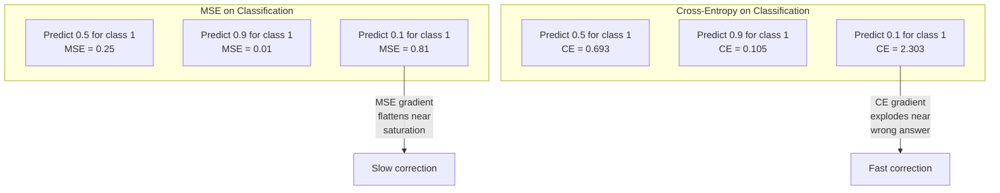
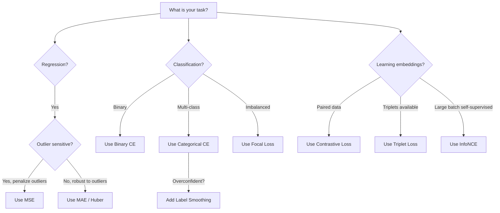
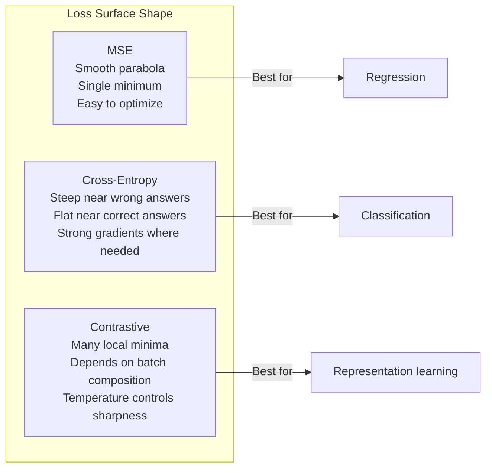

# 损失函数

> 你的网络做出了预测。真实标签却并非如此。它错得有多严重？这个数值就是 loss（损失）。选错了 loss function（损失函数），你的模型就会朝着完全错误的目标优化。

**类型：** 动手实践
**语言：** Python
**前置知识：** 第 03.04 课（激活函数）
**时间：** 约 75 分钟

## 学习目标

- 从零实现 MSE（均方误差）、binary cross-entropy（二元交叉熵）、categorical cross-entropy（分类交叉熵）和 contrastive loss（对比损失，InfoNCE）及其梯度
- 解释为什么 MSE 在分类任务中会失败，并演示"对所有样本预测 0.5"的失败模式
- 将 label smoothing（标签平滑）应用于 cross-entropy（交叉熵），并描述它如何防止 overconfident predictions（过度自信的预测）
- 为回归、二分类、多分类和 embedding learning（嵌入学习）任务选择合适的 loss function（损失函数）

## 问题所在

一个使用 MSE 最小化分类问题的模型会自信地对所有样本预测 0.5。它在最小化损失。但它毫无用处。

Loss function（损失函数）是你的模型唯一真正优化的东西。不是 accuracy（准确率）。不是 F1 score（F1 分数）。也不是你向经理汇报的任何指标。Optimizer（优化器）计算 loss function 的 gradient（梯度），并调整权重以使这个数值更小。如果 loss function 没有捕捉到你在乎的东西，模型会找到数学上最廉价的方式来满足它，而这种方式几乎永远不会是你想要的。

这里有一个具体的例子。你有一个 binary classification（二分类）任务。两个类别，各占 50%。你使用 MSE 作为损失。模型对每个输入都预测 0.5。平均 MSE 是 0.25，这是在不实际学习任何东西的情况下可能达到的最小值。模型没有任何判别能力，但它在技术上已经最小化了你的 loss function。切换到 cross-entropy（交叉熵），同一个模型就被迫将预测推向 0 或 1，因为 -log(0.5) = 0.693 是一个很糟糕的损失，而 -log(0.99) = 0.01 会奖励自信的、正确的预测。Loss function 的选择决定了模型是能学习，还是只会钻指标的空子。

情况还会更糟。在 self-supervised learning（自监督学习）中，你甚至没有标签。Contrastive loss（对比损失）完全定义了学习信号：什么算作相似，什么算作不同，以及模型应该将它们推开多远。Contrastive loss 设置错误，你的 embeddings（嵌入）就会坍缩到同一个点——每个输入都映射到相同的向量。技术上损失为零。完全没用。

## 核心概念

### Mean Squared Error (MSE) / 均方误差

回归任务的默认选择。计算预测值与目标值之间差值的平方，并在所有样本上取平均。

```
MSE = (1/n) * sum((y_pred - y_true)^2)
```

为什么平方很重要：它对大误差进行二次惩罚。误差为 2 的代价是误差为 1 的 4 倍。误差为 10 的代价是 100 倍。这使得 MSE 对 outliers（异常值）敏感——一个严重错误的预测会主导整个损失。

真实场景：如果你的模型预测房价，大多数房子偏差 10,000 美元，但一栋豪宅偏差 200,000 美元，MSE 会极力修正那一栋豪宅，可能损害其余 99 栋房子的性能。

MSE 对预测值的 gradient（梯度）为：

```
dMSE/dy_pred = (2/n) * (y_pred - y_true)
```

与误差成线性关系。更大的误差获得更大的梯度。对于回归来说这是优点（大误差需要大修正），对于分类来说这是缺点（你希望指数级惩罚自信的错误答案，而不是线性惩罚）。

### Cross-Entropy Loss / 交叉熵损失

分类任务的 loss function。根植于信息论——它衡量预测概率分布与真实分布之间的差异。

**Binary Cross-Entropy (BCE) / 二元交叉熵：**

```
BCE = -(y * log(p) + (1 - y) * log(1 - p))
```

其中 y 是真实标签（0 或 1），p 是预测概率。

为什么 -log(p) 有效：当真实标签为 1 且你预测 p = 0.99 时，损失是 -log(0.99) = 0.01。当你预测 p = 0.01 时，损失是 -log(0.01) = 4.6。这 460 倍的差距就是 cross-entropy 有效的原因。它严厉惩罚自信的错误预测，同时几乎不惩罚自信的正确预测。

Gradient 讲述着同样的故事：

```
dBCE/dp = -(y/p) + (1-y)/(1-p)
```

当 y = 1 且 p 接近 0 时，gradient 为 -1/p，趋近于负无穷。模型收到巨大的信号来修正错误。当 p 接近 1 时，gradient 很小。已经正确，无需修正。

**Categorical Cross-Entropy / 分类交叉熵：**

用于 one-hot encoded targets（独热编码目标）的多分类任务。

```
CCE = -sum(y_i * log(p_i))
```

只有真实类别对损失有贡献（因为所有其他 y_i 都为零）。如果有 10 个类别，正确类别获得概率 0.1（随机猜测），损失为 -log(0.1) = 2.3。如果正确类别获得概率 0.9，损失为 -log(0.9) = 0.105。模型学会将概率质量集中在正确答案上。

### 为什么 MSE 在分类中会失败



当预测值接近 0 或 1 时，MSE gradient 会趋于平缓（由于 sigmoid saturation / S型函数饱和）。Cross-entropy gradient 补偿了这一点——-log 抵消了 sigmoid 的平坦区域，在最需要强 gradient 的地方提供了强 gradient。

### Label Smoothing / 标签平滑

标准的 one-hot labels（独热标签）声称"这是 100% 的类别 3，其他都是 0%"。这是一个很强的断言。Label smoothing 将其软化：

```
smooth_label = (1 - alpha) * one_hot + alpha / num_classes
```

当 alpha = 0.1 且有 10 个类别时：目标从 [0, 0, 1, 0, ...] 变为 [0.01, 0.01, 0.91, 0.01, ...]。模型以 0.91 为目标，而不是 1.0。

为什么这有效：一个试图通过 softmax 输出精确 1.0 的模型需要将 logits 推向无穷大。这会导致 overconfidence（过度自信），损害 generalization（泛化能力），并使模型对 distribution shift（分布偏移）变得脆弱。Label smoothing 将目标上限限制在 0.9（当 alpha=0.1 时），使 logits 保持在合理范围内。GPT 和大多数现代模型都使用 label smoothing 或其等效技术。

### Contrastive Loss / 对比损失

没有标签。没有类别。只有输入对和一个问题：它们是相似还是不同？

**SimCLR-style contrastive loss / SimCLR 风格对比损失 (NT-Xent / InfoNCE)：**

取一张图像。创建它的两个 augmented views（增强视图）（裁剪、旋转、颜色抖动）。它们构成"positive pair（正样本对）"——它们应该具有相似的 embeddings。Batch（批次）中的每一张其他图像都形成"negative pair（负样本对）"——它们应该具有不同的 embeddings。

```
L = -log(exp(sim(z_i, z_j) / tau) / sum(exp(sim(z_i, z_k) / tau)))
```

其中 sim() 是 cosine similarity（余弦相似度），z_i 和 z_j 是正样本对，sum 是对所有负样本求和，tau（temperature / 温度）控制分布的尖锐程度。Temperature 越低 = 负样本越难 = 分离越激进。

真实数据：batch size（批量大小）为 256 意味着每个正样本对有 255 个负样本。Temperature tau = 0.07（SimCLR 默认值）。损失看起来像是相似度上的 softmax——它希望正样本对的相似度在所有 256 个选项中最高。

**Triplet Loss / 三元组损失：**

取三个输入：anchor（锚点）、positive（正样本，同类）、negative（负样本，不同类）。

```
L = max(0, d(anchor, positive) - d(anchor, negative) + margin)
```

Margin（边界，通常为 0.2-1.0）强制要求正样本与负样本距离之间的最小间隔。如果负样本已经足够远，损失为零——没有 gradient，没有更新。这使得训练高效，但需要谨慎的 triplet mining（三元组挖掘）（选择靠近 anchor 的 hard negatives / 困难负样本）。

### Focal Loss / 焦点损失

用于 imbalanced datasets（不平衡数据集）。标准的 cross-entropy 对所有正确分类的样本一视同仁。Focal loss 对 easy examples（简单样本）进行降权：

```
FL = -alpha * (1 - p_t)^gamma * log(p_t)
```

其中 p_t 是真实类别的预测概率，gamma 控制 focusing（聚焦）程度。当 gamma = 0 时，这就是标准的 cross-entropy。当 gamma = 2（默认值）时：

- Easy example（简单样本）(p_t = 0.9)：权重 = (0.1)^2 = 0.01。实际上被忽略。
- Hard example（困难样本）(p_t = 0.1)：权重 = (0.9)^2 = 0.81。完整的 gradient 信号。

Focal loss 由 Lin 等人提出，用于 object detection（目标检测），其中 99% 的候选区域都是背景（简单负样本）。没有 focal loss，模型会淹没在简单的背景样本中，永远学不会检测目标。有了它，模型将容量集中在重要的、模糊的困难案例上。

### Loss Function 决策树



### Loss Landscape / 损失景观



## 动手实现

### 步骤 1：MSE 及其 Gradient

```python
def mse(predictions, targets):
    n = len(predictions)
    total = 0.0
    for p, t in zip(predictions, targets):
        total += (p - t) ** 2
    return total / n

def mse_gradient(predictions, targets):
    n = len(predictions)
    grads = []
    for p, t in zip(predictions, targets):
        grads.append(2.0 * (p - t) / n)
    return grads
```

### 步骤 2：Binary Cross-Entropy / 二元交叉熵

log(0) 问题真实存在。如果模型对正样本精确预测 0，log(0) = 负无穷。Clipping（裁剪）可以防止这种情况。

```python
import math

def binary_cross_entropy(predictions, targets, eps=1e-15):
    n = len(predictions)
    total = 0.0
    for p, t in zip(predictions, targets):
        p_clipped = max(eps, min(1 - eps, p))
        total += -(t * math.log(p_clipped) + (1 - t) * math.log(1 - p_clipped))
    return total / n

def bce_gradient(predictions, targets, eps=1e-15):
    grads = []
    for p, t in zip(predictions, targets):
        p_clipped = max(eps, min(1 - eps, p))
        grads.append(-(t / p_clipped) + (1 - t) / (1 - p_clipped))
    return grads
```

### 步骤 3：Categorical Cross-Entropy + Softmax

Softmax 将原始 logits 转换为概率。然后针对 one-hot targets 计算 cross-entropy。

```python
def softmax(logits):
    max_val = max(logits)
    exps = [math.exp(x - max_val) for x in logits]
    total = sum(exps)
    return [e / total for e in exps]

def categorical_cross_entropy(logits, target_index, eps=1e-15):
    probs = softmax(logits)
    p = max(eps, probs[target_index])
    return -math.log(p)

def cce_gradient(logits, target_index):
    probs = softmax(logits)
    grads = list(probs)
    grads[target_index] -= 1.0
    return grads
```

Softmax + cross-entropy 的 gradient 简化得非常漂亮：真实类别只是（预测概率 - 1），其他所有类别都是（预测概率）。这种优雅的简化并非巧合——这就是为什么 softmax 和 cross-entropy 是成对出现的。

### 步骤 4：Label Smoothing / 标签平滑

```python
def label_smoothed_cce(logits, target_index, num_classes, alpha=0.1, eps=1e-15):
    probs = softmax(logits)
    loss = 0.0
    for i in range(num_classes):
        if i == target_index:
            smooth_target = 1.0 - alpha + alpha / num_classes
        else:
            smooth_target = alpha / num_classes
        p = max(eps, probs[i])
        loss += -smooth_target * math.log(p)
    return loss
```

### 步骤 5：Contrastive Loss / 对比损失（简化版 InfoNCE）

```python
def cosine_similarity(a, b):
    dot = sum(x * y for x, y in zip(a, b))
    norm_a = math.sqrt(sum(x * x for x in a))
    norm_b = math.sqrt(sum(x * x for x in b))
    if norm_a < 1e-10 or norm_b < 1e-10:
        return 0.0
    return dot / (norm_a * norm_b)

def contrastive_loss(anchor, positive, negatives, temperature=0.07):
    sim_pos = cosine_similarity(anchor, positive) / temperature
    sim_negs = [cosine_similarity(anchor, neg) / temperature for neg in negatives]

    max_sim = max(sim_pos, max(sim_negs)) if sim_negs else sim_pos
    exp_pos = math.exp(sim_pos - max_sim)
    exp_negs = [math.exp(s - max_sim) for s in sim_negs]
    total_exp = exp_pos + sum(exp_negs)

    return -math.log(max(1e-15, exp_pos / total_exp))
```

### 步骤 6：MSE vs Cross-Entropy 在分类任务上的对比

使用第 04 课中的同一个网络（圆形数据集），分别用两种 loss function 训练。观察 cross-entropy 收敛更快。

```python
import random

def sigmoid(x):
    x = max(-500, min(500, x))
    return 1.0 / (1.0 + math.exp(-x))

def make_circle_data(n=200, seed=42):
    random.seed(seed)
    data = []
    for _ in range(n):
        x = random.uniform(-2, 2)
        y = random.uniform(-2, 2)
        label = 1.0 if x * x + y * y < 1.5 else 0.0
        data.append(([x, y], label))
    return data


class LossComparisonNetwork:
    def __init__(self, loss_type="bce", hidden_size=8, lr=0.1):
        random.seed(0)
        self.loss_type = loss_type
        self.lr = lr
        self.hidden_size = hidden_size

        self.w1 = [[random.gauss(0, 0.5) for _ in range(2)] for _ in range(hidden_size)]
        self.b1 = [0.0] * hidden_size
        self.w2 = [random.gauss(0, 0.5) for _ in range(hidden_size)]
        self.b2 = 0.0

    def forward(self, x):
        self.x = x
        self.z1 = []
        self.h = []
        for i in range(self.hidden_size):
            z = self.w1[i][0] * x[0] + self.w1[i][1] * x[1] + self.b1[i]
            self.z1.append(z)
            self.h.append(max(0.0, z))

        self.z2 = sum(self.w2[i] * self.h[i] for i in range(self.hidden_size)) + self.b2
        self.out = sigmoid(self.z2)
        return self.out

    def backward(self, target):
        if self.loss_type == "mse":
            d_loss = 2.0 * (self.out - target)
        else:
            eps = 1e-15
            p = max(eps, min(1 - eps, self.out))
            d_loss = -(target / p) + (1 - target) / (1 - p)

        d_sigmoid = self.out * (1 - self.out)
        d_out = d_loss * d_sigmoid

        for i in range(self.hidden_size):
            d_relu = 1.0 if self.z1[i] > 0 else 0.0
            d_h = d_out * self.w2[i] * d_relu
            self.w2[i] -= self.lr * d_out * self.h[i]
            for j in range(2):
                self.w1[i][j] -= self.lr * d_h * self.x[j]
            self.b1[i] -= self.lr * d_h
        self.b2 -= self.lr * d_out

    def compute_loss(self, pred, target):
        if self.loss_type == "mse":
            return (pred - target) ** 2
        else:
            eps = 1e-15
            p = max(eps, min(1 - eps, pred))
            return -(target * math.log(p) + (1 - target) * math.log(1 - p))

    def train(self, data, epochs=200):
        losses = []
        for epoch in range(epochs):
            total_loss = 0.0
            correct = 0
            for x, y in data:
                pred = self.forward(x)
                self.backward(y)
                total_loss += self.compute_loss(pred, y)
                if (pred >= 0.5) == (y >= 0.5):
                    correct += 1
            avg_loss = total_loss / len(data)
            accuracy = correct / len(data) * 100
            losses.append((avg_loss, accuracy))
            if epoch % 50 == 0 or epoch == epochs - 1:
                print(f"    Epoch {epoch:3d}: loss={avg_loss:.4f}, accuracy={accuracy:.1f}%")
        return losses
```

## 实际应用

PyTorch 提供了所有标准的 loss function，并内置了数值稳定性：

```python
import torch
import torch.nn as nn
import torch.nn.functional as F

predictions = torch.tensor([0.9, 0.1, 0.7], requires_grad=True)
targets = torch.tensor([1.0, 0.0, 1.0])

mse_loss = F.mse_loss(predictions, targets)
bce_loss = F.binary_cross_entropy(predictions, targets)

logits = torch.randn(4, 10)
labels = torch.tensor([3, 7, 1, 9])
ce_loss = F.cross_entropy(logits, labels)
ce_smooth = F.cross_entropy(logits, labels, label_smoothing=0.1)
```

使用 `F.cross_entropy`（而不是 `F.nll_loss` 加手动 softmax）。它将 log-softmax 和 negative log-likelihood（负对数似然）结合在一个数值稳定的操作中。单独应用 softmax 再取 log 稳定性更差——你会在减去大指数时损失精度。

对于 contrastive learning（对比学习），大多数团队使用自定义实现或 `lightly`、`pytorch-metric-learning` 等库。核心循环总是相同的：计算 pairwise similarities（成对相似度），创建正样本和负样本上的 softmax，进行 backpropagation（反向传播）。

## 交付成果

本课产出：
- `outputs/prompt-loss-function-selector.md` —— 一个用于选择合适 loss function 的可复用 prompt
- `outputs/prompt-loss-debugger.md` —— 一个用于 loss curve（损失曲线）异常时的诊断 prompt

## 练习

1. 实现 Huber loss（平滑 L1 损失），它对小的误差使用 MSE，对大的误差使用 MAE。训练一个预测 y = sin(x) 的回归网络，比较在 5% 的训练目标添加了随机噪声（outliers）时，MSE 与 Huber 的最终 test error（测试误差）。

2. 将 focal loss 添加到二分类训练循环中。创建一个 imbalanced dataset（不平衡数据集）（90% 类别 0，10% 类别 1）。比较标准 BCE 与 focal loss（gamma=2）在 200 个 epoch 后对 minority class（少数类）的 recall（召回率）。

3. 实现 triplet loss 配合 semi-hard negative mining（半困难负样本挖掘）。为 5 个类别生成 2D embedding 数据。对于每个 anchor，找到仍然比正样本更远的 hardest negative（最困难负样本）（semi-hard）。比较与随机 triplet 选择的收敛速度。

4. 运行 MSE 与 cross-entropy 的对比实验，但跟踪训练过程中每一层的 gradient magnitudes（梯度大小）。绘制每个 epoch 的平均 gradient norm（梯度范数）。验证 cross-entropy 在模型最不确定的早期 epoch 产生更大的 gradient。

5. 实现 KL divergence loss（KL 散度损失），并验证当真实分布是 one-hot 时，最小化 KL(true || predicted) 产生的 gradient 与 cross-entropy 相同。然后尝试 soft targets（如 knowledge distillation / 知识蒸馏），其中"真实"分布来自教师模型的 softmax 输出。

## 关键术语

| 术语 | 人们怎么说 | 实际含义 |
|------|-----------|---------|
| Loss function / 损失函数 | "模型有多错" | 一个可微函数，将预测和目标映射为优化器最小化的标量 |
| MSE / 均方误差 | "平均平方误差" | 预测与目标之间平方差的均值；对大误差进行二次惩罚 |
| Cross-entropy / 交叉熵 | "分类用的损失" | 使用 -log(p) 衡量预测概率分布与真实分布之间的差异 |
| Binary cross-entropy / 二元交叉熵 | "BCE" | 二分类的交叉熵：-(y*log(p) + (1-y)*log(1-p)) |
| Label smoothing / 标签平滑 | "软化目标" | 用软值（如 0.1/0.9）替代硬 0/1 目标，防止过度自信并改善泛化 |
| Contrastive loss / 对比损失 | "拉近同类，推远异类" | 通过在 embedding space（嵌入空间）中使相似对靠近、不相似对远离来学习表示的损失 |
| InfoNCE | "CLIP/SimCLR 用的损失" | 对相似度分数进行 temperature-scaled（温度缩放）的归一化交叉熵；将对比学习视为分类问题 |
| Focal loss / 焦点损失 | "不平衡数据的解决方案" | 用 (1-p_t)^gamma 加权的交叉熵，对简单样本降权并聚焦困难样本 |
| Triplet loss / 三元组损失 | "锚点-正样本-负样本" | 在嵌入空间中将锚点推近正样本，比负样本至少远 margin（边界） |
| Temperature / 温度 | "锐度旋钮" | 作用于 logits/相似度的标量除数，控制结果分布的尖锐程度；越低越尖锐 |

## 延伸阅读

- Lin et al., "Focal Loss for Dense Object Detection" (2017) —— 为处理目标检测中的极端类别不平衡（RetinaNet）引入了 focal loss
- Chen et al., "A Simple Framework for Contrastive Learning of Visual Representations" (SimCLR, 2020) —— 用 NT-Xent loss 定义了现代对比学习流程
- Szegedy et al., "Rethinking the Inception Architecture" (2016) —— 将 label smoothing 作为 regularization（正则化）技术引入，现已成为大多数大模型的标准配置
- Hinton et al., "Distilling the Knowledge in a Neural Network" (2015) —— 使用 soft targets 和 KL divergence 进行 knowledge distillation，为模型压缩奠定了基础
