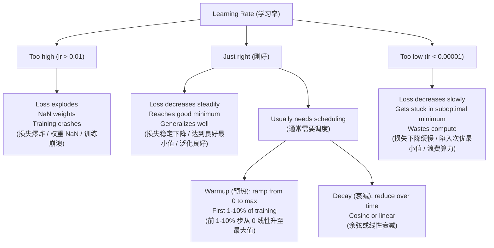
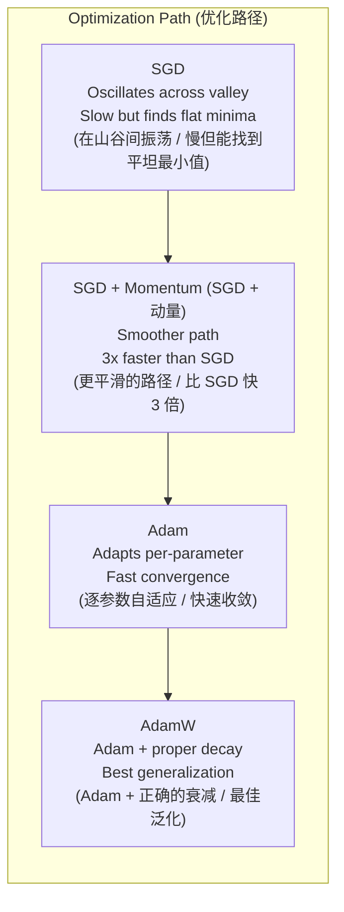
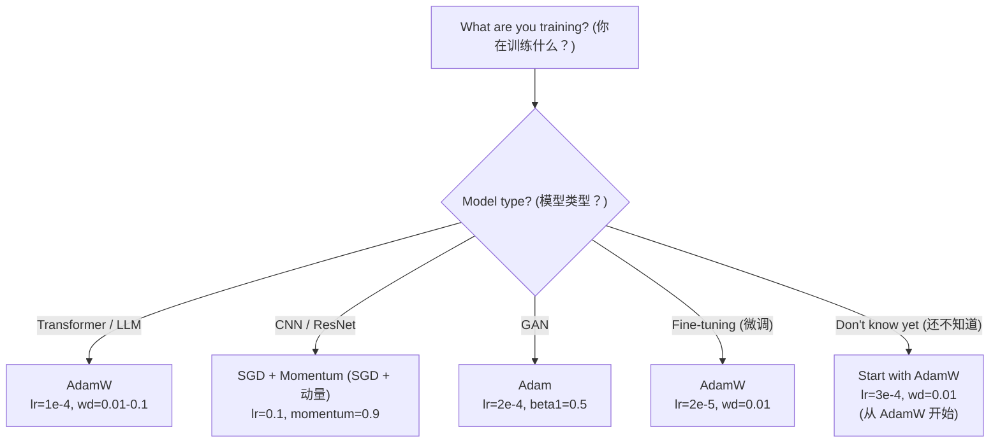

# Optimizers (优化器)

> Gradient descent (梯度下降) 告诉你朝哪个方向走，但它不会告诉你该走多远、走多快。SGD (随机梯度下降) 是指南针，Adam (自适应矩估计) 是带实时路况的 GPS。

**Type:** Build
**Languages:** Python
**Prerequisites:** Lesson 03.05 (Loss Functions)
**Time:** ~75 分钟

## Learning Objectives (学习目标)

- 用纯 Python 从头实现 SGD、SGD with momentum (带动量的随机梯度下降)、Adam 和 AdamW 优化器
- 解释 Adam 的 bias correction (偏差修正) 如何在训练初期补偿从零初始化的 moment estimates (矩估计)
- 演示为什么 AdamW 在同一任务上比带 L2 regularization (L2 正则化) 的 Adam 产生更好的 generalization (泛化)
- 为 transformers、CNNs、GANs 和 fine-tuning (微调) 选择合适的 optimizer 和默认 hyperparameters (超参数)

## The Problem (问题)

你已经算出了 gradient (梯度)。你知道第 4,721 号 weight (权重) 应该减少 0.003 来降低 loss。但 0.003 是什么单位？该按什么比例缩放？第 1 步和第 1,000 步的移动量应该一样吗？

Vanilla gradient descent (朴素梯度下降) 对每一步的每个参数都使用相同的 learning rate (学习率)：w = w - lr * gradient。这在实践中带来了三个让 neural network (神经网络) 训练很痛苦的问题。

第一，oscillation (振荡)。loss landscape (损失景观) 很少像光滑的碗，更像一条又长又窄的山谷。gradient 指向山谷的两侧（陡峭方向），而不是沿着山谷（平缓方向）。gradient descent 在窄维度上来回弹跳，而在有用的方向上进展甚微。你一定见过这种情况：loss 快速下降后进入平台期，不是因为模型 converged (收敛) 了，而是因为它在振荡。

第二，所有参数共用同一个 learning rate 是错误的。有些 weight 需要大的更新（它们还处于早期、underfitting (欠拟合) 阶段），有些则需要极小的更新（它们已经接近最优值）。对前者有效的 learning rate 会毁掉后者，反之亦然。

第三，saddle points (鞍点)。在高维空间中，loss landscape 存在大片 gradient 接近零的平坦区域。Vanilla SGD 以 gradient 的速度爬行穿过这些区域，而 gradient 实际上几乎为零。模型看起来卡住了——其实它没有卡住，只是身处一个平坦区域，而另一侧还有可用的下降方向。但 SGD 没有机制来推动它穿过这些区域。

Adam 解决了全部三个问题。它为每个参数维护两个 running averages (移动平均)——mean gradient (平均梯度，即 momentum，处理振荡) 和 mean squared gradient (梯度平方的平均，即 adaptive rate，处理不同尺度)。结合对最初几步的 bias correction，它提供了一个默认 hyperparameters 就能解决 80% 问题的单一优化器。本节课从零构建它，让你准确理解它在剩下 20% 的问题上何时、为何失效。

## The Concept (概念)

### Stochastic Gradient Descent (SGD，随机梯度下降)

最简单的 optimizer。在 mini-batch (小批量) 上计算 gradient，然后朝相反方向走一步。

```
w = w - lr * gradient
```

"stochastic" (随机) 的意思是你用数据的随机子集（mini-batch）来估计 gradient，而不是整个数据集。这种噪声实际上是有益的——它帮助 escape sharp local minima (逃离尖锐的局部最小值)。但噪声也会引起 oscillation。

Learning rate 是唯一的调节旋钮。太高：loss 发散。太低：训练永远进行不完。最优值取决于 architecture (架构)、数据、batch size (批量大小) 和训练的当前阶段。对于现代网络上的 vanilla SGD，典型值范围是 0.01 到 0.1。但即使在单次训练过程中，理想的 learning rate 也会变化。

### Momentum (动量)

小球滚下山坡的比喻虽然被用滥了，但很准确。与其只按当前 gradient 迈步，不如维护一个 velocity (速度)，它累积了过去的 gradient。

```
m_t = beta * m_{t-1} + gradient
w = w - lr * m_t
```

Beta（通常 0.9）控制保留多少历史。当 beta = 0.9 时，momentum 大致是最近 10 个 gradient 的平均值（1 / (1 - 0.9) = 10）。

为什么这能修复 oscillation：指向同一方向的 gradient 会累积；方向翻转的 gradient 会相互抵消。在那条狭窄的山谷中，"横跨"分量每步都变号，因此被阻尼。"沿着"分量保持一致，因此被放大。结果是在有用方向上的平滑加速。

真实数据：在条件恶劣的 loss landscape 上，纯 SGD 可能需要 10,000 步。SGD with momentum (beta=0.9) 在同样的问题上通常只需 3,000–5,000 步。加速效果绝非微不足道。

### RMSProp (均方根传播)

第一种真正有效的 per-parameter adaptive learning rate (逐参数自适应学习率) 方法。由 Hinton 在 Coursera 讲座中提出（从未正式发表）。

```
s_t = beta * s_{t-1} + (1 - beta) * gradient^2
w = w - lr * gradient / (sqrt(s_t) + epsilon)
```

s_t 跟踪 gradient 平方的 running average。持续获得大 gradient 的参数会被除以一个大数（effective learning rate 更小）；获得小 gradient 的参数会被除以一个小数（effective learning rate 更大）。

这解决了"所有参数共用一个 learning rate"的问题。一个已经获得大量更新的 weight 可能已接近目标——减慢它。一个一直获得极小更新的 weight 可能训练不足——加快它。

Epsilon（通常 1e-8）防止在参数尚未更新时出现除零。

### Adam: Momentum + RMSProp

Adam 结合了两种思想。它为每个参数维护两个 exponential moving averages (指数移动平均)：

```
m_t = beta1 * m_{t-1} + (1 - beta1) * gradient        (first moment: mean，一阶矩：均值)
v_t = beta2 * v_{t-1} + (1 - beta2) * gradient^2       (second moment: variance，二阶矩：方差)
```

**Bias correction (偏差修正)** 是大多数解释都会跳过的关键细节。在第 1 步，m_1 = (1 - beta1) * gradient。当 beta1 = 0.9 时，这是 0.1 * gradient——只有实际值的十分之一。moving average 还没"热启动"。Bias correction 进行补偿：

```
m_hat = m_t / (1 - beta1^t)
v_hat = v_t / (1 - beta2^t)
```

在第 1 步且 beta1 = 0.9 时：m_hat = m_1 / (1 - 0.9) = m_1 / 0.1 = 实际的 gradient。在第 100 步：(1 - 0.9^100) 约等于 1.0，因此修正项消失。Bias correction 在前 ~10 步重要，在 ~50 步之后基本无关。

更新公式：

```
w = w - lr * m_hat / (sqrt(v_hat) + epsilon)
```

Adam 默认值：lr = 0.001, beta1 = 0.9, beta2 = 0.999, epsilon = 1e-8。这些默认值适用于 80% 的问题。当不适用时，先改 lr，再改 beta2。几乎不需要改 beta1 或 epsilon。

### AdamW: Weight Decay Done Right (正确的权重衰减)

L2 regularization (L2 正则化) 向 loss 添加 lambda * w^2。在 vanilla SGD 中，这等价于 weight decay (权重衰减，每步从 weight 中减去 lambda * w)。在 Adam 中，这种等价性被打破。

Loshchilov & Hutter 的关键洞察：当你把 L2 加入 loss，然后 Adam 处理 gradient 时，adaptive learning rate 会按不同比例缩放 regularization 项。Gradient variance 大的参数获得更弱的 regularization，variance 小的参数获得更强的 regularization。这不是你想要的结果——你希望无论 gradient statistics 如何，regularization 都是均匀的。

AdamW 通过在 Adam update 之后直接将 weight decay 应用到 weight 上来修复这个问题：

```
w = w - lr * m_hat / (sqrt(v_hat) + epsilon) - lr * lambda * w
```

Weight decay 项 (lr * lambda * w) 不会被 Adam 的 adaptive factor 缩放。每个参数获得相同比例的 shrinkage (收缩)。

这看起来是个小细节。其实不是。AdamW 在几乎所有任务上都比 Adam + L2 regularization 收敛到更好的解。它是 PyTorch 中训练 transformers、diffusion models (扩散模型) 和大多数现代架构的默认 optimizer。BERT、GPT、LLaMA、Stable Diffusion——全部使用 AdamW 训练。

### Learning Rate: The Most Important Hyperparameter (学习率：最重要的超参数)



如果你只调一个 hyperparameter，就调 learning rate。Learning rate 变化 10 倍的影响，比你做的任何 architecture 决策都大。常见默认值：

- SGD: lr = 0.01 to 0.1
- Adam/AdamW: lr = 1e-4 to 3e-4
- Fine-tuning pretrained models (微调预训练模型): lr = 1e-5 to 5e-5
- Learning rate warmup (学习率预热): linear ramp over first 1-10% of steps

### Optimizer Comparison (优化器对比)



### When Each Optimizer Wins (各优化器的适用场景)



## Build It (动手实现)

### Step 1: Vanilla SGD (朴素随机梯度下降)

```python
class SGD:
    def __init__(self, lr=0.01):
        self.lr = lr

    def step(self, params, grads):
        for i in range(len(params)):
            params[i] -= self.lr * grads[i]
```

### Step 2: SGD with Momentum (带动量的随机梯度下降)

```python
class SGDMomentum:
    def __init__(self, lr=0.01, beta=0.9):
        self.lr = lr
        self.beta = beta
        self.velocities = None

    def step(self, params, grads):
        if self.velocities is None:
            self.velocities = [0.0] * len(params)
        for i in range(len(params)):
            self.velocities[i] = self.beta * self.velocities[i] + grads[i]
            params[i] -= self.lr * self.velocities[i]
```

### Step 3: Adam (自适应矩估计)

```python
import math

class Adam:
    def __init__(self, lr=0.001, beta1=0.9, beta2=0.999, epsilon=1e-8):
        self.lr = lr
        self.beta1 = beta1
        self.beta2 = beta2
        self.epsilon = epsilon
        self.m = None
        self.v = None
        self.t = 0

    def step(self, params, grads):
        if self.m is None:
            self.m = [0.0] * len(params)
            self.v = [0.0] * len(params)

        self.t += 1

        for i in range(len(params)):
            self.m[i] = self.beta1 * self.m[i] + (1 - self.beta1) * grads[i]
            self.v[i] = self.beta2 * self.v[i] + (1 - self.beta2) * grads[i] ** 2

            m_hat = self.m[i] / (1 - self.beta1 ** self.t)
            v_hat = self.v[i] / (1 - self.beta2 ** self.t)

            params[i] -= self.lr * m_hat / (math.sqrt(v_hat) + self.epsilon)
```

### Step 4: AdamW

```python
class AdamW:
    def __init__(self, lr=0.001, beta1=0.9, beta2=0.999, epsilon=1e-8, weight_decay=0.01):
        self.lr = lr
        self.beta1 = beta1
        self.beta2 = beta2
        self.epsilon = epsilon
        self.weight_decay = weight_decay
        self.m = None
        self.v = None
        self.t = 0

    def step(self, params, grads):
        if self.m is None:
            self.m = [0.0] * len(params)
            self.v = [0.0] * len(params)

        self.t += 1

        for i in range(len(params)):
            self.m[i] = self.beta1 * self.m[i] + (1 - self.beta1) * grads[i]
            self.v[i] = self.beta2 * self.v[i] + (1 - self.beta2) * grads[i] ** 2

            m_hat = self.m[i] / (1 - self.beta1 ** self.t)
            v_hat = self.v[i] / (1 - self.beta2 ** self.t)

            params[i] -= self.lr * m_hat / (math.sqrt(v_hat) + self.epsilon)
            params[i] -= self.lr * self.weight_decay * params[i]
```

### Step 5: Training Comparison (训练对比)

用所有四种 optimizer 在来自第 05 课的 circle dataset (圆形数据集) 上训练同一个两层网络。对比收敛情况。

```python
import random

def sigmoid(x):
    x = max(-500, min(500, x))
    return 1.0 / (1.0 + math.exp(-x))

def make_circle_data(n=200, seed=42):
    random.seed(seed)
    data = []
    for _ in range(n):
        x = random.uniform(-2, 2)
        y = random.uniform(-2, 2)
        label = 1.0 if x * x + y * y < 1.5 else 0.0
        data.append(([x, y], label))
    return data


class OptimizerTestNetwork:
    def __init__(self, optimizer, hidden_size=8):
        random.seed(0)
        self.hidden_size = hidden_size
        self.optimizer = optimizer

        self.w1 = [[random.gauss(0, 0.5) for _ in range(2)] for _ in range(hidden_size)]
        self.b1 = [0.0] * hidden_size
        self.w2 = [random.gauss(0, 0.5) for _ in range(hidden_size)]
        self.b2 = 0.0

    def get_params(self):
        params = []
        for row in self.w1:
            params.extend(row)
        params.extend(self.b1)
        params.extend(self.w2)
        params.append(self.b2)
        return params

    def set_params(self, params):
        idx = 0
        for i in range(self.hidden_size):
            for j in range(2):
                self.w1[i][j] = params[idx]
                idx += 1
        for i in range(self.hidden_size):
            self.b1[i] = params[idx]
            idx += 1
        for i in range(self.hidden_size):
            self.w2[i] = params[idx]
            idx += 1
        self.b2 = params[idx]

    def forward(self, x):
        self.x = x
        self.z1 = []
        self.h = []
        for i in range(self.hidden_size):
            z = self.w1[i][0] * x[0] + self.w1[i][1] * x[1] + self.b1[i]
            self.z1.append(z)
            self.h.append(max(0.0, z))

        self.z2 = sum(self.w2[i] * self.h[i] for i in range(self.hidden_size)) + self.b2
        self.out = sigmoid(self.z2)
        return self.out

    def compute_grads(self, target):
        eps = 1e-15
        p = max(eps, min(1 - eps, self.out))
        d_loss = -(target / p) + (1 - target) / (1 - p)
        d_sigmoid = self.out * (1 - self.out)
        d_out = d_loss * d_sigmoid

        grads = [0.0] * (self.hidden_size * 2 + self.hidden_size + self.hidden_size + 1)
        idx = 0
        for i in range(self.hidden_size):
            d_relu = 1.0 if self.z1[i] > 0 else 0.0
            d_h = d_out * self.w2[i] * d_relu
            grads[idx] = d_h * self.x[0]
            grads[idx + 1] = d_h * self.x[1]
            idx += 2

        for i in range(self.hidden_size):
            d_relu = 1.0 if self.z1[i] > 0 else 0.0
            grads[idx] = d_out * self.w2[i] * d_relu
            idx += 1

        for i in range(self.hidden_size):
            grads[idx] = d_out * self.h[i]
            idx += 1

        grads[idx] = d_out
        return grads

    def train(self, data, epochs=300):
        losses = []
        for epoch in range(epochs):
            total_loss = 0.0
            correct = 0
            for x, y in data:
                pred = self.forward(x)
                grads = self.compute_grads(y)
                params = self.get_params()
                self.optimizer.step(params, grads)
                self.set_params(params)

                eps = 1e-15
                p = max(eps, min(1 - eps, pred))
                total_loss += -(y * math.log(p) + (1 - y) * math.log(1 - p))
                if (pred >= 0.5) == (y >= 0.5):
                    correct += 1
            avg_loss = total_loss / len(data)
            accuracy = correct / len(data) * 100
            losses.append((avg_loss, accuracy))
            if epoch % 75 == 0 or epoch == epochs - 1:
                print(f"    Epoch {epoch:3d}: loss={avg_loss:.4f}, accuracy={accuracy:.1f}%")
        return losses
```

## Use It (使用)

PyTorch 的 optimizers 处理 parameter groups (参数组)、gradient clipping (梯度裁剪) 和 learning rate scheduling (学习率调度)：

```python
import torch
import torch.optim as optim

model = torch.nn.Sequential(
    torch.nn.Linear(784, 256),
    torch.nn.ReLU(),
    torch.nn.Linear(256, 10),
)

optimizer = optim.AdamW(model.parameters(), lr=3e-4, weight_decay=0.01)

scheduler = optim.lr_scheduler.CosineAnnealingLR(optimizer, T_max=100)

for epoch in range(100):
    optimizer.zero_grad()
    output = model(torch.randn(32, 784))
    loss = torch.nn.functional.cross_entropy(output, torch.randint(0, 10, (32,)))
    loss.backward()
    torch.nn.utils.clip_grad_norm_(model.parameters(), max_norm=1.0)
    optimizer.step()
    scheduler.step()
```

模式永远是：zero_grad, forward, loss, backward, (clip), step, (schedule)。记住这个顺序。搞错它（例如，在 optimizer.step() 之前调用 scheduler.step()）是 subtle bugs (难以察觉的 bug) 的常见来源。

对于 CNNs，许多从业者仍然偏好 SGD + momentum (lr=0.1, momentum=0.9, weight_decay=1e-4) 配合 step 或 cosine schedule。SGD 能找到更 flat minima (平坦的最小值)，通常 generalize 更好。对于 transformers 和 LLMs，AdamW 配合 warmup + cosine decay 是通用默认配置。没有 measured reason (实测依据) 就不要违背共识。

## Ship It (产出)

本节课产出：
- `outputs/prompt-optimizer-selector.md` —— 一个决策提示词，用于为任意架构选择合适的 optimizer 和 learning rate

## Exercises (练习)

1. 实现 Nesterov momentum (Nesterov 动量)，在"lookahead"位置 (w - lr * beta * v) 而非当前位置计算 gradient。与标准 momentum 在 circle dataset 上对比收敛情况。

2. 实现 learning rate warmup schedule (学习率预热调度)：在前 10% 的训练步中线性 ramp 从 0 到 max_lr，然后 cosine decay 到 0。对比 Adam + warmup 与无 warmup 的 Adam。测量在 circle dataset 上达到 90% accuracy 所需的 epoch 数。

3. 在 Adam 训练期间跟踪每个参数的 effective learning rate (有效学习率)。effective rate 定义为 lr * m_hat / (sqrt(v_hat) + eps)。在第 10、50、200 步后绘制 effective rates 的分布。所有参数的更新速度相同吗？

4. 实现 gradient clipping (梯度裁剪，按 global norm 裁剪)。设置 max gradient norm 为 1.0。在使用高 learning rate (lr=0.01 for Adam) 的情况下，对比有和没有 clipping 的训练。统计在 10 个随机种子下，有和没有 clipping 时多少次运行发散（loss 变为 NaN）。

5. 在具有大 weight 的网络上对比 Adam 与 AdamW。将所有 weight 初始化为 [-5, 5] 中的随机值（远大于正常值）。用 weight_decay=0.1 训练 200 个 epoch。绘制两种 optimizer 在训练过程中 weight 的 L2 norm。AdamW 应该显示出更快的 weight shrinkage (权重收缩)。

## Key Terms (关键术语)

| Term (术语) | What people say (人们常说) | What it actually means (实际含义) |
|------|----------------|----------------------|
| Learning rate (学习率) | "Step size" (步长) | Gradient update 的标量乘数；训练中影响最大的单个 hyperparameter |
| SGD (随机梯度下降) | "Basic gradient descent" (基础梯度下降) | Stochastic gradient descent：在 mini-batch 上计算 gradient 后通过减去 lr * gradient 来更新 weight |
| Momentum (动量) | "Rolling ball analogy" (滚球比喻) | 过去 gradient 的 exponential moving average；阻尼振荡并加速一致方向 |
| RMSProp (均方根传播) | "Adaptive learning rate" (自适应学习率) | 将每个参数的 gradient 除以其近期 gradient 的 running RMS；均衡 learning rates |
| Adam (自适应矩估计) | "The default optimizer" (默认优化器) | 结合 momentum (一阶矩) 和 RMSProp (二阶矩)，并对初始步骤进行 bias correction |
| AdamW | "Adam done right" (正确的 Adam) | 带有 decoupled weight decay (解耦权重衰减) 的 Adam；将 regularization 直接应用于 weight 而非通过 gradient |
| Bias correction (偏差修正) | "Warmup for running averages" (移动平均的预热) | 除以 (1 - beta^t) 来补偿 Adam 的 moment estimates 从零初始化带来的偏差 |
| Weight decay (权重衰减) | "Shrink the weights" (收缩权重) | 每步从 weight 值中减去一个比例；一种惩罚大 weight 的 regularizer (正则化器) |
| Learning rate schedule (学习率调度) | "Changing lr over time" (随时间改变学习率) | 在训练过程中调整 learning rate 的函数；warmup + cosine decay 是现代默认方案 |
| Gradient clipping (梯度裁剪) | "Capping the gradient norm" (限制梯度范数) | 当 gradient vector 的 norm 超过阈值时将其缩小；防止 exploding gradient updates (梯度更新爆炸) |

## Further Reading (延伸阅读)

- Kingma & Ba, "Adam: A Method for Stochastic Optimization" (2014) —— 原始 Adam 论文，包含 convergence analysis (收敛分析) 和 bias correction 推导
- Loshchilov & Hutter, "Decoupled Weight Decay Regularization" (2017) —— 证明了在 Adam 中 L2 regularization 和 weight decay 不等价，并提出了 AdamW
- Smith, "Cyclical Learning Rates for Training Neural Networks" (2017) —— 提出了 LR range test 和 cyclical schedules，消除了调固定 learning rate 的需求
- Ruder, "An Overview of Gradient Descent Optimization Algorithms" (2016) —— 对所有 optimizer 变体的最佳单一综述，包含清晰的对比和直观解释
