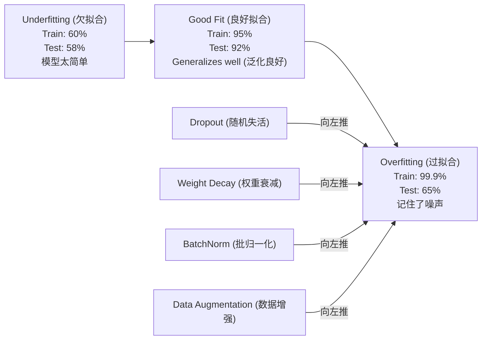
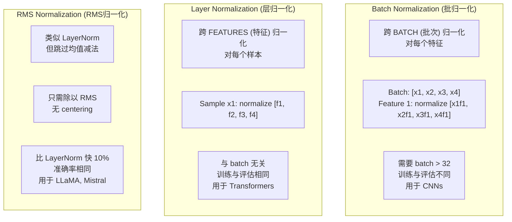

# Regularization (正则化)

> 你的模型在训练数据上达到 99%，但在测试数据上只有 60%。它是在死记硬背，而不是在学习。Regularization (正则化) 是你对复杂度征收的税，用以强制实现 generalization (泛化)。

**类型:** Build
**语言:** Python
**前置知识:** Lesson 03.06 (Optimizers)
**时间:** ~75 分钟

## 学习目标

- 从零实现 dropout (随机失活)（含 inverted scaling）、L2 weight decay (L2权重衰减)、batch normalization (批归一化)、layer normalization (层归一化) 和 RMSNorm
- 测量 train-test accuracy gap (训练-测试准确率差距) 并通过 regularization (正则化) 实验诊断 overfitting (过拟合)
- 解释为什么 transformers 使用 LayerNorm 而不是 BatchNorm，以及为什么现代 LLM 更偏好 RMSNorm
- 根据 overfitting (过拟合) 的严重程度应用正确的 regularization (正则化) 技术组合

## 问题背景

一个拥有足够参数的 neural network (神经网络) 可以记住任何数据集。这不是假设——Zhang 等人（2017）通过在 ImageNet 上使用随机标签训练标准网络证明了这一点。这些网络在完全随机的标签分配上达到了接近零的 training loss (训练损失)。它们记住了一百万个随机的输入-输出对，其中没有任何可学习的模式。Training loss (训练损失) 完美，test accuracy (测试准确率) 为零。

这就是 overfitting (过拟合) 问题，而且随着模型变大，问题变得更严重。GPT-3 有 1750 亿参数。Training set (训练集) 约有 5000 亿 token。有了这么多参数，模型有足够的 model capacity (模型容量) 逐字记住训练数据的很大一部分。没有 regularization (正则化)，它只会复述训练示例，而不是学习可 generalization (泛化) 的模式。

Training performance (训练表现) 和 test performance (测试表现) 之间的差距就是 overfitting gap (过拟合差距)。本课的每种技术都从不同角度攻击这个差距。Dropout (随机失活) 强制网络不依赖任何单个神经元。Weight decay (权重衰减) 防止任何单个 weight (权重) 变得过大。Batch normalization (批归一化) 平滑 loss landscape (损失 landscape)，使优化器找到更平坦、更可 generalization (泛化) 的极小值。Layer normalization (层归一化) 做同样的事情，但在 BatchNorm 失效的地方也能工作（小 batch、变长序列）。RMSNorm 通过去掉均值计算，速度提升约 10%。每种技术都很简单。合在一起，它们决定了模型是死记硬背还是 generalization (泛化)。

## 核心概念

### Overfitting Spectrum (过拟合光谱)

每个模型都位于从 underfitting (欠拟合)（太简单，无法捕捉模式）到 overfitting (过拟合)（太复杂，连噪声都捕捉）的某个位置。最佳点在中间，而 regularization (正则化) 从 overfit (过拟合) 一侧将模型推向最佳点。



### Dropout (随机失活)

最简单的 regularization (正则化) 技术，拥有最优雅的解释。在训练期间，以概率 p 随机将每个神经元的输出设为零。

```
output = activation(z) * mask    where mask[i] ~ Bernoulli(1 - p)
```

当 p = 0.5 时，每次前向传播都有一半神经元被置零。网络必须学习冗余表示，因为它无法预测哪些神经元会可用。这防止了 co-adaptation（神经元学会依赖特定其他神经元的存在）。

集成解释：一个有 N 个神经元并使用 dropout (随机失活) 的网络会产生 2^N 个可能的子网络（每个神经元的开关组合）。用 dropout (随机失活) 训练近似于同时训练所有 2^N 个子网络，每个子网络在不同的 mini-batch 上。在测试时，你使用所有神经元（无 dropout (随机失活)），并将输出缩放 (1 - p) 以匹配训练期间的期望值。这等价于平均 2^N 个子网络的预测——一个单一模型实现的大规模集成。

实践中，缩放在训练期间而非测试期间应用（inverted dropout (反转dropout)）：

```
训练期间:  output = activation(z) * mask / (1 - p)
测试期间:   output = activation(z)   (无需修改)
```

这更简洁，因为测试代码完全不需要知道 dropout (随机失活) 的存在。

默认比率：transformers 用 p = 0.1，MLPs 用 p = 0.5，CNNs 用 p = 0.2-0.3。更高的 dropout (随机失活) = 更强的 regularization (正则化) = 更大的 underfitting (欠拟合) 风险。

### Weight Decay (L2 Regularization, L2正则化)

将所有 weight (权重) 的平方幅度加到 loss (损失) 上：

```
total_loss = task_loss + (lambda / 2) * sum(w_i^2)
```

Regularization (正则化) 项的梯度是 lambda * w。这意味着每一步，每个 weight (权重) 都按其幅度的一定比例向零收缩。大的 weight (权重) 受到更多惩罚。模型被推向没有任何单个 weight (权重) 占主导的解。

为什么这有助于 generalization (泛化)：overfit (过拟合) 的模型往往有较大的 weight (权重)，放大了训练数据中的噪声。Weight decay (权重衰减) 保持 weight (权重) 较小，限制了模型的有效 capacity (容量)，并迫使它依赖稳健、可 generalization (泛化) 的特征，而不是记住的怪癖。

Lambda hyperparameter (超参数) 控制强度。典型值：

- AdamW 在 transformers 上用 0.01
- SGD 在 CNNs 上用 1e-4
- 严重 overfit (过拟合) 的模型用 0.1

如第 06 课所述：在 SGD 中 weight decay (权重衰减) 和 L2 regularization (L2正则化) 是等价的，但在 Adam 中不是。用 Adam 训练时始终使用 AdamW（解耦的 weight decay (权重衰减)）。

### Batch Normalization (批归一化)

在将每层的输出传递到下一层之前，先对 mini-batch 进行归一化。

对于某层的 mini-batch 激活：

```
mu = (1/B) * sum(x_i)           (batch mean, 批次均值)
sigma^2 = (1/B) * sum((x_i - mu)^2)   (batch variance, 批次方差)
x_hat = (x_i - mu) / sqrt(sigma^2 + eps)   (normalize, 归一化)
y = gamma * x_hat + beta        (scale and shift, 缩放和平移)
```

Gamma 和 beta 是可学习的参数，让网络在必要时可以撤销归一化。没有它们，你会强制每层输出都是零均值单位方差，但网络可能并不想要这样。

**训练与推理的分割：** 训练期间，mu 和 sigma 来自当前 mini-batch。推理期间，使用训练期间累积的 running average (移动平均)（momentum = 0.1 的指数移动平均，即 90% 旧值 + 10% 新值）。

BatchNorm 为什么有效仍在争论中。原始论文声称它减少了 "internal covariate shift"（内部协变量偏移，即前面层更新时层输入分布的变化）。Santurkar 等人（2018）证明这个解释是错误的。真正的原因：BatchNorm 使 loss landscape (损失 landscape) 更平滑。梯度更可预测，Lipschitz 常数更小，优化器可以安全地采取更大的步长。这就是 BatchNorm 允许使用更高 learning rate (学习率) 并更快收敛的原因。

BatchNorm 有一个根本限制：它依赖 batch statistics (批次统计)。batch size (批次大小) 为 1 时，均值和方差无意义。小 batch (< 32) 时，统计量有噪声并损害性能。这对目标检测（内存限制 batch size）和语言建模（序列长度变化）等任务很重要。

### Layer Normalization (层归一化)

跨特征而不是跨 batch (批次) 归一化。对于单个样本：

```
mu = (1/D) * sum(x_j)           (feature mean, 特征均值)
sigma^2 = (1/D) * sum((x_j - mu)^2)   (feature variance, 特征方差)
x_hat = (x_j - mu) / sqrt(sigma^2 + eps)
y = gamma * x_hat + beta
```

D 是特征维度。每个样本独立归一化——不依赖 batch size (批次大小)。这就是 transformers 使用 LayerNorm 而不是 BatchNorm 的原因。序列有可变长度，batch size (批次大小) 通常很小（生成时甚至为 1），训练和推理的计算完全相同。

Transformers 中的 LayerNorm 应用于每个 self-attention (自注意力) 块和每个 feed-forward (前馈) 块之后（Post-LN），或之前（Pre-LN，训练更稳定）。

### RMSNorm

去掉均值减法的 LayerNorm。由 Zhang & Sennrich（2019）提出。

```
rms = sqrt((1/D) * sum(x_j^2))
y = gamma * x / rms
```

就这些。没有均值计算，没有 beta 参数。观察发现：LayerNorm 中的 re-centering（均值减法）对模型性能贡献很小，但消耗计算。去掉它以约 10% 的额外开销获得相同的准确率。

LLaMA、LLaMA 2、LLaMA 3、Mistral 和大多数现代 LLM 使用 RMSNorm 而不是 LayerNorm。在数十亿参数和数万亿 token 的规模下，这 10% 的节省是显著的。

### Normalization Comparison (归一化方法对比)



### Data Augmentation as Regularization (数据增强作为正则化)

不是修改模型，而是修改数据。在保留标签的同时变换训练输入：

- 图像：random crop (随机裁剪)、flip (翻转)、rotation (旋转)、color jitter (颜色抖动)、cutout (遮挡)
- 文本：synonym replacement (同义词替换)、back-translation (回译)、random deletion (随机删除)
- 音频：time stretch (时间拉伸)、pitch shift (音调偏移)、noise addition (加噪)

效果与 regularization (正则化) 相同：它增加了 training set (训练集) 的有效大小，使模型更难记住特定示例。一个只看过每张图像原始形式的模型可以记住它。一个看过每张图像 50 种增强版本的模型被迫学习不变结构。

### Early Stopping (早停)

最简单的 regularizer (正则化器)：当 validation loss (验证损失) 开始上升时停止训练。此时模型还没有 overfit (过拟合)。实践中，你每个 epoch 跟踪 validation loss (验证损失)，保存最佳模型，并在 "patience" 窗口（通常 5-20 个 epoch）内继续训练。如果 validation loss (验证损失) 在 patience 窗口内没有改善，就停止并加载保存的最佳模型。

### When to Apply What (何时应用何种技术)

```mermaid
flowchart TD
    Gap{"Train-test (训练-测试)<br/>accuracy gap (准确率差距)?"} --|"> 10%"| Heavy["Heavy regularization (强正则化)"]
    Gap -->|"5-10%"| Medium["Moderate regularization (中等正则化)"]
    Gap -->|"< 5%"| Light["Light regularization (轻度正则化)"]

    Heavy --> D5["Dropout p=0.3-0.5"]
    Heavy --> WD2["Weight decay 0.01-0.1"]
    Heavy --> Aug["Aggressive data augmentation (激进数据增强)"]
    Heavy --> ES["Early stopping (早停)"]

    Medium --> D3["Dropout p=0.1-0.2"]
    Medium --> WD1["Weight decay 0.001-0.01"]
    Medium --> Norm["BatchNorm or LayerNorm"]

    Light --> D1["Dropout p=0.05-0.1"]
    Light --> WD0["Weight decay 1e-4"]
```

## Build It

### Step 1: Dropout (Train and Eval Mode)

```python
import random
import math


class Dropout:
    def __init__(self, p=0.5):
        self.p = p
        self.training = True
        self.mask = None

    def forward(self, x):
        if not self.training:
            return list(x)
        self.mask = []
        output = []
        for val in x:
            if random.random() < self.p:
                self.mask.append(0)
                output.append(0.0)
            else:
                self.mask.append(1)
                output.append(val / (1 - self.p))
        return output

    def backward(self, grad_output):
        grads = []
        for g, m in zip(grad_output, self.mask):
            if m == 0:
                grads.append(0.0)
            else:
                grads.append(g / (1 - self.p))
        return grads
```

### Step 2: L2 Weight Decay

```python
def l2_regularization(weights, lambda_reg):
    penalty = 0.0
    for w in weights:
        penalty += w * w
    return lambda_reg * 0.5 * penalty

def l2_gradient(weights, lambda_reg):
    return [lambda_reg * w for w in weights]
```

### Step 3: Batch Normalization

```python
class BatchNorm:
    def __init__(self, num_features, momentum=0.1, eps=1e-5):
        self.gamma = [1.0] * num_features
        self.beta = [0.0] * num_features
        self.eps = eps
        self.momentum = momentum
        self.running_mean = [0.0] * num_features
        self.running_var = [1.0] * num_features
        self.training = True
        self.num_features = num_features

    def forward(self, batch):
        batch_size = len(batch)
        if self.training:
            mean = [0.0] * self.num_features
            for sample in batch:
                for j in range(self.num_features):
                    mean[j] += sample[j]
            mean = [m / batch_size for m in mean]

            var = [0.0] * self.num_features
            for sample in batch:
                for j in range(self.num_features):
                    var[j] += (sample[j] - mean[j]) ** 2
            var = [v / batch_size for v in var]

            for j in range(self.num_features):
                self.running_mean[j] = (1 - self.momentum) * self.running_mean[j] + self.momentum * mean[j]
                self.running_var[j] = (1 - self.momentum) * self.running_var[j] + self.momentum * var[j]
        else:
            mean = list(self.running_mean)
            var = list(self.running_var)

        self.x_hat = []
        output = []
        for sample in batch:
            normalized = []
            out_sample = []
            for j in range(self.num_features):
                x_h = (sample[j] - mean[j]) / math.sqrt(var[j] + self.eps)
                normalized.append(x_h)
                out_sample.append(self.gamma[j] * x_h + self.beta[j])
            self.x_hat.append(normalized)
            output.append(out_sample)
        return output
```

### Step 4: Layer Normalization

```python
class LayerNorm:
    def __init__(self, num_features, eps=1e-5):
        self.gamma = [1.0] * num_features
        self.beta = [0.0] * num_features
        self.eps = eps
        self.num_features = num_features

    def forward(self, x):
        mean = sum(x) / len(x)
        var = sum((xi - mean) ** 2 for xi in x) / len(x)

        self.x_hat = []
        output = []
        for j in range(self.num_features):
            x_h = (x[j] - mean) / math.sqrt(var + self.eps)
            self.x_hat.append(x_h)
            output.append(self.gamma[j] * x_h + self.beta[j])
        return output
```

### Step 5: RMSNorm

```python
class RMSNorm:
    def __init__(self, num_features, eps=1e-6):
        self.gamma = [1.0] * num_features
        self.eps = eps
        self.num_features = num_features

    def forward(self, x):
        rms = math.sqrt(sum(xi * xi for xi in x) / len(x) + self.eps)
        output = []
        for j in range(self.num_features):
            output.append(self.gamma[j] * x[j] / rms)
        return output
```

### Step 6: Training With and Without Regularization

```python
def sigmoid(x):
    x = max(-500, min(500, x))
    return 1.0 / (1.0 + math.exp(-x))


def make_circle_data(n=200, seed=42):
    random.seed(seed)
    data = []
    for _ in range(n):
        x = random.uniform(-2, 2)
        y = random.uniform(-2, 2)
        label = 1.0 if x * x + y * y < 1.5 else 0.0
        data.append(([x, y], label))
    return data


class RegularizedNetwork:
    def __init__(self, hidden_size=16, lr=0.05, dropout_p=0.0, weight_decay=0.0):
        random.seed(0)
        self.hidden_size = hidden_size
        self.lr = lr
        self.dropout_p = dropout_p
        self.weight_decay = weight_decay
        self.dropout = Dropout(p=dropout_p) if dropout_p > 0 else None

        self.w1 = [[random.gauss(0, 0.5) for _ in range(2)] for _ in range(hidden_size)]
        self.b1 = [0.0] * hidden_size
        self.w2 = [random.gauss(0, 0.5) for _ in range(hidden_size)]
        self.b2 = 0.0

    def forward(self, x, training=True):
        self.x = x
        self.z1 = []
        self.h = []
        for i in range(self.hidden_size):
            z = self.w1[i][0] * x[0] + self.w1[i][1] * x[1] + self.b1[i]
            self.z1.append(z)
            self.h.append(max(0.0, z))

        if self.dropout and training:
            self.dropout.training = True
            self.h = self.dropout.forward(self.h)
        elif self.dropout:
            self.dropout.training = False
            self.h = self.dropout.forward(self.h)

        self.z2 = sum(self.w2[i] * self.h[i] for i in range(self.hidden_size)) + self.b2
        self.out = sigmoid(self.z2)
        return self.out

    def backward(self, target):
        eps = 1e-15
        p = max(eps, min(1 - eps, self.out))
        d_loss = -(target / p) + (1 - target) / (1 - p)
        d_sigmoid = self.out * (1 - self.out)
        d_out = d_loss * d_sigmoid

        for i in range(self.hidden_size):
            d_relu = 1.0 if self.z1[i] > 0 else 0.0
            d_h = d_out * self.w2[i] * d_relu
            self.w2[i] -= self.lr * (d_out * self.h[i] + self.weight_decay * self.w2[i])
            for j in range(2):
                self.w1[i][j] -= self.lr * (d_h * self.x[j] + self.weight_decay * self.w1[i][j])
            self.b1[i] -= self.lr * d_h
        self.b2 -= self.lr * d_out

    def evaluate(self, data):
        correct = 0
        total_loss = 0.0
        for x, y in data:
            pred = self.forward(x, training=False)
            eps = 1e-15
            p = max(eps, min(1 - eps, pred))
            total_loss += -(y * math.log(p) + (1 - y) * math.log(1 - p))
            if (pred >= 0.5) == (y >= 0.5):
                correct += 1
        return total_loss / len(data), correct / len(data) * 100

    def train_model(self, train_data, test_data, epochs=300):
        history = []
        for epoch in range(epochs):
            total_loss = 0.0
            correct = 0
            for x, y in train_data:
                pred = self.forward(x, training=True)
                self.backward(y)
                eps = 1e-15
                p = max(eps, min(1 - eps, pred))
                total_loss += -(y * math.log(p) + (1 - y) * math.log(1 - p))
                if (pred >= 0.5) == (y >= 0.5):
                    correct += 1
            train_loss = total_loss / len(train_data)
            train_acc = correct / len(train_data) * 100
            test_loss, test_acc = self.evaluate(test_data)
            history.append((train_loss, train_acc, test_loss, test_acc))
            if epoch % 75 == 0 or epoch == epochs - 1:
                gap = train_acc - test_acc
                print(f"    Epoch {epoch:3d}: train_acc={train_acc:.1f}%, test_acc={test_acc:.1f}%, gap={gap:.1f}%")
        return history
```

## Use It

PyTorch 将所有 normalization (归一化) 和 regularization (正则化) 作为模块提供：

```python
import torch
import torch.nn as nn

model = nn.Sequential(
    nn.Linear(784, 256),
    nn.BatchNorm1d(256),
    nn.ReLU(),
    nn.Dropout(0.3),
    nn.Linear(256, 128),
    nn.BatchNorm1d(128),
    nn.ReLU(),
    nn.Dropout(0.3),
    nn.Linear(128, 10),
)

model.train()
out_train = model(torch.randn(32, 784))

model.eval()
out_test = model(torch.randn(1, 784))
```

`model.train()` / `model.eval()` 切换至关重要。它打开/关闭 dropout (随机失活)，并告诉 BatchNorm 使用 batch statistics (批次统计) 还是 running statistics (运行统计)。推理前忘记 `model.eval()` 是深度学习中最常见的 bug 之一。你的 test accuracy (测试准确率) 会随机波动，因为 dropout (随机失活) 仍然活跃，BatchNorm 正在使用 mini-batch statistics。

对于 transformers，模式不同：

```python
class TransformerBlock(nn.Module):
    def __init__(self, d_model=512, nhead=8, dropout=0.1):
        super().__init__()
        self.attention = nn.MultiheadAttention(d_model, nhead, dropout=dropout)
        self.norm1 = nn.LayerNorm(d_model)
        self.ff = nn.Sequential(
            nn.Linear(d_model, d_model * 4),
            nn.GELU(),
            nn.Linear(d_model * 4, d_model),
            nn.Dropout(dropout),
        )
        self.norm2 = nn.LayerNorm(d_model)
        self.dropout = nn.Dropout(dropout)

    def forward(self, x):
        attended, _ = self.attention(x, x, x)
        x = self.norm1(x + self.dropout(attended))
        x = self.norm2(x + self.ff(x))
        return x
```

LayerNorm，不是 BatchNorm。Dropout p=0.1，不是 p=0.5。这些是 transformer 的默认值。

## Ship It

本课产出：
- `outputs/prompt-regularization-advisor.md` -- 一个诊断 overfitting (过拟合) 并推荐正确 regularization (正则化) 策略的 prompt

## Exercises

1. 为 2D 数据实现 spatial dropout (空间dropout)：不是丢弃单个神经元，而是丢弃整个特征通道。通过将连续特征组视为通道并丢弃整个组来模拟。在 circle dataset 上 hidden_size=32 时，将 train-test gap (训练-测试差距) 与标准 dropout (随机失活) 进行比较。

2. 将第 05 课的 label smoothing (标签平滑) 与本课的 dropout (随机失活) 结合。用四种配置训练：都不使用、仅 dropout (随机失活)、仅 label smoothing (标签平滑)、两者都用。测量每种配置的最终 train-test accuracy gap (训练-测试准确率差距)。哪种组合给出的差距最小？

3. 在你的 circle-dataset 网络中，在隐藏层和激活函数之间添加一个 BatchNorm 层。在 learning rate (学习率) 0.01、0.05 和 0.1 下分别训练有和没有 BatchNorm 的情况。BatchNorm 应该允许在 vanilla 网络发散的更高 learning rate (学习率) 下稳定训练。

4. 实现 early stopping (早停)：每个 epoch 跟踪 test loss (测试损失)，保存最佳 weight (权重)，如果 test loss (测试损失) 20 个 epoch 没有改善就停止。让 regularized network 训练 1000 个 epoch。报告最佳 test accuracy (测试准确率) 出现在哪个 epoch，以及节省了多少 epoch 的计算量。

5. 在 4 层网络（不只是 2 层）上比较 LayerNorm 与 RMSNorm。用相同的 weight (权重) 初始化两者。训练 200 个 epoch 并比较最终 accuracy (准确率)、训练速度（每 epoch 时间）和第一层的梯度幅度。验证 RMSNorm 更快且准确率相同。

## Key Terms

| 术语 | 人们的说法 | 实际含义 |
|------|-----------|---------|
| Overfitting (过拟合) | "模型记住了数据" | 当模型的 training performance (训练表现) 显著超过 test performance (测试表现) 时，表明它学到的是噪声而非信号 |
| Regularization (正则化) | "防止 overfitting (过拟合)" | 任何限制模型复杂度以改善 generalization (泛化) 的技术：dropout (随机失活)、weight decay (权重衰减)、normalization (归一化)、augmentation (增强) |
| Dropout (随机失活) | "随机删除神经元" | 以概率 p 在训练期间将随机神经元置零，强制冗余表示；等价于训练一个集成 |
| Weight decay (权重衰减) | "L2 惩罚" | 每一步将所有 weight (权重) 向零收缩 lambda * w；通过 weight (权重) 幅度惩罚复杂度 |
| Batch normalization (批归一化) | "按 batch (批次) 归一化" | 使用训练期间的 batch statistics (批次统计) 和推理期间的 running average (移动平均)，跨 batch dimension (批次维度) 归一化层输出 |
| Layer normalization (层归一化) | "按样本归一化" | 在每个样本内跨特征归一化；与 batch size (批次大小) 无关，用于 batch size (批次大小) 变化的 transformers |
| RMSNorm | "去掉均值的 LayerNorm" | Root mean square normalization (均方根归一化)；从 LayerNorm 中去掉均值减法，以相同准确率获得 10% 的速度提升 |
| Early stopping (早停) | "在 overfit (过拟合) 前停止" | 当 validation loss (验证损失) 停止改善时停止训练；最简单的 regularizer (正则化器)，通常与其他方法一起使用 |
| Data augmentation (数据增强) | "用更少的数据造更多数据" | 变换训练输入（翻转、裁剪、加噪）以增加有效数据集大小并强制学习不变性 |
| Generalization gap (泛化差距) | "训练-测试差距" | training performance (训练表现) 和 test performance (测试表现) 之间的差异；regularization (正则化) 旨在最小化这个差距 |

## Further Reading

- Srivastava et al., "Dropout: A Simple Way to Prevent Neural Networks from Overfitting" (2014) -- 原始 dropout (随机失活) 论文，包含集成解释和大量实验
- Ioffe & Szegedy, "Batch Normalization: Accelerating Deep Network Training by Reducing Internal Covariate Shift" (2015) -- 引入 BatchNorm 及其训练流程，被引用最多的深度学习论文之一
- Zhang & Sennrich, "Root Mean Square Layer Normalization" (2019) -- 证明 RMSNorm 以更少计算匹配 LayerNorm 准确率；被 LLaMA 和 Mistral 采用
- Zhang et al., "Understanding Deep Learning Requires Rethinking Generalization" (2017) -- 里程碑论文，展示 neural networks (神经网络) 可以记住随机标签，挑战了 generalization (泛化) 的传统观点
