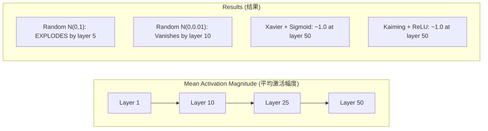
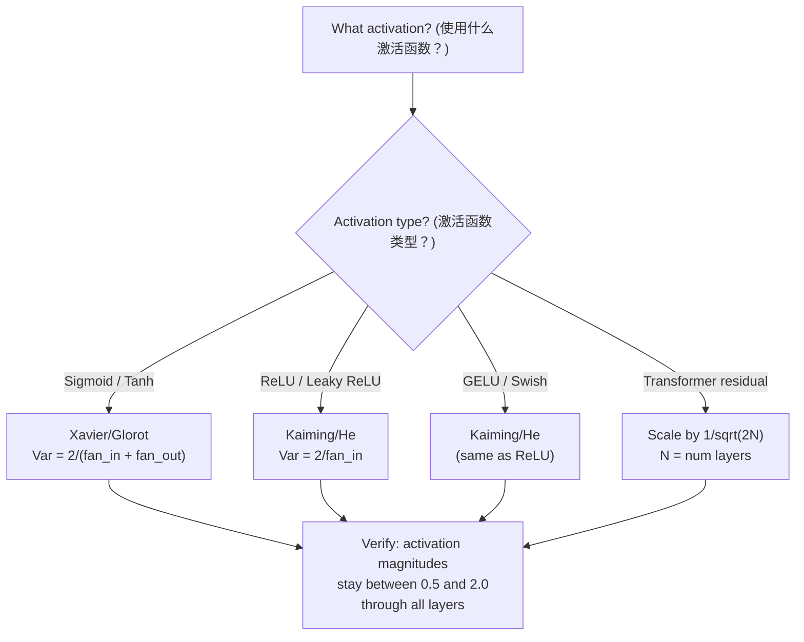

# Weight Initialization (权重初始化) 与训练稳定性

> 初始化错了，训练永远不会开始。初始化对了，50 层和 3 层一样顺畅。

**类型：** Build
**语言：** Python
**前置知识：** Lesson 03.04 (Activation Functions, 激活函数), Lesson 03.07 (Regularization, 正则化)
**时间：** ~90 分钟

## 学习目标

- 实现 zero initialization (零初始化)、random initialization (随机初始化)、Xavier/Glorot initialization (Xavier初始化) 和 Kaiming/He initialization (He初始化) 策略，并测量它们在 50 层网络中对 activation magnitude (激活幅度) 的影响
- 推导为什么 Xavier init 使用 Var(w) = 2/(fan_in + fan_out)，而 Kaiming init 使用 Var(w) = 2/fan_in
- 演示 zero initialization 的对称性问题，并解释为什么仅靠 random scale (随机尺度) 是不够的
- 将正确的初始化策略与 activation function (激活函数) 匹配：Xavier 用于 sigmoid/tanh，Kaiming 用于 ReLU/GELU

## 问题

将所有权重初始化为零。什么也学不到。每个 neuron (神经元) 计算相同的函数，接收相同的 gradient (梯度)，并以相同的方式更新。经过 10,000 个 epoch 后，你的 512-neuron hidden layer (隐藏层) 仍然是 512 个相同神经元的副本。你支付了 512 个参数的费用，却只得到了 1 个。

将它们初始化得太大。Activations (激活值) 在整个网络中爆炸。到第 10 层，数值达到 1e15。到第 20 层，它们溢出为无穷大。Gradients (梯度) 沿着反向轨迹走同样的路。

将它们从 normal distribution (正态分布) 中随机初始化。对 3 层有效。在 50 层时，信号根据随机尺度是稍微太小还是稍微太大，会坍缩到零或引爆到无穷大。"有效"和"失效"之间的边界薄如剃刀。

Weight initialization (权重初始化) 是 deep learning (深度学习) 中最被低估的决策。架构获得论文。优化器获得博客文章。初始化只得到脚注。但搞错了，其他什么都不重要——你的网络在训练开始前就已经死了。

## 概念

### 对称性问题

一层中的每个 neuron (神经元) 都有相同的结构：将输入乘以权重，加上偏置，应用 activation function (激活函数)。如果所有权重从相同的值开始（零是极端情况），每个神经元计算相同的输出。在 backpropagation (反向传播) 期间，每个神经元接收相同的 gradient (梯度)。在更新步骤中，每个神经元改变相同的量。

你被困住了。网络有数百个参数，但它们都步调一致地移动。这被称为 symmetry (对称性)，而 random initialization (随机初始化) 是打破它的暴力方法。每个神经元从权重空间中的不同点开始，因此每个神经元学习不同的特征。

但"随机"是不够的。随机性的 *scale*（尺度）决定了网络是否能训练。

### 方差通过层传播

考虑一个具有 fan_in (输入维度) 输入的 single layer (单层)：

```
z = w1*x1 + w2*x2 + ... + w_n*x_n
```

如果每个权重 wi 从 variance (方差) 为 Var(w) 的 distribution (分布) 中抽取，每个输入 xi 的 variance (方差) 为 Var(x)，则输出 variance (方差) 为：

```
Var(z) = fan_in * Var(w) * Var(x)
```

如果 Var(w) = 1 且 fan_in = 512，则输出 variance (方差) 是输入 variance (方差) 的 512 倍。经过 10 层后：512^10 = 1.2e27。你的信号已经爆炸了。

如果 Var(w) = 0.001，则输出 variance (方差) 每层缩小 0.001 * 512 = 0.512 倍。经过 10 层后：0.512^10 = 0.00013。你的信号已经消失了。

目标：选择 Var(w) 使得 Var(z) = Var(x)。信号幅度在各层之间保持恒定。

### Xavier/Glorot Initialization (Xavier初始化)

Glorot 和 Bengio (2010) 为 sigmoid 和 tanh activation function (激活函数) 推导了解决方案。为了在 forward pass (前向传播) 和 backward pass (反向传播) 中保持 variance (方差) 恒定：

```
Var(w) = 2 / (fan_in + fan_out)
```

在实践中，权重从以下分布抽取：

```
w ~ Uniform(-limit, limit)  其中 limit = sqrt(6 / (fan_in + fan_out))
```

或：

```
w ~ Normal(0, sqrt(2 / (fan_in + fan_out)))
```

这之所以有效，是因为 sigmoid 和 tanh 在零附近大致是线性的，而正确初始化的 activations (激活值) 就生活在这个区域。Variance (方差) 在数十层中保持稳定。

### Kaiming/He Initialization (He初始化)

ReLU (修正线性单元) 杀死了一半的输出（所有负数变为零）。有效的 fan_in (输入维度) 减半，因为平均一半的输入被归零。Xavier init 没有考虑到这一点——它低估了所需的 variance (方差)。

He 等人 (2015) 调整了公式：

```
Var(w) = 2 / fan_in
```

权重从以下分布抽取：

```
w ~ Normal(0, sqrt(2 / fan_in))
```

因子 2 补偿了 ReLU 将一半 activations (激活值) 归零。没有它，信号每层缩小约 0.5 倍。在 50 层中：0.5^50 = 8.8e-16。Kaiming init 防止了这种情况。

### Transformer Initialization (Transformer初始化)

GPT-2 引入了一种不同的模式。Residual connections (残差连接) 将每个 sub-layer (子层) 的输出加到其输入上：

```
x = x + sublayer(x)
```

每次加法都会增加 variance (方差)。对于 N 个 residual layers (残差层)，variance (方差) 与 N 成比例增长。GPT-2 将 residual layers (残差层) 的权重按 1/sqrt(2N) 缩放，其中 N 是层数。这保持了累积信号幅度的稳定。

Llama 3 (405B 参数，126 层) 使用了类似的方案。没有这种缩放，residual stream (残差流) 将在 126 层 attention (注意力) 和 feedforward (前馈) 块中无界增长。

```mermaid
flowchart TD
    subgraph "Zero Init (零初始化)"
        Z1["Layer 1<br/>All weights = 0"] --> Z2["Layer 2<br/>All neurons identical"]
        Z2 --> Z3["Layer 3<br/>Still identical"]
        Z3 --> ZR["Result: 1 effective neuron<br/>regardless of width"]
    end

    subgraph "Xavier Init (Xavier初始化)"
        X1["Layer 1<br/>Var = 2/(fan_in+fan_out)"] --> X2["Layer 2<br/>Signal stable"]
        X2 --> X3["Layer 50<br/>Signal stable"]
        X3 --> XR["Result: Trains with<br/>sigmoid/tanh"]
    end

    subgraph "Kaiming Init (Kaiming初始化)"
        K1["Layer 1<br/>Var = 2/fan_in"] --> K2["Layer 2<br/>Signal stable"]
        K2 --> K3["Layer 50<br/>Signal stable"]
        K3 --> KR["Result: Trains with<br/>ReLU/GELU"]
    end
```



### 50 层中的 Activation Magnitude (激活幅度)



### 选择合适的 Init (初始化)



## 构建它

### 步骤 1：Initialization Strategies (初始化策略)

初始化权重矩阵的四种方法。每种方法返回一个列表的列表（2D 矩阵），具有 fan_in 列和 fan_out 行。

```python
import math
import random


def zero_init(fan_in, fan_out):
    return [[0.0 for _ in range(fan_in)] for _ in range(fan_out)]


def random_init(fan_in, fan_out, scale=1.0):
    return [[random.gauss(0, scale) for _ in range(fan_in)] for _ in range(fan_out)]


def xavier_init(fan_in, fan_out):
    std = math.sqrt(2.0 / (fan_in + fan_out))
    return [[random.gauss(0, std) for _ in range(fan_in)] for _ in range(fan_out)]


def kaiming_init(fan_in, fan_out):
    std = math.sqrt(2.0 / fan_in)
    return [[random.gauss(0, std) for _ in range(fan_in)] for _ in range(fan_out)]
```

### 步骤 2：Activation Functions (激活函数)

我们需要 sigmoid、tanh 和 ReLU 来测试每种 init strategy (初始化策略) 与其对应的 activation function (激活函数)。

```python
def sigmoid(x):
    x = max(-500, min(500, x))
    return 1.0 / (1.0 + math.exp(-x))


def tanh_act(x):
    return math.tanh(x)


def relu(x):
    return max(0.0, x)
```

### 步骤 3：50 层的 Forward Pass (前向传播)

将随机数据通过深度网络传递，并测量每层的平均 activation magnitude (激活幅度)。

```python
def forward_deep(init_fn, activation_fn, n_layers=50, width=64, n_samples=100):
    random.seed(42)
    layer_magnitudes = []

    inputs = [[random.gauss(0, 1) for _ in range(width)] for _ in range(n_samples)]

    for layer_idx in range(n_layers):
        weights = init_fn(width, width)
        biases = [0.0] * width

        new_inputs = []
        for sample in inputs:
            output = []
            for neuron_idx in range(width):
                z = sum(weights[neuron_idx][j] * sample[j] for j in range(width)) + biases[neuron_idx]
                output.append(activation_fn(z))
            new_inputs.append(output)
        inputs = new_inputs

        magnitudes = []
        for sample in inputs:
            magnitudes.append(sum(abs(v) for v in sample) / width)
        mean_mag = sum(magnitudes) / len(magnitudes)
        layer_magnitudes.append(mean_mag)

    return layer_magnitudes
```

### 步骤 4：实验

运行所有组合：zero init、random N(0,1)、random N(0,0.01)、Xavier with sigmoid、Xavier with tanh、Kaiming with ReLU。打印关键层的幅度。

```python
def run_experiment():
    configs = [
        ("Zero init + Sigmoid", lambda fi, fo: zero_init(fi, fo), sigmoid),
        ("Random N(0,1) + ReLU", lambda fi, fo: random_init(fi, fo, 1.0), relu),
        ("Random N(0,0.01) + ReLU", lambda fi, fo: random_init(fi, fo, 0.01), relu),
        ("Xavier + Sigmoid", xavier_init, sigmoid),
        ("Xavier + Tanh", xavier_init, tanh_act),
        ("Kaiming + ReLU", kaiming_init, relu),
    ]

    print(f"{'Strategy':<30} {'L1':>10} {'L5':>10} {'L10':>10} {'L25':>10} {'L50':>10}")
    print("-" * 80)

    for name, init_fn, act_fn in configs:
        mags = forward_deep(init_fn, act_fn)
        row = f"{name:<30}"
        for idx in [0, 4, 9, 24, 49]:
            val = mags[idx]
            if val > 1e6:
                row += f" {'EXPLODED':>10}"
            elif val < 1e-6:
                row += f" {'VANISHED':>10}"
            else:
                row += f" {val:>10.4f}"
        print(row)
```

### 步骤 5：Symmetry Demonstration (对称性演示)

展示 zero init 产生相同的神经元。

```python
def symmetry_demo():
    random.seed(42)
    weights = zero_init(2, 4)
    biases = [0.0] * 4

    inputs = [0.5, -0.3]
    outputs = []
    for neuron_idx in range(4):
        z = sum(weights[neuron_idx][j] * inputs[j] for j in range(2)) + biases[neuron_idx]
        outputs.append(sigmoid(z))

    print("\nSymmetry Demo (4 neurons, zero init):")
    for i, out in enumerate(outputs):
        print(f"  Neuron {i}: output = {out:.6f}")
    all_same = all(abs(outputs[i] - outputs[0]) < 1e-10 for i in range(len(outputs)))
    print(f"  All identical: {all_same}")
    print(f"  Effective parameters: 1 (not {len(weights) * len(weights[0])})")
```

### 步骤 6：Layer-by-Layer Magnitude Report (逐层幅度报告)

打印 50 层中 activation magnitudes (激活幅度) 的可视化条形图。

```python
def magnitude_report(name, magnitudes):
    print(f"\n{name}:")
    for i, mag in enumerate(magnitudes):
        if i % 5 == 0 or i == len(magnitudes) - 1:
            if mag > 1e6:
                bar = "X" * 50 + " EXPLODED"
            elif mag < 1e-6:
                bar = "." + " VANISHED"
            else:
                bar_len = min(50, max(1, int(mag * 10)))
                bar = "#" * bar_len
            print(f"  Layer {i+1:3d}: {bar} ({mag:.6f})")
```

## 使用它

PyTorch 将这些作为内置函数提供：

```python
import torch
import torch.nn as nn

layer = nn.Linear(512, 256)

nn.init.xavier_uniform_(layer.weight)
nn.init.xavier_normal_(layer.weight)

nn.init.kaiming_uniform_(layer.weight, nonlinearity='relu')
nn.init.kaiming_normal_(layer.weight, nonlinearity='relu')

nn.init.zeros_(layer.bias)
```

当你调用 `nn.Linear(512, 256)` 时，PyTorch 默认使用 Kaiming uniform initialization (Kaiming均匀初始化)。这就是为什么大多数简单网络"刚好有效"——PyTorch 已经做出了正确的选择。但当你构建自定义架构或深入超过 20 层时，你需要了解正在发生什么，并可能覆盖默认值。

对于 transformers，HuggingFace 模型通常在其 `_init_weights` 方法中处理初始化。GPT-2 的实现将 residual projections (残差投影) 按 1/sqrt(N) 缩放。如果你从头开始构建 transformer，你需要自己添加这个。

## 交付它

本课程产出：
- `outputs/prompt-init-strategy.md` — 一个诊断 weight initialization (权重初始化) 问题并推荐正确策略的 prompt (提示词)

## 练习

1. 添加 LeCun initialization (LeCun初始化)（Var = 1/fan_in，为 SELU activation function (激活函数) 设计）。运行 50 层实验，比较 LeCun init + tanh 与 Xavier + tanh。

2. 实现 GPT-2 residual scaling (残差缩放)：在将每层的输出加到 residual stream (残差流) 之前，将其乘以 1/sqrt(2*N)。运行 50 层，比较有和没有缩放时 residual magnitude (残差幅度) 的增长速度。

3. 创建一个 "init health check" (初始化健康检查) 函数，该函数接收网络的层维度和 activation type (激活类型)，然后推荐正确的 initialization (初始化) 并在当前 init 会导致问题时发出警告。

4. 使用 fan_in = 16 与 fan_in = 1024 运行实验。Xavier 和 Kaiming 会适应 fan_in，但 random init 不会。展示随着层变大，"有效"和"失效"之间的差距如何扩大。

5. 实现 orthogonal initialization (正交初始化)（生成随机矩阵，计算其 SVD，使用正交矩阵 U）。在 50 层时与 Kaiming 比较用于 ReLU 网络。

## 关键术语

| 术语 | 人们怎么说 | 实际含义 |
|------|-----------|---------|
| Weight initialization (权重初始化) | "Set starting weights randomly" | 选择初始权重值的策略，决定了网络是否能训练 |
| Symmetry breaking (打破对称性) | "Make neurons different" | 使用 random initialization (随机初始化) 确保神经元学习不同的特征，而不是计算相同的函数 |
| Fan-in (输入维度) | "Number of inputs to a neuron" | 传入连接的数量，决定了输入 variance (方差) 在加权和中如何累积 |
| Fan-out (输出维度) | "Number of outputs from a neuron" | 传出连接的数量，与 backpropagation (反向传播) 期间保持 gradient variance (梯度方差) 相关 |
| Xavier/Glorot init (Xavier初始化) | "The sigmoid initialization" | Var(w) = 2/(fan_in + fan_out)，旨在通过 sigmoid 和 tanh activation function (激活函数) 保持 variance (方差) |
| Kaiming/He init (He初始化) | "The ReLU initialization" | Var(w) = 2/fan_in，考虑了 ReLU 将一半 activations (激活值) 归零 |
| Variance propagation (方差传播) | "How signals grow or shrink through layers" | 基于权重尺度分析 activation variance (激活方差) 如何逐层变化的数学分析 |
| Residual scaling (残差缩放) | "GPT-2's init trick" | 将 residual connection (残差连接) 权重按 1/sqrt(2N) 缩放，以防止 variance (方差) 在 N 个 transformer layers (Transformer层) 中增长 |
| Dead network (死亡网络) | "Nothing trains" | 由于 poor initialization (糟糕的初始化) 导致所有 gradients (梯度) 为零或所有 activations (激活值) 饱和的网络 |
| Exploding activations (激活爆炸) | "Values go to infinity" | 当 weight variance (权重方差) 过高时，导致 activation magnitudes (激活幅度) 在各层中指数增长 |

## 延伸阅读

- Glorot & Bengio, "Understanding the difficulty of training deep feedforward neural networks" (2010) — 原始的 Xavier initialization (Xavier初始化) 论文，包含 variance analysis (方差分析)
- He et al., "Delving Deep into Rectifiers" (2015) — 为 ReLU 网络引入了 Kaiming initialization (Kaiming初始化)
- Radford et al., "Language Models are Unsupervised Multitask Learners" (2019) — GPT-2 论文，包含 residual scaling initialization (残差缩放初始化)
- Mishkin & Matas, "All You Need is a Good Init" (2016) — layer-sequential unit-variance initialization (层序单位方差初始化)，一种分析公式的经验替代方案
