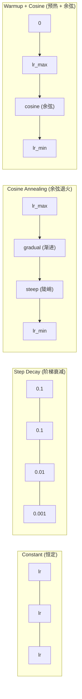
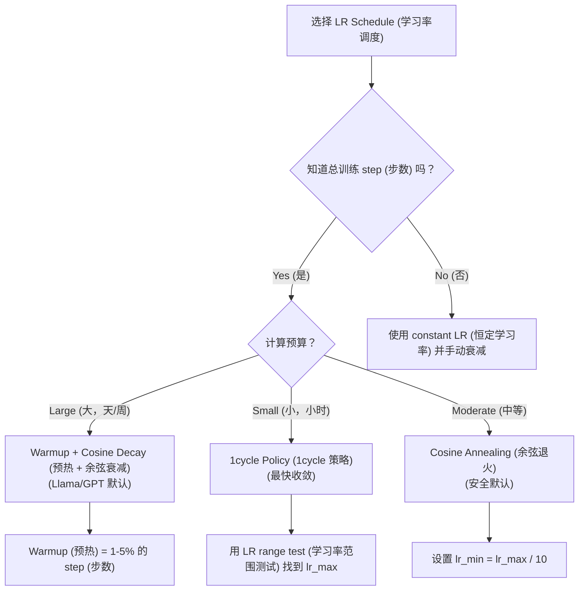
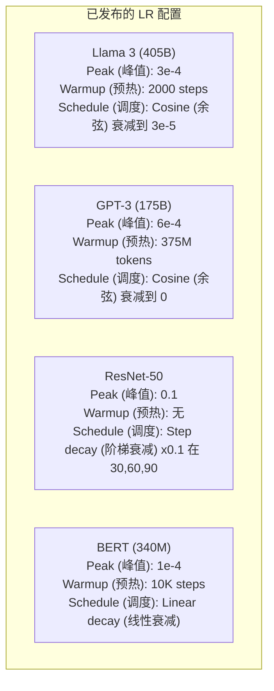

# Learning Rate Schedules (学习率调度) 与 Warmup (预热)

> learning rate (学习率) 是最重要的超参数。不是架构，不是数据集大小，也不是激活函数。是 learning rate。如果什么都不调，只调它。

**Type:** Build
**Languages:** Python
**Prerequisites:** Lesson 03.06 (Optimizers), Lesson 03.08 (Weight Initialization)
**Time:** ~90 分钟

## 学习目标

- 从零实现 constant (恒定)、step decay (阶梯衰减)、cosine annealing (余弦退火)、warmup + cosine (预热 + 余弦) 和 1cycle learning rate schedule (1cycle 学习率调度)
- 演示 learning rate (学习率) 选择的三种失败模式：divergence (发散，过高)、stalling (停滞，过低) 和 oscillation (振荡，无衰减)
- 解释为什么 warmup (预热) 对基于 Adam (自适应矩估计) 的 optimizer (优化器) 是必需的，以及它如何稳定早期训练
- 在同一任务上比较五种 schedule (调度) 的 convergence (收敛) 速度，并为给定的训练预算选择合适的 schedule (调度)

## 问题所在

将 learning rate (学习率) 设为 0.1。训练发散——loss (损失) 在 3 步内跳到无穷大。设为 0.0001。训练爬行——100 个 epoch (轮次) 后，模型几乎还停留在随机状态。设为 0.01。训练在前 50 个 epoch (轮次) 正常，然后 loss (损失) 围绕一个最小值振荡，永远无法到达，因为步长太大。

最优 learning rate (学习率) 不是恒定的。它在训练过程中会变化。早期，你希望大步前进以快速覆盖区域。训练后期，你希望小步前进以 settle into ( settle into ) 一个尖锐的最小值。90% 准确率模型和 95% 准确率模型之间的差异往往只是 schedule (调度)。

过去三年发布的每一个主要模型都使用 learning rate schedule (学习率调度)。Llama 3 使用峰值 lr=3e-4，2000 warmup steps (预热步数)，cosine decay (余弦衰减) 到 3e-5。GPT-3 使用 lr=6e-4，在 3.75 亿 token 上进行 warmup (预热)。这些不是随意选择。它们是花费数百万美元进行的 extensive hyperparameter sweeps (大量超参数搜索) 的结果。

你需要理解 schedule (调度)，因为默认值不适用于你的问题。当你 fine-tuning (微调) 预训练模型时，正确的 schedule (调度) 与从头训练不同。当你增大 batch size (批量大小) 时，warmup (预热) 周期需要改变。当训练在第 10,000 步崩溃时，你需要知道这是 schedule (调度) 问题还是其他问题。

## 核心概念

### Constant Learning Rate (恒定学习率)

最简单的方法。选一个数字，每一步都用它。

```
lr(t) = lr_0
```

很少是最优的。它要么对训练后期来说太高（围绕最小值振荡），要么对训练初期来说太低（在小步上浪费计算）。对于小型模型和调试来说效果不错。对于任何训练超过一小时的东西来说，这是一个糟糕的选择。

### Step Decay (阶梯衰减)

ResNet 时代的老派方法。在固定的 epoch (轮次) 将 learning rate (学习率) 按一个因子（通常是 10 倍）削减。

```
lr(t) = lr_0 * gamma^(floor(epoch / step_size))
```

其中 gamma = 0.1 且 step_size = 30 表示：每 30 个 epoch (轮次) lr 下降 10 倍。ResNet-50 使用了这种方法——lr=0.1，在 epoch 30、60 和 90 处下降 10 倍。

问题：最优的衰减点取决于数据集和架构。换到不同的问题，你需要重新调整何时下降。过渡是突然的——当 learning rate (学习率) 突然变化时，loss (损失) 可能会 spike (飙升)。

### Cosine Annealing (余弦退火)

从最大 learning rate (学习率) 到最小 learning rate (学习率) 的平滑衰减，遵循余弦曲线：

```
lr(t) = lr_min + 0.5 * (lr_max - lr_min) * (1 + cos(pi * t / T))
```

其中 t 是当前 step (步数)，T 是总 step (步数)。

在 t=0 时，余弦项为 1，因此 lr = lr_max。在 t=T 时，余弦项为 -1，因此 lr = lr_min。衰减一开始很温和，在中间加速，在接近结束时再次变得温和。

这是大多数现代训练的默认选择。除了 lr_max 和 lr_min 之外，没有需要调整的超参数。余弦形状与经验观察相符，即大部分学习发生在训练中期——你希望在这个关键时期有合理的步长。

### Warmup (预热)：为什么从小开始

Adam (自适应矩估计) 和其他 adaptive optimizer (自适应优化器) 会维护梯度均值和方差的 running estimates (运行估计)。在 step 0 时，这些估计被初始化为零。最初的几次梯度更新基于不可靠的统计信息。如果你的 learning rate (学习率) 在此期间很大，模型会迈出巨大且方向错误的步伐。

Warmup (预热) 解决了这个问题。从一个极小的 learning rate (学习率)（通常是 lr_max / warmup_steps 甚至零）开始，并在前 N 步内线性 ramp up (提升) 到 lr_max。当你达到 full learning rate (完整学习率) 时，Adam 的统计信息已经稳定下来。

```
lr(t) = lr_max * (t / warmup_steps)     for t < warmup_steps
```

典型的 warmup (预热)：占总训练 step (步数) 的 1-5%。Llama 3 训练了约 1.8 万亿 token，warmup (预热) 了 2000 步。GPT-3 在 3.75 亿 token 上进行了 warmup (预热)。

### Linear Warmup + Cosine Decay (线性预热 + 余弦衰减)

现代默认方案。线性 ramp up (提升)，然后余弦衰减：

```
if t < warmup_steps:
    lr(t) = lr_max * (t / warmup_steps)
else:
    progress = (t - warmup_steps) / (total_steps - warmup_steps)
    lr(t) = lr_min + 0.5 * (lr_max - lr_min) * (1 + cos(pi * progress))
```

这就是 Llama、GPT、PaLM 和大多数现代 transformer 所使用的。warmup (预热) 防止了早期的不稳定。cosine decay (余弦衰减) 使模型 settle into ( settle into ) 一个好的最小值。

### 1cycle Policy (1cycle 策略)

Leslie Smith 的发现（2018 年）：在训练的前半段将 learning rate (学习率) 从低值 ramp up (提升) 到高值，然后在后半段再降回来。这有违直觉——为什么要在训练中途 *增加* learning rate (学习率)？

理论：高 learning rate (学习率) 通过向优化轨迹添加噪声来充当 regularization (正则化)。在 ramp-up (提升) 阶段，模型探索了更多的 loss landscape (损失景观)，找到了更好的 basin ( basin )。然后在 ramp-down (下降) 阶段，在找到的最佳 basin ( basin ) 内进行 refine (细化)。

```
Phase 1 (0 to T/2):    lr 从 lr_max/25 提升到 lr_max
Phase 2 (T/2 to T):    lr 从 lr_max 下降到 lr_max/10000
```

对于固定的计算预算，1cycle 通常比 cosine annealing (余弦退火) 训练得更快。权衡：你必须提前知道总 step (步数)。

### Schedule (调度) 形状



### 决策流程图



### 已发布模型的真实数据



## 动手实现

### Step 1: Schedule (调度) 函数

每个函数接收当前 step (步数) 并返回该 step (步数) 的 learning rate (学习率)。

```python
import math


def constant_schedule(step, lr=0.01, **kwargs):
    return lr


def step_decay_schedule(step, lr=0.1, step_size=100, gamma=0.1, **kwargs):
    return lr * (gamma ** (step // step_size))


def cosine_schedule(step, lr=0.01, total_steps=1000, lr_min=1e-5, **kwargs):
    if step >= total_steps:
        return lr_min
    return lr_min + 0.5 * (lr - lr_min) * (1 + math.cos(math.pi * step / total_steps))


def warmup_cosine_schedule(step, lr=0.01, total_steps=1000, warmup_steps=100, lr_min=1e-5, **kwargs):
    if total_steps <= warmup_steps:
        return lr * (step / max(warmup_steps, 1))
    if step < warmup_steps:
        return lr * step / warmup_steps
    progress = (step - warmup_steps) / (total_steps - warmup_steps)
    return lr_min + 0.5 * (lr - lr_min) * (1 + math.cos(math.pi * progress))


def one_cycle_schedule(step, lr=0.01, total_steps=1000, **kwargs):
    mid = max(total_steps // 2, 1)
    if step < mid:
        return (lr / 25) + (lr - lr / 25) * step / mid
    else:
        progress = (step - mid) / max(total_steps - mid, 1)
        return lr * (1 - progress) + (lr / 10000) * progress
```

### Step 2: 可视化所有 Schedule (调度)

打印一个基于文本的图表，展示每个 schedule (调度) 在训练过程中的变化。

```python
def visualize_schedule(name, schedule_fn, total_steps=500, **kwargs):
    steps = list(range(0, total_steps, total_steps // 20))
    if total_steps - 1 not in steps:
        steps.append(total_steps - 1)

    lrs = [schedule_fn(s, total_steps=total_steps, **kwargs) for s in steps]
    max_lr = max(lrs) if max(lrs) > 0 else 1.0

    print(f"\n{name}:")
    for s, lr_val in zip(steps, lrs):
        bar_len = int(lr_val / max_lr * 40)
        bar = "#" * bar_len
        print(f"  Step {s:4d}: lr={lr_val:.6f} {bar}")
```

### Step 3: 训练网络

一个简单的两层网络，在 circle dataset (圆形数据集) 上训练，与之前的课程相同，但现在我们改变 schedule (调度)。

```python
import random


def sigmoid(x):
    x = max(-500, min(500, x))
    return 1.0 / (1.0 + math.exp(-x))


def relu(x):
    return max(0.0, x)


def relu_deriv(x):
    return 1.0 if x > 0 else 0.0


def make_circle_data(n=200, seed=42):
    random.seed(seed)
    data = []
    for _ in range(n):
        x = random.uniform(-2, 2)
        y = random.uniform(-2, 2)
        label = 1.0 if x * x + y * y < 1.5 else 0.0
        data.append(([x, y], label))
    return data


def train_with_schedule(schedule_fn, schedule_name, data, epochs=300, base_lr=0.05, **kwargs):
    random.seed(0)
    hidden_size = 8
    total_steps = epochs * len(data)

    std = math.sqrt(2.0 / 2)
    w1 = [[random.gauss(0, std) for _ in range(2)] for _ in range(hidden_size)]
    b1 = [0.0] * hidden_size
    w2 = [random.gauss(0, std) for _ in range(hidden_size)]
    b2 = 0.0

    step = 0
    epoch_losses = []

    for epoch in range(epochs):
        total_loss = 0
        correct = 0

        for x, target in data:
            lr = schedule_fn(step, lr=base_lr, total_steps=total_steps, **kwargs)

            z1 = []
            h = []
            for i in range(hidden_size):
                z = w1[i][0] * x[0] + w1[i][1] * x[1] + b1[i]
                z1.append(z)
                h.append(relu(z))

            z2 = sum(w2[i] * h[i] for i in range(hidden_size)) + b2
            out = sigmoid(z2)

            error = out - target
            d_out = error * out * (1 - out)

            for i in range(hidden_size):
                d_h = d_out * w2[i] * relu_deriv(z1[i])
                w2[i] -= lr * d_out * h[i]
                for j in range(2):
                    w1[i][j] -= lr * d_h * x[j]
                b1[i] -= lr * d_h
            b2 -= lr * d_out

            total_loss += (out - target) ** 2
            if (out >= 0.5) == (target >= 0.5):
                correct += 1
            step += 1

        avg_loss = total_loss / len(data)
        accuracy = correct / len(data) * 100
        epoch_losses.append(avg_loss)

    return epoch_losses
```

### Step 4: 比较所有 Schedule (调度)

用每个 schedule (调度) 训练同一个网络，并比较最终 loss (损失) 和 convergence (收敛) 行为。

```python
def compare_schedules(data):
    configs = [
        ("Constant", constant_schedule, {}),
        ("Step Decay", step_decay_schedule, {"step_size": 15000, "gamma": 0.1}),
        ("Cosine", cosine_schedule, {"lr_min": 1e-5}),
        ("Warmup+Cosine", warmup_cosine_schedule, {"warmup_steps": 3000, "lr_min": 1e-5}),
        ("1cycle", one_cycle_schedule, {}),
    ]

    print(f"\n{'Schedule':<20} {'Start Loss':>12} {'Mid Loss':>12} {'End Loss':>12} {'Best Loss':>12}")
    print("-" * 70)

    for name, schedule_fn, extra_kwargs in configs:
        losses = train_with_schedule(schedule_fn, name, data, epochs=300, base_lr=0.05, **extra_kwargs)
        mid_idx = len(losses) // 2
        best = min(losses)
        print(f"{name:<20} {losses[0]:>12.6f} {losses[mid_idx]:>12.6f} {losses[-1]:>12.6f} {best:>12.6f}")
```

### Step 5: Learning Rate (学习率) 过高 vs 过低

演示三种失败模式：过高（divergence (发散)）、过低（crawling (爬行)）和恰到好处。

```python
def lr_sensitivity(data):
    learning_rates = [1.0, 0.1, 0.01, 0.001, 0.0001]

    print("\nLR Sensitivity (constant schedule, 100 epochs):")
    print(f"  {'LR':>10} {'Start Loss':>12} {'End Loss':>12} {'Status':>15}")
    print("  " + "-" * 52)

    for lr in learning_rates:
        losses = train_with_schedule(constant_schedule, f"lr={lr}", data, epochs=100, base_lr=lr)
        start = losses[0]
        end = losses[-1]

        if end > start or math.isnan(end) or end > 1.0:
            status = "DIVERGED"
        elif end > start * 0.9:
            status = "BARELY MOVED"
        elif end < 0.15:
            status = "CONVERGED"
        else:
            status = "LEARNING"

        end_str = f"{end:.6f}" if not math.isnan(end) else "NaN"
        print(f"  {lr:>10.4f} {start:>12.6f} {end_str:>12} {status:>15}")
```

## 使用它

PyTorch 在 `torch.optim.lr_scheduler` 中提供了 scheduler (调度器)：

```python
import torch
import torch.optim as optim
from torch.optim.lr_scheduler import CosineAnnealingLR, OneCycleLR, StepLR

model = nn.Sequential(nn.Linear(10, 64), nn.ReLU(), nn.Linear(64, 1))
optimizer = optim.Adam(model.parameters(), lr=3e-4)

scheduler = CosineAnnealingLR(optimizer, T_max=1000, eta_min=1e-5)

for step in range(1000):
    loss = train_step(model, optimizer)
    scheduler.step()
```

对于 warmup + cosine (预热 + 余弦)，使用 lambda scheduler 或 HuggingFace 的 `get_cosine_schedule_with_warmup`：

```python
from transformers import get_cosine_schedule_with_warmup

scheduler = get_cosine_schedule_with_warmup(
    optimizer,
    num_warmup_steps=2000,
    num_training_steps=100000,
)
```

HuggingFace 函数是大多数 Llama 和 GPT fine-tuning (微调) 脚本所使用的。不确定时，使用 warmup + cosine (预热 + 余弦)，warmup (预热) = 总 step (步数) 的 3-5%。它几乎适用于所有情况。

## 交付物

本课程产出：
- `outputs/prompt-lr-schedule-advisor.md` — 一个 prompt (提示词)，为你的训练设置推荐正确的 learning rate schedule (学习率调度) 和 hyperparameters (超参数)

## 练习

1. 实现 exponential decay (指数衰减)：lr(t) = lr_0 * gamma^t，其中 gamma = 0.999。与 circle dataset (圆形数据集) 上的 cosine annealing (余弦退火) 进行比较。

2. 实现 learning rate range test (学习率范围测试)（Leslie Smith）：在几百步内将 LR 从 1e-7 指数增加到 1，同时训练。绘制 loss (损失) 与 LR 的关系图。最优的 max LR 就在 loss (损失) 开始增加之前。

3. 用 warmup + cosine (预热 + 余弦) 训练，但改变 warmup (预热) 长度：总 step (步数) 的 0%、1%、5%、10%、20%。找到训练最稳定的最佳点。

4. 实现 cosine annealing with warm restarts (带热重启的余弦退火)（SGDR）：每 T 步将 learning rate (学习率) 重置为 lr_max 并再次衰减。与更长时间训练中的标准余弦进行比较。

5. 构建一个 "schedule surgeon" (调度外科医生)，监控训练 loss (损失) 并在 loss (损失) 稳定时自动从 warmup (预热) 切换到 cosine (余弦)，如果 loss (损失) plateau (平稳期) 持续太久则降低 lr。

## 关键术语

| 术语 | 人们的说法 | 实际含义 |
|------|-----------|---------|
| Learning rate (学习率) | "模型学习的速度" | 乘以梯度以确定参数更新大小的标量 |
| Schedule (调度) | "随时间改变 LR" | 将训练 step (步数) 映射到 learning rate (学习率) 的函数，旨在优化 convergence (收敛) |
| Warmup (预热) | "从小 LR 开始" | 在前 N 步内将 LR 从接近零线性提升到目标值，以稳定 optimizer (优化器) 统计信息 |
| Cosine annealing (余弦退火) | "平滑 LR 衰减" | 在训练过程中按照余弦曲线将 LR 从 lr_max 降低到 lr_min |
| Step decay (阶梯衰减) | "在里程碑处降低 LR" | 在固定的 epoch (轮次) 间隔将 LR 乘以一个因子（通常是 0.1） |
| 1cycle policy (1cycle 策略) | "先升后降" | Leslie Smith 的方法，在单个 cycle (周期) 内先将 LR 提升再降低，以实现更快的 convergence (收敛) |
| LR range test (学习率范围测试) | "找到最佳学习率" | 短暂训练同时增加 LR，以找到 loss (损失) 开始发散的值 |
| Cosine with warm restarts (带热重启的余弦退火) | "重置并重复" | 定期将 LR 重置为 lr_max 并再次衰减（SGDR） |
| Eta min | "LR 的下限" | schedule (调度) 衰减到的最小 learning rate (学习率) |
| Peak learning rate (峰值学习率) | "最大 LR" | 训练期间达到的最高 LR，通常在 warmup (预热) 之后 |

## 延伸阅读

- Loshchilov & Hutter, "SGDR: Stochastic Gradient Descent with Warm Restarts" (2017) — 引入了 cosine annealing (余弦退火) 和 warm restarts (热重启)
- Smith, "Super-Convergence: Very Fast Training of Neural Networks Using Large Learning Rates" (2018) — 1cycle policy (1cycle 策略) 论文
- Touvron et al., "Llama 2: Open Foundation and Fine-Tuned Chat Models" (2023) — 记录了大规模使用的 warmup + cosine schedule (预热 + 余弦调度)
- Goyal et al., "Accurate, Large Minibatch SGD: Training ImageNet in 1 Hour" (2017) — 大 batch (批次) 训练的 linear scaling rule (线性缩放规则) 和 warmup (预热)
