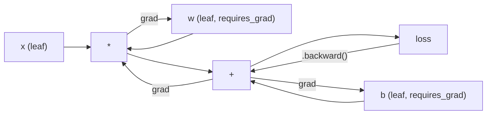
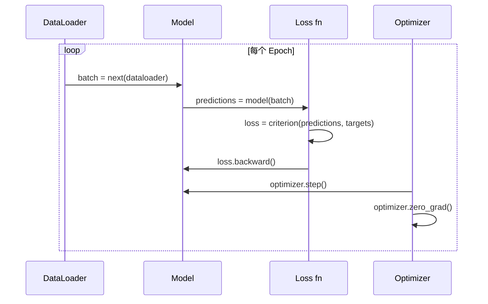

# PyTorch 简介

> 你曾用活塞和曲轴亲手造过引擎。现在来学人人都在开的那一辆。

**类型：** 动手实践
**语言：** Python
**前置知识：** 课程 03.10（从零构建迷你框架）
**时长：** 约 75 分钟

## 学习目标

- 使用 PyTorch 的 nn.Module、nn.Sequential 和 autograd 构建并训练 neural network (神经网络)
- 使用 PyTorch tensor (张量)、GPU acceleration (GPU加速) 和标准训练循环（zero_grad、forward、loss、backward、step）
- 将从零实现的迷你框架组件转换为对应的 PyTorch 等价实现
- 在相同任务上分析并对比纯 Python 框架与 PyTorch 的训练速度

## 问题背景

你已经有了一个可用的迷你框架。Linear layer (线性层)、ReLU (修正线性单元)、dropout (随机失活)、batch normalization (批归一化)、Adam (自适应矩估计)、DataLoader (数据加载器)、训练循环。它用纯 Python 训练了一个 4 层网络来解决圆形分类问题。

但它也比 PyTorch 慢 500 倍。

你的迷你框架用嵌套的 Python 循环逐个样本处理。PyTorch 则将同样的操作分发给经过优化的 C++/CUDA 内核在 GPU 上运行。在单张 NVIDIA A100 上，PyTorch 训练一个 ResNet-50（2560 万 parameter (参数)）在 ImageNet（128 万张图片）上大约只需 6 小时。你的框架在相同任务上大约需要 3000 小时——前提是你没有先耗尽内存。

速度不是唯一的差距。你的框架不支持 GPU。没有 automatic differentiation (自动微分)——你为每个 module (模块)手写了 backward()。没有序列化。没有分布式训练。没有 mixed precision (混合精度)。没有办法在不使用 print 语句的情况下调试 gradient (梯度)流。

PyTorch 填补了所有这些空白。而且它保持了你已经建立的心智模型：Module、forward()、parameters()、backward()、optimizer.step()。概念一一对应。语法几乎相同。区别在于，PyTorch 在你从零设计的相同接口背后，封装了十年的系统工程。

## 核心概念

### 为什么 PyTorch 胜出

2015 年，TensorFlow 要求你在运行任何代码之前先定义一个静态的 computational graph (计算图)。你建好图、编译它，然后把数据喂进去。调试意味着盯着图的可视化发呆。更改架构意味着从头重建整个图。

PyTorch 于 2017 年推出，秉持不同的理念：eager mode (动态图模式)。你写 Python，它立即执行。`y = model(x)` 现在就算出 y，而不是"往一个稍后才会计算的图里加个节点"。这意味着标准的 Python 调试工具都能用。print() 能用。pdb 能用。forward 里的 if/else 也能用。

到 2020 年，市场已经给出了答案。PyTorch 在 ML 研究论文中的占比从 2017 年的 7% 上升到 2022 年的超过 75%。Meta、Google DeepMind、OpenAI、Anthropic 和 Hugging Face 都将 PyTorch 作为主要框架。TensorFlow 2.x 随后也采用了 eager execution (动态执行)——这 tacitly 承认了 PyTorch 的设计是正确的。

教训：开发者体验会复利累积。一个慢 10% 但调试快 50% 的框架，每次都会赢。

### Tensor (张量)

tensor (张量)是一个多维数组，具有三个关键属性：shape（形状）、dtype（数据类型）和 device（设备）。

```python
import torch

x = torch.zeros(3, 4)           # shape: (3, 4), dtype: float32, device: cpu
x = torch.randn(2, 3, 224, 224) # 2 张 RGB 图片，224x224
x = torch.tensor([1, 2, 3])     # 从 Python 列表创建
```

**Shape** 是维度。标量的 shape 是 ()，向量是 (n,)，矩阵是 (m, n)，一批图片是 (batch, channels, height, width)。

**Dtype** 控制精度和内存。

| dtype | 位数 | 范围 | 用途 |
|-------|------|-------|----------|
| float32 | 32 | 约 7 位小数 | 默认训练 |
| float16 | 16 | 约 3.3 位小数 | 混合精度 |
| bfloat16 | 16 | 与 float32 相同范围，精度更低 | 大语言模型训练 |
| int8 | 8 | -128 到 127 | 量化推理 |

**Device** 决定计算发生在哪里。

```python
device = torch.device("cuda" if torch.cuda.is_available() else "cpu")
x = torch.randn(3, 4, device=device)
x = x.to("cuda")
x = x.cpu()
```

每个操作都要求所有 tensor (张量)位于同一个 device (设备)上。这是新手遇到最多的 PyTorch 错误：`RuntimeError: Expected all tensors to be on the same device`。解决办法是在计算前把所有内容移到同一个 device (设备)上。

**Reshaping（重塑）**是常数时间操作——它只改变元数据，不改变数据本身。

```python
x = torch.randn(2, 3, 4)
x.view(2, 12)      # 重塑为 (2, 12) -- 要求内存连续
x.reshape(6, 4)    # 重塑为 (6, 4) -- 总是可用
x.permute(2, 0, 1) # 重排维度
x.unsqueeze(0)     # 增加维度: (1, 2, 3, 4)
x.squeeze()        # 移除大小为 1 的维度
```

### Autograd (自动微分)

你的迷你框架要求你为每个 module (模块)实现 backward()。PyTorch 不需要。它把 tensor (张量)上的每个操作都记录到一个有向无环图（即 computational graph (计算图)）中，然后反向遍历该图来自动计算 gradient (梯度)。



与你的框架的关键区别：PyTorch 使用 tape-based autodiff（基于磁带的自动微分）。每个操作在 forward pass (前向传播)期间追加到一条"磁带"上。调用 `.backward()` 会反向回放这条磁带。

```python
x = torch.randn(3, requires_grad=True)
y = x ** 2 + 3 * x
z = y.sum()
z.backward()
print(x.grad)  # dz/dx = 2x + 3
```

autograd (自动微分)的三条规则：

1. 只有 `requires_grad=True` 的 leaf tensor (叶张量)才会累积 gradient (梯度)
2. gradient (梯度)默认会累积——每次 backward pass (反向传播)前调用 `optimizer.zero_grad()`
3. `torch.no_grad()` 禁用 gradient (梯度)追踪（在评估时使用）

### nn.Module (神经网络模块)

`nn.Module` 是 PyTorch 中每个 neural network (神经网络)组件的基类。你在第 10 课中已经构建了这个抽象。PyTorch 的版本增加了自动 parameter (参数)注册、递归 module (模块)发现、device (设备)管理和 state dict (状态字典)序列化。

```python
import torch.nn as nn

class MLP(nn.Module):
    def __init__(self, input_dim, hidden_dim, output_dim):
        super().__init__()
        self.layer1 = nn.Linear(input_dim, hidden_dim)
        self.relu = nn.ReLU()
        self.layer2 = nn.Linear(hidden_dim, output_dim)

    def forward(self, x):
        x = self.layer1(x)
        x = self.relu(x)
        x = self.layer2(x)
        return x
```

当你在 `__init__` 中将 `nn.Module` 或 `nn.Parameter` 赋值给属性时，PyTorch 会自动注册它。`model.parameters()` 会递归收集所有已注册的 parameter (参数)。这就是为什么你再也不用手动像迷你框架那样收集权重了。

关键构建块：

| Module | 作用 | 参数量 |
|--------|-------------|------------|
| nn.Linear(in, out) | Wx + b | in*out + out |
| nn.Conv2d(in_ch, out_ch, k) | 2D 卷积 | in_ch*out_ch*k*k + out_ch |
| nn.BatchNorm1d(features) | 归一化激活值 | 2 * features |
| nn.Dropout(p) | 随机置零 | 0 |
| nn.ReLU() | max(0, x) | 0 |
| nn.GELU() | 高斯误差线性单元 | 0 |
| nn.Embedding(vocab, dim) | 查找表 | vocab * dim |
| nn.LayerNorm(dim) | 逐样本归一化 | 2 * dim |

### Loss Function (损失函数) 和 Optimizer (优化器)

PyTorch 内置了你从零实现的所有东西的生产级版本。

**Loss function (损失函数)**（来自 `torch.nn`）：

| Loss | 任务 | 输入 |
|------|------|-------|
| nn.MSELoss() | 回归 | 任意形状 |
| nn.CrossEntropyLoss() | 多分类 | Logits（不要 softmax） |
| nn.BCEWithLogitsLoss() | 二分类 | Logits（不要 sigmoid） |
| nn.L1Loss() | 回归（鲁棒） | 任意形状 |
| nn.CTCLoss() | 序列对齐 | 对数概率 |

注意：`CrossEntropyLoss` 内部结合了 `LogSoftmax` + `NLLLoss`。传入原始 logits，不要传 softmax 输出。这是一个常见错误，会静默产生错误的 gradient (梯度)。

**Optimizer (优化器)**（来自 `torch.optim`）：

| Optimizer | 何时使用 | 典型 Learning Rate (学习率) |
|-----------|-------------|-----------|
| SGD(params, lr, momentum) | CNN、调优完善的流水线 | 0.01--0.1 |
| Adam(params, lr) | 默认起点 | 1e-3 |
| AdamW(params, lr, weight_decay) | Transformer、微调 | 1e-4--1e-3 |
| LBFGS(params) | 小规模、二阶方法 | 1.0 |

### 训练循环

每个 PyTorch 训练循环都遵循相同的 5 步模式。你在第 10 课中已经学过这个。



标准模式：

```python
for epoch in range(num_epochs):
    model.train()
    for inputs, targets in train_loader:
        inputs, targets = inputs.to(device), targets.to(device)
        optimizer.zero_grad()
        outputs = model(inputs)
        loss = criterion(outputs, targets)
        loss.backward()
        optimizer.step()
```

batch 循环里的五行代码。就是训练 GPT-4、Stable Diffusion 和 LLaMA 的那五行。架构会变，数据会变，这五行不会变。

### Dataset (数据集) 和 DataLoader (数据加载器)

PyTorch 的 `Dataset` 是一个抽象类，有两个方法：`__len__` 和 `__getitem__`。`DataLoader` 为它包装了 batching (批处理)、shuffling (打乱) 和多进程数据加载。

```python
from torch.utils.data import Dataset, DataLoader

class MNISTDataset(Dataset):
    def __init__(self, images, labels):
        self.images = images
        self.labels = labels

    def __len__(self):
        return len(self.labels)

    def __getitem__(self, idx):
        return self.images[idx], self.labels[idx]

loader = DataLoader(dataset, batch_size=64, shuffle=True, num_workers=4)
```

`num_workers=4` 会启动 4 个进程来并行加载数据，同时 GPU 训练当前 batch。在磁盘受限的工作负载（大图片、音频）上，仅此一项就能让训练速度翻倍。

### GPU 训练

将模型移到 GPU：

```python
device = torch.device("cuda" if torch.cuda.is_available() else "cpu")
model = model.to(device)
```

这会递归地将每个 parameter (参数)和 buffer 移到 GPU。然后在训练期间把每个 batch 也移过去：

```python
inputs, targets = inputs.to(device), targets.to(device)
```

**Mixed precision (混合精度)**在 modern GPU（A100、H100、RTX 4090）上将内存减半、吞吐量翻倍，方法是 forward/backward 用 float16 计算，同时 master weights 保持 float32：

```python
from torch.amp import autocast, GradScaler

scaler = GradScaler()
for inputs, targets in loader:
    with autocast(device_type="cuda"):
        outputs = model(inputs)
        loss = criterion(outputs, targets)
    scaler.scale(loss).backward()
    scaler.step(optimizer)
    scaler.update()
    optimizer.zero_grad()
```

### 对比：迷你框架 vs PyTorch vs JAX

| 特性 | 迷你框架（第 10 课） | PyTorch | JAX |
|---------|---------------------|---------|-----|
| 自动微分 | 手动 backward() | Tape-based autograd (基于磁带的自动微分) | 函数式变换 |
| 执行模式 | Eager (Python 循环) | Eager (C++ 内核) | Traced + JIT 编译 |
| GPU 支持 | 无 | 有（CUDA、ROCm、MPS） | 有（CUDA、TPU） |
| 速度（MNIST MLP） | ~300s/epoch | ~0.5s/epoch | ~0.3s/epoch |
| Module 系统 | 自定义 Module 类 | nn.Module | 无状态函数（Flax/Equinox） |
| 调试 | print() | print()、pdb、breakpoint() | 更难（JIT tracing 会破坏 print） |
| 生态 | 无 | Hugging Face、Lightning、timm | Flax、Optax、Orbax |
| 学习曲线 | 你亲手造的 | 中等 | 陡峭（函数式范式） |
| 生产使用 | 玩具问题 | Meta、OpenAI、Anthropic、HF | Google DeepMind、Midjourney |

## 动手实践

一个仅使用 PyTorch 原生 API 在 MNIST 上训练的 3 层 MLP。没有高层封装。没有 `torchvision.datasets`。我们自己下载并解析原始数据。

### 第 1 步：从原始文件加载 MNIST

MNIST 以 4 个 gzip 文件分发：训练图片（60,000 x 28 x 28）、训练标签、测试图片（10,000 x 28 x 28）、测试标签。我们下载它们并解析二进制格式。

```python
import torch
import torch.nn as nn
import struct
import gzip
import urllib.request
import os

def download_mnist(path="./mnist_data"):
    base_url = "https://storage.googleapis.com/cvdf-datasets/mnist/"
    files = [
        "train-images-idx3-ubyte.gz",
        "train-labels-idx1-ubyte.gz",
        "t10k-images-idx3-ubyte.gz",
        "t10k-labels-idx1-ubyte.gz",
    ]
    os.makedirs(path, exist_ok=True)
    for f in files:
        filepath = os.path.join(path, f)
        if not os.path.exists(filepath):
            urllib.request.urlretrieve(base_url + f, filepath)

def load_images(filepath):
    with gzip.open(filepath, "rb") as f:
        magic, num, rows, cols = struct.unpack(">IIII", f.read(16))
        data = f.read()
        images = torch.frombuffer(bytearray(data), dtype=torch.uint8)
        images = images.reshape(num, rows * cols).float() / 255.0
    return images

def load_labels(filepath):
    with gzip.open(filepath, "rb") as f:
        magic, num = struct.unpack(">II", f.read(8))
        data = f.read()
        labels = torch.frombuffer(bytearray(data), dtype=torch.uint8).long()
    return labels
```

### 第 2 步：定义模型

一个 3 层 MLP：784 -> 256 -> 128 -> 10。ReLU activation function (激活函数)。Dropout (随机失活)用于正则化。为了简单起见不加 batch normalization (批归一化)。

```python
class MNISTModel(nn.Module):
    def __init__(self):
        super().__init__()
        self.net = nn.Sequential(
            nn.Linear(784, 256),
            nn.ReLU(),
            nn.Dropout(0.2),
            nn.Linear(256, 128),
            nn.ReLU(),
            nn.Dropout(0.2),
            nn.Linear(128, 10),
        )

    def forward(self, x):
        return self.net(x)
```

输出层产生 10 个原始 logits（每个数字一个）。不要 softmax——`CrossEntropyLoss` 内部会处理。

参数量：784*256 + 256 + 256*128 + 128 + 128*10 + 10 = 235,146。按现代标准来说非常小。GPT-2 small 有 1.24 亿。这个几秒钟就能训练完。

### 第 3 步：训练循环

标准的 forward-loss-backward-step 模式。

```python
def train_one_epoch(model, loader, criterion, optimizer, device):
    model.train()
    total_loss = 0
    correct = 0
    total = 0
    for images, labels in loader:
        images, labels = images.to(device), labels.to(device)
        optimizer.zero_grad()
        outputs = model(images)
        loss = criterion(outputs, labels)
        loss.backward()
        optimizer.step()
        total_loss += loss.item() * images.size(0)
        _, predicted = outputs.max(1)
        correct += predicted.eq(labels).sum().item()
        total += labels.size(0)
    return total_loss / total, correct / total


def evaluate(model, loader, criterion, device):
    model.eval()
    total_loss = 0
    correct = 0
    total = 0
    with torch.no_grad():
        for images, labels in loader:
            images, labels = images.to(device), labels.to(device)
            outputs = model(images)
            loss = criterion(outputs, labels)
            total_loss += loss.item() * images.size(0)
            _, predicted = outputs.max(1)
            correct += predicted.eq(labels).sum().item()
            total += labels.size(0)
    return total_loss / total, correct / total
```

注意评估时用了 `torch.no_grad()`。这会禁用 autograd (自动微分)，减少内存使用并加速推理。没有它，PyTorch 会构建一个你永远不会用的 computational graph (计算图)。

### 第 4 步：整合所有内容

```python
def main():
    device = torch.device("cuda" if torch.cuda.is_available() else "cpu")

    download_mnist()
    train_images = load_images("./mnist_data/train-images-idx3-ubyte.gz")
    train_labels = load_labels("./mnist_data/train-labels-idx1-ubyte.gz")
    test_images = load_images("./mnist_data/t10k-images-idx3-ubyte.gz")
    test_labels = load_labels("./mnist_data/t10k-labels-idx1-ubyte.gz")

    train_dataset = torch.utils.data.TensorDataset(train_images, train_labels)
    test_dataset = torch.utils.data.TensorDataset(test_images, test_labels)
    train_loader = torch.utils.data.DataLoader(
        train_dataset, batch_size=64, shuffle=True
    )
    test_loader = torch.utils.data.DataLoader(
        test_dataset, batch_size=256, shuffle=False
    )

    model = MNISTModel().to(device)
    criterion = nn.CrossEntropyLoss()
    optimizer = torch.optim.Adam(model.parameters(), lr=1e-3)

    num_params = sum(p.numel() for p in model.parameters())
    print(f"Device: {device}")
    print(f"Parameters: {num_params:,}")
    print(f"Train samples: {len(train_dataset):,}")
    print(f"Test samples: {len(test_dataset):,}")
    print()

    for epoch in range(10):
        train_loss, train_acc = train_one_epoch(
            model, train_loader, criterion, optimizer, device
        )
        test_loss, test_acc = evaluate(
            model, test_loader, criterion, device
        )
        print(
            f"Epoch {epoch+1:2d} | "
            f"Train Loss: {train_loss:.4f} | Train Acc: {train_acc:.4f} | "
            f"Test Loss: {test_loss:.4f} | Test Acc: {test_acc:.4f}"
        )

    torch.save(model.state_dict(), "mnist_mlp.pt")
    print(f"\nModel saved to mnist_mlp.pt")
    print(f"Final test accuracy: {test_acc:.4f}")
```

10 个 epoch 后的预期输出：约 97.8% 的测试准确率。CPU 训练时间：约 30 秒。GPU：约 5 秒。用你的迷你框架跑相同架构：约 45 分钟。

## 使用它

### 快速对比：迷你框架 vs PyTorch

| 迷你框架（第 10 课） | PyTorch |
|---------------------------|---------|
| `model = Sequential(Linear(784, 256), ReLU(), ...)` | `model = nn.Sequential(nn.Linear(784, 256), nn.ReLU(), ...)` |
| `pred = model.forward(x)` | `pred = model(x)` |
| `optimizer.zero_grad()` | `optimizer.zero_grad()` |
| `grad = criterion.backward()` 然后 `model.backward(grad)` | `loss.backward()` |
| `optimizer.step()` | `optimizer.step()` |
| 无 GPU | `model.to("cuda")` |
| 每个 module 手动 backward | Autograd (自动微分)处理一切 |

接口几乎完全相同。区别在底层的一切。

### 保存和加载模型

```python
torch.save(model.state_dict(), "model.pt")

model = MNISTModel()
model.load_state_dict(torch.load("model.pt", weights_only=True))
model.eval()
```

始终保存 `state_dict()`（parameter (参数)字典），而不是模型对象。保存模型对象使用 pickle，代码重构后会失效。State dict (状态字典)是可移植的。

### Learning Rate (学习率) 调度

```python
scheduler = torch.optim.lr_scheduler.CosineAnnealingLR(
    optimizer, T_max=10
)
for epoch in range(10):
    train_one_epoch(model, train_loader, criterion, optimizer, device)
    scheduler.step()
```

PyTorch 内置了 15 多种 scheduler (调度器)：StepLR、ExponentialLR、CosineAnnealingLR、OneCycleLR、ReduceLROnPlateau。它们都接入相同的 optimizer (优化器)接口。

## 交付物

本课产出两个 artifact (产物)：

- `outputs/prompt-pytorch-debugger.md` —— 一个用于诊断常见 PyTorch 训练失败的 prompt (提示词)
- `outputs/skill-pytorch-patterns.md` —— 一个 PyTorch 训练模式的 skill (技能)参考

## 练习

1. **添加 batch normalization (批归一化)。**在每个 linear layer (线性层)后（activation function (激活函数)前）插入 `nn.BatchNorm1d`。对比测试准确率和训练速度与仅使用 dropout (随机失活)的版本。Batch norm (批归一化)应该在更少 epoch 内达到 98%+。

2. **实现 learning rate (学习率)查找器。**用一个 epoch，让 learning rate (学习率)从 1e-7 指数增长到 1.0。绘制 loss vs LR 曲线。最优 LR 就在 loss 开始上升之前。用它来为 MNIST 模型选一个更好的 learning rate (学习率)。

3. **迁移到 GPU 并使用 mixed precision (混合精度)。**在训练循环中加入 `torch.amp.autocast` 和 `GradScaler`。测量 GPU 上使用和不用 mixed precision (混合精度)的 throughput (吞吐量，样本/秒)。在 A100 上，预期约 2 倍加速。

4. **构建自定义 Dataset (数据集)。**下载 Fashion-MNIST（格式与 MNIST 相同，但内容是服装）。实现一个 `FashionMNISTDataset(Dataset)` 类，包含 `__getitem__` 和 `__len__`。用相同的 MLP 训练并对比准确率。Fashion-MNIST 更难——预期约 88% 对比约 98%。

5. **用 SGD + momentum 替换 Adam。**用 `SGD(params, lr=0.01, momentum=0.9)` 训练。对比收敛曲线。然后加上 `CosineAnnealingLR` scheduler (调度器)，看看 SGD 能否在第 10 个 epoch 追上 Adam。

## 关键术语

| 术语 | 人们怎么说 | 它实际是什么意思 |
|------|----------------|----------------------|
| Tensor (张量) | "一个多维数组" | 一个带类型、感知 device (设备)的数组，每个操作都内置了 automatic differentiation (自动微分)支持 |
| Autograd (自动微分) | "自动反向传播" | 一个在 forward pass (前向传播)期间记录操作、然后反向回放以计算精确 gradient (梯度)的 tape-based (基于磁带)系统 |
| nn.Module (神经网络模块) | "一个层" | 任何可微计算块的基类——注册 parameter (参数)、支持嵌套、处理 train/eval 模式 |
| state_dict (状态字典) | "模型权重" | 一个将 parameter (参数)名映射到 tensor (张量)的 OrderedDict——训练后模型的可移植、可序列化表示 |
| .backward() | "计算 gradient (梯度)" | 反向遍历 computational graph (计算图)，为每个 requires_grad=True 的 leaf tensor (叶张量)计算并累积 gradient (梯度) |
| .to(device) | "移到 GPU" | 递归地将所有 parameter (参数)和 buffer 转移到指定 device (设备)（CPU、CUDA、MPS） |
| DataLoader (数据加载器) | "数据流水线" | 一个从 Dataset (数据集)中 batch (批处理)、shuffle (打乱)并可选并行加载数据的迭代器 |
| Mixed precision (混合精度) | "用 float16" | forward/backward 用 float16 训练以加速，同时保持 float32 master weights 以确保数值稳定性 |
| Eager execution (动态执行) | "立即执行" | 操作在调用时立即执行，而不是推迟到后续编译步骤——这是区分 PyTorch 与 TF 1.x 的核心设计选择 |
| zero_grad | "重置 gradient (梯度)" | 在下次 backward pass (反向传播)前将所有 parameter (参数)的 gradient (梯度)置零，因为 PyTorch 默认会累积 gradient (梯度) |

## 延伸阅读

- Paszke et al., "PyTorch: An Imperative Style, High-Performance Deep Learning Library" (2019) —— 解释 PyTorch 设计权衡的原始论文
- PyTorch Tutorials: "Learning PyTorch with Examples" (https://pytorch.org/tutorials/beginner/pytorch_with_examples.html) —— 从 tensor (张量)到 nn.Module 的官方入门路径
- PyTorch Performance Tuning Guide (https://pytorch.org/tutorials/recipes/recipes/tuning_guide.html) —— mixed precision (混合精度)、DataLoader worker、pin_memory 等生产优化
- Horace He, "Making Deep Learning Go Brrrr" (https://horace.io/brrr_intro.html) —— 为什么 GPU 训练很快，以及 PyTorch 特定的优化策略
