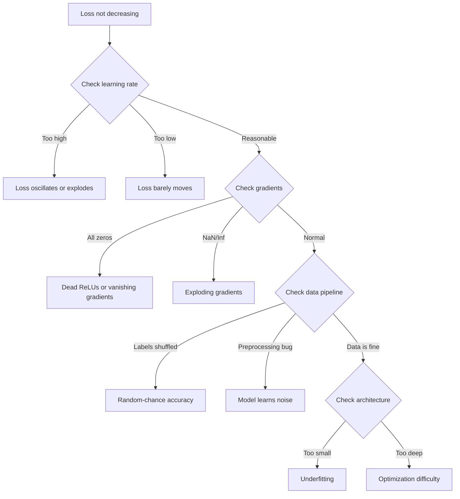
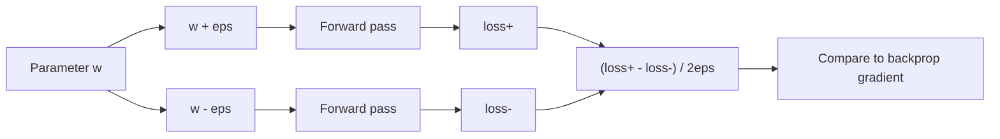
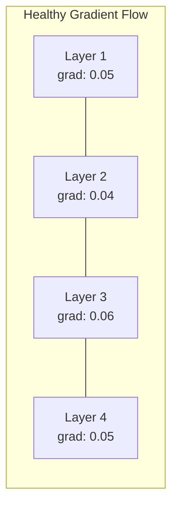
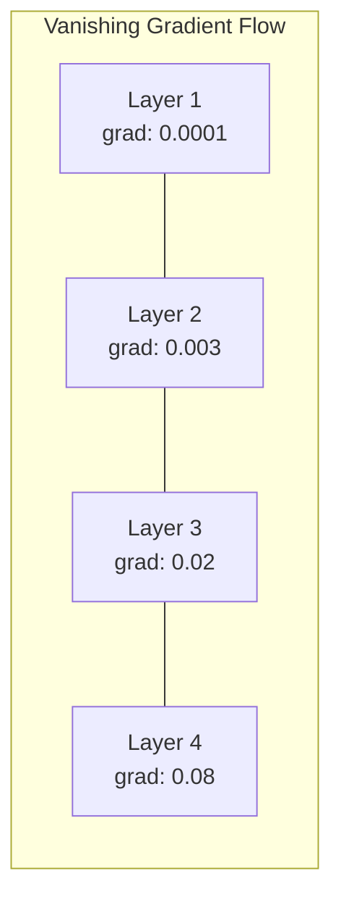
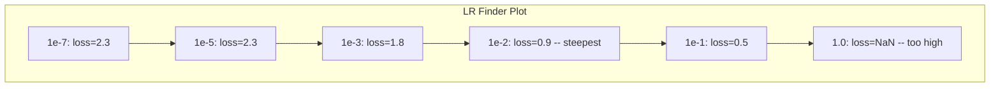

# 调试神经网络 (Debugging Neural Networks)

> 你的网络编译通过了。它运行了。它输出了一个数字。这个数字是错的，但没有任何崩溃。欢迎来到最难的调试类型——没有错误消息的调试。

**类型:** 实践
**语言:** Python, PyTorch
**前置知识:** Phase 03 课程 01-10（尤其是反向传播、loss function (损失函数)、optimizer (优化器)）
**时间:** ~90 分钟

## 学习目标

- 使用系统化的调试策略诊断常见的 neural network (神经网络) 故障（NaN (非数字) loss、flat loss curve、overfitting (过拟合)、oscillation）
- 应用 "overfit one batch" 技术验证模型架构和训练循环是否正确
- 检查 gradient magnitude (梯度大小)、activation distribution (激活分布) 和 weight norm (权重范数) 以识别 vanishing/exploding gradient (梯度消失/爆炸) 问题
- 构建一个覆盖数据管道、模型架构、loss function (损失函数)、optimizer (优化器) 和 learning rate (学习率) 问题的调试清单

## 问题所在

传统软件在出错时会崩溃。空指针抛出异常。类型不匹配在编译时失败。差一错误产生明显错误的输出。

Neural network (神经网络) 不会给你这种便利。

一个损坏的 neural network (神经网络) 会运行到完成，打印一个 loss 值，并输出预测。Loss 可能会下降。预测可能看起来合理。但模型是静默错误的——学习捷径、记忆噪声，或收敛到一个无用的局部最小值。Google 研究人员估计，60-70% 的 ML 调试时间花在了"静默"错误上，这些错误不产生任何错误但会降低模型质量。

工作模型和损坏模型之间的区别通常只是一行放错位置的代码：缺少 `zero_grad()`、转置的维度、learning rate (学习率) 偏差 10 倍。经典的 "Recipe for Training Neural Networks" (2019) 开篇就这样说："最常见的 neural net (神经网络) 错误是不会崩溃的 bug。"

本课程教你如何找到这些 bug。

## 核心概念

### 调试心态

忘掉打印-祈祷式调试。Neural network (神经网络) 调试需要系统化的方法，因为反馈循环很慢（每次训练运行需要几分钟到几小时），而且症状是模糊的（bad loss 可能意味着 20 种不同的事情）。

黄金法则：**从简单开始，一次添加一个复杂度，并独立验证每个部分。**



### 症状 1: Loss 不下降

这是最常见的抱怨。训练循环在运行，epoch 在流逝，但 loss 保持平坦或剧烈振荡。

**Learning rate (学习率) 错误。** 太高：loss 振荡或跳到 NaN。太低：loss 下降得如此缓慢以至于看起来是平坦的。对于 Adam (自适应矩估计)，从 1e-3 开始。对于 SGD (随机梯度下降)，从 1e-1 或 1e-2 开始。在断定其他问题之前，总是尝试 3 个 learning rate (学习率)，每个相差 10 倍（例如，1e-2, 1e-3, 1e-4）。

**Dead ReLU (死亡ReLU)。** 如果 ReLU (修正线性单元) 神经元接收到大的负输入，它输出 0 且其梯度为 0。它再也不会激活了。如果足够多的神经元死亡，网络就无法学习。检查：打印每个 ReLU (修正线性单元) 层后恰好为 0 的激活比例。如果 >50% 死亡，切换到 LeakyReLU 或降低 learning rate (学习率)。

**Vanishing gradients (梯度消失)。** 在使用 sigmoid (S型函数) 或 tanh (双曲正切) 激活的深层网络中，梯度在反向传播时指数级缩小。当它们到达第一层时，已经约等于 0。第一层停止学习。修复：使用 ReLU/GELU，添加 residual connections (残差连接)，或使用 batch normalization (批归一化)。

**Exploding gradients (梯度爆炸)。** 相反的问题——梯度指数级增长。在 RNN 和非常深的网络中很常见。Loss 跳到 NaN。修复：gradient clipping (梯度裁剪) (`torch.nn.utils.clip_grad_norm_`)，降低 learning rate (学习率)，或添加 normalization (归一化)。

### 症状 2: Loss 下降但模型表现差

Loss 在下降。Training accuracy (训练准确率) 达到 99%。但 test accuracy (测试准确率) 是 55%。或者模型在真实数据上产生荒谬的输出。

**Overfitting (过拟合)。** 模型记忆训练数据而不是学习模式。Training loss (训练损失) 和 validation loss (验证损失) 之间的差距随时间增长。修复：更多数据、dropout (随机失活)、weight decay (权重衰减)、early stopping (早停)、data augmentation (数据增强)。

**Data leakage (数据泄漏)。** 测试数据泄漏到训练中。Accuracy 高得可疑。常见原因：在拆分前 shuffle、使用完整数据集的统计信息进行预处理、跨拆分的重复样本。修复：先拆分，再预处理，检查重复项。

**Label errors (标签错误)。** 大多数真实数据集中 5-10% 的标签是错误的（Northcutt 等人，2021 —— "Pervasive Label Errors in Test Sets"）。模型学习了噪声。修复：使用 confident learning 查找和修复错误标记的示例，或使用 loss truncation 忽略高 loss 样本。

### 症状 3: Loss 中出现 NaN 或 Inf

Loss 值变成 `nan` 或 `inf`。训练已死。

**Learning rate (学习率) 太高。** 梯度更新超调太远以至于权重爆炸。修复：降低 10 倍。

**log(0) 或 log(负数)。** Cross-entropy (交叉熵) loss 计算 `log(p)`。如果你的模型输出恰好为 0 或负概率，log 就会爆炸。修复：将预测 clamp 到 `[eps, 1-eps]`，其中 `eps=1e-7`。

**除以零。** Batch normalization (批归一化) 除以标准差。具有恒定值的 batch 的 std=0。修复：向分母添加 epsilon（PyTorch 默认这样做，但自定义实现可能不会）。

**数值溢出。** 大激活值输入 `exp()` 产生 Inf。Softmax (软最大值) 特别容易受影响。修复：在指数化之前减去最大值（log-sum-exp 技巧）。

### 技术 1: 梯度检查 (Gradient Checking)

将你的 analytical gradients (解析梯度)（来自反向传播）与 numerical gradients (数值梯度)（来自有限差分）进行比较。如果它们不一致，你的反向传播有 bug。

参数 `w` 的 numerical gradient (数值梯度)：

```
grad_numerical = (loss(w + eps) - loss(w - eps)) / (2 * eps)
```

一致性指标（相对差异）：

```
rel_diff = |grad_analytical - grad_numerical| / max(|grad_analytical|, |grad_numerical|, 1e-8)
```

如果 `rel_diff < 1e-5`：正确。如果 `rel_diff > 1e-3`：几乎肯定有 bug。



### 技术 2: 激活统计 (Activation Statistics)

在训练期间监控每层之后激活的 mean (均值) 和 standard deviation (标准差)。健康的网络保持激活值 mean (均值) 接近 0 且 std (标准差) 接近 1（在 normalization (归一化) 之后）或至少是有界的。

| 健康指标 | Mean (均值) | Std (标准差) | 诊断 |
|-----------------|------|-----|-----------|
| 健康 | ~0 | ~1 | 网络正常学习 |
| 饱和 | >>0 或 <<0 | ~0 | 激活值卡在极端值 |
| 死亡 | 0 | 0 | 神经元死亡（全为零） |
| 爆炸 | >>10 | >>10 | 激活值无界增长 |

### 技术 3: 梯度流可视化 (Gradient Flow Visualization)

绘制每层的平均 gradient magnitude (梯度大小)。在健康的网络中，gradient magnitude (梯度大小) 应该在各层之间大致相似。如果早期层的梯度比后期层小 1000 倍，你就有了 vanishing gradients (梯度消失)。





### 技术 4: Overfit-One-Batch 测试

深度学习中最重要的调试技术。

取一小批数据（8-32 个样本）。在其上训练 100+ 次迭代。Loss 应该接近零，training accuracy (训练准确率) 应该达到 100%。如果没有，你的模型或训练循环有根本性 bug——不要继续完整训练。

这个测试能发现：
- 损坏的 loss function (损失函数)
- 损坏的反向传播
- 架构太小无法表示数据
- Optimizer (优化器) 未连接到模型参数
- 数据和标签未对齐

这只需要 30 秒运行，但能节省数小时调试完整训练运行的时间。

### 技术 5: Learning Rate Finder (学习率查找器)

Leslie Smith (2017) 提出将 learning rate (学习率) 从非常小（1e-7）到非常大（10）在一个 epoch 内扫描，同时记录 loss。绘制 loss 与 learning rate (学习率) 的关系图。最优 learning rate (学习率) 大约是 loss 开始最快下降前的 rate 的 1/10。



此示例中的最佳 LR：~1e-3（在最陡点前一个数量级）。

### 常见 PyTorch Bug

这些是 PyTorch 社区中浪费最多集体时间的 bug：

| Bug | 症状 | 修复 |
|-----|---------|-----|
| 忘记 `optimizer.zero_grad()` | 梯度在 batch 之间累积，loss 振荡 | 在 `loss.backward()` 之前添加 `optimizer.zero_grad()` |
| 测试时忘记 `model.eval()` | Dropout (随机失活) 和 batch norm (批归一化) 行为不同，test accuracy (测试准确率) 在运行之间变化 | 添加 `model.eval()` 和 `torch.no_grad()` |
| 错误的 tensor shape | 静默广播产生错误结果，无错误 | 调试时在每个操作后打印 shape |
| CPU/GPU 不匹配 | `RuntimeError: expected CUDA tensor` | 在模型和数据上都使用 `.to(device)` |
| 未 detach tensor | 计算图无限增长，OOM | 使用 `.detach()` 或 `with torch.no_grad()` |
| 原地操作破坏 autograd | `RuntimeError: modified by in-place operation` | 将 `x += 1` 替换为 `x = x + 1` |
| 数据未 normalization (归一化) | Loss 卡在随机机会水平 | 将输入 normalization (归一化) 到 mean=0, std=1 |
| 标签 dtype 错误 | Cross-entropy (交叉熵) 期望 `Long`，得到 `Float` | 转换标签：`labels.long()` |

### 主调试表

| 症状 | 可能原因 | 首先尝试 |
|---------|-------------|-------------------|
| Loss 卡在 -log(1/num_classes) | 模型预测均匀分布 | 检查数据管道，验证标签与输入匹配 |
| 几步后 Loss NaN | Learning rate (学习率) 太高 | 降低 LR 10 倍 |
| 立即 Loss NaN | log(0) 或除以零 | 向 log/除法操作添加 epsilon |
| Loss 剧烈振荡 | LR 太高或 batch size (批量大小) 太小 | 降低 LR，增加 batch size (批量大小) |
| Loss 下降后平台期 | 微调阶段 LR 太高 | 添加 LR schedule (学习率调度)（cosine 或 step decay） |
| Training acc (训练准确率) 高，test acc (测试准确率) 低 | Overfitting (过拟合) | 添加 dropout (随机失活)、weight decay (权重衰减)、更多数据 |
| Training acc = test acc = 随机水平 | 模型什么都没学到 | 运行 overfit-one-batch 测试 |
| Training acc = test acc 但都低 | Underfitting (欠拟合) | 更大的模型、更多层、更多特征 |
| 梯度全为零 | Dead ReLU (死亡ReLU) 或分离的计算图 | 切换到 LeakyReLU，检查 `.requires_grad` |
| 训练期间 OOM | Batch 太大或图未释放 | 减小 batch size (批量大小)，评估时使用 `torch.no_grad()` |

## 动手实现

一个监控激活、梯度和 loss curve 的诊断工具包。你将故意破坏一个网络，并使用工具包诊断每个问题。

### 步骤 1: NetworkDebugger 类

Hook 到 PyTorch 模型以记录每层的激活和梯度统计。

```python
import torch
import torch.nn as nn
import math


class NetworkDebugger:
    def __init__(self, model):
        self.model = model
        self.activation_stats = {}
        self.gradient_stats = {}
        self.loss_history = []
        self.lr_losses = []
        self.hooks = []
        self._register_hooks()

    def _register_hooks(self):
        for name, module in self.model.named_modules():
            if isinstance(module, (nn.Linear, nn.Conv2d, nn.ReLU, nn.LeakyReLU)):
                hook = module.register_forward_hook(self._make_activation_hook(name))
                self.hooks.append(hook)
                hook = module.register_full_backward_hook(self._make_gradient_hook(name))
                self.hooks.append(hook)

    def _make_activation_hook(self, name):
        def hook(module, input, output):
            with torch.no_grad():
                out = output.detach().float()
                self.activation_stats[name] = {
                    "mean": out.mean().item(),
                    "std": out.std().item(),
                    "fraction_zero": (out == 0).float().mean().item(),
                    "min": out.min().item(),
                    "max": out.max().item(),
                }
        return hook

    def _make_gradient_hook(self, name):
        def hook(module, grad_input, grad_output):
            if grad_output[0] is not None:
                with torch.no_grad():
                    grad = grad_output[0].detach().float()
                    self.gradient_stats[name] = {
                        "mean": grad.mean().item(),
                        "std": grad.std().item(),
                        "abs_mean": grad.abs().mean().item(),
                        "max": grad.abs().max().item(),
                    }
        return hook

    def record_loss(self, loss_value):
        self.loss_history.append(loss_value)

    def check_loss_health(self):
        if len(self.loss_history) < 2:
            return "NOT_ENOUGH_DATA"
        recent = self.loss_history[-10:]
        if any(math.isnan(v) or math.isinf(v) for v in recent):
            return "NAN_OR_INF"
        if len(self.loss_history) >= 20:
            first_half = sum(self.loss_history[:10]) / 10
            second_half = sum(self.loss_history[-10:]) / 10
            if second_half >= first_half * 0.99:
                return "NOT_DECREASING"
        if len(recent) >= 5:
            diffs = [recent[i+1] - recent[i] for i in range(len(recent)-1)]
            if max(diffs) - min(diffs) > 2 * abs(sum(diffs) / len(diffs)):
                return "OSCILLATING"
        return "HEALTHY"

    def check_activations(self):
        issues = []
        for name, stats in self.activation_stats.items():
            if stats["fraction_zero"] > 0.5:
                issues.append(f"DEAD_NEURONS: {name} has {stats['fraction_zero']:.0%} zero activations")
            if abs(stats["mean"]) > 10:
                issues.append(f"EXPLODING_ACTIVATIONS: {name} mean={stats['mean']:.2f}")
            if stats["std"] < 1e-6:
                issues.append(f"COLLAPSED_ACTIVATIONS: {name} std={stats['std']:.2e}")
        return issues if issues else ["HEALTHY"]

    def check_gradients(self):
        issues = []
        grad_magnitudes = []
        for name, stats in self.gradient_stats.items():
            grad_magnitudes.append((name, stats["abs_mean"]))
            if stats["abs_mean"] < 1e-7:
                issues.append(f"VANISHING_GRADIENT: {name} abs_mean={stats['abs_mean']:.2e}")
            if stats["abs_mean"] > 100:
                issues.append(f"EXPLODING_GRADIENT: {name} abs_mean={stats['abs_mean']:.2e}")
        if len(grad_magnitudes) >= 2:
            first_mag = grad_magnitudes[0][1]
            last_mag = grad_magnitudes[-1][1]
            if last_mag > 0 and first_mag / last_mag > 100:
                issues.append(f"GRADIENT_RATIO: first/last = {first_mag/last_mag:.0f}x (vanishing)")
        return issues if issues else ["HEALTHY"]

    def print_report(self):
        print("\n=== NETWORK DEBUGGER REPORT ===")
        print(f"\nLoss health: {self.check_loss_health()}")
        if self.loss_history:
            print(f"  Last 5 losses: {[f'{v:.4f}' for v in self.loss_history[-5:]]}")
        print("\nActivation diagnostics:")
        for item in self.check_activations():
            print(f"  {item}")
        print("\nGradient diagnostics:")
        for item in self.check_gradients():
            print(f"  {item}")
        print("\nPer-layer activation stats:")
        for name, stats in self.activation_stats.items():
            print(f"  {name}: mean={stats['mean']:.4f} std={stats['std']:.4f} zero={stats['fraction_zero']:.1%}")
        print("\nPer-layer gradient stats:")
        for name, stats in self.gradient_stats.items():
            print(f"  {name}: abs_mean={stats['abs_mean']:.2e} max={stats['max']:.2e}")

    def remove_hooks(self):
        for hook in self.hooks:
            hook.remove()
        self.hooks.clear()
```

### 步骤 2: Overfit-One-Batch 测试

```python
def overfit_one_batch(model, x_batch, y_batch, criterion, lr=0.01, steps=200):
    optimizer = torch.optim.Adam(model.parameters(), lr=lr)
    model.train()
    print("\n=== OVERFIT ONE BATCH TEST ===")
    print(f"Batch size: {x_batch.shape[0]}, Steps: {steps}")

    for step in range(steps):
        optimizer.zero_grad()
        output = model(x_batch)
        loss = criterion(output, y_batch)
        loss.backward()
        optimizer.step()

        if step % 50 == 0 or step == steps - 1:
            with torch.no_grad():
                preds = (output > 0).float() if output.shape[-1] == 1 else output.argmax(dim=1)
                targets = y_batch if y_batch.dim() == 1 else y_batch.squeeze()
                acc = (preds.squeeze() == targets).float().mean().item()
            print(f"  Step {step:3d} | Loss: {loss.item():.6f} | Accuracy: {acc:.1%}")

    final_loss = loss.item()
    if final_loss > 0.1:
        print(f"\n  FAIL: Loss did not converge ({final_loss:.4f}). Model or training loop is broken.")
        return False
    print(f"\n  PASS: Loss converged to {final_loss:.6f}")
    return True
```

### 步骤 3: Learning Rate Finder (学习率查找器)

```python
def find_learning_rate(model, x_data, y_data, criterion, start_lr=1e-7, end_lr=10, steps=100):
    import copy
    original_state = copy.deepcopy(model.state_dict())
    optimizer = torch.optim.SGD(model.parameters(), lr=start_lr)
    lr_mult = (end_lr / start_lr) ** (1 / steps)

    model.train()
    results = []
    best_loss = float("inf")
    current_lr = start_lr

    print("\n=== LEARNING RATE FINDER ===")

    for step in range(steps):
        optimizer.zero_grad()
        output = model(x_data)
        loss = criterion(output, y_data)

        if math.isnan(loss.item()) or loss.item() > best_loss * 10:
            break

        best_loss = min(best_loss, loss.item())
        results.append((current_lr, loss.item()))

        loss.backward()
        optimizer.step()

        current_lr *= lr_mult
        for param_group in optimizer.param_groups:
            param_group["lr"] = current_lr

    model.load_state_dict(original_state)

    if len(results) < 10:
        print("  Could not complete LR sweep -- loss diverged too quickly")
        return results

    min_loss_idx = min(range(len(results)), key=lambda i: results[i][1])
    suggested_lr = results[max(0, min_loss_idx - 10)][0]

    print(f"  Swept {len(results)} steps from {start_lr:.0e} to {results[-1][0]:.0e}")
    print(f"  Minimum loss {results[min_loss_idx][1]:.4f} at lr={results[min_loss_idx][0]:.2e}")
    print(f"  Suggested learning rate: {suggested_lr:.2e}")

    return results
```

### 步骤 4: 梯度检查器 (Gradient Checker)

```python
def _flat_to_multi_index(flat_idx, shape):
    multi_idx = []
    remaining = flat_idx
    for dim in reversed(shape):
        multi_idx.insert(0, remaining % dim)
        remaining //= dim
    return tuple(multi_idx)


def gradient_check(model, x, y, criterion, eps=1e-4):
    model.train()
    x_double = x.double()
    y_double = y.double()
    model_double = model.double()

    print("\n=== GRADIENT CHECK ===")
    overall_max_diff = 0
    checked = 0

    for name, param in model_double.named_parameters():
        if not param.requires_grad:
            continue

        layer_max_diff = 0

        model_double.zero_grad()
        output = model_double(x_double)
        loss = criterion(output, y_double)
        loss.backward()
        analytical_grad = param.grad.clone()

        num_checks = min(5, param.numel())
        for i in range(num_checks):
            idx = _flat_to_multi_index(i, param.shape)
            original = param.data[idx].item()

            param.data[idx] = original + eps
            with torch.no_grad():
                loss_plus = criterion(model_double(x_double), y_double).item()

            param.data[idx] = original - eps
            with torch.no_grad():
                loss_minus = criterion(model_double(x_double), y_double).item()

            param.data[idx] = original

            numerical = (loss_plus - loss_minus) / (2 * eps)
            analytical = analytical_grad[idx].item()

            denom = max(abs(numerical), abs(analytical), 1e-8)
            rel_diff = abs(numerical - analytical) / denom

            layer_max_diff = max(layer_max_diff, rel_diff)
            checked += 1

        overall_max_diff = max(overall_max_diff, layer_max_diff)
        status = "OK" if layer_max_diff < 1e-5 else "MISMATCH"
        print(f"  {name}: max_rel_diff={layer_max_diff:.2e} [{status}]")

    model.float()

    print(f"\n  Checked {checked} parameters")
    if overall_max_diff < 1e-5:
        print("  PASS: Gradients match (rel_diff < 1e-5)")
    elif overall_max_diff < 1e-3:
        print("  WARN: Small differences (1e-5 < rel_diff < 1e-3)")
    else:
        print("  FAIL: Gradient mismatch detected (rel_diff > 1e-3)")
    return overall_max_diff
```

### 步骤 5: 故意破坏的网络

现在将工具包应用于损坏的网络并诊断每个问题。

```python
def demo_broken_networks():
    torch.manual_seed(42)
    x = torch.randn(64, 10)
    y = (x[:, 0] > 0).long()

    print("\n" + "=" * 60)
    print("BUG 1: Learning rate too high (lr=10)")
    print("=" * 60)
    model1 = nn.Sequential(nn.Linear(10, 32), nn.ReLU(), nn.Linear(32, 2))
    debugger1 = NetworkDebugger(model1)
    optimizer1 = torch.optim.SGD(model1.parameters(), lr=10.0)
    criterion = nn.CrossEntropyLoss()
    for step in range(20):
        optimizer1.zero_grad()
        out = model1(x)
        loss = criterion(out, y)
        debugger1.record_loss(loss.item())
        loss.backward()
        optimizer1.step()
    debugger1.print_report()
    debugger1.remove_hooks()

    print("\n" + "=" * 60)
    print("BUG 2: Dead ReLUs from bad initialization")
    print("=" * 60)
    model2 = nn.Sequential(nn.Linear(10, 32), nn.ReLU(), nn.Linear(32, 32), nn.ReLU(), nn.Linear(32, 2))
    with torch.no_grad():
        for m in model2.modules():
            if isinstance(m, nn.Linear):
                m.weight.fill_(-1.0)
                m.bias.fill_(-5.0)
    debugger2 = NetworkDebugger(model2)
    optimizer2 = torch.optim.Adam(model2.parameters(), lr=1e-3)
    for step in range(50):
        optimizer2.zero_grad()
        out = model2(x)
        loss = criterion(out, y)
        debugger2.record_loss(loss.item())
        loss.backward()
        optimizer2.step()
    debugger2.print_report()
    debugger2.remove_hooks()

    print("\n" + "=" * 60)
    print("BUG 3: Missing zero_grad (gradients accumulate)")
    print("=" * 60)
    model3 = nn.Sequential(nn.Linear(10, 32), nn.ReLU(), nn.Linear(32, 2))
    debugger3 = NetworkDebugger(model3)
    optimizer3 = torch.optim.SGD(model3.parameters(), lr=0.01)
    for step in range(50):
        out = model3(x)
        loss = criterion(out, y)
        debugger3.record_loss(loss.item())
        loss.backward()
        optimizer3.step()
    debugger3.print_report()
    debugger3.remove_hooks()

    print("\n" + "=" * 60)
    print("HEALTHY NETWORK: Correct setup for comparison")
    print("=" * 60)
    model_good = nn.Sequential(nn.Linear(10, 32), nn.ReLU(), nn.Linear(32, 2))
    debugger_good = NetworkDebugger(model_good)
    optimizer_good = torch.optim.Adam(model_good.parameters(), lr=1e-3)
    for step in range(50):
        optimizer_good.zero_grad()
        out = model_good(x)
        loss = criterion(out, y)
        debugger_good.record_loss(loss.item())
        loss.backward()
        optimizer_good.step()
    debugger_good.print_report()
    debugger_good.remove_hooks()

    print("\n" + "=" * 60)
    print("OVERFIT-ONE-BATCH TEST (healthy model)")
    print("=" * 60)
    model_test = nn.Sequential(nn.Linear(10, 32), nn.ReLU(), nn.Linear(32, 2))
    overfit_one_batch(model_test, x[:8], y[:8], criterion)

    print("\n" + "=" * 60)
    print("LEARNING RATE FINDER")
    print("=" * 60)
    model_lr = nn.Sequential(nn.Linear(10, 32), nn.ReLU(), nn.Linear(32, 2))
    find_learning_rate(model_lr, x, y, criterion)

    print("\n" + "=" * 60)
    print("GRADIENT CHECK")
    print("=" * 60)
    model_grad = nn.Sequential(nn.Linear(10, 8), nn.ReLU(), nn.Linear(8, 2))
    gradient_check(model_grad, x[:4], y[:4], criterion)
```

## 使用它

### PyTorch 内置工具

```python
import torch
import torch.nn as nn

model = nn.Sequential(
    nn.Linear(768, 256),
    nn.ReLU(),
    nn.Linear(256, 10),
)

with torch.autograd.detect_anomaly():
    output = model(input_tensor)
    loss = criterion(output, target)
    loss.backward()

for name, param in model.named_parameters():
    if param.grad is not None:
        print(f"{name}: grad_mean={param.grad.abs().mean():.2e}")
```

### Weights & Biases 集成

```python
import wandb

wandb.init(project="debug-training")

for epoch in range(100):
    loss = train_one_epoch()
    wandb.log({
        "loss": loss,
        "lr": optimizer.param_groups[0]["lr"],
        "grad_norm": torch.nn.utils.clip_grad_norm_(model.parameters(), float("inf")),
    })

    for name, param in model.named_parameters():
        if param.grad is not None:
            wandb.log({f"grad/{name}": wandb.Histogram(param.grad.cpu().numpy())})
```

### TensorBoard

```python
from torch.utils.tensorboard import SummaryWriter

writer = SummaryWriter("runs/debug_experiment")

for epoch in range(100):
    loss = train_one_epoch()
    writer.add_scalar("Loss/train", loss, epoch)

    for name, param in model.named_parameters():
        writer.add_histogram(f"weights/{name}", param, epoch)
        if param.grad is not None:
            writer.add_histogram(f"gradients/{name}", param.grad, epoch)
```

### 调试清单（完整训练前）

1. 运行 overfit-one-batch 测试。如果失败，停止。
2. 打印模型摘要——验证参数数量是否合理。
3. 用随机数据运行单次前向传播——检查输出 shape。
4. 训练 5 个 epoch——验证 loss 下降。
5. 检查激活统计——没有死亡层，没有爆炸。
6. 检查梯度流——没有 vanishing (消失)，没有 exploding (爆炸)。
7. 验证数据管道——打印 5 个随机样本及其标签。

## 部署它

本课程产出：
- `outputs/prompt-nn-debugger.md` —— 诊断 neural network (神经网络) 训练失败的 prompt
- `outputs/skill-debug-checklist.md` —— 调试训练问题的决策树清单

调试的关键部署模式：
- 将监控 hooks 添加到生产训练脚本
- 每 N 步将激活和梯度统计记录到 W&B 或 TensorBoard
- 对 NaN loss、dead neurons (>80% zero) 或 gradient explosion (梯度爆炸) 实现自动警报
- 更改架构或数据管道时始终运行 overfit-one-batch 测试

## 练习

1. **添加 exploding gradient (梯度爆炸) 检测器。** 修改 `NetworkDebugger` 以检测梯度何时超过阈值并自动建议 gradient clipping (梯度裁剪) 值。在没有 normalization (归一化) 的 20 层网络上测试它。

2. **构建 dead neuron (死亡神经元) 复活器。** 编写一个函数，识别 dead ReLU (死亡ReLU) 神经元（始终输出 0）并用 Kaiming initialization (权重初始化) 重新初始化它们的输入权重。展示这如何恢复 >70% 神经元死亡的网络。

3. **实现带绘图的 learning rate finder (学习率查找器)。** 扩展 `find_learning_rate` 将结果保存为 CSV，并编写一个单独的脚本读取 CSV 并使用 matplotlib 显示 LR vs loss 曲线。识别 CIFAR-10 上 ResNet-18 的最优 LR。

4. **创建数据管道验证器。** 编写一个函数检查：train/test 拆分中的重复样本、标签分布不平衡（>10:1 比例）、输入 normalization (归一化)（mean 接近 0，std 接近 1）、数据中的 NaN/Inf 值。在故意损坏的数据集上运行它。

5. **调试真实故障。** 从第 10 课获取 mini-framework，引入一个微妙的 bug（例如，在反向传播中转置权重矩阵），并使用 gradient checking (梯度检查) 精确定位哪个参数的梯度不正确。记录调试过程。

## 关键术语

| 术语 | 人们怎么说 | 实际含义 |
|------|----------------|----------------------|
| Silent bug | "It runs but gives bad results" | 不产生错误但降低模型质量的 bug —— ML 中的主要故障模式 |
| Dead ReLU (死亡ReLU) | "The neurons died" | 输入始终为负的 ReLU (修正线性单元) 神经元，因此它永久输出 0 且接收 0 梯度 |
| Vanishing gradients (梯度消失) | "Early layers stop learning" | 梯度在层间指数级缩小，使早期层的权重实际上被冻结 |
| Exploding gradients (梯度爆炸) | "Loss went to NaN" | 梯度在层间指数级增长，导致权重更新过大而溢出 |
| Gradient checking (梯度检查) | "Verify backprop is correct" | 将反向传播的 analytical gradients (解析梯度) 与有限差分的 numerical gradients (数值梯度) 进行比较 |
| Overfit-one-batch | "The most important debug test" | 在单个小 batch 上训练以验证模型 CAN 学习——如果不能，说明有根本性错误 |
| LR finder | "Sweep to find the right learning rate" | 在一个 epoch 内指数级增加 learning rate (学习率)，并选择 loss 发散前的 rate |
| Data leakage (数据泄漏) | "Test data leaked into training" | 当测试集的信息污染训练时，产生人为的高 accuracy (准确率) |
| Activation statistics (激活统计) | "Monitor layer health" | 跟踪每层输出的 mean (均值)、std (标准差) 和 zero-fraction 以检测死亡、饱和或爆炸的神经元 |
| Gradient clipping (梯度裁剪) | "Cap the gradient magnitude" | 当梯度范数超过阈值时将其缩小，防止 exploding gradient (梯度爆炸) 更新 |

## 延伸阅读

- Smith, "Cyclical Learning Rates for Training Neural Networks" (2017) —— 提出 learning rate range test (LR finder) 的论文
- Northcutt et al., "Pervasive Label Errors in Test Sets Destabilize Machine Learning Benchmarks" (2021) —— 证明 ImageNet、CIFAR-10 和其他主要基准中 3-6% 的标签是错误的
- Zhang et al., "Understanding Deep Learning Requires Rethinking Generalization" (2017) —— 展示 neural networks (神经网络) 可以记忆随机标签的论文，这就是 overfit-one-batch 测试有效的原因
- PyTorch 文档关于 `torch.autograd.detect_anomaly` 和 `torch.autograd.set_detect_anomaly` 用于内置 NaN/Inf 检测
