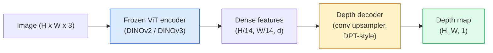

# Monocular Depth & Geometry Estimation

> A depth (深度) map is a single-channel image (图像) where each pixel (像素) is a distance from the camera. Predicting it from one RGB frame used to be impossible without stereo or LiDAR. In 2026 a frozen ViT (视觉 Transformer) encoder (编码器) plus a lightweight head gets within a few percent of ground truth.

**类型:** 构建 + Use
**语言:** Python
**先修知识:** 阶段 4 课程 14 (ViT (视觉 Transformer)), 阶段 4 课程 17 (Self-Supervised Vision), 阶段 4 课程 07 (U-Net (U 形网络))
**时间:** ~60 minutes

## 学习目标

- Distinguish relative and metric depth (深度) and state which one each production model (MiDaS, Marigold, Depth Anything V3, ZoeDepth) solves
- Use Depth Anything V3 (DINOv2 backbone (骨干网络)) to predict depth (深度) for arbitrary single images with no calibration
- Explain why monocular depth (深度) works at all from a single image (图像) (perspective cues, texture gradients, learned priors) and what it cannot recover (absolute scale, occluded geometry)
- Lift 2D detections to 3D points using a depth (深度) map and pinhole camera intrinsics

## The Problem

Depth is the missing axis in 2D computer vision (计算机视觉). Given RGB, you know where things appear in the image (图像) plane; you do not know how far they are. Depth sensors (stereo rigs, LiDAR, time-of-flight) solve this directly but are expensive, fragile, and limited in range.

Monocular depth (深度) estimation — predicting depth from a single RGB frame — used to produce blurry, unreliable output. By 2026 large pretrained encoders changed that: Depth Anything V3 uses a frozen DINOv2 backbone (骨干网络) and produces depth maps that generalise across indoor, outdoor, medical, and satellite domains. Marigold reframes depth as a conditional diffusion (扩散模型) problem. ZoeDepth regresses true metric distances.

Depth is also the bridge between 2D detection and 3D understanding: multiply a detected box's pixels by depth (深度) and you lift the 2D object into a 3D point cloud (点云). That is the core of every AR occlusion system, every obstacle-avoidance pipeline, and every "pick up the cup" robot.

## The Concept

### Relative vs metric depth (深度)

- **Relative depth (深度)** — ordered `z` values without a real-world unit. "Pixel A is closer than pixel (像素) B, but the ratio of distances is not anchored to metres."
- **Metric depth (深度)** — absolute distance in metres from the camera. Requires the model to have learnt the statistical relationship between image (图像) cues and real distance.

MiDaS and Depth Anything V3 produce relative depth (深度). Marigold produces relative depth. ZoeDepth, UniDepth, and Metric3D produce metric depth. Metric models are sensitive to camera intrinsics; relative models are not.

### The encoder-decoder pattern



Depth Anything V3 freezes the encoder (编码器) and trains only the DPT-style decoder (解码器). The encoder provides rich features; the decoder interpolates them back to image (图像) resolution and regresses depth (深度).

### Why a single image (图像) produces depth (深度) at all

A 2D image (图像) contains many monocular cues that correlate with depth (深度):

- **Perspective** — parallel lines in 3D converge in 2D.
- **Texture gradient** — surfaces far away have smaller, denser texture.
- **Occlusion order** — nearer objects occlude farther ones.
- **Size constancy** — known objects (cars, humans) give approximate scale.
- **Atmospheric perspective** — distant objects appear hazier and bluer in outdoor scenes.

A ViT (视觉 Transformer) trained on billions of images internalises these cues. With enough data and a strong backbone (骨干网络), monocular depth (深度) hits reasonable accuracy without any explicit 3D supervision.

### What monocular depth (深度) cannot do

- **Absolute metric scale** without intrinsics or a known object in the scene. The network can predict "the cup is twice as far as the spoon" without knowing whether the cup is 1 m or 10 m away.
- **Occluded geometry** — the back of a chair is unseen and cannot be inferred reliably.
- **Truly untextured / reflective surfaces** — mirrors, glass, uniform walls. The network reports plausible but wrong depth (深度).

### Depth Anything V3 in 2026

- Vanilla DINOv2 ViT-L/14 as encoder (编码器) (frozen).
- DPT decoder (解码器).
- Trained on posed image (图像) pairs from diverse sources (no explicit depth (深度) supervision needed beyond photometric consistency).
- Predicts spatially consistent geometry from **an arbitrary number of visual inputs, with or without known camera poses**.
- SOTA across monocular depth (深度), any-view geometry, visual rendering, camera pose (姿态) estimation.

This is the drop-in model to call when you need depth (深度) in 2026.

### Marigold — diffusion (扩散模型) for depth (深度)

Marigold (Ke et al., CVPR 2024) reframes depth (深度) estimation as conditional image-to-image diffusion (扩散模型). Conditioning: RGB. Target: depth map. Uses a pretrained Stable Diffusion (稳定扩散) 2 U-Net (U 形网络) as backbone (骨干网络). Output depth maps are exceptionally sharp at object boundaries. Trade-off: slower inference (推理) than feed-forward models (10-50 denoising (去噪) steps).

### Intrinsics and the pinhole camera

To lift a pixel (像素) `(u, v)` with depth (深度) `d` to a 3D point `(X, Y, Z)` in camera coordinates:

```
fx, fy, cx, cy = camera intrinsics
X = (u - cx) * d / fx
Y = (v - cy) * d / fy
Z = d
```

Intrinsics come from EXIF metadata, a calibration pattern, or a monocular intrinsics estimator (Perspective Fields, UniDepth). Without intrinsics, you can still render a point cloud (点云) by assuming a 60-70° FOV and moderate-resolution principals — usable for visualisation, not for measurement.

### Evaluation

Two standard metrics:

- **AbsRel** (absolute relative error): `mean(|d_pred - d_gt| / d_gt)`. Lower is better. 0.05-0.1 for production models.
- **delta < 1.25** (threshold accuracy): fraction of pixels where `max(d_pred/d_gt, d_gt/d_pred) < 1.25`. Higher is better. 0.9+ for SOTA.

For relative depth (深度) (Depth Anything V3, MiDaS), evaluation uses scale-and-shift invariant versions of both metrics.

## 构建 It

### Step 1: Depth metrics

```python
import torch

def abs_rel_error(pred, target, mask=None):
    if mask is not None:
        pred = pred[mask]
        target = target[mask]
    return (torch.abs(pred - target) / target.clamp(min=1e-6)).mean().item()


def delta_accuracy(pred, target, threshold=1.25, mask=None):
    if mask is not None:
        pred = pred[mask]
        target = target[mask]
    ratio = torch.maximum(pred / target.clamp(min=1e-6), target / pred.clamp(min=1e-6))
    return (ratio < threshold).float().mean().item()
```

Always mask (掩码) invalid depth (深度) pixels (zero, NaN, saturated) before evaluation.

### Step 2: Scale-and-shift alignment

For relative-depth models, align prediction to ground truth before computing metrics. Least-squares fit of `a * pred + b = target`:

```python
def align_scale_shift(pred, target, mask=None):
    if mask is not None:
        p = pred[mask]
        t = target[mask]
    else:
        p = pred.flatten()
        t = target.flatten()
    A = torch.stack([p, torch.ones_like(p)], dim=1)
    coeffs, *_ = torch.linalg.lstsq(A, t.unsqueeze(-1))
    a, b = coeffs[:2, 0]
    return a * pred + b
```

运行 `align_scale_shift` before `abs_rel_error` when evaluating MiDaS / Depth Anything.

### Step 3: Lift depth (深度) to a point cloud (点云)

```python
import numpy as np

def depth_to_point_cloud(depth, intrinsics):
    H, W = depth.shape
    fx, fy, cx, cy = intrinsics
    v, u = np.meshgrid(np.arange(H), np.arange(W), indexing="ij")
    z = depth
    x = (u - cx) * z / fx
    y = (v - cy) * z / fy
    return np.stack([x, y, z], axis=-1)


depth = np.random.uniform(0.5, 4.0, (240, 320))
intr = (320.0, 320.0, 160.0, 120.0)
pc = depth_to_point_cloud(depth, intr)
print(f"point cloud shape: {pc.shape}  (H, W, 3)")
```

One function, every 3D-lifted application. Export the point cloud (点云) to `.ply` and open in MeshLab or CloudCompare.

### Step 4: Smoke test with a synthetic depth (深度) scene

```python
def synthetic_depth(size=96):
    yy, xx = np.meshgrid(np.arange(size), np.arange(size), indexing="ij")
    # Floor: linear gradient from near (top) to far (bottom)
    depth = 1.0 + (yy / size) * 4.0
    # Box in the middle: closer
    mask = (np.abs(xx - size / 2) < size / 6) & (np.abs(yy - size * 0.6) < size / 6)
    depth[mask] = 2.0
    return depth.astype(np.float32)


gt = torch.from_numpy(synthetic_depth(96))
pred = gt + 0.3 * torch.randn_like(gt)  # simulated prediction
aligned = align_scale_shift(pred, gt)
print(f"before align  absRel = {abs_rel_error(pred, gt):.3f}")
print(f"after align   absRel = {abs_rel_error(aligned, gt):.3f}")
```

### Step 5: Depth Anything V3 usage (reference)

```python
import torch
from transformers import pipeline
from PIL import Image

pipe = pipeline(task="depth-estimation", model="LiheYoung/depth-anything-v2-large")

image = Image.open("street.jpg").convert("RGB")
out = pipe(image)
depth_np = np.array(out["depth"])
```

Three lines. `out["depth (深度)"]` is a PIL grayscale; convert to numpy for math. For Depth Anything V3 specifically, swap the model id once released; the API is unchanged.

## 使用它

- **Depth Anything V3** (Meta AI / ByteDance, 2024-2026) — the default for relative depth (深度). Fastest ViT-large-backbone model in production.
- **Marigold** (ETH, 2024) — highest visual quality, slow inference (推理).
- **UniDepth** (ETH, 2024) — metric depth (深度) with camera intrinsics estimation.
- **ZoeDepth** (Intel, 2023) — metric depth (深度); older, still reliable.
- **MiDaS v3.1** — legacy but stable; good baseline for comparison.

Typical integration pattern:

1. RGB frame arrives.
2. Depth model produces depth (深度) map.
3. Detector produces boxes.
4. Lift box centroids through depth (深度) to 3D; merge with point cloud (点云) if available.
5. Downstream: AR occlusion, path planning, object-size estimation, stereo replacement.

For real-time use, Depth Anything V2 Small (INT8 quantised) hits ~30 fps on a consumer GPU at 518x518.

## Ship It

本课 produces:

- `outputs/prompt-depth-model-picker.md` — picks between Depth Anything V3, Marigold, UniDepth, MiDaS given latency, metric-vs-relative need, and scene type.
- `outputs/skill-depth-to-pointcloud.md` — a skill that 构建 point clouds from depth (深度) maps with correct intrinsics handling and export to `.ply`.

## 练习

1. **(Easy)** 运行 Depth Anything V2 on any 10 images of your desk. Save depth (深度) as grayscale PNGs and inspect. Identify one object whose predicted depth looks wrong and explain why the monocular cues failed.
2. **(Medium)** Given RGB + depth (深度) from Depth Anything V2, lift to a point cloud (点云) and render with `open3d`. Compare two scenes (indoor / outdoor) and note which looks more believable.
3. **(Hard)** Take five pairs of images that differ only by a known object's position (e.g. bottle moved 30 cm closer). Use UniDepth to predict metric depth (深度) on both. Report the predicted distance delta vs the true 30 cm.

## Key Terms

| Term | What people say | What it actually means |
|------|----------------|----------------------|
| Monocular depth (深度) | "Single-image depth" | Depth estimation from one RGB frame, no stereo or LiDAR |
| Relative depth (深度) | "Ordered depth" | Ordered z-values without real-world units |
| Metric depth (深度) | "Absolute distance" | Depth in metres; requires calibration or a model trained with metric supervision |
| AbsRel | "Absolute relative error" | Mean of |d_pred - d_gt| / d_gt; standard depth (深度) metric |
| Delta accuracy | "delta < 1.25" | Fraction of pixels with prediction within 25% of ground truth |
| Pinhole camera | "fx, fy, cx, cy" | The camera model used to lift (u, v, d) to (X, Y, Z) |
| DPT | "Dense Prediction Transformer" | The conv-based decoder (解码器) used on top of frozen ViT (视觉 Transformer) encoders for depth (深度) |
| DINOv2 backbone (骨干网络) | "The reason it works" | Self-supervised features that generalise across domains without depth (深度) labels |

## Further Reading

- [Depth Anything V3 paper page](https://depth-anything.github.io/) — SOTA monocular depth (深度) with DINOv2 encoder (编码器)
- [Marigold (Ke et al., CVPR 2024)](https://marigoldmonodepth.github.io/) — diffusion-based depth (深度) estimation
- [UniDepth (Piccinelli et al., 2024)](https://arxiv.org/abs/2403.18913) — metric depth (深度) with intrinsics
- [MiDaS v3.1 (Intel ISL)](https://github.com/isl-org/MiDaS) — the canonical relative-depth baseline
- [DINOv3 blog post (Meta)](https://ai.meta.com/blog/dinov3-self-supervised-vision-model/) — the encoder (编码器) family that lifts depth (深度) accuracy
