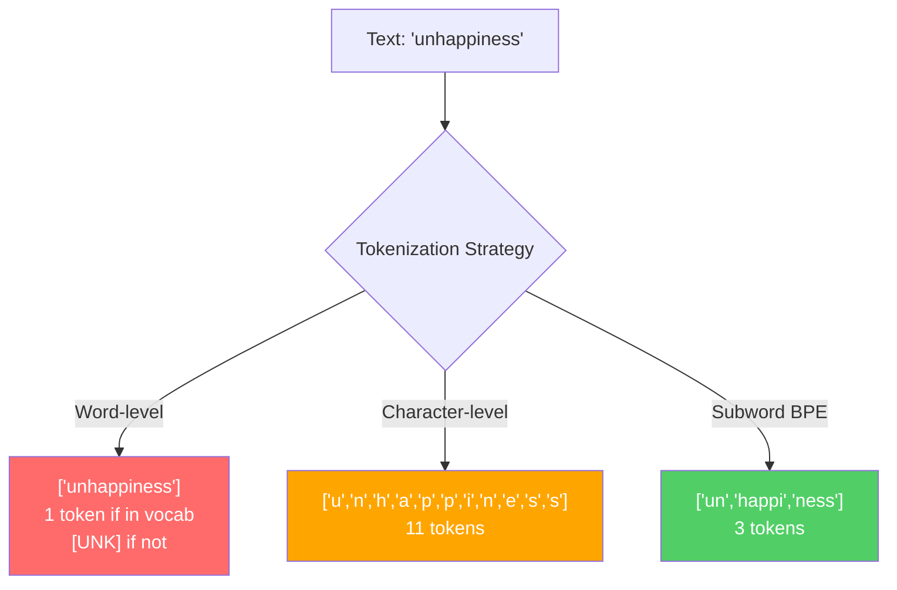
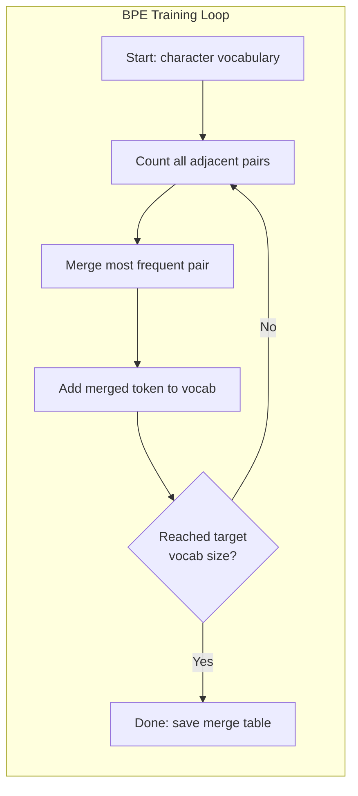
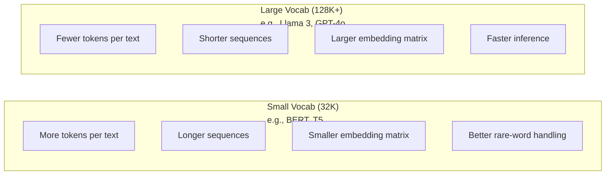

# Tokenizers：BPE、WordPiece、SentencePiece

> 你的 LLM（大语言模型）不读英文，它读整数。tokenizer（分词器）决定了这些整数是有意义的还是被浪费的。

**Type:** Build
**Languages:** Python
**Prerequisites:** Phase 05 (NLP Foundations)
**Time:** ~90 minutes

## Learning Objectives

- 从零实现 BPE、WordPiece 和 Unigram 分词算法，并比较它们的合并策略
- 解释 vocabulary（词表）大小如何影响模型效率：太小会导致序列过长，太大会浪费 embedding（嵌入）参数
- 分析不同语言和代码中的分词产物，识别特定 tokenizer 失效的地方
- 使用 tiktoken 和 sentencepiece 库对文本进行分词并检查生成的 token ID

## The Problem

你的 LLM 不读英文。它不读任何语言。它读数字。

"Hello, world!" 和 [15496, 11, 995, 0] 之间的差距就是 tokenizer。每个单词、每个空格、每个标点符号都必须先转换成整数，模型才能处理。这种转换并非中立——它将假设固化进模型，且之后无法撤销。

如果搞错了，你的模型就会把常见词浪费成多个 token。"unfortunately" 变成四个 token 而不是一个。对于多音节词汇密集的文本，你的 128K 上下文窗口直接缩水 75%。如果搞对了，同样的上下文窗口能容纳两倍的信息量。"这个模型代码处理得很好"和"这个模型写 Python 就卡死"之间的差别，往往就在于 tokenizer 的训练方式。

你每次调用 GPT-4 或 Claude API 都是按 token 计费。模型生成的每个 token 都消耗算力。表示输出所需的 token 越少，端到端 inference（推理）就越快。分词不是预处理，它是架构的一部分。

## The Concept

### 三种失败的方法（和一种成功的方法）

把文本转成数字有三种显而易见的办法，其中两种在大规模上行不通。

**Word-level tokenization（词级分词）** 按空格和标点切分。"The cat sat" 变成 ["The", "cat", "sat"]。简单。但 "tokenization" 呢？"GPT-4o" 呢？德语复合词 "Geschwindigkeitsbegrenzung" 呢？词级分词需要一个巨大的 vocabulary 才能覆盖每种语言的每个词。漏掉一个词，你就会得到 dreaded `[UNK]` token——模型在说"我不知道这是什么"。仅英语就有超过一百万种词形。加上代码、URL、科学记数法和 100 多种其他语言，你需要一个无限大的 vocabulary。

**Character-level tokenization（字符级分词）** 走向另一个极端。"hello" 变成 ["h", "e", "l", "l", "o"]。Vocabulary 极小（几百个字符）。永远不会出现未知 token。但序列变得极长。一句 10 个词级 token 的话会变成 50 个字符级 token。模型必须学会 "t"、"h"、"e" 合在一起是 "the"——把 attention（注意力）容量浪费在人类三岁就学会的东西上。

**Subword tokenization（子词分词）** 找到了最佳平衡点。常见词保持完整："the" 是一个 token。罕见词分解成有意义的片段："unhappiness" 变成 ["un", "happi", "ness"]。Vocabulary 保持可控（30K 到 128K token）。序列保持较短。未知 token 基本消失，因为任何词都可以由子词片段拼成。

每个现代 LLM 都使用 subword tokenization。GPT-2、GPT-4、BERT、Llama 3、Claude——无一例外。问题在于用哪种算法。



### BPE：Byte Pair Encoding（字节对编码）

BPE 是一种被重新用于分词的贪心压缩算法。核心思想简单到可以写在一张索引卡上。

从单个字符开始。统计训练语料中每一对相邻 token 的出现频率。将最频繁的一对合并成新 token。重复此过程直到达到目标 vocabulary 大小。

```figure
tokenizer-bpe
```

以下是 BPE 在一个包含 "lower"、"lowest" 和 "newest" 的微型语料库上的运行过程：

```
Corpus (with word frequencies):
  "lower"  x5
  "lowest" x2
  "newest" x6

Step 0 -- Start with characters:
  l o w e r       (x5)
  l o w e s t     (x2)
  n e w e s t     (x6)

Step 1 -- Count adjacent pairs:
  (e,s): 8    (s,t): 8    (l,o): 7    (o,w): 7
  (w,e): 13   (e,r): 5    (n,e): 6    ...

Step 2 -- Merge most frequent pair (w,e) -> "we":
  l o we r        (x5)
  l o we s t      (x2)
  n e we s t      (x6)

Step 3 -- Recount and merge (e,s) -> "es":
  l o we r        (x5)
  l o we s t      (x2)    <- 'es' only forms from 'e'+'s', not 'we'+'s'
  n e we s t      (x6)    <- wait, the 'e' before 'we' and 's' after 'we'

Actually tracking this precisely:
  After "we" merge, remaining pairs:
  (l,o): 7   (o,we): 7   (we,r): 5   (we,s): 8
  (s,t): 8   (n,e): 6    (e,we): 6

Step 3 -- Merge (we,s) -> "wes" or (s,t) -> "st" (tied at 8, pick first):
  Merge (we,s) -> "wes":
  l o we r        (x5)
  l o wes t       (x2)
  n e wes t       (x6)

Step 4 -- Merge (wes,t) -> "west":
  l o we r        (x5)
  l o west        (x2)
  n e west        (x6)

...continue until target vocab size reached.
```

合并表就是 tokenizer。要对新文本编码，就按学习顺序应用合并。训练语料决定了哪些合并存在，而这个选择永久塑造了模型"看到"的内容。



### Byte-Level BPE（GPT-2、GPT-3、GPT-4）

标准 BPE 操作于 Unicode 字符。Byte-level BPE 操作于原始字节（0-255）。这给了你恰好 256 个基础 vocabulary，能处理任何语言或编码，且永远不会产生未知 token。

GPT-2 引入了这种方法。基础 vocabulary 覆盖每个可能的字节。BPE 合并在此基础上构建。OpenAI 的 tiktoken 库实现了 byte-level BPE，vocabulary 大小如下：

- GPT-2：50,257 tokens
- GPT-3.5/GPT-4：~100,256 tokens（cl100k_base 编码）
- GPT-4o：200,019 tokens（o200k_base 编码）

### WordPiece（BERT）

WordPiece 看起来与 BPE 类似，但选择合并的方式不同。它不是用原始频率，而是最大化训练数据的似然：

```
BPE merge criterion:      count(A, B)
WordPiece merge criterion: count(AB) / (count(A) * count(B))
```

BPE 问："哪对出现得最频繁？" WordPiece 问："哪对一起出现的频率高于随机预期？" 这个细微差别产生了不同的 vocabulary。WordPiece 偏爱那些共现令人惊讶（不仅仅是频繁）的合并。

WordPiece 还使用 "##" 前缀表示延续子词：

```
"unhappiness" -> ["un", "##happi", "##ness"]
"embedding"   -> ["em", "##bed", "##ding"]
```

"##" 前缀告诉你这个片段延续前一个 token。BERT 使用 WordPiece，vocabulary 为 30,522 tokens。每个 BERT 变体——DistilBERT、RoBERTa 的 tokenizer 实际上是 BPE，但 BERT 本身是 WordPiece。

### SentencePiece（Llama、T5）

SentencePiece 将输入视为原始 Unicode 字符流，包括空白字符。没有预分词步骤。没有关于词边界的语言特定规则。这使它真正具备语言无关性——适用于中文、日文、泰文以及其他不用空格分词的语言。

SentencePiece 支持两种算法：
- **BPE mode**：与标准 BPE 相同的合并逻辑，应用于原始字符序列
- **Unigram mode**：从一个大的 vocabulary 开始，迭代移除对整体似然影响最小的 token。与 BPE 相反——是剪枝而不是合并。

Llama 2 使用 SentencePiece BPE，vocabulary 为 32,000 tokens。T5 使用 SentencePiece Unigram，32,000 tokens。注意：Llama 3  switched 到基于 tiktoken 的 byte-level BPE tokenizer，vocabulary 为 128,256 tokens。

### Vocabulary Size Tradeoffs（词表大小的权衡）

这是一个有实际可衡量后果的真实工程决策。



具体数字。对于 128K vocabulary 和 4,096 维 embedding，仅 embedding matrix 就有 128,000 x 4,096 = 5.24 亿参数。对于 32K vocabulary，是 1.31 亿参数。仅 tokenizer 选择就带来了 4 亿参数的差异。

但更大的 vocabulary 更激进地压缩文本。同一段英文用 32K vocabulary 需要 100 tokens，用 128K vocabulary 可能只需要 70 tokens。这意味着生成时减少了 30% 的 forward pass。对于服务数百万请求的模型，这是直接的算力成本降低。

趋势很明显：vocabulary 大小在增长。GPT-2 用 50,257。GPT-4 用 ~100K。Llama 3 用 128K。GPT-4o 用 200K。

| Model | Vocab Size | Tokenizer Type | Avg Tokens per English Word |
|-------|-----------|----------------|---------------------------|
| BERT | 30,522 | WordPiece | ~1.4 |
| GPT-2 | 50,257 | Byte-level BPE | ~1.3 |
| Llama 2 | 32,000 | SentencePiece BPE | ~1.4 |
| GPT-4 | ~100,256 | Byte-level BPE | ~1.2 |
| Llama 3 | 128,256 | Byte-level BPE (tiktoken) | ~1.1 |
| GPT-4o | 200,019 | Byte-level BPE | ~1.0 |

### The Multilingual Tax（多语言税）

主要用英语训练的 tokenizer 对其他语言很残酷。GPT-2 的 tokenizer 处理韩文平均每个词 2-3 tokens。中文可能更糟。这意味着韩国用户的有效上下文窗口只有英语用户的一半——付同样的价格，却得到更低的信息密度。

这就是为什么 Llama 3 把 vocabulary 从 32K 增加到 128K。 dedicating 更多 token 给非英语文字意味着跨语言的更公平压缩。

## Build It

### Step 1: Character-Level Tokenizer（字符级分词器）

从基础开始。字符级 tokenizer 将每个字符映射到其 Unicode 码点。无需训练。没有未知 token。只是一个直接映射。

```python
class CharTokenizer:
    def encode(self, text):
        return [ord(c) for c in text]

    def decode(self, tokens):
        return "".join(chr(t) for t in tokens)
```

"hello" 变成 [104, 101, 108, 108, 111]。每个字符就是一个 token。这是我们改进的基线。

### Step 2: BPE Tokenizer from Scratch（从零实现 BPE 分词器）

真正的实现。我们在原始字节上训练（像 GPT-2），统计配对，合并最频繁的，并按顺序记录每次合并。合并表就是 tokenizer。

```python
from collections import Counter

class BPETokenizer:
    def __init__(self):
        self.merges = {}
        self.vocab = {}

    def _get_pairs(self, tokens):
        pairs = Counter()
        for i in range(len(tokens) - 1):
            pairs[(tokens[i], tokens[i + 1])] += 1
        return pairs

    def _merge_pair(self, tokens, pair, new_token):
        merged = []
        i = 0
        while i < len(tokens):
            if i < len(tokens) - 1 and tokens[i] == pair[0] and tokens[i + 1] == pair[1]:
                merged.append(new_token)
                i += 2
            else:
                merged.append(tokens[i])
                i += 1
        return merged

    def train(self, text, num_merges):
        tokens = list(text.encode("utf-8"))
        self.vocab = {i: bytes([i]) for i in range(256)}

        for i in range(num_merges):
            pairs = self._get_pairs(tokens)
            if not pairs:
                break
            best_pair = max(pairs, key=pairs.get)
            new_token = 256 + i
            tokens = self._merge_pair(tokens, best_pair, new_token)
            self.merges[best_pair] = new_token
            self.vocab[new_token] = self.vocab[best_pair[0]] + self.vocab[best_pair[1]]

        return self

    def encode(self, text):
        tokens = list(text.encode("utf-8"))
        for pair, new_token in self.merges.items():
            tokens = self._merge_pair(tokens, pair, new_token)
        return tokens

    def decode(self, tokens):
        byte_sequence = b"".join(self.vocab[t] for t in tokens)
        return byte_sequence.decode("utf-8", errors="replace")
```

训练循环是 BPE 的核心：统计配对，合并赢家，重复。每次合并都会减少总 token 数。经过 `num_merges` 轮后，vocabulary 从 256（基础字节）增长到 256 + num_merges。

编码必须按学习顺序应用合并。这很重要。如果合并 1 创建了 "th"，合并 5 创建了 "the"，编码必须先应用合并 1，这样 "the" 才能在合并 5 中由 "th" + "e" 形成。

解码是逆过程：在 vocabulary 中查找每个 token ID，拼接字节，解码为 UTF-8。

### Step 3: Encode and Decode Roundtrip（编码解码往返测试）

```python
corpus = (
    "The cat sat on the mat. The cat ate the rat. "
    "The dog sat on the log. The dog ate the frog. "
    "Natural language processing is the study of how computers "
    "understand and generate human language. "
    "Tokenization is the first step in any NLP pipeline."
)

tokenizer = BPETokenizer()
tokenizer.train(corpus, num_merges=40)

test_sentences = [
    "The cat sat on the mat.",
    "Natural language processing",
    "tokenization pipeline",
    "unhappiness",
]

for sentence in test_sentences:
    encoded = tokenizer.encode(sentence)
    decoded = tokenizer.decode(encoded)
    raw_bytes = len(sentence.encode("utf-8"))
    ratio = len(encoded) / raw_bytes
    print(f"'{sentence}'")
    print(f"  Tokens: {len(encoded)} (from {raw_bytes} bytes) -- ratio: {ratio:.2f}")
    print(f"  Roundtrip: {'PASS' if decoded == sentence else 'FAIL'}")
```

Compression ratio（压缩比）告诉你 tokenizer 的效率。0.50 的比率意味着 tokenizer 把文本压缩到原始字节数一半的 token。越低越好。在训练语料上，比率会很好。对于分布外文本如 "unhappiness"（未出现在语料中），比率会更差——tokenizer 退化为字符级编码来处理未见过的模式。

### Step 4: Compare with tiktoken（与 tiktoken 对比）

```python
import tiktoken

enc = tiktoken.get_encoding("cl100k_base")

texts = [
    "The cat sat on the mat.",
    "unhappiness",
    "Hello, world!",
    "def fibonacci(n): return n if n < 2 else fibonacci(n-1) + fibonacci(n-2)",
    "Geschwindigkeitsbegrenzung",
]

for text in texts:
    our_tokens = tokenizer.encode(text)
    tiktoken_tokens = enc.encode(text)
    tiktoken_pieces = [enc.decode([t]) for t in tiktoken_tokens]
    print(f"'{text}'")
    print(f"  Our BPE:   {len(our_tokens)} tokens")
    print(f"  tiktoken:  {len(tiktoken_tokens)} tokens -> {tiktoken_pieces}")
```

tiktoken 使用完全相同的算法，但在数百 GB 的文本上训练了 100,000 次合并。算法是相同的。差异在于训练数据和合并次数。你的 tokenizer 在一个段落上训练了 40 次合并，无法与 tiktoken 在大量语料上的 100K 次合并竞争。但机制是一样的。

### Step 5: Vocabulary Analysis（词表分析）

```python
def analyze_vocabulary(tokenizer, test_texts):
    total_tokens = 0
    total_chars = 0
    token_usage = Counter()

    for text in test_texts:
        encoded = tokenizer.encode(text)
        total_tokens += len(encoded)
        total_chars += len(text)
        for t in encoded:
            token_usage[t] += 1

    print(f"Vocabulary size: {len(tokenizer.vocab)}")
    print(f"Total tokens across all texts: {total_tokens}")
    print(f"Total characters: {total_chars}")
    print(f"Avg tokens per character: {total_tokens / total_chars:.2f}")

    print(f"\nMost used tokens:")
    for token_id, count in token_usage.most_common(10):
        token_bytes = tokenizer.vocab[token_id]
        display = token_bytes.decode("utf-8", errors="replace")
        print(f"  Token {token_id:4d}: '{display}' (used {count} times)")

    unused = [t for t in tokenizer.vocab if t not in token_usage]
    print(f"\nUnused tokens: {len(unused)} out of {len(tokenizer.vocab)}")
```

这揭示了 vocabulary 中的 Zipf 分布。少数 token 占主导（空格、"the"、"e"）。大多数 token 很少使用。生产 tokenizer 会针对这种分布进行优化——常见模式获得短 token ID，罕见模式获得更长的表示。

## Use It

你的 scratch BPE 可以工作了。现在看看生产工具是什么样的。

### tiktoken (OpenAI)

```python
import tiktoken

enc = tiktoken.get_encoding("cl100k_base")

text = "Tokenizers convert text to integers"
tokens = enc.encode(text)
print(f"Tokens: {tokens}")
print(f"Pieces: {[enc.decode([t]) for t in tokens]}")
print(f"Roundtrip: {enc.decode(tokens)}")
```

tiktoken 用 Rust 编写，带有 Python 绑定。每秒编码数百万 token。同样的 BPE 算法，工业级实现。

### Hugging Face tokenizers

```python
from tokenizers import Tokenizer
from tokenizers.models import BPE
from tokenizers.trainers import BpeTrainer
from tokenizers.pre_tokenizers import ByteLevel

tokenizer = Tokenizer(BPE())
tokenizer.pre_tokenizer = ByteLevel()

trainer = BpeTrainer(vocab_size=1000, special_tokens=["<pad>", "<eos>", "<unk>"])
tokenizer.train(["corpus.txt"], trainer)

output = tokenizer.encode("The cat sat on the mat.")
print(f"Tokens: {output.tokens}")
print(f"IDs: {output.ids}")
```

Hugging Face tokenizers 库底层也是 Rust。它在几秒钟内就能在 GB 级语料上训练 BPE。训练自己的模型时就用这个。

### Loading Llama's Tokenizer（加载 Llama 的 Tokenizer）

```python
from transformers import AutoTokenizer

tokenizer = AutoTokenizer.from_pretrained("meta-llama/Llama-3.1-8B")

text = "Tokenizers are the unsung heroes of LLMs"
tokens = tokenizer.encode(text)
print(f"Token IDs: {tokens}")
print(f"Tokens: {tokenizer.convert_ids_to_tokens(tokens)}")
print(f"Vocab size: {tokenizer.vocab_size}")

multilingual = ["Hello world", "Hola mundo", "Bonjour le monde"]
for text in multilingual:
    ids = tokenizer.encode(text)
    print(f"'{text}' -> {len(ids)} tokens")
```

Llama 3 的 128K vocabulary 对非英语文本的压缩显著优于 GPT-2 的 50K vocabulary。你可以自己验证——用多种语言编码同一句子并统计 token 数。

## Ship It

本课程产出 `outputs/prompt-tokenizer-analyzer.md`——一个可复用的 prompt，用于分析任何文本和模型组合的 tokenization 效率。输入一段文本样本，它会告诉你哪个模型的 tokenizer 处理得最好。

## Exercises

1. 修改 BPE tokenizer 以在每次合并步骤后打印 vocabulary。观察 "t" + "h" 如何变成 "th"，然后 "th" + "e" 如何变成 "the"。追踪常见英语词是如何一步步组装起来的。

2. 向 BPE tokenizer 添加 special tokens（`<pad>`、`<eos>`、`<unk>`）。给它们分配 ID 0、1、2，并相应偏移所有其他 token。实现一个在运行 BPE 之前按空白切分的预分词步骤。

3. 实现 WordPiece 合并准则（似然比而非频率）。在相同语料上用相同合并次数训练 BPE 和 WordPiece。比较生成的 vocabulary——哪种产生了更多语言学上有意义的子词？

4. 构建一个多语言 tokenizer 效率基准。取 10 句英文、西班牙文、中文、韩文和阿拉伯文。用 tiktoken（cl100k_base）对每句分词，测量平均每个字符的 token 数。量化每种语言的"多语言税"。

5. 在一个更大的语料上训练你的 BPE tokenizer（下载一篇 Wikipedia 文章）。调整合并次数，使压缩比达到 tiktoken 在同一文本上的 10% 以内。这迫使你理解语料大小、合并次数和压缩质量之间的关系。

## Key Terms

| Term | What people say | What it actually means |
|------|----------------|----------------------|
| Token | "A word" | A unit in the model's vocabulary -- could be a character, subword, word, or multi-word chunk |
| BPE | "Some compression thing" | Byte Pair Encoding（字节对编码）-- iteratively merge the most frequent adjacent pair of tokens until the target vocabulary size is reached |
| WordPiece | "BERT's tokenizer" | Like BPE but merges maximize the likelihood ratio count(AB)/(count(A)*count(B)) instead of raw frequency |
| SentencePiece | "A tokenizer library" | A language-agnostic tokenizer that operates on raw Unicode without pre-tokenization, supporting BPE and Unigram algorithms |
| Vocabulary size | "How many words it knows" | The total number of unique tokens: GPT-2 has 50,257, BERT has 30,522, Llama 3 has 128,256 |
| Fertility | "Not a tokenizer term" | Average number of tokens per word -- measures tokenizer efficiency across languages (1.0 is perfect, 3.0 means the model works three times harder) |
| Byte-level BPE | "GPT's tokenizer" | BPE operating on raw bytes (0-255) instead of Unicode characters, guaranteeing no unknown tokens for any input |
| Merge table | "The tokenizer file" | Ordered list of pair merges learned during training -- this IS the tokenizer, and order matters |
| Pre-tokenization | "Splitting on spaces" | Rules applied before subword tokenization: whitespace splitting, digit separation, punctuation handling |
| Compression ratio | "How efficient the tokenizer is" | Tokens produced divided by input bytes -- lower means better compression and faster inference |

## Further Reading

- [Sennrich et al., 2016 -- "Neural Machine Translation of Rare Words with Subword Units"](https://arxiv.org/abs/1508.07909) -- the paper that introduced BPE for NLP, turning a 1994 compression algorithm into the foundation of modern tokenization
- [Kudo & Richardson, 2018 -- "SentencePiece: A simple and language independent subword tokenizer"](https://arxiv.org/abs/1808.06226) -- language-agnostic tokenization that made multilingual models practical
- [OpenAI tiktoken repository](https://github.com/openai/tiktoken) -- production BPE implementation in Rust with Python bindings, used by GPT-3.5/4/4o
- [Hugging Face Tokenizers documentation](https://huggingface.co/docs/tokenizers) -- production-grade tokenizer training with Rust performance
