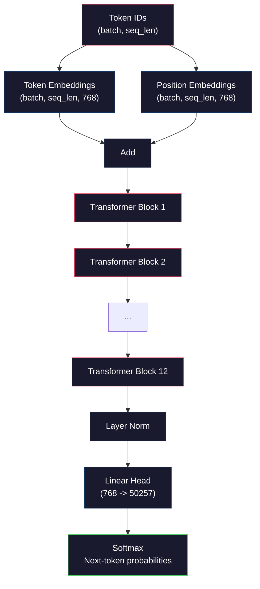
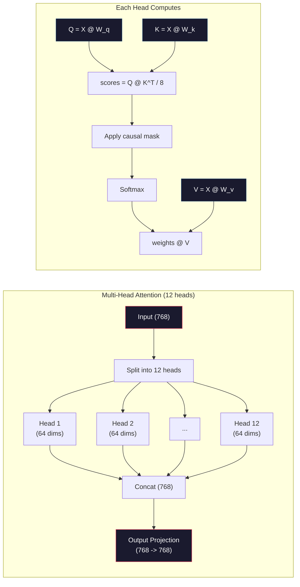
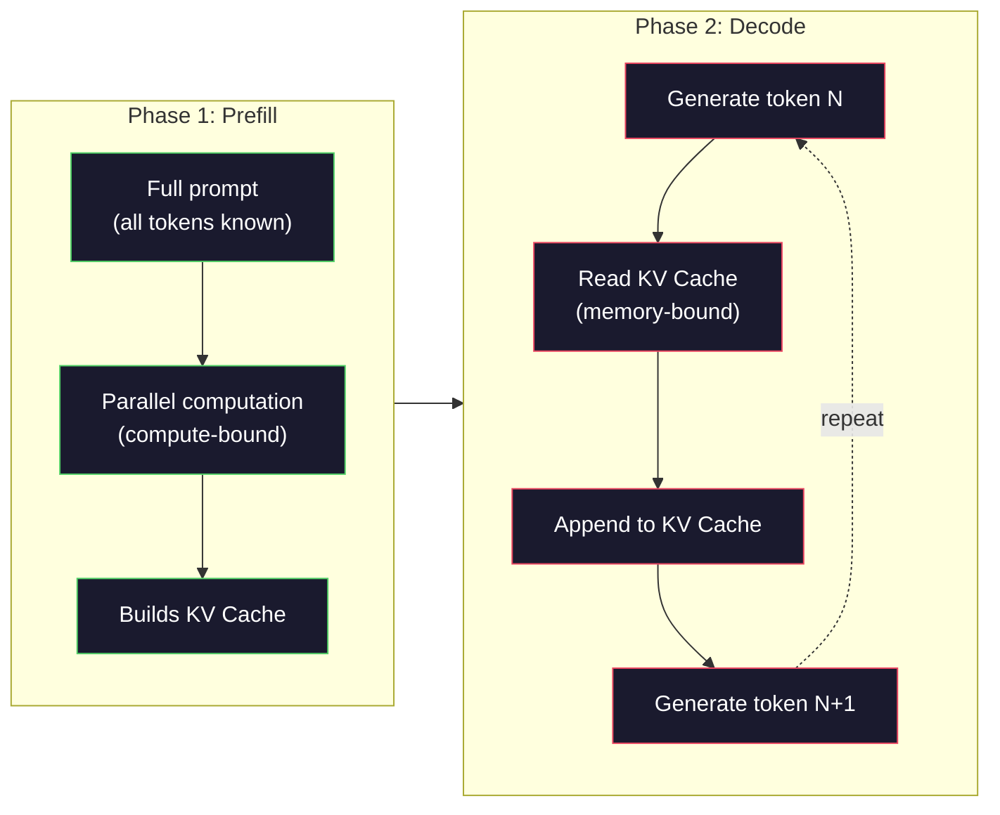

# Pre-Training a Mini GPT（预训练一个迷你 GPT，124M 参数）

> GPT-2 Small 有 1.24 亿参数。那是 12 层 transformer、12 个 attention heads（注意力头）和 768 维 embedding。你可以在单个 GPU 上几小时内从头训练它。大多数人从不这样做。他们使用预训练 checkpoint。但如果你不亲自训练一次，你就不真正理解你正在构建产品所依赖的模型内部发生了什么。

**Type:** Build
**Languages:** Python (with numpy)
**Prerequisites:** Phase 10, Lessons 01-03 (Tokenizers, Building a Tokenizer, Data Pipelines)
**Time:** ~120 minutes

## Learning Objectives

- 从零实现完整的 GPT-2 架构（124M 参数）：token embeddings、positional embeddings、transformer blocks 和 language model head（语言模型头）
- 使用 next-token prediction（下一词预测）和 cross-entropy loss（交叉熵损失）在文本语料上训练 GPT 模型
- 实现带有 temperature sampling（温度采样）和 top-k/top-p filtering 的自回归文本生成
- 监控 training loss curves（训练损失曲线）并验证模型学习到了连贯的语言模式

## The Problem

你知道 transformer 是什么。你读过示意图。你能背诵 "attention is all you need" 并在白板上画标着 "Multi-Head Attention" 的方框。

这些都不意味着你理解模型生成文本时发生了什么。

GPT-2 Small 有 124,438,272 个参数（含 weight tying）。每一个参数都是通过运行训练循环设置的：forward pass（前向传播）、计算 loss、backward pass（反向传播）、更新权重。十二个 transformer blocks。每层十二个 attention heads。一个 768 维的 embedding 空间。一个 50,257 个 token 的 vocabulary。每次模型生成一个 token，全部 1.24 亿参数都参与一个单一的矩阵乘法链，将 token ID 序列转换为下一个 token 的概率分布。

如果你从未亲自构建过这个，你就是在黑盒上工作。你可以用 API。你可以 fine-tuning（微调）。但当出问题——当模型 hallucinates（产生幻觉）、当它重复自己、当它拒绝遵循指令——你没有 mental model 来理解*为什么*。

本课从零构建 GPT-2 Small。不是用 PyTorch。是用 numpy。每个矩阵乘法都可见。每个 gradient 都由你的代码计算。你会看到 1.24 亿个数字如何合谋预测下一个词。

## The Concept

### The GPT Architecture（GPT 架构）

GPT 是一个 autoregressive（自回归）语言模型。"Autoregressive" 意味着它一次生成一个 token，每个 token 以所有之前的 token 为条件。架构是一堆 transformer decoder blocks。

以下是从 token ID 到 next-token probabilities 的完整计算图：

1. Token IDs 输入。Shape: (batch_size, seq_len)。
2. Token embedding lookup。每个 ID 映射到一个 768 维向量。Shape: (batch_size, seq_len, 768)。
3. Position embedding lookup。每个位置 (0, 1, 2, ...) 映射到一个 768 维向量。相同 shape。
4. 相加 token embeddings + position embeddings。
5. 通过 12 个 transformer blocks。
6. 最终 layer normalization（层归一化）。
7. 线性投影到 vocabulary size。Shape: (batch_size, seq_len, vocab_size)。
8. Softmax 得到概率。

这就是整个模型。没有卷积。没有循环。只是 embedding、attention、feedforward networks 和 layer norms 堆叠 12 次。



### The Transformer Block（Transformer 块）

12 个块中的每一个都遵循相同的模式。Pre-norm 架构（GPT-2 使用 pre-norm，不像原始 transformer 使用 post-norm）：

1. LayerNorm
2. Multi-Head Self-Attention（多头自注意力）
3. Residual connection（残差连接，加回输入）
4. LayerNorm
5. Feed-Forward Network（MLP，前馈网络）
6. Residual connection（残差连接，加回输入）

Residual connections 至关重要。没有它们，gradients 在 backpropagation 到达 block 1 之前就 vanish（消失）了。有了它们，gradients 可以通过"捷径"直接从 loss 流向任何一层。这就是为什么你能堆叠 12、32 甚至 96 个块（GPT-4 据传使用 120 个）。

### Attention: The Core Mechanism（注意力：核心机制）

Self-attention（自注意力）让每个 token 查看所有之前的 token 并决定每个 token 的 attention 程度。以下是数学原理。

对于每个 token 位置，从输入计算三个向量：
- **Query (Q)**："我在找什么？"
- **Key (K)**："我包含什么？"
- **Value (V)**："我携带什么信息？"

```
Q = input @ W_q    (768 -> 768)
K = input @ W_k    (768 -> 768)
V = input @ W_v    (768 -> 768)

attention_scores = Q @ K^T / sqrt(d_k)
attention_scores = mask(attention_scores)   # causal mask: -inf for future positions
attention_weights = softmax(attention_scores)
output = attention_weights @ V
```

Causal mask（因果掩码）使 GPT 成为 autoregressive 模型。位置 5 可以 attend to 位置 0-5，但不能 attend to 6、7、8 等。这防止模型在训练时"作弊"偷看未来的 token。

**Multi-head attention（多头注意力）** 将 768 维空间分成 12 个 64 维的 heads。每个 head 学习不同的 attention 模式。一个 head 可能追踪句法关系（主谓一致）。另一个可能追踪语义相似性（同义词）。另一个可能追踪位置邻近性（附近的词）。所有 12 个 head 的输出被拼接并投影回 768 维。



除以 sqrt(d_k) —— sqrt(64) = 8 —— 是 scaling（缩放）。没有它，dot products 对于高维向量会变大，将 softmax 推向 gradients 几乎为零的区域。这是原始 "Attention Is All You Need" 论文的关键洞察之一。

### KV Cache: Why Inference Is Fast（KV 缓存：推理为什么快）

训练时，你一次性处理整个序列。推理时，你一次生成一个 token。没有优化的话，生成 token N 需要重新计算所有 N-1 个之前 token 的 attention。这是每个生成 token O(N^2)，或整个序列 O(N^3)。

KV Cache 解决了这个问题。计算每个 token 的 K 和 V 后，存储它们。生成 token N+1 时，你只需要为新 token 计算 Q，并查找所有之前 token 缓存的 K 和 V。这将每个 token 的 K 和 V 计算成本从 O(N) 降到 O(1)。Attention score 计算仍然是 O(N)，因为你需要 attend to 所有之前的位置，但你避免了对输入的冗余矩阵乘法。

对于 GPT-2（12 层，12 个 heads），KV cache 每个 token 存储 2 (K+V) x 12 层 x 12 heads x 64 维 = 18,432 个值。对于 1024-token 序列，FP32 下约 75MB。对于 Llama 3 405B（128 层），单个序列的 KV cache 可以超过 10GB。这就是长上下文推理受 memory-bound（内存限制）的原因。

### Prefill vs Decode: Two Phases of Inference（Prefill 与 Decode：推理的两个阶段）

当你向 LLM 发送 prompt 时，推理发生在两个不同的阶段。

**Prefill** 并行处理你的整个 prompt。所有 token 都已知，所以模型可以同时计算所有位置的 attention。这个阶段是 compute-bound（计算受限）——GPU 以全吞吐量做矩阵乘法。对于 A100 上 1000-token 的 prompt，prefill 大约需要 20-50ms。

**Decode** 一次生成一个 token。每个新 token 依赖于所有之前的 token。这个阶段是 memory-bound（内存受限）——瓶颈是从 GPU 内存读取模型权重和 KV cache，而不是矩阵运算本身。GPU 的计算核心大部分时间空闲，等待内存读取。对于 GPT-2，每个 decode 步骤花费的时间大致相同，无论矩阵乘法需要多少 FLOPs，因为 memory bandwidth 是限制因素。

这个区别对生产系统很重要。Prefill 吞吐量随 GPU 计算能力扩展（更多 FLOPS = 更快 prefill）。Decode 吞吐量随内存带宽扩展（更快内存 = 更快生成）。这就是为什么 NVIDIA 的 H100 相比 A100 专注于内存带宽改进——它直接加速了 token 生成。



### The Training Loop（训练循环）

训练 LLM 就是 next-token prediction。给定 token [0, 1, 2, ..., N-1]，预测 token [1, 2, 3, ..., N]。Loss function 是模型预测的概率分布与实际下一个 token 之间的 cross-entropy。

一个训练步骤：

1. **Forward pass**：将 batch 通过全部 12 个 block。获取每个位置的 logits（pre-softmax 分数）。
2. **Compute loss**：logits 与 target tokens（输入右移一位）之间的 cross-entropy。
3. **Backward pass**：使用 backpropagation 计算全部 124M 参数的 gradients。
4. **Optimizer step**：更新权重。GPT-2 使用 Adam，带有 learning rate warmup（学习率预热）和 cosine decay（余弦衰减）。

Learning rate schedule 比你想象的更重要。GPT-2 在前 2,000 步从 0 warmup 到峰值学习率，然后按 cosine curve 衰减。以高学习率开始会导致模型发散。保持恒定高学习率会导致后期训练震荡。warmup-then-decay 模式被每个主要 LLM 使用。

### GPT-2 Small: The Numbers（GPT-2 Small：数字）

| Component | Shape | Parameters |
|-----------|-------|------------|
| Token embeddings | (50257, 768) | 38,597,376 |
| Position embeddings | (1024, 768) | 786,432 |
| Per-block attention (W_q, W_k, W_v, W_out) | 4 x (768, 768) | 2,359,296 |
| Per-block FFN (up + down) | (768, 3072) + (3072, 768) | 4,718,592 |
| Per-block LayerNorms (2x) | 2 x 768 x 2 | 3,072 |
| Final LayerNorm | 768 x 2 | 1,536 |
| **Total per block** | | **7,080,960** |
| **Total (12 blocks)** | | **85,054,464 + 39,383,808 = 124,438,272** |

输出投影（logits head）与 token embedding matrix 共享权重。这称为 weight tying（权重绑定）——它减少了 38M 参数并提升性能，因为它强制模型对输入和输出使用相同的表示空间。

## Build It

### Step 1: Embedding Layer（嵌入层）

Token embeddings 将 50,257 个可能的 token 中的每一个映射到一个 768 维向量。Position embeddings 添加关于每个 token 在序列中位置的信息。两者相加。

```python
import numpy as np

class Embedding:
    def __init__(self, vocab_size, embed_dim, max_seq_len):
        self.token_embed = np.random.randn(vocab_size, embed_dim) * 0.02
        self.pos_embed = np.random.randn(max_seq_len, embed_dim) * 0.02

    def forward(self, token_ids):
        seq_len = token_ids.shape[-1]
        tok_emb = self.token_embed[token_ids]
        pos_emb = self.pos_embed[:seq_len]
        return tok_emb + pos_emb
```

初始化的 0.02 标准差来自 GPT-2 论文。太大，初始 forward passes 会产生极端值，使训练不稳定。太小，初始输出对所有输入几乎相同，使早期 gradient signals 无用。

### Step 2: Self-Attention with Causal Mask（带因果掩码的自注意力）

先实现单 head attention。Causal mask 在 softmax 之前将未来位置设为负无穷，确保每个位置只能 attend to 自己和更早的位置。

```python
def attention(Q, K, V, mask=None):
    d_k = Q.shape[-1]
    scores = Q @ K.transpose(0, -1, -2 if Q.ndim == 4 else 1) / np.sqrt(d_k)
    if mask is not None:
        scores = scores + mask
    weights = np.exp(scores - scores.max(axis=-1, keepdims=True))
    weights = weights / weights.sum(axis=-1, keepdims=True)
    return weights @ V
```

Softmax 实现在指数化前减去最大值。没有这一步，exp(large_number) 会溢出为无穷大。这是一个数值稳定性技巧，不改变输出，因为 softmax(x - c) = softmax(x) 对任何常数 c 成立。

### Step 3: Multi-Head Attention（多头注意力）

将 768 维输入分成 12 个 64 维的 heads。每个 head 独立计算 attention。拼接结果并投影回 768 维。

```python
class MultiHeadAttention:
    def __init__(self, embed_dim, num_heads):
        self.num_heads = num_heads
        self.head_dim = embed_dim // num_heads
        self.W_q = np.random.randn(embed_dim, embed_dim) * 0.02
        self.W_k = np.random.randn(embed_dim, embed_dim) * 0.02
        self.W_v = np.random.randn(embed_dim, embed_dim) * 0.02
        self.W_out = np.random.randn(embed_dim, embed_dim) * 0.02

    def forward(self, x, mask=None):
        batch, seq_len, d = x.shape
        Q = (x @ self.W_q).reshape(batch, seq_len, self.num_heads, self.head_dim).transpose(0, 2, 1, 3)
        K = (x @ self.W_k).reshape(batch, seq_len, self.num_heads, self.head_dim).transpose(0, 2, 1, 3)
        V = (x @ self.W_v).reshape(batch, seq_len, self.num_heads, self.head_dim).transpose(0, 2, 1, 3)

        scores = Q @ K.transpose(0, 1, 3, 2) / np.sqrt(self.head_dim)
        if mask is not None:
            scores = scores + mask
        weights = np.exp(scores - scores.max(axis=-1, keepdims=True))
        weights = weights / weights.sum(axis=-1, keepdims=True)
        attn_out = weights @ V

        attn_out = attn_out.transpose(0, 2, 1, 3).reshape(batch, seq_len, d)
        return attn_out @ self.W_out
```

reshape-transpose-reshape 操作是 multi-head attention 中最令人困惑的部分。以下是发生了什么：(batch, seq_len, 768) 张量变成 (batch, seq_len, 12, 64)，然后变成 (batch, 12, seq_len, 64)。现在 12 个 heads 中的每一个都有自己的 (seq_len, 64) 矩阵来运行 attention。Attention 之后，我们逆转过程：(batch, 12, seq_len, 64) 变成 (batch, seq_len, 12, 64) 变成 (batch, seq_len, 768)。

### Step 4: Transformer Block（Transformer 块）

一个完整的 transformer block：LayerNorm、带残差的 multi-head attention、LayerNorm、带残差的 feedforward。

```python
class LayerNorm:
    def __init__(self, dim, eps=1e-5):
        self.gamma = np.ones(dim)
        self.beta = np.zeros(dim)
        self.eps = eps

    def forward(self, x):
        mean = x.mean(axis=-1, keepdims=True)
        var = x.var(axis=-1, keepdims=True)
        return self.gamma * (x - mean) / np.sqrt(var + self.eps) + self.beta


class FeedForward:
    def __init__(self, embed_dim, ff_dim):
        self.W1 = np.random.randn(embed_dim, ff_dim) * 0.02
        self.b1 = np.zeros(ff_dim)
        self.W2 = np.random.randn(ff_dim, embed_dim) * 0.02
        self.b2 = np.zeros(embed_dim)

    def forward(self, x):
        h = x @ self.W1 + self.b1
        h = np.maximum(0, h)  # GELU approximation: ReLU for simplicity
        return h @ self.W2 + self.b2


class TransformerBlock:
    def __init__(self, embed_dim, num_heads, ff_dim):
        self.ln1 = LayerNorm(embed_dim)
        self.attn = MultiHeadAttention(embed_dim, num_heads)
        self.ln2 = LayerNorm(embed_dim)
        self.ffn = FeedForward(embed_dim, ff_dim)

    def forward(self, x, mask=None):
        x = x + self.attn.forward(self.ln1.forward(x), mask)
        x = x + self.ffn.forward(self.ln2.forward(x))
        return x
```

Feedforward network 将 768 维输入扩展到 3,072 维（4 倍），应用非线性，然后投影回 768。这种扩展-收缩模式让模型在每个位置有一个"更宽"的内部表示可以处理。GPT-2 使用 GELU activation function（激活函数），但我们为了简单使用 ReLU——差异对于理解架构来说很小。

### Step 5: Full GPT Model（完整 GPT 模型）

堆叠 12 个 transformer blocks。在前面加 embedding 层，在后面加输出投影。

```python
class MiniGPT:
    def __init__(self, vocab_size=50257, embed_dim=768, num_heads=12,
                 num_layers=12, max_seq_len=1024, ff_dim=3072):
        self.embedding = Embedding(vocab_size, embed_dim, max_seq_len)
        self.blocks = [
            TransformerBlock(embed_dim, num_heads, ff_dim)
            for _ in range(num_layers)
        ]
        self.ln_f = LayerNorm(embed_dim)
        self.vocab_size = vocab_size
        self.embed_dim = embed_dim

    def forward(self, token_ids):
        seq_len = token_ids.shape[-1]
        mask = np.triu(np.full((seq_len, seq_len), -1e9), k=1)

        x = self.embedding.forward(token_ids)
        for block in self.blocks:
            x = block.forward(x, mask)
        x = self.ln_f.forward(x)

        logits = x @ self.embedding.token_embed.T
        return logits

    def count_parameters(self):
        total = 0
        total += self.embedding.token_embed.size
        total += self.embedding.pos_embed.size
        for block in self.blocks:
            total += block.attn.W_q.size + block.attn.W_k.size
            total += block.attn.W_v.size + block.attn.W_out.size
            total += block.ffn.W1.size + block.ffn.b1.size
            total += block.ffn.W2.size + block.ffn.b2.size
            total += block.ln1.gamma.size + block.ln1.beta.size
            total += block.ln2.gamma.size + block.ln2.beta.size
        total += self.ln_f.gamma.size + self.ln_f.beta.size
        return total
```

注意 weight tying：`logits = x @ self.embedding.token_embed.T`。输出投影复用了 token embedding matrix（转置）。这不只是省参数的技巧。它意味着模型对理解 token（embeddings）和预测 token（output）使用相同的向量空间。

### Step 6: Training Loop（训练循环）

对于 124M 参数的真实训练运行，你需要 GPU 和 PyTorch。这个训练循环演示了小型模型上的机制，用纯 numpy 运行。我们使用微型模型（4 层、4 个 heads、128 维）使其可处理。

```python
def cross_entropy_loss(logits, targets):
    batch, seq_len, vocab_size = logits.shape
    logits_flat = logits.reshape(-1, vocab_size)
    targets_flat = targets.reshape(-1)

    max_logits = logits_flat.max(axis=-1, keepdims=True)
    log_softmax = logits_flat - max_logits - np.log(
        np.exp(logits_flat - max_logits).sum(axis=-1, keepdims=True)
    )

    loss = -log_softmax[np.arange(len(targets_flat)), targets_flat].mean()
    return loss


def train_mini_gpt(text, vocab_size=256, embed_dim=128, num_heads=4,
                   num_layers=4, seq_len=64, num_steps=200, lr=3e-4):
    tokens = np.array(list(text.encode("utf-8")[:2048]))
    model = MiniGPT(
        vocab_size=vocab_size, embed_dim=embed_dim, num_heads=num_heads,
        num_layers=num_layers, max_seq_len=seq_len, ff_dim=embed_dim * 4
    )

    print(f"Model parameters: {model.count_parameters():,}")
    print(f"Training tokens: {len(tokens):,}")
    print(f"Config: {num_layers} layers, {num_heads} heads, {embed_dim} dims")
    print()

    for step in range(num_steps):
        start_idx = np.random.randint(0, max(1, len(tokens) - seq_len - 1))
        batch_tokens = tokens[start_idx:start_idx + seq_len + 1]

        input_ids = batch_tokens[:-1].reshape(1, -1)
        target_ids = batch_tokens[1:].reshape(1, -1)

        logits = model.forward(input_ids)
        loss = cross_entropy_loss(logits, target_ids)

        if step % 20 == 0:
            print(f"Step {step:4d} | Loss: {loss:.4f}")

    return model
```

Loss 从接近 ln(vocab_size) 开始——对于 256-token 的字节级 vocabulary，那是 ln(256) = 5.55。随机模型给每个 token 分配相等概率。随着训练进行，loss 下降，因为模型学会了预测常见模式："t" 后面是 "h"，句号后面是空格，等等。

在生产中，你会使用 Adam optimizer 配合 gradient accumulation（梯度累积）、learning rate warmup 和 gradient clipping（梯度裁剪）。Forward-pass-loss-backward-update 循环是相同的。Optimizer 更复杂。

### Step 7: Text Generation（文本生成）

Generation 使用训练好的模型一次预测一个 token。每个预测从输出分布中采样（或贪婪地取 argmax）。

```python
def generate(model, prompt_tokens, max_new_tokens=100, temperature=0.8):
    tokens = list(prompt_tokens)
    seq_len = model.embedding.pos_embed.shape[0]

    for _ in range(max_new_tokens):
        context = np.array(tokens[-seq_len:]).reshape(1, -1)
        logits = model.forward(context)
        next_logits = logits[0, -1, :]

        next_logits = next_logits / temperature
        probs = np.exp(next_logits - next_logits.max())
        probs = probs / probs.sum()

        next_token = np.random.choice(len(probs), p=probs)
        tokens.append(next_token)

    return tokens
```

Temperature 控制随机性。Temperature 1.0 使用原始分布。Temperature 0.5 使分布更尖锐（更确定性——模型更常选它的首选）。Temperature 1.5 使分布更平坦（更随机——低概率 token 获得更大机会）。Temperature 0.0 是贪婪解码（总是选最高概率 token）。

`tokens[-seq_len:]` 窗口是必要的，因为模型有最大上下文长度（GPT-2 是 1024）。一旦超过，你必须丢弃最旧的 token。这就是大家都在说的"上下文窗口"。

## Use It

### Full Training and Generation Demo（完整训练与生成演示）

```python
corpus = """The transformer architecture has revolutionized natural language processing.
Attention mechanisms allow the model to focus on relevant parts of the input.
Self-attention computes relationships between all pairs of positions in a sequence.
Multi-head attention splits the representation into multiple subspaces.
Each attention head can learn different types of relationships.
The feedforward network provides nonlinear transformations at each position.
Residual connections enable gradient flow through deep networks.
Layer normalization stabilizes training by normalizing activations.
Position embeddings give the model information about token ordering.
The causal mask ensures autoregressive generation during training.
Pre-training on large text corpora teaches the model general language understanding.
Fine-tuning adapts the pre-trained model to specific downstream tasks."""

model = train_mini_gpt(corpus, num_steps=200)

prompt = list("The transformer".encode("utf-8"))
output_tokens = generate(model, prompt, max_new_tokens=100, temperature=0.8)
generated_text = bytes(output_tokens).decode("utf-8", errors="replace")
print(f"\nGenerated: {generated_text}")
```

在小语料和小模型上，生成的文本最多是半连贯的。它会从训练文本中学到一些字节级模式，但无法像 GPT-2 那样泛化——GPT-2 有 40GB 训练数据和完整的 124M 参数架构。重点不是输出质量。重点是你可以追踪每一步：embedding lookup、attention computation、feedforward transformation、logit projection、softmax 和 sampling。每个操作都可见。

## Ship It

本课程产出 `outputs/prompt-gpt-architecture-analyzer.md`——一个分析任何 GPT 风格模型架构选择的 prompt。输入一个 model card 或技术报告，它会分解参数分配、attention 设计和 scaling 决策。

## Exercises

1. 将模型修改为使用 24 层和 16 个 heads 而不是 12/12。统计参数。 doubling depth（加倍深度）与 doubling width（加倍 embedding 维度）相比如何？

2. 实现 GELU activation function（GELU(x) = x * 0.5 * (1 + erf(x / sqrt(2)))）并替换 feedforward network 中的 ReLU。用每种 activation 运行 500 步训练并比较最终 loss。

3. 给 generation 函数添加 KV cache。在第一次 forward pass 后存储每层的 K 和 V 张量，并在后续 token 中复用它们。测量加速：有和没有 cache 各生成 200 个 token，比较 wall-clock time。

4. 实现 top-k sampling（只考虑 k 个最高概率 token）和 top-p sampling（nucleus sampling：考虑累积概率超过 p 的最小 token 集合）。在 temperature 0.8 下比较 top-k=50 与 top-p=0.95 的输出质量。

5. 构建一个训练 loss curve 绘图器。训练模型 1000 步并绘制 loss vs step。识别三个阶段：快速初始下降（学习常见字节）、较慢的中期（学习字节模式）、平台期（在小语料上过拟合）。这个曲线的形状无论你训练 128 维模型还是 GPT-4 都是一样的。

## Key Terms

| Term | What people say | What it actually means |
|------|----------------|----------------------|
| Autoregressive | "It generates one word at a time" | Each output token is conditioned on all previous tokens -- the model predicts P(token_n \| token_0, ..., token_{n-1}) |
| Causal mask | "It can't see the future" | An upper-triangular matrix of -infinity values that prevents attention to future positions during training |
| Multi-head attention | "Multiple attention patterns" | Splitting Q, K, V into parallel heads (e.g., 12 heads of 64 dims each for GPT-2) so each head can learn different relationship types |
| KV Cache | "Caching for speed" | Storing computed Key and Value tensors from previous tokens to avoid redundant computation during autoregressive generation |
| Prefill | "Processing the prompt" | The first inference phase where all prompt tokens are processed in parallel -- compute-bound on GPU FLOPS |
| Decode | "Generating tokens" | The second inference phase where tokens are generated one at a time -- memory-bound on GPU bandwidth |
| Weight tying | "Sharing embeddings" | Using the same matrix for input token embeddings and the output projection head -- saves 38M params in GPT-2 |
| Residual connection | "Skip connection" | Adding the input directly to the output of a sublayer (x + sublayer(x)) -- enables gradient flow in deep networks |
| Layer normalization | "Normalizing activations" | Normalizing across the feature dimension to mean 0 and variance 1, with learnable scale and bias parameters |
| Cross-entropy loss | "How wrong the predictions are" | -log(probability assigned to the correct next token), averaged over all positions -- the standard LLM training objective |

## Further Reading

- [Radford et al., 2019 -- "Language Models are Unsupervised Multitask Learners" (GPT-2)](https://cdn.openai.com/better-language-models/language_models_are_unsupervised_multitask_learners.pdf) -- the GPT-2 paper that introduced the 124M to 1.5B parameter family
- [Vaswani et al., 2017 -- "Attention Is All You Need"](https://arxiv.org/abs/1706.03762) -- the original transformer paper with scaled dot-product attention and multi-head attention
- [Llama 3 Technical Report](https://arxiv.org/abs/2407.21783) -- how Meta scaled the GPT architecture to 405B parameters with 16K GPUs
- [Pope et al., 2022 -- "Efficiently Scaling Transformer Inference"](https://arxiv.org/abs/2211.05102) -- the paper that formalized prefill vs decode and KV cache analysis
