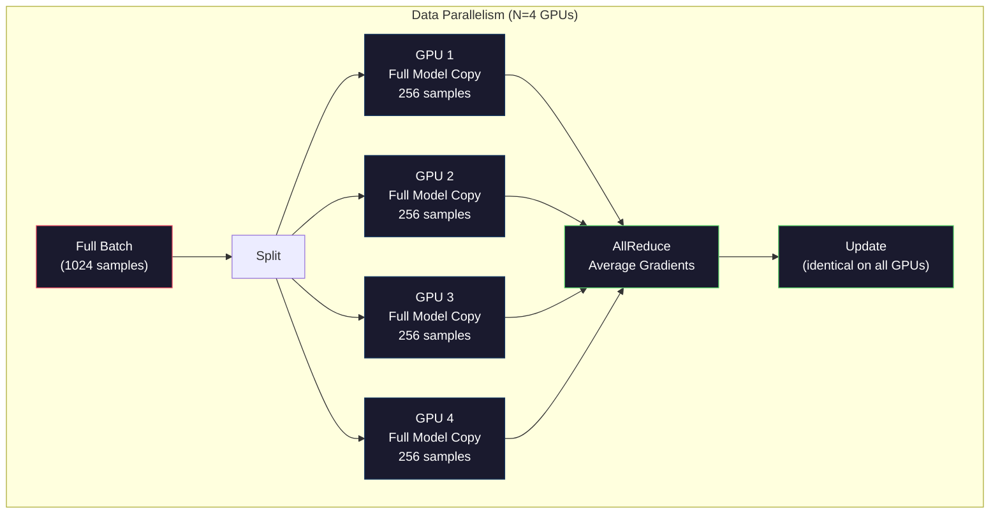
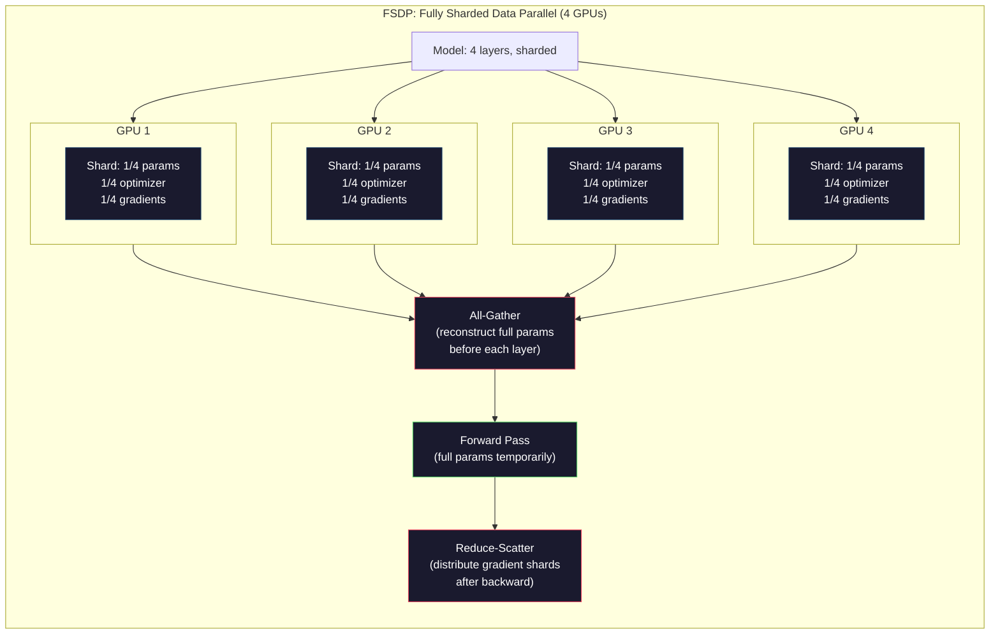
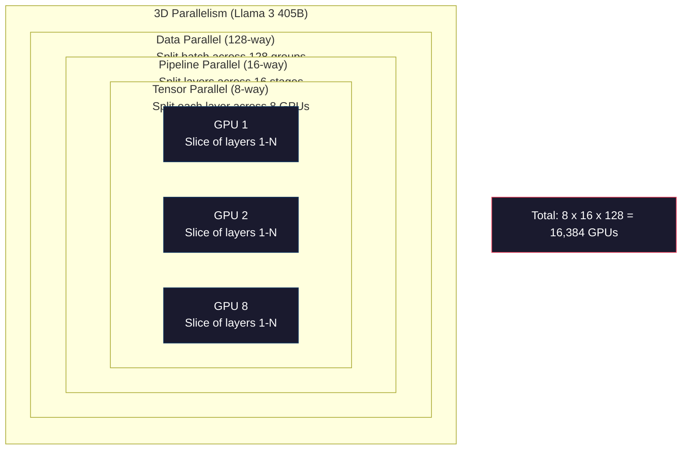

# Scaling: Distributed Training, FSDP, DeepSpeed（扩展：分布式训练、FSDP、DeepSpeed）

> 你的 124M 模型在单个 GPU 上训练了。现在试试 70 亿参数。模型放不进内存。数据在单机上要跑几周。分布式训练在大规模下不是可选项，而是唯一的前进路径。

**Type:** Build
**Languages:** Python
**Prerequisites:** Phase 10, Lesson 04 (Pre-Training a Mini GPT)
**Time:** ~120 minutes

## Learning Objectives

- 解释三种并行类型（data parallelism（数据并行）、tensor parallelism（张量并行）、pipeline parallelism（流水线并行））以及根据模型和集群大小何时需要每种
- 使用 PyTorch DDP 实现 data-parallel training，在多个 GPU 间同步 gradient
- 计算给定模型大小的内存预算（weights + optimizer states + gradients + activations），以确定最低硬件需求
- 配置 FSDP 或 DeepSpeed ZeRO stages，在 GPU 间分片模型状态，使超出单卡内存的模型能够训练

## The Problem

一个 7B 参数的 FP16 模型仅权重就需要 14GB。Adam optimizer 为每个参数存储两个额外副本（一阶和二阶矩估计）。那是另外 28GB。Backpropagation 期间的 gradients 再加 14GB。在存储单个 activation 之前，你已经到了 56GB。

一块 NVIDIA A100 有 80GB 内存。

56GB 占 80GB。留给 activations——forward pass 中计算并需要在 backward pass 中保持的中间值——只有 24GB。对于 2048-token 序列、4096 维模型，单层 activations 约 64MB。32 层需要每样本 2GB。Batch size 为 8 需要 16GB。你有 24GB。Batch size 为 12 就会爆。

现在试试 70B 参数。仅 FP16 权重：140GB。一块 GPU 放不下。你至少需要 2 块 A100（2 x 80GB = 160GB）才能装下权重。加上 optimizer states 和 gradients，你需要更多：最少 3 块 GPU，实际 8-16 块，取决于分片策略。

Llama 3 405B 在 16,384 块 NVIDIA H100 GPU 上训练。训练运行估计花费 1 亿美元算力。DeepSeek V3 通过巧妙的架构（Mixture of Experts 意味着每 token 只激活一部分参数）和训练效率，以约 560 万美元训练了一个可比的模型。

本课涵盖四种使大规模训练成为可能的策略：data parallelism、tensor parallelism、pipeline parallelism 和 fully sharded data parallelism。你会在纯 Python 中模拟每一种，在接触分布式训练框架之前理解其机制。

## The Concept

### Why Distribution is Required（为什么需要分布式）

以下是真实模型的内存计算。每个数字都是计算出来的，不是估计的。

| Model | Params | Weights (FP16) | Adam States | Gradients (FP16) | Total (no activations) |
|-------|--------|----------------|-------------|------------------|----------------------|
| GPT-2 Small | 124M | 248 MB | 992 MB | 248 MB | 1.5 GB |
| Llama 3 8B | 8B | 16 GB | 64 GB | 16 GB | 96 GB |
| Llama 3 70B | 70B | 140 GB | 560 GB | 140 GB | 840 GB |
| Llama 3 405B | 405B | 810 GB | 3,240 GB | 810 GB | 4,860 GB |

"Adam States" 列是杀手。Adam 为每个参数存储一个 running mean (m) 和一个 running variance (v)，都是 FP32。对于 70B 模型，那是 70B x 4 字节 x 2 = 560GB。仅 optimizer 就需要七块 A100。

单块 H100 有 80GB。Llama 3 405B 至少需要 61 块 H100 才能装下权重、optimizer 和 gradients。加上 activations，数字还会增长。Meta 使用 16,384 块 GPU 不是因为他们想——而是因为他们必须。

### Data Parallelism（数据并行）

最简单的分布式策略。将完整模型复制到 N 块 GPU。将每个训练 batch 分成 N 等份。每块 GPU 在其数据分片上运行 forward 和 backward pass。Backward pass 后，在所有 GPU 间平均 gradients。每块 GPU 用相同的平均 gradient 更新自己的权重副本，保持所有副本同步。

**优点：** 线性吞吐量扩展。N 块 GPU 每步处理 N 倍数据。通信仅限于 gradient 平均，可与计算重叠。

**缺点：** 每块 GPU 持有完整模型、optimizer states 和 gradients 的副本。对于 70B 模型，每块 GPU 需要 840GB。Data parallelism 不减少每卡内存。它只减少训练时间。

**数学：** Effective batch size = per_gpu_batch_size x N。对于 N=64 块 GPU，每卡 batch 为 16，effective batch 是 1,024。Llama 3 每步使用 1600 万 token 的 effective batch size。



### Tensor Parallelism（张量并行）

将单个层分片到多块 GPU。一个矩阵乘法被分到多块 GPU，每块计算结果的一部分。

考虑 feedforward layer 中 shape 为 (8192, 8192) 的权重矩阵。使用 4 路 tensor parallelism，每块 GPU 持有一个 (8192, 2048) 分片。每块 GPU 将输入乘以自己的分片，产生 partial result。Partial results 被组合（通过 all-reduce 或 all-gather）产生完整输出。

**优点：** 减少每卡模型权重的内存。70B 模型分在 8 块 GPU 上意味着每块 GPU 只持有约 8.75B 参数的权重。

**缺点：** 每层之后都需要快速的 GPU 间通信。每次 matmul 后的 all-reduce 增加延迟。这在 NVLink（同一节点内 GPU 间 900 GB/s）下工作良好，但在 InfiniBand（400 Gb/s，约 50 GB/s）跨节点连接下表现差。Tensor parallelism 几乎总是限制在单个节点内（8 块 GPU）。

**实际使用：** Megatron-LM 开创了 tensor parallelism。Llama 3 405B 在每个节点内使用 8 路 tensor parallelism。

### Pipeline Parallelism（流水线并行）

按层分片模型。GPU 1 运行层 1-8。GPU 2 运行层 9-16。GPU 3 运行层 17-24。GPU 4 运行层 25-32。数据流过流水线：GPU 1 计算自己的层并将 activations 发送给 GPU 2，GPU 2 计算自己的层并发送给 GPU 3，依此类推。

**优点：** GPU 间通信最少——只需层边界的 activations，与 gradients 或 weights 相比很小。跨节点工作良好，因为带宽要求低。

**缺点：** Pipeline bubbles（流水线气泡）。当 GPU 4 在计算 micro-batch 1 的 forward pass 时，GPU 1、2、3 空闲（它们已经转发了自己的部分）。Backward pass 时模式反转。使用 naive pipelining，N 个 pipeline stages 的 GPU 利用率只有 1/N。

**GPipe 和 PipeDream** 通过将 batch 分成 micro-batches 解决了 bubble 问题。GPU 1 一完成 micro-batch 1 的转发就开始 micro-batch 2。这在 pipeline stages 间重叠计算。M 个 micro-batches 和 N 个 stages 下，bubble fraction 降到 (N-1)/M。使用 M=16 个 micro-batches 和 N=4 个 stages，bubble 是 3/16 = 18.75% 的空闲时间。

### FSDP: Fully Sharded Data Parallel（全分片数据并行）

FSDP 结合了 data parallelism 的扩展性和 sharding 的内存效率。不是每块 GPU 持有完整模型副本，而是每块 GPU 只持有 1/N 的参数、gradients 和 optimizer states。

在一层的 forward pass 前，FSDP 运行 **all-gather** 从所有 GPU 收集完整参数到每块 GPU 的内存。Forward pass 后，每块 GPU 丢弃非本地参数。Backward 期间，all-gather 再次运行以重建参数用于 gradient 计算。Backward pass 后，**reduce-scatter** 分发 gradient 分片，每块 GPU 只存储 1/N 的 gradients。

**70B 模型在 8 块 GPU 上的数学：**

| Component | Without FSDP | With FSDP |
|-----------|-------------|-----------|
| Weights (FP16) | 140 GB per GPU | 17.5 GB per GPU |
| Adam States (FP32) | 560 GB per GPU | 70 GB per GPU |
| Gradients (FP16) | 140 GB per GPU | 17.5 GB per GPU |
| **Total** | **840 GB per GPU** | **105 GB per GPU** |

没有 FSDP，你无法在单块 80GB GPU 上放下 70B 模型。使用 8 块 GPU 的 FSDP，每块 GPU 用 105GB——等等，还是放不下。你至少需要 16 块 GPU 才能降到 80GB 以下，或者将 FSDP 与 activation checkpointing（backward 期间重新计算 activations 而不是存储它们）结合。

通信成本高于 vanilla data parallelism，因为每层前都有 all-gather。但内存节省使之前不可能的训练运行成为可能。



### DeepSpeed ZeRO

DeepSpeed 的 ZeRO（Zero Redundancy Optimizer）在概念上与 FSDP 相同，但由 Microsoft 独立开发。它定义了三个阶段，每个阶段更激进地分片：

| Stage | Shards | Memory Savings | Communication |
|-------|--------|---------------|---------------|
| ZeRO-1 | Optimizer states only | ~4x reduction | Same as data parallel |
| ZeRO-2 | + Gradients | ~8x reduction | Slightly more |
| ZeRO-3 | + Parameters | ~Nx reduction (N GPUs) | All-gather per layer |

ZeRO-3 等价于 FSDP。命名不同，机制相同。PyTorch 在 DeepSpeed 证明概念后添加了 FSDP 作为原生实现。

DeepSpeed 还引入了 ZeRO-Offload（将 optimizer states 卸载到 CPU 内存，更便宜且更大）和 ZeRO-Infinity（卸载到 NVMe SSD）。这些用计算速度换取内存容量——卸载操作更慢，但释放了 GPU 内存。

### Mixed Precision Training（混合精度训练）

现代训练同时使用多种浮点格式：

- **Forward pass**：FP16 或 BF16（16 位）。FP32 一半的内存。Tensor core 上 matmul 快 2 倍。
- **Master weights**：FP32（32 位）。由 optimizer 维护以保证 weight update 的数值精度。
- **Loss scaling**：Backward pass 前将 loss 乘以大常数，防止 FP16 gradients underflow（下溢）到零。Optimizer step 前除以相同常数。

BF16（Brain Float 16）与 FP32 有相同的指数范围（8 位指数）但精度降低（7 位尾数 vs FP32 的 23 位）。它很少需要 loss scaling，因为它能表示相同的数值范围。FP16 有 5 位指数和 10 位尾数——它能表示细粒度值，但在极端幅度下会溢出/下溢。

Google 的 TPU 原生使用 BF16。NVIDIA 的 A100 和 H100 同时支持 FP16 和 BF16。行业已基本转向 BF16，因为它消除了 loss scaling 的麻烦。

**7B 模型的内存对比：**

| Precision | Weights | Optimizer | Gradients | Total |
|-----------|---------|-----------|-----------|-------|
| FP32 everywhere | 28 GB | 56 GB | 28 GB | 112 GB |
| Mixed (BF16 + FP32 master) | 14 GB | 56 GB | 14 GB | 84 GB |

Mixed precision 在这个模型上节省了 28GB。Optimizer states 保持 FP32 不变——这是内存消耗的大头。

### Megatron-LM and 3D Parallelism（Megatron-LM 与三维并行）

真实的大规模训练结合了全部三种并行：

- **Data parallelism** 跨节点组（扩展 batch size）
- **Tensor parallelism** 在节点内（在 8 块 GPU 间分片层）
- **Pipeline parallelism** 跨节点（在机器间分片层组）

Llama 3 405B 在 16,384 块 H100 上：
- 每个节点内 8 路 tensor parallelism（每节点 8 块 GPU）
- 跨节点 16 路 pipeline parallelism（16 个 pipeline stages）
- 剩余维度上 128 路 data parallelism（16,384 / 8 / 16 = 128）

这种 3D 分解（8 x 16 x 128 = 16,384）就是如何扩展到数千块 GPU。每块 GPU 看到不同的数据分片（data parallel），持有每层的切片（tensor parallel），并计算不同的层组（pipeline parallel）。

DeepSeek V3 采取了不同方法。他们的 Mixture of Experts 架构每 token 只激活 671B 参数中的 37B。这意味着每块 GPU 只需计算（并存储 activations for）活跃参数。他们在 2,048 块 H800 GPU 上训练——不到 Meta GPU 数量的 1/8——花费 560 万美元 vs Meta 估计的 1 亿美元。



## Build It

### Step 1: Simulate Data Parallelism（模拟数据并行）

将 batch 分片到模拟 GPU。每块 GPU 在其分片上计算 forward pass。平均"gradients"（我们将其模拟为 loss 值）。

```python
import numpy as np

def simulate_data_parallelism(data, num_gpus, model_fn):
    batch_size = len(data)
    shard_size = batch_size // num_gpus
    remainder = batch_size % num_gpus

    gpu_losses = []
    gpu_gradients = []

    offset = 0
    for gpu_id in range(num_gpus):
        extra = 1 if gpu_id < remainder else 0
        shard = data[offset:offset + shard_size + extra]
        offset += shard_size + extra

        loss, grad = model_fn(shard)
        gpu_losses.append(loss)
        gpu_gradients.append(grad)

    avg_loss = np.mean(gpu_losses)
    avg_gradient = np.mean(gpu_gradients, axis=0)

    return avg_loss, avg_gradient
```

All-reduce 操作（平均 gradients）是 data parallelism 中唯一的通信。实践中，这在 NVIDIA GPU 上使用 NCCL 库，实现 ring all-reduce：每块 GPU 发送 1/N 的 gradients 给邻居，从另一邻居接收 1/N，N-1 步后每块 GPU 都有完整的平均值。总通信量：2 x gradient_size x (N-1)/N，对于大 N 接近 2 倍 gradient size。

### Step 2: Simulate Tensor Parallelism（模拟张量并行）

将权重矩阵分片到多块 GPU。每块 GPU 计算 partial matrix multiplication。组合结果。

```python
def simulate_tensor_parallelism(input_data, weight_matrix, num_gpus):
    d_in, d_out = weight_matrix.shape
    assert d_out % num_gpus == 0, f"d_out {d_out} not divisible by num_gpus {num_gpus}"
    shard_size = d_out // num_gpus

    partial_results = []
    for gpu_id in range(num_gpus):
        start = gpu_id * shard_size
        end = start + shard_size
        weight_shard = weight_matrix[:, start:end]

        partial = input_data @ weight_shard
        partial_results.append(partial)

    full_output = np.concatenate(partial_results, axis=-1)

    direct_output = input_data @ weight_matrix
    error = np.abs(full_output - direct_output).max()

    return full_output, error
```

Error 应该恰好为零（或机器 epsilon）。Tensor parallelism 在数学上是精确的——它产生与在单块 GPU 上计算完整 matmul 相同的结果。Split 沿输出维度，每块 GPU 产生不同 chunk 的列，拼接重建完整结果。

对于 column-parallel linear layers（分片输出维度），你拼接。对于 row-parallel（分片输入维度），你求和。在 transformer FFN 中，第一个 linear（扩展）使用 column-parallel，第二个 linear（收缩）使用 row-parallel。这避免了两层间的 all-reduce。

### Step 3: Simulate Pipeline Parallelism（模拟流水线并行）

将模型的层分片到虚拟 GPU。展示 bubble 问题——早期 stages 在晚期 stages 计算时空闲。

```python
def simulate_pipeline_parallelism(num_layers, num_stages, num_microbatches):
    layers_per_stage = num_layers // num_stages

    timeline = {}
    clock = 0

    for mb in range(num_microbatches):
        for stage in range(num_stages):
            start_time = max(
                timeline.get((stage, mb - 1, "fwd"), (0, 0))[1] if mb > 0 else 0,
                timeline.get((stage - 1, mb, "fwd"), (0, 0))[1] if stage > 0 else 0,
            )
            end_time = start_time + layers_per_stage
            timeline[(stage, mb, "fwd")] = (start_time, end_time)

    last_fwd_end = max(v[1] for v in timeline.values())

    for mb in range(num_microbatches - 1, -1, -1):
        for stage in range(num_stages - 1, -1, -1):
            deps = [last_fwd_end]
            if mb < num_microbatches - 1 and (stage, mb + 1, "bwd") in timeline:
                deps.append(timeline[(stage, mb + 1, "bwd")][1])
            if stage < num_stages - 1 and (stage + 1, mb, "bwd") in timeline:
                deps.append(timeline[(stage + 1, mb, "bwd")][1])
            start_time = max(deps)
            end_time = start_time + layers_per_stage
            timeline[(stage, mb, "bwd")] = (start_time, end_time)

    total_time = max(v[1] for v in timeline.values())
    compute_time = num_microbatches * num_stages * layers_per_stage * 2
    bubble_fraction = 1.0 - compute_time / (total_time * num_stages)

    return timeline, total_time, bubble_fraction
```

4 个 stages 和 1 个 micro-batch 下，bubble fraction 是 75%——任何时候都有四分之三的 GPU 空闲。16 个 micro-batches 下，降到约 19%。消除 bubbles 的代价是内存：你必须同时存储所有在途 micro-batches 的 activations。

### Step 4: Memory Calculator（内存计算器）

计算训练任何模型大小的精确内存需求。

```python
def memory_calculator(
    params_billions,
    precision_bytes=2,
    optimizer="adam",
    num_gpus=1,
    sharding="none",
    sequence_length=2048,
    batch_size_per_gpu=1,
    hidden_dim=None,
    num_layers=None,
):
    params = params_billions * 1e9

    weight_memory = params * precision_bytes

    if optimizer == "adam":
        optimizer_memory = params * 4 * 2
    elif optimizer == "sgd":
        optimizer_memory = params * 4
    else:
        optimizer_memory = 0

    gradient_memory = params * precision_bytes

    total_no_activation = weight_memory + optimizer_memory + gradient_memory

    if hidden_dim and num_layers:
        activation_per_layer = (
            sequence_length * batch_size_per_gpu * hidden_dim * precision_bytes * 4
        )
        activation_memory = activation_per_layer * num_layers
    else:
        activation_memory = params * precision_bytes * 0.5

    if sharding == "fsdp" or sharding == "zero3":
        weight_memory /= num_gpus
        optimizer_memory /= num_gpus
        gradient_memory /= num_gpus
    elif sharding == "zero2":
        optimizer_memory /= num_gpus
        gradient_memory /= num_gpus
    elif sharding == "zero1":
        optimizer_memory /= num_gpus

    per_gpu_total = weight_memory + optimizer_memory + gradient_memory + activation_memory

    return {
        "params_billions": params_billions,
        "weights_gb": weight_memory / 1e9,
        "optimizer_gb": optimizer_memory / 1e9,
        "gradients_gb": gradient_memory / 1e9,
        "activations_gb": activation_memory / 1e9,
        "per_gpu_total_gb": per_gpu_total / 1e9,
        "total_across_gpus_gb": per_gpu_total * num_gpus / 1e9,
        "fits_on_80gb": per_gpu_total / 1e9 <= 80,
        "num_gpus": num_gpus,
        "sharding": sharding,
    }
```

这个计算器回答了每个 ML 工程师都会问的问题："我需要多少块 GPU？" 输入模型大小，看看是否放得下。调整分片策略直到每卡总量降到 80GB 以下。

### Step 5: Mixed Precision Simulation（混合精度模拟）

比较 FP32、FP16 和 mixed precision 训练之间的内存使用。

```python
def mixed_precision_comparison(params_billions):
    params = params_billions * 1e9

    fp32_weights = params * 4
    fp32_optimizer = params * 4 * 2
    fp32_gradients = params * 4
    fp32_total = fp32_weights + fp32_optimizer + fp32_gradients

    fp16_weights = params * 2
    fp16_master = params * 4
    fp16_optimizer = params * 4 * 2
    fp16_gradients = params * 2
    fp16_total = fp16_weights + fp16_master + fp16_optimizer + fp16_gradients

    mixed_weights = params * 2
    mixed_optimizer = params * 4 * 2
    mixed_gradients = params * 2
    mixed_total = mixed_weights + mixed_optimizer + mixed_gradients

    return {
        "fp32_total_gb": fp32_total / 1e9,
        "fp16_with_master_gb": fp16_total / 1e9,
        "mixed_bf16_gb": mixed_total / 1e9,
        "savings_vs_fp32": 1 - mixed_total / fp32_total,
    }
```

对大多数人来说最大的惊喜：mixed precision 并没有把内存减半。Optimizer states（Adam 的 m 和 v）无论精度如何都保持 FP32。对于 7B 模型，FP32 训练用 112GB。Mixed precision 用 84GB。那是减少了 25%，不是 50%。Optimizer 占主导。

## Use It

### Run All Simulations（运行所有模拟）

```python
def run_all_demos():
    print("=" * 70)
    print("DATA PARALLELISM SIMULATION")
    print("=" * 70)

    np.random.seed(42)
    data = np.random.randn(64, 32)
    weight = np.random.randn(32, 16)

    def model_fn(batch):
        output = batch @ weight
        loss = np.mean(output ** 2)
        grad = 2 * batch.T @ (batch @ weight) / len(batch)
        return loss, grad

    for n_gpus in [1, 2, 4, 8]:
        loss, grad = simulate_data_parallelism(data, n_gpus, model_fn)
        print(f"  {n_gpus} GPUs: loss={loss:.4f}, grad_norm={np.linalg.norm(grad):.4f}")

    print()
    print("=" * 70)
    print("TENSOR PARALLELISM SIMULATION")
    print("=" * 70)

    x = np.random.randn(4, 8192)
    W = np.random.randn(8192, 8192)

    for n_gpus in [1, 2, 4, 8]:
        output, error = simulate_tensor_parallelism(x, W, n_gpus)
        print(f"  {n_gpus} GPUs: output_shape={output.shape}, max_error={error:.2e}")

    print()
    print("=" * 70)
    print("PIPELINE PARALLELISM SIMULATION")
    print("=" * 70)

    for n_mb in [1, 4, 8, 16, 32]:
        _, total_t, bubble = simulate_pipeline_parallelism(32, 4, n_mb)
        print(f"  {n_mb:2d} micro-batches: total_time={total_t:4d}, bubble={bubble:.1%}")

    print()
    print("=" * 70)
    print("MEMORY CALCULATOR")
    print("=" * 70)

    configs = [
        (7, "none", 1),
        (7, "fsdp", 8),
        (70, "none", 1),
        (70, "fsdp", 8),
        (70, "fsdp", 16),
        (405, "fsdp", 64),
        (405, "fsdp", 128),
    ]

    print(f"  {'Model':>8} {'Sharding':>8} {'GPUs':>5} {'Per-GPU':>10} {'Fits 80GB':>10}")
    print("  " + "-" * 50)
    for params, shard, gpus in configs:
        result = memory_calculator(params, num_gpus=gpus, sharding=shard)
        fits = "Yes" if result["fits_on_80gb"] else "No"
        print(f"  {params:>6}B {shard:>8} {gpus:>5} {result['per_gpu_total_gb']:>8.1f}GB {fits:>10}")

    print()
    print("=" * 70)
    print("MIXED PRECISION COMPARISON")
    print("=" * 70)

    for params_b in [7, 13, 70, 405]:
        result = mixed_precision_comparison(params_b)
        print(f"  {params_b}B: FP32={result['fp32_total_gb']:.0f}GB, "
              f"Mixed BF16={result['mixed_bf16_gb']:.0f}GB, "
              f"Savings={result['savings_vs_fp32']:.0%}")
```

## Ship It

本课程产出 `outputs/prompt-distributed-training-planner.md`——一个接受模型大小和可用硬件，然后产出完整分布式训练计划的 prompt：并行策略、内存预算、通信开销和预期吞吐量。

## Exercises

1. 修改内存计算器以包含 activation checkpointing。使用 checkpointing 时，只存储每 K 层的 activations（典型 K=1，意味着全部重新计算）。展示内存-计算权衡：checkpointing 节省多少内存，以及它使训练慢多少（完整 checkpointing 大约增加 33% 计算）？

2. 扩展 pipeline parallelism 模拟以实现 PipeDream 使用的 1F1B（one forward, one backward）schedule。比较 4 个 stages 和 8 个 micro-batches 下与 naive schedule 的 bubble fraction。1F1B schedule 应该有更小的峰值内存，因为它更早开始 backward passes。

3. 实现一个 gradient accumulation 模拟器。不是在每个 micro-batch 后 all-reduce，而是本地累积 K 步 gradients，然后 all-reduce。展示这如何将通信减少 K 倍但产生相同的最终 gradients（因此产生相同的训练）。

4. 构建一个成本估算器。给定模型大小、目标 token 数、GPU 类型（A100 $2/小时、H100 $3.50/小时）和并行策略，估计总训练成本（美元）。与已知成本验证：Llama 3 405B  reportedly 花费 ~1 亿美元，DeepSeek V3 花费 ~560 万美元。

5. 给内存计算器添加 ZeRO-Offload。假设每节点 CPU RAM 512GB、NVMe 2TB。展示将 optimizer states 卸载到 CPU 如何让 70B 模型在 4 块 GPU 而非 16 块上训练，代价是 optimizer steps 慢 30-50%。

## Key Terms

| Term | What people say | What it actually means |
|------|----------------|----------------------|
| Data parallelism | "Copy the model to every GPU" | Each GPU processes a different data shard; gradients are averaged via all-reduce after each step |
| Tensor parallelism | "Split a layer across GPUs" | Partition weight matrices so each GPU computes part of the matmul; requires fast NVLink interconnect |
| Pipeline parallelism | "Split layers across GPUs" | Each GPU runs a different group of layers; data flows through the pipeline with micro-batches to reduce bubbles |
| FSDP | "Shard everything" | Fully Sharded Data Parallel -- each GPU holds 1/N of weights, gradients, and optimizer states; all-gather before compute |
| ZeRO | "DeepSpeed's version of FSDP" | Zero Redundancy Optimizer with 3 stages: shard optimizer (Stage 1), + gradients (Stage 2), + parameters (Stage 3) |
| All-reduce | "Average across GPUs" | Collective operation where every GPU ends with the sum (or average) of all GPUs' inputs -- typically implemented as ring all-reduce |
| All-gather | "Collect from all GPUs" | Collective operation where every GPU ends with the concatenation of all GPUs' data -- used in FSDP to reconstruct full parameters |
| Reduce-scatter | "Sum and distribute" | Collective operation that reduces (sums) data and scatters different chunks to different GPUs -- used in FSDP for gradient sharding |
| Mixed precision | "Train in half precision" | Use FP16/BF16 for forward/backward and FP32 for optimizer states -- saves ~25% memory, not 50%, because the optimizer dominates |
| Pipeline bubble | "Idle time in the pipeline" | Fraction of time GPUs sit idle waiting for data from the previous stage -- reduced by using more micro-batches |

## Further Reading

- [Rajbhandari et al., 2020 -- "ZeRO: Memory Optimizations Toward Training Trillion Parameter Models"](https://arxiv.org/abs/1910.02054) -- the DeepSpeed ZeRO paper that defined the three sharding stages
- [Shoeybi et al., 2020 -- "Megatron-LM: Training Multi-Billion Parameter Language Models Using Model Parallelism"](https://arxiv.org/abs/1909.08053) -- NVIDIA's tensor parallelism for transformers
- [Narayanan et al., 2021 -- "Efficient Large-Scale Language Model Training on GPU Clusters Using Megatron-LM"](https://arxiv.org/abs/2104.04473) -- 3D parallelism combining data, tensor, and pipeline
- [Zhao et al., 2023 -- "PyTorch FSDP: Experiences on Scaling Fully Sharded Data Parallel"](https://arxiv.org/abs/2304.11277) -- PyTorch's native FSDP implementation
- [Llama 3 Technical Report](https://arxiv.org/abs/2407.21783) -- 16,384 GPU training with 3D parallelism details
- [DeepSeek-V3 Technical Report](https://arxiv.org/abs/2412.19437) -- how MoE architecture reduces training cost by an order of magnitude
