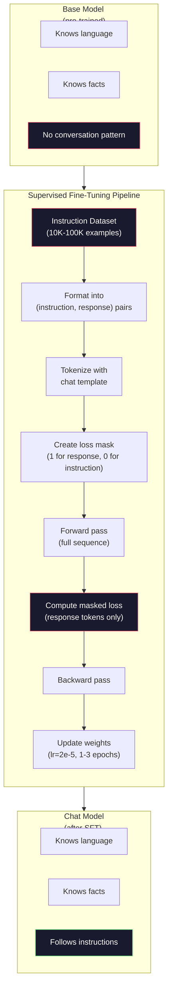

# 指令微调 (SFT)

> 基础模型只预测下一个 token。仅此而已。它不会遵循指令、回答问题或拒绝有害请求。SFT 是将 token 预测器转化为有用助手的桥梁。你与之交谈过的每一个模型——Claude、GPT、Llama Chat——都经历了这一步。

**类型:** Build
**语言:** Python (with numpy)
**前置知识:** Phase 10, Lesson 04 (Pre-Training a Mini GPT)
**时间:** ~90 分钟

## 学习目标

- 实现监督微调 (SFT)，将基础语言模型转化为遵循指令的助手
- 使用包含 system、user、assistant 角色的 chat template 格式化训练数据，并对非 assistant token 进行 loss masking
- 解释为什么 SFT 是必要的：基础模型会延续文本而不是回答问题
- 通过在保留的指令集上比较基础模型与微调模型的响应来评估 SFT 质量

## 问题所在

你在 Lesson 04 中训练了一个模型。给定一个序列，它可以预测下一个 token。输入 "The transformer architecture"，它可能会继续输出 "has revolutionized natural language processing." 对于下一个 token 预测器来说，这令人印象深刻。

现在试试这个：输入 "What is the capital of France?" 基础模型不会回答 "Paris." 它会延续这个模式。它可能会产生 "What is the capital of Germany? What is the capital of Spain?" 因为它从包含问题列表的文档中学到了这些。或者它可能会产生 "is a question that many people ask" 因为这是一个合理的下一个 token 延续。模型没有*回答*的概念。它只知道*延续*。

这就是 GPT-3（基础模型，2020 年 6 月发布）和 ChatGPT（指令微调，2022 年 11 月发布）之间的差距。相同的架构。相同的 pre-training。区别在于 20,000 到 100,000 个精心制作的 (instruction, response) 对，它们教会了模型遵循对话模式。

Stanford Alpaca 证明你不需要数百万个示例。2023 年 3 月，他们使用 GPT-3.5 生成的 52,000 个指令-响应对对 Llama 7B 进行了 fine-tuning。总成本：600 美元。结果是一个能够遵循指令、回答问题和进行对话的聊天机器人。不如 ChatGPT，但对于 600 美元和几小时的训练来说，惊人地接近。

Meta 的 Llama 2 Chat 在其初始 SFT 阶段仅使用了约 27,000 个高质量示例。关键洞察：质量比数量更重要。27,000 个由熟练标注员编写的示例击败了从互联网上抓取的 100 万个嘈杂示例。

## 核心概念

### SFT 实际做了什么

Supervised Fine-Tuning 延续了 pre-training 中相同的训练循环——forward pass、计算 loss、backward pass、更新权重——但使用不同类型的数据。不是原始文本，而是训练结构化对话：

```json
{
  "system": "You are a helpful assistant.",
  "user": "What is the capital of France?",
  "assistant": "The capital of France is Paris."
}
```

模型已经知道巴黎是法国的首都。它在 pre-training 期间从维基百科、教科书和网页中学到了这一点。SFT 并没有教会模型新的事实。它教会了模型一种新的*行为*：当你看到问题时，给出答案。当你看到指令时，产生 completion。当你看到有害请求时，产生拒绝。

这样想。Pre-training 给模型知识。SFT 给模型礼仪。

### 数据格式

三种格式主导着行业。每种格式都用不同的分隔符编码相同的信息——谁说了什么。

**Alpaca Format** (Stanford, March 2023):

```json
{
  "instruction": "Summarize the following article in 3 sentences.",
  "input": "The European Central Bank raised interest rates...",
  "output": "The ECB increased rates by 25 basis points..."
}
```

简单且广泛使用。`input` 字段是可选的——许多指令不需要额外的上下文。Stanford 以这种格式发布了 52,000 个由 GPT-3.5 生成的示例，花费了 600 美元。这开启了开源指令微调运动。

**ShareGPT Format** (community, 2023):

```json
{
  "conversations": [
    {"from": "system", "value": "You are a helpful assistant."},
    {"from": "human", "value": "What causes tides?"},
    {"from": "gpt", "value": "Tides are caused by the gravitational pull of the Moon..."},
    {"from": "human", "value": "How often do they occur?"},
    {"from": "gpt", "value": "Most coastal areas experience two high tides and two low tides per day..."}
  ]
}
```

支持多轮对话。"from" 字段按约定使用 "human" 和 "gpt"，无论实际模型是什么。Vicuna 是在从用户共享的 ChatGPT 转录本中抓取的 70,000 个 ShareGPT 对话上训练的。

**ChatML Format** (OpenAI, used by many open-source models):

```
<|im_start|>system
You are a helpful assistant.<|im_end|>
<|im_start|>user
What is the capital of France?<|im_end|>
<|im_start|>assistant
The capital of France is Paris.<|im_end|>
```

使用特殊 token (`<|im_start|>`, `<|im_end|>`) 来分隔角色。这些 token 在 fine-tuning 期间被添加到 tokenizer 的词汇表中。Qwen、Yi 和许多其他模型使用 ChatML。

这三种格式都实现了相同的目标：它们告诉模型 "这是指令，这是响应，学习这个模式。"

### 为什么有效

模型已经从 pre-training 中了解了语言。它已经看到了数十亿个问题后面跟着答案、指令后面跟着 completion、人与人之间对话的例子。这些模式已经编码在权重中。

SFT 集中了这种潜在的能力。模型不再需要根据上下文来判断它应该回答问题还是延续文档，SFT 明确地在对话模式上进行训练。经过几千个示例后，模型学会了：当你看到 assistant 角色标记时，产生一个有用的响应。

这就是为什么 27,000 个示例就足够了。你不是在教模型英语。你不是在教它关于世界的事实。你是在教它一种简单的行为：响应指令。知识已经在那里了。

### Masked Loss

这是 SFT 中最重要的技术细节，大多数教程都跳过了。

在 pre-training 期间，你计算每个 token 的 loss。模型学习预测序列中的每个下一个 token。在 SFT 期间，你只计算*响应* token 的 loss。指令 token 用于上下文，但模型不会因为 "预测" 它们而受到惩罚。

为什么？因为你不想让模型学习*生成*指令。你想让它学习*响应*指令。如果你在指令 token 上计算 loss，你就是在训练模型预测 "What is the capital of France?"，就好像是它在提问一样。这浪费了梯度信号，并可能让模型对它的角色感到困惑。

在实践中，你创建一个 loss mask：响应 token 为 1，指令 token 为 0。在平均之前将每个 token 的 loss 乘以这个 mask。

```
Tokens:    [SYS] You are helpful [USER] What is the capital? [ASST] Paris is the capital [EOS]
Loss mask:   0    0    0     0      0     0   0  0     0       1     1    1   1     1      1
```

只有 `[ASST]` 之后的 token 对 loss 有贡献。模型在 forward pass 期间看到完整的对话（它需要指令来产生正确的响应），但只根据它预测响应的效果来更新权重。

### 训练超参数

SFT 使用与 pre-training 截然不同的 hyperparameters。你不是从头开始训练。你是在调整一个已经工作的模型。

| Parameter | Pre-Training (Llama 2 7B) | SFT (Llama 2 Chat) |
|-----------|---------------------------|---------------------|
| Learning rate | 3e-4 (peak) | 2e-5 |
| Epochs | 1 (single pass over data) | 2 |
| Batch size | 4M tokens | 64 examples |
| Warmup steps | 2,000 | 0-100 |
| Weight decay | 0.1 | 0.0-0.1 |
| Data size | 2T tokens | 27,000 examples |

SFT 的学习率降低了 15 倍。这很关键。fine-tuning 期间的高学习率会破坏 pre-trained 的知识。模型 "忘记" 了它学到的东西，并 overfitting 到小的 fine-tuning 数据集。这就是 catastrophic forgetting。

两个 epoch 意味着模型看到每个训练示例两次。在小数据集上超过 3 个 epoch 会导致 memorization——模型开始逐字复制训练示例，而不是泛化。

### Catastrophic Forgetting

Fine-tuning 会破坏通用能力。在指令遵循数据上训练太久，模型会失去编写代码、做数学或产生创意文本的能力。它变得非常擅长其训练数据的特定格式，而在其他所有方面都很糟糕。

三种缓解方法：

1. **低学习率。** 1e-5 到 5e-5。较小的更新意味着对 pre-trained 特征的破坏较少。

2. **短训练。** 1-3 个 epoch。在模型 overfitting 之前停止。

3. **混合 pre-training 数据。** Llama 2 Chat 将一小部分 (2-5%) 原始 pre-training 数据混合到 SFT 数据集中。这在学习新的指令遵循行为的同时 "提醒" 模型它的通用能力。

### 真实数据

在 10,000 个高质量指令对上 fine-tuning 一个 7B 模型大约需要 1 小时，使用单个 NVIDIA A100 80GB GPU。计算如下：

- 10,000 个示例 x 平均 512 个 token = 5.12M 个 token
- 2 个 epoch = 总共 10.24M 个 token
- A100 上 7B 模型 fine-tuning 的吞吐量：~3,000 token/秒
- 10.24M / 3,000 = ~3,400 秒 = ~57 分钟

对于我们的 mini GPT（4 层，128 维），训练几乎是瞬间完成的。重点是理解机制，而不是规模。



## 动手实现

### Step 1: Instruction Dataset

创建一个合成指令数据集。在生产环境中，像 Scale AI 和 Anthropic 这样的公司雇佣人工标注员来编写这些。我们将以编程方式创建它们来演示格式。

```python
import numpy as np

INSTRUCTION_DATA = [
    {
        "instruction": "What is the capital of France?",
        "response": "The capital of France is Paris."
    },
    {
        "instruction": "Explain gravity in one sentence.",
        "response": "Gravity is the force that attracts objects with mass toward each other."
    },
    {
        "instruction": "Write a haiku about the ocean.",
        "response": "Waves crash on the shore, salt and foam beneath the sun, endless blue expanse."
    },
    {
        "instruction": "What is 15 multiplied by 7?",
        "response": "15 multiplied by 7 is 105."
    },
    {
        "instruction": "Name three programming languages.",
        "response": "Three programming languages are Python, Rust, and TypeScript."
    },
    {
        "instruction": "Summarize photosynthesis.",
        "response": "Photosynthesis converts sunlight, water, and carbon dioxide into glucose and oxygen."
    },
    {
        "instruction": "What year did World War II end?",
        "response": "World War II ended in 1945."
    },
    {
        "instruction": "Define machine learning.",
        "response": "Machine learning is a field where algorithms learn patterns from data to make predictions."
    },
]
```

八个示例很少。Stanford Alpaca 使用了 52,000 个。但无论你是 8 个还是 52,000 个，机制都是相同的：tokenize、mask、只计算响应上的 loss。

### Step 2: Tokenize with Chat Template

将指令-响应对转换为带有特殊角色标记的 token 序列。这些标记告诉模型指令在哪里结束，响应在哪里开始。

```python
SPECIAL_TOKENS = {
    "INST_START": 253,
    "INST_END": 254,
    "RESP_START": 255,
}


def tokenize_instruction_pair(instruction, response, vocab_size=256):
    inst_tokens = list(instruction.encode("utf-8"))
    resp_tokens = list(response.encode("utf-8"))

    inst_tokens = [min(t, vocab_size - 4) for t in inst_tokens]
    resp_tokens = [min(t, vocab_size - 4) for t in resp_tokens]

    tokens = (
        [SPECIAL_TOKENS["INST_START"]]
        + inst_tokens
        + [SPECIAL_TOKENS["INST_END"]]
        + [SPECIAL_TOKENS["RESP_START"]]
        + resp_tokens
    )

    return tokens


def create_loss_mask(tokens):
    mask = np.zeros(len(tokens), dtype=np.float32)
    in_response = False

    for i, token in enumerate(tokens):
        if token == SPECIAL_TOKENS["RESP_START"]:
            in_response = True
            continue
        if in_response:
            mask[i] = 1.0

    return mask
```

Loss mask 对于指令 token 全为零，对于响应 token 全为一。`RESP_START` token 本身获得 0 的 mask，因为它是分隔符，不是响应内容的一部分。

### Step 3: Masked Cross-Entropy Loss

标准交叉熵，但乘以 loss mask。只有响应 token 对梯度有贡献。

```python
def masked_cross_entropy_loss(logits, targets, loss_mask):
    batch, seq_len, vocab_size = logits.shape
    logits_flat = logits.reshape(-1, vocab_size)
    targets_flat = targets.reshape(-1)
    mask_flat = loss_mask.reshape(-1)

    max_logits = logits_flat.max(axis=-1, keepdims=True)
    log_softmax = logits_flat - max_logits - np.log(
        np.exp(logits_flat - max_logits).sum(axis=-1, keepdims=True)
    )

    per_token_loss = -log_softmax[np.arange(len(targets_flat)), targets_flat]

    masked_loss = per_token_loss * mask_flat
    num_response_tokens = mask_flat.sum()
    if num_response_tokens == 0:
        return 0.0
    loss = masked_loss.sum() / num_response_tokens

    return loss
```

分母是 `num_response_tokens`，不是 `seq_len`。如果你除以总序列长度，更长的指令会稀释梯度信号。除以响应 token 数量确保每个响应 token 无论指令长度如何都具有相等的权重。

### Step 4: SFT Training Loop

重用 Lesson 04 中的 MiniGPT。训练循环看起来几乎与 pre-training 相同，但带有指令格式化和 masked loss。

```python
import sys
import os
sys.path.insert(0, os.path.join(os.path.dirname(__file__), "..", "..", "04-pre-training-mini-gpt", "code"))
from main import MiniGPT, LayerNorm, FeedForward, MultiHeadAttention, TransformerBlock, Embedding


def sft_train(model, dataset, num_epochs=2, lr=2e-5, seq_len=64):
    formatted_data = []
    for example in dataset:
        tokens = tokenize_instruction_pair(example["instruction"], example["response"])
        mask = create_loss_mask(tokens)
        formatted_data.append((tokens, mask))

    print(f"SFT Training: {len(formatted_data)} examples, {num_epochs} epochs, lr={lr}")
    print(f"Total tokens: {sum(len(t) for t, _ in formatted_data):,}")
    print()

    losses = []

    for epoch in range(num_epochs):
        epoch_loss = 0.0
        num_batches = 0

        indices = np.random.permutation(len(formatted_data))

        for idx in indices:
            tokens, mask = formatted_data[idx]

            if len(tokens) < 3:
                continue
            if len(tokens) > seq_len:
                tokens = tokens[:seq_len]
                mask = mask[:seq_len]

            input_ids = np.array(tokens[:-1]).reshape(1, -1)
            target_ids = np.array(tokens[1:]).reshape(1, -1)
            loss_mask = np.array(mask[1:]).reshape(1, -1)

            logits = model.forward(input_ids)
            loss = masked_cross_entropy_loss(logits, target_ids, loss_mask)

            batch_size, s_len, v_size = logits.shape
            probs = np.exp(logits - logits.max(axis=-1, keepdims=True))
            probs = probs / probs.sum(axis=-1, keepdims=True)
            dlogits = probs.copy()
            dlogits[np.arange(batch_size)[:, None], np.arange(s_len), target_ids] -= 1.0

            mask_expanded = loss_mask[:, :, np.newaxis]
            num_resp = loss_mask.sum()
            if num_resp > 0:
                dlogits = dlogits * mask_expanded / num_resp

            for block in model.blocks:
                block.ffn.W1 -= lr * np.random.randn(*block.ffn.W1.shape) * 0.01
                block.ffn.W2 -= lr * np.random.randn(*block.ffn.W2.shape) * 0.01
                block.ffn.b1 -= lr * np.random.randn(*block.ffn.b1.shape) * 0.01
                block.ffn.b2 -= lr * np.random.randn(*block.ffn.b2.shape) * 0.01

            epoch_loss += loss
            num_batches += 1
            losses.append(loss)

        avg_loss = epoch_loss / max(num_batches, 1)
        print(f"Epoch {epoch + 1}/{num_epochs} | Avg Loss: {avg_loss:.4f}")

    return model, losses
```

学习率是 2e-5，与 Llama 2 Chat 匹配。与 pre-training 中使用的 3e-4 相比——小了 15 倍。梯度被 masking：指令 token 产生零梯度。只有响应 token 推动权重更新。

### Step 5: Compare Base vs SFT Model

SFT 的全部意义在于行为改变。让我们通过检查模型对指令格式化输入与原始文本延续的响应方式来衡量这一点。

```python
def generate_response(model, prompt_tokens, max_new_tokens=50, temperature=0.8):
    tokens = list(prompt_tokens)
    seq_len = model.embedding.pos_embed.shape[0]

    for _ in range(max_new_tokens):
        context = np.array(tokens[-seq_len:]).reshape(1, -1)
        logits = model.forward(context)
        next_logits = logits[0, -1, :]

        next_logits = next_logits / max(temperature, 1e-8)
        probs = np.exp(next_logits - next_logits.max())
        probs = probs / probs.sum()
        probs = np.clip(probs, 1e-10, 1.0)
        probs = probs / probs.sum()

        next_token = np.random.choice(len(probs), p=probs)
        tokens.append(int(next_token))

    return tokens


def evaluate_instruction_following(model, instructions):
    print("Evaluating instruction following:")
    print("-" * 50)

    for instruction in instructions:
        tokens = (
            [SPECIAL_TOKENS["INST_START"]]
            + [min(t, 252) for t in list(instruction.encode("utf-8"))]
            + [SPECIAL_TOKENS["INST_END"]]
            + [SPECIAL_TOKENS["RESP_START"]]
        )

        output = generate_response(model, tokens, max_new_tokens=30, temperature=0.6)
        response_start = len(tokens)
        response_tokens = output[response_start:]
        response_bytes = bytes([t for t in response_tokens if t < 128])
        response_text = response_bytes.decode("utf-8", errors="replace")

        print(f"  Q: {instruction}")
        print(f"  A: {response_text[:80]}")
        print()
```

在一个只有 8 个示例的微型模型上，响应不会有意义。这是预期的。重要的是*结构*：模型学会在响应标记之后产生输出，而不是继续生成更多指令。

### Step 6: Measure Catastrophic Forgetting

比较 SFT 前后模型的下一个 token 预测能力。如果 SFT 损害了通用能力，原始文本上的 loss 会增加。

```python
def measure_forgetting(model, test_text, seq_len=64):
    tokens = np.array(list(test_text.encode("utf-8")[:512]))

    total_loss = 0.0
    num_windows = 0

    for start in range(0, len(tokens) - seq_len - 1, seq_len):
        input_ids = tokens[start:start + seq_len].reshape(1, -1)
        target_ids = tokens[start + 1:start + seq_len + 1].reshape(1, -1)

        logits = model.forward(input_ids)

        batch, s_len, vocab_size = logits.shape
        logits_flat = logits.reshape(-1, vocab_size)
        targets_flat = target_ids.reshape(-1)

        max_logits = logits_flat.max(axis=-1, keepdims=True)
        log_softmax = logits_flat - max_logits - np.log(
            np.exp(logits_flat - max_logits).sum(axis=-1, keepdims=True)
        )

        loss = -log_softmax[np.arange(len(targets_flat)), targets_flat].mean()
        total_loss += loss
        num_windows += 1

    return total_loss / max(num_windows, 1)
```

在真正的 fine-tuning 中，你会在整个训练过程中跟踪这个指标。如果原始文本 loss 增加超过 10-15%，你的 SFT 就太激进了。降低学习率或减少 epoch 数量。

## 使用它

### Full SFT Pipeline Demo

```python
if __name__ == "__main__":
    np.random.seed(42)

    test_text = """The transformer architecture processes sequences through self-attention.
Each layer applies multi-head attention followed by a feedforward network.
Residual connections and layer normalization stabilize deep networks.
The model learns to predict the next token given all previous tokens."""

    print("=" * 70)
    print("INSTRUCTION TUNING (SFT) DEMO")
    print("=" * 70)
    print()

    model = MiniGPT(
        vocab_size=256, embed_dim=128, num_heads=4,
        num_layers=4, max_seq_len=128, ff_dim=512
    )
    print(f"Model: {model.count_parameters():,} parameters")
    print(f"Config: 4 layers, 4 heads, 128 dims (mini GPT from Lesson 04)")
    print()

    print("PRE-SFT: Measuring base model loss on raw text")
    base_loss = measure_forgetting(model, test_text)
    print(f"  Base model loss: {base_loss:.4f}")
    print()

    print("=" * 70)
    print("SFT TRAINING")
    print("=" * 70)

    model, losses = sft_train(
        model, INSTRUCTION_DATA, num_epochs=3, lr=2e-5, seq_len=128
    )

    print()
    print("POST-SFT: Measuring fine-tuned model loss on raw text")
    sft_loss = measure_forgetting(model, test_text)
    print(f"  SFT model loss: {sft_loss:.4f}")
    print(f"  Change: {((sft_loss - base_loss) / base_loss * 100):+.1f}%")
    if abs(sft_loss - base_loss) / base_loss < 0.15:
        print("  Minimal forgetting (< 15% change)")
    else:
        print("  Significant forgetting detected")
    print()

    print("=" * 70)
    print("INSTRUCTION FOLLOWING EVALUATION")
    print("=" * 70)
    print()

    test_instructions = [
        "What is the capital of France?",
        "Name a programming language.",
        "Define gravity.",
    ]
    evaluate_instruction_following(model, test_instructions)

    print("=" * 70)
    print("DATA FORMAT EXAMPLES")
    print("=" * 70)
    print()

    for i, example in enumerate(INSTRUCTION_DATA[:3]):
        tokens = tokenize_instruction_pair(example["instruction"], example["response"])
        mask = create_loss_mask(tokens)
        resp_count = int(mask.sum())
        total_count = len(tokens)
        print(f"  Example {i + 1}: {total_count} tokens, {resp_count} response tokens ({resp_count/total_count:.0%} of sequence)")
        print(f"    Instruction: {example['instruction']}")
        print(f"    Response: {example['response']}")
        print()

    print("=" * 70)
    print("TRAINING LOSS CURVE")
    print("=" * 70)
    print()

    if losses:
        window = max(1, len(losses) // 5)
        for i in range(0, len(losses), window):
            chunk = losses[i:i + window]
            avg = sum(chunk) / len(chunk)
            print(f"  Steps {i:3d}-{i + len(chunk) - 1:3d}: avg loss = {avg:.4f}")
```

## Ship It

本课程产出 `outputs/prompt-sft-data-curator.md` —— 一个帮助你为 SFT 设计和策划指令数据集 prompt。给定一个目标能力（代码生成、数学、对话），它会产生一个数据收集计划，包含格式规范、质量标准和多样性要求。

## 练习

1. 添加 system prompt 支持。修改 `tokenize_instruction_pair` 以接受 system message 并在指令前添加它。创建 5 个带有不同 system prompt 的示例（"You are a poet", "You are a math tutor"）并验证模型在训练期间看到不同的 system prompt。

2. 实现数据混合。创建一个函数，接受 SFT 数据集和原始文本语料库，然后生成训练批次，其中 5% 的示例是原始文本（无 masking），95% 是指令对（masked）。运行 3 个 epoch 并将遗忘指标与纯 SFT 训练进行比较。

3. 构建数据质量评分器。对于每个指令-响应对，计算：(a) 响应长度（以 token 计），(b) 指令与响应比例，(c) 词汇多样性（唯一 token / 总 token）。过滤掉响应长度 < 10 个 token 或多样性 < 0.3 的示例。展示过滤如何影响最终 loss。

4. 实现多轮对话训练。扩展 tokenization 以处理 3 轮对话（user-assistant-user-assistant-user-assistant）。Loss mask 应该覆盖所有三个 assistant turn。通过打印一个示例的 token-mask 对齐来验证 mask 是否正确。

5. 比较学习率。使用 lr=1e-4、lr=2e-5 和 lr=1e-6 训练同一模型三次。绘制 loss 曲线。1e-4 的运行应该显示快速初始下降但更高的最终 loss（overfitting）。1e-6 的运行应该几乎没有变化。2e-5 的运行应该是最佳点。

## 关键术语

| Term | What people say | What it actually means |
|------|----------------|----------------------|
| SFT | "Fine-tuning on conversations" | Supervised Fine-Tuning: continuing training on (instruction, response) pairs with loss computed only on response tokens |
| Instruction tuning | "Teaching the model to follow instructions" | Training on explicit instruction-response pairs so the base model learns the conversation pattern, not new knowledge |
| Loss masking | "Ignoring the prompt" | Setting loss to zero for instruction tokens so gradients only flow from response token predictions |
| ChatML | "Chat Markup Language" | A token format using `<\|im_start\|>` and `<\|im_end\|>` delimiters to mark speaker roles in conversation data |
| Alpaca format | "Stanford's format" | A JSON format with instruction/input/output fields, used for 52K GPT-3.5-generated examples that cost $600 |
| Catastrophic forgetting | "The model gets dumber" | Fine-tuning destroys pre-trained capabilities because gradient updates overwrite general knowledge with task-specific patterns |
| Weight tying | "Shared embeddings" | Using the same matrix for input token embeddings and output prediction head, saving parameters and improving coherence |
| Chat template | "How you format the prompt" | The specific token sequence (role markers, delimiters) that structures a conversation for the model |

## 延伸阅读

- [Ouyang et al., 2022 -- "Training language models to follow instructions with human feedback" (InstructGPT)](https://arxiv.org/abs/2203.02155) -- the paper that introduced instruction tuning + RLHF at OpenAI
- [Taori et al., 2023 -- "Stanford Alpaca: An Instruction-following LLaMA Model"](https://github.com/tatsu-lab/stanford_alpaca) -- 52K instruction examples for $600, proving SFT works on small datasets
- [Touvron et al., 2023 -- "Llama 2: Open Foundation and Fine-Tuned Chat Models"](https://arxiv.org/abs/2307.09288) -- Meta's SFT + RLHF pipeline with 27K high-quality examples
- [Chiang et al., 2023 -- "Vicuna: An Open-Source Chatbot Impressing GPT-4"](https://lmsys.org/blog/2023-03-30-vicuna/) -- training on 70K ShareGPT conversations
- [Zhou et al., 2023 -- "LIMA: Less Is More for Alignment"](https://arxiv.org/abs/2305.11206) -- proving that 1,000 carefully curated examples can match SFT on much larger datasets
