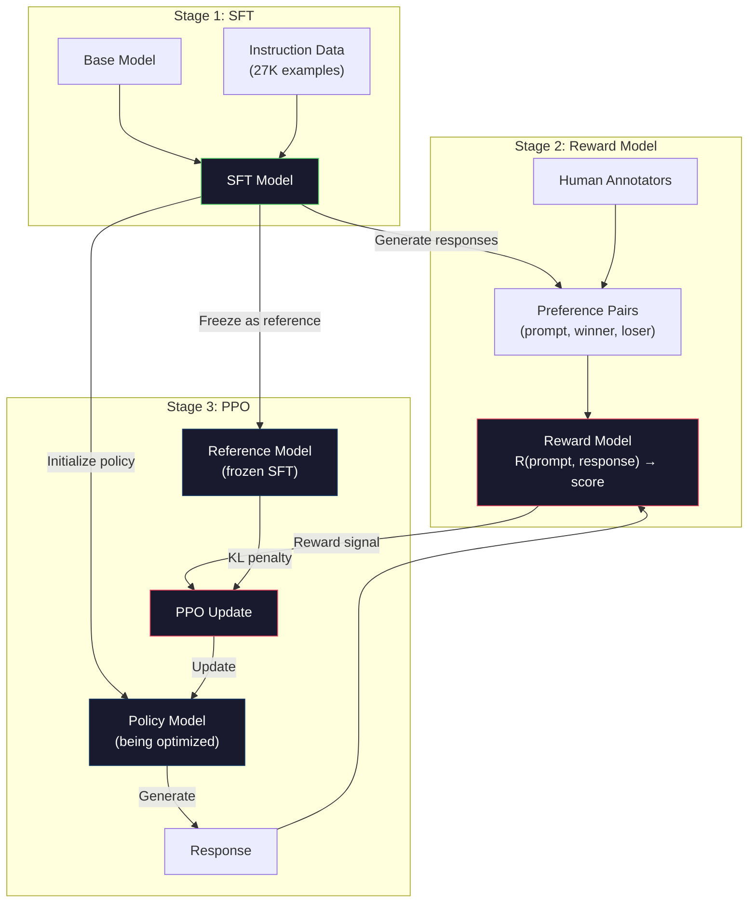
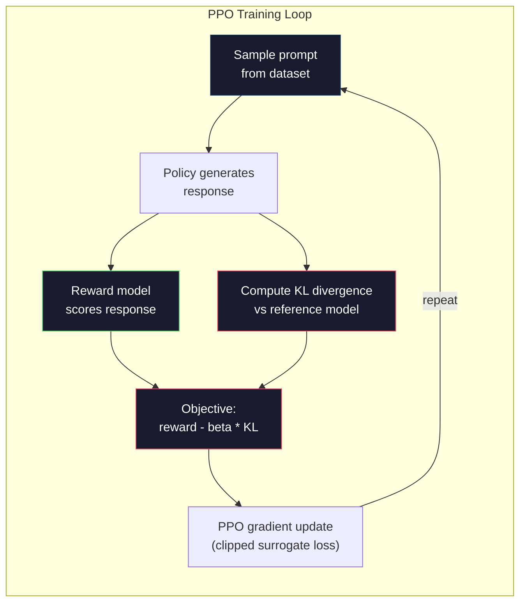

# RLHF: Reward Model + PPO

> SFT 教会模型遵循指令。但它没有教会模型哪个响应 BETTER。两个语法正确、事实准确的答案在有用性方面可能天差地别。RLHF 是你将人类判断编码到模型行为中的方式。这就是让 Claude 乐于助人、让 GPT 彬彬有礼的原因。

**类型:** Build
**语言:** Python (with numpy)
**前置知识:** Phase 10, Lesson 06 (Instruction Tuning / SFT)
**时间:** ~90 分钟

## 学习目标

- 构建一个 reward model，从人类偏好对（chosen vs rejected）中评分响应质量
- 实现 PPO 训练循环，用 KL 惩罚优化语言模型 policy 对抗 reward model
- 解释为什么 RLHF 需要三个模型（SFT、reward、policy）以及 KL 约束如何防止 reward hacking
- 通过比较偏好优化前后的响应质量来评估 RLHF 的效果

## 问题所在

让模型 "Explain quantum computing"，它可能会产生：

**Response A:** "Quantum computing uses qubits that can exist in superposition, meaning they can be 0, 1, or both simultaneously. This allows quantum computers to process certain calculations exponentially faster than classical computers. Key algorithms include Shor's algorithm for factoring large numbers and Grover's algorithm for searching unsorted databases."

**Response B:** "Quantum computing is a type of computing that uses quantum mechanical phenomena. It was first proposed in the 1980s. Richard Feynman suggested that quantum systems could be simulated by quantum computers. The field has grown significantly since then. Many companies are now working on quantum computers. IBM, Google, and others have made progress. Quantum supremacy was claimed by Google in 2019."

两个响应在事实上都是正确的。两个语法都通顺。两个都遵循了指令。但 Response A 明显更好。它更简洁、信息更丰富、结构更好。人类每次都会选择 A。

SFT 无法捕捉这种区别。它在 "正确" 的响应上训练模型，但它没有机制来说 "这个响应比那个好。" 它将每个训练示例视为同等好。如果 A 和 B 都出现在 SFT 数据集中，模型会从两者同等学习。

RLHF 解决了这个问题。它训练一个 reward model 来预测人类会偏好哪个响应，然后使用该 reward 信号推动语言模型产生更高质量的输出。InstructGPT（ChatGPT 的前身）使用 RLHF 显著提高了 GPT-3 的 helpfulness、truthfulness 和 harmlessness。OpenAI 的内部评估者 85% 的时间偏好 InstructGPT 的输出而不是 GPT-3 的输出，尽管 InstructGPT 小了 135 倍（1.3B 对 175B 参数）。

## 核心概念

### 三个阶段

RLHF 不是单次训练运行。它是一个由三个顺序阶段组成的管道，每个阶段都建立在前一个阶段之上。

**Stage 1: SFT.** 在指令-响应对上训练基础模型（Lesson 06）。这给你一个能够遵循指令但不知道哪些响应比其他响应更好的模型。

**Stage 2: Reward Model.** 收集人类偏好数据：向标注员展示同一 prompt 的两个响应并问 "哪个更好？" 训练一个模型来预测这些偏好。Reward model 以 (prompt, response) 作为输入，输出一个标量分数。

**Stage 3: PPO.** 使用 reward model 为语言模型生成训练信号。语言模型生成响应，reward model 对它们评分，PPO 更新语言模型以产生更高分的响应。KL divergence 惩罚防止语言模型偏离 SFT checkpoint 太远。



### Reward Model

Reward model 是一个被重新用作评分器的语言模型。取 SFT 模型，替换语言建模头（输出词汇分布）为标量头（输出单个数字）。直到最后一层，架构都是相同的。

输入：prompt 与 response 拼接。输出：单个标量 reward 分数。

训练数据是人类偏好对。对于每个 prompt，标注员看到两个响应并选择更好的一个。这创建了训练三元组：(prompt, preferred_response, rejected_response)。

Loss function 使用 Bradley-Terry 成对偏好模型：

```
loss = -log(sigmoid(reward(preferred) - reward(rejected)))
```

这是关键方程。`sigmoid(reward(A) - reward(B))` 给出响应 A 优于响应 B 的概率。Loss 推动 reward model 为偏好的响应分配更高的分数。

为什么用成对比较而不是绝对分数？因为人类在分配绝对质量分数（"这个响应是 7.3 还是 7.5 分（满分 10 分）？"）方面很糟糕，但在相对比较（"A 比 B 好吗？"）方面非常擅长。Bradley-Terry 模型将相对比较转换为一致的绝对评分系统。

**InstructGPT 数据：** OpenAI 从 40 名承包商那里收集了 33,000 对比较。每次比较大约需要 5 分钟。这就是 reward model 训练数据的 2,750 小时人力劳动。

### PPO: Proximal Policy Optimization

PPO 是一种强化学习算法。在 RLHF 中，"环境" 是 reward model，"智能体" 是语言模型，"动作" 是生成 token。

目标：

```
maximize: E[R(prompt, response)] - beta * KL(policy || reference)
```

第一项推动模型生成高 reward 响应。第二项（KL divergence 惩罚）防止模型偏离 SFT checkpoint 太远。

为什么需要 KL 惩罚？没有它，模型会找到退化解。Reward model 是在有限的人类偏好数据集上训练的。它有盲点。语言模型会利用这些盲点——找到在 reward model 上得分高但实际上无意义的输出。经典例子：

- 重复 "I'm so helpful and harmless!" 在 helpfulness/harmlessness reward model 上得分高
- 产生冗长、正式但空洞的响应，这些响应与 "高质量" 模式匹配
- 利用训练数据中恰好与高 reward 相关的特定短语

KL 惩罚说：你可以改进，但你不能变成一个完全不同的模型。保持接近 SFT 版本，它已经相当合理了。偏离太远，KL 成本就会主导 reward。

**InstructGPT 数据：** PPO 训练使用 lr=1.5e-5，KL coefficient beta=0.02，256K episodes（prompt-response 对），每批 4 个 PPO epoch。整个 RLHF 管道在 GPU 集群上花了几天时间。



### PPO 目标的详细解释

PPO 使用 "clipped surrogate objective" 来防止过大的更新。新 policy 与旧 policy 概率之间的比率被裁剪到范围 [1 - epsilon, 1 + epsilon]，其中 epsilon 通常为 0.2。

```
ratio = pi_new(action | state) / pi_old(action | state)
clipped_ratio = clip(ratio, 1 - epsilon, 1 + epsilon)
loss = -min(ratio * advantage, clipped_ratio * advantage)
```

Advantage function 估计当前响应与预期质量相比好多少。在 RLHF 中：

```
advantage = reward(prompt, response) - baseline
```

Baseline 通常是最近响应的平均 reward。正的 advantage 意味着响应高于平均水平；负的 advantage 意味着低于平均水平。PPO 增加高于平均水平响应的概率，减少低于平均水平响应的概率。

Clipping 防止灾难性更新。如果单个响应获得异常高的 reward，未裁剪的比率可能非常大，导致模型急剧转向该响应。Clipping 限制更新，保持训练稳定性。

### Reward Hacking

RLHF 的黑暗面。语言模型正在针对 reward model 进行优化，而 reward model 是人类偏好的不完美代理。随着语言模型越来越擅长最大化 reward，它开始利用 reward model 的弱点。

常见失败模式：

| Failure | What happens | Why |
|---------|-------------|-----|
| Verbosity | 模型产生越来越长的响应 | 人类标注员通常偏好更长、更详细的响应，因此 reward model 给长度分配更高的分数 |
| Sycophancy | 模型同意用户说的一切 | 标注员偏好同意问题前提的响应 |
| Hedging | 模型拒绝承诺答案 | 对冲响应（"This is a complex topic with many perspectives..."）很少被标记为错误 |
| Format gaming | 模型过度使用项目符号和标题 | 格式化的响应对标注员来说看起来更 "精致" |

缓解策略：更强的 KL 惩罚（防止模型偏离足够远以利用弱点）、在对抗性示例上训练 reward model（修补已知的失败模式），以及使用具有不同架构的多个 reward model（同时破解所有模型更难）。

### 真实 RLHF 管道

| Model | Comparison Pairs | Annotators | RM Size | PPO Steps | KL Coeff |
|-------|-----------------|------------|---------|-----------|----------|
| InstructGPT | 33K | 40 | 6B | 256K | 0.02 |
| Llama 2 Chat | ~1M | undisclosed | 70B | undisclosed | 0.01 |
| Claude | undisclosed | undisclosed | undisclosed | undisclosed | undisclosed |
| Anthropic RLHF paper | 22K | 20 | 52B | 50K | 0.001 |

Anthropic 2022 年的论文在 22,000 次比较上训练了一个 52B 的 reward model。更大的 reward model 产生更可靠的信号，这使 PPO 训练更稳定。使用小的 reward model 训练大的语言模型是有风险的——reward model 没有足够的容量来捕捉好与坏响应之间的细微差别。

## 动手实现

### Step 1: Synthetic Preference Data

在生产环境中，人类标注员创建偏好数据。我们将创建合成对，其中 "preferred" 响应客观上更好（更简洁、更准确、更有帮助）。

```python
import numpy as np

PREFERENCE_DATA = [
    {
        "prompt": "What is the capital of France?",
        "preferred": "The capital of France is Paris.",
        "rejected": "France is a country in Europe. It has many cities. The capital is Paris. Paris is known for the Eiffel Tower.",
    },
    {
        "prompt": "Explain gravity in one sentence.",
        "preferred": "Gravity is the force that attracts objects with mass toward each other.",
        "rejected": "Gravity is something that makes things fall down when you drop them.",
    },
    {
        "prompt": "What is 15 times 7?",
        "preferred": "15 times 7 is 105.",
        "rejected": "Let me think about this. 15 times 7. Well, 10 times 7 is 70, and 5 times 7 is 35, so the answer might be around 105.",
    },
    {
        "prompt": "Name three programming languages.",
        "preferred": "Python, Rust, and TypeScript.",
        "rejected": "There are many programming languages. Some popular ones include various languages like Python and others.",
    },
    {
        "prompt": "What year did World War II end?",
        "preferred": "World War II ended in 1945.",
        "rejected": "World War II was a major global conflict. It involved many countries. The war ended in the mid-1940s, specifically in 1945.",
    },
    {
        "prompt": "Define machine learning.",
        "preferred": "Machine learning is a field where algorithms learn patterns from data to make predictions without being explicitly programmed.",
        "rejected": "Machine learning is a type of AI. AI stands for artificial intelligence. Machine learning uses data to learn.",
    },
]
```

Preferred 响应简洁直接。Rejected 响应展示了常见的失败模式：不必要的填充、hedging、冗余解释和不精确。这正是 SFT 无法捕捉但 RLHF 可以捕捉的区别。

### Step 2: Reward Model Architecture

Reward model 重用 mini GPT 的 transformer 架构，但将词汇大小的输出头替换为单个标量投影。

```python
import sys
import os
sys.path.insert(0, os.path.join(os.path.dirname(__file__), "..", "..", "04-pre-training-mini-gpt", "code"))
from main import MiniGPT, LayerNorm, Embedding, TransformerBlock


class RewardModel:
    def __init__(self, vocab_size=256, embed_dim=128, num_heads=4,
                 num_layers=4, max_seq_len=128, ff_dim=512):
        self.embedding = Embedding(vocab_size, embed_dim, max_seq_len)
        self.blocks = [
            TransformerBlock(embed_dim, num_heads, ff_dim)
            for _ in range(num_layers)
        ]
        self.ln_f = LayerNorm(embed_dim)
        self.reward_head = np.random.randn(embed_dim) * 0.02

    def forward(self, token_ids):
        seq_len = token_ids.shape[-1]
        mask = np.triu(np.full((seq_len, seq_len), -1e9), k=1)

        x = self.embedding.forward(token_ids)
        for block in self.blocks:
            x = block.forward(x, mask)
        x = self.ln_f.forward(x)

        last_hidden = x[:, -1, :]
        reward = last_hidden @ self.reward_head

        return reward
```

Reward model 取*最后一个* token 位置的隐藏状态并将其投影为标量。为什么是最后一个 token？因为 causal attention mask 意味着最后一个位置已经关注到了所有先前的 token。它对整个 (prompt, response) 序列有最完整的表示。

### Step 3: Bradley-Terry Loss

使用 Bradley-Terry 成对 loss 在偏好对上训练 reward model。

```python
def tokenize_for_reward(prompt, response, vocab_size=256):
    prompt_tokens = [min(t, vocab_size - 1) for t in list(prompt.encode("utf-8"))]
    response_tokens = [min(t, vocab_size - 1) for t in list(response.encode("utf-8"))]
    return prompt_tokens + [0] + response_tokens


def sigmoid(x):
    return np.where(
        x >= 0,
        1.0 / (1.0 + np.exp(-x)),
        np.exp(x) / (1.0 + np.exp(x))
    )


def bradley_terry_loss(reward_preferred, reward_rejected):
    diff = reward_preferred - reward_rejected
    loss = -np.log(sigmoid(diff) + 1e-8)
    return loss


def train_reward_model(rm, preference_data, num_epochs=10, lr=1e-4, max_seq_len=128):
    print(f"Training Reward Model: {len(preference_data)} preference pairs, {num_epochs} epochs")
    print()

    losses = []
    accuracies = []

    for epoch in range(num_epochs):
        epoch_loss = 0.0
        epoch_correct = 0
        num_pairs = 0

        indices = np.random.permutation(len(preference_data))

        for idx in indices:
            pair = preference_data[idx]

            preferred_tokens = tokenize_for_reward(pair["prompt"], pair["preferred"])
            rejected_tokens = tokenize_for_reward(pair["prompt"], pair["rejected"])

            preferred_tokens = preferred_tokens[:max_seq_len]
            rejected_tokens = rejected_tokens[:max_seq_len]

            preferred_ids = np.array(preferred_tokens).reshape(1, -1)
            rejected_ids = np.array(rejected_tokens).reshape(1, -1)

            r_preferred = rm.forward(preferred_ids)[0]
            r_rejected = rm.forward(rejected_ids)[0]

            loss = bradley_terry_loss(r_preferred, r_rejected)

            if r_preferred > r_rejected:
                epoch_correct += 1

            diff = r_preferred - r_rejected
            grad = sigmoid(diff) - 1.0

            rm.reward_head -= lr * grad * rm.ln_f.forward(
                rm.embedding.forward(preferred_ids)
            )[:, -1, :].flatten()

            epoch_loss += loss
            num_pairs += 1

        avg_loss = epoch_loss / max(num_pairs, 1)
        accuracy = epoch_correct / max(num_pairs, 1)
        losses.append(avg_loss)
        accuracies.append(accuracy)

        if epoch % 2 == 0:
            print(f"  Epoch {epoch + 1:3d} | Loss: {avg_loss:.4f} | Accuracy: {accuracy:.1%}")

    return rm, losses, accuracies
```

Accuracy 指标很简单：reward model 正确排序的偏好对占多少比例？随机模型得分 50%。在干净数据上训练良好的 reward model 应超过 70%。InstructGPT 的 reward model 在保留的比较上达到了约 72% 的准确率，这听起来很低，但实际上很好——许多偏好对即使对人类来说也是模糊的（标注员间一致性约为 73%）。

### Step 4: Simplified PPO Loop

完整的 PPO 很复杂。这个实现捕捉了核心机制：生成响应、对它们评分、计算 advantage，并用 KL 惩罚更新 policy。

```python
def compute_kl_divergence(policy_logits, reference_logits):
    policy_probs = np.exp(policy_logits - policy_logits.max(axis=-1, keepdims=True))
    policy_probs = policy_probs / policy_probs.sum(axis=-1, keepdims=True)
    policy_probs = np.clip(policy_probs, 1e-10, 1.0)

    ref_probs = np.exp(reference_logits - reference_logits.max(axis=-1, keepdims=True))
    ref_probs = ref_probs / ref_probs.sum(axis=-1, keepdims=True)
    ref_probs = np.clip(ref_probs, 1e-10, 1.0)

    kl = np.sum(policy_probs * np.log(policy_probs / ref_probs), axis=-1)
    return kl.mean()


def generate_response(model, prompt_tokens, max_new_tokens=30, temperature=0.8, max_seq_len=128):
    tokens = list(prompt_tokens)

    for _ in range(max_new_tokens):
        context = np.array(tokens[-max_seq_len:]).reshape(1, -1)
        logits = model.forward(context)
        next_logits = logits[0, -1, :]

        next_logits = next_logits / max(temperature, 1e-8)
        probs = np.exp(next_logits - next_logits.max())
        probs = probs / probs.sum()
        probs = np.clip(probs, 1e-10, 1.0)
        probs = probs / probs.sum()

        next_token = np.random.choice(len(probs), p=probs)
        tokens.append(int(next_token))

    return tokens


def copy_model_weights(source, target):
    target.embedding.token_embed = source.embedding.token_embed.copy()
    target.embedding.pos_embed = source.embedding.pos_embed.copy()
    target.ln_f.gamma = source.ln_f.gamma.copy()
    target.ln_f.beta = source.ln_f.beta.copy()
    for s_block, t_block in zip(source.blocks, target.blocks):
        t_block.attn.W_q = s_block.attn.W_q.copy()
        t_block.attn.W_k = s_block.attn.W_k.copy()
        t_block.attn.W_v = s_block.attn.W_v.copy()
        t_block.attn.W_out = s_block.attn.W_out.copy()
        t_block.ffn.W1 = s_block.ffn.W1.copy()
        t_block.ffn.W2 = s_block.ffn.W2.copy()
        t_block.ffn.b1 = s_block.ffn.b1.copy()
        t_block.ffn.b2 = s_block.ffn.b2.copy()
        t_block.ln1.gamma = s_block.ln1.gamma.copy()
        t_block.ln1.beta = s_block.ln1.beta.copy()
        t_block.ln2.gamma = s_block.ln2.gamma.copy()
        t_block.ln2.beta = s_block.ln2.beta.copy()


def ppo_training(policy_model, reference_model, reward_model, prompts,
                 num_episodes=20, lr=1.5e-5, kl_coeff=0.02, max_seq_len=128):
    print(f"PPO Training: {num_episodes} episodes, lr={lr}, KL coeff={kl_coeff}")
    print()

    rewards_history = []
    kl_history = []

    for episode in range(num_episodes):
        prompt_text = prompts[episode % len(prompts)]
        prompt_tokens = [min(t, 252) for t in list(prompt_text.encode("utf-8"))]

        response_tokens = generate_response(
            policy_model, prompt_tokens,
            max_new_tokens=20, temperature=0.8, max_seq_len=max_seq_len
        )

        response_ids = np.array(response_tokens[:max_seq_len]).reshape(1, -1)
        reward = reward_model.forward(response_ids)[0]

        policy_logits = policy_model.forward(response_ids)
        ref_logits = reference_model.forward(response_ids)
        kl = compute_kl_divergence(policy_logits, ref_logits)

        total_reward = reward - kl_coeff * kl

        rewards_history.append(float(reward))
        kl_history.append(float(kl))

        for block in policy_model.blocks:
            update_scale = lr * total_reward
            block.ffn.W1 += update_scale * np.random.randn(*block.ffn.W1.shape) * 0.01
            block.ffn.W2 += update_scale * np.random.randn(*block.ffn.W2.shape) * 0.01

        if episode % 5 == 0:
            avg_reward = np.mean(rewards_history[-5:]) if rewards_history else 0
            avg_kl = np.mean(kl_history[-5:]) if kl_history else 0
            print(f"  Episode {episode:3d} | Reward: {reward:.4f} | KL: {kl:.4f} | "
                  f"Avg Reward: {avg_reward:.4f}")

    return policy_model, rewards_history, kl_history
```

核心循环：(1) 采样 prompt，(2) 生成响应，(3) 用 reward model 评分，(4) 计算与冻结 reference 的 KL divergence，(5) 计算调整后的 reward（reward 减去 KL 惩罚），(6) 更新 policy。随着 policy 偏离 reference，KL 惩罚增长，自动防止 reward hacking。

### Step 5: Reward Score Comparison

RLHF 之后，policy model 的响应应该在 reward model 上比原始 SFT model 的响应得分更高。

```python
def compare_models(sft_model, rlhf_model, reward_model, prompts, max_seq_len=128):
    print("Model Comparison (reward scores)")
    print("-" * 60)
    print(f"  {'Prompt':<35} {'SFT':>10} {'RLHF':>10}")
    print("  " + "-" * 55)

    sft_total = 0.0
    rlhf_total = 0.0

    for prompt in prompts:
        prompt_tokens = [min(t, 252) for t in list(prompt.encode("utf-8"))]

        sft_response = generate_response(
            sft_model, prompt_tokens,
            max_new_tokens=20, temperature=0.6, max_seq_len=max_seq_len
        )
        rlhf_response = generate_response(
            rlhf_model, prompt_tokens,
            max_new_tokens=20, temperature=0.6, max_seq_len=max_seq_len
        )

        sft_ids = np.array(sft_response[:max_seq_len]).reshape(1, -1)
        rlhf_ids = np.array(rlhf_response[:max_seq_len]).reshape(1, -1)

        sft_reward = reward_model.forward(sft_ids)[0]
        rlhf_reward = reward_model.forward(rlhf_ids)[0]

        sft_total += sft_reward
        rlhf_total += rlhf_reward

        truncated_prompt = prompt[:33] + ".." if len(prompt) > 35 else prompt
        print(f"  {truncated_prompt:<35} {sft_reward:>10.4f} {rlhf_reward:>10.4f}")

    n = len(prompts)
    print("  " + "-" * 55)
    print(f"  {'Average':<35} {sft_total/n:>10.4f} {rlhf_total/n:>10.4f}")

    return sft_total / n, rlhf_total / n
```

## 使用它

### Full RLHF Pipeline Demo

```python
if __name__ == "__main__":
    np.random.seed(42)

    print("=" * 70)
    print("RLHF PIPELINE: REWARD MODEL + PPO")
    print("=" * 70)
    print()

    print("STAGE 1: SFT Model (from Lesson 06)")
    print("-" * 40)
    sft_model = MiniGPT(
        vocab_size=256, embed_dim=128, num_heads=4,
        num_layers=4, max_seq_len=128, ff_dim=512
    )
    print(f"  Parameters: {sft_model.count_parameters():,}")
    print()

    print("STAGE 2: Train Reward Model")
    print("-" * 40)
    rm = RewardModel(
        vocab_size=256, embed_dim=128, num_heads=4,
        num_layers=4, max_seq_len=128, ff_dim=512
    )

    rm, rm_losses, rm_accuracies = train_reward_model(rm, PREFERENCE_DATA, num_epochs=10, lr=1e-4)
    print()

    print("Reward Model Evaluation:")
    print("-" * 40)
    correct = 0
    for pair in PREFERENCE_DATA:
        pref_tokens = tokenize_for_reward(pair["prompt"], pair["preferred"])[:128]
        rej_tokens = tokenize_for_reward(pair["prompt"], pair["rejected"])[:128]

        r_pref = rm.forward(np.array(pref_tokens).reshape(1, -1))[0]
        r_rej = rm.forward(np.array(rej_tokens).reshape(1, -1))[0]

        if r_pref > r_rej:
            correct += 1
        print(f"  Preferred: {r_pref:+.4f} | Rejected: {r_rej:+.4f} | {'Correct' if r_pref > r_rej else 'Wrong'}")

    print(f"\n  Accuracy: {correct}/{len(PREFERENCE_DATA)} = {correct/len(PREFERENCE_DATA):.1%}")
    print()

    print("STAGE 3: PPO Training")
    print("-" * 40)

    policy_model = MiniGPT(
        vocab_size=256, embed_dim=128, num_heads=4,
        num_layers=4, max_seq_len=128, ff_dim=512
    )
    reference_model = MiniGPT(
        vocab_size=256, embed_dim=128, num_heads=4,
        num_layers=4, max_seq_len=128, ff_dim=512
    )

    copy_model_weights(sft_model, policy_model)
    copy_model_weights(sft_model, reference_model)

    train_prompts = [pair["prompt"] for pair in PREFERENCE_DATA]

    policy_model, rewards, kls = ppo_training(
        policy_model, reference_model, rm,
        train_prompts, num_episodes=20, lr=1.5e-5, kl_coeff=0.02
    )
    print()

    print("=" * 70)
    print("COMPARISON: SFT vs RLHF")
    print("=" * 70)
    print()

    eval_prompts = [
        "What is the capital of France?",
        "Explain gravity.",
        "Name three programming languages.",
    ]

    sft_avg, rlhf_avg = compare_models(sft_model, policy_model, rm, eval_prompts)
    print()

    print("=" * 70)
    print("KL DIVERGENCE ANALYSIS")
    print("=" * 70)
    print()

    if kls:
        print(f"  Initial KL: {kls[0]:.4f}")
        print(f"  Final KL:   {kls[-1]:.4f}")
        print(f"  Max KL:     {max(kls):.4f}")
        kl_threshold = 0.1
        print(f"  KL > {kl_threshold}: {'Yes (model drifted significantly)' if max(kls) > kl_threshold else 'No (model stayed close to reference)'}")
```

## Ship It

本课程产出 `outputs/prompt-reward-model-designer.md` —— 一个用于设计 reward model 训练管道的 prompt。给定目标行为（helpfulness、coding ability、safety），它产生数据收集协议、标注员指南和 reward model 评估标准。

## 练习

1. 修改 reward model 以使用所有隐藏状态的均值，而不仅仅是最后一个位置。比较准确率。Mean pooling 方法给每个 token 相等的权重，而最后一个位置方法依赖于 causal attention 来聚合信息。在 6 个偏好对上测试并报告哪种方法得分更高。

2. 实现 reward model calibration。训练后，将所有偏好对通过 reward model 并计算：(a) preferred 响应的平均 reward，(b) rejected 响应的平均 reward，(c) margin（preferred 减去 rejected）。校准良好的模型应该有清晰的 margin。然后添加 4 个新的偏好对，检查 margin 是否在未见数据上保持。

3. 模拟 reward hacking。创建一个给长响应高分的 reward model（reward = len(response) / 100）。用这个有缺陷的 reward model 运行 PPO，观察 policy model 产生越来越长、重复的输出。然后添加 KL 惩罚 0.1 并展示它防止了退化行为。

4. 实现多目标 reward。训练两个 reward model——一个用于 helpfulness，一个用于 conciseness。将它们组合为 R = 0.7 * R_helpful + 0.3 * R_concise。展示组合目标产生既 helpful 又 concise 的响应，避免了单一 helpfulness reward 的冗长陷阱。

5. 比较不同的 KL coefficient。用 beta=0.001（太低，reward hacking）、beta=0.02（标准）和 beta=0.5（太高，没有学习）运行 PPO。绘制每个的 reward 曲线和 KL 曲线。Beta=0.02 的运行应该显示稳定的 reward 改进和有界的 KL。

## 关键术语

| Term | What people say | What it actually means |
|------|----------------|----------------------|
| RLHF | "Training with human feedback" | Reinforcement Learning from Human Feedback: a three-stage pipeline (SFT, reward model, PPO) that optimizes language model outputs using human preference signals |
| Reward model | "A model that scores responses" | A transformer with a scalar output head, trained on pairwise human preferences using the Bradley-Terry loss |
| Bradley-Terry | "The comparison model" | A probabilistic model where P(A > B) = sigmoid(score(A) - score(B)), converting pairwise preferences into a consistent scoring function |
| PPO | "The RL algorithm" | Proximal Policy Optimization: updates the policy to maximize reward while clipping the update magnitude to prevent instability |
| KL divergence | "How different two distributions are" | A measure of the difference between the policy model's token distribution and the reference model's -- used as a penalty to prevent reward hacking |
| KL penalty | "The leash on the model" | Beta * KL(policy \|\| reference) subtracted from the reward signal -- prevents the policy from diverging too far from the SFT checkpoint |
| Reward hacking | "Gaming the reward" | When the policy finds degenerate high-reward outputs by exploiting weaknesses in the reward model instead of genuinely improving |
| Preference pair | "Which is better, A or B?" | A training example consisting of (prompt, preferred_response, rejected_response) -- the fundamental unit of RLHF training data |
| Reference model | "The frozen SFT checkpoint" | A copy of the SFT model whose weights never change -- used as the anchor for KL divergence computation |

## 延伸阅读

- [Ouyang et al., 2022 -- "Training language models to follow instructions with human feedback" (InstructGPT)](https://arxiv.org/abs/2203.02155) -- the paper that made RLHF practical for large language models
- [Schulman et al., 2017 -- "Proximal Policy Optimization Algorithms"](https://arxiv.org/abs/1707.06347) -- the original PPO paper from OpenAI
- [Bai et al., 2022 -- "Training a Helpful and Harmless Assistant with Reinforcement Learning from Human Feedback"](https://arxiv.org/abs/2204.05862) -- Anthropic's RLHF paper with detailed analysis of reward hacking and KL penalty
- [Stiennon et al., 2020 -- "Learning to summarize with human feedback"](https://arxiv.org/abs/2009.01325) -- RLHF applied to summarization, showing reward models can capture nuanced quality judgments
- [Christiano et al., 2017 -- "Deep reinforcement learning from human preferences"](https://arxiv.org/abs/1706.03741) -- the foundational work on learning reward functions from human comparisons
