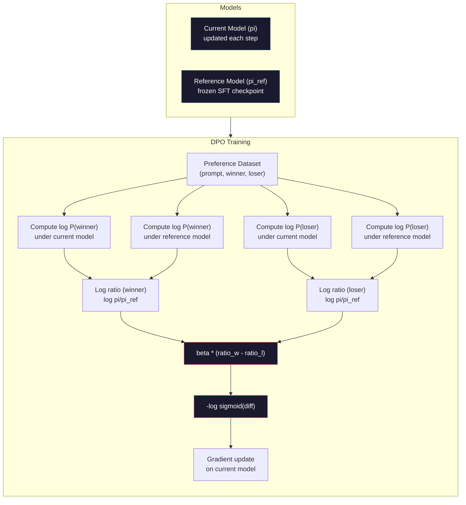

# DPO: Direct Preference Optimization

> RLHF 有效。但它也需要训练三个模型（SFT、reward model、policy），管理 PPO 的不稳定性，并调整 KL 惩罚。DPO 问：如果你能跳过所有这些呢？DPO 直接在偏好对上优化语言模型。没有 reward model。没有 PPO。一个训练循环。相同的结果。

**类型:** Build
**语言:** Python (with numpy)
**前置知识:** Phase 10, Lesson 07 (RLHF)
**时间:** ~90 分钟

## 学习目标

- 实现 DPO 训练，直接在偏好对上优化语言模型，无需单独的 reward model
- 推导 DPO loss function 并解释它如何通过 policy 的 log probabilities 隐式表示 reward model
- 从训练稳定性、计算成本和所需模型数量方面比较 DPO 与 RLHF
- 调整 beta 参数以控制训练后的 policy 与 reference model 的偏离程度

## 问题所在

你在 Lesson 07 中构建了一个 RLHF 管道。三个阶段。三个模型。SFT 模型、reward model 和用 PPO 优化的 policy model。Reward model 本身需要数千个人类偏好对和单独的训练循环。PPO 需要仔细调整 KL coefficient、learning rate、clip ratio 和 epoch 数量。

在实践中，PPO 训练 notoriously 不稳定。小的 hyperparameter 变化会导致训练发散。Reward model 是人类偏好的不完美代理，policy 会找到利用其弱点的方法。KL 惩罚有帮助，但需要自己的调整——太低会得到 reward hacking，太高模型几乎学不到东西。

这种复杂性就是为什么大多数开源模型在 InstructGPT 发布后的多年里仍在与 RLHF 作斗争。三阶段管道很脆弱。每个阶段都有自己的失败模式，错误会累积。

2023 年 5 月，斯坦福大学的 Rafael Rafailov、Archit Sharma 及其同事发表了 "Direct Preference Optimization: Your Language Model is Secretly a Reward Model"。关键洞察：你不需要单独的 reward model。最优 reward function 在数学上由语言模型自身的 token probabilities 决定。你可以完全跳过 reward model，直接在偏好对上优化语言模型。

DPO 将 RLHF 简化为单个监督学习步骤。一个模型。一个 loss function。一个训练循环。没有强化学习。Zephyr-7B 是最早大规模使用 DPO 的模型之一，在多个 benchmark 上匹配或击败了用完整 RLHF 训练的模型。Meta 将 DPO 作为 Llama 3 对齐管道的一部分。Anthropic 在其对齐研究中引用了 DPO 风格的方法。

## 核心概念

### 关键洞察

RLHF 优化这个目标：

```
maximize: E[R(x, y)] - beta * KL(pi || pi_ref)
```

其中 R 是 reward model，pi 是 policy，pi_ref 是 reference model，beta 是 KL coefficient。

DPO 论文表明这个目标有一个 closed-form 最优解。对于任何 reward function R，最优 policy 是：

```
pi*(y | x) = pi_ref(y | x) * exp(R(x, y) / beta) / Z(x)
```

其中 Z(x) 是归一化常数。重新排列：

```
R(x, y) = beta * log(pi*(y | x) / pi_ref(y | x)) + beta * log Z(x)
```

这是突破。Reward 完全用 policy model 的概率和 reference model 的概率来表示。你不需要训练单独的 reward model。Reward 是*隐式*存在于概率比率中的。

将此代入 Bradley-Terry 偏好模型：

```
P(y_w > y_l | x) = sigmoid(R(x, y_w) - R(x, y_l))
                  = sigmoid(beta * (log pi(y_w|x)/pi_ref(y_w|x) - log pi(y_l|x)/pi_ref(y_l|x)))
```

Z(x) 项被抵消了，因为两个响应都基于相同的 prompt x。剩下的只是 policy model 的 log-probabilities 和 reference model 的 log-probabilities 在 preferred 和 rejected 响应上的函数。

### DPO Loss

```
L_DPO = -log(sigmoid(beta * (log pi(y_w|x)/pi_ref(y_w|x) - log pi(y_l|x)/pi_ref(y_l|x))))
```

让我们分解每一部分：

- **y_w** = preferred (winning) 响应
- **y_l** = rejected (losing) 响应
- **x** = prompt
- **pi** = 当前模型（正在训练）
- **pi_ref** = reference model（冻结的 SFT checkpoint）
- **beta** = 温度参数，控制与 reference 的偏离（通常为 0.1 到 0.5）

比率 `log pi(y|x) / pi_ref(y|x)` 是 log-probability ratio。当这个比率为正时，当前模型比 reference 赋予响应 y 更高的概率。为负时，当前模型赋予更低的概率。

DPO loss 推动模型增加 preferred 响应的 log-probability ratio，减少 rejected 响应的 ratio。Beta 参数控制模型与 reference 的偏离程度——小的 beta 意味着允许大的偏离，大的 beta 使模型保持接近 reference。



### 为什么 DPO 更简单

| 方面 | RLHF (PPO) | DPO |
|--------|-----------|-----|
| 需要训练的模型 | 3 (SFT + reward + policy) | 1 (仅 policy) |
| 训练循环 | 3 (SFT, RM training, PPO) | 2 (SFT, DPO) |
| 超参数 | lr, KL coeff, clip ratio, RM lr, epochs x3 | lr, beta, epochs |
| Reward model | 需要（单独训练） | 隐式存在于模型概率中 |
| RL 算法 | PPO（复杂，不稳定） | 监督学习（稳定） |
| GPU 内存 | PPO 期间内存中有 3-4 个模型 | 2 个模型（当前 + reference） |
| 训练稳定性 | 对超参数敏感 | 稳健，类似于 SFT |

DPO 在训练期间需要内存中有两个模型——当前模型和冻结的 reference。RLHF 需要三个或四个：policy、reference、reward model，以及可选的 value function baseline。对于 70B 模型，每个副本在 FP16 中占用 140GB。消除 reward model 带来的内存节省是显著的。

### DPO 何时优于 RLHF

**小数据集。** 有 5,000-20,000 个偏好对时，DPO 通常匹配或超过 RLHF。RLHF 中的 reward model 需要足够的数据来泛化——数据有限时，它会 overfitting 并产生不可靠的 reward 信号。DPO 通过根本不需要 reward model 来绕过这个问题。

**有限的计算。** DPO 需要大约完整 RLHF 三分之一的计算（一个训练循环而不是三个）。对于没有大型 GPU 集群的团队来说，这是实际的选择。

**快速迭代。** 想尝试 10 个不同的偏好数据集来看哪个产生最好的模型？DPO 让你在几小时内运行每个实验。RLHF 需要为每个数据集重新训练 reward model。

### RLHF 何时优于 DPO

**大规模训练。** 在 GPT-4 或 Claude 的规模下，RLHF 的单独 reward model 可以捕捉更细微的偏好信号。Reward model 充当一个 learned loss function，适应复杂的质量标准。

**复杂的 reward 信号。** 当 "更好" 涉及多个维度（helpfulness、harmlessness、honesty）时，reward model 可以学习这种多目标权衡。DPO 将每个偏好对视为二元信号——一个更好，一个更差——而不建模为什么。

**迭代对齐。** RLHF 管道可以用当前 policy 生成新响应，让人类对它们评分，并在在线循环中重新训练 reward model。DPO 在固定的偏好对数据集上工作。Constitutional AI（Anthropic 的方法）广泛使用了 RLHF 的这种迭代特性。

### DPO 之外：KTO、ORPO、SimPO

DPO 启发了一系列简化的对齐方法。

**KTO (Kahneman-Tversky Optimization, 2024):** 你甚至不需要成对数据。KTO 使用 unpaired feedback——只需将每个响应标记为 "good" 或 "bad"，无需将其与替代方案比较。这大大简化了数据收集。不是向标注员展示两个响应并问 "which is better?"，而是展示一个响应并问 "is this good?" Loss function 应用 prospect theory 中的 loss aversion：坏响应的惩罚大于好响应的奖励。

**ORPO (Odds Ratio Preference Optimization, 2024):** 将 SFT 和对齐结合在单个训练步骤中。不是先做 SFT 再做 DPO，ORPO 修改 SFT loss 以包含偏好信号。Loss 有两项：preferred 响应上的标准 next-token prediction loss，加上一个 odds ratio 项，增加 preferred 和 rejected 响应概率之间的差距。一个训练循环而不是两个。

**SimPO (Simple Preference Optimization, 2024):** 完全消除 reference model。不是计算与冻结 reference 的 log-probability ratio，SimPO 使用响应的平均 log-probability（按长度归一化）作为隐式 reward。这节省了内存（不需要 reference model）并简化了训练。长度归一化防止模型偏好更短的响应。

| Method | Year | Models in Memory | Needs Pairs? | Needs Reference? | Training Loops |
|--------|------|-----------------|-------------|-----------------|----------------|
| RLHF | 2022 | 3-4 | Yes (for RM) | Yes | 3 |
| DPO | 2023 | 2 | Yes | Yes | 2 |
| KTO | 2024 | 2 | No (unpaired) | Yes | 2 |
| ORPO | 2024 | 1 | Yes | No | 1 |
| SimPO | 2024 | 1 | Yes | No | 1 |

趋势很明显：每种方法都消除了一个复杂部分。RLHF 需要 reward model 和 PPO。DPO 消除了两者。KTO 消除了成对数据。ORPO 消除了单独的 SFT 阶段。SimPO 消除了 reference model。Alignment tax——从基础模型到对齐模型所需的计算和复杂性成本——不断下降。

### 真实的 DPO 部署

**Zephyr-7B (HuggingFace, October 2023):** Mistral 7B 基础模型，在 UltraChat（200K 示例）上进行 SFT，然后在 UltraFeedback（60K 偏好对）上进行 DPO。MT-Bench 得分 6.47——当时最高的 7B 模型。作为对比，Llama 2 Chat 70B 得分 6.86，意味着 Zephyr 仅用 DPO 对齐就达到了 10 倍大小模型的 6% 以内。

**Llama 3 (Meta, April 2024):** 在初始 RLHF 阶段后使用 DPO。这种组合表明 DPO 和 RLHF 可以是互补的——RLHF 用于广泛对齐，DPO 用于有针对性的细化。

**Neural Magic / nm-chat (2024):** 将 DPO 应用于多个开源模型，始终显示在 SFT-only baseline 的对齐 benchmark 上有 5-15% 的改进。

## 动手实现

### Step 1: Preference Dataset

与 RLHF 相同的格式——(prompt, preferred, rejected) 三元组。DPO 直接消费这些数据，无需中间的 reward model。

```python
import numpy as np
import sys
import os
sys.path.insert(0, os.path.join(os.path.dirname(__file__), "..", "..", "04-pre-training-mini-gpt", "code"))
from main import MiniGPT, LayerNorm, Embedding, TransformerBlock

PREFERENCE_DATA = [
    {
        "prompt": "What is the capital of France?",
        "preferred": "The capital of France is Paris.",
        "rejected": "France is a country in Europe. It has many cities. The capital is Paris. Paris is known for the Eiffel Tower.",
    },
    {
        "prompt": "Explain gravity in one sentence.",
        "preferred": "Gravity is the force that attracts objects with mass toward each other.",
        "rejected": "Gravity is something that makes things fall down when you drop them.",
    },
    {
        "prompt": "What is 15 times 7?",
        "preferred": "15 times 7 is 105.",
        "rejected": "Let me think about this. 15 times 7. Well, 10 times 7 is 70, and 5 times 7 is 35, so the answer might be around 105.",
    },
    {
        "prompt": "Name three programming languages.",
        "preferred": "Python, Rust, and TypeScript.",
        "rejected": "There are many programming languages. Some popular ones include various languages like Python and others.",
    },
    {
        "prompt": "What year did World War II end?",
        "preferred": "World War II ended in 1945.",
        "rejected": "World War II was a major global conflict. It involved many countries. The war ended in the mid-1940s, specifically in 1945.",
    },
    {
        "prompt": "Define machine learning.",
        "preferred": "Machine learning is a field where algorithms learn patterns from data to make predictions without being explicitly programmed.",
        "rejected": "Machine learning is a type of AI. AI stands for artificial intelligence. Machine learning uses data to learn.",
    },
]
```

### Step 2: Sequence Log-Probability

DPO loss 需要计算给定 prompt 的响应的总 log-probability。这意味着在完整的 (prompt + response) 序列上运行模型，并对每个响应 token 的 log-probabilities 求和。

```python
def tokenize_sequence(text, vocab_size=256):
    return [min(t, vocab_size - 1) for t in list(text.encode("utf-8"))]


def compute_sequence_log_prob(model, prompt_tokens, response_tokens, max_seq_len=128):
    full_sequence = prompt_tokens + response_tokens
    if len(full_sequence) > max_seq_len:
        full_sequence = full_sequence[:max_seq_len]

    if len(full_sequence) < 2:
        return 0.0

    input_ids = np.array(full_sequence[:-1]).reshape(1, -1)
    target_ids = np.array(full_sequence[1:])

    logits = model.forward(input_ids)
    logits = logits[0]

    max_logits = logits.max(axis=-1, keepdims=True)
    log_probs = logits - max_logits - np.log(
        np.exp(logits - max_logits).sum(axis=-1, keepdims=True)
    )

    prompt_len = len(prompt_tokens)
    response_start = max(0, prompt_len - 1)
    response_end = len(target_ids)

    if response_start >= response_end:
        return 0.0

    response_log_probs = log_probs[response_start:response_end, :]
    response_targets = target_ids[response_start:response_end]

    total_log_prob = 0.0
    for i, target in enumerate(response_targets):
        total_log_prob += response_log_probs[i, target]

    return total_log_prob
```

这个函数是 DPO 的主力。对于每个偏好对，它运行四次：当前模型上的 preferred 响应、当前模型上的 rejected 响应、reference 上的 preferred 响应、reference 上的 rejected 响应。每个训练示例 4 次 forward pass，而 RLHF 的生成 + reward scoring + value estimation + PPO update 需要更多。更简单、更快、更稳定。

### Step 3: The DPO Loss

论文的核心代码。一个函数。一个 loss。没有 reward model。

```python
def sigmoid(x):
    return np.where(
        x >= 0,
        1.0 / (1.0 + np.exp(-x)),
        np.exp(x) / (1.0 + np.exp(x))
    )


def dpo_loss(policy_logprob_preferred, policy_logprob_rejected,
             ref_logprob_preferred, ref_logprob_rejected, beta=0.1):
    preferred_ratio = policy_logprob_preferred - ref_logprob_preferred
    rejected_ratio = policy_logprob_rejected - ref_logprob_rejected

    logit = beta * (preferred_ratio - rejected_ratio)

    loss = -np.log(sigmoid(logit) + 1e-8)

    preferred_reward = beta * preferred_ratio
    rejected_reward = beta * rejected_ratio

    return loss, {
        "preferred_ratio": float(preferred_ratio),
        "rejected_ratio": float(rejected_ratio),
        "logit": float(logit),
        "implicit_preferred_reward": float(preferred_reward),
        "implicit_rejected_reward": float(rejected_reward),
        "reward_margin": float(preferred_reward - rejected_reward),
    }
```

`preferred_ratio` 和 `rejected_ratio` 来自 DPO 推导的 log-probability ratio。当当前模型相对于 reference 赋予 preferred 响应更高的概率，赋予 rejected 响应更低的概率时，logit 为正且 loss 低。训练信号恰好推动模型朝这个方向前进。

`implicit_preferred_reward` 和 `implicit_rejected_reward` 是 DPO loss 隐式分配的 reward。你可以提取它们来验证训练是否有效——preferred 和 rejected reward 之间的 margin 应在训练过程中增加。

### Step 4: DPO Training Loop

标准的监督训练循环。没有 PPO。没有 reward model。只有 forward pass 和梯度更新。

```python
def copy_model_weights(source, target):
    target.embedding.token_embed = source.embedding.token_embed.copy()
    target.embedding.pos_embed = source.embedding.pos_embed.copy()
    target.ln_f.gamma = source.ln_f.gamma.copy()
    target.ln_f.beta = source.ln_f.beta.copy()
    for s_block, t_block in zip(source.blocks, target.blocks):
        t_block.attn.W_q = s_block.attn.W_q.copy()
        t_block.attn.W_k = s_block.attn.W_k.copy()
        t_block.attn.W_v = s_block.attn.W_v.copy()
        t_block.attn.W_out = s_block.attn.W_out.copy()
        t_block.ffn.W1 = s_block.ffn.W1.copy()
        t_block.ffn.W2 = s_block.ffn.W2.copy()
        t_block.ffn.b1 = s_block.ffn.b1.copy()
        t_block.ffn.b2 = s_block.ffn.b2.copy()
        t_block.ln1.gamma = s_block.ln1.gamma.copy()
        t_block.ln1.beta = s_block.ln1.beta.copy()
        t_block.ln2.gamma = s_block.ln2.gamma.copy()
        t_block.ln2.beta = s_block.ln2.beta.copy()


def dpo_train(policy_model, reference_model, preference_data,
              num_epochs=5, lr=5e-6, beta=0.1, max_seq_len=128):
    print(f"DPO Training: {len(preference_data)} pairs, {num_epochs} epochs, "
          f"lr={lr}, beta={beta}")
    print()

    losses = []
    margins = []

    for epoch in range(num_epochs):
        epoch_loss = 0.0
        epoch_margin = 0.0
        num_examples = 0

        indices = np.random.permutation(len(preference_data))

        for idx in indices:
            pair = preference_data[idx]

            prompt_tokens = tokenize_sequence(pair["prompt"])
            preferred_tokens = tokenize_sequence(pair["preferred"])
            rejected_tokens = tokenize_sequence(pair["rejected"])

            pi_logprob_w = compute_sequence_log_prob(
                policy_model, prompt_tokens, preferred_tokens, max_seq_len
            )
            pi_logprob_l = compute_sequence_log_prob(
                policy_model, prompt_tokens, rejected_tokens, max_seq_len
            )
            ref_logprob_w = compute_sequence_log_prob(
                reference_model, prompt_tokens, preferred_tokens, max_seq_len
            )
            ref_logprob_l = compute_sequence_log_prob(
                reference_model, prompt_tokens, rejected_tokens, max_seq_len
            )

            loss, metrics = dpo_loss(
                pi_logprob_w, pi_logprob_l,
                ref_logprob_w, ref_logprob_l, beta
            )

            update_direction = 1.0 if metrics["logit"] < 0 else -0.1
            for block in policy_model.blocks:
                block.ffn.W1 += lr * update_direction * np.random.randn(*block.ffn.W1.shape) * 0.01
                block.ffn.W2 += lr * update_direction * np.random.randn(*block.ffn.W2.shape) * 0.01

            epoch_loss += loss
            epoch_margin += metrics["reward_margin"]
            num_examples += 1
            losses.append(float(loss))
            margins.append(metrics["reward_margin"])

        avg_loss = epoch_loss / max(num_examples, 1)
        avg_margin = epoch_margin / max(num_examples, 1)

        print(f"  Epoch {epoch + 1}/{num_epochs} | Loss: {avg_loss:.4f} | "
              f"Avg Margin: {avg_margin:.4f}")

    return policy_model, losses, margins
```

与 RLHF 相比，训练循环令人耳目一新地简单。对于每个偏好对：计算四个 log-probabilities（两个模型，两个响应），代入 DPO loss，计算梯度，更新 policy。没有生成步骤。没有 reward model inference。没有 advantage estimation。没有 clipping。

### Step 5: Compare DPO vs RLHF

测量隐式 reward margin 和 log-probability 偏移，将 DPO 与 Lesson 07 的 RLHF 模型进行比较。

```python
def evaluate_preference_accuracy(model, reference_model, preference_data, beta=0.1, max_seq_len=128):
    correct = 0
    total = 0

    for pair in preference_data:
        prompt_tokens = tokenize_sequence(pair["prompt"])
        preferred_tokens = tokenize_sequence(pair["preferred"])
        rejected_tokens = tokenize_sequence(pair["rejected"])

        pi_w = compute_sequence_log_prob(model, prompt_tokens, preferred_tokens, max_seq_len)
        pi_l = compute_sequence_log_prob(model, prompt_tokens, rejected_tokens, max_seq_len)
        ref_w = compute_sequence_log_prob(reference_model, prompt_tokens, preferred_tokens, max_seq_len)
        ref_l = compute_sequence_log_prob(reference_model, prompt_tokens, rejected_tokens, max_seq_len)

        preferred_reward = beta * (pi_w - ref_w)
        rejected_reward = beta * (pi_l - ref_l)

        if preferred_reward > rejected_reward:
            correct += 1
        total += 1

    return correct / max(total, 1)


def analyze_implicit_rewards(model, reference_model, preference_data, beta=0.1, max_seq_len=128):
    print("Implicit Reward Analysis:")
    print("-" * 65)
    print(f"  {'Prompt':<30} {'Pref Reward':>12} {'Rej Reward':>12} {'Margin':>10}")
    print("  " + "-" * 60)

    for pair in preference_data:
        prompt_tokens = tokenize_sequence(pair["prompt"])
        preferred_tokens = tokenize_sequence(pair["preferred"])
        rejected_tokens = tokenize_sequence(pair["rejected"])

        pi_w = compute_sequence_log_prob(model, prompt_tokens, preferred_tokens, max_seq_len)
        pi_l = compute_sequence_log_prob(model, prompt_tokens, rejected_tokens, max_seq_len)
        ref_w = compute_sequence_log_prob(reference_model, prompt_tokens, preferred_tokens, max_seq_len)
        ref_l = compute_sequence_log_prob(reference_model, prompt_tokens, rejected_tokens, max_seq_len)

        pref_reward = beta * (pi_w - ref_w)
        rej_reward = beta * (pi_l - ref_l)
        margin = pref_reward - rej_reward

        truncated = pair["prompt"][:28] + ".." if len(pair["prompt"]) > 30 else pair["prompt"]
        print(f"  {truncated:<30} {pref_reward:>12.4f} {rej_reward:>12.4f} {margin:>10.4f}")

    print()
```

### Step 6: Beta Sensitivity Analysis

Beta 参数是 DPO 中 RLHF KL coefficient 的等价物。它控制模型与 reference 的偏离程度。这个实验展示了它的效果。

```python
def beta_sensitivity_analysis(sft_model, preference_data, betas, max_seq_len=128):
    print("Beta Sensitivity Analysis")
    print("-" * 60)
    print(f"  {'Beta':>8} {'Final Loss':>12} {'Final Margin':>14} {'Accuracy':>10}")
    print("  " + "-" * 55)

    results = []

    for beta in betas:
        policy = MiniGPT(
            vocab_size=256, embed_dim=128, num_heads=4,
            num_layers=4, max_seq_len=max_seq_len, ff_dim=512
        )
        reference = MiniGPT(
            vocab_size=256, embed_dim=128, num_heads=4,
            num_layers=4, max_seq_len=max_seq_len, ff_dim=512
        )
        copy_model_weights(sft_model, policy)
        copy_model_weights(sft_model, reference)

        policy, losses, margins_list = dpo_train(
            policy, reference, preference_data,
            num_epochs=3, lr=5e-6, beta=beta, max_seq_len=max_seq_len
        )

        accuracy = evaluate_preference_accuracy(
            policy, reference, preference_data, beta, max_seq_len
        )

        final_loss = losses[-1] if losses else 0
        final_margin = margins_list[-1] if margins_list else 0

        print(f"  {beta:>8.3f} {final_loss:>12.4f} {final_margin:>14.4f} {accuracy:>10.1%}")
        results.append({
            "beta": beta,
            "final_loss": final_loss,
            "final_margin": final_margin,
            "accuracy": accuracy,
        })

        print()

    return results
```

小的 beta (0.01) 让模型自由偏离 reference——学习快但有退化解的风险。大的 beta (1.0) 使模型保持接近 reference——稳定但学习慢。大多数应用的 sweet spot 是 0.1 到 0.3。

## 使用它

### Full DPO Pipeline Demo

```python
if __name__ == "__main__":
    np.random.seed(42)

    print("=" * 70)
    print("DPO: DIRECT PREFERENCE OPTIMIZATION")
    print("=" * 70)
    print()

    print("STEP 1: Initialize SFT Model (from Lesson 06)")
    print("-" * 50)
    sft_model = MiniGPT(
        vocab_size=256, embed_dim=128, num_heads=4,
        num_layers=4, max_seq_len=128, ff_dim=512
    )
    print(f"  Parameters: {sft_model.count_parameters():,}")
    print()

    print("STEP 2: DPO Training")
    print("-" * 50)

    policy_model = MiniGPT(
        vocab_size=256, embed_dim=128, num_heads=4,
        num_layers=4, max_seq_len=128, ff_dim=512
    )
    reference_model = MiniGPT(
        vocab_size=256, embed_dim=128, num_heads=4,
        num_layers=4, max_seq_len=128, ff_dim=512
    )
    copy_model_weights(sft_model, policy_model)
    copy_model_weights(sft_model, reference_model)

    policy_model, losses, margins = dpo_train(
        policy_model, reference_model, PREFERENCE_DATA,
        num_epochs=5, lr=5e-6, beta=0.1
    )
    print()

    print("=" * 70)
    print("STEP 3: Evaluate")
    print("=" * 70)
    print()

    pre_accuracy = evaluate_preference_accuracy(
        sft_model, reference_model, PREFERENCE_DATA, beta=0.1
    )
    post_accuracy = evaluate_preference_accuracy(
        policy_model, reference_model, PREFERENCE_DATA, beta=0.1
    )

    print(f"  Preference accuracy (pre-DPO):  {pre_accuracy:.1%}")
    print(f"  Preference accuracy (post-DPO): {post_accuracy:.1%}")
    print()

    analyze_implicit_rewards(policy_model, reference_model, PREFERENCE_DATA, beta=0.1)

    print("=" * 70)
    print("STEP 4: Training Dynamics")
    print("=" * 70)
    print()

    if losses:
        print("  Loss curve:")
        window = max(1, len(losses) // 5)
        for i in range(0, len(losses), window):
            chunk = losses[i:i + window]
            avg = sum(chunk) / len(chunk)
            print(f"    Steps {i:3d}-{i + len(chunk) - 1:3d}: loss = {avg:.4f}")
        print()

    if margins:
        print("  Reward margin curve:")
        window = max(1, len(margins) // 5)
        for i in range(0, len(margins), window):
            chunk = margins[i:i + window]
            avg = sum(chunk) / len(chunk)
            print(f"    Steps {i:3d}-{i + len(chunk) - 1:3d}: margin = {avg:.4f}")
        print()

    print("=" * 70)
    print("STEP 5: Beta Sensitivity")
    print("=" * 70)
    print()

    beta_results = beta_sensitivity_analysis(
        sft_model, PREFERENCE_DATA, betas=[0.01, 0.1, 0.3, 1.0]
    )

    print("=" * 70)
    print("DPO vs RLHF COMPARISON")
    print("=" * 70)
    print()
    print("  DPO advantages:")
    print("    - 1 training loop (vs 3 for RLHF)")
    print("    - 2 models in memory (vs 3-4 for RLHF)")
    print("    - Supervised learning (vs RL, more stable)")
    print("    - No reward model to train or maintain")
    print()
    print("  RLHF advantages:")
    print("    - Separate reward model captures complex preferences")
    print("    - Online learning: generate, rate, retrain")
    print("    - Better for multi-objective alignment")
    print("    - Proven at largest scales (GPT-4, Claude)")
    print()
    print("  Practical guidance:")
    print("    - Start with DPO. It's simpler and often sufficient.")
    print("    - Switch to RLHF if DPO plateaus on your eval metrics.")
    print("    - Many production systems use both: RLHF first, DPO to refine.")
```

## Ship It

本课程产出 `outputs/prompt-alignment-method-selector.md` —— 一个帮助你为特定用例选择正确对齐方法（SFT、RLHF、DPO、KTO、ORPO、SimPO）的 prompt。给定你的数据可用性、计算预算和对齐目标，它推荐一种方法和训练计划。

## 练习

1. 实现 KTO (Kahneman-Tversky Optimization)。KTO 不需要成对数据——只需将每个响应标记为 "good" 或 "bad"。好响应的 loss 是 `-log(sigmoid(beta * log_ratio))`，坏响应的 loss 是 `-log(1 - sigmoid(beta * log_ratio))`，坏响应 loss 有 loss aversion 乘数（通常为 1.5x）。在相同数据上训练（将 preferred 视为 "good"，rejected 视为 "bad"，独立处理）并与 DPO 比较准确率。

2. 实现长度归一化 DPO。不是原始 log-probabilities，而是除以响应 token 数量：`normalized_logprob = total_logprob / num_tokens`。这防止模型偏好更短的响应（具有更高的总 log-prob）。比较有和没有归一化的隐式 reward margin。

3. 构建 ORPO 风格的组合 loss。在 preferred 响应上添加标准 next-token prediction loss 到 DPO loss：`L = L_sft(preferred) + alpha * L_dpo`。尝试 alpha 值为 0.1、0.5 和 1.0。组合 loss 应产生一个既遵循指令（来自 SFT 项）又偏好更好响应（来自 DPO 项）的模型，消除单独 SFT 阶段的需要。

4. 实现迭代 DPO。运行 DPO 3 个 epoch，然后从训练好的模型生成新响应，将它们与原始 preferred 响应配对作为新的偏好对，再次运行 DPO。两轮这种 "self-play" 过程。比较第 1 轮和第 2 轮后的偏好准确率，看迭代细化是否有帮助。

5. 用不同的 reference model 比较 DPO。不是使用 SFT checkpoint 作为 reference，尝试：(a) 基础模型（pre-SFT），(b) DPO epoch 1 的 checkpoint，(c) policy model 的指数移动平均。报告哪个 reference 产生最高的偏好准确率和最稳定的训练曲线。

## 关键术语

| Term | What people say | What it actually means |
|------|----------------|----------------------|
| DPO | "RLHF without RL" | Direct Preference Optimization: a supervised learning algorithm that optimizes the language model directly on preference pairs, bypassing the reward model and PPO |
| Implicit reward | "The reward is in the model" | The reward function is determined by the log-probability ratio between the policy and reference models -- no separate reward model needed |
| Beta (DPO) | "The temperature" | Controls how far the policy can deviate from the reference model -- small beta allows large deviations, large beta keeps the model close |
| Log-probability ratio | "How much the model changed" | log pi(y\|x) - log pi_ref(y\|x) -- positive means the current model assigns higher probability than the reference |
| Reference model | "The frozen checkpoint" | A copy of the SFT model whose weights never change -- serves as the anchor for computing probability ratios |
| KTO | "DPO without pairs" | Kahneman-Tversky Optimization: works with unpaired "good" or "bad" labels instead of requiring preference pairs |
| ORPO | "One-step alignment" | Odds Ratio Preference Optimization: combines SFT and alignment into a single training loop by adding a preference term to the SFT loss |
| SimPO | "No reference needed" | Simple Preference Optimization: eliminates the reference model by using length-normalized average log-probability as the implicit reward |
| Alignment tax | "The cost of making models safe" | The additional compute, data, and complexity required to go from a base model to an aligned model -- DPO reduces this significantly |

## 延伸阅读

- [Rafailov et al., 2023 -- "Direct Preference Optimization: Your Language Model is Secretly a Reward Model"](https://arxiv.org/abs/2305.18290) -- the DPO paper that simplified alignment from RLHF to supervised learning
- [Tunstall et al., 2023 -- "Zephyr: Direct Distillation of LM Alignment"](https://arxiv.org/abs/2310.16944) -- Zephyr-7B, showing DPO on UltraFeedback matches RLHF on benchmarks
- [Ethayarajh et al., 2024 -- "KTO: Model Alignment as Prospect Theoretic Optimization"](https://arxiv.org/abs/2402.01306) -- eliminating the need for paired preferences
- [Hong et al., 2024 -- "ORPO: Monolithic Preference Optimization without Reference Model"](https://arxiv.org/abs/2403.07691) -- combining SFT and alignment in one step
- [Meng et al., 2024 -- "SimPO: Simple Preference Optimization with a Reference-Free Reward"](https://arxiv.org/abs/2405.14734) -- eliminating the reference model entirely
- [Llama 3 Technical Report](https://arxiv.org/abs/2407.21783) -- Meta's alignment pipeline combining RLHF and DPO
