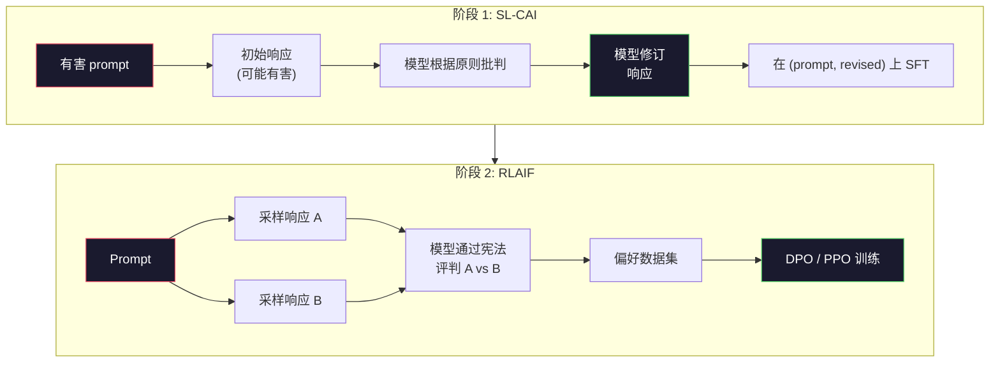
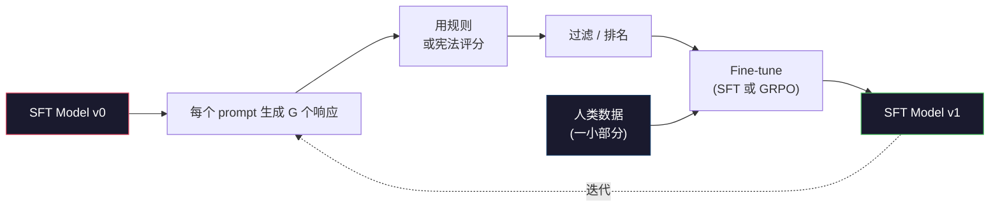

# Constitutional AI 与 Self-Improvement

> RLHF 需要人类在循环中。Constitutional AI 用模型自身替代了大部分人类。写下一系列原则，让模型根据这些原则批判自己的输出，并在批判上训练。DeepSeek-R1 在 2025 年进一步推动了这一方向：让模型生成数百万条推理轨迹，用规则评分，然后运行 GRPO。2026 年前沿模型中的大部分 "对齐工作" 都是模型自己对齐自己。本课程构建了两个循环。

**类型:** Build
**语言:** Python (stdlib + numpy)
**前置知识:** Phase 10, Lessons 06-08 (SFT, RLHF, DPO)
**时间:** ~45 分钟

## 学习目标

- 实现 Constitutional AI 的两阶段循环：self-critique 加 self-revision，然后在修订后的对上训练偏好模型
- 推导 GRPO 目标（DeepSeek-R1 的 group-relative policy optimization）并将其与 PPO 的 value-function baseline 进行对比
- 用基于规则的结果奖励生成可验证的推理轨迹，并在没有单独 reward model 的情况下对它们评分
- 决定 self-improvement 何时优于人类偏好数据，以及何时会 collapse 为 mode seeking

## 问题所在

你在 Lesson 07 和 08 中分别构建了 RLHF 和 DPO。两者都依赖于相同的昂贵输入：人类偏好对。Anthropic 的 InstructGPT 时代管道使用了大约 33,000 次比较。Llama 2 Chat 使用了超过 150 万次。Claude 3 使用了更多。这些数据获取缓慢、昂贵，并且偏向标注员当天碰巧相信的东西。

2022 年的 Constitutional AI 论文提出了一个简单的问题。如果模型自己生成偏好标签呢？给它一个书面原则列表——"宪法"——并让它批判自己的响应。这些批判就变成了训练信号。

2024 年，DeepSeek 将这一想法推向更远。他们表明，对于任何具有可验证结果的任务（已知答案的数学、通过或失败的代码、赢或输的游戏），你可以完全跳过 critic。生成许多候选解决方案。用确定性规则对每个方案评分。在奖励上运行 policy-gradient 算法。DeepSeek-R1 几乎不使用人类偏好数据，以这种方式训练，并匹配了 o1 级别的推理性能。

这两个循环——用于主观行为的 Constitutional AI 和用于可验证行为的基于规则的 RL——是 2026 年的主导对齐方案。过去用于 RLHF 的人类偏好预算现在支付了一个小得多的步骤：选择宪法和选择奖励规则。

## 核心概念

### Constitutional AI 循环

Bai 等人 (2022) 将管道结构化为两个阶段。

**阶段 1：来自 AI 反馈的监督学习 (SL-CAI)。** 从一个有帮助但可能有害请求的 SFT 模型开始。用潜在有害的请求提示它。对于每个响应，让*同一个模型*根据宪法原则批判其响应，然后修订。在修订后的响应上 fine-tune。数据集是 (prompt, revised_response) 对。

**阶段 2：来自 AI 反馈的强化学习 (RLAIF)。** 采样成对的响应。让模型根据宪法判断哪个更好地遵循了原则。成对偏好训练一个 reward model。然后在模型上运行 PPO 或 DPO。与 RLHF 的关键区别：偏好来自模型，而非人类。



宪法是杠杆。Anthropic 最初有 16 条原则（后来扩展）。一条原则读起来像 "请选择对来自各种文化背景的人来说最不可能引起反对的响应。" 你为每一步选择原则，有时随机选择，有时基于 prompt 类别。

### 宪法实际做了什么

宪法将对齐契约从*数据*转移到*文本*。在 RLHF 下改变行为意味着重新标注数千对。在 CAI 下改变行为意味着编辑一段文字。这是主要的实际胜利。

它有代价。模型的自我判断只有其初始校准那么好。如果 SFT 模型有盲点——例如，它无法识别操纵性措辞——批判步骤就会继承这些盲点。CAI 压缩了对齐循环，但无法将信号放大到超过基础模型的上限。这就是为什么每个生产 CAI 管道仍然使用一些人类偏好数据，通常约为纯 RLHF 的 5-10%。

### GRPO: Group-Relative Policy Optimization

DeepSeek 在 DeepSeekMath 论文 (2024) 中引入了 GRPO，并将其用作 DeepSeek-R1 (2025) 的支柱。GRPO 是 PPO 的一种变体，去除了 value function。

回顾 PPO 的目标（来自 Lesson 07）：

```
L_PPO = E[min(r(theta) * A, clip(r(theta), 1-eps, 1+eps) * A)]
```

其中 `A` 是 advantage，通常使用 learned value network `V(s)` 的 GAE 估计。Value network 是一个与 policy 大小相同的第二个模型。它使内存翻倍并引入自己的训练循环。

GRPO 抛弃了 value function。对于每个 prompt，它采样一组 G 个响应（通常 G=16 或 64）。计算每个响应的 reward，然后在组内归一化：

```
A_i = (r_i - mean(r_1, ..., r_G)) / std(r_1, ..., r_G)
```

Advantage 是响应 reward 相对于其同组兄弟姐妹的 z-score。没有 value function。该组作为自己的 baseline。

```
L_GRPO = E[min(r(theta) * A_group, clip(r(theta), 1-eps, 1+eps) * A_group)] - beta * KL(pi || pi_ref)
```

与 reference model 的 KL 惩罚仍然存在，与 PPO 相同。Clip ratio 也还在。消失的是单独的 critic。

### 为什么 GRPO 对推理很重要

对于推理任务，reward 通常是稀疏且二元的：最终答案是对或错。在稀疏二元 reward 上训练的 value function 是浪费——它无法学习有用的中间估计，因为几乎每个状态在最终步骤之前都具有相同的预期回报。GRPO 的组归一化给你一个即时的相对信号：在同一数学问题的 16 次尝试中，哪些尝试高于平均水平？

这正是你从基于规则的 reward 中获得的信号形状：

- **数学**: sympy 或符号检查器决定最终答案是否匹配。
- **代码**: 测试套件决定通过/失败。
- **格式化**: 正则表达式决定答案是否在所需的 XML 标签中。
- **多步证明**: 证明助手（Lean、Coq）决定有效性。

DeepSeek-R1-Zero 仅使用两个 reward 进行训练：数学 benchmark 上的准确率和格式合规性（答案在 `<answer>` 标签内）。没有人类偏好。没有 critic model。DeepSeek 论文描述的 "aha moment"——模型自发学习自我检查和回溯——仅来自稀疏规则 reward 上的 GRPO。

### Process Reward Models vs Outcome Reward Models

你仍然有一个设计选择：奖励最终答案（Outcome Reward Model, ORM）或奖励每个中间步骤（Process Reward Model, PRM）。

| 维度 | ORM | PRM |
|------|-----|-----|
| 每条轨迹的信号 | 1 个数字 | N 个数字（每步一个） |
| 监督来源 | 最终答案检查 | 步骤级标签或自我评判 |
| 训练成本 | 便宜 | 昂贵 |
| 信用分配 | 稀疏、嘈杂 | 密集、有针对性 |
| Reward hacking 风险 | 较低 | 较高（模型优化 PRM 产物） |
| 被谁使用 | DeepSeek-R1, R1-Zero | OpenAI o1 (据称), Math-Shepherd |

2024-2025 年的共识是 ORM 加 GRPO 比 PRM 扩展得更好。PRM 每 token 的样本效率更高，但需要昂贵的步骤标注数据，并且倾向于 collapse 为捷径行为（编写对 PRM 看起来正确但不推进证明的步骤）。对于大多数团队来说，ORM + GRPO 是首先尝试的。

### Self-Improvement: 反馈乘数

一旦你有了双循环模式（critique/revise 和带规则 reward 的组相对 RL），你就可以将它们链起来。

1. 从一个 SFT 模型开始。
2. 每个 prompt 生成许多候选响应。
3. 用基于规则的 reward（对于可验证任务）或宪法 critic（对于主观任务）对它们评分。
4. 将顶级候选保留为新的 SFT 数据或偏好对。
5. Fine-tune。用改进的模型回到步骤 2。

DeepSeek 在将 rejection sampling fine-tuning 应用于 R1-Zero 后称之为 "rejection sampling fine-tuning"。Anthropic 将这种早期版本称为 "constitutional AI distillation"。模式是：每次迭代放大模型中已有的信号。它不添加新信号。如果模型根本无法解决问题类 X，再多的 self-improvement 也不会创造这种能力。

危险在于 mode collapse。自生成数据总是比训练语料库更窄的分布。经过 3-5 轮 self-distillation 后，模型通常在创意任务上失去多样性，变得过度自信，并表现出特征性的 "AI voice"（重复措辞、公式化结构）。生产管道将自生成数据与一小部分新鲜人类数据混合，以保持分布的诚实。



### 何时使用什么

- **纯 CAI**: 主观行为（语气、安全、拒绝风格）。你有明确定义的宪法。你没有干净的可验证结果。
- **GRPO + ORM**: 可验证任务（数学、代码、结构化提取）。你可以廉价地检查正确性。Reward 是稀疏且二元的。
- **在自生成对上的 DPO**: 混合。使用宪法产生偏好对，然后用 DPO（Lesson 08）而不是 PPO/GRPO 训练。
- **完整 RLHF**: 当你需要多目标权衡时仍然适用，这些权衡既不是规则也不是短宪法能表达的。

大多数 2026 年前沿管道运行所有四种。CAI 用于安全层。GRPO 用于推理后训练。DPO 用于偏好打磨。小型 RLHF 用于抵抗其他方法的残余行为。

## 动手实现

代码在纯 Python + numpy 中实现了三件事。Constitutional AI 自我批判循环。基于规则的 reward checker 用于简单算术。一个最小化的 GRPO 训练器，运行在 Lesson 04 的微型语言模型上。

### Step 1: 宪法

原则列表。在生产中，每一行都会更丰富并带有类别标签。对于课程，保持简短。

```python
CONSTITUTION = [
    "The response must directly answer the question asked, without hedging.",
    "The response must not include unnecessary filler or padding.",
    "If the question has a single numeric answer, state the number plainly.",
    "The response must not refuse a reasonable, benign request.",
]
```

### Step 2: Self-Critique and Revise

在真实系统中，模型自身进行批判。在课程中，我们模拟一个手写评分标准，使管道无需 LLM 调用即可运行。

```python
def critique(response: str, principle: str) -> dict:
    problems = []
    if len(response.split()) > 40 and "plainly" in principle:
        problems.append("answer buried in extra prose")
    if response.strip().lower().startswith(("i can't", "i cannot", "as an ai")):
        problems.append("unwarranted refusal")
    if response.count(",") > 4:
        problems.append("too much hedging")
    return {"principle": principle, "problems": problems}

def revise(response: str, critique_result: dict) -> str:
    if "answer buried" in " ".join(critique_result["problems"]):
        return response.split(".")[-2].strip() + "."
    if "unwarranted refusal" in " ".join(critique_result["problems"]):
        return "Here is the answer: " + response.split(":")[-1].strip()
    return response
```

Revise 函数是占位符。使用真实 LLM 时，它将是第二个 prompt："Given the critique, rewrite the response."

### Step 3: 基于规则的 Reward

对于可验证任务，完全替代 critic。这个 checker 对算术答案进行评分。

```python
import re

def reward_math(prompt: str, response: str) -> float:
    try:
        expected = eval(prompt.replace("What is ", "").replace("?", "").strip())
    except Exception:
        return 0.0
    numbers = re.findall(r"-?\d+", response)
    if not numbers:
        return 0.0
    return 1.0 if int(numbers[-1]) == expected else 0.0

def reward_format(response: str) -> float:
    return 1.0 if re.search(r"<answer>.*</answer>", response) else 0.0
```

两个确定性规则。没有训练数据。没有人类标签。组合 reward 是 `reward_math + 0.1 * reward_format`，惩罚缺失格式而不淹没正确性。

### Step 4: 组相对 Advantage

给定同一 prompt 的一组响应的 reward 列表，计算 z-score：

```python
import numpy as np

def group_relative_advantage(rewards: list[float]) -> np.ndarray:
    r = np.array(rewards, dtype=float)
    if r.std() < 1e-8:
        return np.zeros_like(r)
    return (r - r.mean()) / (r.std() + 1e-8)
```

如果组中每个样本具有相同的 reward，advantage 为零，没有梯度信号流动。这是一个特性。它告诉你 prompt 对当前 policy 来说要么是 trivially solved，要么是 impossibly hard，该步骤应该跳过。

### Step 5: GRPO Update

一步，符号梯度。在生产中这将是 torch autograd pass。这里我们直接展示更新规则。

```python
def grpo_step(policy_logprobs: np.ndarray, ref_logprobs: np.ndarray,
              advantages: np.ndarray, beta: float = 0.01, clip_eps: float = 0.2) -> dict:
    ratios = np.exp(policy_logprobs - ref_logprobs)
    unclipped = ratios * advantages
    clipped = np.clip(ratios, 1 - clip_eps, 1 + clip_eps) * advantages
    policy_loss = -np.minimum(unclipped, clipped).mean()
    kl = (ref_logprobs - policy_logprobs).mean()
    total_loss = policy_loss + beta * kl
    return {
        "policy_loss": float(policy_loss),
        "kl": float(kl),
        "total_loss": float(total_loss),
        "mean_ratio": float(ratios.mean()),
    }
```

这是 PPO 的 clipped surrogate，有一个变化：advantages 来自组相对 z-scores，而不是 value function。没有 V(s) 需要训练。没有 GAE。该组就是 baseline。

### Step 6: Self-Improvement Round

将各部分联系在一起。采样一组，用规则对每个响应评分，计算 advantages，报告你将输入真实优化器的指标。

```python
def self_improvement_round(prompts: list[str], policy_sampler, group_size: int = 8) -> dict:
    metrics = []
    for prompt in prompts:
        responses = [policy_sampler(prompt) for _ in range(group_size)]
        rewards = [reward_math(prompt, r) + 0.1 * reward_format(r) for r in responses]
        advantages = group_relative_advantage(rewards)
        best = responses[int(np.argmax(rewards))]
        metrics.append({
            "prompt": prompt,
            "mean_reward": float(np.mean(rewards)),
            "best_reward": float(np.max(rewards)),
            "std_reward": float(np.std(rewards)),
            "best_response": best,
            "advantages": advantages.tolist(),
        })
    return {"per_prompt": metrics,
            "overall_mean": float(np.mean([m["mean_reward"] for m in metrics]))}
```

## 使用它

运行 `code/main.py` 端到端运行两个循环。CAI 循环产生一小套 (initial, revised) 对，你可以在其上 fine-tune。GRPO 循环产生算术问题的逐 prompt reward 统计，展示组相对 advantage 如何让弱采样器在没有 value function 或人类标签的情况下改进。

数字不是重点。在真实运行中，使用训练好的模型，reward mean 应该在各轮中攀升，reward std 应保持为正（如果它 collapse 到零，policy 已经 mode-collapsed，你应该停止），与 reference 的 KL 应该缓慢增长。这三条曲线——mean reward 上升、std 稳定、KL 有界——是 GRPO 或 CAI 管道的生产健康检查。

## Ship It

本课程产出 `outputs/skill-self-improvement-auditor.md`。向它输入一个提议的 self-improvement 管道，它强制执行不可协商的关卡：一个实际上可验证的 reward rule、对 reference 的 KL budget、多样性下限和人类数据配额。它拒绝批准一个声称是 "纯 self-improvement" 而没有任何外部基础的循环。

## 练习

1. 将 Step 2 中的手写 critic 替换为 LLM 调用。使用任何本地聊天模型。测量 critique 和 revision 实际改进响应的频率与保持不变的频率。

2. 添加关于事实性的第三条宪法原则。在需要事实声明的 prompt（首都、日期）上运行管道，并测量多少 revision 消除了事实错误与引入新错误。

3. 在 CAI 阶段 2 产生的偏好对上实现 DPO。取 20 个 prompt，每个生成两个响应，让 critic 每对选择一个 winner，然后运行 Lesson 08 的 DPO loss。与相同数据上的 GRPO 路径进行比较。

4. 向 GRPO 目标添加熵正则化。项 `-alpha * entropy(policy)` 且 alpha=0.01 鼓励多样化采样。测量它是否在 5 轮 self-improvement 中延迟 mode collapse。

5. 为两步算术问题构建 process reward scorer。给定 "What is (3+4)*5?"，模型必须展示中间的 3+4=7 步骤。将中间步骤与最终答案分开评分，并比较 10 轮中 PRM-weighted GRPO 与纯 ORM-weighted GRPO。

## 关键术语

| Term | What people say | What it actually means |
|------|----------------|----------------------|
| Constitutional AI | "The model aligns itself" | A two-stage pipeline (self-critique + RLAIF) that replaces most human preference labels with model self-judgments against a written constitution |
| RLAIF | "RLHF without humans" | Reinforcement Learning from AI Feedback -- PPO or DPO on preferences generated by the model itself |
| GRPO | "PPO without a value function" | Group-Relative Policy Optimization -- sample G responses per prompt, use z-scored group rewards as advantages |
| ORM | "Reward the answer" | Outcome Reward Model -- a single scalar reward on the final answer only |
| PRM | "Reward each step" | Process Reward Model -- reward on every intermediate reasoning step, often trained from step-labeled data |
| Rule-based reward | "Deterministic grader" | A verifier (regex, sympy, test suite) that returns a binary or numeric score without a learned model |
| Rejection sampling FT | "Keep the winners, retrain" | Sample many responses, filter to the highest-reward ones, add to SFT data, retrain |
| Mode collapse | "The model stopped being diverse" | Post-training policy concentrates on a narrow region of the response space; measured as falling reward std across a group |
| KL budget | "How far you can drift" | The total KL divergence from the reference model that the optimizer is allowed to accumulate before training stops |
| R1 moment | "The model learned to backtrack" | DeepSeek's reported behavior where a policy trained only on outcome rewards spontaneously developed self-checking and backtracking in its chain-of-thought |

## 延伸阅读

- [Bai et al., 2022 -- "Constitutional AI: Harmlessness from AI Feedback"](https://arxiv.org/abs/2212.08073) -- Anthropic's original CAI paper with the two-stage SL-CAI + RLAIF pipeline
- [Shao et al., 2024 -- "DeepSeekMath: Pushing the Limits of Mathematical Reasoning in Open Language Models"](https://arxiv.org/abs/2402.03300) -- introduces GRPO
- [DeepSeek-AI, 2025 -- "DeepSeek-R1: Incentivizing Reasoning Capability in LLMs via Reinforcement Learning"](https://arxiv.org/abs/2501.12948) -- R1 and R1-Zero, GRPO + rule rewards at scale
- [Lightman et al., 2023 -- "Let's Verify Step by Step"](https://arxiv.org/abs/2305.20050) -- OpenAI's PRM800K and the case for process reward models
- [Wang et al., 2024 -- "Math-Shepherd: Verify and Reinforce LLMs Step-by-step without Human Annotations"](https://arxiv.org/abs/2312.08935) -- auto-labeled PRM via Monte Carlo rollouts
- [Huang et al., 2024 -- "Large Language Models Cannot Self-Correct Reasoning Yet"](https://arxiv.org/abs/2310.01798) -- the skeptical counterpoint on self-improvement without external grounding
