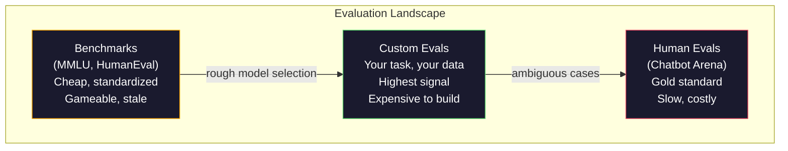
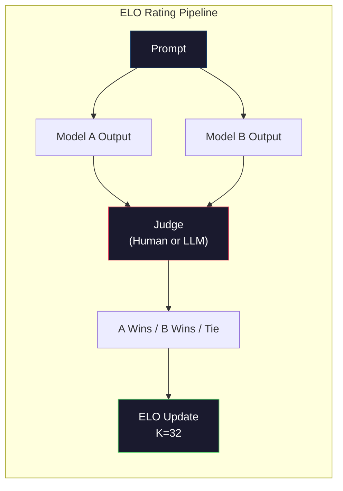

# Evaluation: Benchmarks, Evals, LM Harness

> Goodhart's Law: when a measure becomes a target, it ceases to be a good measure. Every frontier lab games benchmarks. MMLU scores go up while models still can't reliably count the number of R's in "strawberry." The only eval that matters is YOUR eval -- on YOUR task, with YOUR data.

**类型:** Build
**语言:** Python
**前置知识:** Phase 10, Lessons 01-05 (LLMs from Scratch)
**时间:** ~90 分钟

## 学习目标

- 构建一个自定义 evaluation harness，针对语言模型运行 multiple-choice 和 open-ended benchmark
- 解释为什么标准 benchmark（MMLU、HumanEval）会饱和并无法区分前沿模型
- 实现带有适当指标的 task-specific eval：exact match、F1、BLEU 和 LLM-as-judge 评分
- 设计一个针对你特定用例的自定义 evaluation suite，而不是仅依赖公共排行榜

## 问题所在

MMLU 于 2020 年发布，包含 57 个学科的 15,908 道问题。三年内，前沿模型就将其饱和了。GPT-4 得分 86.4%。Claude 3 Opus 得分 86.8%。Llama 3 405B 得分 88.6%。排行榜压缩到 3 分的范围内，差异是统计噪声，而非真正的能力差距。

与此同时，这些相同的模型在 10 岁儿童不假思索就能处理的任务上失败。Claude 3.5 Sonnet 在 MMLU 上得分 88.7%，最初却无法数出 "strawberry" 中的字母数——这项任务不需要任何世界知识，也不需要任何推理，只需要字符级迭代。HumanEval 用 164 道问题测试代码生成。模型得分 90%+，但仍会产生在初级开发者都能发现的边缘情况下崩溃的代码。

Benchmark 性能与真实可靠性之间的差距是 LLM evaluation 的核心问题。Benchmark 告诉你模型在 benchmark 上的表现。它们几乎无法告诉你该模型在你的特定任务、特定数据、特定失败模式下的表现。如果你正在构建客户支持机器人，MMLU 无关紧要。如果你正在构建代码助手，HumanEval 只覆盖函数级生成——它对跨文件的调试、重构或解释代码只字未提。

你需要自定义 eval。不是因为 benchmark 没用——它们对粗略的模型选择很有用——而是因为最终 evaluation 必须完全匹配你的部署条件。

## 核心概念

### Evaluation 全景

有三类 evaluation，每类都有不同的成本和信号质量。

**Benchmarks** 是标准化测试套件。MMLU、HumanEval、SWE-bench、MATH、ARC、HellaSwag。你针对 benchmark 运行模型并获得分数。优点：每个人都使用相同的测试，所以你可以比较模型。缺点：模型和训练数据越来越多地污染这些 benchmark。实验室在包含 benchmark 问题的数据上训练。分数上升。能力可能没有。

**Custom evals** 是为你特定用例构建的测试套件。你定义输入、预期输出和评分函数。法律文档摘要器在法律文档上进行评估。SQL 生成器在你的数据库 schema 上进行评估。这些创建起来很昂贵，但它们是唯一预测生产性能的 evaluation。

**Human evals** 使用付费标注员根据 helpfulness、correctness、fluency 和 safety 等标准评判模型输出。开放式任务的金标准，自动化评分失败时使用。Chatbot Arena 已收集超过 200 万个人类偏好投票，涵盖 100+ 模型。缺点：成本（每次判断 $0.10-$2.00）和速度（数小时到数天）。



### 为什么 Benchmark 会失效

三种机制导致 benchmark 分数停止反映真实能力。

**Data contamination.** 训练语料库抓取互联网。Benchmark 问题存在于互联网上。模型在训练期间看到了答案。这不是传统意义上的作弊——实验室没有故意包含 benchmark 数据。但网络规模的抓取几乎不可能排除。

**Teaching to the test.** 实验室为 benchmark 性能优化训练混合。如果 5% 的训练混合是 MMLU 风格的多项选择，模型就学习格式和答案分布。MMLU 是 4 选 1。模型学到答案分布大致均匀分布在 A/B/C/D 之间，这即使在模型不知道答案时也有帮助。

**Saturation.** 当每个前沿模型在 benchmark 上得分 85-90% 时，benchmark 停止区分。剩余的 10-15% 问题可能是模糊的、标记错误的，或需要晦涩的领域知识。将 MMLU 从 87% 提高到 89% 可能意味着模型多记住了两个晦涩的问题，而不是它变得更聪明了。

### Perplexity: A Quick Health Check

Perplexity 测量模型对 token 序列的惊讶程度。形式上，它是指数化的平均负对数似然：

```
PPL = exp(-1/N * sum(log P(token_i | context)))
```

Perplexity 为 10 意味着模型平均而言像在每个 token 位置均匀选择 10 个选项一样不确定。越低越好。GPT-2 在 WikiText-103 上的 perplexity 约为 ~30。GPT-3 约为 ~20。Llama 3 8B 约为 ~7。

Perplexity 对在同一测试集上比较模型很有用，但它有盲点。模型可以通过擅长预测常见模式而拥有低 perplexity，同时在罕见但重要的模式上表现糟糕。它也对指令遵循、推理或事实准确性只字未提。将其用作 sanity check，而非最终判决。

### LLM-as-Judge

使用强模型评估弱模型的输出。想法很简单：让 GPT-4o 或 Claude Sonnet 根据 correctness、helpfulness 和 safety 在 1-5 分制上评分。这每次判断花费约 $0.01（使用 GPT-4o-mini），并与人类判断有惊人的相关性——大多数任务上约 80% 的一致性。

评分 prompt 比模型更重要。模糊的 prompt（"Rate this response"）产生嘈杂的分数。带有评分标准的结构化 prompt（"如果答案事实正确并引用来源则给 5 分，如果正确但未引用来源则给 4 分，如果部分正确则给 3 分..."）产生一致、可复现的分数。

失败模式：judge 模型表现出 position bias（在成对比较中偏好第一个响应）、verbosity bias（偏好更长的响应）和 self-preference（GPT-4 给 GPT-4 输出评分高于等效的 Claude 输出）。缓解措施：随机化顺序、按长度归一化、使用与被评估模型不同的 judge。

### ELO Ratings from Pairwise Comparisons

Chatbot Arena 的方法。向人类（或 LLM judge）展示来自不同模型的同一 prompt 的两个响应。选择更好的一个。从数千次这样的比较中，计算每个模型的 ELO 评分——与象棋中使用的相同系统。

ELO 优势：相对排名比绝对评分更可靠，优雅地处理平局，并且比独立评分每个输出需要更少的比较就能收敛。截至 2026 年初，Chatbot Arena 排名显示 GPT-4o、Claude 3.5 Sonnet 和 Gemini 1.5 Pro 在顶部相差 20 个 ELO 分以内。



### Eval Frameworks

**lm-evaluation-harness** (EleutherAI): 标准开源 eval 框架。支持 200+ benchmark。用一个命令针对 MMLU、HellaSwag、ARC 等运行任何 Hugging Face 模型。被 Open LLM Leaderboard 使用。

**RAGAS**: 专门用于 RAG 管道的 evaluation 框架。测量 faithfulness（答案是否与检索到的上下文匹配？）、relevance（检索到的上下文是否与问题相关？）和 answer correctness。

**promptfoo**: 用于 prompt engineering 的 config-driven eval。在 YAML 中定义测试用例，针对多个模型运行，获得通过/失败报告。用于 prompt 的回归测试——确保 prompt 更改不会破坏现有测试用例。

### Building Custom Evals

唯一对生产重要的 eval。过程：

1. **定义任务。** 模型到底应该做什么？要精确。"Answer questions" 太模糊。"Given a customer complaint email, extract the product name, issue category, and sentiment" 是一个你可以评估的任务。

2. **创建测试用例。** 原型 eval 最少 50 个，生产 eval 200+。每个测试用例是一个 (input, expected_output) 对。包含边缘情况：空输入、对抗性输入、模糊输入、其他语言的输入。

3. **定义评分。** 结构化输出用 exact match。文本相似度用 BLEU/ROUGE。开放式质量用 LLM-as-judge。提取任务用 F1。用权重组合多个指标。

4. **自动化。** 每个 eval 用一个命令运行。没有手动步骤。以支持随时间比较结果的格式存储结果。

5. **跟踪趋势。** 孤立的 eval 分数毫无意义。你需要趋势线。上次 prompt 更改后分数提高了吗？切换模型后下降了吗？将你的 eval 与 prompt 一起版本化。

| Eval 类型 | 每次判断成本 | 与人类的一致性 | 最适合 |
|-----------|------------------|----------------------|----------|
| Exact match | ~$0 | 100%（适用时） | 结构化输出、分类 |
| BLEU/ROUGE | ~$0 | ~60% | 翻译、摘要 |
| LLM-as-judge | ~$0.01 | ~80% | 开放式生成 |
| Human eval | $0.10-$2.00 | N/A（是 ground truth） | 模糊、高风险任务 |

## 动手实现

### Step 1: A Minimal Eval Framework

定义核心抽象。Eval case 有输入、预期输出和可选的元数据字典。Scorer 接受预测和参考并返回 0 到 1 之间的分数。

```python
import json
from collections import Counter

class EvalCase:
    def __init__(self, input_text, expected, metadata=None):
        self.input_text = input_text
        self.expected = expected
        self.metadata = metadata or {}

class EvalSuite:
    def __init__(self, name, cases, scorers):
        self.name = name
        self.cases = cases
        self.scorers = scorers

    def run(self, model_fn):
        results = []
        for case in self.cases:
            prediction = model_fn(case.input_text)
            scores = {}
            for scorer_name, scorer_fn in self.scorers.items():
                scores[scorer_name] = scorer_fn(prediction, case.expected)
            results.append({
                "input": case.input_text,
                "expected": case.expected,
                "prediction": prediction,
                "scores": scores,
            })
        return results
```

### Step 2: Scoring Functions

构建 exact match、token F1 和模拟的 LLM-as-judge scorer。

```python
def exact_match(prediction, expected):
    return 1.0 if prediction.strip().lower() == expected.strip().lower() else 0.0

def token_f1(prediction, expected):
    pred_tokens = set(prediction.lower().split())
    exp_tokens = set(expected.lower().split())
    if not pred_tokens or not exp_tokens:
        return 0.0
    common = pred_tokens & exp_tokens
    precision = len(common) / len(pred_tokens)
    recall = len(common) / len(exp_tokens)
    if precision + recall == 0:
        return 0.0
    return 2 * (precision * recall) / (precision + recall)

def llm_judge_simulated(prediction, expected):
    pred_words = set(prediction.lower().split())
    exp_words = set(expected.lower().split())
    if not exp_words:
        return 0.0
    overlap = len(pred_words & exp_words) / len(exp_words)
    length_penalty = min(1.0, len(prediction) / max(len(expected), 1))
    return round(overlap * 0.7 + length_penalty * 0.3, 3)
```

### Step 3: ELO Rating System

实现成对比较的 ELO 更新。这正是 Chatbot Arena 用来排名模型的系统。

```python
class ELOTracker:
    def __init__(self, k=32, initial_rating=1500):
        self.ratings = {}
        self.k = k
        self.initial_rating = initial_rating
        self.history = []

    def _ensure_player(self, name):
        if name not in self.ratings:
            self.ratings[name] = self.initial_rating

    def expected_score(self, rating_a, rating_b):
        return 1 / (1 + 10 ** ((rating_b - rating_a) / 400))

    def record_match(self, player_a, player_b, outcome):
        self._ensure_player(player_a)
        self._ensure_player(player_b)

        ea = self.expected_score(self.ratings[player_a], self.ratings[player_b])
        eb = 1 - ea

        if outcome == "a":
            sa, sb = 1.0, 0.0
        elif outcome == "b":
            sa, sb = 0.0, 1.0
        else:
            sa, sb = 0.5, 0.5

        self.ratings[player_a] += self.k * (sa - ea)
        self.ratings[player_b] += self.k * (sb - eb)

        self.history.append({
            "a": player_a, "b": player_b,
            "outcome": outcome,
            "rating_a": round(self.ratings[player_a], 1),
            "rating_b": round(self.ratings[player_b], 1),
        })

    def leaderboard(self):
        return sorted(self.ratings.items(), key=lambda x: -x[1])
```

### Step 4: Perplexity Calculation

使用 token probabilities 计算 perplexity。在实践中你会从模型的 logits 获得这些。这里我们用概率分布模拟。

```python
import numpy as np

def perplexity(log_probs):
    if not log_probs:
        return float("inf")
    avg_neg_log_prob = -np.mean(log_probs)
    return float(np.exp(avg_neg_log_prob))

def token_log_probs_simulated(text, model_quality=0.8):
    np.random.seed(hash(text) % 2**31)
    tokens = text.split()
    log_probs = []
    for i, token in enumerate(tokens):
        base_prob = model_quality
        if len(token) > 8:
            base_prob *= 0.6
        if i == 0:
            base_prob *= 0.7
        prob = np.clip(base_prob + np.random.normal(0, 0.1), 0.01, 0.99)
        log_probs.append(float(np.log(prob)))
    return log_probs
```

### Step 5: Aggregate Results

计算 eval 运行的汇总统计：mean、median、threshold 处的通过率，以及逐指标细分。

```python
def summarize_results(results, threshold=0.8):
    all_scores = {}
    for r in results:
        for metric, score in r["scores"].items():
            all_scores.setdefault(metric, []).append(score)

    summary = {}
    for metric, scores in all_scores.items():
        arr = np.array(scores)
        summary[metric] = {
            "mean": round(float(np.mean(arr)), 3),
            "median": round(float(np.median(arr)), 3),
            "std": round(float(np.std(arr)), 3),
            "min": round(float(np.min(arr)), 3),
            "max": round(float(np.max(arr)), 3),
            "pass_rate": round(float(np.mean(arr >= threshold)), 3),
            "n": len(scores),
        }
    return summary

def print_summary(summary, suite_name="Eval"):
    print(f"\n{'=' * 60}")
    print(f"  {suite_name} Summary")
    print(f"{'=' * 60}")
    for metric, stats in summary.items():
        print(f"\n  {metric}:")
        print(f"    Mean:      {stats['mean']:.3f}")
        print(f"    Median:    {stats['median']:.3f}")
        print(f"    Std:       {stats['std']:.3f}")
        print(f"    Range:     [{stats['min']:.3f}, {stats['max']:.3f}]")
        print(f"    Pass rate: {stats['pass_rate']:.1%} (threshold >= 0.8)")
        print(f"    N:         {stats['n']}")
```

### Step 6: Run the Full Pipeline

将所有内容连接起来。定义任务，创建测试用例，模拟两个模型，运行 eval，从成对比较计算 ELO，并打印排行榜。

```python
def demo_model_good(prompt):
    responses = {
        "What is the capital of France?": "Paris",
        "What is 2 + 2?": "4",
        "Who wrote Hamlet?": "William Shakespeare",
        "What language is PyTorch written in?": "Python and C++",
        "What is the boiling point of water?": "100 degrees Celsius",
    }
    return responses.get(prompt, "I don't know")

def demo_model_bad(prompt):
    responses = {
        "What is the capital of France?": "Paris is the capital city of France",
        "What is 2 + 2?": "The answer is four",
        "Who wrote Hamlet?": "Shakespeare",
        "What language is PyTorch written in?": "Python",
        "What is the boiling point of water?": "212 Fahrenheit",
    }
    return responses.get(prompt, "Unknown")

cases = [
    EvalCase("What is the capital of France?", "Paris"),
    EvalCase("What is 2 + 2?", "4"),
    EvalCase("Who wrote Hamlet?", "William Shakespeare"),
    EvalCase("What language is PyTorch written in?", "Python and C++"),
    EvalCase("What is the boiling point of water?", "100 degrees Celsius"),
]

suite = EvalSuite(
    name="General Knowledge",
    cases=cases,
    scorers={
        "exact_match": exact_match,
        "token_f1": token_f1,
        "llm_judge": llm_judge_simulated,
    },
)

results_good = suite.run(demo_model_good)
results_bad = suite.run(demo_model_bad)

print_summary(summarize_results(results_good), "Model A (concise)")
print_summary(summarize_results(results_bad), "Model B (verbose)")
```

"好" 模型给出精确答案。"坏" 模型给出冗长的改写。Exact match 严厉惩罚冗长模型。Token F1 和 LLM-as-judge 更宽容。这说明了为什么指标选择很重要：同一个模型根据你如何评分，看起来要么很棒要么很糟糕。

### Step 7: ELO Tournament

跨多轮在模型之间运行成对比较。

```python
elo = ELOTracker(k=32)

for case in cases:
    pred_a = demo_model_good(case.input_text)
    pred_b = demo_model_bad(case.input_text)

    score_a = token_f1(pred_a, case.expected)
    score_b = token_f1(pred_b, case.expected)

    if score_a > score_b:
        outcome = "a"
    elif score_b > score_a:
        outcome = "b"
    else:
        outcome = "tie"

    elo.record_match("model_a_concise", "model_b_verbose", outcome)

print("\nELO Leaderboard:")
for name, rating in elo.leaderboard():
    print(f"  {name}: {rating:.0f}")
```

### Step 8: Perplexity Comparison

跨不同质量水平的 "模型" 比较 perplexity。

```python
test_text = "The quick brown fox jumps over the lazy dog in the garden"

for quality, label in [(0.9, "Strong model"), (0.7, "Medium model"), (0.4, "Weak model")]:
    log_probs = token_log_probs_simulated(test_text, model_quality=quality)
    ppl = perplexity(log_probs)
    print(f"  {label} (quality={quality}): perplexity = {ppl:.2f}")
```

## 使用它

### lm-evaluation-harness (EleutherAI)

在任何模型上运行 benchmark 的标准工具。

```python
# pip install lm-eval
# Command line:
# lm_eval --model hf --model_args pretrained=meta-llama/Llama-3.1-8B --tasks mmlu --batch_size 8

# Python API:
# import lm_eval
# results = lm_eval.simple_evaluate(
#     model="hf",
#     model_args="pretrained=meta-llama/Llama-3.1-8B",
#     tasks=["mmlu", "hellaswag", "arc_easy"],
#     batch_size=8,
# )
# print(results["results"])
```

### promptfoo

用于 prompt engineering 的 config-driven eval。在 YAML 中定义测试并针对多个 provider 运行。

```yaml
# promptfoo.yaml
providers:
  - openai:gpt-4o-mini
  - anthropic:claude-3-haiku

prompts:
  - "Answer in one word: {{question}}"

tests:
  - vars:
      question: "What is the capital of France?"
    assert:
      - type: contains
        value: "Paris"
  - vars:
      question: "What is 2 + 2?"
    assert:
      - type: equals
        value: "4"
```

### RAGAS for RAG evaluation

```python
# pip install ragas
# from ragas import evaluate
# from ragas.metrics import faithfulness, answer_relevancy, context_precision
#
# result = evaluate(
#     dataset,
#     metrics=[faithfulness, answer_relevancy, context_precision],
# )
# print(result)
```

RAGAS 测量通用 eval 遗漏的内容：模型的答案是否基于检索到的上下文，而不仅仅是答案在抽象意义上是否 "正确"。

## Ship It

本课程产出 `outputs/prompt-eval-designer.md` —— 一个可复用的 prompt，为任何任务设计自定义 eval suite。给它一个任务描述，它会生成测试用例、评分函数和通过/失败阈值建议。

它还产出 `outputs/skill-llm-evaluation.md` —— 一个根据你的任务类型、预算和延迟要求选择正确 evaluation 策略的决策框架。

## 练习

1. 添加一个 "consistency" scorer，将相同输入通过模型运行 5 次并测量输出匹配的频率。确定性输入上的不一致答案揭示了脆弱的 prompt 或高 temperature 设置。

2. 扩展 ELO tracker 以支持多个 judge 函数（exact match、F1、LLM-as-judge）并对它们加权。比较当你 heavily weight exact match vs heavily weight F1 时排行榜如何变化。

3. 为特定任务构建 eval suite：将电子邮件分类为 5 个类别。创建 100 个测试用例，包含多样化的示例，包括边缘情况（可能属于多个类别的电子邮件、空邮件、其他语言的邮件）。测量不同 "模型"（基于规则的、关键词匹配、模拟 LLM）的表现。

4. 实现 contamination detection：给定一组 eval 问题和训练语料库，检查多少 eval 问题（或接近的改写）出现在训练数据中。这就是研究人员审计 benchmark 有效性的方式。

5. 构建一个 "model diff" 工具。给定两个模型版本的 eval 结果，突出显示哪些特定测试用例改善了，哪些退化了，哪些保持不变。这是 eval 的代码 diff 等价物——对于理解更改是帮助还是伤害至关重要。

## 关键术语

| Term | What people say | What it actually means |
|------|----------------|----------------------|
| MMLU | "The benchmark" | Massive Multitask Language Understanding -- 15,908 multiple choice questions across 57 subjects, saturated above 88% by 2025 |
| HumanEval | "Code eval" | 164 Python function-completion problems from OpenAI, tests only isolated function generation |
| SWE-bench | "Real coding eval" | 2,294 GitHub issues from 12 Python repos, measures end-to-end bug fixing including test generation |
| Perplexity | "How confused the model is" | exp(-avg(log P(token_i given context))) -- lower means the model assigns higher probability to the actual tokens |
| ELO rating | "Chess ranking for models" | A relative skill rating computed from pairwise win/loss records, used by Chatbot Arena to rank 100+ models |
| LLM-as-judge | "Using AI to grade AI" | A strong model scores a weaker model's outputs against a rubric, ~80% agreement with human judges at ~$0.01/judgment |
| Data contamination | "The model saw the test" | Training data includes benchmark questions, inflating scores without improving real capability |
| Eval suite | "A bunch of tests" | A versioned collection of (input, expected_output, scorer) triples that measure a specific capability |
| Pass rate | "What percentage it gets right" | Fraction of eval cases scoring above a threshold -- more actionable than mean score because it measures reliability |
| Chatbot Arena | "Model ranking website" | LMSYS platform with 2M+ human preference votes, producing the most trusted LLM leaderboard via ELO ratings |

## 延伸阅读

- [Hendrycks et al., 2021 -- "Measuring Massive Multitask Language Understanding"](https://arxiv.org/abs/2009.03300) -- the MMLU paper, still the most cited LLM benchmark despite its saturation
- [Chen et al., 2021 -- "Evaluating Large Language Models Trained on Code"](https://arxiv.org/abs/2107.03374) -- the HumanEval paper from OpenAI, established code generation evaluation methodology
- [Zheng et al., 2023 -- "Judging LLM-as-a-Judge"](https://arxiv.org/abs/2306.05685) -- systematic analysis of using LLMs to evaluate LLMs, including position bias and verbosity bias findings
- [LMSYS Chatbot Arena](https://chat.lmsys.org/) -- crowdsourced model comparison platform with 2M+ votes, the most trusted real-world LLM ranking
