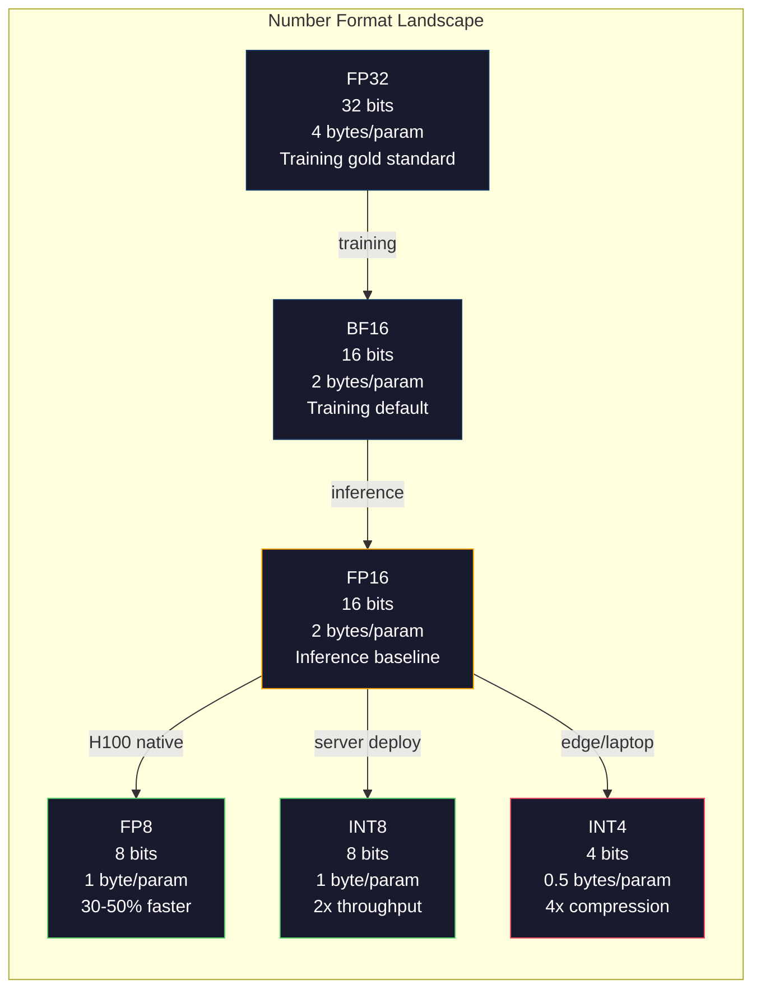
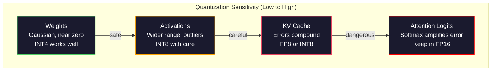
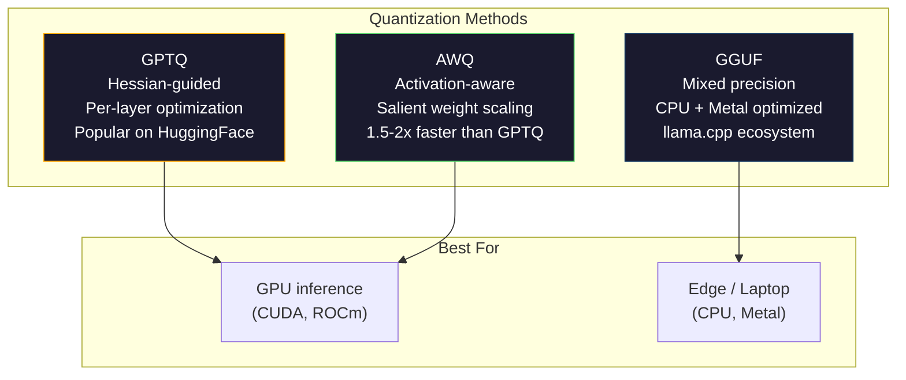

# Quantization (量化): 让模型装得下

> 一个 70B 的 FP16 模型需要 140GB 显存。光是权重就需要两块 A100。量化到 FP8：一块 80GB GPU 就能装下。INT4：MacBook 都能跑。

**Type:** Build
**Languages:** Python (with numpy)
**Prerequisites:** Phase 10, Lessons 01-10 (LLMs from Scratch)
**Time:** ~120 minutes

## Learning Objectives (学习目标)

- 实现从 FP16 到 INT8 和 INT4 的对称与非对称 quantization (量化)，包括 per-tensor 和 per-channel scaling
- 计算 quantization 带来的显存节省，并判断给定 GPU 的 VRAM 能装下哪种精度
- 解释 post-training quantization (PTQ) 与 quantization-aware training (QAT) 的区别
- 应用 GPTQ 或 AWQ 对真实模型进行量化，并在 benchmark 上测量精度-显存 tradeoff

## The Problem (问题)

Llama 3 70B 有 700 亿参数。每个参数是一个 16 位浮点数。那就是 1400 亿字节。140GB。单张 A100 只有 80GB 显存。你连权重都加载不进去，更别提做 inference (推理) 了。你需要两块 A100，每小时 2 美元一块，就为了 serve 一个模型。

但每个参数用 16 位是浪费的。神经网络中大多数权重都集中在零附近。FP16 的完整动态范围（从 0.000000059 到 65,504）几乎完全没用。如果你实际测量 Llama 3 70B 的权重分布，95% 的权重落在 -0.1 到 +0.1 之间。你却在用 16 位来表示本来 4 位就能装下的值。

Quantization 用低精度数字替换高精度数字。FP16 到 FP8 显存减半。FP16 到 INT4 显存减到四分之一。那个 140GB 的模型变成 35GB。单张消费级 GPU 就能装下。推到 2-bit quantization（激进、有损，但某些任务可用），同一个模型能在 16GB 笔记本上运行。

代价是精度。每去掉一位，信息就被破坏一点。问题是精度损失多少、损失在哪里。一个量化得好的 INT4 模型在大多数 benchmark 上保留原模型 95-99% 的质量。一个 naive 的 INT4 quantization 可能直接把模型毁掉。区别在 technique。

社区用 GPTQ 把 Llama 3 量化到 INT4，WikiText 上大约损失 1-2 个 perplexity 点。Mistral 发布了 Mixtral 8x22B 的 FP8 checkpoint，在 MMLU 上零可测质量损失。GGUF 格式驱动 llama.cpp，让 70B 模型在 M 系列芯片的 MacBook 上运行。Quantization 不是 hack。它是每个大于 7B 的模型的标准部署路径。

## The Concept (概念)

### Number Formats: 每一位的作用

每个浮点数都有三部分：sign（符号位）、exponent（指数位）和 mantissa（尾数位，也叫 significand）。sign 占 1 位。exponent 决定范围（数字能多大或多小）。mantissa 决定精度（能保留多少位小数）。

```
FP32:  [1 sign] [8 exponent] [23 mantissa]  = 32 bits
FP16:  [1 sign] [5 exponent] [10 mantissa]  = 16 bits
BF16:  [1 sign] [8 exponent] [7  mantissa]  = 16 bits
FP8:   [1 sign] [4 exponent] [3  mantissa]  = 8  bits (E4M3)
FP8:   [1 sign] [5 exponent] [2  mantissa]  = 8  bits (E5M2)
INT8:  [1 sign] [7 value]                   = 8  bits (uniform steps)
INT4:  [1 sign] [3 value]                   = 4  bits (16 levels total)
```

**FP32** 是 full precision（全精度）。23 位 mantissa 提供约 7 位十进制精度。范围：约 1.2 x 10^-38 到 3.4 x 10^38。训练过去完全在 FP32 中进行。现在 accumulation（矩阵乘法中的累加）仍然用 FP32。

**FP16** 位数减半。10 位 mantissa 提供约 3.3 位十进制精度。exponent 缩减到 5 位，范围大幅缩小（最大值约 65,504）。这对权重（集中在零附近）没问题，但对训练中可能 spike 的 activations 和 gradients 很危险。FP16 训练需要 loss scaling 来防止 underflow。

**BF16** (Brain Float 16) 保留 FP32 的 8 位 exponent，但 mantissa 缩减到 7 位。与 FP32 相同的范围，比 FP16 更少的精度。Google 专门为深度学习设计。直觉：对神经网络来说，范围比精度更重要。一个在 FP16 中 underflow 到零的 10^-20 gradient 在 BF16 中得以保留。一个在 BF16 中从 0.07342 舍入到 0.0734 的权重已经足够接近。每个现代训练 run 都使用 BF16 或 BF16/FP32 混合。

**FP8** 有两种变体。E4M3（4 位 exponent，3 位 mantissa）用于 inference 中的权重和 activations。E5M2（5 位 exponent，2 位 mantissa）用于训练中的 gradients，那里范围比精度更重要。H100 GPU 上的 FP8 inference 比 FP16 快 30-50%，质量损失可忽略。

**INT8** 是整数格式。没有 exponent，没有 mantissa。只有 256 个均匀分布的值，从 -128 到 127。你需要一个 scale factor 把浮点权重映射到这个范围。优势：整数运算比浮点更快、更省电。A100 上的 INT8 矩阵乘法达到 624 TOPS，而 FP16 是 312 TFLOPS。

**INT4** 更进一步。只有 16 个可能的值。scale factor 承担重任。质量完全取决于如何选择 scale 以及量化哪些权重。最先进的 INT4 方法（GPTQ、AWQ）保留原模型 95%+ 的质量。



### How Quantization Works (量化原理)

核心操作很简单。取一个浮点值 tensor，找到一个 scale factor，乘、四舍五入到最近整数，然后存储整数和 scale factor。

**Quantize (量化):**
```
scale = max(abs(tensor)) / max_int_value
quantized = round(tensor / scale)
```

**Dequantize (反量化):**
```
reconstructed = quantized * scale
```

对于对称范围 INT8（-127 到 127）：
```
scale = max(abs(tensor)) / 127
quantized = clamp(round(tensor / scale), -128, 127)
```

误差来自 rounding error。每个值最多偏差 `scale / 2`。一层的总误差取决于有多少权重以及模型对这些权重扰动的敏感度。

**Per-tensor vs per-channel quantization.** Per-tensor 对整个权重矩阵用一个 scale factor。简单但有损：如果一列值大、另一列值小，小值会丢失大部分精度。Per-channel 对每个输出通道（每行或每列）用一个 scale factor。更多 overhead（存储 N 个 scale factor 而不是 1 个），但质量大幅提升。每个 production quantization 方法都用 per-channel 或更细的粒度。

**Asymmetric quantization (非对称量化)** 加一个 zero-point 偏移：`quantized = round(tensor / scale) + zero_point`。这处理不以零为中心的分布。例如 ReLU activations 总是非负的。Symmetric quantization 把一半的整数范围浪费在永远不会出现的负值上。Asymmetric quantization 把实际范围 [min, max] 映射到完整的整数范围。

### Sensitivity Hierarchy (敏感度层级)

模型中不是所有东西对 quantization 的容忍度都一样。有一个清晰的层级。

**Weights (最鲁棒).** 模型权重在训练中变化缓慢，大致服从以零为中心的高斯分布。它们量化得很好。INT8 权重加 per-channel scale 几乎无损。INT4 需要更复杂的方法，但可行。

**Activations (中等敏感度).** Activations 是 inference 中流经网络的中间值。它们比权重有更宽的动态范围，并且包含 outliers。单个 attention head 可能产生比均值大 100 倍的 activation 值。这些 outliers 对模型质量至关重要。Naive 量化会毁掉信息。解决方案：把 outlier channels 保留在更高精度（LLM.int8()），使用 per-token 或 per-channel activation scales。

**KV cache (高敏感度).** KV cache 存储所有先前 token 的 attention states。在长上下文长度下，KV cache 主导显存。一个 70B 模型在 32K 上下文下，KV cache 在 FP16 中单独就占 40GB。把 KV cache 量化到 FP8 或 INT8 节省大量显存，但任何误差会在所有未来的 attention 计算中累积。质量影响随序列长度增长。

**Attention logits (最敏感).** Attention 中的 softmax 对其输入的微小变化高度敏感。Pre-softmax logit 中 0.01 的 quantization error 就可能显著偏移 attention 分布。大多数 quantization 方案即使在其他所有东西都被量化时，仍把 attention 计算保留在更高精度（FP16 或 BF16）。



### PTQ vs QAT

**Post-Training Quantization (PTQ)** 量化一个已经训练好的模型。不重新训练。你取 FP16 权重，计算 scale factor，四舍五入，然后部署。快速（分钟到小时）且便宜。对 INT8 和 FP8 效果很好。对 INT4，naive PTQ 经常失败得很惨，因为 rounding error 会累积。高级 PTQ 方法（GPTQ、AWQ）使用 calibration data 来最小化 quantization error。

**Quantization-Aware Training (QAT)** 在训练的前向传播中插入 fake quantization 操作。模型学会把权重放在 rounding error 小的位置。Gradients 通过 fake quantization 使用 straight-through estimator (STE) 流动：假装 rounding 操作的 gradient 为 1。QAT 产生的 INT4 和 INT2 模型比 PTQ 更好，但需要完整的训练 run。Google 用 QAT 做 Gemini 的高效 serving。Meta 对某些 Llama 部署目标使用 QAT。

| Aspect | PTQ | QAT |
|--------|-----|-----|
| Cost | Minutes to hours | Full training run |
| Quality at INT8 | Excellent (< 0.1% loss) | Excellent |
| Quality at INT4 | Good with GPTQ/AWQ (1-3% loss) | Better (< 1% loss) |
| Quality at INT2 | Poor | Usable for some tasks |
| Calibration data | 128-1024 examples | Full training dataset |
| When to use | Deployment, iteration | Maximum quality at low bit-width |

### GPTQ, AWQ, GGUF

**GPTQ (GPT Quantization)** 是一种 one-shot PTQ 方法。它一次量化一层，使用小的 calibration dataset（128 个 examples 是典型值）来测量 Hessian（关于每个权重对输出敏感度的二阶信息）。Hessian 认为重要的权重被更仔细地量化。GPTQ 是第一个让 INT4 quantization 对 LLM 实用的方法。TheBloke 在 Hugging Face 上通过发布数百个模型的量化版本普及了 GPTQ。

**AWQ (Activation-Aware Weight Quantization)** 观察到一小部分权重（约 1%）因为与大的 activation 值相乘而格外重要。AWQ 使用 calibration data 识别这些 salient weights，在量化前把它们放大（然后把对应的 activations 缩小）。这让重要权重保持在 INT4 quantization 准确的范围内。AWQ 通常匹配或略胜 GPTQ 质量，同时应用速度快 1.5-2 倍。

**GGUF (GPT-Generated Unified Format)** 是 llama.cpp 及其生态系统使用的文件格式。它支持 mixed quantization：不同层用不同 bit width。第一层和最后一层（embedding 和 output head）通常保留更高精度。中间层用 INT4 或 INT3。GGUF 文件是自包含的：权重、tokenizer、metadata 都在一个文件中。该格式为 CPU inference 和 Apple Silicon 设计，把整个模型加载到内存并在 CPU 或 Metal GPU 上运行矩阵乘法是标准路径。Q4_K_M 是最流行的 GGUF quantization 变体，平衡质量和大小。



### Quality Measurement (质量测量)

如何知道量化后的模型仍然好？

**Perplexity.** 最常见的指标。越低越好。在 held-out dataset（WikiText-2 是标准）上计算原始模型和量化模型的 perplexity。Delta 告诉你 quantization 破坏了多少信息。经验法则：delta < 0.5 优秀，0.5-1.0 良好，1.0-2.0 对大多数任务可接受，> 2.0 意味着出问题了。

**Task-specific benchmarks.** 在 MMLU、HumanEval、GSM8K 或你的自定义 eval suite 上运行量化模型。与原始模型比较。Quantization 对不同能力的影响不均匀。Math 和 code 任务比 general knowledge 对精度损失更敏感。

**Output comparison.** 在相同 prompts 上从两个模型生成回答并比较。LLM-as-judge（Lesson 10）在这里效果很好。计算 win rate：量化模型在多少比例的 prompts 上匹配或击败原始模型？

**Latency and throughput.** Quantization 的目的是让模型更快、更便宜。测量 tokens per second、time to first token 和显存使用。比原始模型慢的量化模型比无用还糟。

| Model | Format | Size | Perplexity (WikiText-2) | MMLU | Tokens/sec (A100) |
|-------|--------|------|------------------------|------|-------------------|
| Llama 3 70B | FP16 | 140GB | 3.12 | 79.5% | 38 |
| Llama 3 70B | FP8 | 70GB | 3.14 | 79.3% | 55 |
| Llama 3 70B | GPTQ INT4 | 35GB | 4.32 | 77.8% | 72 |
| Llama 3 70B | AWQ INT4 | 35GB | 4.18 | 78.1% | 75 |
| Llama 3 70B | GGUF Q4_K_M | 40GB | 4.25 | 77.9% | 28 (CPU) |

规律：FP8 几乎免费。INT4 损失 1-2 个 MMLU 点，但吞吐量翻倍、显存减到四分之一。对几乎每个部署来说，这个 tradeoff 都值得。

### Real Numbers

FP16 到 FP8 on H100: 30-50% inference speedup, < 0.1% quality loss. 这是 no-brainer quantization。每个 H100 部署都应该使用它。

FP16 到 INT8 (LLM.int8()): 2x 显存减少, < 0.5% quality loss. Mixed-precision 方法把 outlier features 保留在 FP16，同时把其他所有东西量化到 INT8。

FP16 到 INT4 (GPTQ/AWQ): 4x 显存减少, 1-3% quality loss depending on the model and method. 让 70B 模型在单张 48GB GPU 上运行。

FP16 到 INT4 (GGUF Q4_K_M): 3.5x 显存减少, 1-2% quality loss. 为 CPU inference 优化。70B 模型在 Q4_K_M 下约 40GB，在 M3 Max 64GB 上运行速度为 10-15 tokens/second。

FP16 到 INT2: 8x 显存减少, 5-15% quality loss. 只对特定 narrow tasks 可行，那里你能容忍退化。研究前沿，对 general use 来说尚未 production-ready。

## Build It (动手实现)

### Step 1: Number Format Representations

构建每种格式的 bit-level 表示，看看 sign、exponent 和 mantissa 到底做什么。

```python
import numpy as np


def float_to_fp32_bits(value):
    bits = np.float32(value).view(np.uint32)
    sign = (bits >> 31) & 1
    exponent = (bits >> 23) & 0xFF
    mantissa = bits & 0x7FFFFF
    return {"sign": int(sign), "exponent": int(exponent), "mantissa": int(mantissa),
            "exponent_bits": format(int(exponent), '08b'),
            "mantissa_bits": format(int(mantissa), '023b'),
            "value": float(value),
            "actual_exponent": int(exponent) - 127}


def float_to_fp16_bits(value):
    fp16 = np.float16(value)
    bits = fp16.view(np.uint16)
    sign = (bits >> 15) & 1
    exponent = (bits >> 10) & 0x1F
    mantissa = bits & 0x3FF
    return {"sign": int(sign), "exponent": int(exponent), "mantissa": int(mantissa),
            "exponent_bits": format(int(exponent), '05b'),
            "mantissa_bits": format(int(mantissa), '010b'),
            "value": float(fp16),
            "actual_exponent": int(exponent) - 15}


def float_to_bf16_bits(value):
    fp32_bits = np.float32(value).view(np.uint32)
    bf16_bits = (fp32_bits >> 16).astype(np.uint16)
    sign = (bf16_bits >> 15) & 1
    exponent = (bf16_bits >> 7) & 0xFF
    mantissa = bf16_bits & 0x7F
    reconstructed = np.uint32(bf16_bits.astype(np.uint32) << 16).view(np.float32)
    return {"sign": int(sign), "exponent": int(exponent), "mantissa": int(mantissa),
            "exponent_bits": format(int(exponent), '08b'),
            "mantissa_bits": format(int(mantissa), '07b'),
            "value": float(reconstructed),
            "actual_exponent": int(exponent) - 127}


def simulate_fp8_e4m3(value):
    sign = 1 if value < 0 else 0
    abs_val = abs(value)
    max_val = 448.0
    abs_val = min(abs_val, max_val)
    if abs_val == 0:
        return {"sign": sign, "exponent": 0, "mantissa": 0, "value": 0.0,
                "exponent_bits": "0000", "mantissa_bits": "000"}
    exp = int(np.floor(np.log2(abs_val)))
    exp = max(-6, min(8, exp))
    mantissa_val = abs_val / (2.0 ** exp) - 1.0
    mantissa_quant = round(mantissa_val * 8) / 8
    mantissa_quant = max(0, min(0.875, mantissa_quant))
    reconstructed = (1.0 + mantissa_quant) * (2.0 ** exp)
    if sign:
        reconstructed = -reconstructed
    mantissa_int = int(round(mantissa_quant * 8))
    return {"sign": sign, "exponent": exp + 7, "mantissa": mantissa_int,
            "exponent_bits": format(exp + 7, '04b'),
            "mantissa_bits": format(mantissa_int, '03b'),
            "value": float(reconstructed),
            "actual_exponent": exp}


def display_format_comparison(value):
    fp32 = float_to_fp32_bits(value)
    fp16 = float_to_fp16_bits(value)
    bf16 = float_to_bf16_bits(value)
    fp8 = simulate_fp8_e4m3(value)

    print(f"\n  Value: {value}")
    print(f"  {'Format':<8} {'Stored Value':>14} {'Error':>12} {'Sign':>5} {'Exp Bits':>10} {'Man Bits':>25}")
    print(f"  {'-'*76}")
    print(f"  {'FP32':<8} {fp32['value']:>14.6f} {abs(fp32['value'] - value):>12.8f} {fp32['sign']:>5} {fp32['exponent_bits']:>10} {fp32['mantissa_bits']:>25}")
    print(f"  {'FP16':<8} {fp16['value']:>14.6f} {abs(fp16['value'] - value):>12.8f} {fp16['sign']:>5} {fp16['exponent_bits']:>10} {fp16['mantissa_bits']:>25}")
    print(f"  {'BF16':<8} {bf16['value']:>14.6f} {abs(bf16['value'] - value):>12.8f} {bf16['sign']:>5} {bf16['exponent_bits']:>10} {bf16['mantissa_bits']:>25}")
    print(f"  {'FP8e4m3':<8} {fp8['value']:>14.6f} {abs(fp8['value'] - value):>12.8f} {fp8['sign']:>5} {fp8['exponent_bits']:>10} {fp8['mantissa_bits']:>25}")
```

### Step 2: Symmetric Quantization (Per-Tensor and Per-Channel)

Fundamental quantization operations。Per-tensor 对整个矩阵用一个 scale。Per-channel 对每行或每列用一个 scale。

```python
def quantize_symmetric(tensor, num_bits=8):
    qmin = -(2 ** (num_bits - 1))
    qmax = 2 ** (num_bits - 1) - 1
    abs_max = np.max(np.abs(tensor))
    if abs_max == 0:
        return np.zeros_like(tensor, dtype=np.int32), 1.0
    scale = abs_max / qmax
    quantized = np.clip(np.round(tensor / scale), qmin, qmax).astype(np.int32)
    return quantized, float(scale)


def dequantize_symmetric(quantized, scale):
    return quantized.astype(np.float64) * scale


def quantize_per_channel(tensor, num_bits=8, axis=0):
    qmin = -(2 ** (num_bits - 1))
    qmax = 2 ** (num_bits - 1) - 1

    if axis == 0:
        abs_max = np.max(np.abs(tensor), axis=1, keepdims=True)
    else:
        abs_max = np.max(np.abs(tensor), axis=0, keepdims=True)

    abs_max = np.where(abs_max == 0, 1.0, abs_max)
    scales = abs_max / qmax
    quantized = np.clip(np.round(tensor / scales), qmin, qmax).astype(np.int32)
    return quantized, scales.squeeze()


def dequantize_per_channel(quantized, scales, axis=0):
    if axis == 0:
        return quantized.astype(np.float64) * scales.reshape(-1, 1)
    else:
        return quantized.astype(np.float64) * scales.reshape(1, -1)


def quantize_asymmetric(tensor, num_bits=8):
    qmin = 0
    qmax = 2 ** num_bits - 1
    t_min = np.min(tensor)
    t_max = np.max(tensor)
    if t_max == t_min:
        return np.zeros_like(tensor, dtype=np.int32), 1.0, 0
    scale = (t_max - t_min) / (qmax - qmin)
    zero_point = int(np.round(qmin - t_min / scale))
    zero_point = max(qmin, min(qmax, zero_point))
    quantized = np.clip(np.round(tensor / scale + zero_point), qmin, qmax).astype(np.int32)
    return quantized, float(scale), int(zero_point)


def dequantize_asymmetric(quantized, scale, zero_point):
    return (quantized.astype(np.float64) - zero_point) * scale
```

### Step 3: Quality Measurement

测量 quantization 破坏了多少信息。Mean squared error、signal-to-noise ratio 和 cosine similarity 在原始和重建 tensor 之间。

```python
def quantization_error(original, reconstructed):
    diff = original - reconstructed
    mse = float(np.mean(diff ** 2))
    rmse = float(np.sqrt(mse))
    max_error = float(np.max(np.abs(diff)))
    signal_power = float(np.mean(original ** 2))
    snr_db = 10 * np.log10(signal_power / max(mse, 1e-20))

    orig_flat = original.flatten()
    recon_flat = reconstructed.flatten()
    norm_orig = np.linalg.norm(orig_flat)
    norm_recon = np.linalg.norm(recon_flat)
    if norm_orig == 0 or norm_recon == 0:
        cosine_sim = 0.0
    else:
        cosine_sim = float(np.dot(orig_flat, recon_flat) / (norm_orig * norm_recon))

    return {"mse": mse, "rmse": rmse, "max_error": max_error,
            "snr_db": float(snr_db), "cosine_similarity": cosine_sim}


def compare_quantization_methods(tensor, num_bits=8):
    q_pt, s_pt = quantize_symmetric(tensor, num_bits)
    recon_pt = dequantize_symmetric(q_pt, s_pt)
    err_pt = quantization_error(tensor, recon_pt)

    q_pc, s_pc = quantize_per_channel(tensor, num_bits, axis=0)
    recon_pc = dequantize_per_channel(q_pc, s_pc, axis=0)
    err_pc = quantization_error(tensor, recon_pc)

    q_asym, s_asym, zp = quantize_asymmetric(tensor, num_bits)
    recon_asym = dequantize_asymmetric(q_asym, s_asym, zp)
    err_asym = quantization_error(tensor, recon_asym)

    print(f"\n  Quantization Comparison ({num_bits}-bit, tensor shape {tensor.shape}):")
    print(f"  {'Method':<20} {'MSE':>12} {'SNR (dB)':>10} {'Cosine Sim':>12} {'Max Error':>12}")
    print(f"  {'-'*68}")
    print(f"  {'Per-tensor sym':<20} {err_pt['mse']:>12.8f} {err_pt['snr_db']:>10.2f} {err_pt['cosine_similarity']:>12.8f} {err_pt['max_error']:>12.8f}")
    print(f"  {'Per-channel sym':<20} {err_pc['mse']:>12.8f} {err_pc['snr_db']:>10.2f} {err_pc['cosine_similarity']:>12.8f} {err_pc['max_error']:>12.8f}")
    print(f"  {'Asymmetric':<20} {err_asym['mse']:>12.8f} {err_asym['snr_db']:>10.2f} {err_asym['cosine_similarity']:>12.8f} {err_asym['max_error']:>12.8f}")

    return {"per_tensor": err_pt, "per_channel": err_pc, "asymmetric": err_asym}
```

### Step 4: Bit-Width Sweep

在同一 tensor 上用不同 bit width（2, 3, 4, 8, 16）量化并测量每个 level 的质量。这显示 quality cliff 到底在哪里。

```python
def bit_width_sweep(tensor):
    print(f"\n  Bit-Width Sweep (tensor shape {tensor.shape}):")
    print(f"  {'Bits':>6} {'Levels':>8} {'MSE':>14} {'SNR (dB)':>10} {'Cosine Sim':>12} {'Compression':>12}")
    print(f"  {'-'*64}")

    results = []
    for bits in [2, 3, 4, 8, 16]:
        q, s = quantize_per_channel(tensor, bits, axis=0)
        recon = dequantize_per_channel(q, s, axis=0)
        err = quantization_error(tensor, recon)
        levels = 2 ** bits
        compression = 32.0 / bits

        print(f"  {bits:>6} {levels:>8} {err['mse']:>14.8f} {err['snr_db']:>10.2f} {err['cosine_similarity']:>12.8f} {compression:>11.1f}x")
        results.append({"bits": bits, "levels": levels, "error": err, "compression": compression})

    return results
```

### Step 5: Sensitivity Experiment

模拟量化 transformer 的不同部分并测量哪些组件最敏感。这展示敏感度层级：weights < activations < KV cache < attention。

```python
def simulate_transformer_layer(input_data, weights, kv_scale=1.0):
    hidden = input_data @ weights["qkv"]
    seq_len = hidden.shape[1]
    d_model = weights["qkv"].shape[1] // 3
    q, k, v = hidden[:, :, :d_model], hidden[:, :, d_model:2*d_model], hidden[:, :, 2*d_model:]

    attn_scores = (q @ k.transpose(0, 2, 1)) / np.sqrt(d_model) * kv_scale
    attn_max = np.max(attn_scores, axis=-1, keepdims=True)
    attn_exp = np.exp(attn_scores - attn_max)
    attn_weights = attn_exp / np.sum(attn_exp, axis=-1, keepdims=True)

    attn_output = attn_weights @ v
    output = attn_output @ weights["out"]
    return output, {"q": q, "k": k, "v": v, "attn_scores": attn_scores,
                    "attn_weights": attn_weights, "attn_output": attn_output}


def sensitivity_experiment(batch_size=2, seq_len=16, d_model=64, num_bits=8):
    np.random.seed(42)
    input_data = np.random.randn(batch_size, seq_len, d_model) * 0.1

    weights = {
        "qkv": np.random.randn(d_model, 3 * d_model) * (2.0 / d_model) ** 0.5,
        "out": np.random.randn(d_model, d_model) * (2.0 / d_model) ** 0.5,
    }

    baseline_output, baseline_internals = simulate_transformer_layer(input_data, weights)

    experiments = {}

    q_qkv, s_qkv = quantize_per_channel(weights["qkv"], num_bits, axis=0)
    q_out, s_out = quantize_per_channel(weights["out"], num_bits, axis=0)
    quantized_weights = {
        "qkv": dequantize_per_channel(q_qkv, s_qkv, axis=0),
        "out": dequantize_per_channel(q_out, s_out, axis=0),
    }
    weight_quant_output, _ = simulate_transformer_layer(input_data, quantized_weights)
    experiments["Weights only"] = quantization_error(baseline_output, weight_quant_output)

    _, fresh_internals = simulate_transformer_layer(input_data, weights)
    q_act, s_act = quantize_per_channel(
        fresh_internals["attn_output"].reshape(-1, d_model), num_bits, axis=0
    )
    quant_attn_out = dequantize_per_channel(q_act, s_act, axis=0).reshape(batch_size, seq_len, d_model)
    act_quant_output = quant_attn_out @ weights["out"]
    experiments["Activations only"] = quantization_error(baseline_output, act_quant_output)

    q_k, s_k = quantize_per_channel(fresh_internals["k"].reshape(-1, d_model), num_bits, axis=0)
    q_v, s_v = quantize_per_channel(fresh_internals["v"].reshape(-1, d_model), num_bits, axis=0)
    quant_k = dequantize_per_channel(q_k, s_k, axis=0).reshape(batch_size, seq_len, d_model)
    quant_v = dequantize_per_channel(q_v, s_v, axis=0).reshape(batch_size, seq_len, d_model)
    attn_scores_kv = (fresh_internals["q"] @ quant_k.transpose(0, 2, 1)) / np.sqrt(d_model)
    attn_max_kv = np.max(attn_scores_kv, axis=-1, keepdims=True)
    attn_exp_kv = np.exp(attn_scores_kv - attn_max_kv)
    attn_weights_kv = attn_exp_kv / np.sum(attn_exp_kv, axis=-1, keepdims=True)
    kv_quant_output = (attn_weights_kv @ quant_v) @ weights["out"]
    experiments["KV cache only"] = quantization_error(baseline_output, kv_quant_output)

    noise_scale = np.std(fresh_internals["attn_scores"]) * 0.05
    noisy_scores = fresh_internals["attn_scores"] + np.random.randn(*fresh_internals["attn_scores"].shape) * noise_scale
    noisy_max = np.max(noisy_scores, axis=-1, keepdims=True)
    noisy_exp = np.exp(noisy_scores - noisy_max)
    noisy_weights = noisy_exp / np.sum(noisy_exp, axis=-1, keepdims=True)
    attn_quant_output = (noisy_weights @ fresh_internals["v"]) @ weights["out"]
    experiments["Attention logits (5% noise)"] = quantization_error(baseline_output, attn_quant_output)

    print(f"\n  Sensitivity Experiment ({num_bits}-bit quantization):")
    print(f"  {'Component':<30} {'MSE':>14} {'SNR (dB)':>10} {'Cosine Sim':>12}")
    print(f"  {'-'*68}")
    for name, err in sorted(experiments.items(), key=lambda x: x[1]["mse"]):
        print(f"  {name:<30} {err['mse']:>14.8f} {err['snr_db']:>10.2f} {err['cosine_similarity']:>12.8f}")

    return experiments
```

### Step 6: Simulated GPTQ

GPTQ 一次量化一列，使用 Hessian 决定如何分配 rounding error。这是一个简化版本，捕捉核心思想：用 calibration data 测量权重重要性，然后更激进地量化最不重要的权重。

```python
def simulated_gptq(weight_matrix, calibration_inputs, num_bits=4):
    n_in, n_out = weight_matrix.shape
    qmin = -(2 ** (num_bits - 1))
    qmax = 2 ** (num_bits - 1) - 1

    H = np.zeros((n_in, n_in))
    for x in calibration_inputs:
        x = x.reshape(-1, 1) if x.ndim == 1 else x
        for row in range(x.shape[0]):
            xi = x[row].reshape(-1, 1)
            H += xi @ xi.T
    H /= len(calibration_inputs)
    H += np.eye(n_in) * 1e-4

    weight_importance = np.diag(H)

    quantized = np.zeros_like(weight_matrix, dtype=np.int32)
    scales = np.zeros(n_out)
    errors = np.zeros(n_out)

    W = weight_matrix.copy()

    for col in range(n_out):
        w_col = W[:, col]
        abs_max = np.max(np.abs(w_col))
        if abs_max == 0:
            scales[col] = 1.0
            continue
        scale = abs_max / qmax
        scales[col] = scale

        q_col = np.clip(np.round(w_col / scale), qmin, qmax).astype(np.int32)
        quantized[:, col] = q_col

        quant_error = w_col - q_col * scale
        errors[col] = np.sqrt(np.mean(quant_error ** 2))

        if col < n_out - 1:
            importance_weights = weight_importance / (np.max(weight_importance) + 1e-10)
            for next_col in range(col + 1, min(col + 4, n_out)):
                compensation = quant_error * importance_weights * 0.1
                W[:, next_col] += compensation

    return quantized, scales, {"column_errors": errors,
                               "mean_error": float(np.mean(errors)),
                               "max_error": float(np.max(errors))}


def dequantize_gptq(quantized, scales):
    result = np.zeros_like(quantized, dtype=np.float64)
    for col in range(quantized.shape[1]):
        result[:, col] = quantized[:, col] * scales[col]
    return result
```

### Step 7: AWQ Simulation

AWQ 识别 salient weights（那些与大的 activations 相乘的权重）并通过在量化前放大它们来保护它们。

```python
def simulated_awq(weight_matrix, calibration_inputs, num_bits=4, salient_fraction=0.01):
    n_in, n_out = weight_matrix.shape
    qmin = -(2 ** (num_bits - 1))
    qmax = 2 ** (num_bits - 1) - 1

    activation_magnitudes = np.zeros(n_in)
    for x in calibration_inputs:
        if x.ndim == 1:
            activation_magnitudes += np.abs(x)
        else:
            activation_magnitudes += np.mean(np.abs(x), axis=0)
    activation_magnitudes /= len(calibration_inputs)

    n_salient = max(1, int(n_in * salient_fraction))
    salient_indices = np.argsort(activation_magnitudes)[-n_salient:]

    scale_factors = np.ones(n_in)
    for idx in salient_indices:
        col_max = np.max(np.abs(weight_matrix[idx, :]))
        if col_max > 0:
            scale_factors[idx] = min(4.0, 1.0 / (col_max + 1e-8) * np.mean(np.abs(weight_matrix)))

    scaled_weights = weight_matrix * scale_factors.reshape(-1, 1)

    quantized, scales = quantize_per_channel(scaled_weights, num_bits, axis=0)
    dequantized = dequantize_per_channel(quantized, scales, axis=0)

    result = dequantized / scale_factors.reshape(-1, 1)

    err = quantization_error(weight_matrix, result)

    return result, {"salient_indices": salient_indices,
                    "scale_factors": scale_factors[salient_indices],
                    "error": err,
                    "n_salient": n_salient}
```

### Step 8: Full Pipeline

把所有东西连接起来。在同一权重矩阵上比较 naive quantization、per-channel、GPTQ 和 AWQ。

```python
def full_quantization_comparison(d_in=256, d_out=512, num_bits=4, n_calibration=32):
    np.random.seed(42)

    weight = np.random.randn(d_in, d_out) * 0.02
    outlier_rows = np.random.choice(d_in, size=5, replace=False)
    weight[outlier_rows] *= 10

    calibration = [np.random.randn(8, d_in) * 0.1 for _ in range(n_calibration)]

    q_naive, s_naive = quantize_symmetric(weight, num_bits)
    recon_naive = dequantize_symmetric(q_naive, s_naive)
    err_naive = quantization_error(weight, recon_naive)

    q_pc, s_pc = quantize_per_channel(weight, num_bits, axis=0)
    recon_pc = dequantize_per_channel(q_pc, s_pc, axis=0)
    err_pc = quantization_error(weight, recon_pc)

    q_gptq, s_gptq, gptq_info = simulated_gptq(weight, calibration, num_bits)
    recon_gptq = dequantize_gptq(q_gptq, s_gptq)
    err_gptq = quantization_error(weight, recon_gptq)

    recon_awq, awq_info = simulated_awq(weight, calibration, num_bits)
    err_awq = awq_info["error"]

    print(f"\n  Full Quantization Comparison ({num_bits}-bit, {d_in}x{d_out} matrix)")
    print(f"  Matrix has {len(outlier_rows)} outlier rows (10x scale)")
    print()
    print(f"  {'Method':<20} {'MSE':>14} {'SNR (dB)':>10} {'Cosine Sim':>12}")
    print(f"  {'-'*58}")
    print(f"  {'Naive per-tensor':<20} {err_naive['mse']:>14.8f} {err_naive['snr_db']:>10.2f} {err_naive['cosine_similarity']:>12.8f}")
    print(f"  {'Per-channel':<20} {err_pc['mse']:>14.8f} {err_pc['snr_db']:>10.2f} {err_pc['cosine_similarity']:>12.8f}")
    print(f"  {'Simulated GPTQ':<20} {err_gptq['mse']:>14.8f} {err_gptq['snr_db']:>10.2f} {err_gptq['cosine_similarity']:>12.8f}")
    print(f"  {'Simulated AWQ':<20} {err_awq['mse']:>14.8f} {err_awq['snr_db']:>10.2f} {err_awq['cosine_similarity']:>12.8f}")

    test_input = np.random.randn(4, d_in) * 0.1
    baseline = test_input @ weight
    output_naive = test_input @ recon_naive
    output_pc = test_input @ recon_pc
    output_gptq = test_input @ recon_gptq
    output_awq = test_input @ recon_awq

    print(f"\n  End-to-End Output Error (matmul with test input):")
    print(f"  {'Method':<20} {'Output MSE':>14} {'Output Cosine':>14}")
    print(f"  {'-'*50}")
    for name, output in [("Naive", output_naive), ("Per-channel", output_pc),
                          ("GPTQ", output_gptq), ("AWQ", output_awq)]:
        out_err = quantization_error(baseline, output)
        print(f"  {name:<20} {out_err['mse']:>14.8f} {out_err['cosine_similarity']:>14.8f}")

    return {"naive": err_naive, "per_channel": err_pc, "gptq": err_gptq, "awq": err_awq}


def memory_calculator(num_params_billions, bits_per_param):
    bytes_per_param = bits_per_param / 8
    total_bytes = num_params_billions * 1e9 * bytes_per_param
    total_gb = total_bytes / (1024 ** 3)
    return total_gb


def print_memory_table():
    print("\n  Memory Requirements by Model and Precision:")
    print(f"  {'Model':<15} {'FP32':>8} {'FP16':>8} {'FP8':>8} {'INT8':>8} {'INT4':>8} {'INT2':>8}")
    print(f"  {'-'*64}")
    for name, params in [("7B", 7), ("13B", 13), ("34B", 34), ("70B", 70), ("405B", 405)]:
        fp32 = memory_calculator(params, 32)
        fp16 = memory_calculator(params, 16)
        fp8 = memory_calculator(params, 8)
        int8 = memory_calculator(params, 8)
        int4 = memory_calculator(params, 4)
        int2 = memory_calculator(params, 2)
        print(f"  {name:<15} {fp32:>7.1f}G {fp16:>7.1f}G {fp8:>7.1f}G {int8:>7.1f}G {int4:>7.1f}G {int2:>7.1f}G")


if __name__ == "__main__":
    np.random.seed(42)

    print("=" * 70)
    print("QUANTIZATION: MAKING MODELS FIT")
    print("=" * 70)

    print("\nSTEP 1: Number Format Comparison")
    print("-" * 50)
    for val in [0.1, 3.14159, -0.00073, 42.5, 0.0000012]:
        display_format_comparison(val)

    print("\n\nSTEP 2: Memory Requirements")
    print("-" * 50)
    print_memory_table()

    print("\n\nSTEP 3: Quantization Methods Comparison")
    print("-" * 50)
    weight_matrix = np.random.randn(128, 256) * 0.02
    weight_matrix[0] *= 15
    weight_matrix[42] *= 8
    compare_quantization_methods(weight_matrix, num_bits=8)
    compare_quantization_methods(weight_matrix, num_bits=4)

    print("\n\nSTEP 4: Bit-Width Sweep")
    print("-" * 50)
    sweep_tensor = np.random.randn(64, 128) * 0.05
    bit_width_sweep(sweep_tensor)

    print("\n\nSTEP 5: Sensitivity Experiment")
    print("-" * 50)
    print("\n  INT8:")
    sensitivity_experiment(num_bits=8)
    print("\n  INT4:")
    sensitivity_experiment(num_bits=4)

    print("\n\nSTEP 6: GPTQ vs AWQ vs Naive (INT4)")
    print("-" * 50)
    full_quantization_comparison(d_in=256, d_out=512, num_bits=4)

    print("\n\nSTEP 7: Distribution Analysis")
    print("-" * 50)
    np.random.seed(0)
    simulated_weights = np.random.randn(1000) * 0.02
    abs_vals = np.abs(simulated_weights)
    pct_in_range = np.mean(abs_vals < 0.1) * 100
    print(f"\n  Simulated weight distribution (1000 params, std=0.02):")
    print(f"  Weights in [-0.1, 0.1]: {pct_in_range:.1f}%")
    print(f"  Weights in [-0.05, 0.05]: {np.mean(abs_vals < 0.05) * 100:.1f}%")
    print(f"  Weights in [-0.01, 0.01]: {np.mean(abs_vals < 0.01) * 100:.1f}%")
    print(f"  Max absolute value: {np.max(abs_vals):.6f}")
    print(f"  Mean absolute value: {np.mean(abs_vals):.6f}")

    histogram = np.histogram(simulated_weights, bins=20)
    print(f"\n  Weight histogram:")
    max_count = max(histogram[0])
    for i in range(len(histogram[0])):
        bar_len = int(histogram[0][i] / max_count * 40)
        lo = histogram[1][i]
        hi = histogram[1][i + 1]
        print(f"  [{lo:>7.4f}, {hi:>7.4f}] {'#' * bar_len} ({histogram[0][i]})")

    print("\n\n" + "=" * 70)
    print("DONE")
    print("=" * 70)
```

## Use It (使用)

### Quantizing with AutoGPTQ

```python
# pip install auto-gptq transformers
# from auto_gptq import AutoGPTQForCausalLM, BaseQuantizeConfig
# from transformers import AutoTokenizer
#
# model_id = "meta-llama/Llama-3.1-8B"
# quantize_config = BaseQuantizeConfig(
#     bits=4,
#     group_size=128,
#     desc_act=False,
# )
#
# tokenizer = AutoTokenizer.from_pretrained(model_id)
# model = AutoGPTQForCausalLM.from_pretrained(model_id, quantize_config)
#
# calibration = [tokenizer(t, return_tensors="pt") for t in calibration_texts[:128]]
# model.quantize(calibration)
# model.save_quantized("llama-8b-gptq-int4")
```

### Quantizing with AutoAWQ

```python
# pip install autoawq
# from awq import AutoAWQForCausalLM
# from transformers import AutoTokenizer
#
# model_id = "meta-llama/Llama-3.1-8B"
# model = AutoAWQForCausalLM.from_pretrained(model_id)
# tokenizer = AutoTokenizer.from_pretrained(model_id)
#
# model.quantize(tokenizer, quant_config={"zero_point": True, "q_group_size": 128, "w_bit": 4})
# model.save_quantized("llama-8b-awq-int4")
```

### Converting to GGUF

```bash
# pip install llama-cpp-python
# python convert_hf_to_gguf.py meta-llama/Llama-3.1-8B --outtype q4_k_m --outfile llama-8b-q4km.gguf
# llama-server -m llama-8b-q4km.gguf -c 4096 -ngl 99
```

### Serving with vLLM

```python
# pip install vllm
# vllm serve model-awq --quantization awq --dtype half --max-model-len 8192
```

vLLM natively supports AWQ and GPTQ models. It handles the dequantization during matrix multiplication and uses paged attention for the KV cache. For FP8 on H100, add `--dtype float8_e4m3fn`.

## Ship It (交付)

This lesson produces `outputs/skill-quantization.md`, a decision framework for choosing the right quantization strategy. Given your model size, target hardware, and quality requirements, it tells you which format, method, and validation steps to use. It includes memory budget calculations, per-component precision recommendations, and deployment recipes for vLLM, llama.cpp, and TensorRT-LLM.

## Exercises (练习)

1. Implement group quantization. Instead of one scale per channel, use one scale per group of 128 weights within a channel. This is what GPTQ and AWQ actually use. Compare group sizes of 32, 64, 128, and 256 on the same weight matrix. Smaller groups give better quality but more storage overhead for scale factors.

2. Build a mixed-precision quantizer. Quantize the first and last layers of a multi-layer network at INT8 while quantizing middle layers at INT4. Compare end-to-end output quality against uniform INT4 and uniform INT8. Measure the memory savings compared to all-INT8.

3. Implement the straight-through estimator (STE) for quantization-aware training. Insert fake quantize/dequantize operations in the forward pass of a simple two-layer network trained on a regression task. Compare final loss between a model trained normally (then PTQ to INT4) versus a model trained with QAT from the start.

4. Build an outlier-aware quantizer inspired by LLM.int8(). Detect channels where the activation magnitude exceeds 6x the mean. Keep those channels in FP16 and quantize everything else to INT8. Measure end-to-end quality on the transformer layer from Step 5 with varying outlier thresholds (3x, 6x, 10x).

5. Implement a quantization quality dashboard. Given a weight matrix, compute and display: the weight distribution histogram, the quantization error distribution, per-channel scale factors, the worst-quantized channels (highest reconstruction error), and the cosine similarity between original and quantized outputs across 100 random inputs. Identify which channels should be kept at higher precision.

## Key Terms (关键术语)

| Term | What people say | What it actually means |
|------|----------------|----------------------|
| FP16 | "Half precision" | 16-bit float with 5 exponent bits and 10 mantissa bits, max value 65,504, standard inference format |
| BF16 | "Brain float" | 16-bit float with 8 exponent bits (same range as FP32) and 7 mantissa bits, designed by Google for training |
| FP8 | "Eight-bit float" | Two variants: E4M3 (inference, more precision) and E5M2 (training, more range), native on H100 |
| INT8 | "Eight-bit integer" | 256 uniformly spaced values from -128 to 127, needs a scale factor to map from floats |
| INT4 | "Four-bit integer" | 16 levels total, requires sophisticated methods (GPTQ, AWQ) to maintain quality |
| Per-channel quantization | "One scale per row" | Uses a separate scale factor for each output channel instead of one for the whole tensor, dramatically reduces error |
| GPTQ | "The Hessian method" | Post-training quantization using second-order information to minimize output error, one layer at a time |
| AWQ | "Activation-aware" | Scales salient weights (those multiplied by large activations) before quantization to protect them |
| GGUF | "The llama.cpp format" | Self-contained model file with mixed-precision layers, optimized for CPU and Apple Silicon inference |
| PTQ | "Quantize after training" | Convert a trained model's weights to lower precision without retraining, fast but limited at extreme compression |
| QAT | "Quantize during training" | Insert fake quantization into the forward pass so the model learns to tolerate rounding, better at INT4/INT2 |
| Calibration data | "The 128 examples" | A small dataset run through the model to compute activation statistics for setting scale factors |
| Scale factor | "The multiplier" | Converts between floating-point range and integer range: `float_val = int_val * scale` |
| Perplexity delta | "How much worse" | Difference in perplexity between original and quantized model, < 0.5 is excellent, > 2.0 is a problem |

## Further Reading (延伸阅读)

- [Frantar et al., 2022 -- "GPTQ: Accurate Post-Training Quantization for Generative Pre-trained Transformers"](https://arxiv.org/abs/2210.17323) -- the paper that made INT4 quantization practical for LLMs using Hessian-guided weight rounding
- [Lin et al., 2023 -- "AWQ: Activation-aware Weight Quantization for LLM Compression and Acceleration"](https://arxiv.org/abs/2306.00978) -- protecting salient weights by scaling before quantization, matching or beating GPTQ
- [Dettmers et al., 2022 -- "LLM.int8(): 8-bit Matrix Multiplication for Transformers at Scale"](https://arxiv.org/abs/2208.07339) -- mixed-precision INT8 that keeps outlier features in FP16, enabling INT8 inference without quality loss
- [Xiao et al., 2023 -- "SmoothQuant: Accurate and Efficient Post-Training Quantization for Large Language Models"](https://arxiv.org/abs/2211.10438) -- migrating quantization difficulty from activations to weights for W8A8 deployment
- [Micikevicius et al., 2022 -- "FP8 Formats for Deep Learning"](https://arxiv.org/abs/2209.05433) -- the NVIDIA/ARM/Intel paper defining E4M3 and E5M2 formats now native on H100
