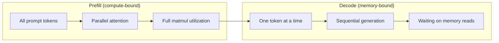
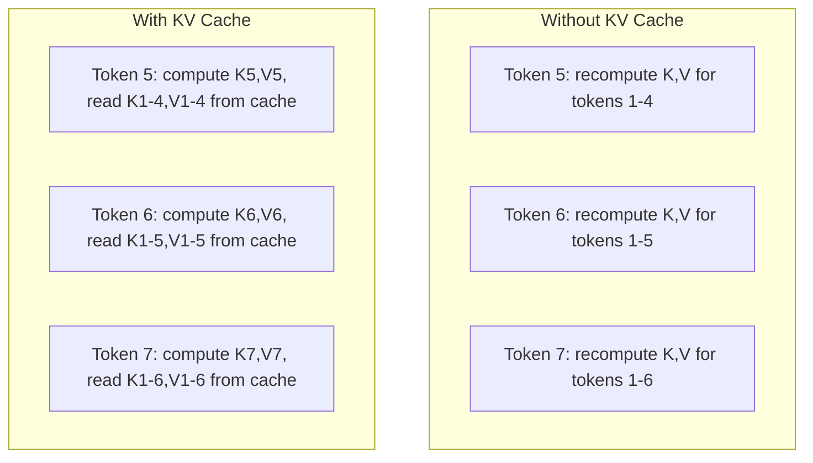
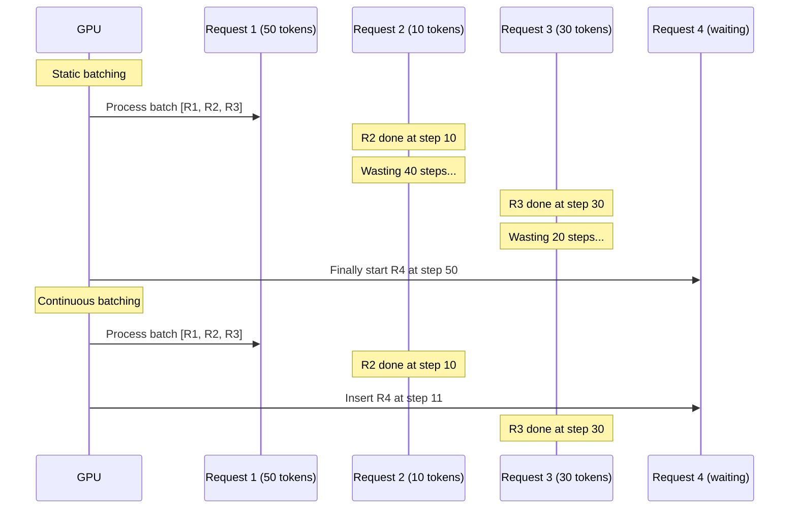
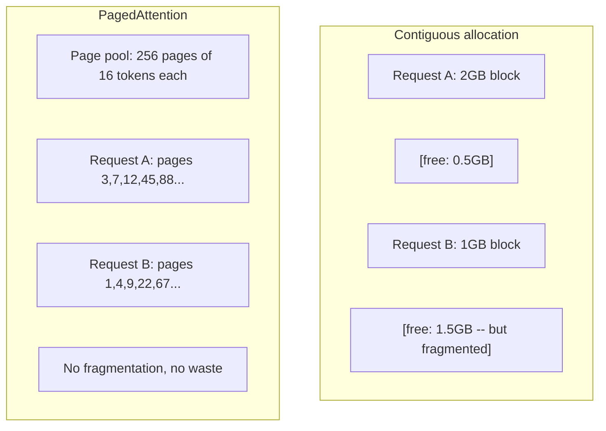
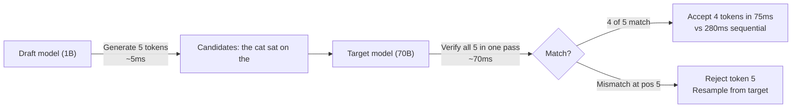

# Inference Optimization (推理优化)

> LLM inference 有两个阶段。Prefill 并行处理 prompt——compute-bound。Decode 逐个生成 token——memory-bound。每个优化都针对其中一个或两个。

**Type:** Build
**Languages:** Python
**Prerequisites:** Phase 10, Lessons 01-08 (Transformer architecture, attention)
**Time:** ~120 minutes

## Learning Objectives (学习目标)

- 实现 KV-cache，消除自回归 token 生成中的冗余计算
- 解释 LLM inference 的 prefill 与 decode 阶段，以及为什么各自有不同的瓶颈（compute-bound vs memory-bound）
- 实现 continuous batching 和 PagedAttention 概念，在并发请求下最大化 GPU 利用率
- 对比 inference 优化技术（KV-cache、speculative decoding、flash attention）及其 throughput/latency tradeoff

## The Problem (问题)

你在 4xA100 GPU 上部署 Llama 3 70B。单个用户获得约 50 tokens/second。感觉很快。然后 100 个用户同时命中端点。Throughput 降到每个用户 3 tokens/second。你每月 25,000 美元的 GPU 账单正在以比人类打字还慢的速度 serve 响应。

模型本身在 1 个用户和 100 个用户之间没有变化。相同的权重、相同的架构、相同的数学。变化的是你如何调度工作。Naive inference 浪费了 90%+ 的可用 GPU 计算。一个等待第 47 个 token 的用户占用整个 batch slot，而 GPU memory bus 在 matmul 之间空闲。同时，一个新用户的 2,000 token prompt 可以填满这些死时间，产生有用的计算。

这不是 scaling 问题。这是 scheduling 问题。本课的技术——KV caching、continuous batching、PagedAttention、speculative decoding、prefix caching——就是把 25k/月的 inference 账单和 5k/月 serve 相同流量的技术区分开来的东西。

vLLM 在 4xA100-80GB 上 serve Llama 3 70B，低并发时约 50 tokens/second/user，100 并发请求时通过 continuous batching 和 PagedAttention 维持 15-25 TPS/user。没有这些优化，相同硬件在该并发下只能 serve 5 TPS/user。相同 GPU，相同模型，4 倍 throughput。

## The Concept (概念)

### Prefill vs Decode

每个 LLM inference 请求有两个不同的阶段。

**Prefill** 处理整个输入 prompt。所有 token 都已知，所以 attention 可以在完整序列上并行计算。这是一个大型矩阵乘法——GPU core 保持忙碌。瓶颈是计算：你的硬件每秒能交付多少 FLOPS。A100 做 312 TFLOPS (BF16)。70B 模型在单张 A100 上处理 4,096 token 的 prompt 约需 400ms。

**Decode** 逐个生成输出 token。每个新 token 都要 attend 到所有先前 token，但每个 forward pass 只产生一个 token。权重矩阵与 prefill 时相同，但你是在用向量而非矩阵去乘它们。GPU core 在微秒内完成，然后等待下一批权重从 memory 到达。瓶颈是 memory bandwidth：你能以多快的速度把模型权重从 HBM 流到计算单元。A100 有 2 TB/s 带宽。70B 模型在 FP16 中是 140 GB。完整读取一次模型需要 70ms——这就是单个 decode step 的 floor。



**ops:byte ratio**（也叫 arithmetic intensity）捕捉这个 tradeoff。它测量每从 memory 读取一字节执行多少操作。

```
ops:byte ratio = FLOPs per token / bytes read from memory
```

在 batch 4,096 tokens 的 prefill 期间，每加载一个权重你执行约 4,096 次乘累加操作。Ratio 高——你是 compute-bound。在 batch size 1 的 decode 期间，每加载一个权重你执行约 1 次操作。Ratio 低——你是 memory-bound。

核心洞察：*decode 是 memory-bound 的，因为你读取整个模型来产生单个 token*。每个下面的优化要么减少你读取的内容，要么增加每次读取处理的 token batch，要么完全避免读取。

### KV Cache

在 attention 期间，每个 token 的 query 要 attend 到每个先前 token 的 key 和 value 向量。没有 caching，生成 token N 需要为所有 N-1 个先前 token 重新计算 key 和 value 投影。Token 1 在生成 token 2 时被投影，然后在 token 3 时又被投影，在 token 4 时再次被投影。到 token 1,000 时，token 1 总共被投影了 999 次。

KV cache 存储所有先前 token 的 key 和 value 投影。生成 token N 时，你只计算 token N 的 key 和 value，然后把它们与 token 1 到 N-1 的 cached K/V 拼接。



**KV cache 显存公式：**

```
KV cache size = 2 * num_layers * num_kv_heads * head_dim * seq_len * bytes_per_param
```

对于 Llama 3 70B（80 层，GQA 8 个 KV head，head_dim=128，BF16）：

```
per token: 2 * 80 * 8 * 128 * 2 bytes = 327,680 bytes = 320 KB
at 4,096 tokens: 320 KB * 4,096 = 1.28 GB
at 128K tokens: 320 KB * 131,072 = 40 GB
```

单个 128K 上下文的 Llama 3 70B 对话消耗 40 GB KV cache——半张 A100 的显存。100 个并发用户各 4K tokens，KV cache 单独就需要 128 GB。这就是 KV cache 管理成为 inference 优化核心挑战的原因。

### Continuous Batching

Static batching 等待 N 个请求的 batch 到达，一起处理，然后等*所有*请求完成才接受新请求。如果一个请求需要 500 tokens，另一个需要 10，短请求在完成后还要 idle 490 个 decode steps。

Continuous batching（也叫 iteration-level batching）在任何请求完成时立即把新请求插入 batch。Batch 在每个 decode step 重新评估。一个 10 个 token 后完成的请求立即被等待中的请求替换。



Throughput 提升取决于输出长度变化多大。长度均匀时，continuous batching 与 static batching 相当。长度变化时（常见情况），continuous batching 可提供 2-5 倍更高 throughput，因为 GPU slot 永远不会空着。

### PagedAttention

每个请求的 KV cache 是 memory 中的一个 contiguous block。请求到达和离开时，memory 碎片化——就像操作系统中的 RAM 碎片化。一个 4K token 请求需要 1.28 GB contiguous。即使你有 2 GB 空闲 total，你可能没有 1.28 GB *contiguous*。你要么浪费 memory，要么拒绝请求。

PagedAttention（来自 vLLM）把 OS 风格的虚拟 memory 应用到 KV cache。不是为每个请求分配一个 contiguous block，而是分配固定大小的"pages"（通常每页 16 tokens）。Pages 可以位于 GPU physical memory 的任何地方。Page table 把每个请求的逻辑序列位置映射到 physical page 位置。



PagedAttention 还启用 shared prefixes 的 **copy-on-write**。如果 50 个请求共享相同的 system prompt，该 system prompt 的 KV cache pages 只存储一次，被所有 50 个请求引用。只有请求 diverge（不同用户消息）时才获得自己的 pages。这对共享 system prompts 的应用 dramatically 削减显存使用。

vLLM 通过 PagedAttention 报告接近零的 memory waste（~4% vs naive allocation 的 ~60-80%）。

### Speculative Decoding

Decode 慢是因为它是 sequential——你生成一个 token，feed 回去，再生成下一个。但如果你能便宜地猜出接下来 5 个 token，然后一次性验证它们呢？

Speculative decoding 使用一个小的、快的 **draft model** 生成 K 个候选 token。大的 **target model** 然后在单个 forward pass 中处理所有 K 个候选（这看起来像 prefill——并行、compute-bound、高效）。如果 target model 同意 draft model 的预测，你在一次 target forward pass 的时间内接受所有 K 个 token。如果它在位置 j 不同意，你接受 token 1 到 j-1 并丢弃其余。



Speedup 取决于 **acceptance rate**——draft model 的预测与 target 匹配的频率。对于 Llama 3 8B 为 Llama 3 70B 起草，自然语言上典型 acceptance rate 为 70-85%。这转化为 2-3 倍 decode speedup。

三种 speculative decoding 方法：

| Method | Draft source | Acceptance rate | Overhead |
|--------|-------------|-----------------|----------|
| Draft-target (Leviathan et al.) | 独立小模型 | 70-85% | Draft model 显存 |
| EAGLE (Li et al.) | Target 上的轻量 head | 75-90% | ~1% 额外参数 |
| N-gram lookup | Token n-gram 表 | 40-60% | 可忽略 |

**EAGLE** 在 target model 的 hidden states 上训练一个小型自回归 head。它用 target model 倒数第二层的特征预测下一个 token 的 embedding。因为它操作在 target model 自己的 representations 上（而非独立模型的），所以以最小额外显存实现更高 acceptance rate。EAGLE-2 添加 dynamic draft tree，根据上下文调整候选数量。

**N-gram speculative decoding** 维护一个 n-gram continuations 表，来自当前上下文或预建语料库。如果 draft 匹配同一会话中之前出现的内容（重复模式、代码、结构化输出），它以零神经网络 overhead 触发。平均 acceptance rate 较低，但每次猜测的代价基本为零。

Speculative decoding 是*数学上精确的*——输出分布与 target model 的分布完全相同。它不是近似。Verification step 确保每个接受的 token 具有 target model 会分配的精确概率。

### Prefix Caching

许多请求共享相同的前缀。Chatbot system prompt。RAG context block。Few-shot example set。没有 prefix caching，每个请求都从头重新计算这些共享 token 的 KV cache。

Prefix caching 存储常见前缀的 KV cache 并在请求间复用。当一个带有已知前缀的新请求到达时，系统复制（或引用）cached KV entries，只计算唯一后缀的 KV。

对于所有请求共享的 2,000 token system prompt，prefix caching 消除每个请求约 400ms 的 prefill。在 100 requests/second 下，每秒节省 40 秒 GPU 计算——超过一张 GPU 的工作量。

SGLang 的 RadixAttention 用 radix tree（trie）实现 prefix caching，按 token 内容索引前缀。任何匹配存储前缀的请求免费获得其 KV cache。Tree 启用 partial prefix matches——如果你与 cached entry 共享 2,000 前缀 token 中的 1,500，你复用那 1,500 并只重新计算 500。

### Inference Engines

三个引擎主导 production LLM serving：

| Engine | 核心创新 | 最适合 |
|--------|---------------|----------|
| vLLM | PagedAttention, continuous batching | 通用 serving，最高兼容性 |
| SGLang | RadixAttention (prefix caching), structured generation | 多轮 chatbots, constrained decoding |
| TensorRT-LLM | NVIDIA kernel fusion, FP8 quantization | NVIDIA 硬件上的最大单 GPU throughput |

**vLLM** 是默认起点。它支持最广泛的模型，在任何 GPU 厂商（NVIDIA、AMD、Intel）上运行，通过 PagedAttention + continuous batching 实现强 throughput。OpenAI-compatible API 意味着你可以把它作为任何 OpenAI API 调用的替代品。

**SGLang** 建立在 vLLM 相同基础上，但添加 RadixAttention 用于 prefix caching 和用于结构化 LLM 程序的 domain-specific language。如果你的工作负载涉及多轮对话、tool use 或 constrained decoding（JSON 输出、regex-guided generation），SGLang 通常通过 prefix reuse 比 vLLM 快 2-5 倍。

**TensorRT-LLM** 把模型编译成优化的 NVIDIA GPU kernels。它 fuse 操作（attention + linear + activation 在一个 kernel 中），在 H100 GPU 上使用 FP8，并与 NVIDIA Triton Inference Server 集成用于 production 部署。它在 NVIDIA 硬件上实现最高单 GPU throughput，但需要更多 setup 且只在 NVIDIA GPU 上工作。

Llama 3 70B 的真实数据（4xA100-80GB, BF16）：

| Metric | vLLM | SGLang | TensorRT-LLM |
|--------|------|--------|---------------|
| Throughput (1 user) | ~50 TPS | ~55 TPS | ~65 TPS |
| Throughput (100 users) | ~2,500 total TPS | ~3,200 total TPS | ~3,000 total TPS |
| Time to first token | ~400ms | ~300ms (prefix hit) | ~350ms |
| Max context | 128K | 128K | 128K |

### The Ops:Byte Framework

你无法优化你不测量的东西。ops:byte ratio 告诉你是在 compute-bound 还是 memory-bound，这决定哪些优化重要。

```
Compute roof: peak FLOPS of the GPU
Memory roof:  peak bandwidth * ops:byte ratio
```

当 ops:byte 低时（decode、小 batch），你撞到 memory bandwidth roof。添加更多计算（更高 clock、更多 core）没有帮助。你需要减少 memory reads（quantization、KV cache compression）或增加 batch size 来把读取摊到更多有用工作上。

当 ops:byte 高时（prefill、大 batch），你撞到 compute roof。Memory bandwidth 优化没有帮助。你需要更快的 GPU、kernel fusion 或降低精度来压榨更多 FLOPS。

| Scenario | ops:byte | Bound | Optimize with |
|----------|----------|-------|---------------|
| Prefill, batch=1 | ~4,096 | Compute | Kernel fusion, FP8 |
| Decode, batch=1 | ~1 | Memory | Quantization, KV compression |
| Decode, batch=32 | ~32 | Memory | Larger batch, continuous batching |
| Decode, batch=256 | ~256 | Transitioning | Both matter |
| Decode, batch=1024 | ~1,024 | Compute | Kernel fusion, tensor parallelism |

A100 上的 crossover point 约在 ops:byte = 156（312 TFLOPS / 2 TB/s）。低于 156，你是 memory-bound。高于 156，你是 compute-bound。Continuous batching 通过每个 iteration 打包更多 token 把 decode 推向这个 crossover。

## Build It (动手实现)

### Step 1: KV Cache from Scratch

我们构建一个 multi-head KV cache，按层、按 head 存储 key 和 value 投影，并展示显存增长模式。

```python
import numpy as np

class KVCache:
    def __init__(self, num_layers, num_heads, head_dim, max_seq_len, dtype=np.float16):
        self.num_layers = num_layers
        self.num_heads = num_heads
        self.head_dim = head_dim
        self.max_seq_len = max_seq_len
        self.dtype = dtype

        self.k_cache = np.zeros(
            (num_layers, num_heads, max_seq_len, head_dim), dtype=dtype
        )
        self.v_cache = np.zeros(
            (num_layers, num_heads, max_seq_len, head_dim), dtype=dtype
        )
        self.seq_len = 0

    def update(self, layer_idx, new_keys, new_values):
        num_new = new_keys.shape[1]
        end = self.seq_len + num_new
        self.k_cache[layer_idx, :, self.seq_len:end, :] = new_keys
        self.v_cache[layer_idx, :, self.seq_len:end, :] = new_values
        return (
            self.k_cache[layer_idx, :, :end, :],
            self.v_cache[layer_idx, :, :end, :]
        )

    def advance(self, num_tokens):
        self.seq_len += num_tokens

    def memory_bytes(self):
        return self.k_cache.nbytes + self.v_cache.nbytes

    def used_bytes(self):
        per_token = 2 * self.num_layers * self.num_heads * self.head_dim * np.dtype(self.dtype).itemsize
        return per_token * self.seq_len
```

### Step 2: Attention with KV Cache

一个使用 KV cache 进行 decode steps 的简化 multi-head attention。

```python
def scaled_dot_product_attention(query, keys, values):
    head_dim = query.shape[-1]
    scores = np.matmul(query, keys.transpose(0, 1, 3, 2)) / np.sqrt(head_dim)
    seq_len_q = scores.shape[-2]
    seq_len_k = scores.shape[-1]
    if seq_len_q > 1:
        mask = np.triu(np.ones((seq_len_q, seq_len_k), dtype=np.float32), k=seq_len_k - seq_len_q + 1)
        scores = scores + mask * (-1e9)
    max_scores = np.max(scores, axis=-1, keepdims=True)
    exp_scores = np.exp(scores - max_scores)
    attn_weights = exp_scores / np.sum(exp_scores, axis=-1, keepdims=True)
    return np.matmul(attn_weights, values)


class MultiHeadAttention:
    def __init__(self, d_model, num_heads):
        self.num_heads = num_heads
        self.head_dim = d_model // num_heads
        scale = np.sqrt(2.0 / d_model)
        self.W_q = np.random.randn(d_model, d_model).astype(np.float32) * scale
        self.W_k = np.random.randn(d_model, d_model).astype(np.float32) * scale
        self.W_v = np.random.randn(d_model, d_model).astype(np.float32) * scale
        self.W_o = np.random.randn(d_model, d_model).astype(np.float32) * scale

    def forward(self, x, kv_cache=None, layer_idx=0):
        batch, seq_len, d_model = x.shape
        Q = np.matmul(x, self.W_q).reshape(batch, seq_len, self.num_heads, self.head_dim).transpose(0, 2, 1, 3)
        K = np.matmul(x, self.W_k).reshape(batch, seq_len, self.num_heads, self.head_dim).transpose(0, 2, 1, 3)
        V = np.matmul(x, self.W_v).reshape(batch, seq_len, self.num_heads, self.head_dim).transpose(0, 2, 1, 3)

        if kv_cache is not None:
            K_full, V_full = kv_cache.update(layer_idx, K[0], V[0])
            K = K_full[np.newaxis, :, :, :]
            V = V_full[np.newaxis, :, :, :]
            if seq_len == 1:
                kv_cache.advance(1)

        attn_out = scaled_dot_product_attention(Q, K, V)
        attn_out = attn_out.transpose(0, 2, 1, 3).reshape(batch, -1, d_model)
        return np.matmul(attn_out, self.W_o)
```

### Step 3: Continuous Batching Simulator

这模拟 static 和 continuous batching 之间的调度差异。

```python
import heapq

class Request:
    def __init__(self, request_id, prompt_tokens, output_tokens, arrival_step):
        self.request_id = request_id
        self.prompt_tokens = prompt_tokens
        self.output_tokens = output_tokens
        self.arrival_step = arrival_step
        self.tokens_generated = 0
        self.start_step = None
        self.end_step = None

    def is_done(self):
        return self.tokens_generated >= self.output_tokens


def simulate_static_batching(requests, batch_size):
    step = 0
    completed = []
    queue = list(requests)
    queue.sort(key=lambda r: r.arrival_step)

    while queue:
        batch = []
        while queue and len(batch) < batch_size:
            r = queue.pop(0)
            r.start_step = max(step, r.arrival_step)
            batch.append(r)

        if batch:
            step = max(step, max(r.start_step for r in batch))
            max_output = max(r.output_tokens for r in batch)
            for r in batch:
                r.tokens_generated = r.output_tokens
                r.end_step = step + max_output
            step += max_output
            completed.extend(batch)

    return completed


def simulate_continuous_batching(requests, batch_size):
    step = 0
    completed = []
    queue = sorted(requests, key=lambda r: r.arrival_step)
    queue_idx = 0
    active = []
    waiting = []

    while queue_idx < len(queue) or active or waiting:
        while queue_idx < len(queue) and queue[queue_idx].arrival_step <= step:
            waiting.append(queue[queue_idx])
            queue_idx += 1

        while waiting and len(active) < batch_size:
            r = waiting.pop(0)
            r.start_step = step
            active.append(r)

        if not active:
            if waiting:
                step += 1
                continue
            elif queue_idx < len(queue):
                step = queue[queue_idx].arrival_step
                continue
            else:
                break

        for r in active:
            r.tokens_generated += 1

        done = [r for r in active if r.is_done()]
        for r in done:
            r.end_step = step + 1
            completed.append(r)
        active = [r for r in active if not r.is_done()]

        step += 1

    return completed


def batching_stats(completed):
    latencies = [r.end_step - r.arrival_step for r in completed]
    total_time = max(r.end_step for r in completed) - min(r.arrival_step for r in completed)
    total_tokens = sum(r.output_tokens for r in completed)
    return {
        "avg_latency": np.mean(latencies),
        "p50_latency": np.median(latencies),
        "p99_latency": np.percentile(latencies, 99),
        "total_time": total_time,
        "throughput": total_tokens / total_time if total_time > 0 else 0,
    }
```

### Step 4: Prefix Cache

一个基于 trie 的 prefix cache，存储共享前缀的 KV entries。

```python
class TrieNode:
    def __init__(self):
        self.children = {}
        self.kv_data = None
        self.hit_count = 0


class PrefixCache:
    def __init__(self, max_entries=1000):
        self.root = TrieNode()
        self.max_entries = max_entries
        self.total_entries = 0
        self.hits = 0
        self.misses = 0

    def _walk(self, token_ids):
        node = self.root
        depth = 0
        for tid in token_ids:
            if tid not in node.children:
                break
            node = node.children[tid]
            depth += 1
        return node, depth

    def lookup(self, token_ids):
        node, depth = self._walk(token_ids)
        if depth > 0:
            self.hits += 1
            current = self.root
            for tid in token_ids[:depth]:
                current = current.children[tid]
                current.hit_count += 1
            kv_entries = []
            current = self.root
            for tid in token_ids[:depth]:
                current = current.children[tid]
                if current.kv_data is not None:
                    kv_entries.append(current.kv_data)
            return depth, kv_entries
        self.misses += 1
        return 0, []

    def insert(self, token_ids, kv_per_token):
        node = self.root
        for i, tid in enumerate(token_ids):
            if tid not in node.children:
                if self.total_entries >= self.max_entries:
                    return i
                node.children[tid] = TrieNode()
                self.total_entries += 1
            node = node.children[tid]
            if i < len(kv_per_token):
                node.kv_data = kv_per_token[i]
        return len(token_ids)

    def hit_rate(self):
        total = self.hits + self.misses
        return self.hits / total if total > 0 else 0.0
```

### Step 5: Speculative Decoding Simulator

我们用可配置的 acceptance rate 模拟 draft-target speculative decoding。

```python
class DraftModel:
    def __init__(self, vocab_size, acceptance_rate=0.8):
        self.vocab_size = vocab_size
        self.acceptance_rate = acceptance_rate

    def generate(self, context, num_tokens):
        tokens = np.random.randint(0, self.vocab_size, size=num_tokens)
        return tokens

    def get_probs(self, context, token):
        probs = np.random.dirichlet(np.ones(self.vocab_size))
        return probs


class TargetModel:
    def __init__(self, vocab_size):
        self.vocab_size = vocab_size

    def get_probs(self, context, tokens=None):
        if tokens is not None:
            return [np.random.dirichlet(np.ones(self.vocab_size)) for _ in tokens]
        return np.random.dirichlet(np.ones(self.vocab_size))


def speculative_decode(draft_model, target_model, context, num_speculative=5,
                       draft_cost=1.0, target_cost=10.0, verify_cost=12.0):
    total_tokens = 0
    total_cost = 0.0
    accepted_counts = []
    context = list(context)

    max_tokens = 100

    while total_tokens < max_tokens:
        draft_tokens = draft_model.generate(context, num_speculative)
        total_cost += draft_cost * num_speculative

        target_probs = target_model.get_probs(context, draft_tokens)
        total_cost += verify_cost

        accepted = 0
        for i, token in enumerate(draft_tokens):
            draft_p = draft_model.get_probs(context + list(draft_tokens[:i]), token)
            target_p = target_probs[i]

            r = np.random.random()
            acceptance_prob = min(1.0, target_p[token] / (draft_p[token] + 1e-10))

            if r < draft_model.acceptance_rate:
                accepted += 1
                context.append(token)
                total_tokens += 1
            else:
                new_token = np.random.choice(draft_model.vocab_size, p=target_p)
                context.append(new_token)
                total_tokens += 1
                break

        accepted_counts.append(accepted)

        if accepted == num_speculative:
            bonus_probs = target_model.get_probs(context)
            bonus_token = np.random.choice(draft_model.vocab_size, p=bonus_probs)
            context.append(bonus_token)
            total_tokens += 1

    sequential_cost = total_tokens * target_cost
    return {
        "total_tokens": total_tokens,
        "speculative_cost": total_cost,
        "sequential_cost": sequential_cost,
        "speedup": sequential_cost / total_cost if total_cost > 0 else 1.0,
        "avg_accepted": np.mean(accepted_counts),
        "acceptance_rate": np.mean(accepted_counts) / num_speculative,
    }


def compare_speculation_strategies(vocab_size=1000, num_trials=20):
    results = {}

    for name, acceptance_rate, spec_tokens in [
        ("Draft-target (8B->70B)", 0.78, 5),
        ("EAGLE", 0.85, 6),
        ("N-gram", 0.50, 4),
        ("No speculation", 0.0, 0),
    ]:
        if spec_tokens == 0:
            results[name] = {
                "speedup": 1.0,
                "acceptance_rate": 0.0,
                "avg_accepted": 0.0,
            }
            continue

        trial_results = []
        for _ in range(num_trials):
            draft = DraftModel(vocab_size, acceptance_rate=acceptance_rate)
            target = TargetModel(vocab_size)
            context = list(np.random.randint(0, vocab_size, size=10))
            result = speculative_decode(draft, target, context, num_speculative=spec_tokens)
            trial_results.append(result)

        results[name] = {
            "speedup": np.mean([r["speedup"] for r in trial_results]),
            "acceptance_rate": np.mean([r["acceptance_rate"] for r in trial_results]),
            "avg_accepted": np.mean([r["avg_accepted"] for r in trial_results]),
        }

    return results
```

### Step 6: KV Cache Memory Profiler

为真实模型配置计算 KV cache 显存需求。

```python
MODEL_CONFIGS = {
    "Llama-3-8B": {
        "num_layers": 32, "num_kv_heads": 8, "head_dim": 128,
        "model_params_b": 8, "gqa": True,
    },
    "Llama-3-70B": {
        "num_layers": 80, "num_kv_heads": 8, "head_dim": 128,
        "model_params_b": 70, "gqa": True,
    },
    "Llama-3-405B": {
        "num_layers": 126, "num_kv_heads": 8, "head_dim": 128,
        "model_params_b": 405, "gqa": True,
    },
    "Mistral-7B": {
        "num_layers": 32, "num_kv_heads": 8, "head_dim": 128,
        "model_params_b": 7, "gqa": True,
    },
    "GPT-4-est": {
        "num_layers": 120, "num_kv_heads": 96, "head_dim": 128,
        "model_params_b": 1800, "gqa": False,
    },
}


def kv_cache_memory(config, seq_len, dtype_bytes=2):
    per_token = 2 * config["num_layers"] * config["num_kv_heads"] * config["head_dim"] * dtype_bytes
    total = per_token * seq_len
    return {
        "per_token_bytes": per_token,
        "per_token_kb": per_token / 1024,
        "total_bytes": total,
        "total_mb": total / (1024 ** 2),
        "total_gb": total / (1024 ** 3),
    }


def memory_budget(config, gpu_memory_gb, model_dtype_bytes=2, kv_dtype_bytes=2):
    model_memory_gb = config["model_params_b"] * 1e9 * model_dtype_bytes / (1024 ** 3)
    overhead_gb = gpu_memory_gb * 0.1
    available_for_kv = gpu_memory_gb - model_memory_gb - overhead_gb

    if available_for_kv <= 0:
        return {"error": "Model does not fit in GPU memory", "model_memory_gb": model_memory_gb}

    per_token = 2 * config["num_layers"] * config["num_kv_heads"] * config["head_dim"] * kv_dtype_bytes
    max_tokens = int(available_for_kv * (1024 ** 3) / per_token)

    return {
        "gpu_memory_gb": gpu_memory_gb,
        "model_memory_gb": round(model_memory_gb, 1),
        "overhead_gb": round(overhead_gb, 1),
        "available_for_kv_gb": round(available_for_kv, 1),
        "max_total_tokens": max_tokens,
        "max_users_at_2k": max_tokens // 2048,
        "max_users_at_4k": max_tokens // 4096,
        "max_users_at_32k": max_tokens // 32768,
    }
```

## Use It (使用)

With vLLM:

```python
from vllm import LLM, SamplingParams

llm = LLM(
    model="meta-llama/Llama-3-70B-Instruct",
    tensor_parallel_size=4,
    enable_prefix_caching=True,
    max_model_len=8192,
    gpu_memory_utilization=0.9,
)

params = SamplingParams(temperature=0.7, max_tokens=256)
outputs = llm.generate(["Explain inference optimization in one paragraph."], params)
```

With SGLang for prefix caching + structured output:

```python
import sglang as sgl

@sgl.function
def classify(s, text):
    s += sgl.system("You are a classifier. Output JSON only.")
    s += sgl.user(f"Classify this text: {text}")
    s += sgl.assistant(sgl.gen("result", regex=r'\{"label": "(positive|negative|neutral)"\}'))

runtime = sgl.Runtime(model_path="meta-llama/Llama-3-70B-Instruct", tp_size=4)
sgl.set_default_backend(runtime)

results = classify.run_batch([
    {"text": "This product is amazing!"},
    {"text": "Terrible experience."},
    {"text": "It was okay I guess."},
])
```

With TensorRT-LLM:

```python
import tensorrt_llm
from tensorrt_llm.runtime import ModelRunner

runner = ModelRunner.from_dir("./llama-70b-trt-engine/", rank=0)

outputs = runner.generate(
    batch_input_ids=[tokenizer.encode("Explain KV caching.")],
    max_new_tokens=256,
    temperature=0.7,
)
```

## Ship It (交付)

This lesson produces:
- `outputs/skill-inference-optimization.md` -- 诊断和优化 LLM inference serving 的 skill

## Exercises (练习)

1. 修改 KV cache profiler 来对比 FP16 vs FP8 vs INT4 KV cache quantization。对于 4K 上下文的 Llama 3 70B，计算每种在 4xA100-80GB 上的最大并发用户数。KV quantization 到 INT4 应该大致 4 倍用户容量。

2. 扩展 continuous batching simulator 来跟踪 GPU 利用率（每 step 填充的 batch slot 比例）。对 50 个输出长度服从 Pareto 分布（shape=1.5, scale=20）的请求，绘制 static 和 continuous batching 的利用率随时间变化。Continuous batching 应保持 >80% 利用率。

3. 实现一个 grouped-query attention (GQA) 版本的 KV cache，其中 `num_kv_heads < num_query_heads`。Llama 3 70B 使用 64 个 query head 但只有 8 个 KV head。计算与完整 multi-head attention 相比的显存节省（KV cache 大小减少 8 倍）。

4. 构建一个使用 LRU eviction 的 prefix cache。设置 max_entries 为 500，生成 1,000 个请求，其中 60% 共享 5 个常见前缀之一。测量 hit rate 并与 unlimited cache 比较。好的 eviction 策略下，hit rate 应保持在 55% 以上。

5. 扩展 speculative decoding simulator 来实现 tree-based speculation（EAGLE-2 风格）。不是单个 K 个 draft token 的链，而是生成一个候选 tree（例如，3 层每层 2 个分支 = 8 个 leaf candidates）。比较每轮 verification 接受的总 token 数与 linear speculation。

## Key Terms (关键术语)

| Term | What people say | What it actually means |
|------|----------------|----------------------|
| Prefill | "Processing the prompt" | 在所有输入 token 上并行计算 attention——compute-bound，因为完整矩阵乘法让 GPU core 保持忙碌 |
| Decode | "Generating tokens" | 每个 forward pass 产生一个 token，每次读取完整模型权重——memory-bound，因为计算在下一批权重到达前就完成了 |
| KV cache | "Caching attention states" | 存储所有先前 token 的 key 和 value 投影，避免在每个 decode step 重新计算——用显存换计算 |
| Continuous batching | "Dynamic batching" | 任何请求完成时立即把新请求插入运行中的 batch，每个 decode iteration 评估而非等待整个 batch |
| PagedAttention | "Virtual memory for KV cache" | 在固定大小的 page 中分配 KV cache 而非 contiguous block，消除 memory fragmentation 并启用共享前缀的 copy-on-write |
| Speculative decoding | "Draft and verify" | 使用快速 draft model 提出多个 token，然后在一次 target model forward pass 中验证它们——数学上精确，2-3 倍加速 |
| EAGLE | "Self-speculative decoding" | 一种 speculative decoding 变体，在 target model 自己的 hidden states 上训练轻量 head，比独立 draft model 实现更高 acceptance rate |
| Prefix caching | "Reusing system prompt KV" | 存储常见前缀（system prompts、few-shot examples）的计算 KV cache entries 并在请求间复用，跳过冗余 prefill |
| Ops:byte ratio | "Arithmetic intensity" | 计算操作与 memory 读取字节数的比率——决定 workload 是 compute-bound（高 ratio）还是 memory-bound（低 ratio） |
| Time to first token | "TTFT" | 从收到请求到产生第一个输出 token 的延迟——长 prompt 下由 prefill 时间主导 |

## Further Reading (延伸阅读)

- Kwon et al., "Efficient Memory Management for Large Language Model Serving with PagedAttention" (2023) -- 引入 paged KV cache 管理的 vLLM 论文，现在是 inference serving 的行业标准
- Leviathan et al., "Fast Inference from Transformers via Speculative Decoding" (2023) -- 证明 draft-verify speculation 产生精确 target model 分布同时实现 2-3 倍加速的基础论文
- Li et al., "EAGLE: Speculative Sampling Requires Rethinking Feature Uncertainty" (2024) -- 通过在 target model 自己的特征上训练 head 而非使用独立 draft model 来实现更高 acceptance rate
- Zheng et al., "SGLang: Efficient Execution of Structured Language Model Programs" (2024) -- 引入 RadixAttention 用于 prefix caching 和 multi-call LLM 程序的编程模型
- Williams et al., "Roofline: An Insightful Visual Performance Model for Multicore Architectures" (2009) -- 形式化 ops:byte 框架来推理 compute vs memory 瓶颈的原始 roofline 论文
