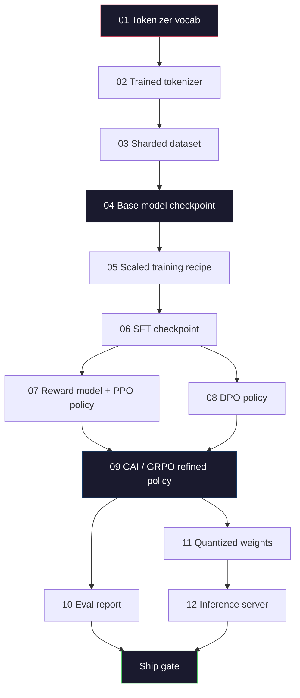
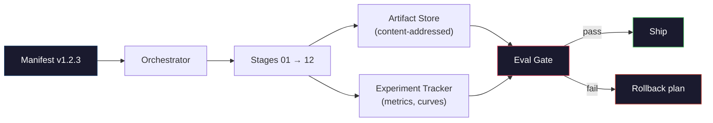

# Building a Complete LLM Pipeline (构建完整的 LLM 流水线)

> Lessons 01 到 12 的所有内容只是 pipeline 的一个阶段。本课是将这些阶段转变为单次端到端运行的脚手架：tokenize、pre-train、scale、SFT、align、evaluate、quantize、serve。你不会在笔记本上训练 70B 模型。你将产出编排层、清单、eval gate 和 rollback 计划——这是 2026 年 frontier 团队用来决定什么可以上线的工具。这是 capstone。

**Type:** Build
**Languages:** Python (stdlib)
**Prerequisites:** All Phase 10 lessons 01-12
**Time:** ~120 minutes

## Learning Objectives (学习目标)

- 将前十一课（tokenizer、data、pre-training、scaling、SFT、RLHF、DPO、CAI、eval、quantization、inference）组合成单个可复现的 pipeline spec
- 定义阶段间的 artifact contract：每个阶段消费什么、产出什么、下一阶段如何验证输入
- 构建一个 orchestrator，跟踪 experiments、hash artifacts、并在 eval threshold 上 gate ship 决策
- 设计 rollback 计划：哪些 artifacts 重跑成本低、哪些成本高、一个 corrupted checkpoint 代价多大

## The Problem (问题)

前面的课各自都能工作。Tokenizer 训练好了。Tiny GPT pre-trained 了。SFT dataset 组装好了。Reward model 训练好了。DPO 跑完了。Evals 测量了。Quantized weights 导出了。Inference server 启动了。每个都是 notebook。每个都有自己的约定、自己的输出路径、自己的 seed。

Frontier training run 不是 notebook。Llama 3 405B 在约 54 天内消耗了 3000 万 H100 小时。DeepSeek-V3 使用了约 280 万 H800 小时。在此期间，一个 corrupted checkpoint、一个 data contamination、一个 eval regression 可能让团队损失一周 wall-clock 和一个月 GPU 预算。团队 survive 的方式是通过 pipeline hygiene：每个阶段都有 deterministic input、deterministic output、manifest、hash 和 gate。

这是 capstone。你不会在笔记本上端到端运行 pipeline。你将编写协调阶段的 orchestrator、描述运行的 manifest、gating ship 决策的 verifier，以及让第三方从单个文件重跑你工作的 replay plan。代码很小；discipline 很大。

这个模式从 100M 到 1T 参数不变。相同的四个组件——manifest、orchestrator、eval gate、artifact store——既运行 Llama 3 也运行你的 hobby GPT。区别是每个阶段 config 中的数字大小，而非 pipeline 的形状。

## The Concept (概念)

### The Twelve Stages (十二个阶段)

每节 Phase 10 的课都是一个阶段。这是完整的依赖图。



Stages 07 和 08 可以并行运行。其他都是硬依赖。Stage 02（tokenizer）的变更会使每个下游 artifact 失效。Stage 10（eval）的变更只使 ship 决策失效。

### The Manifest (清单)

Manifest 是一个描述运行完全足以 replay 它的单个文件。Pipeline 产生的任何东西都不应依赖于不在 manifest 中的状态。字段是枯燥且强制的。

```
pipeline_version: 1.2.3
seed: 42
git_commit: a1b2c3d4
stages:
  01_tokenizer:
    recipe: bpe_32k
    input_hash: sha256:...
    output_hash: sha256:...
    wall_clock_sec: 3600
    cost_usd: 12
```

Stage N 的 output hash 是 stage N+1 的 input hash。任何偏差都会使 pipeline 停止。这是你早期捕捉 data corruption 的方式。这也是不同大陆上的 teammate 验证他们的 replay 是否产生了与你相同的 artifact 的方式。

实践中团队使用一个小 YAML schema 加上一个 manifest checker，它与上一次成功的运行做 diff。任何预期字段（cost、wall clock）之外的 delta 都是 red flag。

### Artifact Typing (产物类型)

每个阶段的输出是一个 typed artifact。不是目录 blob，不是 pickle，而是具有已知 schema 的命名类型。

| Stage | Artifact Type | Key Fields |
|-------|--------------|-----------|
| 01-02 | Tokenizer | vocab.json, merges.txt, config.json, hash |
| 03 | Dataset | shards[], row count, token count, dedup stats |
| 04-05 | Checkpoint | weights.safetensors, config.json, optimizer state, step count |
| 06 | SFT Model | checkpoint + SFT recipe + data mix |
| 07 | Reward Model | RM checkpoint + preference data hash |
| 08-09 | Policy | checkpoint + reference hash + beta + KL budget consumed |
| 10 | Eval Report | benchmark scores + regression diffs + eval data hash |
| 11 | Quantized Model | quantized weights + calibration data + accuracy delta vs FP16 |
| 12 | Server Spec | endpoint + model hash + config + observability hooks |

Typing 防止最常见的失败模式：把 stage 08 的输出当作 stage 06 的输入、把 DPO-trained model 通过 SFT path 上线。Typed artifacts 和 typed stage signatures 让这些错误成为 compile-time failures，而非第五天才发现的失败。

### The Eval Gate (评估门控)

Shipping 不是"训练完成了"。Shipping 是"训练完成且 eval gate 通过了"。Gate 在运行开始前就定义好了。

```
gates:
  mmlu:      >= baseline + 0.5   # 无回归
  humaneval: >= baseline + 1.0
  truthfulqa: >= baseline         # 无下降
  safety_refusal_rate: <= 0.05
  kl_from_reference: <= 25.0
  cost_total_usd: <= 50000
```

每个 gate 都是一个数值 threshold。没有"看起来不错"的 gate。没有主观 sign-off。如果每个 gate 都通过，artifact 被标记为 shippable。如果任何 gate 失败，run 被 hold，等待 named reviewer 的 explicit override，而 override 本身被记录在 manifest 中。

两个 gate 捕捉大多数灾难。一个 *regression* gate（新模型必须在核心 benchmark 上至少与上一个一样好）捕捉 training bugs。一个 *KL budget* gate（aligned policy 与 reference 的漂移不能超过 X）捕捉 alignment overcooking。每个 production pipeline 都有两者。

### The Orchestrator (编排器)

一小段代码，读取 manifest、dispatch stages、跟踪 artifacts、在任何 contract violation 上停止。这不是 Airflow。这不是 Kubeflow。对于 pipeline hygiene，你需要自己写的无聊东西。

Orchestrator 的工作很窄：

1. 从 manifest 解析 DAG。
2. 对每个阶段，检查预期的输出是否已存在于正确的 hash（如果是则跳过）。
3. 运行阶段，捕获 stdout/stderr，测量 wall clock 和 cost。
4. 验证 output hash 与下游阶段预期的 input hash。
5. 失败时，写入包含确切失败阶段的 partial manifest 并以非零退出。

那是 200 行 Python。它看起来像本课的 `code/main.py` 文件。在底层，真正的 pipeline 使用 `torchrun` 或 `ray` 在集群上执行单个阶段，但 orchestrator 本身运行在单个 box 上。

### Experiment Tracking and Artifact Storage (实验跟踪与产物存储)

两个外部系统锚定 pipeline。

**Experiment tracker (wandb, neptune, mlflow)。** 记录每个阶段的 loss curves、eval metrics、system telemetry。Tracker 是你三周后需要比较 run A 和 run B 时去的地方。团队几乎总是为此使用 hosted tracker——自己写会损失应该用于训练的时间。

**Artifact store (S3, R2, GCS)。** Checkpoints、datasets、tokenizers、eval reports 的不可变对象存储。Artifacts 按 hash 寻址，而非文件名。像 `latest.pt` 这样的文件名是 foot-gun；`ckpt-7b-step-20000-sha256:abc123.safetensors` 是一个 contract。

Orchestrator 写入两者。Tracker 是给人类看图表的。Artifact store 是给下一阶段查找输入的。

### Costing (成本核算)

Frontier run 有一个美元数字 attached。预算 discipline 发生在两个地方。

**Pre-run estimate。** 从 manifest 计算预期 FLOPs（pre-training：6 x params x tokens）、预期 GPU 小时（FLOPs / peak throughput / utilization）、以及当前租赁费率下的美元成本。如果 estimate 超过 budget gate，pipeline 拒绝启动。

**In-run tracking。** Stage-by-stage 的 wall clock 和 cost 被记录到 manifest。每个阶段后检查剩余预算。如果一个阶段超支，下一个阶段的 gate 用新的剩余预算评估。你不会在 VC 打电话时才发现没钱了。

Llama 3 的 reported cost 是 $61M。DeepSeek-V3 的 main pre-training run 报告了 $5.6M。比率主要是硬件效率加 mixture-of-experts——但具体成本是可见的，因为两个团队都是按阶段跟踪的，而非按整个 run。

### Reproducibility vs Determinism (可复现性 vs 确定性)

这两者不同。*Reproducible* 意味着相同的 manifest 加相同的代码加相同的基础设施产生具有等价 downstream metrics 的 checkpoint。*Deterministic* 意味着 bit-identical 输出。

现代 LLM 训练是可复现但非确定性的。Distributed training 的 reduce-order、GPU kernel 非确定性（cuBLAS、flash-attn）、以及混合精度舍入结合在一起，产生运行间在 1e-5 级别差异的浮点数。这对最终 metrics 没问题，它们不会移动。如果你试图用 bit-level diffs 调试，这是致命的。解药是记录每个阶段的 input hash、output hash 和 headline metrics——如果那些匹配，即使权重不是 bit-identical，run 也是"复现的"。



### Rollback Plan (回滚计划)

在运行开始前，写下每个阶段失败时会发生什么。三个类别。

- **重跑成本低**（小时）：tokenizer、eval、quantization、inference server。直接重跑。
- **中等**（天）：SFT、DPO、CAI。保留 base model；只重跑 alignment 阶段。
- **昂贵**（周和数百万美元）：pre-training。这里的 rollback 计划不是"重跑"。它是"使用上一个好的 checkpoint 并用修订后的输入重跑更便宜的下游阶段"。

因为阶段依赖是 typed 和 hashed 的，orchestrator 可以自动计算 rollback set：使失败阶段及其每个后代失效。Stage 06（SFT）的失败使 06、07、08、09、10、11、12 失效。Stage 11（quantization）的失败只使 11 和 12 失效。提前命名这些避免了团队在凌晨 4 点筋疲力尽时即兴发挥。

### Production Recipes Observed in 2026 (2026 年观察到的生产配方)

大多数 frontier 团队收敛到相同的骨架。

- Tokenizer: 128k BPE with byte fallback。在小型、平衡的多语言 slice 上训练。
- Pre-training: 10-20T tokens，mostly web plus code plus synthetic。Muon 或 AdamW optimizer。FSDP2 或 DeepSpeed ZeRO-3。Gradient checkpointing。BF16 weights，FP32 master。
- SFT: 500k-2M instruction pairs，mixed human and synthetic，with strict dedup against the eval set。
- Alignment: DPO 或 CAI + GRPO。RLHF 只在 preference signal 对 DPO 来说太多维时使用。
- Eval: MMLU-Pro、MATH、HumanEval+、GPQA、SWE-Bench Verified、LiveBench，加上一个 public 永远看不到的 private held-out set。
- Quantization: 4-bit GPTQ 或 AWQ 用于 serving，8-bit 用于 safety evals（那里 accuracy delta 重要）。
- Serving: vLLM、TensorRT-LLM 或 in-house。Continuous batching。Speculative decoding。KV cache eviction。

数字每六个月变化。骨架不变。

## Build It (动手实现)

本课的代码是 orchestrator 和 manifest checker，而非十二个训练脚本。每个阶段用一个 placeholder 模拟，产生正确形状和 hash 的输出 artifact。端到端运行 orchestrator 证明 pipeline 的 plumbing 在你烧 GPU 钱在真实阶段之前能工作。

See `code/main.py` for the full implementation. The key pieces:

- `Manifest` dataclass: pipeline version, seed, git commit, stages, gates.
- `Stage` dataclass: name, type, inputs (hashes), output (hash), wall clock, cost.
- `Orchestrator.run()`: resolves DAG, dispatches stages, verifies hashes, updates manifest.
- `EvalGate.check()`: reads thresholds, compares against latest eval report, returns pass/fail.
- `ArtifactStore` (in-memory stub): put/get by hash, simulates S3.
- `CostTracker`: per-stage and cumulative, halts when cap exceeded.

`main.py` 中的 pipeline 运行十二个 placeholder 阶段，产生一个 manifest，并练习一个失败的 eval gate 来展示 held run 的样子。把每个 placeholder 换成对应课中的真实训练脚本，你就拥有了真实 frontier pipeline 使用的骨架。

## Use It (使用)

典型工作流有三个命令。

```
python code/main.py plan    # 验证 manifest，计算成本估算，打印 DAG
python code/main.py run     # 执行阶段，写入 manifest.out.yaml
python code/main.py gate    # 读取 manifest.out.yaml，应用 eval gates，ship-or-hold
```

每次先运行 `plan`。大多数 pipeline bug 在 plan 时就会暴露——缺失的 gate threshold、stale hash、budget overrun。运行 `plan` 是免费的。运行 `run` 是昂贵的。在便宜的一边捕捉 bug 来省钱。

`gate` 的输出要么是 `SHIP` 要么是 `HOLD: <reason>`。Held run 不是 failure；它是一个决策点。Named reviewer 要么 override（而 override 被记录），要么他们批准 rollback。

## Ship It (交付)

This lesson produces `outputs/skill-llm-pipeline-reviewer.md`. Feed it a proposed pipeline manifest and it checks all the contracts: stage typing, hash chain, gates, rollback plan, cost estimate. It refuses to approve a manifest with a missing eval gate, an unbounded KL budget, or a run that mixes eval and training data.

## Exercises (练习)

1. 扩展 orchestrator 以支持 stages 07 和 08 的并行执行。使用 stdlib `concurrent.futures` 模块。确认最终 manifest 记录了两个阶段的输出，且 stage 09 的 input hash 是两者的 deterministic combination。

2. 添加一个 "contamination check" gate。给定 eval dataset hash 和 training dataset shards，计算 overlap（精确字符串匹配或 13-gram 匹配）。如果 overlap 超过 0.1%，gate 失败。用一个 contaminated training set 喂它，确认 gate hold 了 run。

3. 从头实现一个 cost estimator。对于 stage 04（pre-training），估计 FLOPs 为 6 x params x tokens，假设 H100 BF16 989 TFLOPS 的 40% MFU（model FLOPs utilization），$2.50/GPU-hour。报告 7B 模型在 2T tokens 上的估算。与公布的 Llama 2 数字比较。

4. 构建一个 partial rollback。模拟 stage 09（CAI）的失败，然后重跑 stages 09 到 12，同时保留 01-08 cached。Orchestrator 应该通过 hash 检测 cached artifacts 并跳过它们。测量与完整重跑相比节省的 wall-clock。

5. 添加 observability。为每个阶段发出 OpenTelemetry spans，属性包括 params、tokens seen、loss 和 cost。把 spans 送到本地 collector。重点不是 dashboards；重点是每个阶段的健康状况都可以从单个 trace ID 追踪。

## Key Terms (关键术语)

| Term | What people say | What it actually means |
|------|----------------|----------------------|
| Manifest | "The recipe file" | YAML 或 JSON 描述 pipeline version、seed、每阶段 config 和 gate threshold——足以 replay 一个 run |
| Content-addressed | "By hash not name" | Artifacts 按内容 SHA-256 存储，所以你永远不会混淆版本 A 和版本 B |
| Eval gate | "The ship criteria" | Benchmark metrics 和 safety scores 上的数值 threshold，必须在 artifact 被标记为 shippable 之前通过 |
| KL budget | "How far alignment drifted" | Alignment 阶段累积 KL(policy || reference) 的上限，作为 gate 强制执行 |
| MFU | "How much of the GPU you used" | Model FLOPs Utilization——achieved FLOPs 除以 theoretical peak。70B 规模典型 40%，7B 规模 55% |
| Rollback plan | "What we do when it breaks" | 每个阶段失败时预写的行动集：重跑、回退、用修订后的输入重跑下游 |
| Orchestrator | "The conductor" | 读取 manifest、dispatch stages、验证 hashes、在任何 contract violation 上停止的进程 |
| Artifact store | "Versioned S3 for weights" | 不可变 content-addressed 对象存储——checkpoints、datasets、eval reports 的单一真相来源 |
| Reproducible | "Same metrics on replay" | 不同的 bit-level 权重但等价的 downstream metrics——distributed LLM training 的现实目标 |
| Cost gate | "You cannot exceed X" | Pre-run cost estimate 加 in-run tracker——如果 estimate 超过 budget，pipeline 拒绝启动 |

## Further Reading (延伸阅读)

- [Dubey et al., 2024 -- "The Llama 3 Herd of Models"](https://arxiv.org/abs/2407.21783) -- 最详细的 frontier pipeline 公开描述，包括 data、training、alignment、eval
- [DeepSeek-AI, 2024 -- "DeepSeek-V3 Technical Report"](https://arxiv.org/abs/2412.19437) -- 效率优先的 pipeline，成本约为 Llama 3 级别训练的 1/10
- [Kaplan et al., 2020 -- "Scaling Laws for Neural Language Models"](https://arxiv.org/abs/2001.08361) -- 原始的 compute-data-params scaling 关系
- [Hoffmann et al., 2022 -- "Training Compute-Optimal Large Language Models (Chinchilla)"](https://arxiv.org/abs/2203.15556) -- 对 Kaplan 的修正，重新校准了现代 data budget
- [PyTorch FSDP2 documentation](https://pytorch.org/docs/stable/fsdp.html) -- PyTorch 2.4+ 中取代 FSDP1 的分布式训练原语
- [Weights & Biases LLM Reports](https://wandb.ai/site/llms) -- 开源 LLM 运行的真实 manifests 和 experiment tracker 输出，可作为可借鉴的模板
